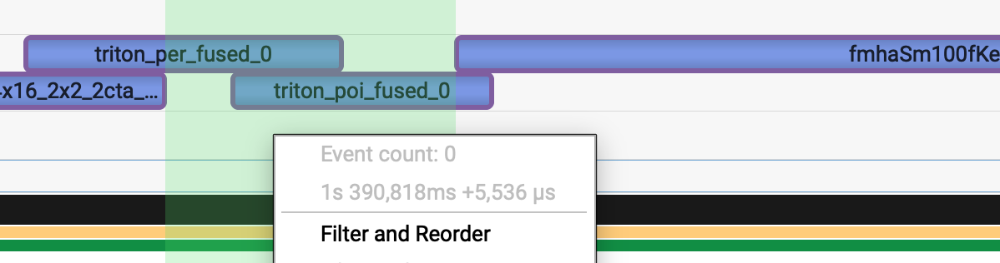
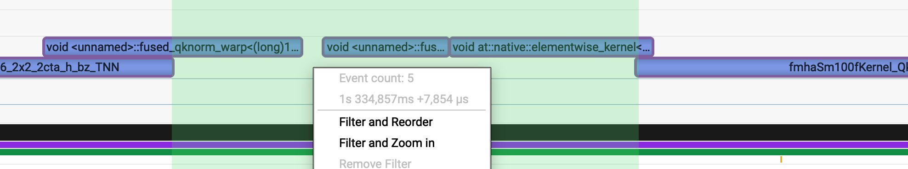
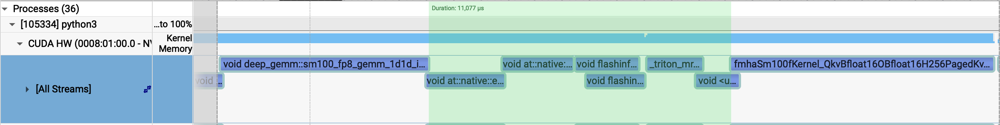
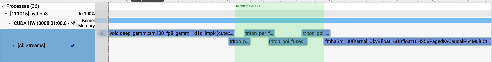

# Qwen — Inductor Compilation Profiles

## Common Setup

- **MoE backend:** auto (flashinfer\_trtllm)
- **Weights:** real (HuggingFace)
- **Dataset:** ShareGPT, output sequence length 8192
- **Device:** GB200
- **SGLang commit:** `cb8105fe282fc373b5baed63d5df38682418a373`
- **`sgl_kernel` version:** `0.3.21`
- **`torch` commit:** `cb8105fe282fc373b5baed63d5df38682418a373` (version nightly `2.12`)

## Common Notes

- Piecewise CUDA graphs are automatically disabled for these models due to the `flashinfer_trtllm` MoE backend, so baseline and Inductor configs run under the same conditions.
- `inductor[rope]` / `inductor[ropekv]` can fuse the KV-cache update into the rotary embedding graph, while standard SGLang must fire 2 separate kernels because the SWA KV-cache type prevents fusion. The `SWAKVPool` uses dual addressing — SWA layers write to `out_cache_loc_swa`, non-SWA layers to `out_cache_loc` — which the JIT rope kernel doesn't handle. Inductor compiles the pure-PyTorch `forward_native` path where this dual addressing is expressed as `index_put_` ops that get fused into the rope graph.
- **RMSNorm** is compiled with no dynamic shapes, so Inductor can specialize on the fixed decode batch sizes used by SGLang's CUDA graphs.
- **RotaryEmbedding** is compiled with dynamic shapes due to the KV-cache update (`index_put_` with variable `cache_loc`), which limits Inductor's ability to specialize and adds overhead.

---

# Qwen3-30B-A3B

- **Model:** `Qwen/Qwen3-30B-A3B`
- **Precision:** bf16
- **TP:** 1

## Notes

- `inductor[moe]` total time is misleading: prefill still uses the `triton_kernel` MoE backend, not `flashinfer_trtllm`.
- `inductor[rope-rmsnorm]` does **not** use Inductor for the pre-attention q,k normalization — only the rotary embedding and the layer-level RMSNorm are compiled.
- `inductor[qvnormropekv-rmsnorm]` compiles the full `QKNormRope` region — q/k normalization, rotary embedding, and KV-cache write — as a single fused Inductor graph, alongside the layer-level RMSNorm. This is the most comprehensive compilation scope, but the larger graph with dynamic shapes adds overhead that only amortizes at high concurrency.
- `inductor[ropekv-rmsnorm]` compiles the rotary embedding with KV-cache write (fused into a single Inductor graph) and the layer-level RMSNorm. Q/k normalization uses the custom kernel. Same compilation scope as `inductor[rope-rmsnorm]` but with naming that makes the KV-cache fusion explicit.
- `inductor[qvnorm-ropekv-rmsnorm]` splits the `QKNormRope` region into two separate Inductor graphs: one for q/k normalization (no dynamic shapes) and one for rope + KV-cache write (dynamic shapes). This reduces the scope of the dynamic-shape graph compared to the fully-fused `qvnormropekv` variant.

## `bench_offline_throughput`

```bash
python3 -m sglang.bench_offline_throughput \
  --model-path Qwen/Qwen3-30B-A3B \
  --trust-remote-code \
  --cuda-graph-bs <cg-bs> \
  --tp-size 1 \
  --sharegpt-output-len 8192 \
  --num-prompts <N> \
  --dataset-name sharegpt \
  --result-filename "" \
  [--enable-torch-compile --torch-compile-override-layers <layers> --torch-compile-scope local]
```

### 1 prompt, cuda-graph-bs 1

| Config | Output tok/s | Output tok/s vs Baseline | Total tok/s | Total tok/s vs Baseline |
|--------|-------------|--------------------------|-------------|------------------------|
| Baseline | 358 | — | 359 | — |
| Inductor — QKNormRopeKV + RMSNorm | 338 | −5.6% | 339 | −5.6% |
| Inductor — QKNorm + RopeKV + RMSNorm | 351 | −2.0% | 351 | −2.0% |
| Inductor — RotaryEmbedding + RMSNorm | 348 | −2.8% | 348 | −2.8% |
| Inductor — RotaryEmbedding | 360 | **+0.6%** | 361 | **+0.5%** |
| Inductor — RMSNorm | 346 | −3.4% | 347 | −3.3% |

### 32 prompts, cuda-graph-bs 32

| Config | Output tok/s | Output tok/s vs Baseline | Total tok/s | Total tok/s vs Baseline |
|--------|-------------|--------------------------|-------------|------------------------|
| Baseline | 3,319 | — | 3,447 | — |
| Inductor — QKNormRopeKV + RMSNorm | 3,297 | −0.7% | 3,424 | −0.7% |
| Inductor — QKNorm + RopeKV + RMSNorm | 3,377 | **+1.7%** | 3,507 | **+1.7%** |
| Inductor — RotaryEmbedding + RMSNorm | 3,427 | **+3.3%** | 3,558 | **+3.2%** |
| Inductor — RotaryEmbedding | 3,401 | **+2.5%** | 3,532 | **+2.5%** |
| Inductor — RMSNorm | 3,368 | **+1.5%** | 3,497 | **+1.5%** |

### 128 prompts, cuda-graph-bs 128

| Config | Output tok/s | Output tok/s vs Baseline | Total tok/s | Total tok/s vs Baseline |
|--------|-------------|--------------------------|-------------|------------------------|
| Baseline | 6,963 | — | 7,280 | — |
| Inductor — QKNormRopeKV + RMSNorm | 7,019 | **+0.8%** | 7,338 | **+0.8%** |
| Inductor — QKNorm + RopeKV + RMSNorm | 7,111 | **+2.1%** | 7,435 | **+2.1%** |
| Inductor — RotaryEmbedding + RMSNorm | 7,048 | **+1.2%** | 7,368 | **+1.2%** |
| Inductor — RotaryEmbedding | 7,030 | **+1.0%** | 7,350 | **+1.0%** |
| Inductor — RMSNorm | 6,958 | −0.1% | 7,274 | −0.1% |

### 256 prompts, cuda-graph-bs 256

| Config | Output tok/s | Output tok/s vs Baseline | Total tok/s | Total tok/s vs Baseline |
|--------|-------------|--------------------------|-------------|------------------------|
| Baseline | 7,316 | — | 7,589 | — |
| Inductor — RopeKV + RMSNorm | 7,366 | **+0.7%** | 7,640 | **+0.7%** |
| Inductor — QKNorm + RopeKV + RMSNorm | 7,353 | **+0.5%** | 7,627 | **+0.5%** |

### 512 prompts, cuda-graph-bs 512

| Config | Output tok/s | Output tok/s vs Baseline | Total tok/s | Total tok/s vs Baseline |
|--------|-------------|--------------------------|-------------|------------------------|
| Baseline | 7,450 | — | 7,736 | — |
| Inductor — QKNorm + RopeKV + RMSNorm | 7,566 | **+1.6%** | 7,857 | **+1.6%** |
| Inductor — RopeKV + RMSNorm | 7,521 | **+1.0%** | 7,810 | **+1.0%** |

### Summary

| Scenario | Config | Output tok/s | Output tok/s vs Baseline |
|----------|--------|-------------|------------------------|
| 1 prompt, cg-bs 1 | RotaryEmbedding | 360 | **+0.6%** |
| 1 prompt, cg-bs 1 | QKNorm + RopeKV + RMSNorm | 351 | −2.0% |
| 1 prompt, cg-bs 1 | RotaryEmbedding + RMSNorm | 348 | −2.8% |
| 1 prompt, cg-bs 1 | RMSNorm | 346 | −3.4% |
| 1 prompt, cg-bs 1 | QKNormRopeKV + RMSNorm | 338 | −5.6% |
| 32 prompts, cg-bs 32 | RotaryEmbedding + RMSNorm | 3,427 | **+3.3%** |
| 32 prompts, cg-bs 32 | RotaryEmbedding | 3,401 | **+2.5%** |
| 32 prompts, cg-bs 32 | QKNorm + RopeKV + RMSNorm | 3,377 | **+1.7%** |
| 32 prompts, cg-bs 32 | RMSNorm | 3,368 | **+1.5%** |
| 32 prompts, cg-bs 32 | QKNormRopeKV + RMSNorm | 3,297 | −0.7% |
| 128 prompts, cg-bs 128 | QKNorm + RopeKV + RMSNorm | 7,111 | **+2.1%** |
| 128 prompts, cg-bs 128 | RotaryEmbedding + RMSNorm | 7,048 | **+1.2%** |
| 128 prompts, cg-bs 128 | RotaryEmbedding | 7,030 | **+1.0%** |
| 128 prompts, cg-bs 128 | QKNormRopeKV + RMSNorm | 7,019 | **+0.8%** |
| 128 prompts, cg-bs 128 | RMSNorm | 6,958 | −0.1% |
| 256 prompts, cg-bs 256 | RopeKV + RMSNorm | 7,366 | **+0.7%** |
| 256 prompts, cg-bs 256 | QKNorm + RopeKV + RMSNorm | 7,353 | **+0.5%** |
| 512 prompts, cg-bs 512 | QKNorm + RopeKV + RMSNorm | 7,566 | **+1.6%** |
| 512 prompts, cg-bs 512 | RopeKV + RMSNorm | 7,521 | **+1.0%** |

At medium concurrency (B=32), the smaller-scope configs deliver clear gains: `RotaryEmbedding + RMSNorm` leads at **+3.2%** (3,447 → 3,558 tok/s), followed by `RotaryEmbedding` at **+2.5%**, `QKNorm + RopeKV + RMSNorm` at **+1.7%**, and `RMSNorm` at **+1.5%**. At high concurrency (B=128), `QKNorm + RopeKV + RMSNorm` leads at **+2.1%** (7,280 → 7,435 tok/s), followed by `RotaryEmbedding + RMSNorm` at **+1.2%**, `RotaryEmbedding` at **+1.0%**, and `QKNormRopeKV + RMSNorm` at **+0.8%**.

At B=256 both Inductor configs show modest gains: `RopeKV + RMSNorm` at **+0.7%** and `QKNorm + RopeKV + RMSNorm` at **+0.5%**. At B=512 the gains increase again, with `QKNorm + RopeKV + RMSNorm` leading at **+1.6%** (7,736 → 7,857 tok/s) and `RopeKV + RMSNorm` at **+1.0%**. The crossover between B=256 and B=512 — where `QKNorm + RopeKV + RMSNorm` overtakes `RopeKV + RMSNorm` — is consistent with the B=128 results and confirms that the broader compilation scope amortizes better at higher concurrency.

Splitting q/k normalization into a separate static-shape graph (`QKNorm + RopeKV + RMSNorm`) substantially improves over the fully-fused variant (`QKNormRopeKV + RMSNorm`): at B=1 the regression drops from −5.6% to −2.0%, at B=32 it flips from −0.7% to **+1.7%**, and at B=128+ it consistently leads. Nsys profiling confirms the mechanism: the fused Inductor graph reduces the number of kernel launches between the projection GEMM and the attention kernel by collapsing q/k normalization, rotary embedding, and KV-cache store into fewer kernels, shrinking the gap at higher batch sizes where launch overhead is more visible.

| Baseline | Inductor |
|---|---|
|  |  |

The baseline fires 3 kernels between the projection GEMM and `fmhaSm100fKernel`: one for fused q/k normalization, and two for rope + KV-cache store (split by an intermediate `contiguous` call). Inductor compiles this region into only 2 kernels, eliminating the extra launch.

`QKNorm + RopeKV + RMSNorm` is the best config at B=128 (+2.1%) and B=512 (+1.6%), and competitive at B=32, making it the recommended config for high-throughput serving. `RopeKV + RMSNorm` is a simpler alternative that leads at B=256 (+0.7%) and is close behind at B=512 (+1.0%). `RotaryEmbedding + RMSNorm` remains the best at B=32 and a strong all-round choice.

---

# Qwen3.5-35B-A3B-FP8

- **Model:** `Qwen/Qwen3.5-35B-A3B-FP8`
- **Precision:** FP8
- **TP:** 1
- **Attention backend:** `trtllm_mha` (as recommended by the [SGLang cookbook](https://docs.sglang.ai/))

## Notes

- These results use the `trtllm_mha` attention backend, as recommended by the SGLang cookbook.
- `inductor[reshape-qknorm-ropekv-gemmarmsnorm]` compiles the reshape, q/k normalization, rotary embedding with KV-cache write, and GemmaRMSNorm (the layer-level normalization used by Qwen3.5) as separate Inductor graphs. This is the broadest compilation scope tested on this model.
- Qwen3.5-35B-A3B-FP8 is a hybrid architecture with 40 decoder layers: only 10 are full attention layers (every 4th layer, `full_attention_interval=4`) and the remaining 30 are linear attention (GatedDeltaNet) layers. Inductor compilation targets only the full attention layers, so the optimized region covers just 25% of the decoder stack.

## `bench_offline_throughput`

```bash
python3 -m sglang.bench_offline_throughput \
  --model-path Qwen/Qwen3.5-35B-A3B-FP8 \
  --trust-remote-code \
  --cuda-graph-bs <cg-bs> \
  --tp-size 1 \
  --sharegpt-output-len <osl> \
  --num-prompts <N> \
  --dataset-name sharegpt \
  --attention-backend trtllm_mha \
  --result-filename "" \
  [--enable-torch-compile --torch-compile-override-layers <layers> --torch-compile-scope local]
```

### OSL 8192

#### 1 prompt, cuda-graph-bs 1

| Config | Output tok/s | Output tok/s vs Baseline | Total tok/s | Total tok/s vs Baseline |
|--------|-------------|--------------------------|-------------|------------------------|
| Baseline | 289 | — | 289 | — |
| Inductor — Reshape + QKNorm + RopeKV + GemmaRMSNorm | 294 | **+1.8%** | 294 | **+1.8%** |

#### 4 prompts, cuda-graph-bs 4

| Config | Output tok/s | Output tok/s vs Baseline | Total tok/s | Total tok/s vs Baseline |
|--------|-------------|--------------------------|-------------|------------------------|
| Baseline | 886 | — | 911 | — |
| Inductor — Reshape + QKNorm + RopeKV + GemmaRMSNorm | 911 | **+2.9%** | 937 | **+2.9%** |

#### 8 prompts, cuda-graph-bs 8

| Config | Output tok/s | Output tok/s vs Baseline | Total tok/s | Total tok/s vs Baseline |
|--------|-------------|--------------------------|-------------|------------------------|
| Baseline | 1,572 | — | 1,607 | — |
| Inductor — Reshape + QKNorm + RopeKV + GemmaRMSNorm | 1,594 | **+1.4%** | 1,629 | **+1.4%** |

#### 16 prompts, cuda-graph-bs 16

| Config | Output tok/s | Output tok/s vs Baseline | Total tok/s | Total tok/s vs Baseline |
|--------|-------------|--------------------------|-------------|------------------------|
| Baseline | 2,567 | — | 2,722 | — |
| Inductor — Reshape + QKNorm + RopeKV + GemmaRMSNorm | 2,616 | **+1.9%** | 2,774 | **+1.9%** |

#### 32 prompts, cuda-graph-bs 32

| Config | Output tok/s | Output tok/s vs Baseline | Total tok/s | Total tok/s vs Baseline |
|--------|-------------|--------------------------|-------------|------------------------|
| Baseline | 3,992 | — | 4,151 | — |
| Inductor — Reshape + QKNorm + RopeKV + GemmaRMSNorm | 3,914 | −2.0% | 4,069 | −2.0% |

#### 64 prompts, cuda-graph-bs 64

| Config | Output tok/s | Output tok/s vs Baseline | Total tok/s | Total tok/s vs Baseline |
|--------|-------------|--------------------------|-------------|------------------------|
| Baseline | 6,269 | — | 6,513 | — |
| Inductor — Reshape + QKNorm + RopeKV + GemmaRMSNorm | 6,303 | **+0.5%** | 6,548 | **+0.5%** |

#### 128 prompts, cuda-graph-bs 128

| Config | Output tok/s | Output tok/s vs Baseline | Total tok/s | Total tok/s vs Baseline |
|--------|-------------|--------------------------|-------------|------------------------|
| Baseline | 9,478 | — | 9,920 | — |
| Inductor — Reshape + QKNorm + RopeKV + GemmaRMSNorm | 9,549 | **+0.7%** | 9,994 | **+0.7%** |

#### 256 prompts, cuda-graph-bs 256

| Config | Output tok/s | Output tok/s vs Baseline | Total tok/s | Total tok/s vs Baseline |
|--------|-------------|--------------------------|-------------|------------------------|
| Baseline | 13,603 | — | 14,125 | — |
| Inductor — Reshape + QKNorm + RopeKV + GemmaRMSNorm | 13,702 | **+0.7%** | 14,227 | **+0.7%** |

#### 512 prompts, cuda-graph-bs 512

| Config | Output tok/s | Output tok/s vs Baseline | Total tok/s | Total tok/s vs Baseline |
|--------|-------------|--------------------------|-------------|------------------------|
| Baseline | 11,176 | — | 11,619 | — |
| Inductor — Reshape + QKNorm + RopeKV + GemmaRMSNorm | 11,233 | **+0.5%** | 11,678 | **+0.5%** |

### OSL 1024

#### 1 prompt, cuda-graph-bs 1

| Config | Output tok/s | Output tok/s vs Baseline | Total tok/s | Total tok/s vs Baseline |
|--------|-------------|--------------------------|-------------|------------------------|
| Baseline | 282 | — | 287 | — |
| Inductor — Reshape + QKNorm + RopeKV + GemmaRMSNorm | 287 | **+1.9%** | 292 | **+1.9%** |

#### 4 prompts, cuda-graph-bs 4

| Config | Output tok/s | Output tok/s vs Baseline | Total tok/s | Total tok/s vs Baseline |
|--------|-------------|--------------------------|-------------|------------------------|
| Baseline | 868 | — | 1,066 | — |
| Inductor — Reshape + QKNorm + RopeKV + GemmaRMSNorm | 884 | **+1.9%** | 1,086 | **+1.9%** |

#### 8 prompts, cuda-graph-bs 8

| Config | Output tok/s | Output tok/s vs Baseline | Total tok/s | Total tok/s vs Baseline |
|--------|-------------|--------------------------|-------------|------------------------|
| Baseline | 1,533 | — | 1,802 | — |
| Inductor — Reshape + QKNorm + RopeKV + GemmaRMSNorm | 1,565 | **+2.1%** | 1,839 | **+2.1%** |

#### 16 prompts, cuda-graph-bs 16

| Config | Output tok/s | Output tok/s vs Baseline | Total tok/s | Total tok/s vs Baseline |
|--------|-------------|--------------------------|-------------|------------------------|
| Baseline | 2,550 | — | 3,779 | — |
| Inductor — Reshape + QKNorm + RopeKV + GemmaRMSNorm | 2,443 | −4.2% | 3,621 | −4.2% |

#### 32 prompts, cuda-graph-bs 32

| Config | Output tok/s | Output tok/s vs Baseline | Total tok/s | Total tok/s vs Baseline |
|--------|-------------|--------------------------|-------------|------------------------|
| Baseline | 3,968 | — | 5,226 | — |
| Inductor — Reshape + QKNorm + RopeKV + GemmaRMSNorm | 3,906 | −1.6% | 5,145 | −1.6% |

#### 64 prompts, cuda-graph-bs 64

| Config | Output tok/s | Output tok/s vs Baseline | Total tok/s | Total tok/s vs Baseline |
|--------|-------------|--------------------------|-------------|------------------------|
| Baseline | 6,371 | — | 8,351 | — |
| Inductor — Reshape + QKNorm + RopeKV + GemmaRMSNorm | 6,335 | −0.6% | 8,304 | −0.6% |

#### 128 prompts, cuda-graph-bs 128

| Config | Output tok/s | Output tok/s vs Baseline | Total tok/s | Total tok/s vs Baseline |
|--------|-------------|--------------------------|-------------|------------------------|
| Baseline | 9,798 | — | 13,453 | — |
| Inductor — Reshape + QKNorm + RopeKV + GemmaRMSNorm | 9,892 | **+1.0%** | 13,582 | **+1.0%** |

#### 256 prompts, cuda-graph-bs 256

| Config | Output tok/s | Output tok/s vs Baseline | Total tok/s | Total tok/s vs Baseline |
|--------|-------------|--------------------------|-------------|------------------------|
| Baseline | 14,601 | — | 19,081 | — |
| Inductor — Reshape + QKNorm + RopeKV + GemmaRMSNorm | 14,723 | **+0.8%** | 19,240 | **+0.8%** |

#### 512 prompts, cuda-graph-bs 512

| Config | Output tok/s | Output tok/s vs Baseline | Total tok/s | Total tok/s vs Baseline |
|--------|-------------|--------------------------|-------------|------------------------|
| Baseline | 18,256 | — | 24,045 | — |
| Inductor — Reshape + QKNorm + RopeKV + GemmaRMSNorm | 18,419 | **+0.9%** | 24,259 | **+0.9%** |

### Summary

| OSL | Scenario | Config | Output tok/s | Output tok/s vs Baseline |
|-----|----------|--------|-------------|------------------------|
| 8192 | 1 prompt, cg-bs 1 | Reshape + QKNorm + RopeKV + GemmaRMSNorm | 294 | **+1.8%** |
| 8192 | 4 prompts, cg-bs 4 | Reshape + QKNorm + RopeKV + GemmaRMSNorm | 911 | **+2.9%** |
| 8192 | 8 prompts, cg-bs 8 | Reshape + QKNorm + RopeKV + GemmaRMSNorm | 1,594 | **+1.4%** |
| 8192 | 16 prompts, cg-bs 16 | Reshape + QKNorm + RopeKV + GemmaRMSNorm | 2,616 | **+1.9%** |
| 8192 | 32 prompts, cg-bs 32 | Reshape + QKNorm + RopeKV + GemmaRMSNorm | 3,914 | −2.0% |
| 8192 | 64 prompts, cg-bs 64 | Reshape + QKNorm + RopeKV + GemmaRMSNorm | 6,303 | **+0.5%** |
| 8192 | 128 prompts, cg-bs 128 | Reshape + QKNorm + RopeKV + GemmaRMSNorm | 9,549 | **+0.7%** |
| 8192 | 256 prompts, cg-bs 256 | Reshape + QKNorm + RopeKV + GemmaRMSNorm | 13,702 | **+0.7%** |
| 8192 | 512 prompts, cg-bs 512 | Reshape + QKNorm + RopeKV + GemmaRMSNorm | 11,233 | **+0.5%** |
| 1024 | 1 prompt, cg-bs 1 | Reshape + QKNorm + RopeKV + GemmaRMSNorm | 287 | **+1.9%** |
| 1024 | 4 prompts, cg-bs 4 | Reshape + QKNorm + RopeKV + GemmaRMSNorm | 884 | **+1.9%** |
| 1024 | 8 prompts, cg-bs 8 | Reshape + QKNorm + RopeKV + GemmaRMSNorm | 1,565 | **+2.1%** |
| 1024 | 16 prompts, cg-bs 16 | Reshape + QKNorm + RopeKV + GemmaRMSNorm | 2,443 | −4.2% |
| 1024 | 32 prompts, cg-bs 32 | Reshape + QKNorm + RopeKV + GemmaRMSNorm | 3,906 | −1.6% |
| 1024 | 64 prompts, cg-bs 64 | Reshape + QKNorm + RopeKV + GemmaRMSNorm | 6,335 | −0.6% |
| 1024 | 128 prompts, cg-bs 128 | Reshape + QKNorm + RopeKV + GemmaRMSNorm | 9,892 | **+1.0%** |
| 1024 | 256 prompts, cg-bs 256 | Reshape + QKNorm + RopeKV + GemmaRMSNorm | 14,723 | **+0.8%** |
| 1024 | 512 prompts, cg-bs 512 | Reshape + QKNorm + RopeKV + GemmaRMSNorm | 18,419 | **+0.9%** |

Inductor compilation shows consistent gains at low concurrency (B=1–8) across both OSLs, peaking at **+2.9%** (OSL=8192, B=4) and **+2.1%** (OSL=1024, B=8). At high concurrency (B=128–512) the gains are smaller but still positive, ranging from **+0.5%** to **+1.0%**. A dip appears at medium concurrency (B=16–32 for OSL=1024, B=32 for OSL=8192), where the Inductor config shows regressions of up to −4.2% (OSL=1024, B=16) and −2.0% (OSL=8192, B=32).

The kernels targeted by Inductor (reshape, q/k normalization, rotary embedding, KV-cache store, GemmaRMSNorm) are **memory-bound**. Inductor reduces total kernel launch count by fusing these operations into fewer graphs. At higher concurrency the attention and MoE kernels — which are **compute-bound** — grow larger and become the dominant bottleneck of decode execution, so the memory-bound region we optimize contributes a shrinking fraction of overall latency. This explains why the end-to-end gains taper from ~2–3% at low B to ~0.5–1% at high B.

Nsys profiling at B=1 confirms the mechanism: the latency of the targeted region between the projection GEMM (`deep_gemm`) and the attention kernel (`fmhaSm100fKernel`) drops by ~50% (11,077 μs → 5,231 μs).

| Baseline | Inductor |
|---|---|
|  |  |

The baseline fires multiple separate kernels for the reshape, q/k normalization, rotary embedding, and KV-cache store. Inductor compiles these into fewer fused Triton kernels, eliminating intermediate launches and reducing the gap between the two compute-bound bookends.
