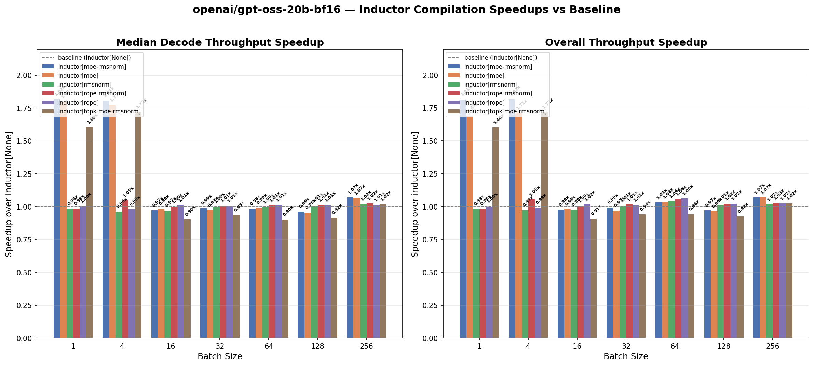

# openai/gpt-oss-20b-bf16 — Inductor Compilation Profile

## Setup

- **Model:** `lmsys/gpt-oss-20b-bf16`
- **MoE backend:** auto (triton\_kernel)
- **Weights:** real (HuggingFace)
- **Dataset:** ShareGPT, output sequence length 8192
- **TP:** 1
- **Device:** GB200
- **SGLang commit:**: `cb8105fe282fc373b5baed63d5df38682418a373`
- **`sgl_kernel` version:**: `0.3.21` 
- **`torch` commit:**: `cb8105fe282fc373b5baed63d5df38682418a373` (version nightly `2.12`)

## Notes

- The auto MoE backend for this model resolves to `triton_kernel`. This means Inductor-compiled MoE can substantially outperform the baseline at small batch sizes.
- `inductor[moe]` replaces the `triton_kernel` MoE with Inductor-generated code, yielding large speedups at bs=1–4.
- `inductor[topk-moe-rmsnorm]` combines top-k gating + MoE + RMSNorm compilation.
- `inductor[rope]` can fuse the KV-cache update into the rotary embedding graph, while standard SGLang must fire 2 separate kernels because the SWA KV-cache type prevents fusion. The `SWAKVPool` uses dual addressing — SWA layers write to `out_cache_loc_swa`, non-SWA layers to `out_cache_loc` — which the JIT rope kernel doesn't handle. Inductor compiles the pure-PyTorch `forward_native` path where this dual addressing is expressed as `index_put_` ops that get fused into the rope graph.
- **RMSNorm** is compiled with no dynamic shapes, so Inductor can specialize on the fixed decode batch sizes used by SGLang's CUDA graphs. This means efficient code with only slightly higher startup times.
- **RotaryEmbedding** is compiled with dynamic shapes due to the KV-cache update (`index_put_` with variable `cache_loc`), which limits Inductor's ability to specialize and adds overhead.

## bench\_one\_batch Speedup Charts

The charts below were generated with `bench_one_batch.py`, which measures raw single-batch latency and throughput at various batch sizes (1, 4, 16, 32, 64, 128, 256) with input length 1024 and output length 8192. The baseline is `inductor[None]` (no Inductor compilation).

```bash
python profiles/plot_speedup.py profiles/openai/gpt-oss-20b-bf16
```



**Key observations:**
- `inductor[moe]` and `inductor[moe-rmsnorm]` deliver ~1.80x decode throughput at bs=1 and ~1.77x at bs=4, thanks to replacing the `triton_kernel` MoE backend with Inductor-compiled code.
- The MoE compilation advantage diminishes at larger batch sizes (16+), where all configs converge near 1.0x.
- `inductor[rmsnorm]`, `inductor[rope-rmsnorm]`, and `inductor[rope]` stay at parity (~0.98–1.01x) across all batch sizes.
- `inductor[rope]` shows a small ~1.07x decode speedup at bs=256.

## bench\_offline\_throughput (Real Engine)

These benchmarks use `bench_offline_throughput.py`, which runs the full SGLang engine (scheduler, radix cache, continuous batching) to better reflect production serving performance.

```bash
python3 -m sglang.bench_offline_throughput \
  --model-path openai/gpt-oss-20b-bf16 \
  --trust-remote-code \
  --cuda-graph-bs <cg-bs> \
  --tp-size 1 \
  --sharegpt-output-len 8192 \
  --num-prompts <N> \
  --dataset-name sharegpt \
  --result-filename "" \
  [--disable-piecewise-cuda-graph] \
  [--enable-torch-compile --torch-compile-override-layers <layers> --torch-compile-scope local]
```

**Baseline note:** Enabling `--enable-torch-compile` currently disables piecewise CUDA graphs automatically. Since total throughput includes prefill time, the baseline uses `--disable-piecewise-cuda-graph` for a fair comparison. The "with piecewise CG" row shows the production default — once piecewise CG is supported alongside torch.compile, Inductor configs will also benefit from it (piecewise CG only affects prefill, while Inductor compilation targets the decode graph).

### 1 prompt, cuda-graph-bs 1

| Config | Output tok/s | Total tok/s | Total tok/s vs Baseline |
|--------|-------------|-------------|------------------------|
| with piecewise CG | 181 | 181 | — |
| Baseline (no piecewise CG) | 179 | 179 | — |
| Inductor — RotaryEmbedding + RMSNorm | 176 | 176 | −1.7% |
| Inductor — RotaryEmbedding | 182 | 182 | **+1.7%** |
| Inductor — RMSNorm | 182 | 182 | **+1.4%** |

### 32 prompts, cuda-graph-bs 32

| Config | Output tok/s | Total tok/s | Total tok/s vs Baseline |
|--------|-------------|-------------|------------------------|
| with piecewise CG | 4,793 | 4,974 | — |
| Baseline (no piecewise CG) | 4,644 | 4,820 | — |
| Inductor — RotaryEmbedding + RMSNorm | 4,864 | 5,048 | **+4.7%** |
| Inductor — RotaryEmbedding | 4,854 | 5,038 | **+4.5%** |
| Inductor — RMSNorm | 4,851 | 5,035 | **+4.5%** |

### 128 prompts, cuda-graph-bs 128

| Config | Output tok/s | Total tok/s | Total tok/s vs Baseline |
|--------|-------------|-------------|------------------------|
| with piecewise CG | 12,229 | 12,773 | — |
| Baseline (no piecewise CG) | 11,711 | 12,232 | — |
| Inductor — RotaryEmbedding + RMSNorm | 11,691 | 12,211 | −0.2% |
| Inductor — RotaryEmbedding | 12,139 | 12,679 | **+3.6%** |
| Inductor — RMSNorm | 12,131 | 12,670 | **+3.6%** |

### Summary

| Scenario | Config | Total tok/s | Total tok/s vs Baseline |
|----------|--------|-------------|------------------------|
| 1 prompt, cg-bs 1 | RotaryEmbedding + RMSNorm | 176 | −1.7% |
| 1 prompt, cg-bs 1 | RotaryEmbedding | 182 | **+1.7%** |
| 1 prompt, cg-bs 1 | RMSNorm | 182 | **+1.4%** |
| 32 prompts, cg-bs 32 | RotaryEmbedding + RMSNorm | 5,048 | **+4.7%** |
| 32 prompts, cg-bs 32 | RotaryEmbedding | 5,038 | **+4.5%** |
| 32 prompts, cg-bs 32 | RMSNorm | 5,035 | **+4.5%** |
| 128 prompts, cg-bs 128 | RotaryEmbedding + RMSNorm | 12,211 | −0.2% |
| 128 prompts, cg-bs 128 | RotaryEmbedding | 12,679 | **+3.6%** |
| 128 prompts, cg-bs 128 | RMSNorm | 12,670 | **+3.6%** |

Against the fair baseline (no piecewise CG), individual Inductor compilation shows consistent gains: **+1.4–1.7%** at B=1, **+4.5%** at B=32, and **+3.6%** at B=128 for both `RotaryEmbedding` and `RMSNorm` alone. The combined `RotaryEmbedding + RMSNorm` config still underperforms the individual ones (−1.7% at B=1, −0.2% at B=128), though it leads at B=32 (+4.7%).
