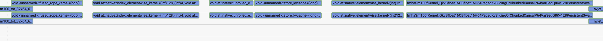
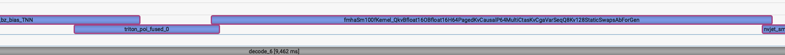

# openai/gpt-oss — Inductor Compilation Profiles

## Common Setup

- **MoE backend:** `auto`
- **Weights:** real
- **Dataset:** ShareGPT, output sequence length 8192
- **Device:** GB200
- **SGLang commit:** `cb8105fe282fc373b5baed63d5df38682418a373`
- **`sgl_kernel` version:** `0.3.21`
- **`torch` commit:** `cb8105fe282fc373b5baed63d5df38682418a373` (version nightly `2.12`)

## Common Notes

- The auto MoE backend for gpt-oss models resolves to `triton_kernel`. This means Inductor-compiled MoE can substantially outperform the baseline at small batch sizes.
- `inductor[rope]` can fuse the KV-cache update into the rotary embedding graph, while standard SGLang must fire 2 separate kernels because the SWA KV-cache type prevents fusion. The `SWAKVPool` uses dual addressing — SWA layers write to `out_cache_loc_swa`, non-SWA layers to `out_cache_loc` — which the JIT rope kernel doesn't handle. Inductor compiles the pure-PyTorch `forward_native` path where this dual addressing is expressed as `index_put_` ops that get fused into the rope graph.
- **RMSNorm** is compiled with no dynamic shapes, so Inductor can specialize on the fixed decode batch sizes used by SGLang's CUDA graphs. This means efficient code with only slightly higher startup times.
- **RotaryEmbedding** is compiled with dynamic shapes due to the KV-cache update (`index_put_` with variable `cache_loc`), which limits Inductor's ability to specialize and adds overhead.

---

# gpt-oss-20b-bf16

- **Model:** `lmsys/gpt-oss-20b-bf16`
- **Precision:** bf16
- **TP:** 1

## `bench_offline_throughput`

```bash
python3 -m sglang.bench_offline_throughput \
  --model-path openai/gpt-oss-20b-bf16 \
  --trust-remote-code \
  --cuda-graph-bs <cg-bs> \
  --tp-size 1 \
  --sharegpt-output-len 8192 \
  --num-prompts <N> \
  --dataset-name sharegpt \
  --result-filename "" \
  [--disable-piecewise-cuda-graph] \
  [--enable-torch-compile --torch-compile-override-layers <layers> --torch-compile-scope local]
```

**Baseline note:** Enabling `--enable-torch-compile` currently disables piecewise CUDA graphs automatically. Since total throughput includes prefill time, the baseline uses `--disable-piecewise-cuda-graph` for a fair comparison. The "with piecewise CG" row shows the production default — once piecewise CG is supported alongside torch.compile, Inductor configs will also benefit from it (piecewise CG only affects prefill, while Inductor compilation targets the decode graph).

### 1 prompt, cuda-graph-bs 1

| Config | Output tok/s | Total tok/s | Total tok/s vs Baseline |
|--------|-------------|-------------|------------------------|
| with piecewise CG | 181 | 181 | — |
| Baseline (no piecewise CG) | 179 | 179 | — |
| Inductor — RotaryEmbedding + RMSNorm | 176 | 176 | −1.7% |
| Inductor — RotaryEmbedding | 182 | 182 | **+1.7%** |
| Inductor — RMSNorm | 182 | 182 | **+1.4%** |

### 32 prompts, cuda-graph-bs 32

| Config | Output tok/s | Total tok/s | Total tok/s vs Baseline |
|--------|-------------|-------------|------------------------|
| with piecewise CG | 4,793 | 4,974 | — |
| Baseline (no piecewise CG) | 4,644 | 4,820 | — |
| Inductor — RotaryEmbedding + RMSNorm | 4,864 | 5,048 | **+4.7%** |
| Inductor — RotaryEmbedding | 4,854 | 5,038 | **+4.5%** |
| Inductor — RMSNorm | 4,851 | 5,035 | **+4.5%** |

### 128 prompts, cuda-graph-bs 128

| Config | Output tok/s | Total tok/s | Total tok/s vs Baseline |
|--------|-------------|-------------|------------------------|
| with piecewise CG | 12,229 | 12,773 | — |
| Baseline (no piecewise CG) | 11,711 | 12,232 | — |
| Inductor — RotaryEmbedding + RMSNorm | 11,763 | 12,286 | **+0.4%** |
| Inductor — RotaryEmbedding | 12,234 | 12,778 | **+4.5%** |
| Inductor — RMSNorm | 12,110 | 12,649 | **+3.4%** |

### Summary

| Scenario | Config | Total tok/s | Total tok/s vs Baseline |
|----------|--------|-------------|------------------------|
| 1 prompt, cg-bs 1 | RotaryEmbedding + RMSNorm | 176 | −1.7% |
| 1 prompt, cg-bs 1 | RotaryEmbedding | 182 | **+1.7%** |
| 1 prompt, cg-bs 1 | RMSNorm | 182 | **+1.4%** |
| 32 prompts, cg-bs 32 | RotaryEmbedding + RMSNorm | 5,048 | **+4.7%** |
| 32 prompts, cg-bs 32 | RotaryEmbedding | 5,038 | **+4.5%** |
| 32 prompts, cg-bs 32 | RMSNorm | 5,035 | **+4.5%** |
| 128 prompts, cg-bs 128 | RotaryEmbedding + RMSNorm | 12,286 | **+0.4%** |
| 128 prompts, cg-bs 128 | RotaryEmbedding | 12,778 | **+4.5%** |
| 128 prompts, cg-bs 128 | RMSNorm | 12,649 | **+3.4%** |

Against the fair baseline (no piecewise CG), individual Inductor compilation shows consistent gains: **+1.4–1.7%** at B=1, **+4.5%** at B=32, and **+3.4–4.5%** at B=128 for `RotaryEmbedding` and `RMSNorm` alone. The combined `RotaryEmbedding + RMSNorm` config underperforms the individual ones at B=1 (−1.7%) but shows gains at B=32 (**+4.7%**) and B=128 (**+0.4%**).

---

# gpt-oss-120b (mxfp4)

- **Model:** `openai/gpt-oss-120b`
- **Precision:** mxfp4
- **TP:** 4

## `bench_offline_throughput`

```bash
python3 -m sglang.bench_offline_throughput \
  --model-path openai/gpt-oss-120b \
  --trust-remote-code \
  --cuda-graph-bs <cg-bs> \
  --tp-size 4 \
  --sharegpt-output-len 8192 \
  --num-prompts <N> \
  --dataset-name sharegpt \
  --result-filename "" \
  [--enable-torch-compile --torch-compile-override-layers RotaryEmbedding --torch-compile-scope local]
```

**Baseline note:** Piecewise CUDA graphs are not used in either baseline or Inductor configs for this model.

### 1 prompt, cuda-graph-bs 1

| Config | Output tok/s | Total tok/s | Total tok/s vs Baseline |
|--------|-------------|-------------|------------------------|
| Baseline | 448 | 449 | — |
| Inductor — RotaryEmbedding | 471 | 472 | **+5.1%** |

### 32 prompts, cuda-graph-bs 32

| Config | Output tok/s | Total tok/s | Total tok/s vs Baseline |
|--------|-------------|-------------|------------------------|
| Baseline | 8,844 | 9,178 | — |
| Inductor — RotaryEmbedding | 9,467 | 9,826 | **+7.1%** |

### 128 prompts, cuda-graph-bs 128

| Config | Output tok/s | Total tok/s | Total tok/s vs Baseline |
|--------|-------------|-------------|------------------------|
| Baseline | 20,150 | 21,046 | — |
| Inductor — RotaryEmbedding | 21,810 | 22,780 | **+8.2%** |

### Summary

| Scenario | Config | Total tok/s | Total tok/s vs Baseline |
|----------|--------|-------------|------------------------|
| 1 prompt, cg-bs 1 | RotaryEmbedding | 472 | **+5.1%** |
| 32 prompts, cg-bs 32 | RotaryEmbedding | 9,826 | **+7.1%** |
| 128 prompts, cg-bs 128 | RotaryEmbedding | 22,780 | **+8.2%** |

Inductor compilation of `RotaryEmbedding` delivers consistent and significant gains on the 120b mxfp4 model: **+5.1%** at B=1, **+7.1%** at B=32, and **+8.2%** at B=128. The larger model benefits more from the rope KV-cache fusion than the 20b variant, likely because the per-layer overhead of the 2-kernel SWA workaround is proportionally larger relative to the faster mxfp4 compute.

### Nsys Kernel Traces

The nsys profiles below show a single decode step, confirming the kernel fusion at the GPU level.

**Baseline (no Inductor):**



The baseline fires multiple separate kernels per layer: `fused_rope_kernel` (rope only), then ATen `index_put_` kernels (`at::native::index_elementwise_kernel`, `at::native::unrolled_e...`) for the SWA KV-cache addressing, followed by `store_kvcache` (the actual KV-cache write), and finally the attention kernel (`fmhaSm100Kernel`). The multi-kernel rope + KV-cache pattern is clearly visible for each layer.

**Inductor — RotaryEmbedding:**



With Inductor, the separate `fused_rope_kernel` + ATen index kernels + `store_kvcache` are all replaced by a single fused Triton kernel (`triton_poi_fused_0`) that performs rope and KV-cache write in one pass. This eliminates multiple kernel launches and memory round-trips per layer, directly explaining the throughput gains.
