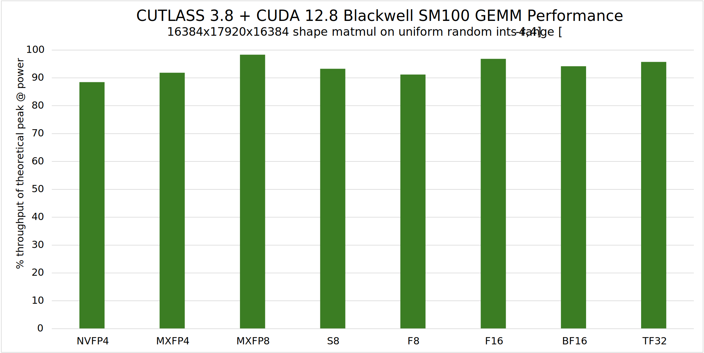

# Overview

# CUTLASS 4.2.1

_CUTLASS 4.2.1 - Sept 2025_

CUTLASS is a collection of abstractions for implementing high-performance matrix-matrix multiplication (GEMM)
and related computations at all levels and scales within CUDA. It incorporates strategies for
hierarchical decomposition and data movement. CUTLASS decomposes these "moving parts" into reusable, modular
software components and abstractions.

Primitives for different levels of a conceptual parallelization hierarchy can be specialized and tuned
via custom tiling sizes, data types, and other algorithmic policy. The resulting flexibility simplifies
their use as building blocks within custom kernels and applications.

CUTLASS has been providing CUDA C++ template abstractions for high-performance linear algebra since 2017 and
these abstractions provide extensive support for a wide range of computations including
mixed-precision computations, specialized data-movement (async copy) and
multiply-accumulate abstractions for FP64, FP32, TF32, FP16, BF16,
[FP32 emulation via tensor core instruction](https://github.com/NVIDIA/cutlass/tree/main/examples/27_ampere_3xtf32_fast_accurate_tensorop_gemm),
 8b floating point types (e5m2 and e4m3),
 block scaled data types (NVIDIA NVFP4 and OCP standard MXFP4, MXFP6, MXFP8),
 narrow integer types (4 and 8b signed and unsigned integers),
 and binary 1b data types (where architectures allow for the
native support of such data types) across NVIDIA's Volta, Turing, Ampere, Ada, Hopper, and Blackwell architectures.

To this rich ecosystem of C++ based kernel programming abstractions, CUTLASS 4 adds CUTLASS DSLs. These are Python native interfaces for writing high-performance CUDA kernels based on core CUTLASS and CuTe concepts without any performance compromises. This allows for a much smoother learning curve, orders of magnitude faster compile times, native integration with DL frameworks without writing glue code, and much more intuitive metaprogramming that does not require deep C++ expertise.

Overall we envision CUTLASS DSLs as a family of domain-specific languages (DSLs). With the release of 4.0, we are releasing the first of these in CuTe DSL. This is a low level programming model that is fully consistent with CuTe C++ abstractions -- exposing core concepts such as layouts, tensors, hardware atoms, and full control over the hardware thread and data hierarchy.

CuTe DSL demonstrates optimal matrix multiply and other linear algebra operations
targeting the programmable, high-throughput _Tensor Cores_ implemented by
NVIDIA's Ampere, Hopper, and Blackwell architectures.

We believe it will become an indispensable tool for students, researchers, and performance
engineers alike -- flattening the learning curve of GPU programming, rapidly prototyping kernel
designs, and bringing optimized solutions into production.

CuTe DSL is currently in public beta and will graduate out of beta by end of summer 2025.

To get started quickly - please refer :
  - [CUTLASS C++ Quick Start Guide](https://docs.nvidia.com/cutlass/media/docs/cpp/quickstart.html).
  - [CuTe DSL Quick Start Guide](https://docs.nvidia.com/cutlass/media/docs/pythonDSL/quick_start.html).

# What's New in CUTLASS 4.2

## CuTe DSL
* More Python versions are now supported for both x86-64 and aarch64, including
    - Python 3.10, 3.11, 3.12, and 3.13
* Added new example and updated notebook to get started with CuTe DSL
    - [Call kernels with dlpack bypassed](https://github.com/NVIDIA/cutlass/tree/main/examples/python/CuTeDSL/ampere/call_bypass_dlpack.py)
    - Updates on [TensorSSA demonstration](https://github.com/NVIDIA/cutlass/tree/main/examples/python/CuTeDSL/notebooks/tensorssa.ipynb)
      + Added a section for introducing the broadcast
* API updates
    - Please refer to [DSL API changelog](https://docs.nvidia.com/cutlass/media/docs/pythonDSL/cute_dsl_api/changelog.html) for details
* Bug fixings and improvements
    - Fixed ``cute.print_tensor`` for coordinate tensor
    - Fixed `cute.print` for tuple of layouts
    - Fixed frozen object is not properly updated after fully assigned in dynamic control flow
    - Fixed assign tuple/list element in a dynamic control flow may cause compilation failure
    - Improved error message when CUDA context is not initialized
    - Improved docstring of congruent and weakly_congruent

## CUTLASS C++
* Support for Blackwell SM103 kernels for B300 GPUs.
    - Collective mainloop codes: [Blockscaled datatypes with support for dense GEMM mainloop](https://github.com/NVIDIA/cutlass/tree/main/include/cutlass/gemm/collective/sm103_blockscaled_mma_warpspecialized.hpp)
    - New [GEMM](https://github.com/NVIDIA/cutlass/tree/main/include/cutlass/gemm/dispatch_policy.hpp) and [epilogue](https://github.com/NVIDIA/cutlass/tree/main/include/cutlass/epilogue/dispatch_policy.hpp) dispatch policies for collectives, kernel layers, and builders.
    - Kernel codes: [Blockscaled datatypes with support for dense GEMM kernel](https://github.com/NVIDIA/cutlass/tree/main/include/cutlass/gemm/kernel/sm103_blockscaled_gemm_tma_warpspecialized.hpp).
* Set of examples that demonstrate the usage of the 3.x API for targeting Blackwell SM103 architecture:
    - [Blockscaled ultra fp4 dense GEMM](https://github.com/NVIDIA/cutlass/tree/main/examples/89_sm103_fp4_ultra_gemm/).
    - [Blockscaled ultra fp4 dense grouped GEMM](https://github.com/NVIDIA/cutlass/tree/main/examples/90_sm103_fp4_ultra_grouped_gemm).
* Set of unit tests that demonstrate the usage of Blackwell SM103 blockscaled GEMM
    - Unit test files with prefix name of `sm103_` under [GEMM device unit tests](https://github.com/NVIDIA/cutlass/tree/main/test/unit/gemm/device/).
* Support for Blackwell SM121 kernels for DGX Spark GPUs.
    - Share the major codes with Blackwell SM120 kernels.
* Add support for heuristics-based kernel filtering and autotuning using `nvidia-matmul-heuristics` to find the best kernels for a given scenario.
    - Details please refer to [heuristics doc](https://github.com/NVIDIA/cutlass/tree/main/media/docs/cpp/heuristics.md).
* Further enhance Blackwell SM100 Attention kernels in [example 77](https://github.com/NVIDIA/cutlass/tree/main/examples/77_blackwell_fmha/).
    - Add fused reduction kernel support for cutlass MLA.
    - Add softmax skip correction.
    - Support for GQA in FMHA backward kernel.
    - Fix an issue where `get_unmasked_trip_count` may return a negative value.
    - Fix an issue where mbarriers are initialized with a zero arrival count.
    - Fix a corner case issue where the sequence length of q is not a multiple of tile_q.
    - Remove tma padding for forward kernel inputs.
* Add Blackwell SM100 kernels for MoEs (focusing on Low-Latency inference performance): [example 92](https://github.com/NVIDIA/cutlass/tree/main/examples/92_blackwell_moe_gemm/).  It uses TMA (for weights) and CPASYNC (for tokens) to load input matrices and allow only one problem dimension to vary across groups/experts, unlike general Grouped GEMMs.  Note: further API simplifications and kernel improvements are upcoming. Any feedback on API is welcome.
* Further enhance blockwise and groupwise GEMMs on Hopper and Blackwell
    - On Blackwell SM120, a blockwise gemm kernel is added: [example 87](https://github.com/NVIDIA/cutlass/tree/main/examples/87_blackwell_geforce_gemm_blockwise/).
    - On Hopper, add K major scale factor support for SM90 blockwise kernels.
    - On Hopper, relax the restriction that the k dimension of the problem size has to be the multiple of the k dimension of the tile size.
    - On Hopper, grouped version supports the case when k = 0.
* Support for Blackwell SM100 fp4 gemv kernels.
    - Kernel codes: [Gemv kernel](https://github.com/NVIDIA/cutlass/tree/main/include/cutlass/gemm/kernel/gemv_blockscaled.h).
    - Example codes: [example 91](https://github.com/NVIDIA/cutlass/tree/main/examples/91_fp4_gemv/)
* Support for Blackwell SM100 legacy mixed input GEMM kernels.
    - Collective mainloop codes: [Mixed input mainloop](https://github.com/NVIDIA/cutlass/tree/main/include/cutlass/gemm/collective/sm100_mma_warpspecialized_mixed_input.hpp).
    - Kernel codes: [Mixed input kernel](https://github.com/NVIDIA/cutlass/tree/main/include/cutlass/gemm/kernel/sm100_gemm_tma_warpspecialized_mixed_input_transform.hpp).
    - Example codes: [example 86](https://github.com/NVIDIA/cutlass/tree/main/examples/86_blackwell_mixed_dtype_gemm/).
* Support for Blackwell SM100 cpasync kernel.
    - Collective mainloop codes: [cpasync mainloop](https://github.com/NVIDIA/cutlass/tree/main/include/cutlass/gemm/collective/sm100_mma_cpasync_warpspecialized.hpp).
    - Kernel codes: [cpasync kernel](https://github.com/NVIDIA/cutlass/tree/main/include/cutlass/gemm/kernel/sm100_gemm_cpasync_warpspecialized.hpp).
* Support Blackwell SM120 mixed input blockscaled grouped GEMM.
* Instantiating more Blackwell kernels in profiler.
    - Blackwell SM100 and SM103 kernels support `CUTLASS_LIBRARY_INSTANTIATION_LEVEL` to instantiate all possible combinations.
    - To use this feature, `CUTLASS_LIBRARY_KERNELS` must be non-empty. Profiler will combine `CUTLASS_LIBRARY_KERNELS` and `CUTLASS_LIBRARY_INSTANTIATION_LEVEL` to instantiate specific kernels.
    - Details please check [Profiler Doc](https://github.com/NVIDIA/cutlass/tree/main/media/docs/cpp/profiler.md).
* Fix some profiler issues:
    - Modify default cluster callback values to none 0 to avoid profiler failure when these values are not set in command line.
    - Fix some no output and timeout issues.
    - Fix Pingpong Blockwise Hopper library generation.
* From CUDA 13.0, the Blackwell SM101 for Thor GPUs is renamed to SM110.
    - For CUDA toolkit version < 13.0, SM101 is still used for Thor GPUs.
    - For CUDA toolkit version >= 13.0, SM110 is used for Thor GPUs and SM101 is no longer valid.
* Rename legacy Python API package from `cutlass` to `cutlass_cppgen` and add Blackwell EVT support to legacy Python interface.
    - Restructuring the C++ Blackwell SM100 Collective Epilogue Builder to work with the Python interface's `EpilogueDescriptors`.
    - Added Blackwell SM100 EVT Emitter on the Python side and routed most emission through Hopper SM90 Emitter.
    - Added some support for running SM100 kernels via the Python interface.
* CuTe changes:
    - Fix inaccurate GridDim calculation under [CuTe tutorial](https://github.com/NVIDIA/cutlass/tree/main/examples/cute/tutorial/blackwell/).
    - Add [movmatrix](https://docs.nvidia.com/cuda/parallel-thread-execution/index.html#warp-level-matrix-instructions-movmatrix) support.
    - Fix smallest MMA-N allowed for Blackwell fp8 and fp16 gemm kernels.
    - Support fp16 accmulator for sm89 fp8 mma.
    - Shorten `nullspace` implementation.
    - Isolate and comment on `cosize` hacks.
    - Important documentation correction: `E<0,1> == 1@0@1`.
* Fix some kernel issues:
    - Fix Hopper SM90 group gemm kernel to only use the commit group and wait group instead of also waiting on mbarriers.
    - Fix a tiny bug when K is large for Blackwell SM103 fp4 grouped GEMM kernel.
* Add following unit tests:
    - [fp16 accmulator for sm89 fp8 mma](https://github.com/NVIDIA/cutlass/tree/main/test/unit/cute/ampere/cooperative_gemm.cu)
    - [movmatrix test](https://github.com/NVIDIA/cutlass/tree/main/test/unit/cute/turing/movm.cu)
    - [fp8 narrow mma n](https://github.com/NVIDIA/cutlass/tree/main/test/unit/gemm/device/sm100_tensorop_gemm/f16_f16_void_f32_narrow_mma_n.cu) and [fp16 narrow mma n](test/unit/gemm/device/sm100_tensorop_gemm/f8_f8_void_bf16_narrow_mma_n.cu)

Note: CUTLASS 4.x builds are known to be down on Windows platforms for all CUDA toolkits.
CUTLASS team is working on a fix.

**See the [CHANGELOG](https://docs.nvidia.com/cutlass/CHANGELOG.html) for details of all past releases and updates.**

# Performance

CUTLASS primitives are very efficient.  When used to construct device-wide GEMM kernels,
they exhibit nearly optimal utilization of peak theoretical throughput. The figure below
shows CUTLASS 3.8's performance as a % of theoretical peak utilization
on various input and output data types when run on NVIDIA Blackwell SM100 architecture GPU.



The two figures below show the continual CUTLASS performance improvements
on an [NVIDIA H100](https://www.nvidia.com/en-us/data-center/h100/) (NVIDIA Hopper architecture) since
CUTLASS 3.1.
CUTLASS 3.5.1 was compiled with the [CUDA 12.5u1 Toolkit](https://developer.nvidia.com/cuda-downloads).
Tensor Core operations are implemented using CUDA's
[mma](https://docs.nvidia.com/cuda/parallel-thread-execution/index.html#warp-level-matrix-instructions-mma) and
[wgmma](https://docs.nvidia.com/cuda/parallel-thread-execution/index.html#asynchronous-warpgroup-level-matrix-instructions) instructions.


# CuTe

CUTLASS 3.0 introduced a new core library, CuTe, to describe and manipulate tensors of threads and data.
CuTe is a collection of C++ CUDA template abstractions for
defining and operating on hierarchically multidimensional layouts of threads and data.
CuTe provides `Layout` and `Tensor` objects that compactly package the type,
shape, memory space, and layout of data, while performing the complicated indexing for the user.
This lets programmers focus on the logical descriptions of their algorithms while
CuTe does the mechanical bookkeeping for them. With these tools, we can quickly design,
implement, and modify all dense linear algebra operations.

The core abstractions of CuTe are hierarchically multidimensional layouts
which can be composed with data arrays to represent tensors.
The representation of layouts is powerful enough to represent nearly
everything we need to implement efficient dense linear algebra.
Layouts can also be combined and manipulated via functional composition, on which we build a large set of common operations such as tiling and partitioning.

CUTLASS 3.0 and beyond adopts CuTe throughout the GEMM hierarchy in its templates.
This greatly simplifies the design and improves code composability and readability.
More documentation specific to CuTe can be found in its
[dedicated documentation directory](https://docs.nvidia.com/cutlass/media/docs/cpp/cute/00_quickstart.html).

# Compatibility

Minimum requirements:

- Architecture: Volta (compute capability 7.0)
- Compiler: Must support at least C++17
- CUDA Toolkit version: 11.4

CUTLASS requires a C++17 host compiler and
performs best when built with the [**CUDA 12.8 Toolkit**](https://developer.nvidia.com/cuda-downloads).
It is also compatible with CUDA 11.4, CUDA 11.5, CUDA 11.6, CUDA 11.7, CUDA 11.8, and all other CUDA 12.x versions.

## Operating Systems

We have tested the following environments.

|**Operating System** | **Compiler** |
|-----------------|----------|
| Ubuntu 18.04 | GCC 7.5.0  |
| Ubuntu 20.04 | GCC 10.3.0 |
| Ubuntu 22.04 | GCC 11.2.0 |

Note: GCC 8.5.0 has known regressions regarding fold expressions and overloaded operators. Using GCC 7.5.0 or (preferred) GCC >= 9 is recommended.

Note: CUTLASS 3.x builds are known to be down on Windows platforms for all CUDA toolkits.
CUTLASS team is working on a fix.

## Hardware

CUTLASS runs successfully on the following NVIDIA GPUs, and it is expected to be efficient on Volta, Turing, Ampere, Ada, and Hopper architecture based NVIDIA GPUs.

|**GPU**|**CUDA Compute Capability**|**Minimum CUDA Toolkit Required by CUTLASS-3**|
|---|---|---|
|NVIDIA V100 Tensor Core GPU            |7.0|11.4|
|NVIDIA TitanV                          |7.0|11.4|
|NVIDIA GeForce RTX 20x0 series         |7.5|11.4|
|NVIDIA T4                              |7.5|11.4|
|NVIDIA A100 Tensor Core GPU            |8.0|11.4|
|NVIDIA A10                             |8.6|11.4|
|NVIDIA GeForce RTX 30x0 series         |8.6|11.4|
|NVIDIA GeForce RTX 40x0 series         |8.9|11.8|
|NVIDIA L40                             |8.9|11.8|
|NVIDIA H100 Tensor Core GPU            |9.0|11.8|
|NVIDIA H200 Tensor Core GPU            |9.0|11.8|
|NVIDIA B200 Tensor Core GPU            |10.0|12.8|
|NVIDIA B300 Tensor Core GPU            |10.3|13.0|
|NVIDIA DRIVE Thor                      |11.0|13.0|
|NVIDIA GeForce RTX 50x0 series         |12.0|12.8|
|NVIDIA DGX Spark                       |12.1|13.0|

## Target Architecture

In general, PTX code generated for one target architecture can be run on future architectures
(i.e., it is forward compatible).
However, CUDA 12.0 introduced the concept of "architecture-accelerated features" whose
PTX does not have forward compatibility guarantees.
Several Hopper and Blackwell PTX instructions fall under this category of
architecture-accelerated features, and thus require a `sm_90a` or `sm100a` target architecture
(note the "a" appended). For more details on this and other architecture-accelerated instructions,
please refer to the [CUDA Documentation](https://docs.nvidia.com/cuda/cuda-c-programming-guide/index.html#feature-availability).

The target architecture information is passed on to CUTLASS via the cmake flag
`CUTLASS_NVCC_ARCHS`. In order to maximize performance on Hopper GH100,
users are required to build CUTLASS with `90a` as the target architecture.
If a user accidentally builds a kernel which uses SM90a features
(e.g. Hopper Tensor Core Instructions), using the SM90 target
(note the lack of "a"), with either CUDA Toolkit 12 or 11.8,
the kernel is expected to fail with a runtime error.

```
cmake .. -DCUTLASS_NVCC_ARCHS="90a"
```
Or

```
cmake .. -DCUTLASS_NVCC_ARCHS="100a"
```

Note: The NVIDIA Blackwell SM100 architecture used in the datacenter
products has a different compute capability than the one underpinning
NVIDIA Blackwell GeForce RTX 50 series GPUs (SM120). As a result, kernels
compiled for Blackwell SM100 architecture with arch conditional features
(using `sm100a`) are not compatible with RTX 50 series GPUs.

Please refer to the [functionality documentation](https://docs.nvidia.com/cutlass/media/docs/cpp/functionality.html)
for details on which kernels require which target architectures.

# Documentation

CUTLASS is described in the following documents and the accompanying
[Doxygen documentation](https://nvidia.github.io/cutlass).

- [Quick Start Guide](https://docs.nvidia.com/cutlass/media/docs/cpp/quickstart.html) - basics of building and running CUTLASS
- [Functionality](https://docs.nvidia.com/cutlass/media/docs/cpp/functionality.html) - summarizes functionality available in CUTLASS
- [Efficient GEMM in CUDA](https://docs.nvidia.com/cutlass/media/docs/cpp/efficient_gemm.html) - describes how GEMM kernels may be implemented efficiently in CUDA
- [CUTLASS 3.x Design](https://docs.nvidia.com/cutlass/media/docs/cpp/cutlass_3x_design.html) - describes the CUTLASS 3.x design, its benefits, and how CuTe enables us to write much more composable components
- [GEMM API 3.x](https://docs.nvidia.com/cutlass/media/docs/cpp/gemm_api_3x.html) - describes the CUTLASS 3.x GEMM model and C++ template concepts
- [GEMM API 2.x](https://docs.nvidia.com/cutlass/media/docs/cpp/gemm_api.html) - describes the CUTLASS 2.x GEMM model and C++ template concepts
- [Implicit GEMM Convolution](https://docs.nvidia.com/cutlass/media/docs/cpp/implicit_gemm_convolution.html) - describes 2-D and 3-D convolution in CUTLASS
- [Code Organization](https://docs.nvidia.com/cutlass/media/docs/cpp/code_organization.html) - describes the organization and contents of the CUTLASS project
- [Terminology](https://docs.nvidia.com/cutlass/media/docs/cpp/terminology.html) - describes terms used in the code
- [Programming Guidelines](https://docs.nvidia.com/cutlass/media/docs/cpp/programming_guidelines.html) - guidelines for writing efficient modern CUDA C++
- [Fundamental types](https://docs.nvidia.com/cutlass/media/docs/cpp/fundamental_types.html) - describes basic C++ classes used in CUTLASS to represent numeric quantities and arrays
- [Layouts](https://docs.nvidia.com/cutlass/media/docs/cpp/layout.html) - describes layouts of matrices and tensors in memory
- [Tile Iterators](https://docs.nvidia.com/cutlass/media/docs/cpp/tile_iterator_concept.html) - describes C++ concepts for iterating over tiles of matrices in memory
- [CUTLASS Profiler](https://docs.nvidia.com/cutlass/media/docs/cpp/profiler.html) - command-line driven profiling application
- [CUTLASS Utilities](https://docs.nvidia.com/cutlass/media/docs/cpp/utilities.html) - additional templates used to facilitate rapid development
- [Dependent kernel launch](https://docs.nvidia.com/cutlass/media/docs/cpp/dependent_kernel_launch.html) - describes a new feature in Hopper which allows overlapping dependent
kernels in the same stream, and how it is used in CUTLASS.

# Resources
We have also described the structure of an efficient GEMM in our talk at the
[GPU Technology Conference 2018](http://on-demand.gputechconf.com/gtc/2018/presentation/s8854-cutlass-software-primitives-for-dense-linear-algebra-at-all-levels-and-scales-within-cuda.pdf).

- [CUTLASS: Software Primitives for Dense Linear Algebra at All Levels and Scales within CUDA](https://www.nvidia.com/en-us/on-demand/session/gtcsiliconvalley2018-s8854/)
- [Developing CUDA Kernels to Push Tensor Cores to the Absolute Limit on NVIDIA A100](https://www.nvidia.com/en-us/on-demand/session/gtcsj20-s21745/)
- [Accelerating Convolution with Tensor Cores in CUTLASS](https://www.nvidia.com/en-us/on-demand/session/gtcspring21-s31883/)
- [Accelerating Backward Data Gradient by Increasing Tensor Core Utilization in CUTLASS](https://www.nvidia.com/en-us/on-demand/session/gtcspring22-s41996/)
- [CUTLASS: Python API, Enhancements, and NVIDIA Hopper](https://www.nvidia.com/en-us/on-demand/session/gtcfall22-a41131/)

# Building CUTLASS

CUTLASS is a header-only template library and does not need to be built to be used by other
projects. Client applications should target CUTLASS's `include/` directory in their include
paths.

CUTLASS unit tests, examples, and utilities can be build with CMake.
The minimum version of CMake is given in the [Quickstart guide](https://docs.nvidia.com/cutlass/media/docs/cpp/quickstart.html).
Make sure the `CUDACXX` environment  variable points to NVCC in the CUDA Toolkit installed
on your system.

```bash
$ export CUDACXX=${CUDA_INSTALL_PATH}/bin/nvcc
```

Create a build directory within the CUTLASS project, then run CMake. By default CUTLASS will build kernels
for CUDA architecture versions 5.0, 6.0, 6.1, 7.0, 7.5, 8.0, 8.6, 8.9, and 9.0.
To reduce compile time you can specify
the architectures to build CUTLASS for by changing the CMake configuration setting
`CUTLASS_NVCC_ARCHS`.

```bash
$ mkdir build && cd build

$ cmake .. -DCUTLASS_NVCC_ARCHS=80               # compiles for NVIDIA's Ampere Architecture
```

From the `build/` directory, compile and run the CUTLASS unit tests by building the target `test_unit` with make.

The unit tests are organized as several binaries mirroring the top-level namespaces of CUTLASS,
and they may be executed in parallel via make's `-j` command line argument.

```bash
$ make test_unit -j
...
...
...
[----------] Global test environment tear-down
[==========] 946 tests from 57 test cases ran. (10812 ms total)
[  PASSED  ] 946 tests.
```

All tests should pass on supported platforms, though the exact number of tests may vary over time.


# Project Structure

CUTLASS is arranged as a header-only library along with Utilities, Tools, Examples, and unit tests.
[Doxygen documentation](https://nvidia.github.io/cutlass) provides a complete list of files, classes,
and template concepts defined in the CUTLASS project.

A detailed explanation of the source code organization may be found in the
[CUTLASS documentation](https://docs.nvidia.com/cutlass/media/docs/cpp/code_organization.html), but several main components are summarized below.

## CUTLASS Template Library

```
include/                     # client applications should target this directory in their build's include paths

  cutlass/                   # CUDA Templates for Linear Algebra Subroutines and Solvers - headers only

    arch/                    # direct exposure of architecture features (including instruction-level GEMMs)

    conv/                    # code specialized for convolution

    epilogue/                # code specialized for the epilogue of gemm/convolution

    gemm/                    # code specialized for general matrix product computations

    layout/                  # layout definitions for matrices, tensors, and other mathematical objects in memory

    platform/                # CUDA-capable Standard Library components

    reduction/               # bandwidth-limited reduction kernels that do not fit the "gemm" model

    thread/                  # simt code that can be performed within a CUDA thread

    transform/               # code specialized for layout, type, and domain transformations

    *                        # core vocabulary types, containers, and basic numeric operations

  cute/                      # CuTe Layout, layout algebra, MMA/Copy atoms, tiled MMA/Copy

    algorithm/               # Definitions of core operations such as copy, gemm, and operations on cute::tuples

    arch/                    # Bare bones PTX wrapper structs for copy and math instructions

    atom/                    # Meta-information either link to or built from arch/ operators

      mma_atom.hpp           # cute::Mma_Atom and cute::TiledMma

      copy_atom.hpp          # cute::Copy_Atom and cute::TiledCopy

      *sm*.hpp               # Arch specific meta-information for copy and math operations

    *                        # Core library types such as Shape, Stride, Layout, Tensor, and associated operations

```

### CUTLASS SDK Examples

[CUTLASS SDK examples](https://github.com/NVIDIA/cutlass/tree/main/examples) apply CUTLASS templates to implement basic computations.

### Tools

```
tools/
  library/                   # CUTLASS Instance Library - contains instantiations of all supported CUTLASS templates
    include/
      cutlass/
        library/

  profiler/                  # CUTLASS Profiler         - command-line utility for executing operations in the
                             #                            CUTLASS Library

  util/                      # CUTLASS Utilities        - contains numerous helper classes for
    include/                 #                            managing tensors in device memory, reference
      cutlass/               #                            implementations for GEMM, random initialization
        util/                #                            of tensors, and I/O.
```

### Test

The `test/unit/` directory consist of unit tests implemented with Google Test that demonstrate
basic usage of Core API components and complete tests of the CUTLASS GEMM computations.

Instructions for building and running the Unit tests are described in the [Quickstart guide](https://docs.nvidia.com/cutlass/media/docs/cpp/quickstart.html).

# Performance Profiling

The `tools/profiler/` directory contains a command-line utility for launching each of the GEMM kernels.
It can be built as follows:

```bash
$ make cutlass_profiler -j16
```
## Building all GEMM and Convolution kernels (_long_ build times)

By default, only one tile size is instantiated for each data type, math instruction, and layout.
To instantiate all, set the following environment variable when running CMake from an empty `build/` directory.
Beware, this results in *tens of thousands* of kernels and long build times.
This would also result in a large binary size and on some platforms linker to fail on building the library.
Therefore, it's highly recommended to generate only a subset of kernels as demonstrated in the sub-section below.
```bash
$ cmake .. -DCUTLASS_NVCC_ARCHS=90a -DCUTLASS_LIBRARY_KERNELS=all
...
$ make cutlass_profiler -j16
```

## Building a subset of GEMM and Convolution kernels (_reduced_ build times)

To compile strictly one kernel or a small set of kernels, a comma-delimited list of kernel names with
wildcard characters may be used to reduce the set of kernels. The following examples show building exactly one
or a subset of kernels for NVIDIA Ampere and Turing architecture:

### Building a subset Tensor Core GEMM kernels

To compile a subset of Tensor Core GEMM kernels with FP32 accumulation and FP16 input targeting NVIDIA Ampere and Turing architecture,
use the below cmake command line:
```bash
$ cmake .. -DCUTLASS_NVCC_ARCHS='75;80' -DCUTLASS_LIBRARY_KERNELS=cutlass_tensorop_s*gemm_f16_*_nt_align8
...
$ make cutlass_profiler -j16
```

Example command line for profiling a subset of Tensor Core GEMM kernels is as follows:
```bash
./tools/profiler/cutlass_profiler --kernels=cutlass_tensorop_s*gemm_f16_*_nt_align8 --m=3456 --n=4096 --k=4096

...
=============================
  Problem ID: 1

        Provider: CUTLASS
   OperationKind: gemm
       Operation: cutlass_tensorop_s1688gemm_f16_256x128_32x2_nt_align8

          Status: Success
    Verification: ON
     Disposition: Passed

reference_device: Passed
          cuBLAS: Passed

       Arguments: --gemm_kind=universal --m=3456 --n=4096 --k=4096 --A=f16:column --B=f16:row --C=f32:column --alpha=1  \
                  --beta=0 --split_k_slices=1 --batch_count=1 --op_class=tensorop --accum=f32 --cta_m=256 --cta_n=128  \
                  --cta_k=32 --stages=2 --warps_m=4 --warps_n=2 --warps_k=1 --inst_m=16 --inst_n=8 --inst_k=8 --min_cc=75  \
                  --max_cc=1024

           Bytes: 118489088  bytes
           FLOPs: 115992428544  flops

         Runtime: 1.55948  ms
          Memory: 70.7616 GiB/s

            Math: 74378.8 GFLOP/s


=============================
...
```

### Building one CUDA Core GEMM kernel

To compile one SGEMM kernel targeting NVIDIA Ampere and Turing architecture, use the below cmake command line:
```bash
$ cmake .. -DCUTLASS_NVCC_ARCHS='75;80' -DCUTLASS_LIBRARY_KERNELS=cutlass_simt_sgemm_128x128_8x2_nn_align1
...
$ make cutlass_profiler -j16
```

Example command line for profiling single SGEMM CUDA kernel is as follows:
```bash
$ ./tools/profiler/cutlass_profiler --kernels=sgemm --m=3456 --n=4096 --k=4096

=============================
  Problem ID: 1

        Provider: CUTLASS
   OperationKind: gemm
       Operation: cutlass_simt_sgemm_128x128_8x2_nn_align1

          Status: Success
    Verification: ON
     Disposition: Passed

          cuBLAS: Passed

       Arguments: --m=3456 --n=4096 --k=4096 --A=f32:column --B=f32:column --C=f32:column --alpha=1 --beta=0 --split_k_slices=1  \
                  --batch_count=1 --op_class=simt --accum=f32 --cta_m=128 --cta_n=128 --cta_k=8 --stages=2 --warps_m=4  \
                  --warps_n=2 --warps_k=1 --inst_m=1 --inst_n=1 --inst_k=1 --min_cc=50 --max_cc=1024

           Bytes: 180355072  bytes
           FLOPs: 115992428544  flops

         Runtime: 6.73655  ms
          Memory: 24.934 GiB/s

            Math: 17218.4 GFLOP/s

=============================
```

### Building a subset of Tensor Core Convolution kernels

To compile a subset of Tensor core convolution kernels implementing forward propagation (fprop) with FP32 accumulation
and FP16 input targeting NVIDIA Ampere and Turing architecture, use the below cmake command line:
```bash
$ cmake .. -DCUTLASS_NVCC_ARCHS='75;80' -DCUTLASS_LIBRARY_KERNELS=cutlass_tensorop_s*fprop_optimized_f16
...
$ make cutlass_profiler -j16
```

Example command line for profiling a subset of Tensor Core convolution kernels is as follows:

```bash
$ ./tools/profiler/cutlass_profiler --kernels=cutlass_tensorop_s*fprop_optimized_f16 --n=8 --h=224 --w=224 --c=128 --k=128 --r=3 --s=3

...
=============================
  Problem ID: 1

        Provider: CUTLASS
   OperationKind: conv2d
       Operation: cutlass_tensorop_s16816fprop_optimized_f16_128x128_32x5_nhwc

          Status: Success
    Verification: ON
     Disposition: Passed

reference_device: Passed

       Arguments: --conv_kind=fprop --n=8 --h=224 --w=224 --c=128 --k=128 --r=3 --s=3 --p=224 --q=224 --pad_h=1 --pad_w=1  \
                  --stride_h=1 --stride_w=1 --dilation_h=1 --dilation_w=1 --Activation=f16:nhwc --Filter=f16:nhwc --Output=f32:nhwc  \
                  --conv_mode=cross --iterator_algorithm=optimized --alpha=1 --beta=0 --split_k_mode=serial --split_k_slices=1  \
                  --eq_gemm_provider=none --op_class=tensorop --accum=f32 --cta_m=128 --cta_n=128 --cta_k=32 --stages=5  \
                  --warps_m=2 --warps_n=2 --warps_k=1 --inst_m=16 --inst_n=8 --inst_k=16 --min_cc=80 --max_cc=1024

           Bytes: 1130659840  bytes
           FLOPs: 118482796544  flops

         Runtime: 0.711496  ms
          Memory: 1479.99 GiB/s

            Math: 166526 GFLOP/s

=============================
...
```


### Building one Convolution CUDA kernel

To compile and run one CUDA Core convolution kernel implementing forward propagation (fprop) with F32 accumulation
and FP32 input targeting NVIDIA Ampere and Turing architecture, use the below cmake command line:
```bash
$ cmake .. -DCUTLASS_NVCC_ARCHS='75;80' -DCUTLASS_LIBRARY_KERNELS=cutlass_simt_sfprop_optimized_128x128_8x2_nhwc
...
$ make cutlass_profiler -j16
```

Example command line for profiling one CUDA Core convolution kernel:

```bash
$ ./tools/profiler/cutlass_profiler --kernels=cutlass_simt_sfprop_optimized_128x128_8x2_nhwc --n=8 --h=224 --w=224 --c=128 --k=128 --r=3 --s=3


=============================
  Problem ID: 1

        Provider: CUTLASS
   OperationKind: conv2d
       Operation: cutlass_simt_sfprop_optimized_128x128_8x2_nhwc

          Status: Success
    Verification: ON
     Disposition: Passed

reference_device: Passed

       Arguments: --conv_kind=fprop --n=8 --h=224 --w=224 --c=128 --k=128 --r=3 --s=3 --p=224 --q=224 --pad_h=1 --pad_w=1  \
                  --stride_h=1 --stride_w=1 --dilation_h=1 --dilation_w=1 --Activation=f32:nhwc --Filter=f32:nhwc --Output=f32:nhwc  \
                  --conv_mode=cross --iterator_algorithm=optimized --alpha=1 --beta=0 --split_k_mode=serial --split_k_slices=1  \
                  --eq_gemm_provider=none --op_class=simt --accum=f32 --cta_m=128 --cta_n=128 --cta_k=8 --stages=2 --warps_m=4  \
                  --warps_n=2 --warps_k=1 --inst_m=1 --inst_n=1 --inst_k=1 --min_cc=50 --max_cc=1024

           Bytes: 2055798784  bytes
           FLOPs: 118482796544  flops

         Runtime: 7.34266  ms
          Memory: 260.752 GiB/s

            Math: 16136.2 GFLOP/s


=============================

```

## More Details on Compiling CUTLASS Kernels and CUTLASS Profiler
- Please follow the links for more CMake examples on selectively compiling CUTLASS kernels:
  - [GEMM CMake Examples](https://docs.nvidia.com/cutlass/media/docs/cpp/quickstart.html#gemm-cmake-examples)
  - [Implicit GEMM convolution CMake Examples](https://docs.nvidia.com/cutlass/media/docs/cpp/quickstart.html#convolution-cmake-examples)
- [Further details about the CUTLASS Profiler are described here.](https://docs.nvidia.com/cutlass/media/docs/cpp/profiler.html)


# About

CUTLASS is released by NVIDIA Corporation as Open Source software under the
[3-clause "New" BSD license](LICENSE.txt).

# Contributors

The official list of CUTLASS developers and contributors is available here: [CONTRIBUTORS](CONTRIBUTORS.md).

# Copyright

Copyright (c) 2017 - 2025 NVIDIA CORPORATION & AFFILIATES. All rights reserved.
SPDX-License-Identifier: BSD-3-Clause

```
  Redistribution and use in source and binary forms, with or without
  modification, are permitted provided that the following conditions are met:

  1. Redistributions of source code must retain the above copyright notice, this
  list of conditions and the following disclaimer.

  2. Redistributions in binary form must reproduce the above copyright notice,
  this list of conditions and the following disclaimer in the documentation
  and/or other materials provided with the distribution.

  3. Neither the name of the copyright holder nor the names of its
  contributors may be used to endorse or promote products derived from
  this software without specific prior written permission.

  THIS SOFTWARE IS PROVIDED BY THE COPYRIGHT HOLDERS AND CONTRIBUTORS "AS IS"
  AND ANY EXPRESS OR IMPLIED WARRANTIES, INCLUDING, BUT NOT LIMITED TO, THE
  IMPLIED WARRANTIES OF MERCHANTABILITY AND FITNESS FOR A PARTICULAR PURPOSE ARE
  DISCLAIMED. IN NO EVENT SHALL THE COPYRIGHT HOLDER OR CONTRIBUTORS BE LIABLE
  FOR ANY DIRECT, INDIRECT, INCIDENTAL, SPECIAL, EXEMPLARY, OR CONSEQUENTIAL
  DAMAGES (INCLUDING, BUT NOT LIMITED TO, PROCUREMENT OF SUBSTITUTE GOODS OR
  SERVICES; LOSS OF USE, DATA, OR PROFITS; OR BUSINESS INTERRUPTION) HOWEVER
  CAUSED AND ON ANY THEORY OF LIABILITY, WHETHER IN CONTRACT, STRICT LIABILITY,
  OR TORT (INCLUDING NEGLIGENCE OR OTHERWISE) ARISING IN ANY WAY OUT OF THE USE
  OF THIS SOFTWARE, EVEN IF ADVISED OF THE POSSIBILITY OF SUCH DAMAGE.
```
