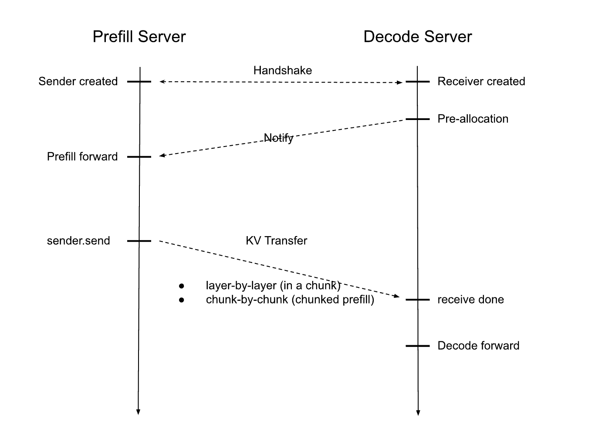

# Simple PD based on pyverbs

## Overall Architecture

### Sequence Diagram

The overall sequence is as follows 

Detailed interpretation

### RDMA Connection Establishment Process

* Prefill Server

1. Start BootstrapServer (global startup)

2. When a request comes in, create a Sender object
    2.1  Sender initialization -> Enter Bootstrapping phase
    2.2  Each worker (tp) of P communicates with BootstrapServer to query the peer D's port and IP based on room_id and engine rank
    2.3  After obtaining the peer's rdma socket port, enter WaitingForInput phase
    2.4  Sender-init method: Initialize RdmaClient -> RdmaServer + socketport to start rdma connection establishment, exchange metadata buffer information, obtain peer D's metadata buffer and memory address array and rkey array of the D segment to be operated. Enter Transfering phase
    2.5  Forward then send, calculate the base address + layer cache length for each layer's cache based on the computed kv_indices, create local MR objects, bind with the exchanged addresses and rkeys, use SendWR for remote GPU memory writing (using IBV_WR_RDMA_WRITE mode without requiring server-side recv)
    2.5  Poll local Send_CQ, once all Kvcache MRs are written successfully, write a Metadata buffer (using IBV_WR_RDMA_WRITE_WITH_IMM mode, server needs recv)
    2.6  After all SendWRs are sent, TransferComplete

* Decode Server

0. When request comes in, pre-allocate kv space

1. Register its rank and a random port (for RdmaServer port) with the Bootstraper server, bind sock. If successful, enter WaitingForInput

2. Decode calls init method, passing in kvindices, aux_index, at this time exchanges with Rdma Client, mainly sending its metadata addr, rkey, pre-allocated address, rkey, len to P node through sock communication. Enter Transfering phase

3. Submit recv_metadata_mr, RDMA waits for P phase first word address sending

4. Poll waiting for metadata write success, once successful TransferComplete 