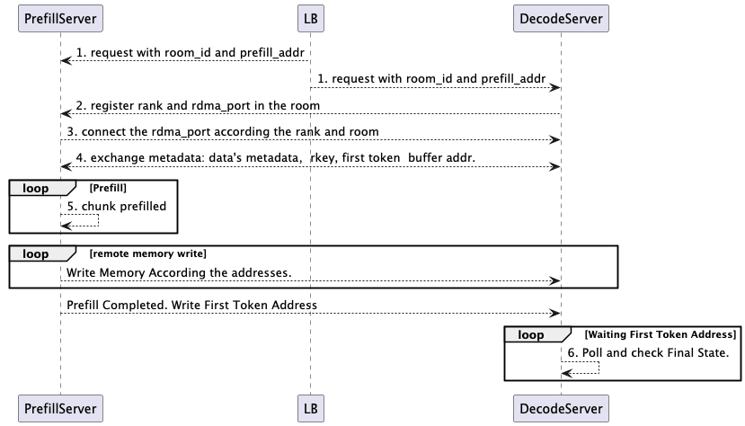

# Simple PD based on pyverbs

## 整体架构

## 时序图

整体时序大致为 

### RDMA 建联过程

* Prefill Server

1. 启动BootstrapServer(全局启动)

2. 请求进入时创建Sender对象
    2.1  Sender初始化 -> 进入Bootstrapping阶段
    2.2  P的每个worker(tp) 和 BootstrapServer通信，根据room_id, engine rank查询对端D的端口，和ip
    2.3  查询得到对端rdma socket port后，进入到 WaitingForInput 阶段
    2.4  Sender-init 方法: 初始化 RdmaClient -> RdmaServer + socketport 开始rdma建联，交换metadata buffer信息，获取对端D的metadata buffer 和待操作D段的 内存地址数组和rkey数组. 进入到 Transfering 阶段
    2.5  Forward then send, 根据已经计算的kv_indices , 计算出每层layer cache的地址基地址+层cache长度，创建本地MR对象， 和交换得来地址，rkey做绑定，使用SendWR 进行远程显存写入(使用无需server端recv的 IBV_WR_RDMA_WRITE 模式 )
    2.5 Polling 本地 Send_CQ,一旦所有Kvcache MRs写入成功后，再写入一个Metadata buffer（用IBV_WR_RDMA_WRITE_WITH_IMM模式，服务端需要recv）.
    2.6 所有 SendWR 发送完毕 TransferComplete

* Decode Server

0. 请求进入，预分配kv空间

1. 向Bootstraper server 注册自身rank，以及随机一个端口(用于RdmaServer端口)， 绑定sock。如果请成功， 进入到 WaitingForInput

2. Decode调用 init方法， 传入  kvindices, aux_index, 此时跟Rdma Client做 交换，主要是把自己的metadata addr，rkey， 预分配的地址，rkey，len 通过 sock通信发送给 P 节点。  进入到 Transfering 阶段

3. 提交 recv_metadata_mr ，RDMA等待P阶段首字地址发送

4. Poll轮询等待 metadata写入成功，一旦成功 TransferComplete
