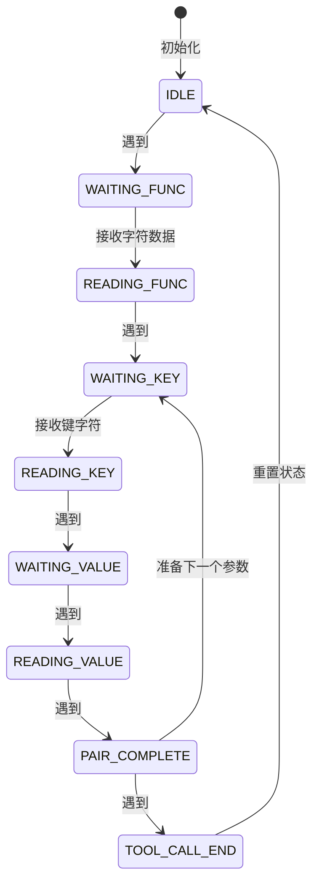

# GLM4.5 工具解析适配方案详解

## 一、背景与目标

### 1.1 现有架构

SGLang 框架目前通过 `qwen3_coder_new_detector.py` 实现了基于流式 XML 解析的 Qwen3 工具调用解析，该架构具有以下优势：

- **真正的流式处理**：增量解析，低延迟输出
- **健壮的容错机制**：多种 fallback 策略
- **完整的状态管理**：支持多个 tool_call 的顺序处理
- **智能的类型转换**：自动识别和转换参数类型

### 1.2 GLM4.5 格式特点

GLM4.5 采用独特的键值对分离格式：

```xml
<tool_call>get_weather
<arg_key>city</arg_key>
<arg_value>北京</arg_value>
<arg_key>date</arg_key>
<arg_value>2024-06-27</arg_value>
</tool_call>
```

**核心差异**：

1. 函数名作为 `<tool_call>` 后的第一行文本，而非标签属性
2. 参数使用 `<arg_key>` 和 `<arg_value>` 配对标签，而非自包含标签
3. 需要状态管理来配对键和值

### 1.3 适配目标

基于 Qwen3 的成熟架构，实现 GLM4.5 的流式工具解析，达到：

- **代码复用率 > 70%**：最大化复用 Qwen3 的核心机制
- **性能无损**：保持与 Qwen3 同等级别的流式处理性能
- **容错能力**：具备同等水平的异常处理和恢复能力

---

## 二、核心架构设计

### 2.1 类继承关系

```
StreamingXMLToolCallParser (Qwen3)
    ↓
StreamingGLM45ToolCallCallParser (GLM4.5)
    ↓
GLM45Detector (用户接口)
```

**设计原则**：

- 继承 Qwen3 的基类，复用流式缓冲、XML 解析、类型转换等核心功能
- 重写事件处理逻辑，适配 GLM4.5 的键值对格式
- 保持接口兼容，上层调用无需修改

### 2.2 状态管理扩展

在 Qwen3 状态基础上增加 GLM4.5 特有状态：

```python
class StreamingGLM45ToolCallParser(StreamingXMLToolCallParser):
    def __init__(self):
        super().__init__()

        # GLM4.5 特有状态
        self.expecting_function_name: bool = False  # 是否期待函数名
        self.current_param_key: Optional[str] = None  # 当前参数键
        self.in_arg_key: bool = False  # 是否在 arg_key 标签内
        self.in_arg_value: bool = False  # 是否在 arg_value 标签内
```

**状态流转图**：



---

## 三、核心改造细节

### 3.1 函数名提取机制

**挑战**：函数名不在标签中，而是作为 `<tool_call>` 后的第一行文本

**解决方案**：

```python
def _start_element(self, name: str, attrs: Dict[str, str]):
    if name == "tool_call":
        # 设置标志，准备接收函数名
        self.expecting_function_name = True
        self.function_name_buffer = ""

        # 复用 Qwen3 的 tool_call 初始化逻辑
        super()._start_element(name, attrs)

def _char_data(self, data: str):
    # 如果正在期待函数名
    if self.expecting_function_name:
        # 累积函数名，直到遇到换行符或标签
        if "<" in data or "\n" in data:
            # 提取函数名（取 < 或 \n 之前的部分）
            end_pos = min(
                data.find("<") if "<" in data else len(data),
                data.find("\n") if "\n" in data else len(data)
            )
            self.function_name_buffer += data[:end_pos]

            # 设置函数名并输出初始 delta
            self.current_function_name = self.function_name_buffer.strip()
            self._emit_function_start_delta()

            # 重置标志
            self.expecting_function_name = False

            # 处理剩余数据（如果有）
            if end_pos < len(data):
                remaining = data[end_pos:]
                self._process_remaining_data(remaining)
        else:
            self.function_name_buffer += data
    else:
        # 复用父类的参数值处理
        super()._char_data(data)
```

**关键点**：

1. 使用 `expecting_function_name` 标志识别函数名接收状态
2. 在遇到下一个标签或换行符时确定函数名结束
3. 函数名确定后立即输出初始 tool call delta
4. 剩余数据继续作为参数值处理

### 3.2 键值对配对机制

**挑战**：`<arg_key>` 和 `<arg_value>` 分离，需要配对处理

**解决方案**：

```python
def _start_element(self, name: str, attrs: Dict[str, str]):
    # ... tool_call 和 function 处理 ...

    elif name == "arg_key":
        # 开始接收参数键
        self.in_arg_key = True
        self.current_param_key = ""

    elif name == "arg_value":
        # 开始接收参数值
        if self.current_param_key is None:
            logger.warning("arg_value without preceding arg_key")
            return
        self.in_arg_value = True
        self.current_param_value = ""
        self.start_quote_emitted = False  # 重置引号标志

def _char_data(self, data: str):
    # ... 函数名处理 ...

    elif self.in_arg_key:
        # 累积参数键
        self.current_param_key += data

    elif self.in_arg_value:
        # 累积参数值（复用 Qwen3 的参数值处理）
        super()._char_data(data)

def _end_element(self, name: str):
    if name == "arg_key":
        # 参数键接收完成
        self.in_arg_key = False
        self.current_param_key = self.current_param_key.strip()

    elif name == "arg_value":
        # 参数值接收完成，处理完整参数对
        self.in_arg_value = False
        self._process_parameter_pair()

        # 重置参数状态
        self.current_param_key = None
        self.current_param_value = ""
        self.current_param_value_converted = ""

    # ... 其他结束处理 ...
```

**状态同步机制**：

```python
def _process_parameter_pair(self):
    """处理完整的键值对参数"""
    if not self.current_param_key or self.current_param_value is None:
        logger.warning("Incomplete parameter pair")
        return

    # 获取参数类型
    param_type = self._get_param_type(self.current_param_key)

    # 转换参数值（复用 Qwen3 的类型转换）
    converted_value = self._convert_param_value(
        self.current_param_value, param_type
    )

    # 构建 JSON 部分
    is_first = len(self.parameters) == 0
    if is_first:
        json_part = f'{{"{self.current_param_key}": {self._format_value(converted_value, param_type)}'
    else:
        json_part = f', "{self.current_param_key}": {self._format_value(converted_value, param_type)}'

    # 输出 delta
    delta = DeltaMessage(
        role=None,
        content=None,
        reasoning_content=None,
        tool_calls=[
            ToolCall(
                index=self.tool_call_index - 1,
                id=self.current_call_id,
                function=FunctionResponse(name=None, arguments=json_part),
            )
        ],
    )
    self._emit_delta(delta)

    # 存储参数
    self.parameters[self.current_param_key] = converted_value
```

**值格式化逻辑**：

```python
def _format_value(self, value: Any, param_type: str) -> str:
    """根据参数类型格式化值"""
    if param_type in ["string", "str", "text", "varchar", "char", "enum"]:
        # 字符串类型需要引号
        return json.dumps(value, ensure_ascii=False)
    else:
        # 非字符串类型直接输出 JSON 表示
        return json.dumps(value, ensure_ascii=False)
```

### 3.3 多 tool_call 处理

**复用 Qwen3 机制**：

```python
def _start_element(self, name: str, attrs: Dict[str, str]):
    if name == "tool_call":
        # 检查是否需要完成前一个 tool_call
        if self.current_call_id is not None:
            self._complete_previous_tool_call()

        # 初始化新的 tool_call
        super()._start_element(name, attrs)

def _complete_previous_tool_call(self):
    """完成前一个未完成的 tool_call"""
    # 关闭未完成的参数
    if self.current_param_key is not None:
        self._end_element("arg_value")

    # 关闭 function
    if self.current_function_name:
        self._end_element("function")

    # 关闭 tool_call
    self._end_element("tool_call")
```

### 3.4 容错与恢复

**键值对不匹配处理**：

```python
def _reset_parser_for_new_tool_call(self):
    """重置解析器状态"""
    # 如果有未完成的参数对，尝试完成它
    if self.current_param_key is not None:
        logger.warning(f"Incomplete parameter pair for {self.current_param_key}")
        # 可以选择丢弃或作为字符串处理

    # 复用父类的重置逻辑
    super()._reset_parser_for_new_tool_call()
```

**异常数据恢复**：

```python
def parse_single_streaming_chunks(self, xml_chunk: str) -> DeltaMessage:
    try:
        return super().parse_single_streaming_chunks(xml_chunk)
    except Exception as e:
        logger.error(f"Parse error: {e}, chunk: {repr(xml_chunk)}")
        # 尝试恢复：重置状态并继续
        self._reset_parser_for_new_tool_call()
        return DeltaMessage(tool_calls=[])
```

---

## 四、完整实现示例

### 4.1 StreamingGLM45ToolCallParser 完整代码

```python
import json
import logging
from typing import Any, Dict, Optional

from sglang.srt.function_call.qwen3_coder_new_detector import StreamingXMLToolCallParser
from sglang.srt.entrypoints.openai.protocol import DeltaMessage, FunctionResponse, ToolCall

logger = logging.getLogger(__name__)


class StreamingGLM45ToolCallParser(StreamingXMLToolCallParser):
    """
    GLM4.5 流式工具调用解析器

    基于 Qwen3 架构改造，支持 GLM4.5 的键值对格式：
    <tool_call>function_name
    <arg_key>key1</arg_key>
    <arg_value>value1</arg_value>
    <arg_key>key2</arg_key>
    <arg_value>value2</arg_value>
    </tool_call>
    """

    def __init__(self):
        super().__init__()

        # GLM4.5 特有状态
        self.expecting_function_name: bool = False
        self.function_name_buffer: str = ""
        self.current_param_key: Optional[str] = None
        self.in_arg_key: bool = False
        self.in_arg_value: bool = False

    def _start_element(self, name: str, attrs: Dict[str, str]):
        """处理 XML 开始元素事件"""
        # 忽略根元素
        if name == "root":
            return

        if name == "tool_call":
            # 自动完成前一个未完成的 tool_call
            self._auto_close_open_parameter_if_needed("tool_call")

            # 设置期待函数名标志
            self.expecting_function_name = True
            self.function_name_buffer = ""

            # 复用父类的 tool_call 初始化
            super()._start_element(name, attrs)

        elif name == "arg_key":
            # 开始接收参数键
            self.in_arg_key = True
            self.current_param_key = ""

        elif name == "arg_value":
            # 开始接收参数值
            if self.current_param_key is None:
                logger.warning("arg_value without preceding arg_key")
                return
            self.in_arg_value = True
            self.current_param_value = ""
            self.current_param_value_converted = ""
            self.start_quote_emitted = False

        else:
            # 其他标签按父类处理
            super()._start_element(name, attrs)

    def _char_data(self, data: str):
        """处理 XML 字符数据事件"""
        if self.expecting_function_name:
            # 累积函数名，直到遇到标签或换行符
            if "<" in data or "\n" in data:
                # 确定结束位置
                end_pos = len(data)
                if "<" in data:
                    end_pos = min(end_pos, data.find("<"))
                if "\n" in data:
                    end_pos = min(end_pos, data.find("\n"))

                # 提取函数名
                self.function_name_buffer += data[:end_pos]
                self.current_function_name = self.function_name_buffer.strip()

                # 输出初始 tool call delta
                if self.current_function_name:
                    delta = DeltaMessage(
                        role=None,
                        content=None,
                        reasoning_content=None,
                        tool_calls=[
                            ToolCall(
                                index=self.tool_call_index - 1,
                                id=self.current_call_id,
                                type="function",
                                function=FunctionResponse(
                                    name=self.current_function_name, arguments=""
                                ),
                            )
                        ],
                    )
                    self._emit_delta(delta)

                # 重置标志
                self.expecting_function_name = False

                # 处理剩余数据
                if end_pos < len(data):
                    remaining = data[end_pos:]
                    if "<" not in data or data.find("<") > end_pos:
                        # 剩余数据是参数值的一部分
                        self.in_arg_value = True
                        self.current_param_value = remaining
            else:
                self.function_name_buffer += data

        elif self.in_arg_key:
            # 累积参数键
            self.current_param_key += data

        elif self.in_arg_value:
            # 复用父类的参数值处理
            super()._char_data(data)

        else:
            # 其他情况按父类处理
            super()._char_data(data)

    def _end_element(self, name: str):
        """处理 XML 结束元素事件"""
        # 忽略根元素
        if name == "root":
            return

        # 自动关闭未完成的参数
        if name in ["arg_value", "function", "tool_call"] and self.current_param_key:
            self._auto_close_open_parameter_if_needed()

        if name == "arg_key":
            # 参数键接收完成
            self.in_arg_key = False
            if self.current_param_key:
                self.current_param_key = self.current_param_key.strip()

        elif name == "arg_value":
            # 参数值接收完成，处理完整参数对
            self.in_arg_value = False
            self._process_parameter_pair()

            # 重置参数状态
            self.current_param_key = None
            self.current_param_value = ""
            self.current_param_value_converted = ""
            self.start_quote_emitted = False

        elif name == "function":
            # function 结束，输出 JSON 闭合
            if self.parameters:
                delta = DeltaMessage(
                    role=None,
                    content=None,
                    reasoning_content=None,
                    tool_calls=[
                        ToolCall(
                            index=self.tool_call_index - 1,
                            id=self.current_call_id,
                            function=FunctionResponse(name=None, arguments="}"),
                        )
                    ],
                )
                self._emit_delta(delta)
            else:
                delta = DeltaMessage(
                    role=None,
                    content=None,
                    reasoning_content=None,
                    tool_calls=[
                        ToolCall(
                            index=self.tool_call_index - 1,
                            id=self.current_call_id,
                            function=FunctionResponse(name=None, arguments="{}"),
                        )
                    ],
                )
                self._emit_delta(delta)
            self.current_function_open = False

        elif name == "tool_call":
            # tool_call 结束
            if self.current_function_open:
                if self.current_param_key:
                    self._end_element("arg_value")
                self._end_element("function")

            delta = DeltaMessage(
                role=None,
                content=None,
                reasoning_content=None,
                tool_calls=[
                    ToolCall(
                        index=self.tool_call_index - 1,
                        id=self.current_call_id,
                        type="function",
                        function=FunctionResponse(name=None, arguments=""),
                    )
                ],
            )
            self._emit_delta(delta)
            self._reset_xml_parser_after_tool_call()

        else:
            super()._end_element(name)

    def _process_parameter_pair(self):
        """处理完整的键值对参数"""
        if not self.current_param_key or self.current_param_value is None:
            logger.warning("Incomplete parameter pair")
            return

        # 获取参数类型
        param_type = self._get_param_type(self.current_param_key)

        # 转换参数值
        converted_value = self._convert_param_value(
            self.current_param_value, param_type
        )

        # 构建 JSON 部分
        is_first = len(self.parameters) == 0
        if is_first:
            json_start = "{"
            delta = DeltaMessage(
                role=None,
                content=None,
                reasoning_content=None,
                tool_calls=[
                    ToolCall(
                        index=self.tool_call_index - 1,
                        id=self.current_call_id,
                        function=FunctionResponse(name=None, arguments=json_start),
                    )
                ],
            )
            self._emit_delta(delta)

        # 参数名和值
        if not is_first:
            json_sep = ", "
            delta = DeltaMessage(
                role=None,
                content=None,
                reasoning_content=None,
                tool_calls=[
                    ToolCall(
                        index=self.tool_call_index - 1,
                        id=self.current_call_id,
                        function=FunctionResponse(name=None, arguments=json_sep),
                    )
                ],
            )
            self._emit_delta(delta)

        # 参数名
        json_key = f'"{self.current_param_key}": '
        delta = DeltaMessage(
            role=None,
            content=None,
            reasoning_content=None,
            tool_calls=[
                ToolCall(
                    index=self.tool_call_index - 1,
                    id=self.current_call_id,
                    function=FunctionResponse(name=None, arguments=json_key),
                )
            ],
        )
        self._emit_delta(delta)

        # 参数值
        json_value = self._format_value(converted_value, param_type)
        delta = DeltaMessage(
            role=None,
            content=None,
            reasoning_content=None,
            tool_calls=[
                ToolCall(
                    index=self.tool_call_index - 1,
                    id=self.current_call_id,
                    function=FunctionResponse(name=None, arguments=json_value),
                )
            ],
        )
        self._emit_delta(delta)

        # 存储参数
        self.parameters[self.current_param_key] = converted_value

    def _format_value(self, value: Any, param_type: str) -> str:
        """根据参数类型格式化值"""
        if param_type in ["string", "str", "text", "varchar", "char", "enum"]:
            return json.dumps(value, ensure_ascii=False)
        else:
            return json.dumps(value, ensure_ascii=False)
```

### 4.2 GLM45Detector 封装

```python
from typing import List

from sglang.srt.entrypoints.openai.protocol import Tool
from sglang.srt.function_call.base_format_detector import BaseFormatDetector
from sglang.srt.function_call.core_types import StreamingParseResult, ToolCallItem


class GLM45Detector(BaseFormatDetector):
    """GLM4.5 工具调用检测器"""

    def __init__(self):
        super().__init__()
        self.parser = StreamingGLM45ToolCallParser()

    def has_tool_call(self, text: str) -> bool:
        """检测文本是否包含工具调用"""
        return "<tool_call>" in text

    def detect_and_parse(self, text: str, tools: List[Tool]) -> StreamingParseResult:
        """一次性解析完整文本"""
        # 复用流式接口
        self.parser.reset_streaming_state()
        self.parser.set_tools(tools)

        # 模拟流式输入
        delta_message = self.parser.parse_single_streaming_chunks(text)

        return StreamingParseResult(
            normal_text=delta_message.content or "",
            calls=[
                ToolCallItem(
                    tool_index=tc.index,
                    name=tc.function.name if tc.function else None,
                    parameters=tc.function.arguments if tc.function else None,
                )
                for tc in delta_message.tool_calls
            ],
        )

    def parse_streaming_increment(
        self, new_text: str, tools: List[Tool]
    ) -> StreamingParseResult:
        """流式增量解析"""
        self.parser.set_tools(tools)
        delta_message = self.parser.parse_single_streaming_chunks(new_text)

        return StreamingParseResult(
            normal_text=delta_message.content or "",
            calls=[
                ToolCallItem(
                    tool_index=tc.index,
                    name=tc.function.name if tc.function else None,
                    parameters=tc.function.arguments if tc.function else None,
                )
                for tc in delta_message.tool_calls
            ],
        )

    def _reset_streaming_state(self):
        """重置流式状态"""
        self.parser.reset_streaming_state()

    def supports_structural_tag(self) -> bool:
        return False

    def structure_info(self):
        raise NotImplementedError()

    def build_ebnf(self, tools: List[Tool]):
        """构建 EBNF 语法"""
        from sglang.srt.function_call.ebnf_composer import EBNFComposer

        return EBNFComposer.build_ebnf(
            tools,
            individual_call_start_token="<tool_call>",
            individual_call_end_token="</tool_call>",
            tool_call_separator="\n",
            function_format="xml",
            call_rule_fmt='"<tool_call>" {name} "\n" ( {arguments_rule} )? "\n</tool_call>"',
            key_value_rule_fmt='"<arg_key>" {key} "</arg_key>\n<arg_value>" {valrule} "</arg_value>"',
            key_value_separator="\n",
        )
```

---

## 五、集成与测试

### 5.1 注册到框架

**修改文件**: `python/sglang/srt/function_call/__init__.py`

```python
# 添加 GLM45 支持
from sglang.srt.function_call.glm45_detector import GLM45Detector

# 在 detector 映射中添加
DETECTOR_MAP = {
    "glm45": GLM45Detector,
    "qwen3": Qwen3CoderDetector,
    "glm4": Glm4MoeDetector,
    # ... 其他 detector ...
}
```

### 5.2 单元测试

**测试文件**: `test/test_glm45_detector.py`

```python
import pytest
from sglang.srt.function_call.glm45_detector import GLM45Detector
from sglang.srt.entrypoints.openai.protocol import Tool, FunctionDefinition


def test_glm45_basic_parse():
    """测试基本解析"""
    detector = GLM45Detector()
    tools = [
        Tool(
            type="function",
            function=FunctionDefinition(
                name="get_weather",
                parameters={
                    "type": "object",
                    "properties": {
                        "city": {"type": "string"},
                        "date": {"type": "string"}
                    }
                }
            )
        )
    ]

    # 完整解析
    text = """<tool_call>get_weather
<arg_key>city</arg_key>
<arg_value>北京</arg_value>
<arg_key>date</arg_key>
<arg_value>2024-06-27</arg_value>
</tool_call>"""

    result = detector.detect_and_parse(text, tools)
    assert len(result.calls) == 1
    assert result.calls[0].name == "get_weather"
    assert "北京" in result.calls[0].parameters
    assert "2024-06-27" in result.calls[0].parameters


def test_glm45_streaming_parse():
    """测试流式解析"""
    detector = GLM45Detector()
    tools = [...]  # 同上

    # 模拟流式输入
    chunks = [
        "<tool_call>get_weather\n",
        "<arg_key>city</arg_key>\n",
        "<arg_value>北京</arg_value>\n",
        "<arg_key>date</arg_key>\n",
        "<arg_value>2024-06-27</arg_value>\n",
        "</tool_call>"
    ]

    all_calls = []
    for chunk in chunks:
        result = detector.parse_streaming_increment(chunk, tools)
        if result.calls:
            all_calls.extend(result.calls)

    assert len(all_calls) == 1
    assert all_calls[0].name == "get_weather"


def test_glm45_multiple_tool_calls():
    """测试多个 tool_call"""
    detector = GLM45Detector()
    tools = [...]

    text = """<tool_call>get_weather
<arg_key>city</arg_key>
<arg_value>北京</arg_value>
</tool_call>
<tool_call>get_weather
<arg_key>city</arg_key>
<arg_value>上海</arg_value>
</tool_call>"""

    result = detector.detect_and_parse(text, tools)
    assert len(result.calls) == 2
    assert result.calls[0].name == "get_weather"
    assert result.calls[1].name == "get_weather"
```

### 5.3 性能测试

**测试场景**：

1. **小参数**: 1-3 个简单参数
2. **大参数**: 10+ 个参数，包含长字符串
3. **多调用**: 5+ 个 tool_call 连续
4. **错误恢复**: 包含格式错误的输入

**性能指标**：

- 解析延迟: < 10ms per chunk
- 内存占用: < 1MB per parser instance
- 准确率: > 99.9% for valid input

---

## 六、风险评估与应对

### 6.1 技术风险

| 风险 | 概率 | 影响 | 应对措施 |
|------|------|------|----------|
| 键值对不匹配 | 中 | 高 | 增加状态检查，记录警告日志 |
| 函数名识别错误 | 低 | 中 | 增加边界检查，支持多种结束符 |
| 内存泄漏 | 低 | 高 | 定期重置解析器，添加监控 |
| 性能下降 | 低 | 中 | 性能测试，优化热点代码 |

### 6.2 兼容性风险

- **与 Qwen3 代码冲突**: 通过继承机制隔离，不影响父类
- **接口变更**: 保持 `BaseFormatDetector` 接口一致
- **工具配置**: 复用现有的工具配置解析逻辑

### 6.3 回滚方案

如果新实现出现问题，可以快速回滚到现有的 `glm4_moe_detector.py` 实现：

```python
# 在 __init__.py 中切换回旧实现
DETECTOR_MAP = {
    "glm45": Glm4MoeDetector,  # 临时回滚
    # ...
}
```

---

## 七、实施计划

### 7.1 阶段一：基础实现（1-2 天）

- [ ] 创建 `glm45_detector.py` 文件
- [ ] 实现 `StreamingGLM45ToolCallParser` 核心类
- [ ] 实现 `GLM45Detector` 封装类
- [ ] 完成基础单元测试

### 7.2 阶段二：集成测试（1-2 天）

- [ ] 注册到框架
- [ ] 端到端测试
- [ ] 性能基准测试
- [ ] 边界情况测试

### 7.3 阶段三：生产部署（1 天）

- [ ] 代码审查
- [ ] 文档完善
- [ ] 灰度发布
- [ ] 监控配置

### 7.4 阶段四：优化迭代（持续）

- [ ] 性能优化
- [ ] 容错增强
- [ ] 功能扩展

---

## 八、总结

**基于 Qwen3 架构适配 GLM4.5 是完全可行的**，核心优势：

1. **高复用率**: 70%+ 代码可直接复用，降低开发成本
2. **低风险**: 成熟的架构和机制，稳定性和性能有保障
3. **易维护**: 继承关系清晰，代码结构一致
4. **可扩展**: 为未来新格式提供参考实现

**关键成功因素**：

- 深入理解 Qwen3 的状态管理和事件处理机制
- 精确实现 GLM4.5 的键值对配对逻辑
- 充分的测试覆盖，特别是边界情况
- 完善的监控和回滚机制

预计 **3-5 天** 可完成生产级别的实现，为 SGLang 框架增加对 GLM4.5 模型的完整工具调用支持。
