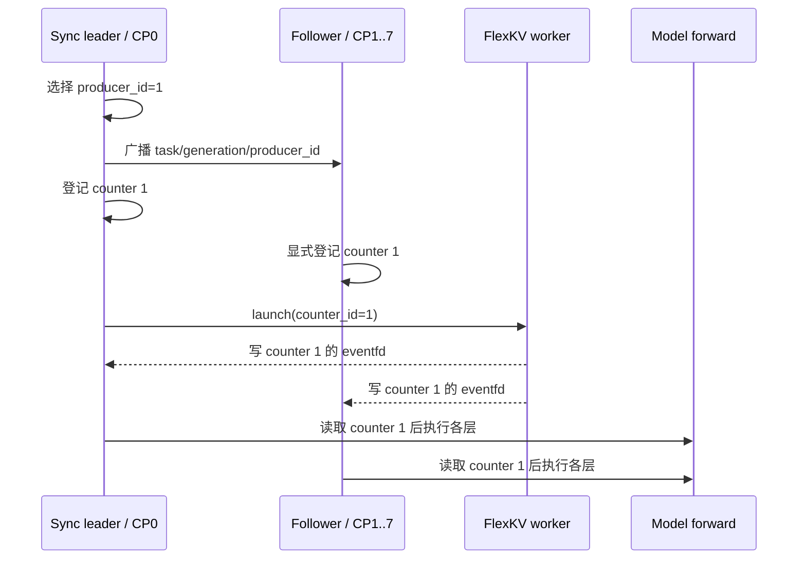
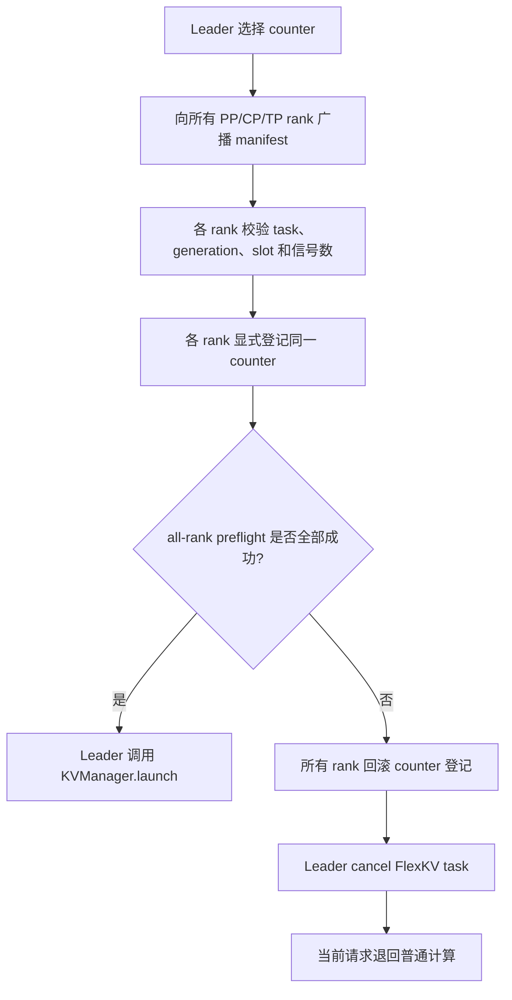

# FlexKV layerwise restore 在 CP + EAGLE 下卡死：原理、修复与验证

本文解释一次具体的服务崩溃问题：DeepSeek V4 同时启用 EAGLE、CP8、
FlexKV layerwise restore 和较高并发后，第一轮请求正常，flush 后的第二轮
请求全部报 `Connection refused`。

文档面向第一次接触 SGLang/FlexKV 的读者。读完后，你应该能够回答：

1. 为什么第二轮显示“全错”，但它其实不是精度问题？
2. 为什么 EAGLE 和高并发更容易触发问题，但不是根因？
3. `producer_id` 为什么必须由一个 rank 统一决定？
4. 修复如何在真正发起 H2D 传输前阻止死锁？
5. 上线后应该看哪些日志、满足哪些验收条件？

## 30 秒结论

旧实现让每个 CP rank 根据自己的本地执行进度选择 layerwise eventfd counter。
开启 EAGLE 和 overlap scheduling 后，各 rank 的时序可能不同，因此同一次 restore
可能被登记到不同的 `producer_id`。

但是只有 sync leader 会调用 FlexKV `KVManager.launch()`。FlexKV 只会通知 leader
选择的那组 eventfd。选择了其他 counter 的 rank 会永远等待一个不会到来的信号；
其他 rank 则继续进入 DeepEP collective。最终所有 rank 互相等待，watchdog 杀掉服务，
客户端随后得到 `Connection refused`。

修复后的原则是：

> 一次 restore 只能有一个全局 counter 决策；所有 rank 必须在 launch 前确认自己
> 能以完全相同的 task、generation、counter 和信号数量执行。

如果任一 rank 不同意，所有 rank 都回滚本次登记，并让该请求退回普通计算路径。
FlexKV 不会 launch，因此不会留下“有人等 eventfd、有人进 collective”的半完成状态。

## 现象与判断

本次复现的外部现象如下：

| 阶段 | 结果 | 实际含义 |
| --- | --- | --- |
| R1 | `0.6939` | 首轮正常执行，EAGLE 本身可以工作 |
| R2 | `0.0000`，`error=250`，`empty=250` | 250 个请求都没有拿到服务端响应 |
| 客户端错误 | `URLError: [Errno 111] Connection refused` | 服务进程已经退出，并非模型返回了错误答案 |
| 服务端 | watchdog 超时后 coredump/kill process tree | 某些 rank 卡在 forward 内部 |

因此首先要把两个问题分开：

- **存活性问题**：服务是否完成请求，是否发生 hang/crash？本文修复这一问题。
- **精度问题**：服务正常返回后，restore 的 token/KV 是否正确？必须在存活性修复后
  单独验证。

R2 的 `0.0000` 不能直接解释为“EAGLE 解码全部答错”，因为预测字段为空，客户端错误
明确是连接被拒绝。

## 必要概念

### rank 和 CP

一个多 GPU 模型由多个进程共同执行，每个进程通常对应一个 **rank**。
Context Parallelism（CP）把上下文相关工作分给多个 rank。CP8 表示相关计算由 8 个
CP rank 协作完成。

这些 rank 会在 DeepEP 等 collective 中同步。只要一个 rank 没有进入 collective，
其余已经进入的 rank 也无法继续。

### KV cache 和 restore

大模型生成时会保存历史 token 的 Key/Value 张量，称为 KV cache。FlexKV 可以把
KV cache 从 GPU 移到 CPU、SSD 或远端；再次遇到相同前缀时，再把它恢复到 GPU。
这个恢复过程就是 **restore** 或 H2D load。

### layerwise restore

bulk restore 会先恢复所有层，再开始 forward。layerwise restore 允许“第 0 层恢复完成
就执行第 0 层”，将数据搬运和计算重叠，从而降低等待时间。

每层恢复完成后，FlexKV worker 会写入一个 Linux `eventfd`。模型 forward 在访问该层
KV 前读取这个 eventfd；没有信号时就等待。

### counter 和 `producer_id`

实现中维护了 3 组 eventfd，形成一个环形缓冲区。每组叫一个 counter，编号为 0、1、2。

- FlexKV worker 是信号的 producer。
- 模型 forward 是信号的 consumer。
- `producer_id` 决定本次传输使用哪组 eventfd。

多个属于同一 prefill batch 的 restore 可以共享一个 counter。假设一个 counter 登记了
7 次 restore，那么每一层 forward 都必须等待 7 个完成信号。

### sync leader

同一个 KV-cache-sharing fan-out 中，只有唯一的 sync leader 与 `KVManager` 通信：

```text
pp_rank == 0 and attn_cp_rank == 0 and attn_tp_rank == 0
```

其他 rank 不会独立调用 `KVManager.launch()`。

### EAGLE 为什么会影响复现概率

EAGLE speculative decoding 和 overlap scheduling 会增加 target prefill、draft/verify、
通信与调度之间的重叠。各 rank 到达“上一批开始等待”或“上一批完成”的时间更容易产生
偏差。

这会放大旧实现中的竞态，但 EAGLE 不是产生错误 counter 的逻辑根因。没有 EAGLE 时，
时序更整齐，所以问题可能不出现，或者表现成另一个 restore 精度问题。

## 正常的 layerwise restore

正确流程中，所有 rank 对同一次 restore 使用同一个 counter：



这里最重要的不是“通常选到同一个数字”，而是所有 rank 必须共享同一个明确决策。

## 旧实现如何死锁

旧代码只在 PP receiver 上同步 `producer_id`。当 `pp_size=1`、`cp_size=8` 时，
`scatter_pp()` 不会把 CP0 的选择传给 CP1–7。每个 CP rank 都会执行本地
`update_producer()`。

假设同一时刻各 rank 的本地状态如下：

| rank | 本地观察 | 本地选择 |
| --- | --- | --- |
| CP0 | 上一批还没有开始 wait，可以继续合并 | counter 0 |
| CP1 | 上一批已经开始 wait | counter 1 |
| CP2 | 上一批还没有开始 wait | counter 0 |
| CP3 | 上一批已经完成 | counter 1 |

接下来只有 CP0 调用：

```python
kv_manager.launch(..., counter_id=0)
```

结果是：

```text
CP1/3/...: 等待 counter 1 的 eventfd ── 永远没有对应信号
CP0/2/...: 继续执行并进入 DeepEP collective ── 等不到其他 CP rank
watchdog : 300 秒后判定 forward 无进展并杀掉服务
client   : 后续连接被拒绝
```

本次日志与这个模式一致：

- 一组 rank 卡在 `deepseek_v4_memory_pool.py::wait_layer_transfer()`；
- 另一组 rank 卡在 `deep_ep::Buffer::intranode_dispatch`；
- 栈顶出现 `eagle_worker_v2.py::forward_batch_generation` 只说明 EAGLE worker 正在调用
  target prefill，不等于 EAGLE draft kernel 算错。

## 修复后的协议

入口是 `FlexKVConnector.start_load_kv_layerwise()`。新协议分为以下步骤。

### 1. 只有 leader 选择 counter

只有 sync leader 调用 `update_producer()`。其他 rank 不再根据本地时序自行轮转 counter。

### 2. 广播完整 manifest

leader 通过覆盖 PP、CP、TP 的 `FlexKVComm.scatter()` 广播：

```text
task_id
producer_id
generation
slot_count
expected_signal_count
error
```

字段含义：

- `task_id`：FlexKV lookup 创建的任务标识；防止 rank 处理了不同任务。
- `producer_id`：全局唯一的 counter 选择。
- `generation`：第几次 layerwise restore；防止消息错位或重复。
- `slot_count`：本次要恢复多少个 GPU slot。
- `expected_signal_count`：该 counter 每层累计应该等待多少个 eventfd 信号。
- `error`：leader 在选择阶段遇到的错误；所有 rank 会一致拒绝。

### 3. 每个 rank 做无副作用检查

`FlexKVLayerDoneCounter.expected_transfer_count()` 检查：

- counter 编号是否合法；
- 本 rank 是否还在消费另一个 counter；
- 当前 counter 是否已经开始 layer wait；
- counter 是可以复用，还是可以加入当前尚未开始 wait 的 batch；
- 加入后预期信号数是否与 leader 一致。

这一步专门识别“leader 认为还能合并到上一批，但 follower 已跨过 batch 边界”的情况。

### 4. 显式登记并进行全 rank preflight

leader 登记自己选择的 counter。所有 follower 调用
`register_task_with_explicit_counter_id()`，只能登记 manifest 中的 counter。

随后通过 `all_reduce(MIN)` 汇总本地状态：

```text
所有 rank local_ok == 1  -> 可以 launch
任意 rank local_ok == 0  -> 所有 rank 拒绝本次 restore
```

### 5. 失败时协调回滚

如果任一 rank 拒绝：

1. 删除本次 task 与 counter 的映射；
2. 撤销本次增加的 eventfd 信号计数；
3. 如果这是一个新 counter 且已经没有任务，将它恢复为可复用状态；
4. leader 取消尚未 launch 的 FlexKV task；
5. `start_load_kv_layerwise()` 返回 0，调用方释放 restore slots，并使用普通计算结果。

回滚不会删除同一个 batch 中此前已经成功登记的 restore。

### 6. 全部通过后才 launch

只有 all-rank preflight 成功，sync leader 才调用 `KVManager.launch()`。因此不会再出现
“部分 rank 已准备等待、但 leader 使用了另一组 eventfd”的状态。



## 必须保持的状态不变量

修改或排查这段代码时，应始终检查以下不变量：

1. 同一 generation 的所有 rank 使用相同 `task_id` 和 `producer_id`。
2. 同一 generation 的所有 rank 在登记后拥有相同 `expected_signal_count`。
3. follower 永远不为 layerwise FlexKV restore 调用 `update_producer()`。
4. `KVManager.launch()` 之前必须完成全 rank preflight。
5. preflight 失败必须在 launch 前完成本地登记回滚。
6. 回滚一个新任务不能破坏同 counter 中更早登记的任务。
7. 开始 layer wait 后，不能再向同一个 consumer batch 增加或移除 transfer。

## 代码位置

| 文件 | 职责 |
| --- | --- |
| `flexkv_connector.py` | leader 选择、manifest 广播、preflight、回滚和 launch |
| `flexkv_comm.py` | eventfd、counter 状态机、显式登记和信号等待 |
| `deepseek_v4_memory_pool.py` | 每层 forward 前调用 `wait_layer_transfer()` |
| `test_flexkv_connector_lifecycle.py` | counter 分组、复用、回滚和 rank-skew 回归测试 |

## 新增诊断日志

成功登记时，每个 rank 都会输出：

```text
[FlexKV-Layerwise] phase=registered rank=3 generation=18 \
task_id=1042 producer_id=1 expected_signal_count=7 rid=...
```

一次正常 restore 应满足：

- 同一 `generation` 的 `task_id` 相同；
- 同一 `generation` 的 `producer_id` 相同；
- 同一 `generation` 的 `expected_signal_count` 相同；
- 只有 sync leader 输出对应的 `phase=launch`。

如果 batch 边界不一致，会看到：

```text
[FlexKV-Layerwise] phase=preflight_reject rank=... generation=... \
task_id=... producer_id=... reason=...
```

这表示本次 restore 被安全放弃。它可能降低该请求的 cache 加速收益，但不应导致服务
hang 或请求失败。

如果 FlexKV worker 没有按时发送 eventfd 信号，会看到：

```text
[FlexKV-Layerwise] phase=wait_timeout rank=... task_ids=[...] \
counter_id=... layer=... wait_count=... timeout_s=240.0
```

`FLEXKV_LAYERWISE_WAIT_TIMEOUT_S` 默认是 240 秒。设置为 `0` 可以关闭超时，但生产环境
不建议关闭，因为无限等待会让根因更难定位。

## 测试覆盖

CPU 单元测试覆盖以下行为：

1. 同一 prefill batch 的多个 restore 合并到同一个 counter，并等待正确数量的信号；
2. follower 可以复用已经完成的 counter；
3. preflight 回滚只移除新任务，保留已有 batch 的 transfer；
4. follower 使用 leader 广播的 counter，不调用本地 `update_producer()`；
5. follower 与 leader 的 batch 边界不一致时，在 launch 前拒绝 restore；
6. reset 仍然等待 FlexKV 返回的 batch task ID 完整结束。

单元测试验证状态机，但不能替代真实 CP8 GPU 复现。

## CP8 + EAGLE + concurrency 32 验收步骤

建议使用与故障相同的模型、FlexKV 配置和数据集，至少连续运行 3 轮：

1. 启动 DeepSeek V4，启用 EAGLE、CP8、FlexKV layerwise restore；
2. concurrency 设为 32；
3. 运行 R1，确认服务和基础精度正常；
4. flush GPU cache，但保留 FlexKV 中的前缀；
5. 运行 R2，确保所有请求都完成；
6. 重复 flush/R2，避免只验证一次偶然成功；
7. 对日志按 generation 汇总注册信息。

存活性验收条件：

- 250/250 个 R2 请求都有响应；
- `error=0`、`empty=0`；
- health endpoint 仍可访问；
- 无 watchdog、CUDA coredump、`kill_process_tree`；
- 无 rank 长时间停在 `wait_layer_transfer()`；
- 每个成功 generation 的 counter manifest 在所有 rank 一致。

精度验收条件应单独记录：

- R2 输出与选定 baseline 的比较方法不变；
- 不能因为服务不再崩溃，就自动判定 restore 精度已修复。

可用下面的日志过滤快速检查新协议：

```bash
rg "FlexKV-Layerwise|watchdog|wait_layer_transfer|intranode_dispatch|coredump" \
  /path/to/server_node0.log
```

## 紧急回退方案

如果实机验证仍有问题，先关闭 layerwise transfer：

```bash
FLEXKV_ENABLE_LAYERWISE_TRANSFER=0
```

这会保留 FlexKV bulk restore，但失去逐层搬运与计算重叠的收益。它适合作为生产止血
方案，也适合作为 A/B 对照。

`--disable-overlap-schedule` 可以帮助确认时序相关性，但不应作为最终修复：它降低竞态
出现概率，却没有建立全 rank counter 一致性协议。

## 本修复不包含的事项

### restore 精度

本补丁解决 server hang，不修改 EAGLE token rematch 或 DeepSeek V4 KV 数值路径。
服务稳定后如果 R2 仍有精度下降，应单独检查 EAGLE 最后一个 raw boundary token 的
store/rematch 逻辑。历史提交 `f96df6a2ca` 可作为思路参考，但其分支架构与当前
DeepSeek V4 hybrid cache 不同，不能直接无检查地 cherry-pick。

### FlexKV polling notify mode

默认 layerwise notify mode 是 `hostfunc`。如果部署显式启用了 `polling`，还需要确认
FlexKV C++ polling 路径没有在并发 transfer 间共享可变的 `current_counter_id_`。
这个潜在问题与本文修复的 SGLang 跨 rank counter 选择竞态不同。

## 排查口诀

遇到类似问题时，按以下顺序判断：

```text
先看客户端是不是空响应
  -> 再看服务是否还活着
    -> 再看 watchdog 中各 rank 卡在哪里
      -> eventfd wait 与 collective 同时出现：优先检查 counter manifest
        -> 服务稳定后，最后再分析精度
```

这样可以避免把“服务已经崩溃”误判成“模型答案全错”。
