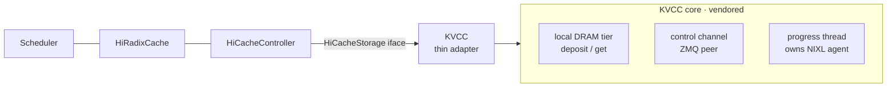
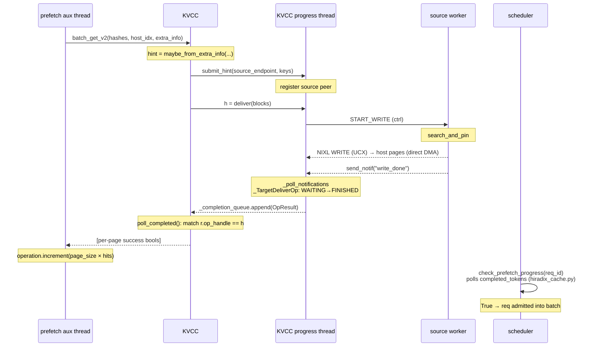

## Summary

SGLang's HiCache already supports pluggable L3 storage backends (mooncake, hf3fs, eic, …) behind a stable `HiCacheStorage` interface. This RFC adds KVCC as one more such backend. KVCC is a multi-tier KV cache management solution from NVIDIA. The integration totally follows the integration and design of hicache storage — we register a `"kvcc"` backend and implement the same `batch_set_v2 / batch_get_v2 / batch_exists_v2` contract the other backends already implement.

This backend also aligns with the router-initiated hint model in **[#27574 — Programmatic KV Cache for Agentic Workloads](https://github.com/sgl-project/sglang/issues/27574)**, which defines a provider-neutral hint taxonomy (Share / Prefetch / Demote / Pin / Retain). KVCC fits the **`Share`** intent — *"reuse a prefix that already lives on another worker... pull the prefix from the old one"* — but does not depend on that RFC: it is a self-contained mechanism any router emitting such a hint can drive.

Following the Dynamo DEP (ai-dynamo/dynamo#11673), the near term goal is **direct worker-to-worker host memory KV reuse**: a prefix computed on one worker is served to another without recomputation or a round-trip through a global pool. When a request lands on a worker lacking a prefix another worker holds, KVCC fetches it **peer-to-peer** — an asymmetric, directed transfer, not a symmetric external store.

Selecting *which* peer holds the prefix is a decision only a router can make well. So the router hands the target worker a small piece of per-request metadata — a **hint** — naming the peer. "Router" here means any orchestrator above the engine: the dynamo router (flash indexer) is the first target, SGLang's own router a later one, and the same carrier serves both. The rest of this RFC covers (1) that hint and (2) how KVCC plugs into HiCache to act on it.

## Part 1 — Router Hint

### Why a hint is needed

HiCache storage is content-addressed: the controller asks `get(block_hash)` and the backend is expected to know where the bytes live. That works for a global pool. It does **not** work for P2P reuse, where the same prefix may sit on any one of N peer workers. The only component that knows which one is the **router** — it made the routing decision that sent this request here in the first place. The hint will directly tell the node where target kvcache sits.

### Why decide this at the router

Putting the source-selection decision at the routing stage — rather than probing peers after a request lands — is what makes the hint valuable beyond avoiding a broadcast:

- **It enables a routing cost function that can grow over time.** The hint is the input to a decision the router makes; that decision can start *simple* (route on load only, ignoring cache residency) and evolve to *rich* (weigh prefix cache residency, estimated transfer time, distance/topology, and thresholds that decide when a P2P fetch is even worth it versus recomputation).
- **It lets us prefetch and shape system behavior.** Because the router decides before the request is admitted, the target can begin fetching the prefix ahead of time, and the router — with its global view — can steer placement to balance load and reuse across the fleet, rather than reacting locally after the fact.

### Carrier

We do **not** widen the `HiCacheStorage` signature. Every v2 call already threads a free-form `HiCacheStorageExtraInfo.extra_info` dict from the controller into the backend. The hint is the `Share` case of #27574's provider-neutral hint envelope and rides in that dict; the key name below is a placeholder pending #27574's envelope:

```
# placeholder key — to be aligned with #27574's KvHintEnvelope
extra_info.extra_info["kvcc_router_hint"] = {
    "source_control_endpoint": "host:port",   # ZMQ control endpoint of the peer holding the prefix
    "block_hashes": [...],                     # root-aligned block hashes for the shared prefix
}
```

### Propagation path

The hint travels from the router down to the backend without widening any interface — it rides the `extra_info` dict every layer already passes through:

1. **router → scheduler.** The router attaches the hint to the request's `extra_info`; the scheduler stashes it into the prefetch request.
2. **scheduler → controller.** `HiCacheController.prefetch(...)` carries it into the daemon `prefetch_io_aux_func` thread (`managers/cache_controller.py`).
3. **controller → backend.** `_page_transfer → page_get_func(op, hashes, host_idx, extra_info)` hands it to `KVCC.batch_get_v2(...)` (`storage/kvcc/kvcc_store.py`).
4. **backend → decision.** `RouterHint.maybe_from_extra_info(extra_info)` (`storage/kvcc/router_hint.py`) parses it:
   - hint **absent/malformed** → fall back to local-only (deposit/local-get), never raises;
   - hint **present** → drive a directed P2P fetch from `source_control_endpoint`.

The parser is **fail-closed**: a missing or malformed hint degrades to local-only behavior, it never crashes a prefetch, and the backend is safe to ship before the any router side lands (dynamo pr here https://github.com/ai-dynamo/dynamo/pull/11695).

## Part 2 — KVCC Integration Architecture

### Where it sits



`KVCC` is a thin adapter. It owns no transfer threads of its own — kvcc's core runs **one** daemon "kvcc-progress" thread that exclusively holds the NIXL agent and control socket. The store advances state only by calling `poll_completed()` from the HiCache controller's existing prefetch thread. No new threading model is introduced into SGLang.

### Get path (with router hint) — sequence



- **A single KVCC daemon thread owns the whole P2P mechanism.** It handles all KVCC↔KVCC message send/recv, maintains the internal op state machine, and drives the interaction with NIXL transfers. When a transfer finishes it does not push anything — it just appends the result to a completion queue; the store itself spawns no extra thread.
- **The KVCC thread never touches the scheduler main thread or the prefetch thread.** It runs entirely on its own, so neither of SGLang's threads is blocked or slowed by how KVCC does its work.
- **The existing completion-notification model is unchanged.** A finished transfer sits on that queue until the prefetch daemon thread actively drains it via `poll_completed()` and turns it into `completed_tokens`; the scheduler main thread, one level up, only reads the resulting boolean tick (`check_prefetch_progress`) — the same KVPoll-style poll as today.

### Non-goals

- No changes to HiRadixCache or the scheduler cache path.
- No new SGLang-side transfer threads.
- Shared-HiCache serving (source pins from HiRadixCache via `TreeNode.protect_host`) is a future swap of the pin adapter only — out of scope here.
