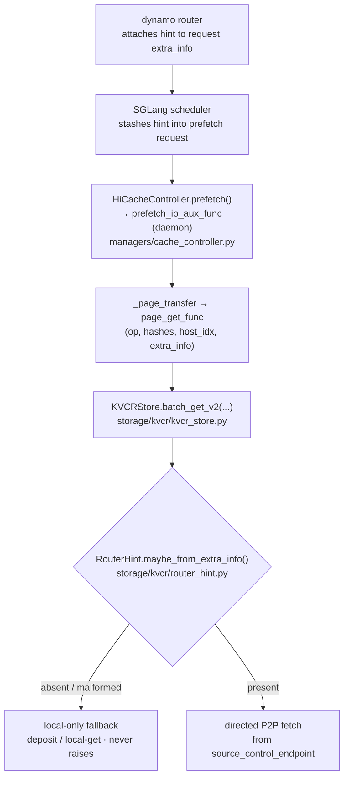
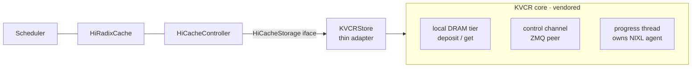
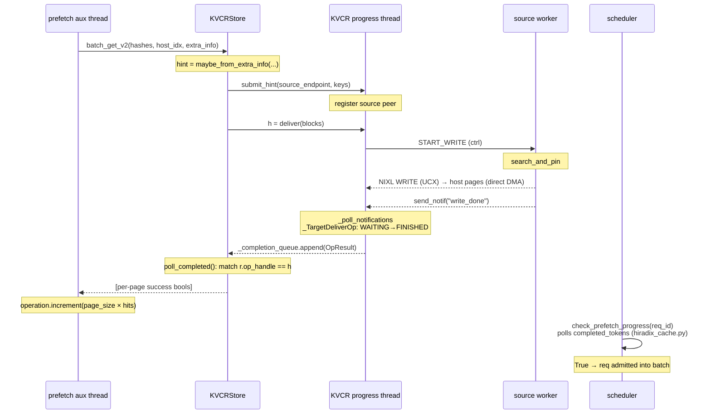

# RFC: Integrating KVCR as a HiCache Storage Backend

**Status:** Draft · **Author:** Lin Hu · **Scope:** SGLang HiCache ↔ KVCR (worker↔worker G2 KV reuse)

## Summary

SGLang's HiCache already supports pluggable L3 storage backends (mooncake, hf3fs,
eic, …) behind a stable `HiCacheStorage` interface. This RFC adds KVCR as one more
such backend. The integration is deliberately small: no changes to HiRadixCache or
the scheduler's cache path — we register a `"kvcr"` backend and implement the same
`batch_set_v2 / batch_get_v2 / batch_exists_v2` contract the other backends already
implement.

What makes KVCR different from mooncake et al. is that it is not a symmetric
external pool — it is **asymmetric peer-to-peer**: a prefix that another worker
already holds is fetched directly from that worker. To know *which* peer to fetch
from, the backend needs one piece of per-request routing metadata that a
content-addressed `get(hash)` interface does not normally carry: a **router hint**.

This RFC has two parts:
1. **Router hint** — how a dynamo-router hint reaches the storage backend.
2. **Architecture** — how KVCR plugs into HiCache, with the get-path sequence.

---

## Part 1 — Dynamo Router Hint

### Why a hint is needed

HiCache storage is content-addressed: the controller asks `get(block_hash)` and the
backend is expected to know where the bytes live. That works for a global pool. It
does **not** work for P2P reuse, where the same prefix may sit on any one of N peer
workers and the only component that knows which one is the **dynamo router** — it
made the routing decision that sent this request here in the first place. Without
that hint the backend would have to broadcast/probe every peer, which defeats the
purpose. The hint turns an O(N) discovery into an O(1) directed fetch.

### Carrier

We do **not** widen the `HiCacheStorage` signature. Every v2 call already threads a
free-form `HiCacheStorageExtraInfo.extra_info` dict from the controller into the
backend. The router hint rides in that dict under a single key:

```
extra_info.extra_info["kvcr_router_hint"] = {
    "source_control_endpoint": "host:port",   # ZMQ control endpoint of the peer holding the prefix
    "block_hashes": [...],                     # root-aligned block hashes for the shared prefix
}
```

This mirrors the compact 2-field wire schema on dynamo `oandreeva/router_hints`
(PR #11695, "Add compact router hints for remote KV reuse"). The earlier
`target_cached_prefix_blocks` advisory int was dropped from the wire in that PR
(it moved into the router-internal `RouterHintRootCandidates`).

### Propagation path

The hint travels from the dynamo router down to the backend without widening any
interface — it rides the `extra_info` dict every layer already passes through:

1. **dynamo router → scheduler.** The router attaches the hint to the request's
   `extra_info`; the scheduler stashes it into the prefetch request.
2. **scheduler → controller.** `HiCacheController.prefetch(...)` carries it into the
   daemon `prefetch_io_aux_func` thread (`managers/cache_controller.py`).
3. **controller → backend.** `_page_transfer → page_get_func(op, hashes, host_idx,
   extra_info)` hands it to `KVCRStore.batch_get_v2(...)` (`storage/kvcr/kvcr_store.py`).
4. **backend → decision.** `RouterHint.maybe_from_extra_info(extra_info)`
   (`storage/kvcr/router_hint.py`) parses it:
   - hint **absent/malformed** → fall back to local-only (deposit/local-get), never raises;
   - hint **present** → drive a directed P2P fetch from `source_control_endpoint`.



The parser is **fail-closed**: a missing or malformed hint degrades to local-only
behavior, it never crashes a prefetch. `enable_remote_hint` (backend config) gates
whether the remote path is consulted at all, so the backend is safe to ship before
the dynamo side lands.

---

## Part 2 — KVCR Integration Architecture

### Where it sits



`KVCRStore` is a thin adapter. It owns no transfer threads of its own — KVCR's core
runs **one** daemon "kvcr-progress" thread that exclusively holds the NIXL agent and
control socket. The store advances state only by calling `poll_completed()` from the
HiCache controller's existing prefetch thread. No new threading model is introduced
into SGLang.

### Segment sub-blocking (set path, already working)

KVCR's `deposit()` takes one contiguous `MemDescriptor` per key. A HiCache page is
not always one contiguous run: MHA packs K and V in separate halves of the buffer,
and layer-first pools split per layer. We handle this generically by probing
`get_page_buffer_meta` once at registration to learn `segments_per_page`, then
fanning each page-key into `hash#0, hash#1, …` KVCR block-keys. A page counts as
resident iff **all** its segments landed — the same "page = all components present"
rule Mooncake uses (`nbuf = len(ptr_list) // len(keys)`); we use a positional
`#seg` index instead of semantic suffixes. This path is implemented and offline-verified
for both MHA and MLA.

### Get path (with router hint) — sequence



Key properties this diagram makes explicit:

- **`op_handle` is a claim ticket, not a callback.** `deliver()` returns it; the
  caller matches it against `OpResult`s drained from `poll_completed()`. The
  cross-process completion signal is a NIXL notification (source→target), not the
  handle.
- **The target side is the one that learns of completion** — correctly so. The
  target is filling its own host pages and is the only party that needs to know when
  they are full. The source knows it finished the moment its WRITE returns.
- **The blocking wait lives in the prefetch aux thread, never in the scheduler.**
  The scheduler only observes `completed_tokens` via the existing
  `check_prefetch_progress` boolean tick — this is the KVPoll-style tick, unchanged.

### Operating point — sizing `--hicache-size` to the working set

This is the single configuration fact that decides whether the feature does
anything, and it is not obvious, so it belongs in the RFC rather than in a
runbook.

**The source serves from its HiCache *host* tier, not from its device radix
cache.** A prefix is a fetch candidate only while the source still holds it in
host memory. Once the host pool evicts it, the router may still be advertising
those blocks — the KV events that built the index were published earlier — so
the hint is issued, the fetch runs correctly, and it returns nothing. Everything
downstream reports an ordinary cache miss.

Measured on the 2-worker POC (Qwen3-8B, `page-size 64`, ~1216-token prompts):

| `--hicache-size` | host pool | distinct prefixes before the cliff | hit rate |
|---|---|---|---|
| 4 GB | 27,136 tokens | ~22 | collapses to ~25% past that |
| 16 GB | 108,544 tokens | > 50 | 50/50, zero misses |

Two things this rules out, both of which were tried first and moved nothing:
the KVCR local DRAM tier (8→16 GB: no change) and the router index size
(`mem-fraction-static` 0.15→0.45 grew it 633→5392 blocks, 8.5×: no change).

#### The cliff is permanent, and `--hicache-size` alone does not lift it

Past the cliff the source stops offloading *for the life of the process* — it
does not recover as older prefixes age out. `deposit_pages_offered` freezes at a
value one page-batch under the host pool and never moves again, while
`exists_calls` keeps climbing: the source is still answering residency probes,
it just has nothing new to answer with.

The mechanism is in HiRadixCache, not in this backend.
`_update_host_leaf_status` admits a node to `evictable_host_leaves` only when
`node.evicted` — that is, only after the *device* tier has already dropped it.
So host pages are reclaimed as a side effect of GPU eviction and by no other
path. When the device pool is larger than the host pool, the host pool fills
first, GPU eviction never fires, `evict_host` finds nothing evictable,
`write_backup` returns 0 forever, and offload stops for good.

Three configurations, one variable at a time (`page-size 64`, ~1216-token
prefixes ≈ 19 pages each):

| KVCR tier | host pool | device pool | collapse | `deposit_pages_offered` froze at |
|---|---|---|---|---|
| 1696 pages | 1696 pages | 5387 pages | prefix 90 | 1680 |
| 1696 pages | **848** pages | 5387 pages | prefix **46** | **844** |
| 1696 pages | 1696 pages | **< host** | none in 130 | still climbing at 2354 |

Halving the host pool halves the collapse point while the KVCR tier is held
fixed, so the tier is not the constraint. Making the device pool smaller than
the host pool removes the collapse entirely, and offload then runs *past* the
host pool size (2354 > 1696 pages) — pages are being recycled, which is exactly
what the first two rows could not do.

So the deployment guidance has two parts:

1. **Size `--hicache-size` to the shared working set,** not to a fraction of
   host RAM. `local_dram_bytes` does not substitute for it.
2. **Keep the host pool at least as large as the device pool.** SGLang already
   warns when it is not (`HiCache host KV pool (N tokens) is smaller than the
   device pool`) but frames it as reduced L2 hit rate; for an L3 backend it is
   stronger than that — it is the difference between offload working and
   offload stopping permanently.

Under either, the feature degrades quietly to "no benefit" rather than loudly to
an error — which is why the backend counts `exists_with_hint` /
`hinted_pages_loaded` separately (see below), and why `deposit_pages_offered` is
counted on the source: a frozen deposit counter next to a climbing
`exists_calls` is the signature of this specific misconfiguration.

### Observability

The remote path fails silently by construction: a hint that never arrives and a
fetch that returns nothing are both indistinguishable from a cache miss at every
layer above. `KVCRStore` therefore keeps counters and summarizes them at INFO
every 30 s (`KVCRStore remote path (cumulative): ...`). The split that matters:

- `get_without_hint` high → the **router** is not naming a source (index miss,
  upstream); nothing here is broken.
- `get_with_hint` high but `hinted_pages_loaded` ≪ `hinted_pages_requested` →
  the **fetch** is failing; that is ours.

These have opposite fixes in different repositories, and no other metric SGLang
exports can tell them apart.

### Status

| Path | State |
|------|-------|
| set / deposit (MHA + MLA, multi-segment) | implemented, verified |
| exists / batch_exists_v2 | implemented (side-effect-free residency probe) |
| get / batch_get_v2, local tier | implemented, verified |
| get / batch_get_v2, remote P2P via hint | implemented, verified e2e (2 workers, dynamo router) |
| router hint end-to-end | working against dynamo `oandreeva/router_hints` (PR #11695) |
| TP > 1 | implemented (per-rank agent name + rank-offset control port), verified at TP=2 |
| DP > 1 | implemented (per-rank endpoint), not yet exercised e2e |
| failure modes (frozen / dead / restarted source) | verified: degrades to local recompute, bounded by `get_timeout_s` |
| per-layer-list pools (DeepSeek V4 layer_first) | not supported; startup fails rather than degrading |

### Non-goals

- No changes to HiRadixCache or the scheduler cache path.
- No new SGLang-side transfer threads.
- Shared-HiCache serving (source pins from HiRadixCache via `TreeNode.protect_host`)
  is a future swap of the pin adapter only — out of scope here.
```
