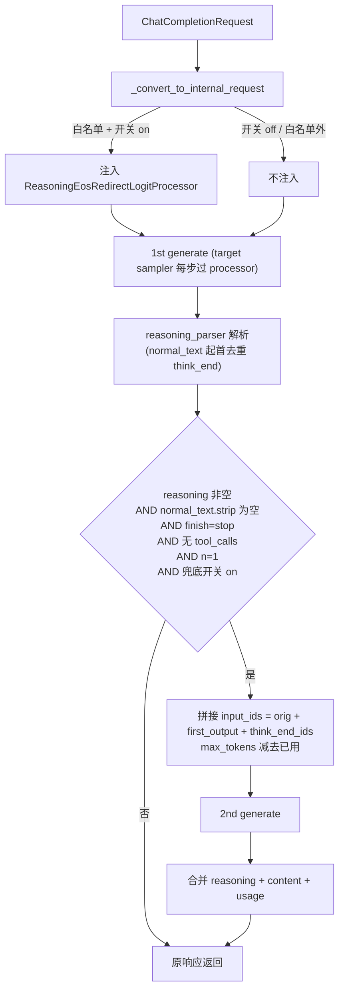

# 未闭合 reasoning 自动补救（Reasoning EOS Redirect + Fallback Continuation）

## 目标

解决"模型在 reasoning 阶段没生成 think 闭合 token 就被 chat-end token (例如 `<|im_end|>` / `[EOS]`) 提前停掉"导致 content 为空的偶发问题，同时不影响 tool call、thinking budget、reasoning-only 合法空响应等正常行为。

## 总体架构

两层互补，默认全部 off，由 server_args 与 per-request 字段独立控制：

- **路径 1（主，事中拦截，单次推理）**：仿造 [`ThinkingBudgetLogitProcessor`](python/sglang/srt/sampling/custom_logit_processor.py) 写一个 `ReasoningEosRedirectLogitProcessor`。每步对仍处于 reasoning 的请求计算 `softmax(logits/T)[eos_ids].sum()`，超过阈值就把 EOS 集合的 logit 设 -inf、把 `think_end` 的 logit 顶到 strict max，让本步精确"重定向"成 `think_end`，其它 token 完全不动。仅对 single-token think_end 的模型启用（启动期自检）。
- **方案 B（兜底，事后续写）**：在 OpenAIServingChat 层，第一次响应解析后若仍命中"reasoning 非空 + content 完全空 + finish=stop + 无 tool_calls"，就用 `GenerateReqInput(input_ids = orig_ids + first_output_ids + think_end_token_ids)` 直接发起第二次 generate（不走 chat template，prefix cache 命中率最高），把第二段 content 与第一段 reasoning 合并后返回。**不**要求 detector 仍 in_reasoning（激进策略，覆盖路径 1 触发后又立刻 EOS 的场景）。



## 详细改动清单

### 1. 配置项

- [python/sglang/srt/server_args.py](python/sglang/srt/server_args.py)：在 `ServerArgs`（约 L443，紧挨 `reasoning_parser`）新增：
  - `redirect_unclosed_reasoning: bool = False`（路径 1 开关）
  - `redirect_eos_prob_threshold: float = 0.5`（路径 1 触发阈值）
  - `auto_recover_unclosed_reasoning: bool = False`（方案 B 开关）
  - 在 `add_cli_args`（约 L4802）加对应 CLI flag。
- [python/sglang/srt/entrypoints/openai/protocol.py](python/sglang/srt/entrypoints/openai/protocol.py) `ChatCompletionRequest`（L613 附近）新增：
  - `recover_unclosed_reasoning: Optional[bool] = None`（per-request 覆盖方案 B 开关；路径 1 不做 per-request 覆盖，因为它是 sampling 层 batch 注入）。

### 2. 路径 1：`ReasoningEosRedirectLogitProcessor`

新增到 [python/sglang/srt/sampling/custom_logit_processor.py](python/sglang/srt/sampling/custom_logit_processor.py)：

```python
# 伪码
class ReasoningEosRedirectLogitProcessor(CustomLogitProcessor):
    def __call__(self, logits, custom_param_list):
        for i, params in enumerate(custom_param_list):
            if not params:
                continue
            req            = params["__req__"]
            think_start_id = params.get("think_start_token_id")  # 可为 None
            think_end_id  = params["think_end_token_id"]
            eos_ids       = params["redirect_eos_token_ids"]   # list[int]
            threshold     = params.get("prob_threshold", 0.5)
            temperature   = params.get("temperature", 1.0)
            force_reasoning = params.get("force_reasoning", False)
            spec_lookback   = params.get("spec_lookback_window", 0)  # = draft_token_num*2

            cur_ids = req.output_ids
            origin_ids = req.origin_input_ids

            # 1. in_reasoning 判定
            saw_end = (think_end_id in cur_ids)
            if saw_end:
                continue
            saw_start = (
                force_reasoning
                or (think_start_id is not None
                    and (think_start_id in cur_ids or think_start_id in origin_ids))
            )
            if not saw_start:
                continue

            # 2. spec-decode 重复 redirect 保护：最近 spec_lookback 个 token 已含 think_end 则跳过
            if spec_lookback > 0 and len(cur_ids) >= 1:
                recent = cur_ids[-spec_lookback:]
                if think_end_id in recent:
                    continue

            # 3. 触发判定：EOS 概率合计 > 阈值（temperature 校准）
            row = logits[i]
            scaled = row / max(temperature, 1e-6)
            probs  = torch.softmax(scaled, dim=-1)
            eos_prob_sum = probs[eos_ids].sum().item()
            if eos_prob_sum < threshold:
                continue

            # 4. 定点 redirect：屏蔽 EOS 集合，把 think_end 顶到 strict max
            eos_max = row[eos_ids].max().item()
            row[eos_ids] = -float("inf")
            row[think_end_id] = max(row.max().item(), eos_max) + 1.0
        return logits
```

要点：
- **temperature 校准**：从 `sampling_info.temperatures[i]` 取真实采样温度做缩放，避免 low-temp 下漏触发。需要在 `apply_custom_logit_processor` 调用时把 temperature 也下发到 custom_params；最干净的做法是在 [sampler.py L60-65](python/sglang/srt/layers/sampler.py) `_preprocess_logits` 中把 `sampling_info.temperatures` 透传，或在 processor 内通过 `params.setdefault("__sampling_info__", sampling_info)` 拿到（参考 `ThinkingBudgetLogitProcessor` 已通过 `__req__` 拿 req）。
- **`force_reasoning`**：DeepSeek-R1 原生 chat template 不带 `<think>`，detector 直接 `_in_reasoning=True` 起手；processor 也要支持这种"无起始 token 但默认在 reasoning"的语义。
- **spec_lookback_window**：取 `server_args.speculative_num_draft_tokens` 或类似值的 2 倍；`server_args.speculative_algorithm` 为空时取 0。在 `_convert_to_internal_request` 注入参数时一次填好。
- **只改两类下标的 logits**：其它 token logit 完全不动，与 grammar mask、penalty 链路兼容（grammar mask 在 `_preprocess_logits` 之后才应用，若 grammar 强行不允许 think_end，最终采样不会是 think_end，但 EOS 已经 -inf，模型仍不会停 → 结果是模型按 grammar 走、不停）。

### 3. 启动期自检 + 白名单注册

新增轻量注册表（可放在 [python/sglang/srt/parser/reasoning_parser.py](python/sglang/srt/parser/reasoning_parser.py) 内或新建 `reasoning_token_registry.py`）：

```python
# 伪码
REDIRECT_WHITELIST = {
    "qwen3", "qwen3-thinking",
    "glm45",
    "deepseek-r1",
    "kimi_k2",  # Kimi K2 / K2.5: </think> 单 token
    "minimax",
    # 不进入: "gpt-oss" (Harmony 特殊), "gemma4", "minimax-append-think"
    #         "mistral" / "kimi" 视 tokenizer 自检结果
}

def build_redirect_config(server_args, tokenizer, reasoning_parser_name):
    if not server_args.redirect_unclosed_reasoning: return None
    if reasoning_parser_name not in REDIRECT_WHITELIST: 
        logger.warning(...); return None
    detector_cls = ReasoningParser.DetectorMap[reasoning_parser_name]
    # 用一个临时实例拿 think_start/end token 字符串
    tmp = detector_cls()
    end_ids = tokenizer.encode(tmp.think_end_token, add_special_tokens=False)
    if len(end_ids) != 1:
        logger.warning("multi-token think_end, redirect disabled"); return None
    start_ids = tokenizer.encode(tmp.think_start_token, add_special_tokens=False) \
                if tmp.think_start_token else []
    eos_ids = derive_chat_eos_ids(tokenizer, server_args)  # 见下
    return {
        "think_end_token_id": end_ids[0],
        "think_start_token_id": start_ids[0] if len(start_ids) == 1 else None,
        "redirect_eos_token_ids": eos_ids,
        "force_reasoning": (reasoning_parser_name == "deepseek-r1"),
        "prob_threshold": server_args.redirect_eos_prob_threshold,
        "spec_lookback_window": (server_args.speculative_num_draft_tokens or 0) * 2,
    }

def derive_chat_eos_ids(tokenizer, server_args):
    ids = set()
    # generation_config.eos_token_id 可能是 int 或 list
    eos = getattr(tokenizer, "eos_token_id", None)
    if isinstance(eos, int): ids.add(eos)
    elif isinstance(eos, (list, tuple)): ids.update(eos)
    # 模型特有的 chat-end token
    for name in ("<|im_end|>", "<|end|>", "<|eot_id|>", "<|endoftext|>", "[EOS]"):
        try:
            tid = tokenizer.convert_tokens_to_ids(name)
            if isinstance(tid, int) and tid >= 0: ids.add(tid)
        except Exception: pass
    return sorted(ids)
```

调用位置：[python/sglang/srt/entrypoints/openai/serving_chat.py](python/sglang/srt/entrypoints/openai/serving_chat.py) `OpenAIServingChat.__init__`，把 `self._redirect_config = build_redirect_config(...)` 缓存好。

### 4. 注入 processor 到 GenerateReqInput

在 `_convert_to_internal_request`（约 [serving_chat.py L300-330](python/sglang/srt/entrypoints/openai/serving_chat.py)）：

```python
# 伪码
if self._redirect_config is not None:
    cfg = self._redirect_config
    # 检查不与用户自定义 processor 冲突 / 共存
    extra_proc_str = ReasoningEosRedirectLogitProcessor.to_str()
    extra_params = dict(cfg)  # copy

    if request.custom_logit_processor is None:
        adapted_request.custom_logit_processor = extra_proc_str
        adapted_request.custom_params = extra_params
    else:
        # 已有用户 processor: 走"链式 processor"路径
        # SGLang 已支持 sampling_batch_info.custom_logit_processor 是 dict
        # 但 GenerateReqInput 接口当前是单值；本期实现：如果用户已传，记录 warning 并跳过注入
        logger.warning("user custom_logit_processor present, skip auto redirect injection for rid=%s", request.rid)
```

> 长期可以扩展 `GenerateReqInput.extra_custom_logit_processors: List[str]` 支持多 processor；本期保守处理。

### 5. ReasoningParser 解析层去重（spec-decode 兜底）

[python/sglang/srt/parser/reasoning_parser.py](python/sglang/srt/parser/reasoning_parser.py) `BaseReasoningFormatDetector.detect_and_parse` 在拿到 `normal_text` 之后激进过滤：

```python
# splits 后已有 normal_text = splits[1].strip()
# 防御 spec-decoding 重复 redirect 留下的多余 think_end token
while normal_text.startswith(self.think_end_token):
    normal_text = normal_text[len(self.think_end_token):].lstrip()
```

`parse_streaming_increment` 同步：在 `current_text.find(self.think_end_token)` 切分后，对 `normal_text` 做同样 lstrip 循环。

这样无论上游 redirect 是否漏过、spec-decode 是否多塞了一两个 think_end，最终用户拿到的 normal_text 都是干净的。

### 6. 方案 B 兜底（非流式）

`_handle_non_streaming_request`（[serving_chat.py L928](python/sglang/srt/entrypoints/openai/serving_chat.py)）改造：

1. 拿到 `ret`、构造 `response = self._build_chat_response(...)` 之前，先做"是否需要兜底"判定：
   ```python
   def _should_recover_b(self, request, ret_item, parser, tool_calls):
       if not (request.recover_unclosed_reasoning if request.recover_unclosed_reasoning is not None
               else self.tokenizer_manager.server_args.auto_recover_unclosed_reasoning):
           return False
       fr = ret_item["meta_info"].get("finish_reason")
       if not fr or fr.get("type") != "stop": return False
       if request.n != 1: return False
       if request.continue_final_message: return False
       if tool_calls: return False
       # 重新跑 parser 拿 (reasoning, normal)
       reasoning_text, normal_text = parser.parse_non_stream(ret_item["text"])
       if not reasoning_text: return False
       if (normal_text or "").strip(): return False  # C 场景放宽：有非空白 content 就不兜底
       return True
   ```

2. 满足条件就续写：
   ```python
   first_output_ids = ret_item["meta_info"]["output_ids"]  # 若没有则用 tokenizer.encode(ret_item["text"])
   think_end_ids   = self._redirect_config["think_end_token_ids"] if self._redirect_config \
                     else self.tokenizer_manager.tokenizer.encode(detector.think_end_token, add_special_tokens=False)
   recovered_input_ids = list(adapted_request.input_ids) + list(first_output_ids) + list(think_end_ids)

   recovered_sampling = copy.deepcopy(adapted_request.sampling_params)
   used = ret_item["meta_info"]["completion_tokens"]
   for k in ("max_new_tokens", "max_tokens"):
       if recovered_sampling.get(k):
           recovered_sampling[k] = max(1, recovered_sampling[k] - used - len(think_end_ids))
           if recovered_sampling[k] <= 0: 
               return response  # 预算耗尽，原样返回

   recovered_adapted = GenerateReqInput(
       input_ids=recovered_input_ids,
       sampling_params=recovered_sampling,
       stream=False,
       rid=f"{request.rid}-recover" if request.rid else None,
       bootstrap_host=adapted_request.bootstrap_host,
       bootstrap_port=adapted_request.bootstrap_port,
       bootstrap_room=adapted_request.bootstrap_room,
       # ... 复用 lora_path / extra_key / image_data 等
       require_reasoning=False,  # 已经离开 reasoning 阶段
   )
   ret2 = await self.tokenizer_manager.generate_request(recovered_adapted, raw_request).__anext__()
   ```

3. 合并：
   - `content`：第二次 `ret2["text"]` 经 reasoning_parser 解析后的 normal_text（detector previous_content 含 think_end，自动当 normal_text）；
   - `reasoning_content`：保留第一次的 reasoning_text；
   - `usage.prompt_tokens`：第二次的（更准确反映总 prefill）；
   - `usage.completion_tokens`、`usage.reasoning_tokens`：累加；
   - `finish_reason`：第二次的；
   - `logprobs / hidden_states / routed_experts`：以第二次为准并 log warning（合并复杂度过高，本期不做）。

4. 防递归：第二次请求显式不再启用方案 B（在 `recovered_adapted` 上不挂 `recover_unclosed_reasoning` 标记，且对方案 B 的条件函数加 `not request.recover_unclosed_reasoning is False` 等价的早期 return）。最简洁的做法：在 `_should_recover_b` 顶部检查 `getattr(adapted_request, "_is_recovery_request", False)`，并在 `recovered_adapted` 上挂 `_is_recovery_request = True`（GenerateReqInput 加一个 internal-only 字段或者用 extra_key 透传都可以；首选加字段）。

### 7. 方案 B 兜底（流式）

`_generate_chat_stream`（[serving_chat.py L639](python/sglang/srt/entrypoints/openai/serving_chat.py)）改造：

1. 主循环已经把每个 index 的原始 raw text 累积在 `stream_buffers[index]`、reasoning parser 缓存在 `reasoning_parser_dict[index]`、`finish_reasons[index]` 里有 finish_reason。
2. 在 `# Send finish_reason chunks for each index that completed` 之前（[L831](python/sglang/srt/entrypoints/openai/serving_chat.py)），新增判定：仅当 `len(finish_reasons) == 1`、`request.n == 1`、且 `_should_recover_b_stream(...)` 通过时进入兜底流程：
   - **不要**先 yield finish_reason chunk；
   - 构造 `recovered_adapted`（同非流式逻辑，但 `stream=True`）；
   - `async for c in self.tokenizer_manager.generate_request(recovered_adapted, raw_request)` 拿第二段流；
   - 跳过第二次的 first role chunk；reasoning delta 一般为空（previous_content 含 think_end）；正常透传 content delta，每个 chunk 走 `DeltaMessage(content=...)`；
   - 累加 prompt/completion/reasoning tokens；
   - 第二段流结束后再 yield 真正的 `finish_reason_chunk` / hidden_states / usage chunk。
3. 异常保护：`try/except` 包裹兜底流程，第二次请求抛错时回退到原 finish_reason chunk + warning，避免影响 `[DONE]`。
4. 抽出内部 helper `_stream_recover_followup(...)` 保持主循环可读。

### 8. 测试矩阵

新增 [test/registered/openai_server/basic/test_recover_unclosed_reasoning.py](test/registered/openai_server/basic/test_recover_unclosed_reasoning.py) + 单元测试：

- **路径 1 触发**：mock logits 让 EOS 概率 > 阈值，断言 sampling 结果 = think_end_id；其它场景下 logits 完全未改动。
- **路径 1 不触发**：EOS 概率 < 阈值；`_in_reasoning=False`；force_reasoning=False 且 think_start 不在；spec_lookback 内已含 think_end。
- **temperature 校准**：raw 0.4、temp=0.1（缩放后 ~0.95）应触发。
- **EOS 集合默认推断**：Qwen3 / Kimi K2.5 tokenizer 自检后的 eos_ids 是否包含 `<|im_end|>` / `[EOS]`。
- **方案 B 触发（场景 A）**：first response = `<think>thinking...<|im_end|>`，开关 on，断言最终响应有 `</think>` 后续 content。
- **方案 B 触发（场景 B）**：first response = `<think>thinking...</think><|im_end|>`，开关 on（注意：normal_text strip 后为空），断言兜底续写。
- **方案 B 不触发（场景 C）**：first response = `<think>...</think>好的<|im_end|>`，断言不兜底。
- **方案 B 不触发（合法空响应 + 开关 off）**：默认配置下不兜底。
- **Tool call 不兜底**：first response 含 tool_calls 解析结果。
- **n>1 / continue_final_message=True 不兜底**。
- **递归保护**：第二次请求不再触发方案 B，即使仍空 content。
- **Spec decoding**：mock eagle3，draft 在位置 0/1 出 EOS：(a) 路径 1 启用：断言最终 normal_text 干净（无重复 think_end）；(b) 路径 1 + 重复 redirect 触发：断言 ReasoningParser lstrip 起作用。
- **Multi-token 降级**：mock tokenizer 让 `</think>` 编码成 [t1, t2, t3]，启动期 redirect_config = None，开关 on 时方案 B 仍能续写。
- **Streaming**：路径 1 触发后端到端流；方案 B 兜底流。
- **Thinking budget 共存**：同时开启 `Qwen3ThinkingBudgetLogitProcessor` + redirect，budget 命中时 think_end 注入；redirect 不双重介入。
- **Grammar / structured output**：JSON schema 限制下 redirect 不破坏约束（如有冲突，至少不崩溃）。

## 配置示例

```bash
# 路径 1 + 方案 B 全开
python -m sglang.launch_server \
    --model-path moonshotai/Kimi-K2.5 \
    --reasoning-parser kimi_k2 \
    --redirect-unclosed-reasoning \
    --redirect-eos-prob-threshold 0.5 \
    --auto-recover-unclosed-reasoning
```

per-request 覆盖（仅控制方案 B）：

```json
{ "messages": [...], "recover_unclosed_reasoning": true }
```

## 已知限制（README / CLI help 文档化）

1. **Logprobs 透露内部行为**：路径 1 触发的那一步，think_end 的 logprob 被人为顶到极高、EOS 被打到 -inf；用户开 `logprobs+top_logprobs` 能看到。本期不做"还原显示"，作为已知限制说明。
2. **方案 B 二次 logprobs / hidden_states 合并**：以第二次为准，第一次部分丢弃并 log warning。
3. **Spec decoding accept length**：路径 1 触发会让 verify 在该位置 reject，spec 加速比短期下降。
4. **`max_tokens` 耗尽 (finish_reason=length)**：完全不介入，行为保持原样。
5. **Harmony / Gemma4 / minimax-append-think**：不在路径 1 白名单；方案 B 因为依赖 `reasoning_parser.detector.think_end_token`，理论上能跑，但 Harmony 的 reasoning 边界不是简单字符串，建议这几个 parser 也跳过方案 B（在 `_should_recover_b` 加白名单 check）。
6. **多 processor 链路**：用户已传 `custom_logit_processor` 时，本期跳过自动注入并 warning；后续可扩展 `GenerateReqInput.extra_custom_logit_processors`。
7. **PD disaggregation**：custom_logit_processor / custom_params 已经支持随 req 跨节点；方案 B 第二次请求复制 bootstrap 字段；若 KV cache 已被释放则二次 prefill 只是缺一个 prefix cache 命中，不影响正确性。

## 风险与对策（最终汇总）

- **路径 1 误触发（temperature 极高）**：阈值 0.5 默认保守 + temperature 校准；可通过 `--redirect-eos-prob-threshold` 调高。
- **路径 1 漏触发**：方案 B 兜底（场景 A/B 全覆盖）。
- **路径 1 触发后立即又 EOS（场景 B）**：方案 B 激进策略覆盖。
- **C 场景"几个空白字符然后 EOS"**：放宽不兜底（保留模型短回复的合法性）。
- **Spec-decode verify 重复 redirect → 双 think_end**：双层防御：processor 内 `spec_lookback_window` + ReasoningParser 解析层 lstrip。
- **multi-token think_end**：启动自检自动禁用路径 1，方案 B 接管。
- **递归补救**：`_is_recovery_request` 标志 + 接口级保护。
- **Tool call / thinking budget**：触发条件互斥，已分别在路径 1（`saw_end` 早返回）与方案 B（`if tool_calls: return False` + budget 命中后 detector 已收到 think_end）层校验。
- **二次请求超 context 长度 / token 预算耗尽**：try/except 包裹，失败回退到原响应 + warning。
- **gpt-oss / gemma4 / harmony**：双层都跳过。

## 上线建议

- 两个开关默认 off，渐进灰度；
- 加结构化日志（rid + 触发场景 + EOS 概率 + 第二次 token 用量），便于评估触发率；
- 测试矩阵中 spec decoding 用例必须通过后再合并主分支。
