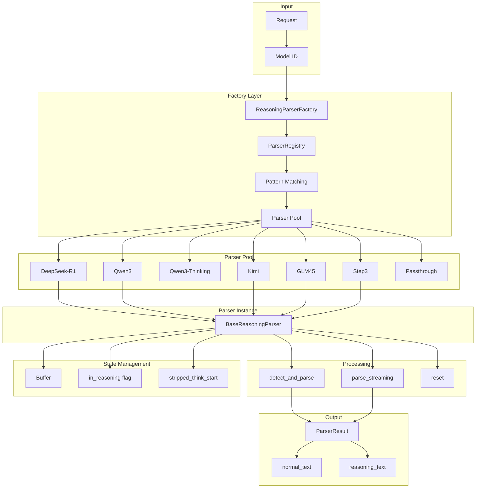
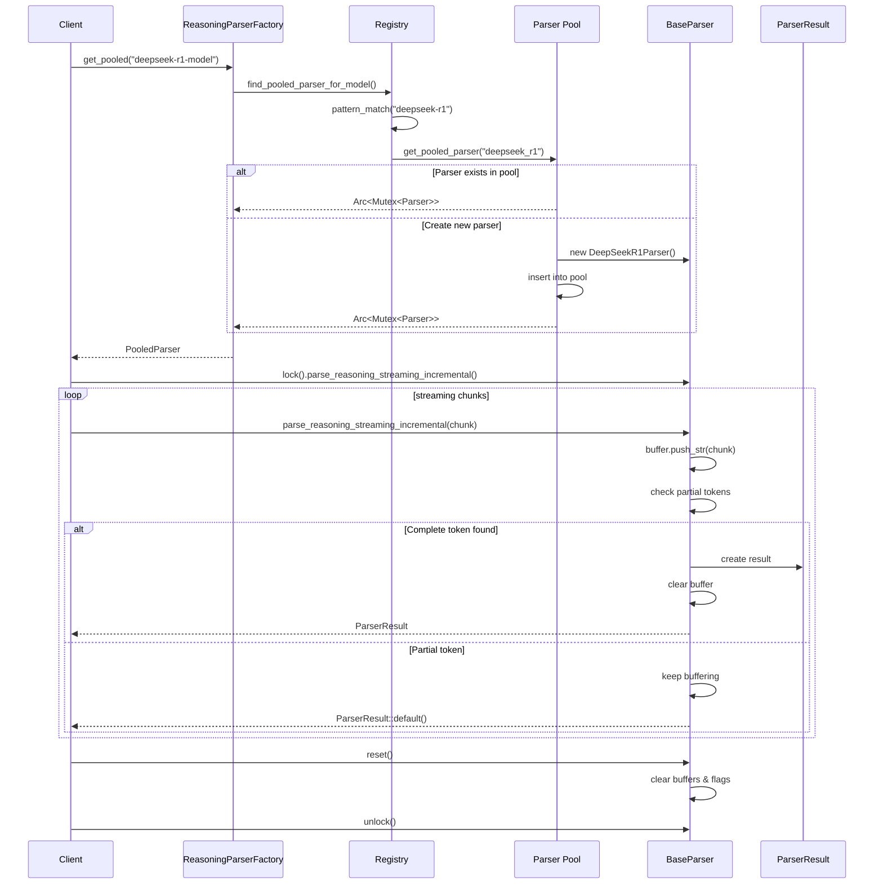
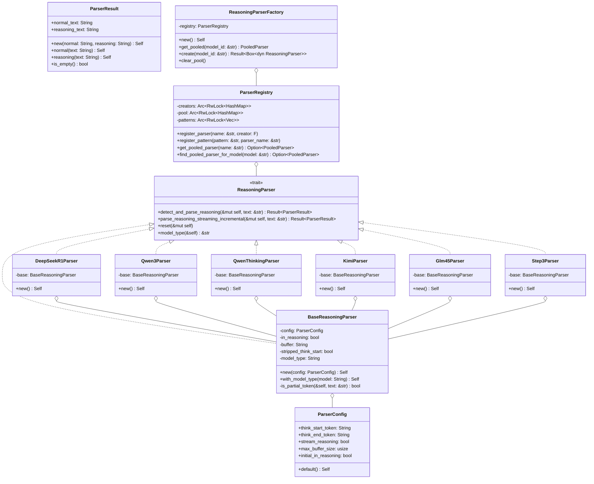

# Reasoning Parser Architecture

## 1. Executive Summary

### High-Level Overview

The reasoning parser layer provides a unified interface for detecting and extracting reasoning content from Large Language Model (LLM) outputs, particularly from models that support Chain-of-Thought (CoT) reasoning with explicit thinking blocks. The architecture follows a trait-based design pattern enabling pluggable parser implementations while maintaining consistent APIs across different model families that use various reasoning token formats.

**Key Components:**
- **Factory Pattern**: Registry-based creation and pooling of model-specific parsers
- **Trait System**: `ReasoningParser` trait for implementation flexibility
- **Parser Pooling**: Efficient reuse of parser instances across concurrent requests
- **Streaming Support**: Incremental parsing with partial token buffering
- **Model Detection**: Pattern-based matching for automatic parser selection
- **State Management**: Stateful parsing for streaming scenarios with buffer management
- **Thread Safety**: Arc<Mutex> based sharing for high-concurrency environments
- **Extensibility**: Easy addition of new model-specific parsers

**Data Flow:**
1. Request → Factory (model detection) → Pooled Parser Retrieval
2. One-Shot: Text → Parser → ParserResult (normal + reasoning text)
3. Streaming: Chunks → Parser (stateful) → Incremental ParserResult
4. Buffer Management: Partial Tokens → Buffer → Complete Token Detection
5. Reset: Parser State → Clear Buffers → Ready for Reuse

### Architecture Highlights

- **Model-Specific Parsers**: DeepSeek-R1, Qwen3, Kimi, GLM45, Step3 variants
- **Parser Pooling**: Singleton instances per model type for memory efficiency
- **High Concurrency**: Mutex-protected parsers handle 1000+ req/sec
- **Buffer Overflow Protection**: Configurable max buffer size (default 64KB)
- **Partial Token Detection**: Intelligent buffering for incomplete delimiters
- **Passthrough Mode**: Graceful fallback for unknown models
- **Zero-Copy Where Possible**: Efficient string handling in hot paths

## 2. Mermaid Diagrams

### Component Flow Diagram



### Sequence Flow Diagram



### Class/Type Diagram



## 3. Module-by-Module Deep Dive

### 3.1 mod.rs (Main Module)

**Key Responsibilities:**
- Module organization and public API surface
- Re-exports for convenient access to core types
- Separation of concerns across submodules

**Module Structure:**
- `factory`: Parser creation and pooling logic
- `parsers`: Concrete parser implementations
- `traits`: Core trait definitions and types

### 3.2 traits.rs (Trait Definitions)

**ParserResult Methods**:
- `new()`: Create with both normal and reasoning text
- `normal()`: Create with only normal text (convenience)
- `reasoning()`: Create with only reasoning text (convenience)
- `is_empty()`: Check if result contains any text

**ReasoningParser Trait**:
- **`detect_and_parse_reasoning`**: One-shot parsing for complete text
- **`parse_reasoning_streaming_incremental`**: Stateful streaming parser
- **`reset`**: Clear state for parser reuse
- **`model_type`**: Identify parser variant for debugging

**ParserConfig Defaults**:
- Default tokens: `<think>` and `</think>`
- Stream reasoning: true (immediate output)
- Max buffer: 65536 bytes (64KB)
- Initial state: false (explicit reasoning blocks)

### 3.3 factory.rs (Parser Creation & Pooling)

**ParserRegistry Methods**:

1. **`register_parser`**:
   - Register creator function for parser type
   - Lazy instantiation when requested
   - Thread-safe registration

2. **`register_pattern`**:
   - Map model ID patterns to parser names
   - First-match-wins ordering
   - Case-insensitive matching

3. **`get_pooled_parser`**:
   - Check pool for existing instance
   - Create and pool if not present
   - Return Arc<Mutex> for sharing

4. **`find_pooled_parser_for_model`**:
   - Pattern match against model ID
   - Delegate to get_pooled_parser
   - Case-insensitive comparison

**ReasoningParserFactory Methods**:

1. **`new()`**:
   - Register all built-in parsers
   - Setup model pattern mappings
   - Initialize empty pool

2. **`get_pooled`**:
   - Primary API for getting parsers
   - Automatic passthrough fallback
   - Guaranteed non-null return

3. **`create`**:
   - Create fresh parser instance
   - No pooling (for testing/isolation)
   - Returns Result for error handling

**Registered Parsers**:
- `base`: Generic configurable parser
- `deepseek_r1`: DeepSeek-R1 (initial_in_reasoning=true)
- `qwen3`: Qwen3 base model (initial_in_reasoning=false)
- `qwen3_thinking`: Qwen3 thinking variant (initial_in_reasoning=true)
- `kimi`: Kimi with Unicode tokens
- `glm45`: GLM-4.5 / GLM-4.6 parser
- `step3`: Step3 parser
- `passthrough`: No-op fallback parser

**Model Pattern Mappings**:
```
"deepseek-r1" → "deepseek_r1"
"qwen3-thinking" → "qwen3_thinking"
"qwen-thinking" → "qwen3_thinking"
"qwen3" → "qwen3"
"qwen" → "qwen3"
"glm45" → "glm45"
"kimi" → "kimi"
"step3" → "step3"
```

### 3.4 parsers/base.rs (Base Implementation)

**Key Methods:**

**`detect_and_parse_reasoning`**:
```
Algorithm:
1. Check buffer overflow protection
2. Detect reasoning presence (in_reasoning OR contains start_token)
3. If no reasoning → return as normal text
4. Remove start token and trim
5. If no end token → assume truncated reasoning
6. Split on end token
7. Extract reasoning and normal portions
```

**`parse_reasoning_streaming_incremental`**:
```
Algorithm:
1. Check buffer capacity
2. Append text to buffer
3. Check if buffer is partial token prefix
4. If partial → buffer and return empty
5. Strip start token if present
6. Find end token position
7. Handle based on state:
   - In reasoning + end found → split and return both
   - In reasoning + streaming → return accumulated reasoning
   - Not in reasoning → return as normal text
   - In reasoning + no end → continue buffering
```

**Critical Features:**

1. **Partial Token Detection**:
   - Prevents premature token matching
   - Buffers incomplete delimiters
   - Essential for streaming correctness

2. **Buffer Management**:
   - Overflow protection
   - Accumulation for partial content
   - Clear on complete token detection

3. **State Tracking**:
   - `in_reasoning`: Current parsing state
   - `stripped_think_start`: Prevent double processing
   - `buffer`: Accumulated partial content


## 4. Extensibility Guide

### Adding a New Parser

**Step 1: Create Parser Implementation**

```rust
// src/reasoning_parser/parsers/mymodel.rs
use crate::reasoning_parser::parsers::BaseReasoningParser;
use crate::reasoning_parser::traits::{ParserConfig, ReasoningParser};

pub struct MyModelParser {
    base: BaseReasoningParser,
}

impl MyModelParser {
    pub fn new() -> Self {
        let config = ParserConfig {
            think_start_token: "<reasoning>".to_string(),
            think_end_token: "</reasoning>".to_string(),
            stream_reasoning: true,
            max_buffer_size: 65536,
            initial_in_reasoning: false, // or true for implicit
        };

        Self {
            base: BaseReasoningParser::new(config)
                .with_model_type("mymodel".to_string()),
        }
    }
}

impl ReasoningParser for MyModelParser {
    // Delegate to base or implement custom logic
    fn detect_and_parse_reasoning(&mut self, text: &str)
        -> Result<ParserResult, ParseError> {
        self.base.detect_and_parse_reasoning(text)
    }

    // ... other trait methods
}
```

**Step 2: Register in Factory**

```rust
// In factory.rs ReasoningParserFactory::new()
registry.register_parser("mymodel", || {
    Box::new(MyModelParser::new())
});

// Register patterns
registry.register_pattern("my-model", "mymodel");
registry.register_pattern("mymodel", "mymodel");
```

**Step 3: Export from Module**

```rust
// In parsers/mod.rs
pub use self::mymodel::MyModelParser;

// In reasoning_parser/mod.rs
pub use parsers::MyModelParser;
```

### Custom Parsing Logic

For parsers requiring custom logic beyond configuration:

```rust
impl ReasoningParser for CustomParser {
    fn parse_reasoning_streaming_incremental(&mut self, text: &str)
        -> Result<ParserResult, ParseError> {
        // Custom state machine
        // Custom token detection
        // Custom buffering strategy
        // Return appropriate ParserResult
    }
}
```
