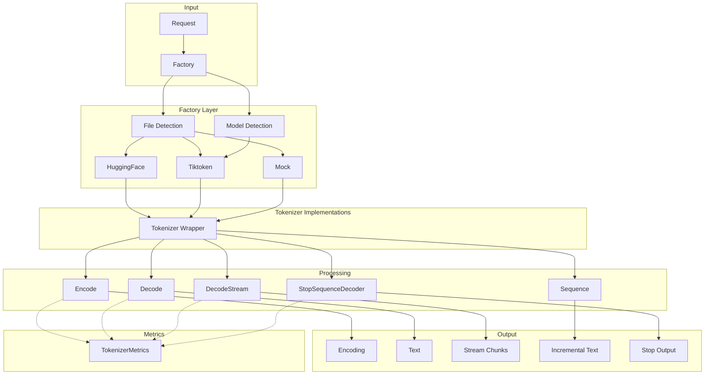
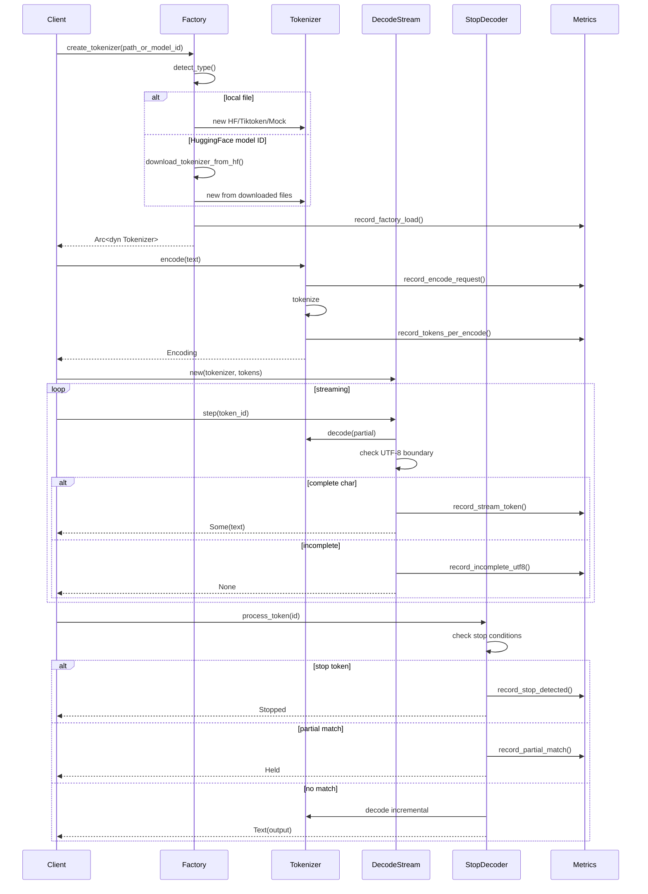
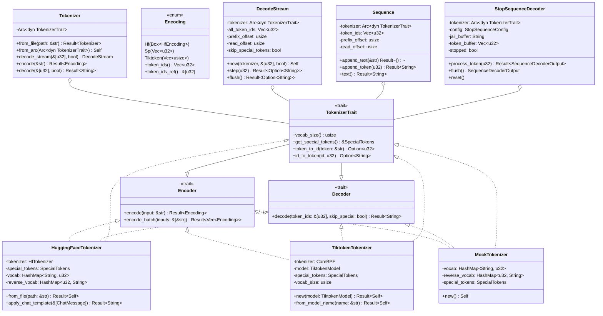

# Tokenizer Architecture

## 1. Executive Summary

### High-Level Overview

The SGL Router tokenizer layer provides a unified interface for text tokenization and detokenization, supporting multiple tokenizer backends (HuggingFace, Tiktoken, Mock) with sophisticated streaming capabilities and stop sequence detection. The architecture follows a trait-based design pattern enabling pluggable tokenizer implementations while maintaining consistent APIs across the router.

**Key Components:**
- **Factory Pattern**: Auto-detection and creation of appropriate tokenizer types from files or model names
- **HuggingFace Hub Integration**: Automatic downloading of tokenizer files from HuggingFace Hub for model IDs
- **Trait System**: `Encoder`, `Decoder`, and `Tokenizer` traits for implementation flexibility
- **Streaming**: Incremental decoding with UTF-8 boundary handling and buffering
- **Stop Sequences**: Complex pattern matching for stop tokens and sequences with "jail" buffering
- **Sequence Management**: Stateful token sequence tracking with incremental text generation
- **Chat Templates**: Jinja2-based conversation formatting with HuggingFace compatibility
- **Metrics Integration**: Comprehensive performance and error tracking across all operations

**Data Flow:**
1. Request → Factory (type detection/HF download) → Concrete Tokenizer Creation
2. Encode: Text → Tokenizer → Encoding (token IDs)
3. Stream: Token IDs → DecodeStream → Incremental Text Chunks
4. Stop Detection: Tokens → StopSequenceDecoder → Text/Held/Stopped
5. Sequence: Tokens → Sequence → Incremental Decoding → Text Output

### Architecture Highlights

- **Extended Backend Support**: HuggingFace, Tiktoken (GPT models), and Mock for testing
- **HuggingFace Hub Integration**: Automatic tokenizer downloads with caching
- **Comprehensive Metrics**: Full TokenizerMetrics integration for observability
- **Unified Dependencies**: All tokenizer backends included by default (no feature gates)
- **Stop Sequence Detection**: Sophisticated partial matching with jail buffer
- **Chat Template Support**: Full Jinja2 rendering with HuggingFace compatibility
- **Thread Safety**: Arc-based sharing with Send + Sync guarantees

## 2. Mermaid Diagrams

### Component Flow Diagram



### Sequence Flow Diagram



### Class/Type Diagram



## 3. Module-by-Module Deep Dive

### 3.1 mod.rs (Main Module)

**Location**: `src/tokenizer/mod.rs`

**Public API:**

```rust
pub struct Tokenizer(Arc<dyn traits::Tokenizer>);

impl Tokenizer {
    pub fn from_file(file_path: &str) -> Result<Tokenizer>
    pub fn from_file_with_chat_template(
        file_path: &str,
        chat_template_path: Option<&str>
    ) -> Result<Tokenizer>
    pub fn from_arc(tokenizer: Arc<dyn traits::Tokenizer>) -> Self
    pub fn decode_stream(&self, prompt_token_ids: &[u32], skip_special_tokens: bool) -> DecodeStream
    pub fn encode(&self, input: &str) -> Result<Encoding>
    pub fn encode_batch(&self, inputs: &[&str]) -> Result<Vec<Encoding>>
    pub fn decode(&self, token_ids: &[u32], skip_special_tokens: bool) -> Result<String>
    pub fn vocab_size(&self) -> usize
    pub fn get_special_tokens(&self) -> &SpecialTokens
    pub fn token_to_id(&self, token: &str) -> Option<u32>
    pub fn id_to_token(&self, id: u32) -> Option<String>
}
```

**Key Responsibilities:**
- Main wrapper providing unified interface (mod.rs:36-93)
- Arc-based shared ownership for thread safety
- Delegates to concrete implementations via trait object
- Factory method integration for creation

**State Management:**
- Single field: `Arc<dyn traits::Tokenizer>` for polymorphic dispatch
- Immutable after creation, Clone via Arc

**Re-exports** (mod.rs:26-43):
- Factory functions: `create_tokenizer`, `create_tokenizer_async`, `create_tokenizer_from_file`, `create_tokenizer_with_chat_template`
- Types: `Sequence`, `StopSequenceConfig`, `DecodeStream`, `Encoding`, `TokenizerType`
- Chat template: `ChatMessage`
- Tokenizer implementations: `HuggingFaceTokenizer`, `TiktokenTokenizer`

### 3.2 traits.rs (Trait Definitions)

**Location**: `src/tokenizer/traits.rs`

**Core Traits:**

```rust
pub trait Encoder: Send + Sync {
    fn encode(&self, input: &str) -> Result<Encoding>;
    fn encode_batch(&self, inputs: &[&str]) -> Result<Vec<Encoding>>;
}

pub trait Decoder: Send + Sync {
    fn decode(&self, token_ids: &[u32], skip_special_tokens: bool) -> Result<String>;
}

pub trait Tokenizer: Encoder + Decoder {
    fn vocab_size(&self) -> usize;
    fn get_special_tokens(&self) -> &SpecialTokens;
    fn token_to_id(&self, token: &str) -> Option<u32>;
    fn id_to_token(&self, id: u32) -> Option<String>;
}
```

**Encoding Enum** (traits.rs:24-53):
```rust
pub enum Encoding {
    Hf(Box<tokenizers::tokenizer::Encoding>),  // HuggingFace
    Sp(Vec<u32>),                               // SentencePiece
    Tiktoken(Vec<usize>),                        // GPT models
}
```

**Key Design Decisions:**
- Separation of Encoder/Decoder allows partial implementations
- Send + Sync for thread safety
- Encoding enum handles different backend representations
- `token_ids()` returns `Vec<u32>` for compatibility (traits.rs:34-40)
- `token_ids_ref()` has limitation for Tiktoken (returns empty slice)

**SpecialTokens Struct** (traits.rs:55-65):
- Standard tokens: bos, eos, unk, sep, pad, cls, mask
- Additional tokens vector for custom special tokens

### 3.3 factory.rs (Tokenizer Creation)

**Location**: `src/tokenizer/factory.rs`

**Public Functions:**

```rust
pub fn create_tokenizer_from_file(file_path: &str) -> Result<Arc<dyn traits::Tokenizer>>
pub fn create_tokenizer_with_chat_template(
    file_path: &str,
    chat_template_path: Option<&str>
) -> Result<Arc<dyn traits::Tokenizer>>
pub fn create_tokenizer(model_name_or_path: &str) -> Result<Arc<dyn traits::Tokenizer>>
pub async fn create_tokenizer_async(model_name_or_path: &str) -> Result<Arc<dyn traits::Tokenizer>>
pub fn get_tokenizer_info(file_path: &str) -> Result<TokenizerType>
```

**Auto-Detection Logic** (factory.rs:94-132):
1. Read first 512 bytes of file
2. Check for JSON format (HuggingFace)
3. Check for GGUF magic bytes
4. Check for SentencePiece patterns

**File Type Detection** (factory.rs:135-161):
- JSON detection: Skip BOM, find `{` or `[`
- SentencePiece: Check for specific byte patterns
- GGUF: Check magic number "GGUF"

**Model Name Routing** (factory.rs:145-193):
- GPT models → Tiktoken (gpt-4, gpt-3.5, davinci, curie, etc.)
- File paths → file-based creation
- HuggingFace model IDs → Automatic download from Hub

**HuggingFace Hub Integration**:
- Downloads tokenizer files (tokenizer.json, tokenizer_config.json, etc.)
- Respects HF_TOKEN environment variable for private models
- Caches downloaded files using hf-hub crate
- Async and blocking versions available

**Metrics Integration:**
- Records factory load/error events (factory.rs:56-57, 82-83)
- Tracks vocab size on successful load
- Measures load duration

### 3.4 huggingface.rs (HuggingFace Implementation)

**Location**: `src/tokenizer/huggingface.rs`

**Public API:**

```rust
pub struct HuggingFaceTokenizer {
    tokenizer: HfTokenizer,
    special_tokens: SpecialTokens,
    vocab: HashMap<String, u32>,
    reverse_vocab: HashMap<u32, String>,
}

impl HuggingFaceTokenizer {
    pub fn from_file(file_path: &str) -> Result<Self>
    pub fn from_tokenizer(tokenizer: HfTokenizer) -> Self
    pub fn apply_chat_template(&self, messages: &[ChatMessage]) -> Result<String>
}
```

**Special Token Extraction** (huggingface.rs:58-82):
- Searches for common patterns: `<s>`, `</s>`, `<unk>`, `[CLS]`, etc.
- Falls back to None if not found

**Vocab Management:**
- Builds forward and reverse mappings on creation (huggingface.rs:26-30)
- Used for token↔ID conversions

**Metrics** (huggingface.rs:97-111, 136-150):
- Tracks encode/decode requests, durations
- Records character/token counts
- Reports errors with context

**Chat Template Integration** (huggingface.rs:21-144):
- Automatic loading from tokenizer_config.json
- Custom template loading from .jinja files
- Runtime template modification via `set_chat_template()`
- Full Jinja2 rendering via minijinja
- See section 3.10 for detailed chat template architecture

### 3.5 sequence.rs (Sequence Management)

**Location**: `src/tokenizer/sequence.rs`

**Core Structure:**

```rust
pub struct Sequence {
    tokenizer: Arc<dyn TokenizerTrait>,
    token_ids: Vec<u32>,
    prefix_offset: usize,  // Start of prefix window
    read_offset: usize,     // End of processed tokens
}
```

**Key Methods:**

```rust
impl Sequence {
    pub fn new(tokenizer: Arc<dyn TokenizerTrait>) -> Self
    pub fn with_tokens(tokenizer: Arc<dyn TokenizerTrait>, token_ids: Vec<u32>) -> Self
    pub fn append_text(&mut self, input: &str) -> Result<()>
    pub fn append_token(&mut self, token_id: u32) -> Result<String>
    pub fn text(&self) -> Result<String>
}
```

**Incremental Decoding Algorithm** (sequence.rs:93-142):
1. Store old read_offset before adding token
2. Push new token, update read_offset
3. Decode prefix window (prefix_offset..old_read_offset)
4. Decode full window (prefix_offset..current)
5. Check for UTF-8 boundary issues
6. Extract only new text portion
7. Handle incomplete UTF-8 (�) by returning empty

**State Variables:**
- `token_ids`: Complete sequence of tokens
- `prefix_offset`: Where last decode started
- `read_offset`: Current position in sequence

### 3.6 stop.rs (Stop Sequence Detection)

**Location**: `src/tokenizer/stop.rs`

**Core Components:**

```rust
pub enum SequenceDecoderOutput {
    Text(String),           // Normal output
    Held,                   // Partial match, holding text
    Stopped,                // Stop matched (hidden)
    StoppedWithText(String),// Stop matched (visible)
}

pub struct StopSequenceConfig {
    pub stop_tokens: HashSet<u32>,
    pub stop_sequences: Vec<String>,
    pub visible_stop_tokens: HashSet<u32>,
    pub visible_stop_sequences: Vec<String>,
}

pub struct StopSequenceDecoder {
    tokenizer: Arc<dyn traits::Tokenizer>,
    config: StopSequenceConfig,
    jail_buffer: String,     // Held text for partial matches
    token_buffer: Vec<u32>,  // All tokens
    prefix_offset: usize,
    read_offset: usize,
    stopped: bool,
    skip_special_tokens: bool,
}
```

**Stop Detection Algorithm** (stop.rs:97-252):

1. **Token-level checks** (stop.rs:104-132):
   - Check stop_tokens → return Stopped
   - Check visible_stop_tokens → return StoppedWithText

2. **Incremental decode** (stop.rs:136-166):
   - Decode previous context
   - Decode including new token
   - Check for incomplete UTF-8

3. **String matching** (stop.rs:169-202):
   - Combine jail_buffer + new_text
   - Check for complete matches
   - Check visible sequences

4. **Partial match detection** (stop.rs:204-239):
   - Check all suffixes as potential prefixes
   - Split safe text vs potential match
   - Jail potential match text

**Critical Fix** (stop.rs:385-424):
- Ensures no repeated/accumulated output
- Only outputs NEW text, not full buffer

### 3.7 stream.rs (Streaming Decode)

**Location**: `src/tokenizer/stream.rs`

**Structure:**

```rust
pub struct DecodeStream {
    tokenizer: Arc<dyn traits::Tokenizer>,
    skip_special_tokens: bool,
    all_token_ids: Vec<u32>,
    prefix_offset: usize,
    read_offset: usize,
}
```

**Constants:**
- `INITIAL_INCREMENTAL_DETOKENIZATION_OFFSET: usize = 5` (stream.rs:9)
  - Matches HuggingFace TGI and vLLM standard

**Key Methods:**

```rust
impl DecodeStream {
    pub fn new(tokenizer, prompt_token_ids: &[u32], skip_special: bool) -> Self
    pub fn step(&mut self, id: u32) -> Result<Option<String>>
    pub fn step_batch(&mut self, token_ids: &[u32]) -> Result<Vec<String>>
    pub fn flush(&mut self) -> Result<Option<String>>
    pub fn tokens(&self) -> &[u32]
}
```

**Streaming Algorithm** (stream.rs:47-82):
1. Append token to buffer
2. Decode prefix window for context
3. Decode full window
4. Check for incomplete UTF-8 (�)
5. Extract new text if complete
6. Update offsets for next iteration

**Metrics:**
- Records stream tokens, incomplete UTF-8, step duration

### 3.8 tiktoken.rs (Tiktoken Implementation)

**Location**: `src/tokenizer/tiktoken.rs`

**Public API:**

```rust
pub struct TiktokenTokenizer {
    tokenizer: CoreBPE,
    model: TiktokenModel,
    special_tokens: SpecialTokens,
    vocab_size: usize,
}

pub enum TiktokenModel {
    Cl100kBase,  // GPT-4, GPT-3.5-turbo
    P50kBase,    // Codex, text-davinci-002/003
    P50kEdit,    // Edit models
    R50kBase,    // GPT-3 (davinci, curie, etc.)
}
```

**Model Detection** (tiktoken.rs:67-81):
- GPT-4, GPT-3.5, turbo → Cl100kBase
- davinci-002/003, codex → P50kBase
- edit models → P50kEdit
- davinci, curie, babbage, ada → R50kBase

**Vocab Sizes** (tiktoken.rs:46-50):
- Cl100kBase: 100,256 tokens
- P50k variants: 50,281 tokens
- R50kBase: 50,257 tokens

**Special Tokens** (tiktoken.rs:84-114):
- All models use `<|endoftext|>` for BOS/EOS/PAD
- Cl100k adds FIM tokens for code completion

**Limitations:**
- No token↔ID mapping (returns None) (tiktoken.rs:151-161)
- Requires Vec<u32> → Vec<usize> conversion

### 3.9 mock.rs (Testing Implementation)

**Location**: `src/tokenizer/mock.rs`

**Purpose:** Simple tokenizer for unit testing

**Vocabulary:**
- 8 predefined tokens: "Hello"→1, "world"→2, "test"→3, etc.
- Special tokens: `<eos>`→999, `<bos>`→1000

**Behavior:**
- Encode: Split on whitespace, lookup tokens
- Decode: Join tokens with spaces
- Skips special tokens when requested

### 3.10 hub.rs (HuggingFace Hub Download)

**Location**: `src/tokenizer/hub.rs`

**Purpose:** Download tokenizer files from HuggingFace Hub when given a model ID.

**Key Functions:**

```rust
pub async fn download_tokenizer_from_hf(model_id: impl AsRef<Path>) -> Result<PathBuf>
pub async fn from_hf(name: impl AsRef<Path>, ignore_weights: bool) -> Result<PathBuf>
```

**Features:**
- Downloads only tokenizer-related files by default
- Filters out model weights, images, and documentation
- Uses HF_TOKEN environment variable for authentication
- Returns cached directory path for subsequent use
- Progress indication during download

**File Detection:**
- Tokenizer files: tokenizer.json, tokenizer_config.json, special_tokens_map.json
- Vocabulary files: vocab.json, merges.txt
- SentencePiece models: *.model files

### 3.11 chat_template.rs (Chat Template Support)

**Location**: `src/tokenizer/chat_template.rs`

**Purpose:** Jinja2-based chat template rendering for conversation formatting, matching HuggingFace transformers' `apply_chat_template` functionality.

**Core Components:**

```rust
pub struct ChatMessage {
    pub role: String,
    pub content: String,
}

pub struct ChatTemplateProcessor {
    template: String,
    bos_token: Option<String>,
    eos_token: Option<String>,
}
```

**Key Features:**

1. **Jinja2 Template Rendering** (chat_template.rs:63-102):
   - Uses minijinja crate for Jinja2 compatibility
   - Supports full Jinja2 syntax (loops, conditionals, variables)
   - Compatible with HuggingFace chat templates

2. **Template Loading Sources:**
   - **tokenizer_config.json** (automatic): Default behavior when creating tokenizer
   - **.jinja files** (explicit): Custom templates that override built-in
   - **Programmatic** (runtime): `set_chat_template()` method

3. **Loading Priority:**
   ```rust
   // Priority order:
   // 1. Explicit .jinja file (if provided) - OVERRIDES all
   // 2. tokenizer_config.json (if exists)
   // 3. Fallback to simple formatting
   ```

**Template Variables:**
- `messages`: Array of chat messages with role and content
- `add_generation_prompt`: Boolean for assistant prompt
- `bos_token`: Beginning of sequence token
- `eos_token`: End of sequence token

**API Methods:**

```rust
// Factory level - create with custom template
pub fn create_tokenizer_with_chat_template(
    tokenizer_path: &str,
    chat_template_path: Option<&str>
) -> Result<Arc<dyn Tokenizer>>

// HuggingFace tokenizer methods
impl HuggingFaceTokenizer {
    // Load with custom template (overrides built-in)
    pub fn from_file_with_chat_template(
        file_path: &str,
        chat_template_path: Option<&str>
    ) -> Result<Self>

    // Set template after creation (mimics Python)
    pub fn set_chat_template(&mut self, template: String)

    // Apply template to messages
    pub fn apply_chat_template(
        &self,
        messages: &[ChatMessage],
        add_generation_prompt: bool
    ) -> Result<String>
}
```

**Template Examples:**

1. **Llama-style Template:**
   ```jinja
   
   {{- '<|start_header_id|>' + message['role'] + '<|end_header_id|>\n\n' }}
   {{- message['content'] + '<|eot_id|>' }}
   
   
   {{- '<|start_header_id|>assistant<|end_header_id|>\n\n' }}
   
   ```

2. **ChatML Format:**
   ```jinja
   
   {{- '<|im_start|>' + message['role'] + '\n' }}
   {{- message['content'] + '<|im_end|>\n' }}
   
   
   {{- '<|im_start|>assistant\n' }}
   
   ```

**Integration with HuggingFace Tokenizer:**

1. **Automatic Loading** (huggingface.rs:108-124):
   - Searches for tokenizer_config.json in same directory
   - Extracts `chat_template` field if present
   - Stores template for use in apply_chat_template

2. **Override Mechanism** (huggingface.rs:28-50):
   - If chat_template_path provided, loads from .jinja file
   - Replaces any existing template from tokenizer_config.json
   - Matches Python's behavior: custom templates always override

3. **Runtime Modification** (huggingface.rs:140-144):
   - `set_chat_template()` allows changing template after creation
   - Equivalent to Python's `tokenizer.chat_template = template`

**Testing Coverage:**
- Template rendering with various formats (Llama, ChatML, custom)
- Loading from .jinja files
- Override behavior verification
- Runtime template modification
- Special token handling

## 4. Traits & Contracts

### Core Trait Hierarchy

1. **Encoder** (traits.rs:4-7)
   - Contract: Convert text to token IDs
   - Requirements: Send + Sync for thread safety
   - Error handling via Result

2. **Decoder** (traits.rs:10-12)
   - Contract: Convert token IDs to text
   - `skip_special_tokens` parameter for filtering

3. **Tokenizer** (traits.rs:15-20)
   - Extends both Encoder and Decoder
   - Adds vocab introspection
   - Token↔ID bidirectional mapping

### Encoding Contract

The `Encoding` enum must:
- Provide `token_ids()` returning Vec<u32>
- Support multiple backend representations
- Handle type conversions (usize→u32 for Tiktoken)

### Special Token Guarantees

- BOS/EOS tokens for sequence boundaries
- UNK for out-of-vocabulary handling
- Optional tokens may be None
- Additional tokens for custom use cases

## 5. Tokenizer Implementations

### HuggingFace Adapter

**Normalization/Pretokenization:**
- Handled by underlying `tokenizers` crate
- Configurable via JSON tokenizer files
- BPE, WordPiece, Unigram models supported

**API Mapping:**
- `encode(input, add_special_tokens=false)` → Encoding::Hf
- Batch encoding supported natively
- Vocab extraction for lookups

### Tiktoken Adapter

**Model Families:**
- cl100k_base: Modern GPT models (GPT-4, GPT-3.5)
- p50k_base: Codex and davinci-002/003
- p50k_edit: Edit-specific models
- r50k_base: Classic GPT-3

**Byte-Level Behavior:**
- Direct byte-pair encoding without pretokenization
- No subword regularization
- Deterministic encoding

### Sequence/Stop Modules

**Algorithms:**

1. **Substring Matching:**
   - Exact match for stop sequences
   - Prefix detection for partial matches

2. **Streaming Matcher:**
   - Incremental text accumulation
   - Jail buffer for uncertain text
   - Release on divergence

3. **Overlap Handling:**
   - Token boundaries respected
   - UTF-8 boundary checking
   - Multi-byte character safety

**Window Sizes:**
- Initial offset: 5 tokens (standard)
- Prefix window: Variable based on decoding
- Jail buffer: Unbounded (cleared on match/divergence)

## 6. Streaming Integration

### Pipeline Position

1. **Tokenization Phase:**
   - Runs during request preprocessing
   - Caches prompt encodings

2. **Decoding Phase:**
   - Runs per-token during generation
   - Maintains streaming state

### Buffering Policy

- **Token Buffer:** Complete sequence retained
- **Prefix Window:** Sliding window for context
- **Partial Detokenization:** Hold incomplete UTF-8
- **Chunk Boundaries:** Char-aligned output

### Emission Rules

- **Intermediate:** Emit on complete characters
- **Final:** Flush any remaining text
- **Stop Conditions:** Immediate termination
- **Errors:** Propagate with context

## 7. Testing & Benchmarking

### Test Coverage Summary

**Unit Tests (38 tests across 7 modules):**
- `factory.rs`: 4 tests - JSON detection, file types, model routing
- `huggingface.rs`: 1 test - Chat template handling
- `sequence.rs`: 5 tests - Append operations, incremental decode
- `stop.rs`: 9 tests - Stop detection, partial matches, jail buffer
- `tiktoken.rs`: 7 tests - Model detection, encode/decode roundtrip
- `chat_template.rs`: 3 tests - Template rendering, loading
- `tests.rs`: 9 tests - Cross-module integration

**Integration Tests (10 tests in tokenizer_integration.rs):**
- HuggingFace tokenizer hash verification
- Encode/decode lifecycle testing
- Sequence operations with real tokenizers
- Decode streaming with prefill
- Stop sequence detection scenarios
- Factory creation patterns
- Batch encoding verification
- Special token handling
- Thread safety validation

### Benchmark Suite (tokenizer_benchmark.rs)

**Performance Benchmarks (12 benchmark groups):**
1. **Encode Throughput**: Single-threaded encoding performance
2. **Batch Encode**: Batch vs individual encoding comparison
3. **Concurrent Encode**: Multi-request concurrent encoding
4. **Decode Performance**: Various decode scenarios
5. **Streaming Decode**: 100K token streaming performance
6. **Latency Distribution**: P50/P90/P99 latency metrics
7. **Concurrent Streaming**: Multi-stream performance
8. **Stop Sequences**: Stop detection overhead
9. **Multithreaded Encode**: Thread scaling characteristics
10. **Multithreaded Decode**: Decode thread scaling
11. **Memory Efficiency**: Memory usage patterns
12. **Scaling Characteristics**: Performance vs input size

**Test Prompts:**
- Short: 30 chars ("What is the capital of France?")
- Medium: 201 chars (Quantum computing explanation)
- Long: 638 chars (Software engineering review)

## 8. Operational Concerns

### Configuration

**Environment Variables:**
- `HF_TOKEN`: HuggingFace authentication token for private models

**Dependencies:**
- All tokenizer backends included by default
- No feature flags required

**Model Mapping:**
- Hardcoded in factory.rs
- TODO: Make configurable

### Metrics

**Metric Names (via TokenizerMetrics):**
- `sgl_tokenizer_encode_duration_seconds`
- `sgl_tokenizer_decode_duration_seconds`
- `sgl_tokenizer_tokens_per_encode`
- `sgl_tokenizer_chars_per_encode`
- `sgl_tokenizer_factory_load_duration_seconds`
- `sgl_tokenizer_stop_sequence_detected`
- `sgl_tokenizer_stream_incomplete_utf8_total`

**Labels:**
- `tokenizer_type`: huggingface, tiktoken, mock
- `operation`: encode, decode, factory_load
- `error_type`: Various error conditions

### Failure Modes

1. **File Not Found:** Clear error with path
2. **Unsupported Format:** Lists supported types
3. **Feature Disabled:** Suggests enabling feature
4. **Decode Errors:** Context in error message
5. **Incomplete UTF-8:** Handled gracefully

### Dynamic Batching Analysis

**Note**: Dynamic batching implementation was explored but found to have significant overhead:
- Channel communication adds ~3-4ms latency per request
- Single requests are ~300x slower with dynamic batching
- Even concurrent requests show 50-100% performance regression
- The async/channel overhead outweighs tokenization benefits

**Recommendation**: Use thread-local tokenizer pools or direct `encode_batch()` instead of dynamic batching for this use case.

## 9. Glossary

- **BPE (Byte-Pair Encoding):** Subword tokenization merging frequent pairs
- **Tokenizer Family:** Related tokenizers sharing vocabulary (GPT, BERT, etc.)
- **Stop Sequence:** Text pattern triggering generation termination
- **Detokenization:** Converting token IDs back to text
- **Jail Buffer:** Temporary hold for potentially matching stop sequences
- **Prefix Offset:** Starting position for incremental decoding window
- **Read Offset:** Current position in token sequence
- **Special Tokens:** Reserved tokens (BOS, EOS, PAD, etc.)
- **Vocab Size:** Total number of unique tokens
- **Chat Template:** Format for converting messages to model input

## 10. TODO

1. **TODO:** Implement `Encoding::get_hash()` for caching support
   - File: `src/tokenizer/traits.rs`
   - Symbol: `impl Encoding`

2. **TODO:** Add character offset tracking
   - File: `src/tokenizer/traits.rs`
   - Symbol: `pub type Offsets = (usize, usize)`

3. **TODO:** Support SentencePiece models
   - File: `src/tokenizer/factory.rs:69-72`
   - Symbol: Extension match arm for "model"

4. **TODO:** Support GGUF format
   - File: `src/tokenizer/factory.rs:74-78`
   - Symbol: Extension match arm for "gguf"

5. **TODO:** Add token↔ID mapping for Tiktoken
   - File: `src/tokenizer/tiktoken.rs:151-161`
   - Symbol: `token_to_id()` and `id_to_token()` methods

6. **TODO:** Fix `token_ids_ref()` for Tiktoken
   - File: `src/tokenizer/traits.rs:46-50`
   - Symbol: `Encoding::Tiktoken` match arm

7. **TODO:** Make model→tokenizer mapping configurable
   - File: `src/tokenizer/factory.rs:174-184`
   - Symbol: GPT model detection logic
