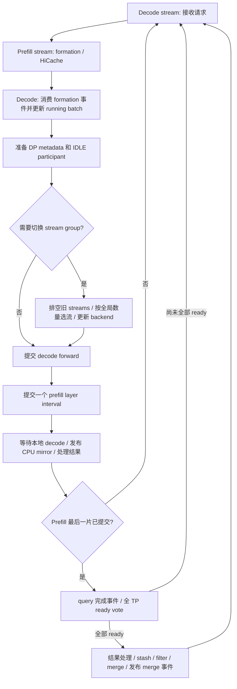

# PDMux 模型适配指南：GLM-5.3-Flash、DeepSeek-V4 / V4.1

更新：2026-10-10。本文面向新增模型适配、代码审查及 GPU 回归。
实现入口采用当前分支的 layer-split PDMux，结合 GLM 的 DP 选流和 TP 别名处理。
模型特有的状态、attention planner、通信和 speculative 路径仍需逐项适配。

本文中的“代码已实现”“CPU 测试通过”“GPU 实测通过”是不同的结论。
用户报告 GLM-5.3-Flash 压测不 hang；V4.1 的 `439624b4b4` 已在原配置上再次失败，
234 请求 / 6 分 14 秒后冻结。本次 ordering / CPU metadata 候选尚未完成 GPU 验收。

## 1. 先选对参考实现

| 参考 | 可以复用的部分 | 必须单独处理的部分 |
| --- | --- | --- |
| `feat/pdmux-standard@17761860cc` | 双 lane 提交骨架、prefill 完成投票、HiCache 依赖、全局 token budget | 默认 layer_split 仍使用本地选流和 TP-only scope；成功运行某个模型不代表所有 DP/EP 配置安全 |
| `feat/glm53-flash-pdmux@a4c3f271fb` | 先 gather 后按全局 decode 数量选流；prefill TP 的别名跟随；跨片状态与单层 MTP | KDA/Mamba 缓存槽、chunk stash、MTP scratch 交接属于 GLM 路径 |
| 当前 `feat/dsv41-pdmux` | 上述 GLM 两项 DP 处理；CPU request geometry；FP4 表预上传；异步 seq_lens 发布 | mHC 状态、Engram、compressor/indexer、DSpark 注入与 planner token 上限 |

固定源码参考：[standard 调度](https://github.com/Li-brua/sglang/blob/17761860ccbc6cea53b0c3625fa0c89880b48f9e/python/sglang/srt/multiplex/multiplexing_mixin.py)、
[GLM 调度](https://github.com/Li-brua/sglang/blob/a4c3f271fbea88f9456e5c3c75954428dcab4427/python/sglang/srt/multiplex/multiplexing_mixin.py)、
[GLM TP 别名处理](https://github.com/Li-brua/sglang/blob/a4c3f271fbea88f9456e5c3c75954428dcab4427/python/sglang/srt/distributed/parallel_state.py#L2202)。
当前分支入口见 [multiplexing_mixin.py](../../../python/sglang/srt/multiplex/multiplexing_mixin.py)。

`pdmux-standard` 是分支名。该分支还提供 whole-EXTEND 的 `standard` prefill mode，
但默认是 `layer_split`；现场给出的 DSV4-Flash 成功命令没有覆盖该默认值。
比较时必须同时记录分支、prefill mode、checkpoint、GPU、DP/EP、MoE backend 和 YAML。

## 2. 双 lane 的调度契约

Prefill 与 decode 使用不同 CUDA stream。Python 按顺序提交两个 forward，
GPU 才有机会重叠执行；`run_batch()` 返回不代表该 lane 的 GPU 工作完成。

当前每个 tick 的流程如下：



保留以下约束：

1. 每 tick 只准备一次 decode DP metadata，并在选 stream 前准备。
2. 本地空 batch 的 rank，仍可能需要执行 peer-only 工作的 IDLE forward。
3. 所有参与同一模型 collective 的 rank 必须执行相同 layer interval。
4. Decode 的结果读取放在它的完成 fence 后；prefill 结果在完成事件和 ready vote 后消费。
5. 切 stream group 时排空旧 stream，随后更新 decode backend；在途状态不能跨错 group。
6. Formation、HiCache device work 和 merge 的事件只在相应共享资源操作发生时发布。
7. 当前不采用每 phase 的 GPU drain，也不采用每 tick 五次 submission barrier。

不要在每个中间 slice 后记录一个让 decode 等待的 prefill 事件：它会落在在途 prefill
工作之后，将本应重叠的 decode 排到整个 prefill 后面。事件应保护具体的 allocator、
mapping、planner 或 scratch 消费者，而不是用作笼统的“安全同步”。

## 3. DP / EP：空 rank、选流和通信子

### 3.1 用 scheduler 的全局向量选流

用 `maybe_prepare_mlp_sync_batch()` 得到真实或 IDLE `decode_batch` 后，读取
`scheduler_global_num_tokens` 的最大值作为 decode 数量。没有这个向量时，沿用
GLM 的本地 fallback；这主要服务于没有跨 DP gather 的路径。

典型反例：全局向量是 `[2, 0]`，本地 batch size 分别为 2 和 0，同时存在 prefill。
按本地选流会得到 `[1, 0]`；按全局向量，两边都选择共享组 1。
本地空 rank 也不能提前进入 `on_idle()`，因为它还需要参与 decode 的 collective。

当前 PDMux 跨 DP 时必须 gather，即使设置 `SGLANG_SCHEDULER_SKIP_ALL_GATHER` 也不跳过；
这保证两个 lane 都能创建 peer-only 的 IDLE participant。DP1 保留本地路径。
PDMux 跨 DP metadata 使用 CPU/Gloo，不受 `--disable-overlap-schedule` 的 GPU gather
策略影响；这些控制数据来自 CPU，不应排到在途模型 collective 后再 D2H。
普通 scheduler 的 device/CPU 与 skip 策略保持原样。实现见
[dp_attn.py](../../../python/sglang/srt/managers/scheduler_components/dp_attn.py)。

Slice 层数同样使用全局 prefill token 向量的最大值。本地 token 数为 0 的 IDLE rank
不能直接返回，也不能独自执行所有剩余层。每片继续走原有 prepare / pad / unpad，
不要额外保留一套会在下一片失效的未 padding token counts。

### 3.2 按对象身份跟随 TP 别名

当前只创建 duplicate full-TP communicator。在 prefill scope 内，对以下句柄检查
`group is decode_tp_group`，满足条件才一起替换为 prefill TP：

`attn_tp_group`、`attn_cp_group`、`moe_ep_group`、`moe_dp_group`、`moe_tp_group`、
`shared_experts_tp_group`、`dcp_group`。

| 拓扑例子 | Prefill scope 中的处理 |
| --- | --- |
| MoE-TP 与 full-TP 是同一对象 | 跟随 prefill TP |
| TP8 / EP8 的 MoE-EP 与 full-TP 是同一对象 | 跟随 prefill TP |
| TP8 / DP2 的独立 attention TP4 | 保留原句柄 |
| 独立 EP / MoE-TP 子组 | 保留原句柄，另验其跨 lane 使用 |
| 同样的 rank 列表，但不同 communicator 对象 | 不作为 TP 别名替换 |

实现见 [parallel_state.py](../../../python/sglang/srt/distributed/parallel_state.py)。
作用域退出、异常及嵌套都必须恢复调用者原句柄。不要因为 rank 列表相等就批量替换，
也不要把“TP 别名跟随”写成“所有 attention/MoE 通信子已经隔离”。

还要审查模型和 MoE runner 是否在初始化时缓存 group：动态 scope 只能影响运行时
读取的句柄。缓存了 decode communicator 的自定义 kernel/dispatcher，需要显式适配。

### 3.3 独立通信子仍有顺序要求

NCCL 要求跨设备的 host launch 顺序一致，CUDA graph 的 capture 和 launch 也受此约束。
`NCCL_LAUNCH_ORDER_IMPLICIT` 从 NCCL 2.26 起提供按 host 顺序建立跨通信子设备依赖的
机制；runtime 和 driver 都为 CUDA 12.3+ 时允许其 kernel 重叠。
这项机制不能替代 rank 一致的提交顺序。[NCCL 官方说明](https://docs.nvidia.com/deeplearning/nccl/user-guide/docs/usage/communicators.html#using-multiple-nccl-communicators-concurrently)、
[环境变量说明](https://docs.nvidia.com/deeplearning/nccl/user-guide/docs/env.html#nccl-launch-order-implicit)。

当前分支在多卡 CUDA PDMux 创建第一个 communicator 前设置
`NCCL_LAUNCH_ORDER_IMPLICIT=1`，并检查 PyTorch / PyNCCL 都为 NCCL 2.26+，
CUDA runtime / driver 都为 12.3+。显式设置为 0 会报错；旧栈不会自动把两个 lane
改为串行。实现见 [launch_order.py](../../../python/sglang/srt/multiplex/launch_order.py)。
这项 runtime 前提与全局 host 提交顺序是两项不同契约，均需满足。

现场同一镜像的 NCCL 版本有差异：PyTorch 自报 2.29.7，PyNCCL 日志为 2.30.7，
裸 soname 的 apt 库为 2.28.3；不能根据磁盘文件或其中一条版本日志推断所有调用方
使用同一个 DSO。CPU metadata 移除了该控制路径的 Torch NCCL GPU launch；模型中
其他使用 Torch / 自定义 NCCL 的路径仍需审计，并记录实际加载库、runtime / driver。

不要直接全局关闭 `NCCL_GRAPH_MIXING_SUPPORT` 来掩盖 hang：关闭后不支持同一
通信子的并行 graphs，也不支持 outstanding graph 与 eager collective 混用。
本次保留该变量原值。[NCCL graph mixing 约束](https://docs.nvidia.com/deeplearning/nccl/user-guide/docs/env.html#nccl-graph-mixing-support)。
新增 communicator、DSO 或 host launch 线程时，重新验证其顺序契约。

## 4. 将普通 forward 改为可恢复的 layer interval

先保证模型普通 forward 与整段 split forward 输出一致，再拆成多片。
参考 [TpModelWorker](../../../python/sglang/srt/managers/tp_worker.py) 和
[DeepSeek 模型入口](../../../python/sglang/srt/models/deepseek_v4.py)。

| 阶段 | 实现要求 |
| --- | --- |
| 第一片 | 从 ScheduleBatch 创建一个持久 ForwardBatch；完成 embedding 和一次性准备 |
| 中间片 | 从 batch-owned hidden/state 恢复，只执行 `[start, end)`，保存下一片需要的全部状态 |
| 最后一片 | 完成 tail/norm/logits；采样和 speculative finalize 只执行一次 |
| 合并前 | GPU 完成后消费结果；释放持久 ForwardBatch，重置 split index/count/finished |

状态属于当前 batch，避免放在 model 全局字段里。Decode 会在两片之间进入同一模型，
全局 hidden、residual、topk 或临时 allocator 很容易被它覆盖。
逐层审查 skip connection、norm、跨层共享 index、aux capture、in-place buffer 和 tail。

GLM 保存 residual stream、hidden states、zero/GEMM allocator、topk 和 aux hidden captures。
DSV4/4.1 保存 mHC 相关状态、aux capture 和最后 logits 所需的输入；一次性 Engram、
prefix/compressor/indexer 准备不能在每片重复执行。具体状态以对应模型源码为准。

Idle 路径必须继续执行要求的 collective 和相同 interval，但可以跳过本地 attention
或 request scorer。不能因为没有 logits 或零 token，就把中间片误认为最终片。

## 5. Host 同步审查：最容易把重叠变成循环等待的地方

逐个审查 forward 及其调用的 helper，搜索 `.item()`、`.tolist()`、`.cpu()`、
`.to("cpu")`、`nonzero`、动态输出大小算子、live memory query 和首次 lazy 上传。
这些模式不一定都同步；必须结合 tensor 所在设备、输出大小及实际实现判断。
不能只搜模型最外层 Python 文件。

| 场景 | 本轮处理 / 新模型实现方式 |
| --- | --- |
| V41 scorer 用 GPU req ids 的 unique / nonzero 推断请求边界 | 用 scheduler 已有 CPU rows / seq lengths 构造连续 row ranges |
| `lens.max().item()` 决定 Python 循环或内存大小 | 从 CPU metadata 得到相同长度；保留实际 GPU visibility mask |
| GPU scalar 作为 Python index | 使用 CPU slot mirror；没有 mirror 时避免隐式 scalar extraction |
| FP4 dequant 表在每个 request 内从 CPU 上传 | 初始化时上传一次，后续复用 device 表 |
| Speculative `new_seq_lens.to("cpu")` | pinned + nonblocking D2H，结果在 lane 完成后才发布 |
| Engram extend 动态 repeat_interleave 输出大小 | 提供已知 CPU `output_size`，保持原有 token layout |
| Logits 的 live CUDA memory query | 使用不做同步查询的 PDMux 路径并验证其内存预算 |

V41 参考：[scoring.py](../../../python/sglang/srt/layers/attention/dsv4/v41_indexer/scoring.py)、
[PrefillInputs](../../../python/sglang/srt/layers/attention/dsv4/v41_indexer/types.py)、
[FP4 pool](../../../python/sglang/srt/mem_cache/deepseek_v4_memory_pool.py)、
[Engram](../../../python/sglang/srt/layers/engram.py)。

CPU request geometry 必须覆盖 prefix、ratio 压缩、零行请求、DP padding、token chunk，
并与真实 device 请求顺序一致。不能按固定 prompt 长度推算所有请求；也不能把 padding
行当成真实请求。当前 V41 Torch scorer 与 DeepGEMM 路径都依赖 CPU 长度契约。

异步 D2H 的提交与消费是两个操作：

```python
# 提交阶段：保持旧的 ready CPU mirror，暂存新 mirror。
result.new_seq_lens_cpu = async_d2h(new_seq_lens)

# retirement：所属 stream fence 已完成后，才更新 scheduler 可读状态。
batch.seq_lens_cpu = result.new_seq_lens_cpu
batch.seq_lens_sum = int(batch.seq_lens_cpu.sum())
result.new_seq_lens_cpu = None
```

现成 helper 是 `async_d2h`，负责 pinned buffer / nonblocking copy 和源 tensor 的
stream 生命周期。仅设置 `non_blocking=True` 后立刻 `.tolist()` 或 `.sum()`，
仍会提前读取尚未完成的 CPU 数据。若使用独立 copy stream，还需明确 producer event、
copy_done 事件和对象保活；compute stream fence 本身不代表独立 copy stream 已完成。

GLM 仍保留某些阻塞 seq_lens D2H，用户报告其配置不 hang。该运行结果不能推出
这些拷贝在另一个模型、不同 communicator 或更多 slice 下同样安全。
消除两处已定位同步点，也不能推出 forward 内所有 host wait 都已清除。

## 6. Attention backend、CUDA graph 和 helper streams

Prefill 与 decode 分开维护 metadata/backend。中间 slice 之后的 decode/verify 不能
覆盖 prefill 仍需使用的 planner、index share 或 compressor workspace。
有共享 scratch 时，为具体的 producer/consumer 加事件，或使用独立 workspace。

PDMux decode graph 按 stream group 捕获并 replay，另有 batch/token/attention variant
维度。IDLE participant 的 replay 选择也必须一致。实际入口见
[decode_cuda_graph_runner.py](../../../python/sglang/srt/model_executor/runner/decode_cuda_graph_runner.py)。
切换 target backend 时，也要检查 speculative worker 内的 eager verify 和 draft backend
选择；不要仅更新 scheduler 直接持有的 model runner。

Green Context lane 上，普通 helper stream 可能逃出 SM 分区。GLM 的 target/NextN
helper 仅在实际 full-device decode stream 上启用；判断实际 CUDA stream，不能仅用
全局 `CURRENT_STREAM_IDX`，因为 capture 遍历 stream group 时未必更新它。
参考 [pdmux_context.py](../../../python/sglang/srt/multiplex/pdmux_context.py)。

`overlap_decode_full_sm: true` 表示 prefill 仍受 Green Context SM cap，decode 使用
full-device stream，二者 SM 范围有重叠；YAML 的 decode_sm 列此时忽略。
Exclusive 模式下 prefill_sm + decode_sm 必须符合实际 SM 总数和设备分区约束。

### Engram / speculative token tier 的启动陷阱

现场自适应 tier 曾在 CUDA graph capture 中失败：`bs=32`、`gamma+1=6`，
Engram 等长布局需要 192 token，capture 实际只有 180 token。
这个断言发生在 profiling 前，不能靠关闭 profiling 解释或修复。

新增 tier 时，应共同定义 batch slots、真实 token 数、request 边界、ghost/padding、
position、history 更新、attention metadata 和 graph key。若 kernel 只支持等长 block，
就必须捕获满足该契约的 shape；支持 ragged 需要 kernel、边界刷新/replay 和所有
消费者一起适配。只删除断言或随意补 token，可能产生 silent wrong output。

当前分支的两项自适应 verify / ragged Engram 提交已经撤回，不包含那批新增启动参数。
保留的 Engram 修复仅是普通 extend 的已知 output_size。

## 7. Speculative worker：最终片与输入所有权

Speculative worker 必须有显式 split-prefill 入口；直接调用普通 generation 会把
每片当成完整 prefill，重复 draft extend、采样、KV 注入和 observer 统计。

| 路径 | 关键处理 |
| --- | --- |
| GLM 单层 NextN / MTP / EAGLE | target 跨片保留 FULL hidden capture；最终片创建独立 draft batch view，再执行 draft extend |
| GLM 最终 draft handoff | prefill stream 等待已提交的 decode stream 工作，保护共享 planner/index-share scratch；中间 target slices 保留 overlap |
| V4.1 DSpark | 中间片只运行 target；最终片处理 aux hidden、KV 注入和 next draft 状态；IDLE 保留自己的参与契约 |
| Decode / target verify | 使用选中的 decode backend，结果中的 device seq lengths 与 CPU mirror 分阶段发布 |

参考 [GLM EAGLE](https://github.com/Li-brua/sglang/blob/a4c3f271fbea88f9456e5c3c75954428dcab4427/python/sglang/srt/speculative/eagle_worker_v2.py#L1455)、
[V4.1 DSpark](../../../python/sglang/srt/speculative/dspark_components/dspark_worker_v2.py)。

最终 draft 不能直接旋转或重写持久 target batch 的 input_ids、spec_info、positions
和 split progress。Scheduler 会在两片之间丢弃 ScheduleBatch.input_ids，但持久
ForwardBatch 仍拥有完整且可能 padding 后的输入；构造 draft view 时只使用真实部分。

Draft graph 能否复用必须单独判断。GLM PDMux 的 draft 路径采用 eager，target
decode/verify 保留 per-stream graph。DSpark 的图和 planner 按自己的实现处理，
不能从“GLM 关 draft graph”推导所有 speculative 模型都应照做。

## 8. HiCache、Mamba 与 chunk 的生命周期

Normal scheduler 的 get_next_batch_to_run 会处理上一 prefill；PDMux 在自己持有的
split_prefill_batch 上完成这件事。新增模型必须明确一个唯一的结果处理所有者。

完成 prefill 后依次处理 result、stash 中间 token chunk、filter finished/excluded
requests，再 merge 到 running batch。即使没有 chunk，也必须 filter：刚完成的
request 可能已经释放 KV / req slot，不能继续作为 decode owner 留在 batch 中。

每片进入 worker 前重新安装 HiCache consumer index：decode 会重置它。
Formation 时 drain HiCache，跳过 formation 的在途/等待 tick 每 16 次 pump；
host-only ack 无需增加让 decode 等整段 prefill 的事件，device frees/mapping writes
则需要发布相应依赖。Pump 里含 collective，各 rank 的调用次数必须一致。

GLM 还有 Mamba state 所有权：write-through backup 的 ack 可能让 state 暂时不能淘汰。
Stash 下一 chunk 需要额外槽时，先按 attention-TP 的范围检查可用容量，尝试 ack drain
和 eviction，仍不足则保留 pending stash，在安全边界重试。不要阻塞等待整个服务
释放资源，也不要跨到不属于这个请求的全 TP 范围做 stash 共识。

Abort 中间 chunk 时，等全部在途 slice 完成后再清理；pending stash 的请求被 abort
后应释放其保留状态。新模型的 paged cache、SWA、recurrent state 或 index pool
都需要类似的 owner / free / reserve / backup / retry 表。

## 9. 步长、token chunk 与 planner 上限

有全局 decode 工作时：

```text
layers_per_slice = max(1, split_forward_token_budget // max(prefill_global_counts))
若 max_split_forward_layers > 0，再取这个层数上限
最后不超过 remaining_layers
```

没有全局 decode 工作时，一次执行所有剩余层。该规则在 GLM 与当前 V4.1 相同。
`max_split_forward_layers` 默认 0，保持 token-budget-only；它不是动态 gamma 或 SLO 控制器。

例如 40 层、1024-token chunk、budget 65536：无额外 cap 时只需一片；cap=2 时需要
20 片。Cap=2 会增加 host 调度和 state/planner 开销，也放大不对称 rank 的暴露窗口。
性能默认可用 cap=0，但已有 hang 的回归必须保留原 cap=2；改变它会改变复现条件。

DSV compressor plan 使用 uint16 ragged token ids，有 65535-token 硬上限；page size 16
时对齐为 65520。Layer slicing 不减少一次 attention plan 的 token 数。
有 token chunk 时检查整个 forward 的 aggregate extend tokens；不 chunk 时应在
request validation / admission 限制 oversized batch，避免请求永久停在等待队列。

## 10. 新模型的落地顺序与验收

按以下顺序实现，每步只引入所需的模型差异：

| 步骤 | 需要产出的实现或证据 |
| --- | --- |
| 1. 模型清点 | 架构/层数/ratio、cache state、TP/DP/EP topology、group aliases、backend、所有额外 stream、speculative hidden contract |
| 2. 普通 forward parity | TP1 下全段 split 等价普通 forward，多种 interval 的分片结果也等价 |
| 3. Batch 状态所有权 | embedding/一次性准备只做一次，中间状态不被 decode 覆盖，最终 logits/释放只做一次 |
| 4. Plain TP overlap | 两种 SM layout，eager 与 decode graph，helper-stream/workspace 正确 |
| 5. DP / EP | active/IDLE 同 interval、全局选流、TP 别名跟随、独立子组另验 |
| 6. Cache 生命周期 | HiCache ack、load-back、eviction、chunk continuation、finished/abort、资源耗尽后继续推进 |
| 7. Speculative | 最终片一次 finalize、target/draft 输入隔离、hidden/KV/history parity、decode backend 和 graph contract |
| 8. GPU 验收 | 原配置长时间继续完成请求，输出一致，并以 timeline 确认真实 overlap 和性能 |

最低回归矩阵：

| 维度 | 至少覆盖 |
| --- | --- |
| 工作分布 | 所有 rank 空；只有部分 rank prefill；只有部分 rank decode；两者在不同 rank；交换 busy rank |
| 拓扑 | TP1、plain TP8、TP8/DP8、TP8/DP2；EP1、EP8；独立 EP/CP/DCP 配置单列 |
| Token / slice | 短/长 prompt、冷/热 prefix、多个 token chunk、budget-only、cap2、无 decode 完成剩余层 |
| 执行 | eager、graph capture/replay、graph fallback、verify/idle、两种 SM layout |
| Cache | write-through、load-back、SWA/Mamba 压力、chunk abort、finish 后立即再入场；write-back/storage 另测 |
| 输出 | greedy 与普通 scheduler 对照；跨片 hidden/logits、index visibility、spec acceptance、资源 owner |

本地关键检查入口：

```bash
PYTHONPATH=python python3 -m pytest -q \
  test/registered/unit/managers/test_pdmux_scheduler.py \
  test/registered/unit/multiplex/test_pdmux_hicache_events.py \
  test/registered/unit/distributed/test_pdmux_parallel_state.py \
  test/registered/unit/layers/test_dsv41_prefill_submission.py \
  test/registered/unit/models/test_deepseek_v4_split_prefill.py \
  test/registered/unit/spec/test_dspark_pdmux.py
```

CPU tests 验证状态、路由、数值 oracle 和模拟提交顺序；native CUDA 测试在 CPU-only
环境会跳过。至少还要在 GPU 上完成 capture/replay、整模型输出和多 rank 压测。
完整 V4.1 验收见 [layerwise_prefill_runbook.md](layerwise_prefill_runbook.md)。

## 11. 已踩过的坑与 hang 取证

| 已观察到的现象 | 可以得出的结论 | 处理或下一步 |
| --- | --- | --- |
| 隔离 TP/attention/MoE 候选 34f75d6e6b，44 请求 / 129 秒后冻结 | 通信子隔离本身未通过 GPU liveness | 审查 host wait、rank 提交顺序与真实 collective trace |
| GLM 对齐候选 439624b4b4，234 请求 / 374 秒后冻结；7 rank D sync，DP5 P linear | GLM 两项移植与已定位 host-sync 避免仍不足；Python 栈没有证明 DP5 漏交 D | 补 NCCL ordering 前提 / CPU metadata，并追踪实际提交和 native wait |
| 一组 rank 卡 decode synchronize，另一组卡 V41 unique 或 seq_lens D2H | 存在不同 lane 的 host 等待；栈本身未列出完整 collective 等待边 | 合并 py-spy、native 栈、stream/communicator/layer timeline |
| 四 phase GPU drain 能约束顺序 | 它会让 attention-DP lanes 串行，不满足 overlap 目标 | 已移除；不能用这类通过代替并行验收 |
| 五次 Gloo submission rendezvous 的 CPU 测试通过 | 只证明该候选协议的模拟提交 invariant | 必要性/代价未得到 GPU 证明，已移除 |
| 本地选流 `[1, 0]` | 同一全局 decode batch 的 rank 决策不一致 | 移植 GLM 的 gather-before-select 与全局数量 |
| Prefill TP 已换，MoE-EP 仍是 decode TP 别名 | Scope 不完整 | 按对象身份切换 TP aliases，验证实际 runner 路由 |
| Cap=0 已报告连续运行 30 分钟 | 是减少切片后的对照结果 | Cap2 原始配置仍需至少 30 分钟验收 |
| DSV4-Flash / GLM 已报告跑通 | 对应模型与配置是有效对照 | 保留完整命令，不能扩展为 V4.1 / 任意 EP/backend 的验收 |
| Engram 180 / 192 token capture 断言 | Token tier 与 request-block 布局契约不一致 | Capture shape、边界、kernel 与 replay 一起适配 |

V4.1 原始回归保持 SM90 TP8/DP8/EP8、DSpark、HiCache、原 MoE/backend/SM/graph
设置、1024-token chunk、cap2、冷 longcodebench、并发 10，观察至少 30 分钟。
记录 completed requests、worker health、TTFT/ITL、吞吐、显存和 output parity。
GPU timeline 应同时看到两 lane 计算，健康但完全串行的运行不满足 overlap 验收。

Hang 时为每个 rank 保存：tick、lane、stream_idx/handle、communicator identity、
layer interval、真实/IDLE batch、scheduler global counts、graph key 和最后一次
提交/retire 的位置。同步采集 Python/native 栈和 GPU timeline；CPU 自旋、GPU 100%
与 NCCL 等待相容，但单独这些利用率读数不足以排除长 kernel 或别的错误。

修复说明最后明确写出：改变了哪些不变量、在哪些拓扑验证、哪类测试实际执行了 GPU，
以及原配置回归是否通过。下一模型适配应复用通过验收的契约，并为自己的新状态或
新通信路径补充测试，而不是复制某个模型的全部同步操作。

### 11.1 区分“host 未提交”与“已提交但 GPU 不推进”

普通路径已在 prefill `run_batch` 之前返回 decode `run_batch`。因此 DP5 在
prefill `linear` 的 Python 栈，不能单独证明它没有提交本轮 decode；默认 DP gather
也已为两个 lane 创建 IDLE participant。重复增加一套无条件 IDLE forward 会改变
collective 序列。`linear` 的 native 栈仍可能暴露 allocator、cuBLAS 或 CUDA API 等待。

在原启动命令前加 `SGLANG_PDMUX_TRACE=1`。每个 rank 的日志会记录 tick、phase、
stream index/handle、TP coordinator、mode、本地 batch size、原始全局数量和 layer
interval，以及 D/P submit begin/end、decode wait begin/end、graph replay begin/returned。
只读取 CPU metadata，不添加 GPU query、barrier 或 tensor scalar copy。
`worker_result_graph` 是 worker 返回标志；实际 replay 以 `PDMux graph` 行为准，
不能用 IDLE result 的 False 推断没有 replay。Trace 有日志开销，性能对照应关闭。

若所有 rank 都有本 tick 的 `decode_submit_end`，漏交该 decode forward 的解释就
不成立；若某 rank 缺 `prefill_submit_end`，取它的 gdb native 栈，并结合最后提交的
collective / graph 和 stream timeline 判断阻塞点。Host end 仍不代表 GPU 已完成。
如果 sequence/shape 一致但 GPU 不推进，重点核对设备 ordering、库实例和资源等待。

可先运行 [graph/eager 多卡探针](graph_eager_overlap_probe.py)：

```bash
PYTHONPATH=python timeout 900s torchrun --standalone --nproc-per-node=8 \
  test/manual/pdmux/graph_eager_overlap_probe.py \
  --pdmux-config /tmp/pdmux_overlap_p104.yaml --chunks 100 --trace
```

随后增加 `--dynamic-alloc`，覆盖不对称 rank 的动态 `linear` 分配；
`--use-existing-ordering` 仅供显式 env 前后 A/B，允许复现旧的 unsafe ordering，
必须保留外部 timeout。探针使用两个真实 PyNCCL 通信子、decode graph、eager prefill、
40 层 / cap2、旋转 busy rank 和 host 延迟。它在每 tick 只等待 decode，最终按 CPU
ready vote 退休 prefill，再检查数值；通过不代表整个模型或 HiCache 已验收。
原 cap2 / c10 至少 30 分钟通过后，再测 c24；当前 c10 失败，c24 尚未执行。
