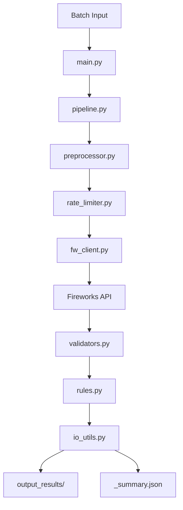

# KYC 项目 System Design 面试训练指南

**作者**：Yanda Cheng  
**项目链接**：https://github.com/Nickcp39/kyc_pov/tree/main  
**开始日期**：2025-01  

---

## 🎯 为什么用 KYC 项目来训练 System Design？

### 你的 KYC 项目已经具备了 Senior 级别的设计思维

1. **Schema-First 设计** → 可维护性、可扩展性
2. **确定性规则引擎** → 可审计性、可测试性
3. **Per-File Isolation** → 故障隔离、高可用性
4. **标准化错误处理** → 可观测性、快速定位
5. **Rate Limiting + Retry** → 保护策略、容错性
6. **Privacy-Aware Logging** → 合规性、安全性

### 这正好对应 System Design 面试的核心考察点

| KYC 项目设计 | System Design 面试要点 | 对应天数 |
|-------------|----------------------|---------|
| Schema-First + Validators | 可回归、可测试（Golden Set + 门禁） | Day 3 |
| Deterministic Rules | 可审计性（Metrics + Trace） | Day 1, Day 2 |
| Per-File Isolation | 故障隔离（保护策略） | Day 5 |
| Error Taxonomy | 可观测性（Metrics/Logs/Traces） | Day 2 |
| Rate Limiter + Retry | 保护策略（限流/熔断/重试） | Day 5 |
| Privacy-Aware Logging | 合规性（Runbook + Postmortem） | Day 6 |

---

## 📚 学习流程（7天强化计划）

### 总体流程

```
Day 1: 指标体系 (L0/L1/L2)
    ↓
Day 2: 可观测性 (Metrics/Logs/Traces)
    ↓
Day 3: 回归门禁 (Golden Set + Eval)
    ↓
Day 4: 发布策略 (Feature Flag + Canary + Rollback)
    ↓
Day 5: 保护策略 (限流/熔断/重试/降级/幂等)
    ↓
Day 6: 事故响应 (Runbook + Postmortem)
    ↓
Day 7: 面试固化 (30秒/2分钟/5分钟话术)
```

---

## 🚀 第 1 步：理解你的 KYC 项目（前置准备，1-2小时）

### 必读材料

1. **KYC 项目 README**
   - 项目地址：https://github.com/Nickcp39/kyc_pov/tree/main
   - 重点：理解整体架构和数据流

2. **DESIGN.md**
   - 理解你的设计决策（Schema-First、确定性规则、错误分类等）
   - 找出你在设计时的 trade-off 考虑

3. **关键代码文件**
   - `src/schemas.py` → 理解 Schema-First 设计
   - `src/rules.py` → 理解确定性规则引擎
   - `src/pipeline.py` → 理解 E2E 流程和 per-file isolation
   - `src/rate_limiter.py` → 理解保护策略
   - `src/errors.py` → 理解错误分类

### 绘制你的系统架构图（Mermaid 或手绘）



### 找出你的设计亮点（准备面试时的关键点）

✅ **已具备的设计亮点**：
- [x] Schema-First 设计（`schemas.py`）
- [x] 确定性规则引擎（`rules.py`）
- [x] Per-File Isolation（`pipeline.py`）
- [x] 标准化错误处理（`errors.py`）
- [x] Rate Limiting + Retry（`rate_limiter.py`）
- [x] Privacy-Aware Logging（trace_id only）

⚠️ **需要补充的设计亮点**（这正是 7 天训练要补的）：
- [ ] 三层指标体系（L0/L1/L2）
- [ ] 可观测性方案（Metrics/Logs/Traces Dashboard）
- [ ] 回归门禁（Golden Set + 通过阈值）
- [ ] 发布策略（Feature Flag + Canary + Rollback）
- [ ] 完整的保护策略矩阵（限流/熔断/重试/降级/幂等）
- [ ] Runbook + Postmortem 模板

---

## 📅 第 2 步：7 天训练流程（按天执行）

### Day 1｜指标体系：把"成功"定义成可打分的三层指标（L0/L1/L2）

**学习目标**：
- 用 KYC 项目填充三层指标（L0 稳定性、L1 业务收益、L2 长期健康）
- 理解如何用指标度量系统价值

**学习步骤**：

1. **阅读模板文档**
   - 打开：`../Day01_METRICS_CARD.md`
   - 理解三层指标的含义

2. **用 KYC 项目填充指标**
   - 参考：`KYC_DAY01_METRICS_CARD_EXAMPLE.md`（已提供示例）
   - 基于你的实际项目数据填充：
     - L0：成功率、延迟（p95/p99）、错误率
     - L1：每单节省人审时间、成本节省、自动化率
     - L2：变更失败率、Auditability 覆盖率、PII 泄漏事件

3. **理解 Error Budget Policy**
   - 如何用错误预算平衡"发布速度 vs 稳定性"
   - 设定 KYC 项目的 SLO 和错误预算

**输出**：
- ✅ 完成 `KYC_DAY01_METRICS_CARD.md`（你自己的版本）
- ✅ 能够说出："我们系统用三层指标度量成功：L0稳定性99%、L1每单节省5分钟、L2变更失败率<5%"

**时间**：2-3 小时

---

### Day 2｜可观测性：把"我有监控"升级成"我能定位根因"

**学习目标**：
- 设计 KYC 项目的可观测性方案（Metrics/Logs/Traces）
- 理解如何用三类信号快速定位问题

**学习步骤**：

1. **阅读模板文档**
   - 打开：`../Day02_OBSERVABILITY.md`
   - 理解三类信号（Metrics/Logs/Traces）

2. **设计 KYC 项目的可观测性方案**
   - **Metrics**：
     - RPS（batch processing rate）
     - p95/p99 Latency（单文档处理时间）
     - Error Rate（基于 `errors.py` 的错误分类）
     - Schema Validation Fail Rate
     - Rate Limit Trigger Rate
   
   - **Logs**：
     - 结构化日志（trace_id、fw_request_id、model、tokens、latency、error_code）
     - **不记录**：base64 image、prompt content、extracted PII（Privacy-Aware）
   
   - **Traces**：
     - 一个文档的完整处理链路：
       - Span 1: Preprocess（image loading/normalize）
       - Span 2: Rate Limit Acquire
       - Span 3: Fireworks API Call
       - Span 4: Schema Validation
       - Span 5: Deterministic Rules
       - Span 6: Save Result

3. **设计 Dashboard 草图**
   - On-Call Dashboard（实时监控）
   - Business Health Dashboard（业务指标）
   - Tracing Dashboard（链路追踪）

**输出**：
- ✅ 完成 `KYC_DAY02_OBSERVABILITY.md`
- ✅ 能够说出："我们用 Metrics/Logs/Traces 三类信号，通过 trace_id 关联，快速定位根因"

**时间**：2-3 小时

---

### Day 3｜回归与门禁：把 AI 系统变成"可回测工程"

**学习目标**：
- 建立 KYC 项目的回归测试集（Golden Set）
- 设计发布门禁（通过阈值才能发布）

**学习步骤**：

1. **阅读模板文档**
   - 打开：`../Day03_REGRESSION.md`
   - 打开：`../Day03_EVAL_REPORT_TEMPLATE.md`

2. **设计 KYC 项目的 Golden Set**
   - **场景分类**：
     - 正常场景（20%）：清晰、标准格式的 ID
     - 边界场景（30%）：模糊、遮挡、低质量
     - 异常场景（30%）：版式变化、多页、复杂布局
     - 长尾场景（20%）：罕见格式、特殊字符
   
   - **Golden Set 规模**：50-200 条测试用例

3. **设计发布门禁**
   - **门禁指标**：
     - Schema Pass Rate > 95%
     - 字段级准确率 > 90%（critical fields: full_name, date_of_birth, document_number, expiry_date, issuing_country）
     - Fallback Rate < 5%
     - 成本上限：$0.002 / request（tokens < threshold）

4. **与现有测试结合**
   - 你的 `tests/test_rules.py` → 确定性规则回归
   - 你的 `tests/test_validators.py` → Schema 验证回归
   - 补充 E2E 集成测试（真实 API 调用）

**输出**：
- ✅ 完成 `KYC_DAY03_REGRESSION.md`
- ✅ 完成 `KYC_DAY03_EVAL_REPORT_TEMPLATE.md`
- ✅ 能够说出："每次发布前跑 Golden Set，通过门禁才能发布，确保改动不会把系统搞坏"

**时间**：3-4 小时

---

### Day 4｜发布策略：Feature Flag + Canary，把"上线"变成可控实验

**学习目标**：
- 设计 KYC 项目的灰度发布策略
- 定义回滚条件和流程

**学习步骤**：

1. **阅读模板文档**
   - 打开：`../Day04_ROLLOUT_AND_ROLLBACK.md`

2. **设计 KYC 项目的发布策略**（PoV → Production 规划）
   - **Feature Flags**：
     - `model_version`：切换模型（Qwen2.5-VL-32B vs 其他）
     - `prompt_version`：切换 prompt
     - `validator_strictness`：调整验证严格程度（high/medium/low）
   
   - **Canary 发布**：
     - 1% → 5% → 25% → 100%
     - 每步观察：p95、Error Rate、Schema Fail Rate、Cost
   
   - **回滚条件**：
     - Schema Fail Rate × 2 立即回滚
     - p95 + 20% 立即回滚
     - Error Rate > 5% 立即回滚

3. **结合你的设计**
   - 你的 Schema-First 设计 → 版本化发布（`schema_version = "v1"`）
   - 你的确定性规则 → 可以按规则版本发布

**输出**：
- ✅ 完成 `KYC_DAY04_ROLLOUT_AND_ROLLBACK.md`
- ✅ 能够说出："我们用 Feature Flag + Canary 发布，1%→5%→25%→100%，每步观察指标，异常立即回滚"

**时间**：2-3 小时

---

### Day 5｜保护策略：Engineering for Failure（免疫系统）

**学习目标**：
- 完善 KYC 项目的保护策略矩阵
- 理解限流/熔断/重试/降级/幂等的触发→动作→验证

**学习步骤**：

1. **阅读模板文档**
   - 打开：`../Day05_PROTECTION_MATRIX.md`

2. **完善你的保护策略**（基于现有设计）
   - **限流**（已有：`rate_limiter.py`）：
     - 触发：RPS > RPM_LIMIT 或并发 > threshold
     - 动作：返回 429，等待 token
     - 验证：p95 < 15s，429 rate < 5%
   
   - **重试**（已有：`backoff_retry`）：
     - 触发：可恢复错误（API_TIMEOUT, API_CONNECTION_ERROR, API_SERVER_ERROR）
     - 动作：指数退避重试（MAX_RETRIES = 3）
     - 验证：成功率提升
   
   - **熔断**（需要补充）：
     - 触发：Fireworks API 失败率 > 5%
     - 动作：快速失败，返回默认响应
     - 验证：延迟降低
   
   - **降级**（需要补充）：
     - 触发：主模型不可用 或 延迟 > threshold
     - 动作：OCR-only fallback 或 转人工审核
     - 验证：降级后成功率 > 80%
   
   - **幂等**（需要补充）：
     - 触发：重复 request_id（通过 `trace_id` 去重）
     - 动作：返回缓存结果
     - 验证：重复处理率 < 0.1%

**输出**：
- ✅ 完成 `KYC_DAY05_PROTECTION_MATRIX.md`
- ✅ 能够说出："我们设计了限流/熔断/重试/降级/幂等五层保护策略，确保失败可控、可恢复"

**时间**：3-4 小时

---

### Day 6｜事故响应：Runbook + Postmortem，把"出事"变成组织学习

**学习目标**：
- 编写 KYC 项目的 Runbook（运维手册）
- 设计 Postmortem 模板

**学习步骤**：

1. **阅读模板文档**
   - 打开：`../Day06_RUNBOOK.md`
   - 打开：`../Day06_POSTMORTEM.md`

2. **编写 KYC 项目的 Runbook**
   - **告警触发** → 查看 `_summary.json` 或 Dashboard
   - **判断严重性**：
     - Critical：Error Rate > 5% → 立即回滚
     - Warning：Schema Fail Rate > 2% → 触发降级
     - Info：Latency 升高 → 定位根因（Trace → Log）
   
   - **定位根因**：
     - 使用 `trace_id` 关联 Logs 和 Traces
     - 查看哪个 Span 慢（Preprocess / API Call / Validation / Rules）

3. **设计 Postmortem 模板**
   - 基于你的错误分类（`errors.py`）
   - 记录时间线、根因、行动项
   - 重点关注：Schema 变更、规则变更、模型切换

**输出**：
- ✅ 完成 `KYC_DAY06_RUNBOOK.md`
- ✅ 完成 `KYC_DAY06_POSTMORTEM.md`
- ✅ 能够说出："我们有完整的 Runbook，告警触发→查看 Dashboard→定位根因→快速止血，还有 Postmortem 模板把事故变成组织学习"

**时间**：3-4 小时

---

### Day 7｜面试固化：把系统讲成"低风险进化"的评审节奏

**学习目标**：
- 把前 6 天的内容串成 30 秒 / 2 分钟 / 5 分钟三套话术
- 练习在压力下的表达

**学习步骤**：

1. **阅读模板文档**
   - 打开：`../Day07_INTERVIEW_SCRIPT.md`

2. **用 KYC 项目填充面试脚本**
   - **30 秒版本**（Elevator Pitch）：
     - 系统介绍：KYC 文档智能提取系统
     - 核心指标：L0稳定性99%、L1每单节省5分钟、L2变更失败率<5%
     - 低风险进化：Feature Flag + Canary + 回归门禁
   
   - **2 分钟版本**（Overview）：
     - 系统介绍（30秒）
     - 指标体系（30秒）
     - 低风险进化（60秒）
   
   - **5 分钟版本**（Complete Story）：
     - Goal + 三层指标（1分钟）
     - 关键 trade-off（1分钟）
     - Failure modes + 兜底（1.5分钟）
     - Flag + canary + rollback + 回归门禁（1.5分钟）
     - 长期演进（1分钟）

3. **关键要点**（必须能说出）：
   - ✅ "我们用三层指标度量成功：L0稳定性、L1业务收益、L2长期健康"
   - ✅ "我们用 Schema-First + 确定性规则引擎，确保可审计性和可测试性"
   - ✅ "我们设计了限流/熔断/重试/降级/幂等五层保护策略"
   - ✅ "我们用 Feature Flag + Canary 发布，1%→5%→25%→100%，异常立即回滚"
   - ✅ "我们通过回归门禁（Golden Set + 通过阈值）确保改动不会把系统搞坏"

4. **练习**
   - **30 秒版本**：每天练习 3 次（持续 3 天）
   - **2 分钟版本**：每天练习 2 次（持续 3 天）
   - **5 分钟版本**：每天练习 1 次（持续 3 天）
   - **模拟面试**：找朋友/同事练习，让他们提问、打断

**输出**：
- ✅ 完成 `KYC_DAY07_INTERVIEW_SCRIPT.md`
- ✅ 能够流畅说出 5 分钟版本，覆盖所有关键点
- ✅ 能够应对常见问题（"能详细说说 XXX 吗？"、"如果 XXX 怎么办？"）

**时间**：2-3 小时（+ 持续练习）

---

## 🎯 学习优先级（如果时间有限）

### 如果只有 3 天

**Day 1**：指标体系（Day 1）→ 这是基础，必须掌握  
**Day 2**：可观测性（Day 2）→ 快速定位根因的能力  
**Day 3**：面试固化（Day 7）→ 把内容串成话术

### 如果只有 5 天

**Day 1**：指标体系（Day 1）  
**Day 2**：可观测性（Day 2）  
**Day 3**：保护策略（Day 5）→ 这是 Senior 的核心能力  
**Day 4**：发布策略（Day 4）→ 低风险进化的关键  
**Day 5**：面试固化（Day 7）

### 如果有 7 天（完整版）

按照原定计划，每天完成一个模块。

---

## 📝 学习检查清单

### 第 1 步：理解项目（1-2小时）
- [ ] 阅读 KYC 项目 README 和 DESIGN.md
- [ ] 理解关键代码文件（schemas.py, rules.py, pipeline.py）
- [ ] 绘制系统架构图
- [ ] 列出设计亮点（已具备 vs 需要补充）

### 第 2 步：7 天训练（每天 2-4 小时）

#### Day 1｜指标体系
- [ ] 阅读 Day01 模板
- [ ] 用 KYC 项目填充三层指标
- [ ] 理解 Error Budget Policy
- [ ] **输出**：`KYC_DAY01_METRICS_CARD.md`

#### Day 2｜可观测性
- [ ] 阅读 Day02 模板
- [ ] 设计 Metrics/Logs/Traces 方案
- [ ] 设计 Dashboard 草图
- [ ] **输出**：`KYC_DAY02_OBSERVABILITY.md`

#### Day 3｜回归门禁
- [ ] 阅读 Day03 模板
- [ ] 设计 Golden Set（50-200 条）
- [ ] 设计发布门禁（通过阈值）
- [ ] **输出**：`KYC_DAY03_REGRESSION.md` + `KYC_DAY03_EVAL_REPORT_TEMPLATE.md`

#### Day 4｜发布策略
- [ ] 阅读 Day04 模板
- [ ] 设计 Feature Flag + Canary 发布策略
- [ ] 定义回滚条件
- [ ] **输出**：`KYC_DAY04_ROLLOUT_AND_ROLLBACK.md`

#### Day 5｜保护策略
- [ ] 阅读 Day05 模板
- [ ] 完善限流/熔断/重试/降级/幂等矩阵
- [ ] 设计验证方案
- [ ] **输出**：`KYC_DAY05_PROTECTION_MATRIX.md`

#### Day 6｜事故响应
- [ ] 阅读 Day06 模板
- [ ] 编写 Runbook
- [ ] 设计 Postmortem 模板
- [ ] **输出**：`KYC_DAY06_RUNBOOK.md` + `KYC_DAY06_POSTMORTEM.md`

#### Day 7｜面试固化
- [ ] 阅读 Day07 模板
- [ ] 编写 30秒/2分钟/5分钟话术
- [ ] 练习表达（每天 3/2/1 次）
- [ ] **输出**：`KYC_DAY07_INTERVIEW_SCRIPT.md`

### 第 3 步：模拟面试（持续练习）
- [ ] 找朋友/同事模拟面试
- [ ] 录音/视频自己练习
- [ ] 持续改进表达

---

## 💡 关键学习要点

### 1. 你不是在"学大厂流程"，而是在"把你的深技术变成可托付的工业能力"

- 你的 KYC 项目已经有很强的技术深度
- 现在需要把这些深度用"工业能力"的语言表达出来
- 面试官要的不是"你懂技术"，而是"你能当 owner"

### 2. 核心逻辑：SRE 不是追求"永不失败"，而是"失败可控、可恢复"

- **SLO 不要求 100% 满足**，要允许 error budget
- **Canary/Feature Flags**：在真实流量下试错，但把伤害限制在很小范围
- **失败不可怕**，关键是可控、可恢复、可学习

### 3. 面试时要展示的：可度量、可回归、可灰度、可回滚、可复盘

- **可度量**：三层指标（L0/L1/L2）
- **可回归**：Golden Set + 门禁
- **可灰度**：Feature Flag + Canary
- **可回滚**：明确的回滚条件和流程
- **可复盘**：Runbook + Postmortem

---

## 📚 参考资源

### KYC 项目
- GitHub：https://github.com/Nickcp39/kyc_pov/tree/main
- 设计文档：`DESIGN.md`

### System Design 模板
- `../Day01_METRICS_CARD.md` - Day 1 模板
- `../Day02_OBSERVABILITY.md` - Day 2 模板
- `../Day03_REGRESSION.md` - Day 3 模板
- `../Day04_ROLLOUT_AND_ROLLBACK.md` - Day 4 模板
- `../Day05_PROTECTION_MATRIX.md` - Day 5 模板
- `../Day06_RUNBOOK.md` - Day 6 模板
- `../Day07_INTERVIEW_SCRIPT.md` - Day 7 模板

### 示例文档（参考）
- `KYC_DAY01_METRICS_CARD_EXAMPLE.md` - Day 1 示例（已填充）

### Google SRE 参考
- Google SRE Book: https://sre.google/workbook/
- SLO, SLI, SLAs: https://sre.google/workbook/slo/
- Error Budget Policy: https://sre.google/workbook/error-budget-policy/

---

## 🎯 成功标准

### 训练完成后，你应该能够：

1. **在 5 分钟内**讲清楚你的 KYC 系统：
   - Goal + 三层指标（L0/L1/L2）
   - 关键 trade-off
   - Failure modes + 兜底
   - Flag + canary + rollback + 回归门禁
   - 长期演进

2. **应对常见问题**：
   - "能详细说说 XXX 吗？" → 从脚本中抽取相关部分
   - "如果 XXX 怎么办？" → 引用保护策略
   - "为什么不这样设计？" → 引用 trade-off 分析

3. **展示 Senior 级别的能力**：
   - 不是"能写代码"，而是"能当 owner"
   - 不是"能解决问题"，而是"能设计可托付的系统"
   - 不是"能交付"，而是"能低风险进化"

---

---

## 🎯 Day 8｜端到端实战：KYC Orchestration 模块（完整走一遍就懂了）

**学习目标**：
- 把 KYC 项目升级为标准的 KYC Orchestration（编排/审核运行时）模块
- 完整走一遍从需求→API→数据→队列→Worker→幂等→测试→上线→监控→runbook 的全流程
- 用"先做能跑的 MVP，再逐步加严谨"的方式实现

**核心价值**：
- 上游业务把一个 `kyc_case` 丢进来
- 系统负责：收集资料 → 调用验证服务 → 风险打分/规则 →（可选）LLM 结构化审核 → 产出可审计的决定
- 全程可回放、可追责、可灰度

---

### 0) 成功定义（SLO + 幂等）

**目标**：把一次 KYC 审核变成一个可追踪的 case，输出：

- **决策结果**：`APPROVED` / `REJECTED` / `NEEDS_REVIEW`（或更细分）
- **证据链**：每个检查的输入/输出/版本/时间
- **可审计日志**：以后任何争议能复盘

**SLO（面试/设计 doc 必说）**：
- **Intake API p95 < 100ms**（只入库+入队）
- **大多数 case 在 30–120s 内出结果**（取决于第三方 provider）
- **可用性 99.9%**
- **幂等**：同一 request 不重复创建 case / 不重复扣费调用 provider

---

### 1) 入口 API（把"case"标准化）

#### 1.1 创建/提交 KYC Case（业务系统调用）

```http
POST /v1/kyc/cases

{
  "request_id": "uuid-...", 
  "user_id": "u123",
  "jurisdiction": "US",
  "flow": "STANDARD",
  "documents": [
    {"type":"ID_FRONT","object_key":"s3://.../front.jpg"},
    {"type":"ID_BACK","object_key":"s3://.../back.jpg"},
    {"type":"SELFIE","object_key":"s3://.../selfie.jpg"}
  ],
  "pii_ref": "vault_token_abc", 
  "metadata": {"app_version":"1.2.3"}
}
```

**返回**：
```json
{"case_id":"c_001","status":"QUEUED"}
```

#### 1.2 查询 Case（给前端/客服/运营）

```http
GET /v1/kyc/cases/{case_id}
GET /v1/kyc/cases?user_id=u123&cursor=...
```

**安全注意**：返回里不要直接吐 PII/原图，只给脱敏字段 + 资源引用（object_key/hashed id）。

---

### 2) 数据模型（可审计是核心）

你至少需要 4 张表/集合（或等价存储）：

#### 2.1 `kyc_cases`

| 字段 | 类型 | 说明 |
|------|------|------|
| `case_id` | PK | 主键 |
| `request_id` | UNIQUE | 幂等键 |
| `user_id` | INDEX | 用户ID |
| `status` | ENUM | QUEUED / RUNNING / NEEDS_REVIEW / APPROVED / REJECTED / FAILED / CANCELED |
| `jurisdiction` | STRING | 司法管辖区 |
| `flow` | STRING | 流程类型 |
| `created_at` | TIMESTAMP | 创建时间 |
| `updated_at` | TIMESTAMP | 更新时间 |
| `decision` | JSON | 最终决定 + reason_code |
| `risk_score` | INT | 0–100 |
| `version` | STRING | 该 case 使用的 pipeline 版本（超级重要） |

#### 2.2 `kyc_artifacts`

| 字段 | 类型 | 说明 |
|------|------|------|
| `artifact_id` | PK | 主键 |
| `case_id` | INDEX | 关联 case |
| `type` | ENUM | ID_FRONT/SELFIE/… |
| `object_key` | STRING | 对象存储位置 |
| `sha256` | STRING | 防篡改/可追溯 |
| `created_at` | TIMESTAMP | 创建时间 |

#### 2.3 `kyc_checks`

一条"检查"一行（provider / internal rule / LLM judge 都算）

| 字段 | 类型 | 说明 |
|------|------|------|
| `check_id` | PK | 主键 |
| `case_id` | INDEX | 关联 case |
| `check_type` | ENUM | OCR / FACE_MATCH / DOC_AUTH / WATCHLIST / ADDRESS / LLM_REVIEW / RULE_ENGINE |
| `provider` | STRING | VendorA/VendorB/INTERNAL |
| `status` | ENUM | PENDING / OK / FAIL / ERROR |
| `result_json` | JSON | 结构化结果（脱敏） |
| `latency_ms` | INT | 耗时 |
| `attempt_no` | INT | 重试次数 |
| `created_at` | TIMESTAMP | 创建时间 |

#### 2.4 `kyc_events`（事件溯源，可选但强烈推荐）

| 字段 | 类型 | 说明 |
|------|------|------|
| `event_id` | PK | 主键 |
| `case_id` | INDEX | 关联 case |
| `event_type` | ENUM | CASE_CREATED/CHECK_STARTED/CHECK_DONE/DECISION_MADE/… |
| `payload_json` | JSON | 最小必要信息 |
| `created_at` | TIMESTAMP | 创建时间 |

---

### 3) 架构（先 MVP，后增强）

#### 3.1 MVP（你能在本地完整跑通）

```
API (KYC Intake)
  -> DB (create case + artifacts)
  -> Queue: kyc.case.created

Worker: Orchestrator
  -> step1 OCR
  -> step2 doc auth
  -> step3 face match
  -> step4 watchlist
  -> step5 rule engine + risk score
  -> step6 decision (or needs_review)
  -> DB update + emit event
```

#### 3.2 生产增强（你后面加）

- 每个 step 拆成独立 worker（并发更强）
- 每个 provider call 都有 retry queue + DLQ
- 多 provider fallback（VendorA 挂了切 VendorB）
- 人工审核 UI（NEEDS_REVIEW case）

---

### 4) 关键工程点（你走一遍就"真会了"）

#### 4.1 幂等（不重复创建、不重复扣费）

- **`request_id UNIQUE`**：创建 case 时插入，冲突就返回已有 case_id
- **每个 check 再加一层幂等**：`(case_id, check_type, provider, version) UNIQUE`
- **避免 worker 重跑导致重复调用第三方**

#### 4.2 状态机（case 怎么从 QUEUED 走到 DECISION）

建议用"事件驱动 + 状态转移"：

```
case_created -> RUNNING
checks_done -> DECISION_MADE
provider_error 多次 -> FAILED 或 NEEDS_REVIEW
```

**规则**：任何时候更新状态都写 `kyc_events`，保证可回放。

#### 4.3 重试、退避、DLQ

对 provider call：
- **timeout/5xx**：指数退避重试（1m/5m/30m）
- **4xx**（invalid image/unsupported doc）：直接 FAIL（可转 NEEDS_REVIEW）
- **超过 N 次进 DLQ**，人工/自动处理（重放/降级/换 provider）

#### 4.4 限流与保护（别把 vendor 打挂、别把自己拖死）

- **对每个 provider 设置 QPS/并发上限**
- **熔断**：某 provider error rate 高，暂时停用并切备用
- **backpressure**：队列堆积时，API 仍能入队，但要有"延迟升高告警"

#### 4.5 可审计（KYC 的灵魂）

- **所有结果都要记录**：输入引用、输出 JSON、版本号、时间、耗时
- **不记录明文 PII**，记录 vault_token 或脱敏摘要
- **每次决策写 decision_reason_codes**（可枚举）

---

### 5) 你亲自"走一遍"的操作清单（建议照抄执行）

你可以按这个顺序做一个本地闭环：

#### Step A：本地最小系统

1. **起 DB（Postgres）+ Queue（Kafka/Rabbit/Redis Streams 都行）**
2. **写 Intake API**：收到请求 → 写 `kyc_cases` + `kyc_artifacts` → 发消息 `case_created`
3. **写 Orchestrator Worker**：消费 `case_created`，依次执行 3–5 个 check

**输出**：
- ✅ `src/api/kyc_intake.py`（Intake API）
- ✅ `src/workers/orchestrator.py`（Orchestrator Worker）
- ✅ `src/models/kyc_models.py`（数据模型）
- ✅ `migrations/001_create_kyc_tables.sql`（数据库迁移）

#### Step B：先用 Mock Provider 跑通（不花钱、不依赖外部）

- **OCR mock**：返回固定结构（name/dob/id_number_confidence）
- **face_match mock**：返回 similarity 分数
- **watchlist mock**：随机返回 hit/no_hit
- **doc_auth mock**：返回 valid/invalid

**输出**：
- ✅ `src/providers/mock_provider.py`（Mock Provider）
- ✅ `tests/integration/test_orchestrator_mock.py`（集成测试）

#### Step C：实现 Rule Engine + 决策

- **给每个 check 一个分值/权重**
- **risk_score = Σ(weight * signal)**
- **阈值**：<30 APPROVED，30–70 NEEDS_REVIEW，>70 REJECTED（示例）

**输出**：
- ✅ `src/engines/rule_engine.py`（规则引擎）
- ✅ `src/engines/decision_engine.py`（决策引擎）
- ✅ `tests/unit/test_rule_engine.py`（单元测试）

#### Step D：加可靠性（这一步最"系统设计"）

- **重试队列 + DLQ**
- **幂等约束**（unique keys）
- **case 状态机 + events**

**输出**：
- ✅ `src/workers/retry_worker.py`（重试 Worker）
- ✅ `src/workers/dlq_worker.py`（DLQ Worker）
- ✅ `src/state_machine/case_state_machine.py`（状态机）
- ✅ `tests/integration/test_reliability.py`（可靠性测试）

#### Step E：做一套最小可观测

- **metrics**：`case_created_qps`、`queue_lag`、`provider_error_rate`、`p95_check_latency`、`decision_rate`
- **log**：带 `case_id` / `request_id` / `check_type` 的结构化日志
- **dashboard**：一眼看到 backlog、失败率、p95

**输出**：
- ✅ `src/observability/metrics.py`（Metrics）
- ✅ `src/observability/logger.py`（结构化日志）
- ✅ `dashboards/kyc_dashboard.json`（Dashboard 配置）

---

### 6) 测试策略（你练完就能面试讲）

#### 单测
- 状态机转移
- 幂等冲突
- risk_score 计算

#### 集成
- API -> queue -> worker -> DB 全链路

#### 故障注入
- provider timeout
- provider 500
- queue 延迟
- DB 写失败（观察重试/回滚）

**输出**：
- ✅ `tests/unit/test_state_machine.py`
- ✅ `tests/unit/test_idempotency.py`
- ✅ `tests/integration/test_full_pipeline.py`
- ✅ `tests/chaos/test_fault_injection.py`

---

### 7) 上线/灰度（大厂味）

#### Shadow
- 先跑全流程但不做最终决策（只写 checks）

#### 1% 流量
- 真实决策但不触发下游（例如不真正开通账户）

#### 逐步扩大
- 10% → 50% → 100%

#### 每一步盯
- 错误率、队列堆积、p95 延迟、DLQ 增长

#### 回滚开关
- 关闭某个 check
- 切换 provider
- 把 decision 改为全 NEEDS_REVIEW（保守模式）

**输出**：
- ✅ `src/feature_flags/feature_flags.py`（Feature Flags）
- ✅ `scripts/canary_rollout.py`（灰度发布脚本）
- ✅ `docs/ROLLOUT_PLAN.md`（发布计划）

---

### 8) Runbook（当你 oncall 时怎么处理）

#### 队列堆积
- **扩 worker 并发**？provider 限流太低？某个 check 变慢？

#### provider 失败率上升
- **熔断切备用**？降级（跳过非关键 check）？

#### 重复扣费/重复调用
- **检查幂等键和 unique constraint 是否漏了**

#### 误杀/误放
- **调整阈值、增加 NEEDS_REVIEW、补充 reason_code**

**输出**：
- ✅ `docs/RUNBOOK.md`（运维手册）

---

### 9) 完整流程一句话

**Intake（入库+入队）→ Orchestrate（按步骤调用 checks）→ Score（规则/模型汇总）→ Decide（出结论或转人工）→ Audit（事件+证据链）→ Observe（指标/报警/回放）→ Rollout（灰度/回滚）**

---

### 10) 与现有 KYC 项目文档体系的整合

如果你想把上面这套拆成一组可落地的文档名（A1/A2/B1…），可以这样组织：

| 文档 | 内容 |
|------|------|
| `KYC_Day08_A1_ORCHESTRATION_OVERVIEW.md` | 整体架构、成功定义、SLO |
| `KYC_Day08_A2_API_AND_DATA_MODEL.md` | API 设计、数据模型（4张表） |
| `KYC_Day08_A3_ARCHITECTURE.md` | MVP 架构、生产增强 |
| `KYC_Day08_A4_ENGINEERING_POINTS.md` | 幂等、状态机、重试、限流、可审计 |
| `KYC_Day08_B1_IMPLEMENTATION_CHECKLIST.md` | Step A-E 操作清单 |
| `KYC_Day08_B2_TESTING_STRATEGY.md` | 测试策略（单测/集成/故障注入） |
| `KYC_Day08_B3_ROLLOUT_PLAN.md` | 上线/灰度计划 |
| `KYC_Day08_B4_RUNBOOK.md` | 运维手册 |

---

### 11) 实战时间安排

**如果你有 3-5 天**：
- **Day 1**：Step A + Step B（本地最小系统 + Mock Provider）
- **Day 2**：Step C + Step D（Rule Engine + 可靠性）
- **Day 3**：Step E + 测试策略（可观测性 + 测试）
- **Day 4**：上线/灰度 + Runbook（发布计划 + 运维手册）
- **Day 5**：整合到现有 KYC 项目，写文档

**如果你只有 1-2 天**：
- **Day 1**：Step A + Step B + Step C（最小闭环）
- **Day 2**：Step D + Step E（可靠性 + 可观测性）

---

### 12) 学习检查清单

- [ ] **Step A**：本地最小系统（API + Worker + DB）
- [ ] **Step B**：Mock Provider 跑通
- [ ] **Step C**：Rule Engine + 决策
- [ ] **Step D**：可靠性（重试、幂等、状态机）
- [ ] **Step E**：可观测性（Metrics、Logs、Dashboard）
- [ ] **测试策略**：单测、集成、故障注入
- [ ] **上线/灰度**：Shadow、1% → 100%、回滚开关
- [ ] **Runbook**：队列堆积、provider 失败、重复扣费、误杀/误放

---

### 13) 关键学习要点

1. **你不是在"学大厂流程"，而是在"完整走一遍端到端系统设计"**
   - 从需求到上线，每一步都要亲手做
   - 先做能跑的 MVP，再逐步加严谨

2. **核心逻辑：可审计是 KYC 的灵魂**
   - 所有结果都要记录：输入引用、输出 JSON、版本号、时间、耗时
   - 不记录明文 PII，记录 vault_token 或脱敏摘要
   - 每次决策写 decision_reason_codes（可枚举）

3. **面试时要展示的：完整流程 + 工程能力**
   - **完整流程**：Intake → Orchestrate → Score → Decide → Audit → Observe → Rollout
   - **工程能力**：幂等、状态机、重试、限流、可审计

---

## 🚀 开始学习

**第 1 步**：理解你的 KYC 项目（1-2 小时）  
**第 2 步**：从 Day 1 开始，每天完成一个模块  
**第 3 步**：Day 8 完整走一遍 KYC Orchestration 实战  
**第 4 步**：持续练习表达，准备面试

**记住**：这 7 天不是在"学大厂流程"，而是在把你的深技术变成"可托付的工业能力"。Day 8 的实战会让你真正"懂了"。

**加油！** 🎉
