# Day 3_A1_B7_C1：第 1 层 - 代码版本管理详解

**Parent**: [KYC_Day03_A1_B7_测试用例版本管理和结果对比详解.md](./KYC_Day03_A1_B7_测试用例版本管理和结果对比详解.md)  
**层级**: 第 1 层 - 代码版本管理（Code Versioning）  
**目的**：详细讲解代码版本管理的架构、工具和实践

---

## 🎯 第 1 层：代码版本管理概述

### 核心职责

**代码版本管理负责**：
- ✅ **源代码版本控制**：追踪代码变更历史
- ✅ **Docker 镜像版本管理**：容器镜像的版本化
- ✅ **API 版本管理**：API 接口的版本控制
- ✅ **服务版本管理**：微服务/应用的版本标识

---

## 📊 第 1 层架构图（详细版）

```mermaid
graph TB
    subgraph Layer1["第 1 层：代码版本管理（Code Versioning）"]
        subgraph SourceCode["1.1 源代码版本控制（Source Code Versioning）"]
            Git["Git<br/>📍 分布式版本控制系统"]
            GitHub["GitHub<br/>📍 代码托管平台"]
            GitLab["GitLab<br/>📍 代码托管 + CI/CD"]
            Bitbucket["Bitbucket<br/>📍 Atlassian 生态"]
            
            Git --> GitHub
            Git --> GitLab
            Git --> Bitbucket
        end
        
        subgraph DockerImg["1.2 Docker 镜像版本管理（Docker Image Versioning）"]
            DockerHub["Docker Hub<br/>📍 公共镜像仓库"]
            ECR["AWS ECR<br/>📍 Amazon 容器注册表"]
            GCR["Google GCR<br/>📍 Google 容器注册表"]
            Harbor["Harbor<br/>📍 企业级私有仓库"]
            
            Dockerfile["Dockerfile<br/>📍 镜像构建文件"]
            BuildKit["BuildKit<br/>📍 构建工具"]
            
            Dockerfile --> DockerHub
            Dockerfile --> ECR
            Dockerfile --> GCR
            Dockerfile --> Harbor
        end
        
        subgraph APIVersion["1.3 API 版本管理（API Versioning）"]
            Kong["Kong<br/>📍 API 网关"]
            AWSGW["AWS API Gateway<br/>📍 AWS 服务"]
            AzureGW["Azure API Management<br/>📍 Azure 服务"]
            Nginx["Nginx<br/>📍 反向代理"]
            
            Kong --> APIV1["API v1<br/>/api/v1/"]
            Kong --> APIV2["API v2<br/>/api/v2/"]
        end
        
        subgraph ServiceVersion["1.4 服务版本管理（Service Versioning）"]
            K8s["Kubernetes<br/>📍 容器编排"]
            ECS["AWS ECS<br/>📍 容器服务"]
            DockerCompose["Docker Compose<br/>📍 本地编排"]
            
            K8s --> ServiceV1["Service v1.2.3"]
            ECS --> ServiceV2["Service v1.2.3"]
        end
    end
    
    SourceCode --> DockerImg
    DockerImg --> APIVersion
    APIVersion --> ServiceVersion
    
    style SourceCode fill:#e1f5ff
    style DockerImg fill:#fff4e1
    style APIVersion fill:#f3e5f5
    style ServiceVersion fill:#e8f5e9
```



---

## 🔧 1.1 源代码版本控制（Source Code Versioning）

### 架构图

```
┌─────────────────────────────────────────────────────────────────────────────┐
│          1.1 源代码版本控制（Source Code Versioning）                        │
└─────────────────────────────────────────────────────────────────────────────┘

┌─────────────────────────────────────────────────────────────────────────────┐
│                        本地开发环境（Local）                                 │
├─────────────────────────────────────────────────────────────────────────────┤
│                                                                             │
│  ┌──────────────────────────────────────────────────────────┐              │
│  │              Git 工作流（Git Workflow）                   │              │
│  │                                                          │              │
│  │  Working Directory  →  Staging Area  →  Local Repository │              │
│  │      (工作区)            (暂存区)          (本地仓库)      │              │
│  │                                                          │              │
│  │  git add          →  git commit     →  git push         │              │
│  └──────────────────────────────────────────────────────────┘              │
│                                                                             │
│  分支策略（Branching Strategy）：                                          │
│    main/master    →  生产环境代码（Production）                            │
│    develop        →  开发环境代码（Development）                            │
│    feature/*      →  功能分支（Feature Branches）                          │
│    release/*      →  发布分支（Release Branches）                          │
│    hotfix/*       →  热修复分支（Hotfix Branches）                         │
│                                                                             │
└─────────────────────────────────────────────────────────────────────────────┘
                              ↓
┌─────────────────────────────────────────────────────────────────────────────┐
│                   远程代码仓库（Remote Repository）                          │
├─────────────────────────────────────────────────────────────────────────────┤
│                                                                             │
│  ┌──────────────┐    ┌──────────────┐    ┌──────────────┐                  │
│  │   GitHub     │    │   GitLab     │    │  Bitbucket   │                  │
│  │              │    │              │    │              │                  │
│  │  ✅ 公共仓库  │    │  ✅ 私有仓库  │    │  ✅ Atlassian │                  │
│  │  ✅ CI/CD     │    │  ✅ CI/CD     │    │  ✅ Jira 集成 │                  │
│  │  ✅ Actions   │    │  ✅ Runner    │    │  ✅ Pipelines │                  │
│  │  ✅ Issues    │    │  ✅ Issues    │    │  ✅ Issues    │                  │
│  └──────────────┘    └──────────────┘    └──────────────┘                  │
│                                                                             │
│  版本标签（Git Tags）：                                                     │
│    v1.0.0      →  初始版本（Initial Release）                              │
│    v1.1.0      →  新功能版本（Feature Release）                            │
│    v1.1.1      →  修复版本（Patch Release）                                │
│    v2.0.0      →  重大变更版本（Major Release）                            │
│                                                                             │
└─────────────────────────────────────────────────────────────────────────────┘
```

---

### 工具对比

| 工具 | 类型 | 特点 | 适用场景 | 成本 |
|------|------|------|---------|------|
| **Git** | 分布式版本控制系统 | ✅ 开源、分布式、强大 | ✅ **所有项目**（必选） | 免费 |
| **GitHub** | 代码托管平台 | ✅ 全球最大、生态丰富 | ✅ 开源项目、公共仓库 | 免费/付费 |
| **GitLab** | 代码托管 + CI/CD | ✅ 私有部署、CI/CD 集成 | ✅ 企业私有仓库 | 免费/付费 |
| **Bitbucket** | 代码托管平台 | ✅ Atlassian 生态集成 | ✅ Jira/Confluence 用户 | 免费/付费 |

---

### Git 版本管理实践

#### 1. 分支策略（Git Flow）

```bash
# 主分支
main/master     # 生产环境代码，只接受 release 和 hotfix 合并
develop         # 开发环境代码，所有功能分支的集成分支

# 功能分支
feature/user-auth      # 用户认证功能
feature/payment        # 支付功能

# 发布分支
release/v1.2.0         # 准备发布 v1.2.0

# 热修复分支
hotfix/critical-bug    # 紧急修复生产环境 Bug
```

**Git Flow 工作流**：

```bash
# 1. 创建功能分支
git checkout -b feature/new-feature develop

# 2. 开发功能
git add .
git commit -m "feat: add new feature"

# 3. 合并到 develop
git checkout develop
git merge feature/new-feature
git branch -d feature/new-feature

# 4. 创建发布分支
git checkout -b release/v1.2.0 develop

# 5. 发布到生产
git checkout main
git merge release/v1.2.0
git tag -a v1.2.0 -m "Release v1.2.0"
git push origin main --tags
```

---

#### 2. 版本标签（Git Tags）

**语义化版本标签**：

```bash
# 创建标签
git tag -a v1.2.3 -m "Release v1.2.3: Add new validation rules"

# 推送标签
git push origin v1.2.3

# 查看所有标签
git tag -l "v*"

# 查看标签详情
git show v1.2.3

# 删除标签
git tag -d v1.2.3
git push origin :refs/tags/v1.2.3
```

**版本标签规范**：

```
v{MAJOR}.{MINOR}.{PATCH}

示例：
v1.0.0  → 初始版本
v1.1.0  → 新功能（向后兼容）
v1.1.1  → Bug 修复
v2.0.0  → 重大变更（不兼容）
```

---

#### 3. 提交信息规范（Conventional Commits）

```bash
# 提交格式
<type>(<scope>): <subject>

# 类型（type）
feat:     新功能
fix:      Bug 修复
docs:     文档更新
style:    代码格式（不影响功能）
refactor: 重构
test:     测试相关
chore:    构建/工具相关

# 示例
git commit -m "feat(auth): add user authentication"
git commit -m "fix(validation): fix date validation bug"
git commit -m "docs(readme): update installation guide"
```

---

### KYC 项目实现示例

```python
# version.py（代码中定义版本）
__version__ = "1.2.3"

# setup.py（Python 包版本）
from setuptools import setup

setup(
    name="kyc-service",
    version="1.2.3",
    description="KYC Service for document verification",
    ...
)

# .gitignore（忽略文件）
__pycache__/
*.pyc
.env
.venv/
dist/
build/
*.egg-info/
```

**Git 工作流脚本**：

```bash
#!/bin/bash
# scripts/release.sh - 发布新版本脚本

VERSION=$1
if [ -z "$VERSION" ]; then
    echo "Usage: ./release.sh <version>"
    exit 1
fi

# 1. 更新版本号
echo "__version__ = \"$VERSION\"" > kyc_service/version.py

# 2. 提交变更
git add kyc_service/version.py
git commit -m "chore: bump version to $VERSION"

# 3. 创建标签
git tag -a "v$VERSION" -m "Release v$VERSION"

# 4. 推送到远程
git push origin main
git push origin "v$VERSION"

echo "Released version $VERSION"
```

---

## 🐳 1.2 Docker 镜像版本管理（Docker Image Versioning）

### 架构图

```
┌─────────────────────────────────────────────────────────────────────────────┐
│        1.2 Docker 镜像版本管理（Docker Image Versioning）                     │
└─────────────────────────────────────────────────────────────────────────────┘

┌─────────────────────────────────────────────────────────────────────────────┐
│                        镜像构建流程（Build Process）                          │
├─────────────────────────────────────────────────────────────────────────────┤
│                                                                             │
│  ┌──────────────────────────────────────────────────────────┐              │
│  │              Dockerfile（镜像构建文件）                     │              │
│  │                                                          │              │
│  │  FROM python:3.9-slim                                   │              │
│  │  WORKDIR /app                                            │              │
│  │  COPY requirements.txt .                                 │              │
│  │  RUN pip install -r requirements.txt                     │              │
│  │  COPY . .                                                │              │
│  │  CMD ["python", "app.py"]                                │              │
│  └──────────────────────────────────────────────────────────┘              │
│                              ↓                                              │
│  ┌──────────────────────────────────────────────────────────┐              │
│  │              BuildKit（构建工具）                          │              │
│  │                                                          │              │
│  │  docker build -t kyc-service:v1.2.3 .                   │              │
│  │  docker build --build-arg VERSION=v1.2.3 .              │              │
│  └──────────────────────────────────────────────────────────┘              │
│                                                                             │
└─────────────────────────────────────────────────────────────────────────────┘
                              ↓
┌─────────────────────────────────────────────────────────────────────────────┐
│                   镜像注册表（Image Registry）                               │
├─────────────────────────────────────────────────────────────────────────────┤
│                                                                             │
│  ┌──────────────┐    ┌──────────────┐    ┌──────────────┐                  │
│  │ Docker Hub   │    │   AWS ECR    │    │  Google GCR  │                  │
│  │              │    │              │    │              │                  │
│  │ 公共仓库      │    │  私有仓库     │    │  私有仓库     │                  │
│  │ 免费/付费     │    │  AWS 集成     │    │  GCP 集成     │                  │
│  │              │    │              │    │              │                  │
│  │ kyc-service: │    │ 123456789.dkr│    │  gcr.io/     │                  │
│  │   v1.2.3     │    │  .ecr.amazon │    │  project/    │                  │
│  │              │    │  aws.com/    │    │  kyc-service │                  │
│  │              │    │  kyc-service│    │  :v1.2.3      │                  │
│  └──────────────┘    └──────────────┘    └──────────────┘                  │
│                                                                             │
│  ┌──────────────┐                                                          │
│  │   Harbor     │                                                          │
│  │              │                                                          │
│  │  企业级私有   │                                                          │
│  │  仓库         │                                                          │
│  │              │                                                          │
│  │  harbor.io/  │                                                          │
│  │  kyc-service │                                                          │
│  │  :v1.2.3     │                                                          │
│  └──────────────┘                                                          │
│                                                                             │
└─────────────────────────────────────────────────────────────────────────────┘
```

---

### 工具对比

| 工具 | 类型 | 特点 | 适用场景 | 成本 |
|------|------|------|---------|------|
| **Docker Hub** | 公共镜像仓库 | ✅ 全球最大、免费层可用 | ✅ 开源项目、公共镜像 | 免费/付费 |
| **AWS ECR** | AWS 容器注册表 | ✅ AWS 集成、私有仓库 | ✅ AWS 云环境 | 按存储计费 |
| **Google GCR** | Google 容器注册表 | ✅ GCP 集成、私有仓库 | ✅ GCP 云环境 | 按存储计费 |
| **Harbor** | 企业级私有仓库 | ✅ 开源、可私有部署 | ✅ 企业内网环境 | 免费（自托管） |

---

### Docker 镜像版本管理实践

#### 1. Dockerfile 版本化

```dockerfile
# Dockerfile.v1.2.3
FROM python:3.9-slim

# 构建参数
ARG VERSION=v1.2.3
ARG BUILD_DATE
ARG GIT_COMMIT

# 标签
LABEL version=$VERSION
LABEL build-date=$BUILD_DATE
LABEL git-commit=$GIT_COMMIT

WORKDIR /app

# 复制依赖文件
COPY requirements_v1.2.3.txt /app/requirements.txt
RUN pip install --no-cache-dir -r requirements.txt

# 复制应用代码
COPY . /app

# 暴露端口
EXPOSE 8000

# 启动命令
CMD ["python", "app.py"]
```

---

#### 2. 多阶段构建（Multi-stage Build）

```dockerfile
# Dockerfile（多阶段构建）
# 阶段 1：构建阶段
FROM python:3.9-slim as builder

WORKDIR /app
COPY requirements.txt .
RUN pip install --user -r requirements.txt

# 阶段 2：运行阶段
FROM python:3.9-slim

WORKDIR /app
COPY --from=builder /root/.local /root/.local
COPY . .

ENV PATH=/root/.local/bin:$PATH
CMD ["python", "app.py"]
```

---

#### 3. 镜像标签策略

```bash
# 版本标签
kyc-service:v1.2.3          # 具体版本
kyc-service:v1.2            # 次要版本（指向最新 patch）
kyc-service:v1              # 主版本（指向最新 minor）
kyc-service:latest          # 最新版本（不推荐生产环境）

# 构建标签
kyc-service:v1.2.3-build123 # 构建号标签
kyc-service:v1.2.3-abc123   # Git commit 标签

# 环境标签
kyc-service:v1.2.3-prod     # 生产环境
kyc-service:v1.2.3-staging  # 测试环境
kyc-service:v1.2.3-dev      # 开发环境
```

---

#### 4. 镜像构建和推送脚本

```bash
#!/bin/bash
# scripts/build_and_push.sh

VERSION=$1
REGISTRY=${2:-docker.io}  # 默认 Docker Hub
IMAGE_NAME="kyc-service"

if [ -z "$VERSION" ]; then
    echo "Usage: ./build_and_push.sh <version> [registry]"
    exit 1
fi

# 1. 构建镜像
docker build \
    --build-arg VERSION=$VERSION \
    --build-arg BUILD_DATE=$(date -u +'%Y-%m-%dT%H:%M:%SZ') \
    --build-arg GIT_COMMIT=$(git rev-parse HEAD) \
    -t $IMAGE_NAME:$VERSION \
    -t $IMAGE_NAME:latest \
    .

# 2. 标记镜像
docker tag $IMAGE_NAME:$VERSION $REGISTRY/$IMAGE_NAME:$VERSION
docker tag $IMAGE_NAME:$VERSION $REGISTRY/$IMAGE_NAME:latest

# 3. 推送镜像
docker push $REGISTRY/$IMAGE_NAME:$VERSION
docker push $REGISTRY/$IMAGE_NAME:latest

echo "Built and pushed $REGISTRY/$IMAGE_NAME:$VERSION"
```

---

### KYC 项目实现示例

**Dockerfile**：

```dockerfile
# Dockerfile
FROM python:3.9-slim

ARG VERSION=v1.2.3
ARG BUILD_DATE
ARG GIT_COMMIT

LABEL maintainer="kyc-team@example.com"
LABEL version=$VERSION
LABEL build-date=$BUILD_DATE
LABEL git-commit=$GIT_COMMIT

WORKDIR /app

# 安装系统依赖
RUN apt-get update && apt-get install -y \
    gcc \
    && rm -rf /var/lib/apt/lists/*

# 复制依赖文件
COPY requirements.txt .
RUN pip install --no-cache-dir -r requirements.txt

# 复制应用代码
COPY . .

# 暴露端口
EXPOSE 8000

# 健康检查
HEALTHCHECK --interval=30s --timeout=3s \
    CMD curl -f http://localhost:8000/health || exit 1

# 启动命令
CMD ["python", "-m", "uvicorn", "app:app", "--host", "0.0.0.0", "--port", "8000"]
```

**Docker Compose**：

```yaml
# docker-compose.yml
version: '3.8'

services:
  kyc-service:
    image: kyc-service:v1.2.3
    build:
      context: .
      dockerfile: Dockerfile
      args:
        VERSION: v1.2.3
    ports:
      - "8000:8000"
    environment:
      - VERSION=v1.2.3
      - DATABASE_URL=postgresql://user:pass@db:5432/kyc
    depends_on:
      - db
    restart: unless-stopped

  db:
    image: postgres:14
    environment:
      - POSTGRES_DB=kyc
      - POSTGRES_USER=user
      - POSTGRES_PASSWORD=pass
    volumes:
      - postgres_data:/var/lib/postgresql/data

volumes:
  postgres_data:
```

---

## 🌐 1.3 API 版本管理（API Versioning）

### 架构图

```
┌─────────────────────────────────────────────────────────────────────────────┐
│           1.3 API 版本管理（API Versioning）                                 │
└─────────────────────────────────────────────────────────────────────────────┘

┌─────────────────────────────────────────────────────────────────────────────┐
│                        API 网关层（API Gateway Layer）                        │
├─────────────────────────────────────────────────────────────────────────────┤
│                                                                             │
│  ┌──────────────┐    ┌──────────────┐    ┌──────────────┐                  │
│  │   Kong       │    │  AWS API GW  │    │  Azure API   │                  │
│  │              │    │              │    │  Management  │                  │
│  │  ✅ 开源      │    │  ✅ AWS 集成  │    │  ✅ Azure 集成 │                  │
│  │  ✅ 插件丰富  │    │  ✅ Serverless│    │  ✅ 企业级     │                  │
│  │  ✅ 高性能    │    │  ✅ 自动扩展  │    │  ✅ 安全策略   │                  │
│  └──────────────┘    └──────────────┘    └──────────────┘                  │
│           │                  │                  │                           │
│           └──────────────────┴──────────────────┘                           │
│                              ↓                                              │
│  ┌──────────────────────────────────────────────────────────┐              │
│  │              API 路由（API Routing）                     │              │
│  │                                                          │              │
│  │  /api/v1/kyc/verify    →  KYC Service v1                │              │
│  │  /api/v2/kyc/verify    →  KYC Service v2                │              │
│  │  /api/v1/kyc/validate   →  KYC Service v1                │              │
│  │  /api/v2/kyc/validate   →  KYC Service v2                │              │
│  └──────────────────────────────────────────────────────────┘              │
│                                                                             │
└─────────────────────────────────────────────────────────────────────────────┘
                              ↓
┌─────────────────────────────────────────────────────────────────────────────┐
│                   后端服务层（Backend Service Layer）                        │
├─────────────────────────────────────────────────────────────────────────────┤
│                                                                             │
│  ┌──────────────────┐              ┌──────────────────┐                    │
│  │  KYC Service v1  │              │  KYC Service v2  │                    │
│  │                  │              │                  │                    │
│  │  /api/v1/        │              │  /api/v2/        │                    │
│  │  - verify        │              │  - verify        │                    │
│  │  - validate      │              │  - validate      │                    │
│  │                  │              │  - batch_process │                    │
│  └──────────────────┘              └──────────────────┘                    │
│                                                                             │
└─────────────────────────────────────────────────────────────────────────────┘
```

---

### 工具对比

| 工具 | 类型 | 特点 | 适用场景 | 成本 |
|------|------|------|---------|------|
| **Kong** | 开源 API 网关 | ✅ 开源、插件丰富、高性能 | ✅ 自托管、企业级 | 免费（开源版） |
| **AWS API Gateway** | AWS 服务 | ✅ Serverless、自动扩展 | ✅ AWS 云环境 | 按请求计费 |
| **Azure API Management** | Azure 服务 | ✅ 企业级、安全策略 | ✅ Azure 云环境 | 按实例计费 |
| **Nginx** | 反向代理 | ✅ 高性能、轻量级 | ✅ 简单场景 | 免费 |

---

### API 版本管理实践

#### 1. URL 路径版本控制（Path-based Versioning）

```python
# FastAPI 示例
from fastapi import FastAPI

app_v1 = FastAPI()
app_v2 = FastAPI()

# API v1
@app_v1.post("/kyc/verify")
async def verify_v1(data: dict):
    # v1 实现
    pass

# API v2
@app_v2.post("/kyc/verify")
async def verify_v2(data: dict):
    # v2 实现（可能包含新字段）
    pass

# 挂载到主应用
app = FastAPI()
app.mount("/api/v1", app_v1)
app.mount("/api/v2", app_v2)
```

---

#### 2. 请求头版本控制（Header-based Versioning）

```python
# 通过请求头指定版本
from fastapi import Header

@app.post("/kyc/verify")
async def verify(
    data: dict,
    api_version: str = Header("v1", alias="X-API-Version")
):
    if api_version == "v1":
        return verify_v1(data)
    elif api_version == "v2":
        return verify_v2(data)
    else:
        raise HTTPException(400, "Unsupported API version")
```

---

#### 3. Kong API 网关配置

```yaml
# kong.yml
_format_version: "3.0"

services:
  - name: kyc-service-v1
    url: http://kyc-service-v1:8000
    routes:
      - name: kyc-v1
        paths:
          - /api/v1/kyc
        strip_path: true

  - name: kyc-service-v2
    url: http://kyc-service-v2:8000
    routes:
      - name: kyc-v2
        paths:
          - /api/v2/kyc
        strip_path: true
```

---

### KYC 项目实现示例

```python
# app.py
from fastapi import FastAPI, Header, HTTPException
from typing import Optional

app = FastAPI(title="KYC Service", version="1.2.3")

# API v1
@app.post("/api/v1/kyc/verify")
async def verify_v1(data: dict):
    """API v1: 基础验证功能"""
    # v1 实现
    return {"status": "verified", "version": "v1"}

# API v2
@app.post("/api/v2/kyc/verify")
async def verify_v2(data: dict):
    """API v2: 增强验证功能"""
    # v2 实现（可能包含新字段）
    return {"status": "verified", "version": "v2", "confidence": 0.95}

# 版本信息端点
@app.get("/api/version")
async def get_version():
    return {"version": "1.2.3", "api_versions": ["v1", "v2"]}
```

---

## 🚀 1.4 服务版本管理（Service Versioning）

### 架构图

```
┌─────────────────────────────────────────────────────────────────────────────┐
│         1.4 服务版本管理（Service Versioning）                                │
└─────────────────────────────────────────────────────────────────────────────┘

┌─────────────────────────────────────────────────────────────────────────────┐
│                    Kubernetes 部署（Kubernetes Deployment）                  │
├─────────────────────────────────────────────────────────────────────────────┤
│                                                                             │
│  ┌──────────────────────────────────────────────────────────┐              │
│  │              Deployment（部署）                            │              │
│  │                                                          │              │
│  │  apiVersion: apps/v1                                    │              │
│  │  kind: Deployment                                       │              │
│  │  metadata:                                              │              │
│  │    name: kyc-service                                    │              │
│  │    labels:                                              │              │
│  │      app: kyc-service                                   │              │
│  │      version: v1.2.3                                    │              │
│  │  spec:                                                  │              │
│  │    replicas: 3                                          │              │
│  │    selector:                                            │              │
│  │      matchLabels:                                       │              │
│  │        app: kyc-service                                 │              │
│  │        version: v1.2.3                                 │              │
│  │    template:                                            │              │
│  │      spec:                                              │              │
│  │        containers:                                      │              │
│  │        - name: kyc-service                              │              │
│  │          image: kyc-service:v1.2.3                      │              │
│  └──────────────────────────────────────────────────────────┘              │
│                                                                             │
│  ┌──────────────────────────────────────────────────────────┐              │
│  │              Service（服务）                              │              │
│  │                                                          │              │
│  │  apiVersion: v1                                         │              │
│  │  kind: Service                                          │              │
│  │  metadata:                                              │              │
│  │    name: kyc-service                                    │              │
│  │  spec:                                                  │              │
│  │    selector:                                            │              │
│  │      app: kyc-service                                   │              │
│  │    ports:                                               │              │
│  │    - port: 8000                                         │              │
│  └──────────────────────────────────────────────────────────┘              │
│                                                                             │
└─────────────────────────────────────────────────────────────────────────────┘
```

---

### Kubernetes 部署示例

```yaml
# k8s/deployment.yaml
apiVersion: apps/v1
kind: Deployment
metadata:
  name: kyc-service
  labels:
    app: kyc-service
    version: v1.2.3
spec:
  replicas: 3
  selector:
    matchLabels:
      app: kyc-service
      version: v1.2.3
  template:
    metadata:
      labels:
        app: kyc-service
        version: v1.2.3
    spec:
      containers:
      - name: kyc-service
        image: kyc-service:v1.2.3
        ports:
        - containerPort: 8000
        env:
        - name: VERSION
          value: "v1.2.3"
        - name: DATABASE_URL
          valueFrom:
            secretKeyRef:
              name: kyc-secrets
              key: database-url
        livenessProbe:
          httpGet:
            path: /health
            port: 8000
          initialDelaySeconds: 30
          periodSeconds: 10
        readinessProbe:
          httpGet:
            path: /ready
            port: 8000
          initialDelaySeconds: 5
          periodSeconds: 5
---
apiVersion: v1
kind: Service
metadata:
  name: kyc-service
spec:
  selector:
    app: kyc-service
  ports:
  - port: 8000
    targetPort: 8000
  type: LoadBalancer
```

---

## 📊 第 1 层工具选择矩阵

| 功能 | Python 项目推荐 | Java 项目推荐 | 跨语言项目推荐 |
|------|----------------|--------------|--------------|
| **源代码版本** | Git + GitHub | Git + GitLab | Git + GitHub/GitLab |
| **Docker 镜像** | Docker Hub / ECR | Docker Hub / ECR | Docker Hub / ECR |
| **API 版本** | FastAPI + Kong | Spring Boot + Kong | Kong / AWS API Gateway |
| **服务版本** | Kubernetes | Kubernetes | Kubernetes / ECS |

---

## 💡 面试话术

### 核心话术

1. ✅ **源代码版本管理**：
   - "我们使用 **Git** 进行源代码版本控制，代码托管在 **GitHub/GitLab**。采用 **Git Flow** 分支策略：main 分支用于生产环境，develop 分支用于开发环境，feature 分支用于新功能开发。版本号使用语义化版本（v1.2.3），通过 Git Tags 标记每个发布版本。"

2. ✅ **Docker 镜像版本管理**：
   - "我们使用 **Docker** 进行容器化，镜像存储在 **Docker Hub** 或 **AWS ECR**。镜像标签策略：具体版本（v1.2.3）、次要版本（v1.2）、主版本（v1）。每次代码发布都会自动构建和推送 Docker 镜像，确保镜像版本与代码版本一致。"

3. ✅ **API 版本管理**：
   - "我们使用 **URL 路径版本控制**（/api/v1/、/api/v2/）管理 API 版本。通过 **Kong** 或 **AWS API Gateway** 进行 API 路由和版本管理。新版本 API 与旧版本并行运行，确保向后兼容性。"

4. ✅ **服务版本管理**：
   - "我们使用 **Kubernetes** 进行服务部署和版本管理。每个服务版本都有独立的 Deployment，通过标签（version: v1.2.3）进行版本标识。支持蓝绿部署和滚动更新，确保服务版本升级的平滑过渡。"

---

## 📝 实施检查清单

- [ ] **Git 版本控制**：设置 Git Flow 分支策略
- [ ] **版本标签**：使用语义化版本标签（v1.2.3）
- [ ] **Docker 镜像**：配置 Dockerfile 和构建脚本
- [ ] **镜像注册表**：选择 Docker Hub / ECR / GCR
- [ ] **API 版本**：设计 API 版本控制策略
- [ ] **API 网关**：配置 Kong / AWS API Gateway
- [ ] **服务部署**：配置 Kubernetes / ECS 部署
- [ ] **版本关联**：确保代码、镜像、API、服务版本一致

---

## 🔗 相关文档

- **Parent**: [KYC_Day03_A1_B7_测试用例版本管理和结果对比详解.md](./KYC_Day03_A1_B7_测试用例版本管理和结果对比详解.md)
- **Related**: 第 2 层（模型版本）、第 3 层（配置版本）、第 4 层（数据库版本）

---

**最后更新**：2025-01-19
