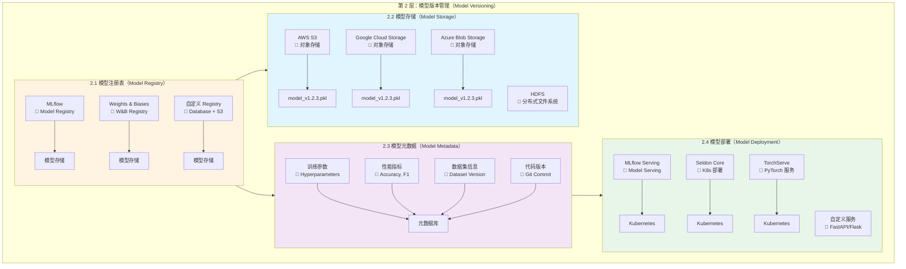

# Day 3_A1_B7_C2：第 2 层 - 模型版本管理详解

**Parent**: [KYC_Day03_A1_B7_测试用例版本管理和结果对比详解.md](./KYC_Day03_A1_B7_测试用例版本管理和结果对比详解.md)  
**层级**: 第 2 层 - 模型版本管理（Model Versioning）  
**目的**：详细讲解模型版本管理的架构、工具和实践

---

## 🎯 第 2 层：模型版本管理概述

### 核心职责

**模型版本管理负责**：
- ✅ **模型文件版本控制**：追踪模型文件的变更历史
- ✅ **模型元数据管理**：训练参数、性能指标、超参数
- ✅ **模型注册表管理**：模型版本注册、查询、部署
- ✅ **模型存储管理**：模型文件的存储和访问

---

## 📊 第 2 层架构图（详细版）



---

## 🔧 2.1 模型注册表（Model Registry）

### 💡 什么是"模型注册"？

**核心概念**：**模型注册（Register Model）就是把训练好的模型"登记"到一个"注册表"中，记录模型的元数据，让模型可以被查询、管理和部署。**

#### 类比理解

**类比 1：图书馆图书登记系统**
```
训练好的模型 = 一本书
模型注册表 = 图书馆的图书目录系统

注册过程：
1. 训练模型（写一本书）
2. 注册模型（把书登记到图书馆目录）
   - 记录书名（模型名称）
   - 记录版本号（ISBN）
   - 记录作者（训练者）
   - 记录内容摘要（模型性能指标）
   - 记录存放位置（模型文件路径）
3. 查询模型（通过目录查找书）
4. 部署模型（借阅书籍使用）
```

**类比 2：Docker 镜像注册表**
```
训练好的模型 = Docker 镜像
模型注册表 = Docker Hub / ECR

注册过程：
1. 构建镜像（训练模型）
2. 推送镜像（注册模型）
   docker push kyc-service:v1.2.3
3. 查询镜像（查询模型）
   docker search kyc-service
4. 拉取镜像（加载模型）
   docker pull kyc-service:v1.2.3
```

**类比 3：软件包管理器**
```
训练好的模型 = Python 包
模型注册表 = PyPI（Python Package Index）

注册过程：
1. 开发包（训练模型）
2. 上传包（注册模型）
   pip upload kyc-model==1.2.3
3. 查询包（查询模型）
   pip search kyc-model
4. 安装包（加载模型）
   pip install kyc-model==1.2.3
```

---

### 🎯 模型注册的核心作用

**问题场景**：

**场景 1：模型文件散落各处**
```
❌ 没有注册表：
- 模型文件在：/home/user/models/model_v1.pkl
- 另一个模型在：/data/models/model_v2.pkl
- 还有一个在：S3://bucket/models/model_v3.pkl
- 问题：不知道哪个模型是哪个版本？哪个性能最好？哪个在生产环境使用？
```

**场景 2：模型信息丢失**
```
❌ 没有注册表：
- 模型文件：model.pkl
- 问题：这个模型是什么时候训练的？用了什么参数？性能如何？谁训练的？
- 结果：无法追溯，无法复现
```

**场景 3：模型部署混乱**
```
❌ 没有注册表：
- 开发环境：使用 model_v1.pkl
- 测试环境：使用 model_v2.pkl
- 生产环境：使用 model_v3.pkl
- 问题：不知道哪个版本对应哪个环境？如何回滚？
```

**✅ 有了模型注册表**：
```
✅ 统一管理：
- 所有模型都在注册表中
- 每个模型都有唯一标识（名称 + 版本）
- 每个模型都有完整元数据（参数、指标、训练信息）

✅ 易于查询：
- 查询：get_model("kyc_model", "v1.2.3")
- 查询：get_latest_model("kyc_model")
- 查询：get_production_model("kyc_model")

✅ 易于部署：
- 部署：deploy_model("kyc_model", "v1.2.3")
- 回滚：rollback_model("kyc_model", "v1.1.0")
```

---

### 📋 模型注册包含什么？

**模型注册 = 模型文件 + 元数据**

```
┌─────────────────────────────────────────────────────────┐
│              模型注册的完整信息                            │
├─────────────────────────────────────────────────────────┤
│                                                         │
│  1. 模型文件（Model File）                              │
│     • 模型文件路径：s3://models/kyc_model/v1.2.3/model.pkl │
│     • 模型文件大小：50 MB                                │
│     • 模型文件格式：pickle / ONNX / TensorFlow SavedModel │
│                                                         │
│  2. 模型基本信息（Basic Info）                          │
│     • 模型名称：kyc_model                                │
│     • 模型版本：v1.2.3                                   │
│     • 模型类型：random_forest / neural_network          │
│     • 框架：scikit-learn / PyTorch / TensorFlow         │
│                                                         │
│  3. 训练参数（Training Parameters）                     │
│     • max_depth: 10                                     │
│     • n_estimators: 100                                 │
│     • learning_rate: 0.01                               │
│     • batch_size: 32                                    │
│                                                         │
│  4. 性能指标（Performance Metrics）                      │
│     • accuracy: 0.95                                    │
│     • f1_score: 0.92                                    │
│     • precision: 0.93                                   │
│     • recall: 0.91                                      │
│                                                         │
│  5. 训练信息（Training Info）                           │
│     • 数据集版本：v1.2.3                                 │
│     • 代码版本：abc123def456                            │
│     • 训练时间：2025-01-19T10:00:00Z                    │
│     • 训练者：ml-engineer@example.com                   │
│                                                         │
│  6. 部署信息（Deployment Info）                         │
│     • 部署环境：production / staging / development      │
│     • 部署时间：2025-01-19T11:00:00Z                    │
│     • 部署者：devops@example.com                        │
│     • 端点：https://api.example.com/v1/kyc/predict     │
│                                                         │
└─────────────────────────────────────────────────────────┘
```

---

### 🔄 模型注册的完整流程

```
┌─────────────────────────────────────────────────────────┐
│              模型注册完整流程                              │
└─────────────────────────────────────────────────────────┘

步骤 1：训练模型
┌─────────────────────────────────────────────────────────┐
│  model = train_model(training_data)                     │
│  # 训练完成后，得到 model 对象                          │
└─────────────────────────────────────────────────────────┘
                    ↓
步骤 2：保存模型文件
┌─────────────────────────────────────────────────────────┐
│  import pickle                                          │
│  with open("model.pkl", "wb") as f:                     │
│      pickle.dump(model, f)                              │
│  # 模型文件保存到本地：model.pkl                        │
└─────────────────────────────────────────────────────────┘
                    ↓
步骤 3：上传模型文件到存储
┌─────────────────────────────────────────────────────────┐
│  s3_client.upload_file(                                 │
│      "model.pkl",                                       │
│      "kyc-models",                                      │
│      "models/kyc_model/v1.2.3/model.pkl"               │
│  )                                                      │
│  # 模型文件上传到 S3：s3://kyc-models/models/...       │
└─────────────────────────────────────────────────────────┘
                    ↓
步骤 4：注册模型到注册表（核心步骤）
┌─────────────────────────────────────────────────────────┐
│  register_model(                                        │
│      model_name="kyc_model",                            │
│      version="v1.2.3",                                  │
│      model_path="s3://kyc-models/models/...",          │
│      training_params={"max_depth": 10, ...},           │
│      metrics={"accuracy": 0.95, ...},                  │
│      dataset_version="v1.2.3",                          │
│      code_version="abc123def456"                        │
│  )                                                      │
│  # 在注册表中创建一条记录，包含所有元数据                │
└─────────────────────────────────────────────────────────┘
                    ↓
步骤 5：查询模型（后续使用）
┌─────────────────────────────────────────────────────────┐
│  model_info = get_model("kyc_model", "v1.2.3")        │
│  # 从注册表查询模型信息                                  │
│                                                         │
│  model = load_model(model_info.model_path)              │
│  # 根据模型路径加载模型文件                              │
└─────────────────────────────────────────────────────────┘
```

---

### 💻 实际代码示例

#### MLflow 模型注册示例

```python
import mlflow
import mlflow.sklearn

# 步骤 1：训练模型
model = train_model(training_data)

# 步骤 2-4：注册模型（MLflow 自动完成）
with mlflow.start_run():
    # 记录训练参数
    mlflow.log_param("max_depth", 10)
    mlflow.log_param("n_estimators", 100)
    
    # 记录性能指标
    mlflow.log_metric("accuracy", 0.95)
    mlflow.log_metric("f1_score", 0.92)
    
    # 🔑 核心：注册模型
    # 这一步做了三件事：
    # 1. 保存模型文件到 MLflow 的存储（默认是本地文件系统或 S3）
    # 2. 在 MLflow 注册表中创建模型记录
    # 3. 关联训练参数、指标等元数据
    mlflow.sklearn.log_model(
        model,                    # 模型对象
        "model",                  # 模型在运行中的路径
        registered_model_name="kyc_model"  # 注册表中的应用名称
    )

# 步骤 5：查询和加载模型
# 从注册表加载模型
model = mlflow.sklearn.load_model("models:/kyc_model/Production")
```

**注册后，MLflow 注册表中的记录**：

```
模型名称：kyc_model
├── 版本 1
│   ├── 模型文件：s3://mlflow-bucket/models/kyc_model/1/model.pkl
│   ├── 训练参数：max_depth=10, n_estimators=100
│   ├── 性能指标：accuracy=0.95, f1_score=0.92
│   └── 状态：Staging
├── 版本 2
│   ├── 模型文件：s3://mlflow-bucket/models/kyc_model/2/model.pkl
│   ├── 训练参数：max_depth=12, n_estimators=150
│   ├── 性能指标：accuracy=0.96, f1_score=0.93
│   └── 状态：Production ← 当前生产版本
└── 版本 3
    ├── 模型文件：s3://mlflow-bucket/models/kyc_model/3/model.pkl
    ├── 训练参数：max_depth=15, n_estimators=200
    ├── 性能指标：accuracy=0.97, f1_score=0.94
    └── 状态：None
```

---

#### 自定义模型注册表示例

```python
# 自定义注册表（数据库 + S3）
def register_model(
    model_name: str,
    version: str,
    model_path: str,  # 本地文件路径
    training_params: dict,
    metrics: dict,
    dataset_version: str,
    code_version: str
):
    """
    注册模型到注册表
    
    这个过程做了什么？
    1. 上传模型文件到 S3（存储）
    2. 在数据库中创建模型记录（注册表）
    3. 保存所有元数据（参数、指标、训练信息）
    """
    
    # 步骤 1：上传模型文件到 S3
    s3_client = boto3.client('s3')
    s3_key = f"models/{model_name}/{version}/model.pkl"
    s3_client.upload_file(model_path, "kyc-models", s3_key)
    
    # 步骤 2：在数据库中创建模型记录（这就是"注册"）
    model_registry = ModelRegistry(
        id=f"{model_name}_{version}",
        model_name=model_name,
        version=version,
        model_path=f"s3://kyc-models/{s3_key}",  # S3 路径
        training_params=training_params,         # 训练参数
        metrics=metrics,                         # 性能指标
        dataset_version=dataset_version,         # 数据集版本
        code_version=code_version               # 代码版本
    )
    
    # 步骤 3：保存到数据库（注册完成）
    db_session.add(model_registry)
    db_session.commit()
    
    return model_registry

# 使用示例
register_model(
    model_name="kyc_model",
    version="v1.2.3",
    model_path="./model.pkl",  # 本地文件
    training_params={"max_depth": 10, "n_estimators": 100},
    metrics={"accuracy": 0.95, "f1_score": 0.92},
    dataset_version="v1.2.3",
    code_version="abc123def456"
)

# 注册后，数据库中有一条记录：
# {
#   "model_name": "kyc_model",
#   "version": "v1.2.3",
#   "model_path": "s3://kyc-models/models/kyc_model/v1.2.3/model.pkl",
#   "training_params": {"max_depth": 10, "n_estimators": 100},
#   "metrics": {"accuracy": 0.95, "f1_score": 0.92},
#   ...
# }
```

---

### 🎯 模型注册 vs 模型存储

| 概念 | 作用 | 类比 |
|------|------|------|
| **模型存储** | 存放模型文件（物理存储） | 图书馆的书架（存放书籍） |
| **模型注册** | 记录模型元数据（逻辑管理） | 图书馆的目录系统（记录书籍信息） |

**关系**：
```
模型注册表（逻辑管理）
    ↓ 指向
模型存储（物理存储）

例如：
注册表记录：model_name="kyc_model", version="v1.2.3"
    ↓ 指向
S3 存储：s3://kyc-models/models/kyc_model/v1.2.3/model.pkl
```

---

### 🔄 版本更新 vs 版本创建

**重要区别**：

| 操作 | 含义 | 示例 |
|------|------|------|
| **版本创建** | 每次训练新模型，创建新版本记录 | v1.0.0 → v1.1.0 → v1.2.3 |
| **版本更新** | 修改现有版本的元数据（很少用） | 修改版本 1 的描述信息 |

**实际使用**：

```
✅ 正确做法：版本创建（推荐）
每次训练新模型 → 创建新版本 → 版本号递增
v1.0.0 → v1.1.0 → v1.2.3

❌ 错误做法：版本更新（不推荐）
每次训练新模型 → 更新旧版本 → 丢失历史
v1.0.0 → 更新为 v1.1.0 → 更新为 v1.2.3（历史丢失）
```

**版本创建流程**：

```
训练模型 v1.0.0
    ↓
注册模型 → 创建版本 1（注册表中新增一条记录）
    ↓
训练模型 v1.1.0
    ↓
注册模型 → 创建版本 2（注册表中再新增一条记录）
    ↓
训练模型 v1.2.3
    ↓
注册模型 → 创建版本 3（注册表中再新增一条记录）

注册表中的记录（所有版本都保留）：
kyc_model
├── 版本 1 (v1.0.0) ← 保留
├── 版本 2 (v1.1.0) ← 保留
└── 版本 3 (v1.2.3) ← 保留
```

**版本号更新**：

```python
# 版本号是语义化版本（Semantic Versioning）
# MAJOR.MINOR.PATCH

v1.0.0 → v1.1.0  # MINOR 更新（新功能）
v1.1.0 → v1.1.1  # PATCH 更新（Bug 修复）
v1.1.1 → v2.0.0  # MAJOR 更新（重大变更）

# 每次版本号变更，都创建新版本记录
register_model("kyc_model", "v1.0.0", ...)  # 创建版本 1
register_model("kyc_model", "v1.1.0", ...)  # 创建版本 2（不是更新版本 1）
register_model("kyc_model", "v1.1.1", ...)  # 创建版本 3（不是更新版本 2）
register_model("kyc_model", "v2.0.0", ...)  # 创建版本 4（不是更新版本 3）
```

---

### 📊 架构图

```
┌─────────────────────────────────────────────────────────────────────────────┐
│          2.1 模型注册表（Model Registry）                                     │
└─────────────────────────────────────────────────────────────────────────────┘

┌─────────────────────────────────────────────────────────────────────────────┐
│                        模型注册表层（Registry Layer）                         │
├─────────────────────────────────────────────────────────────────────────────┤
│                                                                             │
│  ┌──────────────┐    ┌──────────────┐    ┌──────────────┐                  │
│  │   MLflow     │    │   W&B        │    │   自定义      │                  │
│  │              │    │              │    │   Registry    │                  │
│  │  ✅ 开源      │    │  ✅ 商业      │    │  ✅ 灵活      │                  │
│  │  ✅ Python    │    │  ✅ 可视化    │    │  ✅ 定制      │                  │
│  │  ✅ 集成      │    │  ✅ 实验跟踪  │    │  ✅ 数据库    │                  │
│  └──────────────┘    └──────────────┘    └──────────────┘                  │
│           │                  │                  │                           │
│           └──────────────────┴──────────────────┘                           │
│                              ↓                                              │
│  ┌──────────────────────────────────────────────────────────┐              │
│  │             模型注册表功能（Registry Functions）            │              │
│  │                                                          │              │
│  │  • 模型注册（Register Model）                            │              │
│  │  • 版本管理（Version Management）                        │              │
│  │  • 模型查询（Model Query）                                │              │
│  │  • 模型部署（Model Deployment）                           │              │
│  │  • 模型回滚（Model Rollback）                             │              │
│  └──────────────────────────────────────────────────────────┘              │
│                                                                             │
└─────────────────────────────────────────────────────────────────────────────┘
                              ↓
┌─────────────────────────────────────────────────────────────────────────────┐
│                   模型存储层（Model Storage Layer）                         │
├─────────────────────────────────────────────────────────────────────────────┤
│                                                                             │
│  ┌──────────────┐    ┌──────────────┐    ┌──────────────┐                  │
│  │   AWS S3     │    │   GCS        │    │  Azure Blob  │                  │
│  │              │    │              │    │              │                  │
│  │  s3://models │    │  gs://models │    │  blob://     │                  │
│  │  /v1.2.3/    │    │  /v1.2.3/    │    │  models/     │                  │
│  │  model.pkl   │    │  model.pkl   │    │  v1.2.3/     │                  │
│  └──────────────┘    └──────────────┘    └──────────────┘                  │
│                                                                             │
└─────────────────────────────────────────────────────────────────────────────┘
```

---

### 工具对比

| 工具 | 类型 | 特点 | 适用场景 | 成本 |
|------|------|------|---------|------|
| **MLflow** | 开源模型管理 | ✅ 开源、Python 集成、功能完整 | ✅ **Python 项目推荐** | 免费 |
| **Weights & Biases** | 商业模型管理 | ✅ 可视化强、实验跟踪、协作 | ✅ 团队协作、实验管理 | 免费/付费 |
| **自定义 Registry** | 自建方案 | ✅ 灵活、可定制、数据库集成 | ✅ 企业定制需求 | 开发成本 |

---

### MLflow 模型注册表实践

#### 1. MLflow 架构

```python
# MLflow 模型注册表架构
import mlflow
import mlflow.sklearn
from mlflow.tracking import MlflowClient

# 1. 训练和注册模型
with mlflow.start_run():
    # 训练模型
    model = train_model(training_data)
    
    # 记录参数
    mlflow.log_param("model_type", "random_forest")
    mlflow.log_param("max_depth", 10)
    mlflow.log_param("n_estimators", 100)
    
    # 记录指标
    mlflow.log_metric("accuracy", 0.95)
    mlflow.log_metric("f1_score", 0.92)
    
    # 记录数据集版本
    mlflow.log_param("dataset_version", "v1.2.3")
    
    # 记录代码版本
    mlflow.log_param("git_commit", "abc123def456")
    
    # 注册模型
    mlflow.sklearn.log_model(
        model,
        "model",
        registered_model_name="kyc_model"
    )
    
    # 标记版本
    mlflow.set_tag("version", "v1.2.3")
```

---

#### 2. 模型版本管理

**重要概念**：**模型注册表不是"更新"现有记录，而是"创建新版本"的记录**

**版本管理策略**：
- ✅ **每次训练新模型** → **创建新版本记录**（不是更新旧版本）
- ✅ **版本号递增**：v1.0.0 → v1.1.0 → v1.2.3
- ✅ **保留历史版本**：旧版本记录不会删除，保留完整历史
- ✅ **版本状态管理**：可以标记哪个版本是 Production / Staging / Archived

**版本演进示例**：

```
时间线：
2025-01-01: 训练模型 v1.0.0 → 注册表创建版本 1
2025-01-10: 训练模型 v1.1.0 → 注册表创建版本 2（不是更新版本 1）
2025-01-19: 训练模型 v1.2.3 → 注册表创建版本 3（不是更新版本 2）

注册表中的记录：
kyc_model
├── 版本 1 (v1.0.0) - 状态：Archived（已归档）
├── 版本 2 (v1.1.0) - 状态：Staging（测试中）
└── 版本 3 (v1.2.3) - 状态：Production（生产中）← 当前使用
```

**代码示例**：

```python
# 模型版本管理
client = MlflowClient()

# 🔑 关键：每次训练新模型，都创建新版本（不是更新旧版本）
# 第一次训练：创建版本 1
with mlflow.start_run():
    model_v1 = train_model(training_data_v1)
    mlflow.sklearn.log_model(
        model_v1,
        "model",
        registered_model_name="kyc_model"  # 创建版本 1
    )

# 第二次训练：创建版本 2（不是更新版本 1）
with mlflow.start_run():
    model_v2 = train_model(training_data_v2)
    mlflow.sklearn.log_model(
        model_v2,
        "model",
        registered_model_name="kyc_model"  # 创建版本 2
    )

# 第三次训练：创建版本 3（不是更新版本 2）
with mlflow.start_run():
    model_v3 = train_model(training_data_v3)
    mlflow.sklearn.log_model(
        model_v3,
        "model",
        registered_model_name="kyc_model"  # 创建版本 3
    )

# 查询所有版本（所有版本都保留）
model_versions = client.search_model_versions("name='kyc_model'")
for mv in model_versions:
    print(f"Version {mv.version}: {mv.current_stage}")
    # 输出：
    # Version 1: Archived
    # Version 2: Staging
    # Version 3: Production

# 标记生产版本（只改变状态，不删除旧版本）
client.transition_model_version_stage(
    name="kyc_model",
    version=3,  # 版本号（不是版本字符串）
    stage="Production"
)

# 加载指定版本的模型（可以加载任意历史版本）
model_v1 = mlflow.sklearn.load_model("models:/kyc_model/1")  # 版本 1
model_v2 = mlflow.sklearn.load_model("models:/kyc_model/2")  # 版本 2
model_v3 = mlflow.sklearn.load_model("models:/kyc_model/3")  # 版本 3
model_prod = mlflow.sklearn.load_model("models:/kyc_model/Production")  # 生产版本
```

---

#### 3. 模型元数据管理

```python
# 模型元数据
model_metadata = {
    "model_name": "kyc_model",
    "version": "v1.2.3",
    "model_type": "random_forest",
    "training_params": {
        "max_depth": 10,
        "n_estimators": 100,
        "random_state": 42
    },
    "metrics": {
        "accuracy": 0.95,
        "f1_score": 0.92,
        "precision": 0.93,
        "recall": 0.91
    },
    "dataset_version": "v1.2.3",
    "code_version": "abc123def456",
    "trained_at": "2025-01-19T10:00:00Z",
    "trained_by": "ml-engineer@example.com"
}

# 保存元数据
mlflow.log_dict(model_metadata, "model_metadata.json")
```

---

### Weights & Biases 实践

```python
# W&B 模型注册表
import wandb

# 初始化 W&B
wandb.init(project="kyc-model", name="v1.2.3")

# 训练模型
model = train_model(training_data)

# 记录参数和指标
wandb.config.update({
    "model_type": "random_forest",
    "max_depth": 10,
    "n_estimators": 100
})

wandb.log({
    "accuracy": 0.95,
    "f1_score": 0.92
})

# 保存模型
wandb.save("model.pkl")
wandb.log_model("kyc_model", "model.pkl")

# 标记版本
wandb.run.tags = ["v1.2.3", "production"]
wandb.finish()
```

---

### 自定义模型注册表实现

```python
# 自定义模型注册表（数据库 + S3）
import boto3
import json
from datetime import datetime
from sqlalchemy import create_engine, Column, String, JSON, DateTime
from sqlalchemy.ext.declarative import declarative_base

Base = declarative_base()

class ModelRegistry(Base):
    __tablename__ = 'model_registry'
    
    id = Column(String, primary_key=True)
    model_name = Column(String, nullable=False)
    version = Column(String, nullable=False)
    model_path = Column(String, nullable=False)  # S3 path
    training_params = Column(JSON)
    metrics = Column(JSON)
    dataset_version = Column(String)
    code_version = Column(String)
    created_at = Column(DateTime, default=datetime.now)

# 注册模型
def register_model(
    model_name: str,
    version: str,
    model_path: str,
    training_params: dict,
    metrics: dict,
    dataset_version: str,
    code_version: str
):
    """注册模型到注册表"""
    # 1. 上传模型到 S3
    s3_client = boto3.client('s3')
    s3_key = f"models/{model_name}/{version}/model.pkl"
    s3_client.upload_file(model_path, "kyc-models", s3_key)
    
    # 2. 保存元数据到数据库
    model_registry = ModelRegistry(
        id=f"{model_name}_{version}",
        model_name=model_name,
        version=version,
        model_path=f"s3://kyc-models/{s3_key}",
        training_params=training_params,
        metrics=metrics,
        dataset_version=dataset_version,
        code_version=code_version
    )
    
    db_session.add(model_registry)
    db_session.commit()
    
    return model_registry

# 查询模型
def get_model(model_name: str, version: str = None):
    """查询模型"""
    if version:
        model = db_session.query(ModelRegistry).filter(
            ModelRegistry.model_name == model_name,
            ModelRegistry.version == version
        ).first()
    else:
        # 获取最新版本
        model = db_session.query(ModelRegistry).filter(
            ModelRegistry.model_name == model_name
        ).order_by(ModelRegistry.created_at.desc()).first()
    
    return model
```

---

## 💾 2.2 模型存储（Model Storage）

### 架构图

```
┌─────────────────────────────────────────────────────────────────────────────┐
│          2.2 模型存储（Model Storage）                                        │
└─────────────────────────────────────────────────────────────────────────────┘

┌─────────────────────────────────────────────────────────────────────────────┐
│                        对象存储架构（Object Storage）                         │
├─────────────────────────────────────────────────────────────────────────────┤
│                                                                             │
│  ┌──────────────────────────────────────────────────────────┐              │
│  │              AWS S3（推荐）                                 │              │
│  │                                                          │              │
│  │  s3://kyc-models/                                        │              │
│  │  ├── kyc_model/                                          │              │
│  │  │   ├── v1.0.0/                                         │              │
│  │  │   │   ├── model.pkl                                   │              │
│  │  │   │   └── metadata.json                               │              │
│  │  │   ├── v1.1.0/                                         │              │
│  │  │   │   ├── model.pkl                                   │              │
│  │  │   │   └── metadata.json                               │              │
│  │  │   └── v1.2.3/                                         │              │
│  │  │       ├── model.pkl                                   │              │
│  │  │       └── metadata.json                                │              │
│  └──────────────────────────────────────────────────────────┘              │
│                                                                             │
│  存储策略：                                                                 │
│    • 版本化目录结构（Versioned Directory）                                 │
│    • 模型文件 + 元数据文件（Model + Metadata）                              │
│    • 生命周期管理（Lifecycle Management）                                   │
│    • 访问控制（Access Control）                                             │
│                                                                             │
└─────────────────────────────────────────────────────────────────────────────┘
```

---

### 存储策略

```python
# S3 模型存储实现
import boto3
import pickle
import json

class ModelStorage:
    def __init__(self, bucket_name: str):
        self.s3_client = boto3.client('s3')
        self.bucket_name = bucket_name
    
    def save_model(
        self,
        model_name: str,
        version: str,
        model: object,
        metadata: dict
    ):
        """保存模型和元数据"""
        # 1. 保存模型文件
        model_key = f"models/{model_name}/{version}/model.pkl"
        model_bytes = pickle.dumps(model)
        self.s3_client.put_object(
            Bucket=self.bucket_name,
            Key=model_key,
            Body=model_bytes
        )
        
        # 2. 保存元数据
        metadata_key = f"models/{model_name}/{version}/metadata.json"
        self.s3_client.put_object(
            Bucket=self.bucket_name,
            Key=metadata_key,
            Body=json.dumps(metadata, indent=2)
        )
        
        return {
            "model_path": f"s3://{self.bucket_name}/{model_key}",
            "metadata_path": f"s3://{self.bucket_name}/{metadata_key}"
        }
    
    def load_model(self, model_name: str, version: str):
        """加载模型"""
        model_key = f"models/{model_name}/{version}/model.pkl"
        
        response = self.s3_client.get_object(
            Bucket=self.bucket_name,
            Key=model_key
        )
        
        model_bytes = response['Body'].read()
        model = pickle.loads(model_bytes)
        
        return model
    
    def list_versions(self, model_name: str):
        """列出所有版本"""
        prefix = f"models/{model_name}/"
        response = self.s3_client.list_objects_v2(
            Bucket=self.bucket_name,
            Prefix=prefix,
            Delimiter='/'
        )
        
        versions = []
        for prefix_obj in response.get('CommonPrefixes', []):
            version = prefix_obj['Prefix'].split('/')[-2]
            versions.append(version)
        
        return sorted(versions, reverse=True)
```

---

## 📊 2.3 模型元数据（Model Metadata）

### 元数据结构

```python
# 模型元数据结构
model_metadata = {
    "model_info": {
        "model_name": "kyc_model",
        "version": "v1.2.3",
        "model_type": "random_forest",
        "framework": "scikit-learn",
        "framework_version": "1.0.0"
    },
    "training_info": {
        "training_params": {
            "max_depth": 10,
            "n_estimators": 100,
            "random_state": 42,
            "min_samples_split": 2,
            "min_samples_leaf": 1
        },
        "dataset_version": "v1.2.3",
        "dataset_path": "s3://data/train/v1.2.3/train.parquet",
        "train_size": 10000,
        "validation_size": 2000,
        "test_size": 2000
    },
    "performance_metrics": {
        "train": {
            "accuracy": 0.96,
            "f1_score": 0.94,
            "precision": 0.95,
            "recall": 0.93
        },
        "validation": {
            "accuracy": 0.95,
            "f1_score": 0.92,
            "precision": 0.93,
            "recall": 0.91
        },
        "test": {
            "accuracy": 0.94,
            "f1_score": 0.91,
            "precision": 0.92,
            "recall": 0.90
        }
    },
    "code_info": {
        "git_commit": "abc123def456",
        "git_tag": "v1.2.3",
        "code_path": "s3://code/kyc-service/v1.2.3/"
    },
    "deployment_info": {
        "deployed_at": "2025-01-19T10:00:00Z",
        "deployed_by": "ml-engineer@example.com",
        "deployment_env": "production",
        "endpoint": "https://api.example.com/v1/kyc/predict"
    },
    "created_at": "2025-01-19T10:00:00Z",
    "created_by": "ml-engineer@example.com"
}
```

---

## 🚀 2.4 模型部署（Model Deployment）

### 部署架构

```python
# MLflow Model Serving
import mlflow.pyfunc

# 加载模型
model = mlflow.pyfunc.load_model("models:/kyc_model/Production")

# 预测
prediction = model.predict(input_data)

# FastAPI 服务
from fastapi import FastAPI
import mlflow.pyfunc

app = FastAPI()
model = mlflow.pyfunc.load_model("models:/kyc_model/Production")

@app.post("/predict")
async def predict(data: dict):
    prediction = model.predict([data])
    return {"prediction": prediction[0]}
```

---

## 📊 第 2 层工具选择矩阵

| 功能 | Python 项目推荐 | 企业项目推荐 | 成本 |
|------|----------------|------------|------|
| **模型注册表** | MLflow | MLflow / W&B | 免费/付费 |
| **模型存储** | AWS S3 | AWS S3 / GCS | 按存储计费 |
| **模型部署** | MLflow Serving | Seldon / TorchServe | 免费 |

---

## 💡 面试话术

1. ✅ **模型版本管理**：
   - "我们使用 **MLflow** 进行模型版本管理。MLflow 提供模型注册表（Model Registry），可以注册、版本化、查询和部署模型。每个模型版本都包含模型文件、训练参数、性能指标、数据集版本和代码版本等元数据。"

2. ✅ **模型存储**：
   - "模型文件存储在 **AWS S3**，采用版本化目录结构（models/{model_name}/{version}/）。每个版本包含模型文件（model.pkl）和元数据文件（metadata.json）。通过 S3 生命周期管理策略，自动归档旧版本模型。"

3. ✅ **模型元数据**：
   - "模型元数据包括训练参数、性能指标、数据集版本、代码版本等信息。这些元数据帮助我们追踪模型的完整生命周期，确保模型的可追溯性和可复现性。"

---

## 📝 实施检查清单

- [ ] **模型注册表**：选择 MLflow / W&B / 自定义
- [ ] **模型存储**：配置 S3 / GCS / Azure Blob
- [ ] **模型元数据**：定义元数据结构
- [ ] **模型版本**：实现版本管理流程
- [ ] **模型部署**：配置模型服务

---

**最后更新**：2025-01-19
