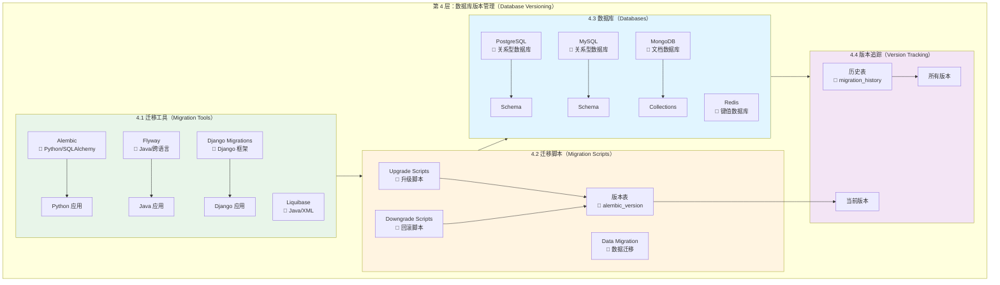

# Day 3_A1_B7_C4：第 4 层 - 数据库版本管理详解

**Parent**: [KYC_Day03_A1_B7_测试用例版本管理和结果对比详解.md](./KYC_Day03_A1_B7_测试用例版本管理和结果对比详解.md)  
**层级**: 第 4 层 - 数据库版本管理（Database Versioning）  
**目的**：详细讲解数据库版本管理的架构、工具和实践

---

## 🎯 第 4 层：数据库版本管理概述

### 核心职责

**数据库版本管理负责**：
- ✅ **Schema 版本控制**：追踪数据库表结构的变更历史
- ✅ **迁移脚本管理**：数据库迁移脚本的版本化和执行
- ✅ **数据版本管理**：数据的版本化和回滚
- ✅ **数据库版本追踪**：记录数据库当前版本和历史版本

---

## 📊 第 4 层架构图（详细版）



---

## 🔧 4.1 迁移工具（Migration Tools）

### 工具对比

| 工具 | 语言生态 | 数据库支持 | 特点 | 适用场景 |
|------|---------|-----------|------|---------|
| **Alembic** | Python | ✅ PostgreSQL, MySQL, SQLite | ✅ SQLAlchemy 集成 | ✅ **Python 项目推荐** |
| **Flyway** | Java | ✅ 广泛支持 | ✅ 简单易用、SQL 文件 | ✅ **跨语言推荐** |
| **Django Migrations** | Python | ✅ Django 支持的数据库 | ✅ Django 框架自带 | ✅ Django 项目 |
| **Liquibase** | Java | ✅ 广泛支持 | ✅ XML/YAML/SQL | ✅ 复杂变更场景 |

---

### Alembic 实践（Python 推荐）

```python
# alembic/env.py
from alembic import context
from sqlalchemy import engine_from_config, pool
from models import Base

target_metadata = Base.metadata

def run_migrations_online():
    """在线迁移"""
    connectable = engine_from_config(
        config.get_section(config.config_ini_section),
        prefix="sqlalchemy.",
        poolclass=pool.NullPool,
    )
    
    with connectable.connect() as connection:
        context.configure(
            connection=connection,
            target_metadata=target_metadata
        )
        
        with context.begin_transaction():
            context.run_migrations()

run_migrations_online()
```

**迁移脚本示例**：

```python
# alembic/versions/001_create_test_cases_table.py
"""Create test_cases table

Revision ID: 001
Revises: 
Create Date: 2025-01-19 10:00:00.000000
"""
from alembic import op
import sqlalchemy as sa
from sqlalchemy.dialects import postgresql

def upgrade():
    op.create_table(
        'test_cases',
        sa.Column('id', sa.Integer(), nullable=False),
        sa.Column('case_id', sa.String(100), nullable=False),
        sa.Column('version', sa.String(50), nullable=False),
        sa.Column('file_path', sa.String(500)),
        sa.Column('expected_fields', postgresql.JSONB()),
        sa.Column('created_at', sa.DateTime(), nullable=False),
        sa.PrimaryKeyConstraint('id')
    )
    op.create_index('idx_test_cases_version', 'test_cases', ['version'])

def downgrade():
    op.drop_index('idx_test_cases_version', table_name='test_cases')
    op.drop_table('test_cases')
```

---

### Flyway 实践（跨语言推荐）

```sql
-- V1__Create_test_cases_table.sql
CREATE TABLE test_cases (
    id SERIAL PRIMARY KEY,
    case_id VARCHAR(100) NOT NULL,
    version VARCHAR(50) NOT NULL,
    file_path VARCHAR(500),
    expected_fields JSONB,
    created_at TIMESTAMP NOT NULL DEFAULT NOW()
);

CREATE INDEX idx_test_cases_version ON test_cases(version);

-- V2__Create_test_results_table.sql
CREATE TABLE test_results (
    id SERIAL PRIMARY KEY,
    version VARCHAR(50) NOT NULL,
    golden_set_version VARCHAR(50) NOT NULL,
    summary JSONB,
    created_at TIMESTAMP NOT NULL DEFAULT NOW()
);

-- V3__Add_version_column.sql
ALTER TABLE test_cases 
ADD COLUMN priority INTEGER DEFAULT 0;
```

---

## 💾 4.2 数据库选择

### 数据库对比

| 数据库 | 类型 | 特点 | 适用场景 | 版本管理工具 |
|------|------|------|---------|------------|
| **PostgreSQL** | 关系型 | ✅ 功能强大、JSON 支持 | ✅ **推荐**（功能完整） | Alembic / Flyway |
| **MySQL** | 关系型 | ✅ 广泛使用、性能好 | ✅ 传统应用 | Alembic / Flyway |
| **MongoDB** | 文档型 | ✅ 灵活、NoSQL | ✅ 非结构化数据 | 自定义迁移 |
| **Redis** | 键值型 | ✅ 高性能、内存存储 | ✅ 缓存、会话 | 不需要迁移 |

---

### PostgreSQL 实践

```sql
-- 创建版本历史表
CREATE TABLE alembic_version (
    version_num VARCHAR(32) NOT NULL,
    CONSTRAINT alembic_version_pkc PRIMARY KEY (version_num)
);

-- 插入当前版本
INSERT INTO alembic_version (version_num) VALUES ('001');

-- 查询当前版本
SELECT version_num FROM alembic_version;
```

---

## 📊 第 4 层工具选择矩阵

| 功能 | Python 项目推荐 | Java 项目推荐 | 跨语言项目推荐 |
|------|----------------|--------------|--------------|
| **迁移工具** | Alembic | Flyway / Liquibase | Flyway |
| **数据库** | PostgreSQL | PostgreSQL / MySQL | PostgreSQL |

---

## 💡 面试话术

1. ✅ **数据库版本管理**：
   - "我们使用 **Alembic**（Python 项目）进行数据库版本管理。Alembic 与 SQLAlchemy 深度集成，可以根据模型自动生成迁移脚本。每次数据库结构变更都会创建迁移脚本，支持升级（upgrade）和回滚（downgrade）。"

2. ✅ **数据库选择**：
   - "我们使用 **PostgreSQL** 作为主数据库。PostgreSQL 功能强大，支持 JSONB 类型，非常适合存储半结构化数据（如测试用例的 expected_fields）。"

3. ✅ **版本追踪**：
   - "Alembic 在数据库中创建 `alembic_version` 表，记录当前数据库版本。每次迁移都会更新版本号，确保数据库版本与代码版本一致。"

---

## 📝 实施检查清单

- [ ] **迁移工具**：选择 Alembic / Flyway / Django Migrations
- [ ] **数据库**：选择 PostgreSQL / MySQL
- [ ] **迁移脚本**：创建初始迁移脚本
- [ ] **版本追踪**：配置版本表
- [ ] **CI/CD 集成**：自动化数据库迁移

---

**最后更新**：2025-01-19
