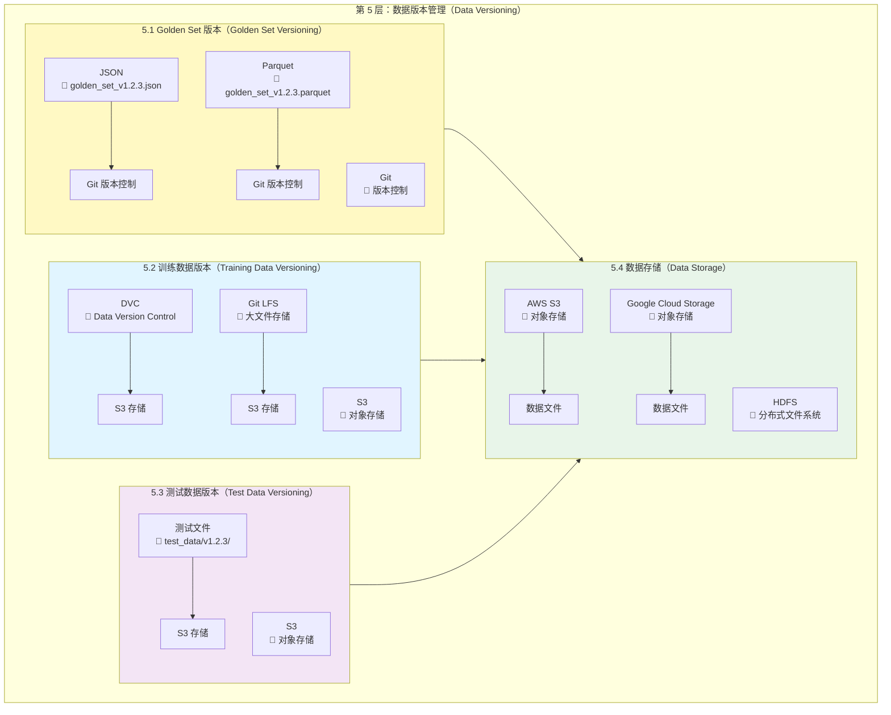

# Day 3_A1_B7_C5：第 5 层 - 数据版本管理详解

**Parent**: [KYC_Day03_A1_B7_测试用例版本管理和结果对比详解.md](./KYC_Day03_A1_B7_测试用例版本管理和结果对比详解.md)  
**层级**: 第 5 层 - 数据版本管理（Data Versioning）  
**目的**：详细讲解数据版本管理的架构、工具和实践

---

## 🎯 第 5 层：数据版本管理概述

### 核心职责

**数据版本管理负责**：
- ✅ **Golden Set 版本控制**：测试用例集的版本化管理
- ✅ **训练数据版本管理**：训练数据集的版本化
- ✅ **测试数据版本管理**：测试数据文件的版本化
- ✅ **数据存储管理**：数据文件的存储和访问

---

## 📊 第 5 层架构图（详细版）



---

## 🔧 5.1 Golden Set 版本（Golden Set Versioning）

### 架构图

```
┌─────────────────────────────────────────────────────────────────────────────┐
│        5.1 Golden Set 版本（Golden Set Versioning）                          │
└─────────────────────────────────────────────────────────────────────────────┘

┌─────────────────────────────────────────────────────────────────────────────┐
│                        Golden Set 存储结构（Storage Structure）              │
├─────────────────────────────────────────────────────────────────────────────┤
│                                                                             │
│  data/                                                                      │
│  ├── golden_set_v1.0.0.json                                                │
│  ├── golden_set_v1.1.0.json                                                │
│  └── golden_set_v1.2.3.json                                                │
│                                                                             │
│  格式选择：                                                                  │
│    • JSON：易读、Git 友好（推荐小数据集）                                   │
│    • Parquet：高效、压缩（推荐大数据集）                                     │
│                                                                             │
└─────────────────────────────────────────────────────────────────────────────┘
```

---

### Golden Set 版本管理实现

```python
# golden_set_manager.py
import json
from pathlib import Path
from typing import List, Dict

class GoldenSetManager:
    def __init__(self, data_dir: str = "data"):
        self.data_dir = Path(data_dir)
    
    def save_golden_set(self, golden_set: List[Dict], version: str):
        """保存 Golden Set"""
        file_path = self.data_dir / f"golden_set_{version}.json"
        with open(file_path, "w", encoding="utf-8") as f:
            json.dump(golden_set, f, ensure_ascii=False, indent=2)
    
    def load_golden_set(self, version: str) -> List[Dict]:
        """加载 Golden Set"""
        file_path = self.data_dir / f"golden_set_{version}.json"
        with open(file_path, "r", encoding="utf-8") as f:
            return json.load(f)
    
    def list_versions(self) -> List[str]:
        """列出所有版本"""
        versions = []
        for file in self.data_dir.glob("golden_set_*.json"):
            version = file.stem.replace("golden_set_", "")
            versions.append(version)
        return sorted(versions, reverse=True)
```

---

## 📦 5.2 DVC 数据版本控制

### DVC 实践

```bash
# 初始化 DVC
dvc init

# 添加数据文件
dvc add data/train.parquet
dvc add data/test.parquet

# 配置远程存储
dvc remote add -d s3remote s3://kyc-data/dvc

# 推送数据
dvc push

# 拉取数据
dvc pull

# 版本化数据
git add data/train.parquet.dvc
git commit -m "Add training data v1.2.3"
git tag v1.2.3
```

---

## 📊 第 5 层工具选择矩阵

| 功能 | 小数据集推荐 | 大数据集推荐 | 成本 |
|------|------------|------------|------|
| **Golden Set** | Git + JSON | Git + Parquet | 免费 |
| **训练数据** | Git LFS | DVC + S3 | 免费/付费 |
| **数据存储** | Git LFS | S3 / GCS | 免费/付费 |

---

## 💡 面试话术

1. ✅ **Golden Set 版本管理**：
   - "我们使用 **Git + JSON** 管理 Golden Set 版本。Golden Set 文件按版本号命名（golden_set_v1.2.3.json），通过 Git 进行版本控制。每次 Golden Set 变更都会创建新版本文件，确保可追溯性。"

2. ✅ **训练数据版本管理**：
   - "对于大型训练数据集，我们使用 **DVC**（Data Version Control）。DVC 将数据文件存储在 S3，在 Git 中只保存数据文件的元数据（.dvc 文件），实现数据版本控制而不占用 Git 仓库空间。"

---

## 📝 实施检查清单

- [ ] **Golden Set**：选择 JSON / Parquet 格式
- [ ] **数据存储**：配置 S3 / GCS
- [ ] **版本控制**：配置 Git / DVC
- [ ] **数据加载**：实现数据加载器

---

**最后更新**：2025-01-19
