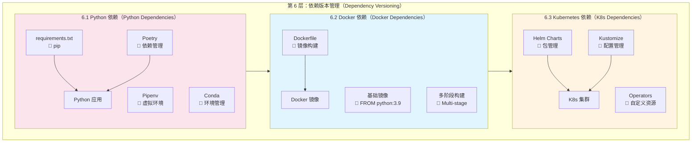

# Day 3_A1_B7_C6：第 6 层 - 依赖版本管理详解

**Parent**: [KYC_Day03_A1_B7_测试用例版本管理和结果对比详解.md](./KYC_Day03_A1_B7_测试用例版本管理和结果对比详解.md)  
**层级**: 第 6 层 - 依赖版本管理（Dependency Versioning）  
**目的**：详细讲解依赖版本管理的架构、工具和实践

---

## 🎯 第 6 层：依赖版本管理概述

### 核心职责

**依赖版本管理负责**：
- ✅ **Python 包版本管理**：Python 依赖包的版本锁定
- ✅ **Docker 镜像版本管理**：容器依赖的版本化
- ✅ **系统依赖版本管理**：操作系统依赖的版本化
- ✅ **Kubernetes 部署版本管理**：K8s 部署配置的版本化

---

## 📊 第 6 层架构图（详细版）



---

## 🔧 6.1 Python 依赖版本管理

### requirements.txt 实践

```txt
# requirements_v1.2.3.txt
# KYC Service Dependencies v1.2.3

# Web Framework
fastapi==0.95.0
uvicorn==0.22.0

# Database
sqlalchemy==2.0.0
psycopg2-binary==2.9.6
alembic==1.11.0

# ML/AI
torch==2.0.0
transformers==4.30.0
sentence-transformers==2.2.2

# Utilities
pydantic==1.10.0
python-dotenv==1.0.0
pyyaml==6.0

# Testing
pytest==7.3.0
pytest-cov==4.1.0
```

---

## 🐳 6.2 Docker 依赖版本管理

### Dockerfile 实践

```dockerfile
# Dockerfile
FROM python:3.9-slim

# 系统依赖
RUN apt-get update && apt-get install -y \
    gcc \
    g++ \
    && rm -rf /var/lib/apt/lists/*

# Python 依赖
COPY requirements_v1.2.3.txt /app/requirements.txt
RUN pip install --no-cache-dir -r /app/requirements.txt

# 应用代码
COPY . /app
WORKDIR /app

CMD ["python", "app.py"]
```

---

## ☸️ 6.3 Kubernetes 依赖版本管理

### Helm Chart 实践

```yaml
# Chart.yaml
apiVersion: v2
name: kyc-service
version: 1.2.3
appVersion: "1.2.3"

# values.yaml
image:
  repository: kyc-service
  tag: v1.2.3
  pullPolicy: IfNotPresent

service:
  type: LoadBalancer
  port: 8000

replicas: 3
```

---

## 📊 第 6 层工具选择矩阵

| 功能 | Python 项目推荐 | Java 项目推荐 | 成本 |
|------|----------------|--------------|------|
| **Python 依赖** | requirements.txt / Poetry | - | 免费 |
| **Java 依赖** | - | Maven / Gradle | 免费 |
| **Docker** | Dockerfile | Dockerfile | 免费 |
| **K8s** | Helm Charts | Helm Charts | 免费 |

---

## 💡 面试话术

1. ✅ **依赖版本管理**：
   - "我们使用 **requirements.txt** 锁定 Python 依赖版本，确保不同环境的依赖一致性。Dockerfile 中指定基础镜像版本（python:3.9-slim）和依赖文件版本（requirements_v1.2.3.txt），确保容器构建的可重复性。"

---

## 📝 实施检查清单

- [ ] **Python 依赖**：创建 requirements.txt
- [ ] **Docker**：配置 Dockerfile
- [ ] **K8s**：配置 Helm Charts

---

**最后更新**：2025-01-19
