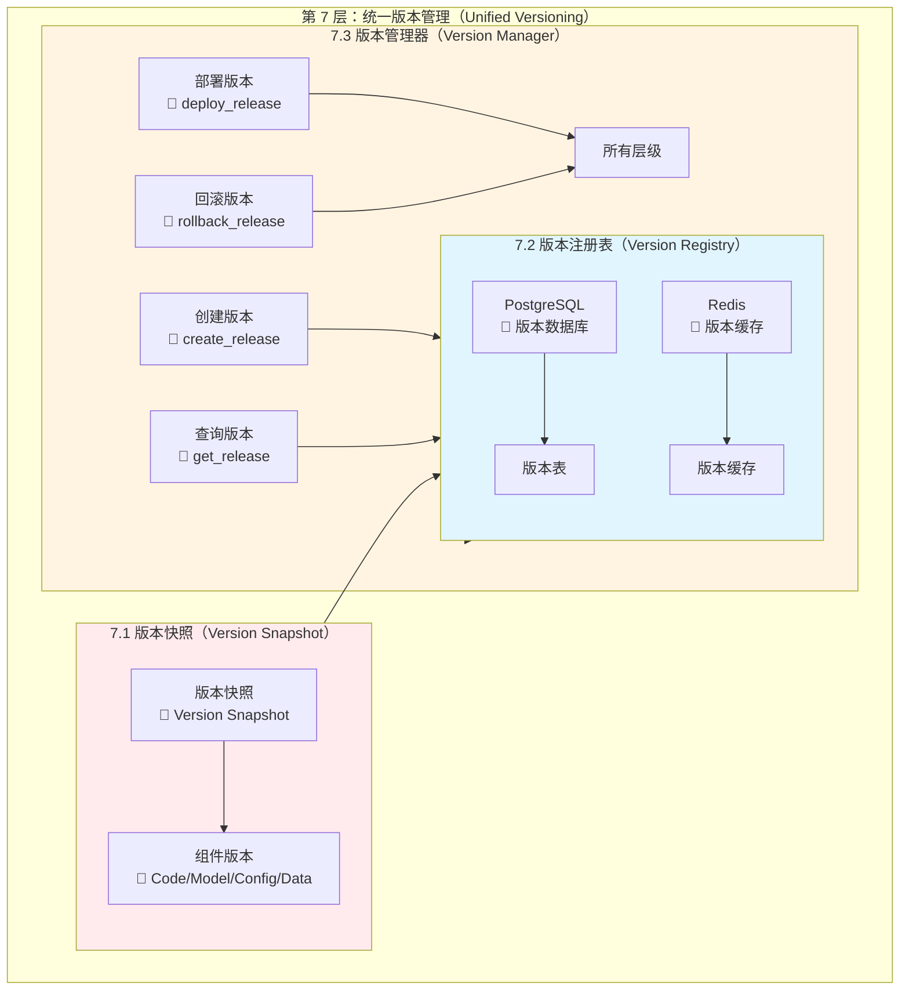

# Day 3_A1_B7_C7：第 7 层 - 统一版本管理详解

**Parent**: [KYC_Day03_A1_B7_测试用例版本管理和结果对比详解.md](./KYC_Day03_A1_B7_测试用例版本管理和结果对比详解.md)  
**层级**: 第 7 层 - 统一版本管理（Unified Versioning）  
**目的**：详细讲解统一版本管理的架构、工具和实践

---

## 🎯 第 7 层：统一版本管理概述

### 核心职责

**统一版本管理负责**：
- ✅ **版本快照管理**：记录某个时间点的所有组件版本
- ✅ **版本关联管理**：关联代码、模型、配置、数据版本
- ✅ **版本注册表管理**：版本信息的集中存储和查询
- ✅ **版本部署管理**：统一部署所有组件版本

---

## 📊 第 7 层架构图（详细版）



---

## 🔧 7.1 版本快照（Version Snapshot）

### 版本快照结构

```python
# 版本快照示例
version_snapshot = {
    "snapshot_id": "snapshot_20250119_100000",
    "release_version": "v1.2.3",
    "timestamp": "2025-01-19T10:00:00Z",
    "created_by": "ml-engineer@example.com",
    "description": "Release v1.2.3: Add new validation rules",
    "components": {
        "code": {
            "git_commit": "abc123def456",
            "git_tag": "v1.2.3",
            "branch": "main",
            "code_path": "s3://code/kyc-service/v1.2.3/"
        },
        "model": {
            "model_id": "kyc_model",
            "model_version": "v1.2.3",
            "model_path": "s3://models/kyc_model/v1.2.3/model.pkl",
            "mlflow_run_id": "run_12345"
        },
        "config": {
            "config_version": "v1.2.3",
            "config_path": "configs/v1.2.3/config.yaml",
            "prompt_version": "v1.2.3",
            "prompt_path": "prompts/v1.2.3/prompt.jinja"
        },
        "data": {
            "golden_set_version": "v1.2.3",
            "golden_set_path": "data/golden_set_v1.2.3.json",
            "training_data_version": "v1.2.3",
            "training_data_path": "s3://data/train/v1.2.3/train.parquet"
        },
        "database": {
            "schema_version": "001",
            "migration_version": "001",
            "database_url": "postgresql://..."
        },
        "dependencies": {
            "requirements_version": "v1.2.3",
            "requirements_path": "requirements_v1.2.3.txt",
            "docker_image": "kyc-service:v1.2.3",
            "docker_image_path": "docker.io/kyc-service:v1.2.3"
        }
    },
    "deployment": {
        "deployed_at": "2025-01-19T10:00:00Z",
        "deployed_by": "devops@example.com",
        "deployment_env": "production",
        "kubernetes_namespace": "production",
        "replicas": 3
    }
}
```

---

## 🗄️ 7.2 版本注册表（Version Registry）

### 数据库设计

```sql
-- 版本注册表
CREATE TABLE version_registry (
    id SERIAL PRIMARY KEY,
    version VARCHAR(50) UNIQUE NOT NULL,
    version_type VARCHAR(20) NOT NULL,  -- 'release', 'snapshot'
    created_at TIMESTAMP NOT NULL,
    created_by VARCHAR(100),
    description TEXT,
    snapshot_data JSONB,  -- 版本快照数据
    is_current BOOLEAN DEFAULT FALSE
);

-- 组件版本关联表
CREATE TABLE component_versions (
    id SERIAL PRIMARY KEY,
    release_version VARCHAR(50) NOT NULL,
    component_type VARCHAR(50) NOT NULL,  -- 'code', 'model', 'config', 'data'
    component_version VARCHAR(50) NOT NULL,
    component_path VARCHAR(500),
    metadata JSONB,
    FOREIGN KEY (release_version) REFERENCES version_registry(version)
);

-- 创建索引
CREATE INDEX idx_component_versions_release ON component_versions(release_version);
CREATE INDEX idx_component_versions_type ON component_versions(component_type);
CREATE INDEX idx_version_registry_current ON version_registry(is_current);
```

---

## 🛠️ 7.3 版本管理器实现

```python
# unified_version_manager.py
from datetime import datetime
from typing import Dict, List, Optional
import json

class UnifiedVersionManager:
    """统一版本管理器"""
    
    def __init__(self, db_session):
        self.db_session = db_session
    
    def create_release(
        self,
        version: str,
        components: Dict,
        description: str = "",
        created_by: str = "system"
    ) -> Dict:
        """创建发布版本"""
        # 1. 创建版本快照
        snapshot = {
            "snapshot_id": f"snapshot_{datetime.now().strftime('%Y%m%d_%H%M%S')}",
            "release_version": version,
            "timestamp": datetime.now().isoformat(),
            "created_by": created_by,
            "description": description,
            "components": components
        }
        
        # 2. 保存到数据库
        version_record = VersionRegistry(
            version=version,
            version_type="release",
            created_at=datetime.now(),
            created_by=created_by,
            description=description,
            snapshot_data=snapshot,
            is_current=False
        )
        
        self.db_session.add(version_record)
        
        # 3. 保存组件版本
        for component_type, component_info in components.items():
            component_version = ComponentVersion(
                release_version=version,
                component_type=component_type,
                component_version=component_info.get("version", ""),
                component_path=component_info.get("path", ""),
                metadata=component_info
            )
            self.db_session.add(component_version)
        
        self.db_session.commit()
        
        return snapshot
    
    def get_release(self, version: str) -> Optional[Dict]:
        """获取发布版本信息"""
        version_record = self.db_session.query(VersionRegistry).filter(
            VersionRegistry.version == version
        ).first()
        
        if version_record:
            return version_record.snapshot_data
        return None
    
    def list_releases(self) -> List[str]:
        """列出所有发布版本"""
        versions = self.db_session.query(VersionRegistry.version).order_by(
            VersionRegistry.created_at.desc()
        ).all()
        return [v[0] for v in versions]
    
    def deploy_release(self, version: str) -> bool:
        """部署指定版本"""
        release = self.get_release(version)
        if not release:
            raise ValueError(f"Version {version} not found")
        
        # 1. 加载所有组件
        config = load_config(release["components"]["config"]["config_path"])
        model = load_model(release["components"]["model"]["model_path"])
        golden_set = load_golden_set(release["components"]["data"]["golden_set_path"])
        
        # 2. 部署服务
        deploy_service(version, config, model, golden_set)
        
        # 3. 更新当前版本
        self.db_session.query(VersionRegistry).update({"is_current": False})
        self.db_session.query(VersionRegistry).filter(
            VersionRegistry.version == version
        ).update({"is_current": True})
        self.db_session.commit()
        
        return True
    
    def rollback_release(self, target_version: str) -> bool:
        """回滚到指定版本"""
        return self.deploy_release(target_version)
```

---

## 📊 第 7 层工具选择矩阵

| 功能 | Python 项目推荐 | 企业项目推荐 | 成本 |
|------|----------------|------------|------|
| **版本注册表** | PostgreSQL | PostgreSQL / Redis | 免费 |
| **版本管理器** | 自定义实现 | 自定义实现 | 开发成本 |

---

## 💡 面试话术

1. ✅ **统一版本管理**：
   - "我们使用**统一版本管理器**管理所有组件的版本。每个发布版本（v1.2.3）都包含一个版本快照，记录代码、模型、配置、数据等所有组件的版本信息。版本信息存储在 PostgreSQL 数据库中，支持版本查询、部署和回滚。"

2. ✅ **版本快照**：
   - "版本快照记录了某个时间点的所有组件版本，包括 Git commit、模型路径、配置文件路径、数据文件路径等。通过版本快照，我们可以精确复现某个版本的完整环境。"

3. ✅ **版本部署**：
   - "版本部署时，版本管理器会加载版本快照中的所有组件版本，确保代码、模型、配置、数据版本的一致性。如果部署失败，可以一键回滚到之前的版本。"

---

## 📝 实施检查清单

- [ ] **版本注册表**：设计数据库表结构
- [ ] **版本管理器**：实现版本管理功能
- [ ] **版本快照**：定义快照数据结构
- [ ] **版本部署**：实现统一部署流程
- [ ] **版本回滚**：实现回滚机制

---

**最后更新**：2025-01-19
