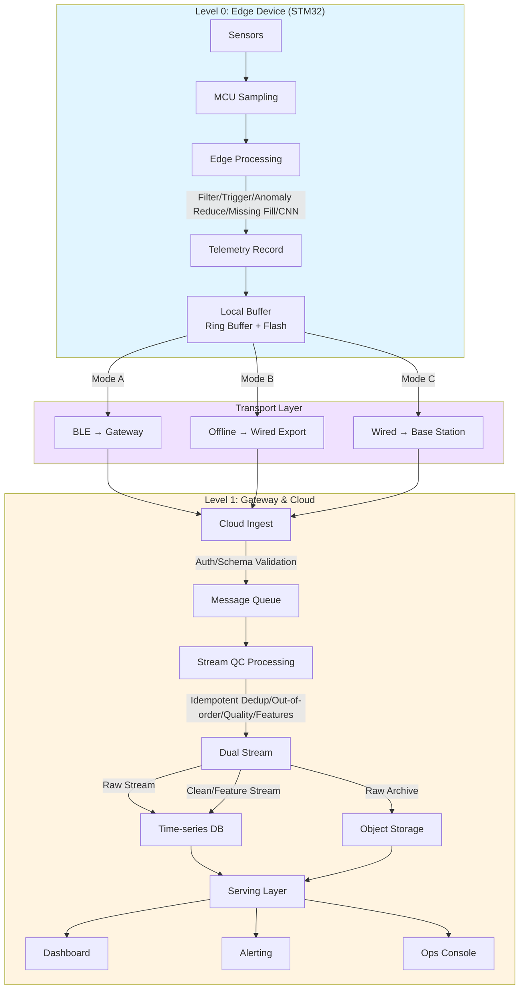

# A01_B01: HydroSense Data Pipeline Flow (Simple English Version)

**Author**: Yanda Cheng  
**Project**: HydroSense IoT Platform  
**Purpose**: Simple, interview-friendly data pipeline overview

---

## Overview

HydroSense Data Pipeline: **Unified Telemetry Record** flows from Edge Device through 3 transport modes (BLE/Offline/Wired) to Cloud, processed and stored for serving.

**One-liner**: Edge generates unified Telemetry → aggregates via BLE gateway/offline export/centralized base station → cloud ingest validates → stream QC deduplicates/annotates/features → raw archive + clean/feature to time-series DB → dashboard/alerting/ops console + offline reporting.

---

## Unified Data Model

### Telemetry Record Schema (All modes share)

```json
{
  "device_id": "DEV001",
  "site_id": "SITE001", 
  "tenant_id": "TENANT001",
  "ts": 1704067200,           // Sampling timestamp
  "seq": 12345,               // Monotonic sequence (idempotency)
  "raw_sensor": {...},        // Raw sensor values
  "edge_clean": {...},        // Edge-cleaned (optional)
  "edge_flags": {             // Edge processing flags
    "trigger": false,
    "abnormal_reduced": false,
    "missing_filled": false,
    "disturbance_removed": true
  },
  "edge_pred": {...},         // Lightweight CNN prediction (optional)
  "fw_version": "v1.2.3",
  "config_version": "v1.0.0",
  "model_version": "v1.0.0",
  "crc": "0xABCD"
}
```

**Key Design**:
- **Unified Schema**: All 3 modes use identical data structure
- **Idempotency**: `(device_id, seq)` as global unique identifier
- **Version Tracking**: fw/config/model versions for OTA and replay validation

---

## Complete Pipeline Architecture

```
┌─────────────────────────────────────────────────────────────────┐
│                    Level 0: Edge Device (STM32)                │
│                    Sensor Node + MCU                            │
└────────────────────────┬────────────────────────────────────────┘
                         │
                         ▼
┌─────────────────────────────────────────────────────────────────┐
│ Step 0: Edge Processing                                        │
│ Sample → Filter → Trigger → Process → Cache → Package          │
└────────────────────────┬────────────────────────────────────────┘
                         │
                         ▼
┌─────────────────────────────────────────────────────────────────┐
│                    [Unified Telemetry Record]                   │
│                    (device_id, seq, ts, data, flags, pred)      │
└────────────────────────┬────────────────────────────────────────┘
                         │
         ┌───────────────┼───────────────┐
         │               │               │
         ▼               ▼               ▼
┌──────────────┐ ┌──────────────┐ ┌──────────────┐
│  Mode A      │ │  Mode B      │ │  Mode C      │
│  BLE →       │ │  Offline →   │ │  Wired →     │
│  Gateway     │ │  Wired Export│ │  Base Station│
└──────┬───────┘ └──────┬───────┘ └──────┬───────┘
       │                │                │
       └───────────────┼────────────────┘
                       │
                       ▼
┌─────────────────────────────────────────────────────────────────┐
│                    Level 1: Gateway & Cloud                   │
└────────────────────────┬────────────────────────────────────────┘
                         │
                         ▼
┌─────────────────────────────────────────────────────────────────┐
│ Step 1: Cloud Ingest                                          │
│ Auth → Schema Validation → Enqueue                              │
└────────────────────────┬────────────────────────────────────────┘
                         │
                         ▼
┌─────────────────────────────────────────────────────────────────┐
│ Step 2: Stream QC / Processing                                │
│ Dedup → Out-of-order → Quality → Features → Dual Stream        │
└────────────────────────┬────────────────────────────────────────┘
                         │
                         ▼
┌─────────────────────────────────────────────────────────────────┐
│ Step 3: Storage                                               │
│ Time-series DB + Object Storage + Metadata DB                   │
└────────────────────────┬────────────────────────────────────────┘
                         │
                         ▼
┌─────────────────────────────────────────────────────────────────┐
│ Step 4: Serving                                               │
│ Dashboard + Alerting + Ops Console                             │
└────────────────────────┬────────────────────────────────────────┘
                         │
                         ▼
┌─────────────────────────────────────────────────────────────────┐
│ Step 5: Offline / Batch (Optional)                           │
│ Reports + Calibration + Training Data                          │
└─────────────────────────────────────────────────────────────────┘
```

---

## Three Transport Modes (Unified)

### Mode A: BLE → Gateway → Cloud (Real-time)

**Flow**:
```
Edge → BLE broadcast/GATT → Gateway scan/receive → Gateway dedup/retry → 
Gateway batch upload (MQTT/HTTP) → Cloud Ingest
```

**Characteristics**:
- Latency: Seconds
- Power: Low-power BLE
- Use case: Networked environment, real-time monitoring

---

### Mode B: Offline Storage → Wired Export → Cloud (Batch)

**Flow**:
```
Edge → Flash storage (append by seq) → Maintenance personnel connect → 
Base Station/PC read watermark → Incremental fetch (FETCH_RANGE) → 
Export file (CSV/Parquet) → Upload to cloud → Cloud Ingest
```

**Characteristics**:
- Latency: Batch export every few months
- Reliability: Wired connection, physical determinism
- Use case: Extreme low-power, no network, long maintenance cycles

---

### Mode C: Multi-Device Wired → Base Station → Cloud (Centralized)

**Flow**:
```
Multiple Edge devices → Wired connection (serial/USB/RS485) → 
Base Station concurrent collection → Base Station dedup/aggregate → 
Base Station batch upload → Cloud Ingest
```

**Characteristics**:
- Efficiency: Batch operations, site-level unified management
- Reliability: Wired connection, physical determinism
- Use case: Centralized deployment, unified power supply, easy ops

---

## Key Unification Points

**Regardless of A/B/C, cloud sees the same Telemetry Record stream**:

1. **Unified Data Model**: All modes use identical Telemetry Record Schema
2. **Unified Idempotency**: `(device_id, seq)` as global unique identifier
3. **Unified Watermark**: Supports incremental sync, resume from checkpoint
4. **Unified Compression/Validation**: Same compression algorithm and CRC
5. **Unified Cloud Processing**: Cloud Ingest → Stream QC → Storage → Serving

---

## Resume Bullet Points

**3 resume sentences (system + data pipeline focus)**:

1. **Designed and implemented a unified data pipeline for multi-tenant IoT platform supporting 3 deployment modes (BLE real-time, offline batch, wired aggregation) with unified Telemetry Record schema, ensuring idempotent ingestion via (device_id, seq) and incremental sync via watermark mechanism.**

2. **Built end-to-end stream processing pipeline: Edge device (STM32) performs sensor sampling, filtering, anomaly reduction, missing value imputation, and lightweight CNN prediction; Gateway/Base Station aggregates and deduplicates; Cloud performs schema validation, idempotent deduplication, quality annotation, and feature derivation; Dual-write to time-series DB (clean/feature) and object storage (raw) for traceability.**

3. **Implemented multi-layer storage architecture: Time-series DB for dashboard queries and alerting, Object Storage for raw archival and model training data preparation, Metadata DB for device/tenant management and OTA campaigns, supporting real-time visualization, batch reporting, and model replay validation.**

---

## Architecture Diagram (Mermaid)



---

**Document Version**: v1.0  
**Last Updated**: 2025-01
