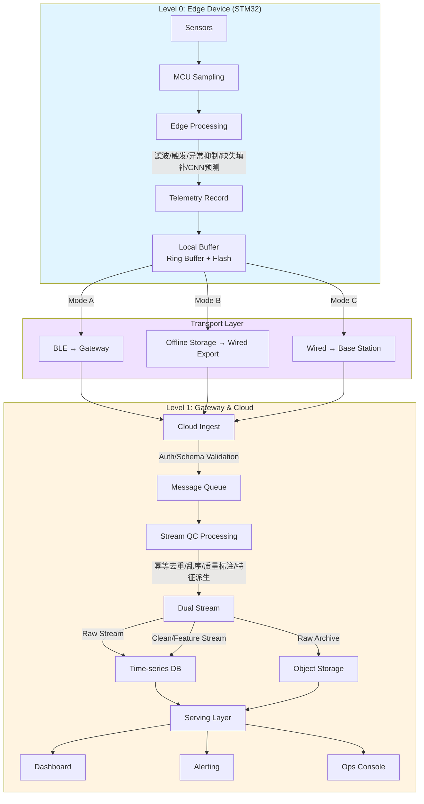

# A01: HydroSense Data Pipeline Flow
# HydroSense 统一数据管道架构图

**作者**：Yanda Cheng  
**项目**：HydroSense IoT Platform  
**设计风格**：参考 rad-linter A01 和 KYC 项目风格

---

## 📋 目录

1. [Pipeline 概览](#pipeline-概览)
2. [统一数据模型](#统一数据模型)
3. [完整 Pipeline 架构图](#完整-pipeline-架构图)
4. [Level 0: Edge Device（端侧）](#level-0-edge-device端侧)
5. [Level 1: Gateway & Cloud（网关与云端）](#level-1-gateway--cloud网关与云端)
6. [三种传输模式统一](#三种传输模式统一)
7. [面试一句话总结](#面试一句话总结)

---

## Pipeline 概览

HydroSense Data Pipeline 是从传感器采样到云端分析的端到端数据流转，采用**统一数据模型 + 多路径传输**的设计，支持三种部署模式（BLE 实时、离线批处理、集中式汇聚）无缝切换。

```
Level 0: Edge Device (STM32)
    ↓
    [统一 Telemetry Record]
    ↓
Level 1: Gateway & Cloud
    ├── Mode A: BLE → Gateway → Cloud (实时)
    ├── Mode B: 离线存储 → 有线导出 → Cloud (批处理)
    └── Mode C: 多设备有线 → Base Station → Cloud (集中式)
    ↓
Cloud Processing → Storage → Serving
```

---

## 统一数据模型

### Telemetry Record Schema（所有模式共用）

```json
{
  "device_id": "DEV001",
  "site_id": "SITE001",
  "tenant_id": "TENANT001",
  
  "ts": 1704067200,           // 采样时间戳
  "seq": 12345,               // 单调递增序号（幂等性保证）
  
  "raw_sensor": {             // 原始传感器值
    "temperature": 25.3,
    "humidity": 60.5,
    "rainfall": 0.0,
    "wind_speed": 2.1
  },
  
  "edge_clean": {             // 端侧清洗后（可选）
    "temperature": 25.3,
    "humidity": 60.5
  },
  
  "edge_flags": {             // 端侧处理标志
    "trigger": false,         // 事件触发
    "abnormal_reduced": false, // 异常抑制
    "missing_filled": false,   // 缺失填补
    "disturbance_removed": true // 扰动去除
  },
  
  "edge_pred": {              // 轻量 CNN 预测（可选）
    "rainfall_pred": 0.0,
    "confidence": 0.85
  },
  
  "fw_version": "v1.2.3",      // 固件版本
  "config_version": "v1.0.0", // 配置版本
  "model_version": "v1.0.0",  // 模型版本
  
  "crc": "0xABCD"             // 完整性校验
}
```

**关键设计点**：
- **统一 Schema**：A/B/C 三种模式使用完全相同的数据结构
- **幂等性保证**：`(device_id, seq)` 作为全局唯一标识
- **版本追踪**：fw/config/model 版本用于 OTA 和回放验证

---

## 完整 Pipeline 架构图

### 主流程图（统一 A/B/C 三种模式）

```
┌─────────────────────────────────────────────────────────────────┐
│                    Level 0: Edge Device (STM32)                │
│                    Sensor Node + MCU                            │
└────────────────────────┬────────────────────────────────────────┘
                         │
                         ▼
┌─────────────────────────────────────────────────────────────────┐
│ Step 0: Edge Processing                                         │
│ • 采样：传感器 → MCU                                            │
│ • 端侧处理：滤波/抗扰动 → trigger → abnormal reduce →         │
│   missing fitting → (可选) CNN predict                         │
│ • 写本地缓存：按 seq 追加到 flash ring buffer                  │
│ • 打包：Telemetry Record（统一格式）                           │
└────────────────────────┬────────────────────────────────────────┘
                         │
                         ▼
┌─────────────────────────────────────────────────────────────────┐
│                    [统一 Telemetry Record]                      │
│                    (device_id, seq, ts, data, flags, pred)      │
└────────────────────────┬────────────────────────────────────────┘
                         │
         ┌───────────────┼───────────────┐
         │               │               │
         ▼               ▼               ▼
┌──────────────┐ ┌──────────────┐ ┌──────────────┐
│  Mode A      │ │  Mode B      │ │  Mode C      │
│  BLE →       │ │  离线存储 →  │ │  多设备有线 →│
│  Gateway     │ │  有线导出    │ │  Base Station│
└──────┬───────┘ └──────┬───────┘ └──────┬───────┘
       │                │                │
       └───────────────┼────────────────┘
                       │
                       ▼
┌─────────────────────────────────────────────────────────────────┐
│                    Level 1: Gateway & Cloud                   │
│                    Cloud Ingest                                 │
└────────────────────────┬────────────────────────────────────────┘
                         │
                         ▼
┌─────────────────────────────────────────────────────────────────┐
│ Step 1: Cloud Ingest                                           │
│ • Auth & Tenant routing：设备/基站身份校验；按 tenant/site 路由│
│ • Schema 校验：字段、类型、ts 合理性、crc                       │
│ • 进入队列：写入消息队列/流（解耦峰值）                        │
└────────────────────────┬────────────────────────────────────────┘
                         │
                         ▼
┌─────────────────────────────────────────────────────────────────┐
│ Step 2: Stream QC / Processing                                │
│ • 幂等去重：(device_id, seq)                                   │
│ • 乱序容忍：按小窗口排序                                       │
│ • 质量标注：缺失、异常、疑似故障、延迟、漂移                   │
│ • 派生特征：滑窗均值/方差、累计雨量、雨强等                    │
│ • 产出两条流：Raw Stream（追溯）+ Clean/Feature Stream（看板）│
└────────────────────────┬────────────────────────────────────────┘
                         │
                         ▼
┌─────────────────────────────────────────────────────────────────┐
│ Step 3: Storage（分层存储）                                    │
│ • Time-series DB：Clean/Feature（支撑看板查询、聚合）          │
│ • Object Storage：Raw 存档、离线导出文件、日志、固件包          │
│ • Metadata DB：设备/站点/租户、版本、配置、watermark、告警规则│
└────────────────────────┬────────────────────────────────────────┘
                         │
                         ▼
┌─────────────────────────────────────────────────────────────────┐
│ Step 4: Serving（产品层）                                      │
│ • Dashboard / Visualization：按 site/device 时间范围查询       │
│   （支持 downsample：分钟/小时/天）                            │
│ • Alerting：离线、异常雨强、长期缺失、漂移等 → 通知            │
│ • Ops Console：设备状态、最后在线、数据缺口、固件版本分布      │
└────────────────────────┬────────────────────────────────────────┘
                         │
                         ▼
┌─────────────────────────────────────────────────────────────────┐
│ Step 5: Offline / Batch（可选）                                │
│ • 日报/月报聚合（站点级统计、质量报告）                         │
│ • 校准与回放（用 raw 回放验证端侧算法/模型）                    │
│ • 为后续模型训练准备数据集（从 raw/clean 抽取）               │
└─────────────────────────────────────────────────────────────────┘
```

---

## Level 0: Edge Device（端侧）

### 核心职责

**Step 0: Edge Processing**

1. **采样阶段**
   - 传感器硬件信号（ADC 值）→ MCU
   - 多传感器采集（温度、湿度、雨量、风速等）

2. **端侧处理链**
   ```
   原始采样 → 去抖/滤波 → 温漂补偿 → 单位转换
        ↓
   事件触发（trigger）：阈值/变化率/模式匹配
        ↓
   异常抑制（abnormal reduce）：滑动窗口统计、3-sigma
        ↓
   缺失填补（missing fitting）：线性插值/历史均值
        ↓
   扰动去除（disturbance removal）：频域滤波/自适应滤波
        ↓
   (可选) CNN 预测：轻量模型推理（< 100KB，< 100ms）
   ```

3. **本地缓存**
   - **Ring Buffer（内存）**：最近 1000 条，快速访问
   - **Flash（持久化）**：按 seq 追加，分段存储（每天/每周一个 chunk）
   - **Watermark 管理**：记录已同步的 max_seq

4. **打包**
   - 组装 Telemetry Record（统一格式）
   - 添加 seq、ts、crc
   - 压缩（可选）

5. **等待传输**
   - 根据可用链路选择：BLE（Mode A）或有线导出（Mode B/C）

**关键设计点**：
- **统一数据格式**：无论哪种传输模式，数据包结构完全一致
- **幂等性保证**：每条记录带 `(device_id, seq)`，云端可去重
- **断网容错**：本地缓存 + watermark，支持断点续传

---

## Level 1: Gateway & Cloud（网关与云端）

### Step 1: Cloud Ingest（云端接入层）

**职责**：
- **Auth & Tenant routing**：设备/基站身份校验（证书/密钥）；按 tenant/site 路由
- **Schema 校验**：字段完整性、类型检查、ts 合理性（不能太旧/太新）、crc 校验
- **进入队列**：写入消息队列/流（Kafka/RabbitMQ），解耦峰值流量

**输出**：验证通过的数据包 + 路由信息

---

### Step 2: Stream QC / Processing（实时质量控制）

**对每条记录做轻量处理**：

1. **幂等去重**
   - 提取 `(device_id, seq)`
   - 查询去重表（Redis，TTL = 24 小时）
   - 已存在 → 丢弃；不存在 → 写入去重表 → 输出

2. **乱序容忍**
   - 按小窗口排序（±5 分钟）
   - 超窗口数据标记为"延迟数据"（不丢弃，用于追溯）

3. **质量标注**
   - 缺失检测：seq 不连续 → 标记缺失区间
   - 异常检测：传感器值超出合理范围
   - 延迟统计：ts 与接收时间的差值
   - 漂移检测：长期趋势异常

4. **派生特征**
   - 滑窗统计：1 分钟窗口（mean, std, min, max）
   - 累计雨量：累计计算
   - 雨强计算：瞬时雨强

**产出两条数据流**：
- **Raw Stream**：尽量原样（用于追溯、回放验证）
- **Clean/Feature Stream**：清洗后 + 特征（用于看板/告警/分析）

---

### Step 3: Storage（分层存储）

**三件套存储**：

1. **Time-series DB**（如 InfluxDB/TimescaleDB）
   - 存储：Clean/Feature Stream
   - 用途：支撑看板查询、聚合、告警
   - 分区：按 tenant/site/device + 时间分区

2. **Object Storage**（如 S3/OSS）
   - 存储：Raw 存档、离线导出文件、日志、固件包
   - 用途：长期归档、回放验证、模型训练数据准备

3. **Metadata DB**（如 PostgreSQL）
   - 存储：设备/站点/租户信息、版本、配置、watermark、告警规则
   - 用途：设备管理、OTA、配置下发

---

### Step 4: Serving（产品层）

1. **Dashboard / Visualization**
   - 查询接口：按 site/device 时间范围查询
   - 支持 downsample：分钟/小时/天（减少数据传输）
   - 实时更新：WebSocket 推送

2. **Alerting**
   - 告警规则：离线、异常雨强、长期缺失、漂移等
   - 通知渠道：短信/邮件/企业微信
   - 告警去重：相同告警在 N 分钟内只发送一次

3. **Ops Console**
   - 设备状态：在线/离线、健康度、最后在线时间
   - 数据缺口：缺失 seq 区间、数据质量统计
   - 固件版本分布：版本升级进度、回滚状态

---

### Step 5: Offline / Batch（可选但很好讲）

1. **日报/月报聚合**
   - 站点级统计：平均温度/湿度、总雨量、设备健康度
   - 质量报告：缺失率、异常率、延迟统计

2. **校准与回放**
   - 用 Raw Stream 回放验证端侧算法/模型
   - 对比端侧预测 vs 云端重模型预测
   - 生成校准参数

3. **模型训练数据准备**
   - 从 Raw/Clean Stream 抽取训练数据集
   - 特征工程、数据增强
   - 生成训练/验证/测试集

---

## 三种传输模式统一

### Mode A：BLE → Gateway → Cloud（实时/准实时）

**流程**：
```
Edge → BLE 广播/GATT → Gateway 扫描接收 → Gateway 去重/补传 → 
Gateway 批量上传（MQTT/HTTP）→ Cloud Ingest
```

**特点**：
- 实时性：秒级延迟
- 功耗：低功耗 BLE
- 适用场景：有网环境，需要实时监控

---

### Mode B：离线存储 → 有线导出 → Cloud（批处理）

**流程**：
```
Edge → Flash 存储（按 seq 追加）→ 维护人员接线 → 
Base Station/PC 读取 watermark → 增量拉取（FETCH_RANGE）→ 
导出文件（CSV/Parquet）→ 上传云端 → Cloud Ingest
```

**特点**：
- 延迟：几个月一次批量导出
- 可靠性：有线连接，物理确定性
- 适用场景：极端低功耗、无网、维护周期长

---

### Mode C：多设备有线 → Base Station → Cloud（集中式）

**流程**：
```
多设备 Edge → 有线连接（串口/USB/RS485）→ Base Station 并发采集 → 
Base Station 去重/聚合 → Base Station 批量上传 → Cloud Ingest
```

**工业协议支持**：
- 硬件终端（RTU - Remote Terminal Unit）通过 Modbus RTU（串口）或 Modbus TCP（以太网）通信
- Base Station 读取 Modbus 寄存器并转换为统一 Telemetry Record
- 支持 Modbus RTU/TCP 工业协议，便于集成现有工业设备

**特点**：
- 效率：批量操作，站点级统一管理
- 可靠性：有线连接，物理确定性
- 适用场景：集中部署、统一供电、便于运维、工业环境集成

---

### 统一关键点

**无论 A/B/C，云端看到的都是同一种 Telemetry Record 流**：

1. **统一数据模型**：所有模式使用相同的 Telemetry Record Schema
2. **统一幂等机制**：`(device_id, seq)` 作为全局唯一标识
3. **统一 Watermark 机制**：支持增量同步、断点续传
4. **统一压缩/校验**：相同的数据压缩算法和 CRC 校验
5. **统一云端处理**：Cloud Ingest → Stream QC → Storage → Serving

---

## 面试一句话总结

**Edge 生成统一 Telemetry → 通过 BLE 网关/离线导出/集中基站三种方式汇聚 → 云端接入校验进队列 → 流式 QC 去重/标注/特征 → raw 存档 + clean/feature 入时序库 → 看板/告警/运维与离线报表。**

---

## 简历 Bullet Points（英文版）

**3 条简历句子（偏 system + data pipeline）**：

1. **Designed and implemented a unified data pipeline for multi-tenant IoT platform supporting 3 deployment modes (BLE real-time, offline batch, wired aggregation) with unified Telemetry Record schema, ensuring idempotent ingestion via (device_id, seq) and incremental sync via watermark mechanism.**

2. **Built end-to-end stream processing pipeline: Edge device (STM32) performs sensor sampling, filtering, anomaly reduction, missing value imputation, and lightweight CNN prediction; Gateway/Base Station aggregates and deduplicates; Cloud performs schema validation, idempotent deduplication, quality annotation, and feature derivation; Dual-write to time-series DB (clean/feature) and object storage (raw) for traceability.**

3. **Implemented multi-layer storage architecture: Time-series DB for dashboard queries and alerting, Object Storage for raw archival and model training data preparation, Metadata DB for device/tenant management and OTA campaigns, supporting real-time visualization, batch reporting, and model replay validation.**

---

## 架构图（Mermaid）



---

**文档版本**：v1.0  
**最后更新**：2025-01
