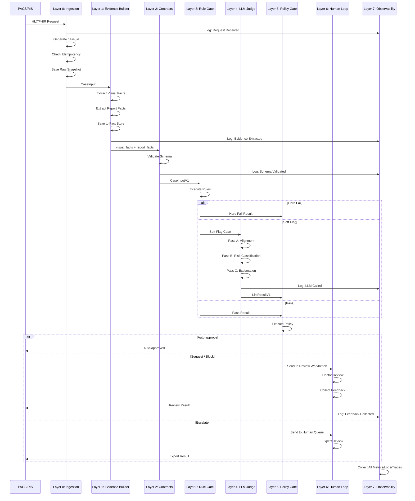

# Rad-Linter 工业级系统设计
# Rad-Linter Production-Grade System Design

**作者**：Yanda Cheng  
**项目链接**：https://github.com/Nickcp39/rad_linter  
**创建日期**：2025-01  
**设计原则**：借鉴 KYC 项目的工业级设计模式

---

## 📋 目录

1. [Rad-Linter 工业级目标（核心 KPI）](#0-rad-linter-工业级目标核心-kpi)
2. [总体分层架构（7层设计）](#1-总体分层架构7层设计)
3. [数据对象设计](#2-数据对象设计)
4. [工程服务拆分](#3-工程服务拆分)
5. [评估与上线策略](#4-评估与上线策略)
6. [复用的 KYC 设计原则](#5-复用的-kyc-设计原则)
7. [时序图与数据流](#6-时序图与数据流)

---

## 0. Rad-Linter 工业级目标（核心 KPI）

### 核心 KPI（上线要盯住）

Rad-Linter 系统的工业级目标需要在四个维度达到严格标准：

#### Safety（安全性）：高风险错误漏检率要极低

**定义**：
- **高风险错误类型**：
  - 遗漏（Omission）：影像中发现但报告中未提及的关键发现
  - 矛盾（Contradiction）：影像证据与报告文本矛盾
  - 左右侧（Laterality）：左右侧识别错误
  - 关键测量（Critical Measurement）：关键测量值错误或缺失

**目标指标**：
- **高风险错误漏检率 < 1%**（Critical）
- **中等风险错误漏检率 < 5%**（Important）
- **低风险错误检出率 > 80%**（Nice to have）

**SLO（Service Level Objective）**：
- 高风险错误（Laterality 错误、关键遗漏）：漏检率 < 0.5%
- 中等风险错误（测量不一致、描述不准确）：漏检率 < 2%
- 低风险错误（格式问题、建议性描述）：检出率 > 80%

**告警阈值**：
- 高风险错误漏检率 > 1% → 立即告警，触发人工复核
- 高风险错误漏检率 > 0.5% → 警告，需要调查根因

#### Automation Rate（自动化率）：自动放行比例（不过度打扰医生）

**定义**：
- **自动放行率**：系统判定无风险或低风险，自动放行的案例占比
- **人工复核率**：系统判定高风险或不确定，需要人工复核的案例占比
- **拦截率**：系统判定高风险，阻止医生签字的案例占比

**目标指标**：
- **自动放行率 > 85%**（核心目标）
- **人工复核率 < 10%**（控制成本）
- **拦截率 < 5%**（避免过度打扰）

**业务考量**：
- 医院环境对稳定性要求极高，不能频繁打扰医生工作流程
- 过度拦截会导致医生对系统失去信任
- 需要在 Safety 和 Automation Rate 之间找平衡

**Error Budget Policy**：
- 如果 Automation Rate < 80%，暂停新功能发布，专注优化规则阈值
- 如果拦截率 > 5%，降低部分规则的严格程度

#### Latency（延迟）：P95/P99（医院端更看稳定性，不只平均）

**定义**：
- **端到端延迟**：从 PACS/RIS 接收到输出结果的时间
- **关键路径延迟**：Evidence Builder → Rule Gate → LLM Judge → Policy Gate

**目标指标**：
- **P50 < 3 秒**（中位数）
- **P95 < 8 秒**（SLO 目标）
- **P99 < 15 秒**（Critical 不能超过）
- **P99.9 < 30 秒**（极端情况）

**延迟组成分析**：
```
端到端延迟分解：
├─ Ingestion（L0）: 100-200ms
├─ Evidence Builder（L1）: 1-3s
│  ├─ Visual Feature Extraction: 0.5-2s
│  └─ Report Parsing: 0.5-1s
├─ Contracts（L2）: 50-100ms
├─ Rule Gate（L3）: 10-50ms
├─ LLM Judge（L4）: 2-8s（主要延迟来源）
│  ├─ API Call: 2-6s
│  ├─ Retry（如有）: 0-2s
│  └─ Fallback（如有）: 0-1s
├─ Policy Gate（L5）: 10-50ms
└─ Output（L6/L7）: 20-50ms

总延迟: ~4-12s (P95)
```

**设计原则**：
- **异步处理**：Evidence Builder 可以异步执行
- **缓存策略**：相似报告复用 Evidence，减少重复计算
- **并行处理**：Visual Feature Extraction 和 Report Parsing 可以并行
- **超时控制**：LLM Judge 设置超时，避免阻塞

#### Auditability（可审计性）：每条结论可追溯

**定义**：
- **可追溯性**：每条结论都能追溯到原始证据、使用的规则、模型版本、输入输出
- **可重放性**：给定 case_id，能够完全重现处理过程
- **可审计性**：能够审计每条决策是否符合规范和标准

**目标指标**：
- **Auditability 覆盖率：100%**（所有结论都有完整追溯链）
- **可重放率：100%**（所有案例都能完全重放）
- **审计日志完整性：100%**（所有关键步骤都有日志记录）

**追溯信息**：
- **证据引用**：visual_facts 的 fact_id、report_facts 的 span_ref
- **规则依据**：触发的规则 ID、规则版本、规则输出
- **模型版本**：LLM Judge 模型版本、prompt 版本、推理参数
- **输入输出**：原始输入 hash、输出结果、中间状态
- **时间戳**：每个步骤的执行时间、处理耗时

**设计原则**：
- **版本化**：所有组件（模型、规则、Schema）都有版本号
- **不可变性**：输入和中间结果不可修改，只能追加
- **完整链路**：从输入到输出的完整调用链都有 trace

---

## 1. 总体分层架构（7层设计）

### 架构概览

Rad-Linter 系统采用 7 层分层架构，每一层职责单一、边界清晰，借鉴 KYC 项目的设计模式：

```
┌─────────────────────────────────────────────────────────────────┐
│                    PACS / RIS / Report System                   │
│                    (HL7/FHIR / Internal API)                    │
└────────────────────────┬────────────────────────────────────────┘
                         │
                         ▼
┌─────────────────────────────────────────────────────────────────┐
│ Layer 0: Ingestion（数据接入层）                                │
│ • 异步队列化 + 幂等                                              │
│ • case_id 生成 + 原始输入快照                                    │
└────────────────────────┬────────────────────────────────────────┘
                         │
                         ▼
┌─────────────────────────────────────────────────────────────────┐
│ Layer 1: Evidence Builder（证据构建层）                         │
│ • Visual Facts Extraction（图像→结构化事实）                     │
│ • Report Facts Extraction（报告→结构化事实）                     │
│ • Fact Store（版本化证据存储）                                   │
└────────────────────────┬────────────────────────────────────────┘
                         │
                         ▼
┌─────────────────────────────────────────────────────────────────┐
│ Layer 2: Contracts（强契约层，Schema-first）                     │
│ • Input Schema: CaseInputV1                                     │
│ • Output Schema: LintResultV1                                  │
│ • Pydantic / JSON Schema 严格校验                                │
└────────────────────────┬────────────────────────────────────────┘
                         │
                         ▼
┌─────────────────────────────────────────────────────────────────┐
│ Layer 3: Rule Gate（规则闸门层）                                │
│ • 确定性规则先行（Laterality、Measurement、Negation）            │
│ • 输出：Hard Fail / Soft Flag / Pass                            │
└──────┬───────────────────────┬──────────────────────────────────┘
       │                       │
       ▼                       ▼
┌──────────────┐    ┌──────────────────────────────────────────────┐
│ Hard Fail    │    │ Soft Flag → Layer 4: LLM Judge              │
│ (直接拦截)   │    │ Pass → Layer 5: Policy Gate                 │
└──────────────┘    └──────────────────────────────────────────────┘
                         │
                         ▼
┌─────────────────────────────────────────────────────────────────┐
│ Layer 4: LLM Judge（模型判决层）                                │
│ • 多通道判决：Pass A（对齐）→ Pass B（分级）→ Pass C（解释）     │
│ • Bounded Retry + Fallback + Diversity                          │
└────────────────────────┬────────────────────────────────────────┘
                         │
                         ▼
┌─────────────────────────────────────────────────────────────────┐
│ Layer 5: Policy Gate（策略层）                                  │
│ • Auto-approve / Suggest edit / Block sign-off / Escalate       │
└──────┬──────────────────────────────────────────────┬───────────┘
       │                                              │
       ▼                                              ▼
┌──────────────────────────────┐    ┌─────────────────────────────────┐
│ Layer 6: Human-in-the-loop   │    │ Layer 7: Observability & Audit │
│ • 人工复核工作台                                              │
│ • 反馈回流机制                                                │
└──────────────────────────────┘    └─────────────────────────────────┘
```

### Layer 0: Ingestion（数据接入层）

#### 职责（Responsibility）

- **数据接入**：从 PACS、RIS、报告系统接收数据
- **数据标准化**：统一数据格式和结构
- **幂等处理**：确保同一检查不会重复处理
- **原始快照**：保存原始输入用于审计重放

#### 组件（Components）

- **Ingestion Service**（数据接入服务）
  - HTTP API 接口（接收 HL7/FHIR 或内部 API 调用）
  - 消息队列（异步处理，支持 RabbitMQ / Kafka）
  - 幂等性检查（通过 case_id 或检查唯一标识）
  - 原始输入快照（保存原始 DICOM / 报告文本）

#### 关键特性（Key Features）

- **异步处理**：使用消息队列，避免阻塞上游系统
- **幂等保证**：同一检查多次接收只处理一次
- **数据完整性**：保存原始输入，支持后续审计
- **错误隔离**：单个案例失败不影响其他案例

#### 设计原则（Design Principles）

- **薄层设计**：只负责数据接入，不做业务逻辑处理
- **可观测性**：记录所有接入请求和状态
- **容错设计**：接收失败时的重试和告警机制

#### 与其他 Layer 的交互

- **输入**：PACS/RIS/Report System（DICOM、HL7、FHIR、内部 API）
- **输出**：标准化的 CaseInput 发送到 Layer 1
- **依赖**：消息队列、存储系统（保存原始快照）

---

### Layer 1: Evidence Builder（证据构建层）⭐ **核心护城河**

#### 职责（Responsibility）

**关键点**：先把"图像"变成"可核验事实"，否则 LLM 只能胡猜。

- **视觉证据提取**：从医学影像中提取结构化视觉事实
- **文本证据提取**：从报告中提取结构化文本事实
- **证据版本化**：将证据存储在 Fact Store 中，支持版本化和重放

#### 组件（Components）

##### 1. Visual Facts Extraction（视觉证据提取）

**输入**：DICOM 影像（X-ray、CT、MRI 等）

**输出**：`visual_facts.jsonl`（结构化视觉事实）

**关键能力**：
- **检测/分割**：检测病变区域、解剖结构
- **测量**：自动测量尺寸、面积、体积
- **分类**：病变类型（结节、积液、骨折等）
- **Laterality**：左右侧识别
- **位置定位**：解剖区域定位（肺上叶、右心室等）
- **置信度**：每个事实的置信度分数

**实现方式**：
- **TorchXRayVision**：预训练医学影像分析模型
- **自定义检测模型**：针对特定病变类型的检测器
- **图像处理**：预处理、增强、标准化

**输出格式**：
```json
{
  "fact_id": "vf_001",
  "type": "effusion",
  "laterality": "left",
  "location": "pleural_space",
  "attributes": {
    "size": "large",
    "severity": "moderate",
    "confidence": 0.95
  },
  "evidence_refs": {
    "screenshot_index": "img_001",
    "mask_version": "v1.0",
    "measurement_source": "auto_detection"
  }
}
```

##### 2. Report Facts Extraction（文本证据提取）

**输入**：报告文本（结构化或非结构化）

**输出**：`report_facts.jsonl`（结构化文本事实）

**关键能力**：
- **实体识别**：提取疾病、解剖结构、测量值等实体
- **关系抽取**：实体间的关系（位置、严重程度等）
- **否定识别**：识别否定表达（"no effusion"）
- **时间信息**：提取时间相关描述
- **测量值**：提取数值、单位、范围

**实现方式**：
- **NER 模型**：命名实体识别
- **关系抽取模型**：实体关系抽取
- **规则引擎**：基于规则的后处理

**输出格式**：
```json
{
  "fact_id": "rf_001",
  "span_ref": {
    "start": 120,
    "end": 135,
    "text": "left pleural effusion"
  },
  "entity": "effusion",
  "laterality": "left",
  "location": "pleural",
  "attributes": {
    "severity": "moderate",
    "negation": false
  }
}
```

##### 3. Fact Store（证据存储）

**设计目的**：版本化存储证据，支持重跑和对比

**关键特性**：
- **版本化**：每个证据都有版本号
- **不可变性**：证据一旦存储不可修改
- **可追溯性**：能够追溯证据的生成过程
- **可对比性**：能够对比不同版本的证据

**存储结构**：
```
fact_store/
├── visual_facts/
│   ├── {case_id}/
│   │   ├── v1.0/
│   │   │   └── visual_facts.jsonl
│   │   └── v1.1/
│   │       └── visual_facts.jsonl
└── report_facts/
    └── {case_id}/
        ├── v1.0/
        │   └── report_facts.jsonl
        └── v1.1/
            └── report_facts.jsonl
```

#### 关键特性（Key Features）

- **结构化输出**：所有证据都是结构化格式，便于后续处理
- **版本化管理**：支持证据版本化，便于重跑和对比
- **可观测性**：记录证据提取过程和质量指标
- **容错设计**：提取失败时的降级策略

#### 设计原则（Design Principles）

- **证据优先**：先提取证据，再基于证据进行判断
- **可审计性**：所有证据都有明确的来源和置信度
- **可扩展性**：易于添加新的证据提取方法
- **模块化**：视觉和文本证据提取相互独立

#### 工业级落地要点

**这是护城河**：Evidence Builder 把任务从"生成式"变成"核验式"。

- **生成式**（传统方法）：
  - LLM 直接看图像和文本，生成判断
  - 不可控、不可审计、性能不稳定

- **核验式**（工业级方法）：
  - 先把图像和文本转换成结构化事实
  - 基于事实进行对齐和核验
  - 可控、可审计、性能稳定

#### 与其他 Layer 的交互

- **输入**：从 Layer 0 接收标准化的 CaseInput
- **输出**：visual_facts 和 report_facts 发送到 Layer 2
- **依赖**：TorchXRayVision 模型、NER 模型、Fact Store

---

### Layer 2: Contracts（强契约层，Schema-first）

#### 职责（Responsibility）

**与 KYC 项目的 Schema-first 设计完全一致**

- **输入契约**：定义标准化的输入 Schema
- **输出契约**：定义标准化的输出 Schema
- **严格校验**：使用 Pydantic / JSON Schema 进行严格校验

#### 组件（Components）

##### 1. Input Schema: CaseInputV1

**定义**：标准化的案例输入格式

```python
from pydantic import BaseModel, Field
from typing import List, Optional
from datetime import datetime

class VisualFact(BaseModel):
    fact_id: str
    type: str  # lesion / effusion / fracture / vessel / ...
    laterality: Optional[str]  # left / right / bilateral
    location: Optional[str]
    attributes: dict
    evidence_refs: dict

class ReportFact(BaseModel):
    fact_id: str
    span_ref: dict  # {start, end, text}
    entity: str
    laterality: Optional[str]
    location: Optional[str]
    attributes: dict

class CaseInputV1(BaseModel):
    case_id: str
    patient_id: str  # 脱敏ID
    exam_type: str  # X-ray / CT / MRI / ...
    report_text: str
    visual_facts: List[VisualFact]
    report_facts: List[ReportFact]
    metadata: dict
    timestamp: datetime
    version: str = "v1.0"
```

##### 2. Output Schema: LintResultV1

**定义**：标准化的检查结果格式

```python
class LintItem(BaseModel):
    issue_type: str  # laterality_mismatch / omission / contradiction / measurement_inconsistent / ...
    severity: str  # high / med / low
    supporting_facts: List[str]  # fact_id 列表
    report_spans: List[dict]  # span_ref 列表
    recommended_action: str  # block / suggest / review
    confidence: float
    explanation: str  # 可审计的解释，引用 fact_id

class LintResultV1(BaseModel):
    case_id: str
    status: str  # pass / flag / fail
    items: List[LintItem]
    summary: dict
    metadata: dict
    version: str = "v1.0"
    timestamp: datetime
```

#### 关键特性（Key Features）

- **类型安全**：Pydantic 提供类型检查
- **自动验证**：自动验证字段类型、必填字段、格式
- **版本管理**：支持 Schema 版本化
- **向后兼容**：新版本 Schema 保持向后兼容

#### 设计原则（Design Principles）

- **Schema-first**：先定义 Schema，再实现逻辑
- **严格校验**：不符合 Schema 的输入直接拒绝
- **可扩展性**：新增字段只需更新 Schema
- **可维护性**：Schema 变更可追踪

#### Trade-off 分析

| Trade-off | 方案A | 方案B | 选择 | 理由 |
|-----------|-------|-------|------|------|
| **Schema vs 自由格式** | Schema-first | 自由格式 | **Schema-first** ✅ | 可维护、可测试、可扩展 |
| **严格校验 vs 宽松校验** | 严格校验 | 宽松校验 | **严格校验** ✅ | 确保数据质量，避免下游错误 |
| **Pydantic vs JSON Schema** | Pydantic | JSON Schema | **Pydantic** ✅ | Python 生态，类型安全 |

#### 与其他 Layer 的交互

- **输入**：从 Layer 1 接收 visual_facts 和 report_facts
- **输出**：验证后的 CaseInputV1 发送到 Layer 3
- **依赖**：Pydantic 库、Schema 版本管理

---

### Layer 3: Rule Gate（规则闸门层）

#### 职责（Responsibility）

**先用规则做"确定性错误"和"高召回筛查"，减少 LLM 成本**

- **确定性规则执行**：基于规则的快速检查
- **低成本过滤**：在调用 LLM 之前过滤明显错误
- **输出分类**：Hard Fail / Soft Flag / Pass

#### 组件（Components）

##### 1. Laterality Consistency Check（左右侧一致性检查）

**规则**：检查 visual_facts 和 report_facts 的 laterality 是否一致

**逻辑**：
```python
def check_laterality(visual_facts, report_facts):
    visual_laterality = extract_laterality(visual_facts)
    report_laterality = extract_laterality(report_facts)
    
    if visual_laterality != report_laterality:
        return "hard_fail", "Laterality mismatch"
    return "pass"
```

**优先级**：**High**（左右侧错误是高风险错误）

##### 2. Measurement Consistency Check（测量一致性检查）

**规则**：检查 visual_facts 和 report_facts 的测量值是否一致

**逻辑**：
- 检查单位是否匹配（mm vs cm）
- 检查数值范围是否合理
- 检查前后文是否矛盾

**优先级**：**High**（关键测量错误是高风险）

##### 3. Negation Check（否定检查）

**规则**：检查 report 中的否定表达是否与 visual_facts 一致

**逻辑**：
```python
def check_negation(visual_facts, report_facts):
    # 如果 report 说 "no effusion"，但 visual_facts 检测到 effusion
    if "no effusion" in report_text and has_effusion(visual_facts):
        return "hard_fail", "Contradiction: visual shows effusion"
    return "pass"
```

**优先级**：**High**（否定矛盾是高风险）

##### 4. Required Fields Check（必填字段检查）

**规则**：检查特定检查类型是否包含必备描述

**逻辑**：
- 检查检查类型（exam_type）对应的必填字段
- 例如：胸部 X-ray 必须描述心脏大小、肺部情况

**优先级**：**Med**（缺失必填字段是中等风险）

##### 5. Template Consistency Check（模板一致性检查）

**规则**：检查报告是否符合特定模板格式

**逻辑**：
- 检查特定段落是否缺失
- 检查段落是否重复
- 检查段落顺序是否正确

**优先级**：**Low**（格式问题是低风险）

#### 输出分类（Output Categories）

- **Hard Fail**：直接报错（极高风险）
  - Laterality 不一致
  - 关键测量矛盾
  - 否定矛盾

- **Soft Flag**：进入 LLM Judge 进一步判定
  - 必填字段缺失
  - 测量值范围异常（但不矛盾）
  - 模板格式问题

- **Pass**：直接放行（省钱省时）
  - 所有规则检查通过

#### 关键特性（Key Features）

- **快速执行**：规则检查通常在 10-50ms 内完成
- **低成本**：不需要调用 LLM，节省成本
- **可审计**：所有规则都有明确的 ID 和版本
- **可配置**：规则的严格程度可以通过配置调整

#### 设计原则（Design Principles）

- **确定性优先**：规则优先于 LLM 判断
- **成本控制**：用低成本规则减少 LLM 调用
- **可扩展性**：易于添加新规则
- **可测试性**：规则可以独立测试

#### 与其他 Layer 的交互

- **输入**：从 Layer 2 接收验证后的 CaseInputV1
- **输出**：
  - Hard Fail → 直接返回结果
  - Soft Flag → 发送到 Layer 4（LLM Judge）
  - Pass → 发送到 Layer 5（Policy Gate）

---

### Layer 4: LLM Judge（模型判决层）

#### 职责（Responsibility）

**工业级不要"一问一答"，而是多通道判决**

- **多通道判决**：Pass A（对齐）→ Pass B（分级）→ Pass C（解释）
- **可解释输出**：生成可审计的解释，引用 fact_id
- **容错设计**：Bounded Retry + Fallback + Diversity

#### 组件（Components）

##### 1. Pass A: Alignment Check（对齐检查）

**目标**：检查 report_facts ↔ visual_facts 是否对齐

**逻辑**：
- 检查 visual_facts 中是否有 report_facts 未提及的发现（Omission）
- 检查 visual_facts 和 report_facts 是否矛盾（Contradiction）
- 检查 report_facts 中是否有 visual_facts 未支持的描述

**输出**：
```json
{
  "alignment_result": {
    "omissions": ["vf_001", "vf_003"],  // fact_id 列表
    "contradictions": [
      {
        "visual_fact": "vf_002",
        "report_fact": "rf_002",
        "conflict_type": "negation"
      }
    ],
    "unsupported": ["rf_005"]
  }
}
```

##### 2. Pass B: Risk Classification（风险分级）

**目标**：对发现的问题进行风险分级

**逻辑**：
- High：Laterality 错误、关键遗漏、严重矛盾
- Med：测量不一致、描述不准确
- Low：格式问题、建议性描述

**输出**：
```json
{
  "risk_classification": {
    "high": ["issue_001", "issue_002"],
    "med": ["issue_003"],
    "low": ["issue_004"]
  }
}
```

##### 3. Pass C: Explanation Generation（解释生成）

**目标**：生成可审计的解释

**要求**：
- **必须引用 fact_id**：所有结论必须引用具体的 fact_id
- **禁止自由发挥**：不能生成没有证据支撑的结论
- **结构化输出**：使用预定义的模板生成解释

**输出格式**：
```json
{
  "explanation": "Visual fact vf_001 shows left pleural effusion (confidence 0.95), but report fact rf_001 states 'no effusion' (span 120-135). This is a contradiction (negation conflict).",
  "supporting_facts": ["vf_001", "rf_001"],
  "report_spans": [{"start": 120, "end": 135}]
}
```

#### 关键机制（Key Mechanisms）

##### 1. Bounded Retry（有限重试）

**触发条件**：
- 解析失败（Schema 验证失败）
- 契约失败（输出不符合 Schema）
- 低置信度（confidence < threshold）

**重试策略**：
- **指数退避**：1s → 2s → 4s
- **最大重试次数**：3 次
- **只重试可恢复错误**：网络错误、超时错误

##### 2. Fallback（降级策略）

**触发条件**：
- LLM 服务不可用
- 重试次数用尽
- 置信度持续低于阈值

**降级动作**：
- **保守策略**：返回 "需要人工复核"
- **规则兜底**：使用 Layer 3 的规则结果
- **记录告警**：记录降级事件，触发告警

##### 3. Diversity（多样性机制）

**目的**：提高系统稳定性

**实现方式**：
- **不同 Prompt**：使用多个版本的 Prompt
- **不同温度**：使用不同的 temperature 参数
- **不同模型**：使用多个 LLM 模型（如果可用）
- **投票机制**：多个结果投票决定最终结果

#### 关键特性（Key Features）

- **多通道判决**：三个 Pass 确保全面检查
- **可解释性**：所有结论都有明确的证据支撑
- **容错设计**：重试、降级、多样性机制
- **成本控制**：只在 Soft Flag 时调用 LLM

#### 设计原则（Design Principles）

- **证据驱动**：所有结论必须基于证据
- **可审计性**：所有输出都可以追溯到输入
- **保守策略**：不确定时保守处理（转人工复核）
- **可观测性**：记录所有 LLM 调用和结果

#### 与其他 Layer 的交互

- **输入**：从 Layer 3 接收 Soft Flag 案例
- **输出**：LintResultV1 发送到 Layer 5
- **依赖**：SGLang Judge Server（Docker 化部署）

---

### Layer 5: Policy Gate（策略层）

#### 职责（Responsibility）

**把输出映射成动作（跟 KYC 的 decision policy 一样）**

- **动作决策**：根据检查结果决定具体动作
- **可配置策略**：支持策略配置和灰度发布
- **动作分类**：Auto-approve / Suggest edit / Block sign-off / Escalate

#### 组件（Components）

##### 1. Auto-approve（自动放行）

**条件**：
- 无风险发现
- 所有检查通过
- 置信度 > 0.95

**动作**：
- 自动放行，无需医生干预
- 记录日志，用于后续分析

##### 2. Suggest edit（建议编辑）

**条件**：
- 低风险发现
- 格式问题、建议性描述
- 置信度 > 0.8

**动作**：
- 向医生显示建议
- 不强拦，医生可以选择采纳或忽略
- 记录医生反馈

##### 3. Block sign-off（阻止签字）

**条件**：
- 高风险发现
- Laterality 错误、关键遗漏、严重矛盾
- 置信度 > 0.9

**动作**：
- 阻止医生签字
- 显示详细问题和证据
- 要求医生修正后重新检查

##### 4. Escalate（升级人工复核）

**条件**：
- 不确定的情况
- 置信度 < 0.8
- 多个中等风险问题

**动作**：
- 进入人工复核队列
- 准备证据包（visual_facts、report_facts、截图、测量）
- 分配给专业审核人员

#### 策略配置（Policy Configuration）

**支持配置化策略**：
```yaml
policy:
  auto_approve:
    max_severity: "low"
    min_confidence: 0.95
  
  suggest_edit:
    max_severity: "med"
    min_confidence: 0.8
  
  block_sign_off:
    min_severity: "high"
    min_confidence: 0.9
  
  escalate:
    max_confidence: 0.8
    min_issue_count: 2
```

**灰度发布**：
- 可以按科室、医生、设备逐步应用新策略
- 支持 A/B 测试，对比不同策略的效果

#### 关键特性（Key Features）

- **可配置**：策略可以通过配置文件调整
- **可灰度**：支持灰度发布和 A/B 测试
- **可追溯**：所有决策都有明确的策略依据
- **可调整**：根据实际效果调整策略阈值

#### 设计原则（Design Principles）

- **保守优先**：不确定时保守处理
- **可配置性**：策略易于调整，不需要改代码
- **可观测性**：记录所有策略决策和结果
- **用户友好**：减少对医生工作流程的干扰

#### 与其他 Layer 的交互

- **输入**：从 Layer 3 或 Layer 4 接收检查结果
- **输出**：
  - Auto-approve → 直接返回给上游系统
  - Suggest edit / Block sign-off → 发送到 Layer 6（人工复核工作台）
  - Escalate → 发送到人工复核队列

---

### Layer 6: Human-in-the-loop（人工闭环层）

#### 职责（Responsibility）

**医院上线离不开人工复核和反馈**

- **人工复核工作台**：显示问题、证据、原文位置、截图/测量
- **一键操作**：采纳/忽略/改写建议（记录原因）
- **反馈回流**：反馈变成训练/评估数据

#### 组件（Components）

##### 1. Review Workbench（复核工作台）

**功能**：
- **问题展示**：清晰展示发现的问题
- **证据展示**：
  - Visual facts 高亮显示
  - Report facts 在原文中高亮
  - 截图和测量结果
- **原文定位**：点击问题直接定位到报告原文位置
- **对比视图**：并排对比 visual_facts 和 report_facts

**界面设计**：
```
┌─────────────────────────────────────────────────────┐
│  Review Workbench - Case ID: case_001              │
├─────────────────────────────────────────────────────┤
│                                                     │
│  Issue 1: Laterality Mismatch                      │
│  ┌───────────────────────────────────────────────┐ │
│  │ Visual Fact: Left pleural effusion (vf_001)  │ │
│  │ Report Fact: Right pleural effusion (rf_001) │ │
│  │ Span: 120-135 in report                      │ │
│  │ Screenshot: [Image]                          │ │
│  └───────────────────────────────────────────────┘ │
│                                                     │
│  [✓ Adopt] [✗ Ignore] [✏ Edit]                   │
│                                                     │
└─────────────────────────────────────────────────────┘
```

##### 2. Action Handling（动作处理）

**一键操作**：
- **Adopt（采纳）**：采纳系统建议，修正报告
- **Ignore（忽略）**：忽略系统建议，保持原样
- **Edit（编辑）**：手动编辑建议，生成新的结论

**记录信息**：
- 操作人员 ID
- 操作时间
- 操作原因（必填）
- 修正后的内容（如果采纳或编辑）

##### 3. Feedback Loop（反馈回流）

**目的**：将人工复核结果用于改进系统

**反馈数据**：
- **训练数据**：采纳的建议 → 用于模型训练
- **评估数据**：忽略的建议 → 用于评估系统误报
- **规则改进**：常见忽略原因 → 用于优化规则阈值

**数据格式**：
```json
{
  "case_id": "case_001",
  "issue_id": "issue_001",
  "action": "adopt" | "ignore" | "edit",
  "reason": "string",
  "corrected_content": "string (if edit)",
  "reviewer_id": "doctor_001",
  "timestamp": "2025-01-01T10:00:00Z"
}
```

#### 关键特性（Key Features）

- **用户友好**：界面清晰，操作简单
- **信息完整**：提供所有必要的证据和上下文
- **可追溯性**：记录所有操作和原因
- **反馈机制**：将反馈用于系统改进

#### 设计原则（Design Principles）

- **减少干扰**：尽量减少对医生工作流程的干扰
- **提供上下文**：提供充分的证据和上下文信息
- **易于操作**：一键操作，减少操作步骤
- **持续改进**：将反馈用于系统持续改进

#### 与其他 Layer 的交互

- **输入**：从 Layer 5 接收需要人工复核的案例
- **输出**：
  - 复核结果发送到上游系统
  - 反馈数据发送到训练/评估系统
- **依赖**：前端 UI、数据库（存储复核记录）

---

### Layer 7: Observability & Audit（可观测 + 审计层）

#### 职责（Responsibility）

**工业级的底座：可观测性 + 可审计性**

- **Metrics（指标）**：automation rate、flag rate、FP/FN、P95/P99、token/成本
- **Logs（日志）**：结构化日志，记录所有关键操作
- **Traces（链路追踪）**：完整的调用链追踪
- **Replay（重放）**：给定 case_id 可完全重放

#### 组件（Components）

##### 1. Metrics（指标）

**业务指标**：
- **Automation Rate**：自动放行率
- **Flag Rate**：标记率（需要人工复核的比例）
- **False Positive Rate**：误报率
- **False Negative Rate**：漏检率

**性能指标**：
- **P50/P95/P99 Latency**：延迟分位数
- **Throughput**：吞吐量（cases/hour）
- **Error Rate**：错误率

**成本指标**：
- **Token Usage**：LLM 调用的 token 数量
- **API Cost**：API 调用成本
- **Compute Cost**：计算资源成本

**指标 Dashboard**：
```
┌─────────────────────────────────────────────────────┐
│  Rad-Linter Metrics Dashboard                      │
├─────────────────────────────────────────────────────┤
│  Automation Rate: 87.5%                            │
│  Flag Rate: 8.2%                                   │
│  Block Rate: 4.3%                                  │
│                                                     │
│  P95 Latency: 7.2s                                 │
│  P99 Latency: 12.5s                                │
│                                                     │
│  False Positive Rate: 2.1%                         │
│  False Negative Rate: 0.8%                         │
└─────────────────────────────────────────────────────┘
```

##### 2. Logs（日志）

**结构化日志格式**：
```json
{
  "trace_id": "trace_001",
  "case_id": "case_001",
  "layer": "L4_LLM_Judge",
  "step": "alignment_check",
  "input": {
    "visual_facts_count": 5,
    "report_facts_count": 6
  },
  "output": {
    "omissions": ["vf_001", "vf_003"],
    "contradictions": ["issue_001"]
  },
  "latency_ms": 2340,
  "error_code": null,
  "timestamp": "2025-01-01T10:00:00Z",
  "version": {
    "llm_model": "qwen2.5-vl-32b",
    "prompt_version": "v1.2",
    "schema_version": "v1.0"
  }
}
```

**关键日志事件**：
- **请求接收**：Layer 0 接收请求
- **证据提取**：Layer 1 提取证据
- **规则检查**：Layer 3 执行规则
- **LLM 调用**：Layer 4 调用 LLM
- **策略决策**：Layer 5 执行策略
- **人工复核**：Layer 6 人工复核

##### 3. Traces（链路追踪）

**Trace 结构**：
```json
{
  "trace_id": "trace_001",
  "case_id": "case_001",
  "spans": [
    {
      "span_id": "span_001",
      "layer": "L0_Ingestion",
      "operation": "receive_request",
      "start_time": "2025-01-01T10:00:00.000Z",
      "duration_ms": 150,
      "tags": {
        "source": "PACS",
        "exam_type": "X-ray"
      }
    },
    {
      "span_id": "span_002",
      "layer": "L1_Evidence_Builder",
      "operation": "visual_facts_extraction",
      "start_time": "2025-01-01T10:00:01.000Z",
      "duration_ms": 2340,
      "parent_span_id": "span_001"
    },
    // ... more spans
  ]
}
```

**Trace 用途**：
- **性能分析**：识别性能瓶颈
- **错误追踪**：追踪错误发生的具体位置
- **依赖分析**：分析 Layer 间的依赖关系

##### 4. Replay（重放）

**重放机制**：
- 给定 case_id，能够完全重现处理过程
- 使用存储的原始输入和中间结果
- 支持使用不同版本的模型和规则重放

**重放用途**：
- **调试**：重现问题场景
- **评估**：评估新版本模型和规则的效果
- **审计**：审计历史决策

**重放流程**：
```
1. 查询 case_id 的原始输入和中间结果
2. 加载指定版本的模型和规则
3. 重放整个处理流程
4. 对比原始结果和新结果
```

#### 关键特性（Key Features）

- **全面覆盖**：Metrics/Logs/Traces 全面覆盖
- **结构化数据**：所有数据都是结构化格式
- **版本化**：记录所有组件的版本号
- **可重放性**：支持完全重放历史案例

#### 设计原则（Design Principles）

- **可观测性优先**：设计时就要考虑可观测性
- **结构化日志**：使用结构化格式，便于查询和分析
- **版本化追踪**：记录所有组件的版本，支持重放
- **成本控制**：平衡可观测性和成本

#### 与其他 Layer 的交互

- **输入**：从所有 Layer 收集 Metrics/Logs/Traces
- **输出**：
  - Metrics → Dashboard
  - Logs → 日志系统（ELK / Loki）
  - Traces → 链路追踪系统（Jaeger / Zipkin）
  - Replay → 重放系统

---

## 2. 数据对象设计

### 设计原则

**引用式设计，而非长文本**：使用 fact_id 和 span_ref 引用，而不是复制长文本。

### Visual Facts（视觉事实）

```python
from pydantic import BaseModel
from typing import Optional, Dict, List

class VisualFact(BaseModel):
    """视觉事实的结构化表示"""
    
    # 唯一标识
    fact_id: str  # 稳定ID，格式: vf_{case_id}_{index}
    
    # 事实类型
    type: str  # lesion / effusion / fracture / vessel / cardiomegaly / ...
    
    # 位置信息
    laterality: Optional[str]  # left / right / bilateral / midline
    location: Optional[str]  # anatomical_location
    region: Optional[str]  # 解剖区域（肺上叶、右心室等）
    
    # 属性
    attributes: Dict[str, any]  # {
    #   "size": "small" | "medium" | "large",
    #   "severity": "mild" | "moderate" | "severe",
    #   "count": int,
    #   "measurements": [{"value": float, "unit": str}],
    #   ...
    # }
    
    # 置信度
    confidence: float  # 0.0 - 1.0
    
    # 证据引用
    evidence_refs: Dict[str, str]  # {
    #   "screenshot_index": "img_001",  # 截图索引
    #   "mask_version": "v1.0",  # 分割 mask 版本
    #   "measurement_source": "auto_detection" | "manual",
    #   "model_version": "torchxrayvision_v1.0"
    # }
    
    # 元数据
    metadata: Dict[str, any]  # {
    #   "extraction_timestamp": "2025-01-01T10:00:00Z",
    #   "extraction_model": "torchxrayvision",
    #   "image_hash": "abc123..."
    # }
```

### Report Facts（报告事实）

```python
class ReportFact(BaseModel):
    """报告事实的结构化表示"""
    
    # 唯一标识
    fact_id: str  # 稳定ID，格式: rf_{case_id}_{index}
    
    # 文本引用（不复制文本，只引用位置）
    span_ref: Dict[str, any]  # {
    #   "start": 120,  # 字符起始位置
    #   "end": 135,    # 字符结束位置
    #   "text": "left pleural effusion",  # 原文片段（用于展示）
    #   "line_number": 5,  # 行号（可选）
    #   "paragraph_index": 2  # 段落索引（可选）
    # }
    
    # 实体信息
    entity: str  # effusion / nodule / fracture / ...
    laterality: Optional[str]
    location: Optional[str]
    
    # 属性
    attributes: Dict[str, any]  # {
    #   "negation": bool,  # 是否被否定
    #   "uncertainty": "certain" | "probable" | "possible",
    #   "severity": "mild" | "moderate" | "severe",
    #   "measurements": [{"value": float, "unit": str}],
    #   ...
    # }
    
    # 关系（可选）
    relations: Optional[List[Dict[str, str]]]  # [
    #   {"type": "located_in", "target_fact_id": "rf_002"},
    #   ...
    # ]
    
    # 元数据
    metadata: Dict[str, any]  # {
    #   "extraction_timestamp": "2025-01-01T10:00:00Z",
    #   "extraction_model": "ner_model_v1.0",
    #   "parser_version": "v1.0"
    # }
```

### Lint Items（检查项）

```python
class LintItem(BaseModel):
    """单个检查问题的结构化表示"""
    
    # 问题类型
    issue_type: str  # laterality_mismatch / omission / contradiction / measurement_inconsistent / required_field_missing / template_inconsistent / ...
    
    # 严重程度
    severity: str  # high / med / low
    
    # 支持证据（引用 fact_id）
    supporting_facts: List[str]  # ["vf_001", "rf_002"]
    
    # 报告文本位置（引用 span_ref）
    report_spans: List[Dict[str, any]]  # [{"start": 120, "end": 135}]
    
    # 推荐动作
    recommended_action: str  # block / suggest / review
    
    # 置信度
    confidence: float  # 0.0 - 1.0
    
    # 可审计的解释（必须引用 fact_id）
    explanation: str  # "Visual fact vf_001 shows left pleural effusion (confidence 0.95), but report fact rf_001 states 'no effusion' (span 120-135). This is a contradiction (negation conflict)."
    
    # 规则依据（如果来自 Rule Gate）
    rule_id: Optional[str]  # "rule_laterality_v1.0"
    rule_version: Optional[str]  # "v1.0"
    
    # 模型依据（如果来自 LLM Judge）
    llm_model: Optional[str]  # "qwen2.5-vl-32b"
    prompt_version: Optional[str]  # "v1.2"
```

### 关键设计优势

1. **引用式设计**：不复制长文本，只引用位置，节省存储
2. **可追溯性**：所有结论都能追溯到具体的 fact_id 和 span_ref
3. **可重放性**：通过 fact_id 和 span_ref 可以完全重现
4. **版本化**：所有组件都有版本号，支持重放和对比

---

## 3. 工程服务拆分

### 服务拆分原则

**按"可独立扩缩容"的方式拆分**，每个服务职责单一、边界清晰。

### 服务列表

#### 1. ingestor-service（数据接入服务）

**职责**：
- 接收 PACS/RIS/报告系统的数据
- 数据标准化和验证
- 幂等性检查
- 原始快照存储

**技术栈**：
- FastAPI（HTTP API）
- RabbitMQ / Kafka（消息队列）
- Redis（幂等性检查）
- S3 / MinIO（原始快照存储）

**扩缩容**：
- 水平扩展：多个实例处理不同队列
- 资源需求：CPU + 网络

#### 2. evidence-service（证据构建服务）

**职责**：
- Visual Facts Extraction
- Report Facts Extraction
- Fact Store 管理

**技术栈**：
- FastAPI（HTTP API）
- TorchXRayVision（视觉模型）
- NER 模型（文本提取）
- GPU（视觉模型推理）
- PostgreSQL（Fact Store）

**扩缩容**：
- 垂直扩展：增加 GPU 资源
- 水平扩展：多个 GPU 实例并行处理
- 资源需求：GPU + 内存

#### 3. lint-rule-engine（规则引擎服务）

**职责**：
- 规则执行
- 规则管理
- 规则版本化

**技术栈**：
- FastAPI（HTTP API）
- Python（规则逻辑）
- Redis（规则缓存）
- PostgreSQL（规则存储）

**扩缩容**：
- 水平扩展：多个实例并行处理
- 资源需求：CPU + 内存

#### 4. llm-judge-service（LLM 判决服务）

**职责**：
- LLM 调用管理
- Prompt 管理
- 重试和降级

**技术栈**：
- FastAPI（HTTP API）
- SGLang Judge Server（Docker）
- 多个 LLM 模型支持
- Redis（结果缓存）

**扩缩容**：
- 水平扩展：多个 SGLang 实例
- 资源需求：GPU（LLM 推理）

#### 5. policy-service（策略服务）

**职责**：
- 策略决策
- 策略配置管理
- 灰度发布

**技术栈**：
- FastAPI（HTTP API）
- 配置管理（YAML / Consul）
- Feature Flag 系统

**扩缩容**：
- 水平扩展：多个实例
- 资源需求：CPU

#### 6. ui-review-service（人工复核服务）

**职责**：
- 人工复核工作台
- 反馈收集
- 反馈数据处理

**技术栈**：
- React / Vue（前端）
- FastAPI（后端 API）
- PostgreSQL（复核记录）
- WebSocket（实时更新）

**扩缩容**：
- 水平扩展：多个实例
- 资源需求：CPU + 内存

#### 7. audit-metrics-service（审计指标服务）

**职责**：
- Metrics 收集和聚合
- Logs 收集和存储
- Traces 收集和存储
- Replay 功能

**技术栈**：
- Prometheus（Metrics）
- ELK / Loki（Logs）
- Jaeger / Zipkin（Traces）
- PostgreSQL（重放数据）

**扩缩容**：
- 垂直扩展：增加存储和计算资源
- 资源需求：CPU + 存储

### 服务间通信

- **同步通信**：HTTP/gRPC（需要立即响应的场景）
- **异步通信**：消息队列（不需要立即响应的场景）
- **服务发现**：Consul / etcd / Kubernetes Service Discovery

---

## 4. 评估与上线策略

### 离线评估（上线前）

#### 数据切分策略

**按多维度分层切分**：
- **按医生**：不同医生的报告风格不同
- **按科室**：不同科室的检查类型不同
- **按设备**：不同设备的图像质量不同
- **按时间**：不同时期的报告格式可能不同

**数据分布**：
- 训练集：60%
- 验证集：20%
- 测试集：20%

#### 评估指标

**核心指标**：
- **高风险错误 Recall**（最重要）：漏检率 < 1%
- **Automation Rate**：自动放行率 > 85%
- **误报成本**：False Positive Rate < 5%

**按维度分桶评估**：
- 按 issue_type 分桶
- 按检查类型分桶
- 按 laterality 分桶
- 按模板差异分桶

#### 误差分析

**分析维度**：
1. **按问题类型**：哪些类型的问题检测效果差？
2. **按检查类型**：哪些检查类型效果差？
3. **按 Laterality**：左右侧识别准确率
4. **按模板差异**：不同模板格式的影响

**改进方向**：
- 规则优化：针对特定类型的问题优化规则
- 模型训练：针对特定场景的模型微调
- 数据增强：增加特定场景的训练数据

### 在线灰度策略

#### Shadow Mode（影子模式）

**策略**：
- **先不拦截**：系统运行但不阻止医生签字
- **只提示并记录**：提示医生问题，记录医生是否采纳
- **收集数据**：收集真实场景下的反馈数据

**目的**：
- 验证系统在真实场景下的表现
- 收集误报数据，优化规则阈值
- 评估医生接受度

#### 逐步加严策略

**阶段 1：Low Risk → Suggest**
- 只对低风险问题显示建议
- 不强拦，医生可以选择采纳或忽略

**阶段 2：Med Risk → Suggest**
- 对中等风险问题显示建议
- 开始收集医生反馈

**阶段 3：High Risk → Block**
- 对高风险问题阻止签字
- 小范围科室试点

**阶段 4：全量上线**
- 所有科室上线
- 持续监控和优化

#### 监控和回滚

**监控指标**：
- Automation Rate
- False Positive Rate
- False Negative Rate
- 医生投诉率

**回滚条件**：
- False Negative Rate > 1%（高风险）
- 医生投诉率 > 10%
- 系统错误率 > 5%

**回滚机制**：
- 自动回滚：检测到异常指标自动回滚
- 手动回滚：支持手动触发回滚

---

## 5. 复用的 KYC 设计原则

### Schema-first Contracts

**设计原则**：
- 先定义 Schema，再实现逻辑
- 所有输入输出都符合预定义的 Schema
- Schema 版本化，支持向后兼容

**实现方式**：
- 使用 Pydantic 定义 Schema
- 严格校验，不符合 Schema 的输入直接拒绝
- Schema 变更可追踪

### Layered Gates

**设计原则**：
- **规则先行**：Layer 3 规则先行，低成本过滤
- **LLM 后判**：Layer 4 LLM 处理复杂情况
- **Policy 决策**：Layer 5 策略层最终决策

**优势**：
- 成本控制：规则先过滤，减少 LLM 调用
- 性能优化：规则快速执行，LLM 只处理复杂情况
- 可审计性：规则和 LLM 的决策都可追溯

### Retry + Fallback

**设计原则**：
- **有限重试**：只重试可恢复错误，指数退避
- **保守兜底**：宁可让人工看也别胡放行

**实现方式**：
- Bounded Retry：最多 3 次重试
- Fallback：LLM 失败时使用规则结果或转人工复核
- 记录告警：所有降级事件都记录并告警

### Auditability First

**设计原则**：
- **版本化**：所有组件都有版本号
- **可重放**：支持完全重放历史案例
- **证据引用**：所有结论都引用具体的证据

**实现方式**：
- 所有输入输出都版本化
- 保存完整的处理链路
- 使用 fact_id 和 span_ref 引用证据

### Human Loop

**设计原则**：
- **医生反馈是系统持续变强的唯一来源**

**实现方式**：
- 人工复核工作台：让医生能够轻松审核和反馈
- 反馈回流：将反馈用于模型训练和规则优化
- 持续改进：基于反馈持续改进系统

---

## 6. 时序图与数据流

### 端到端时序图



### 关键数据流

**数据流路径**：
```
1. PACS → L0 (Ingestion)
   - 原始数据 → 标准化 CaseInput

2. L0 → L1 (Evidence Builder)
   - CaseInput → visual_facts + report_facts

3. L1 → L2 (Contracts)
   - visual_facts + report_facts → 验证后的 CaseInputV1

4. L2 → L3 (Rule Gate)
   - CaseInputV1 → Hard Fail / Soft Flag / Pass

5. L3 → L4 (LLM Judge) [如果 Soft Flag]
   - CaseInputV1 → LintResultV1

6. L3/L4 → L5 (Policy Gate)
   - 检查结果 → Auto-approve / Suggest / Block / Escalate

7. L5 → L6 (Human Loop) [如果需要人工复核]
   - 需要复核的案例 → 复核结果

8. 所有 Layer → L7 (Observability)
   - Metrics / Logs / Traces
```

---

## 总结

Rad-Linter 工业级系统设计采用 7 层分层架构，借鉴 KYC 项目的成熟设计模式：

1. **Layer 0: Ingestion** - 数据接入层，负责接收和标准化数据
2. **Layer 1: Evidence Builder** - 证据构建层（核心护城河），将图像和文本转换为结构化事实
3. **Layer 2: Contracts** - 强契约层，Schema-first 设计确保数据质量
4. **Layer 3: Rule Gate** - 规则闸门层，低成本快速过滤
5. **Layer 4: LLM Judge** - 模型判决层，多通道判决确保准确性
6. **Layer 5: Policy Gate** - 策略层，可配置的动作决策
7. **Layer 6: Human Loop** - 人工闭环层，医生反馈持续改进
8. **Layer 7: Observability & Audit** - 可观测 + 审计层，工业级底座

**核心设计亮点**：
- **Evidence Builder 是护城河**：将生成式任务转换为核验式任务
- **Schema-first 设计**：确保数据质量和可维护性
- **Layered Gates**：规则先行，LLM 后判，成本可控
- **可审计性优先**：所有决策都可追溯和重放
- **Human Loop**：医生反馈驱动系统持续改进

通过这套工业级设计，Rad-Linter 系统能够满足医院的严格需求：**Safety、Automation Rate、Latency、Auditability**。