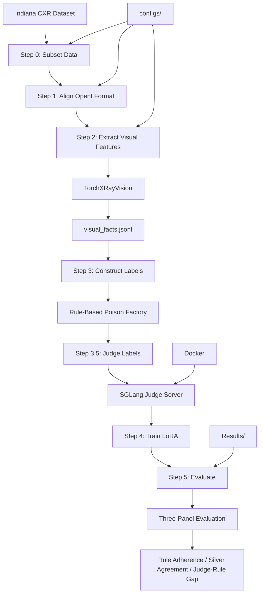

# rad-linter 项目 System Design 面试训练指南

**作者**：Yanda Cheng  
**项目链接**：https://github.com/Nickcp39/rad_linter  
**开始日期**：2025-01  

---

## 🎯 为什么用 rad-linter 项目来训练 System Design？

### 你的 rad-linter 项目已经具备了 Senior 级别的设计思维

1. **Pipeline 化设计** → 模块化、可维护性、可扩展性
2. **多模态融合（视觉 + 文本）** → 跨模态数据流、复杂系统设计
3. **Rule-Based + LLM Judge 双层评估** → 混合系统、可审计性
4. **Docker 化部署** → 工程化、可复现性
5. **LoRA 微调集成** → 模型版本管理、实验可追踪
6. **三面板评估框架** → 多层次质量保证、可观测性

### 这正好对应 System Design 面试的核心考察点

| rad-linter 项目设计 | System Design 面试要点 | 对应天数 |
|-------------------|----------------------|---------|
| Step 0-5 Pipeline 设计 | 可回归、可测试（Golden Set + 门禁） | Day 3 |
| Judge Server + Docker | 可审计性（Metrics + Trace） | Day 1, Day 2 |
| Rule-Based + LLM Judge | 混合系统、故障隔离（保护策略） | Day 5 |
| 三面板评估（Rule/Judge/Pred） | 可观测性（Metrics/Logs/Traces） | Day 2 |
| Docker 版本固定 | 可复现性、版本管理 | Day 5 |
| LoRA 模型版本 | 发布策略（Feature Flag + Canary + Rollback） | Day 4 |

---

## 📚 学习流程（7天强化计划）

### 总体流程

```
Day 1: 指标体系 (L0/L1/L2)
    ↓
Day 2: 可观测性 (Metrics/Logs/Traces)
    ↓
Day 3: 回归门禁 (Golden Set + Eval)
    ↓
Day 4: 发布策略 (Feature Flag + Canary + Rollback)
    ↓
Day 5: 保护策略 (限流/熔断/重试/降级/幂等)
    ↓
Day 6: 事故响应 (Runbook + Postmortem)
    ↓
Day 7: 面试固化 (30秒/2分钟/5分钟话术)
```

---

## 🚀 第 1 步：理解你的 rad-linter 项目（前置准备，1-2小时）

### 必读材料

1. **rad-linter 项目 README**
   - 项目地址：https://github.com/Nickcp39/rad_linter
   - 重点：理解整体架构和数据流

2. **设计文档（如果有）**
   - 理解你的设计决策（规则引擎、插件化、AST 解析等）
   - 找出你在设计时的 trade-off 考虑

3. **关键代码文件**
   - `src/step0_subset.py` → 数据子集处理
   - `src/step1_align.py` → OpenI 格式对齐
   - `src/step2_extract.py` → TorchXRayVision 视觉特征提取
   - `src/step3_construct.py` → 规则基础合成验证集
   - `src/step3.5_judge.py` → LLM Judge 标签生成
   - `src/step4_train.py` → LoRA 模型训练
   - `src/step5_evaluate_v2.py` → 三面板评估
   - `scripts/docker_serve_judge.ps1` → Judge Server 部署
   - `configs/docker_judge_versions.yaml` → 版本固定配置

### 绘制你的系统架构图（Mermaid 或手绘）



### 找出你的设计亮点（准备面试时的关键点）

✅ **已具备的设计亮点**：
- [x] Pipeline 化设计（Step 0-5，模块化、可维护）
- [x] 多模态融合（视觉特征 + 报告文本）
- [x] 双层评估（Rule-Based + LLM Judge）
- [x] Docker 化部署（可复现性）
- [x] 版本固定配置（`docker_judge_versions.yaml`）
- [x] 三面板评估框架（Rule/Judge/Pred 三方对照）

⚠️ **需要补充的设计亮点**（这正是 7 天训练要补的）：
- [ ] 三层指标体系（L0/L1/L2）
- [ ] 可观测性方案（Metrics/Logs/Traces Dashboard）
- [ ] 回归门禁（Golden Set + 通过阈值）
- [ ] 发布策略（Feature Flag + Canary + Rollback）
- [ ] 完整的保护策略矩阵（限流/熔断/重试/降级/幂等）
- [ ] Runbook + Postmortem 模板

---

## 📅 第 2 步：7 天训练流程（按天执行）

### Day 1｜指标体系：把"成功"定义成可打分的三层指标（L0/L1/L2）

**学习目标**：
- 用 rad-linter 项目填充三层指标（L0 稳定性、L1 业务收益、L2 长期健康）
- 理解如何用指标度量系统价值

**学习步骤**：

1. **阅读模板文档**
   - 打开：`../7days_speedup/Day01_METRICS_CARD.md`
   - 理解三层指标的含义

2. **用 rad-linter 项目填充指标**
   - 基于你的实际项目数据填充：
     - **L0（稳定性）**：
       - Pipeline 执行成功率 > 99%
       - Judge Server 可用性 > 99.5%
       - 处理延迟（p95/p99）：
         - Step 2 (视觉特征提取): < 5s/image
         - Step 3.5 (Judge 标签): < 30s/report
         - Step 5 (评估): < 10s/batch
       - Docker 服务启动成功率 > 98%
       - 模型推理错误率 < 1%
     
     - **L1（业务收益）**：
       - 模型性能：
         - Rule Adherence: 100%（完美学习规则模式）
         - Silver Agreement (vs Judge): 88.74% accuracy, 80.0% F1
         - Judge-Rule Gap: 88.74% agreement（43 个争议案例）
       - 自动化率：人工评估时间减少 > 80%
       - 数据集规模：Indiana CXR 子集处理完成度
       - 实验可复现性：100%（Docker 版本固定）
     
     - **L2（长期健康）**：
       - LoRA 模型版本更新失败率 < 5%
       - Judge Server 版本兼容性 > 95%
       - 实验文档完整性 > 90%
       - 基线对比实验完成度（Rule-Only, Text-Only）

3. **理解 Error Budget Policy**
   - 如何用错误预算平衡"发布速度 vs 稳定性"
   - 设定 rad-linter 项目的 SLO 和错误预算

**输出**：
- ✅ 完成 `RAD_LINTER_DAY01_METRICS_CARD.md`（你自己的版本）
- ✅ 能够说出："我们系统用三层指标度量成功：L0 Pipeline执行成功率99%、L1模型准确率88.74%对Judge标签、L2实验可复现性100%"

**时间**：2-3 小时

---

### Day 2｜可观测性：把"我有监控"升级成"我能定位根因"

**学习目标**：
- 设计 rad-linter 项目的可观测性方案（Metrics/Logs/Traces）
- 理解如何用三类信号快速定位问题

**学习步骤**：

1. **阅读模板文档**
   - 打开：`../7days_speedup/Day02_OBSERVABILITY.md`
   - 理解三类信号（Metrics/Logs/Traces）

2. **设计 rad-linter 项目的可观测性方案**
   - **Metrics**：
     - Pipeline 执行指标：
       - Step 执行成功率（每个 step 的成功率）
       - Step 执行延迟（p95/p99，每个 step 的耗时）
       - Judge Server RPS（请求数/秒）
       - Judge Server 响应延迟（p95/p99）
     - 模型性能指标：
       - Rule Adherence Rate（规则遵循率：100%）
       - Silver Agreement（模型 vs Judge：88.74% accuracy）
       - Judge-Rule Gap（Judge vs Rule：88.74% agreement）
       - False Positive/Negative Rate
     - 资源使用指标：
       - GPU 利用率（TorchXRayVision、LoRA 推理）
       - Docker 容器资源使用
       - 数据集处理进度
   
   - **Logs**：
     - 结构化日志（case_id、step_name、image_id、report_id、latency、error_code、judge_id）
     - **不记录**：患者 PII（Privacy-Aware，只记录脱敏 ID）
     - 记录关键步骤结果：
       - Step 2: visual_facts 提取结果
       - Step 3: constructed labels
       - Step 3.5: judge labels（如果有争议标记）
       - Step 5: 三面板评估结果
   
   - **Traces**：
     - 一次完整评估的链路：
       - Span 1: Data Subset（数据子集）
       - Span 2: OpenI Alignment（格式对齐）
       - Span 3: Visual Feature Extraction（视觉特征提取）
       - Span 4: Rule-Based Construction（规则基础构造）
       - Span 5: Judge Label Generation（Judge 标签生成）
       - Span 6: LoRA Training（可选，如果实时训练）
       - Span 7: Three-Panel Evaluation（三面板评估）

3. **设计 Dashboard 草图**
   - On-Call Dashboard（实时监控：Pipeline 执行状态、Judge Server 健康）
   - Experiment Dashboard（实验指标：模型性能、三面板对比）
   - Resource Dashboard（资源使用：GPU、Docker 容器）

**输出**：
- ✅ 完成 `RAD_LINTER_DAY02_OBSERVABILITY.md`
- ✅ 能够说出："我们用 Metrics/Logs/Traces 三类信号，通过 case_id 关联，快速定位根因（是 Judge Server 慢还是 Step 2 视觉提取慢）"

**时间**：2-3 小时

---

### Day 3｜回归与门禁：把 Linter 系统变成"可回测工程"

**学习目标**：
- 建立 rad-linter 项目的回归测试集（Golden Set）
- 设计发布门禁（通过阈值才能发布）

**学习步骤**：

1. **阅读模板文档**
   - 打开：`../7days_speedup/Day03_REGRESSION.md`
   - 打开：`../7days_speedup/Day03_EVAL_REPORT_TEMPLATE.md`

2. **设计 rad-linter 项目的 Golden Set**
   - **场景分类**（基于你现有的 evaluation.jsonl）：
     - 正常场景（30%）：标准报告格式、常见临床发现、无错误
     - Omission 场景（30%）：遗漏关键发现（如 Effusion、Cardiomegaly）
     - Contradiction 场景（30%）：报告与视觉证据矛盾
     - 边界场景（10%）：争议案例（Judge ≠ Rule，43 个案例）
   
   - **Golden Set 规模**：基于你的 evaluation.jsonl，建议包含：
     - 覆盖所有主要 pathology（Effusion, Cardiomegaly 等）
     - 包含 43 个争议案例
     - Rule/Judge/Pred 三方标签都齐全

3. **设计发布门禁**
   - **门禁指标**（基于你的 Step 5 v2 结果）：
     - Rule Adherence > 99%（保持完美规则学习）
     - Silver Agreement (vs Judge) > 85%（不低于基线 88.74%）
     - Judge-Rule Gap 不能显著扩大（保持 ~88.74% agreement）
     - 争议案例不能新增 > 10%
     - 性能回归：Step 2/3.5/5 延迟不能超过基线 20%
     - Docker 环境一致性：100%（版本固定）

4. **与现有测试结合**
   - 单元测试：规则逻辑测试
   - 集成测试：完整扫描流程测试
   - 端到端测试：真实项目扫描

**输出**：
- ✅ 完成 `RAD_LINTER_DAY03_REGRESSION.md`
- ✅ 完成 `RAD_LINTER_DAY03_EVAL_REPORT_TEMPLATE.md`
- ✅ 能够说出："每次发布前跑 Golden Set，通过门禁才能发布，确保改动不会把系统搞坏"

**时间**：3-4 小时

---

### Day 4｜发布策略：Feature Flag + Canary，把"上线"变成可控实验

**学习目标**：
- 设计 rad-linter 项目的灰度发布策略
- 定义回滚条件和流程

**学习步骤**：

1. **阅读模板文档**
   - 打开：`../7days_speedup/Day04_ROLLOUT_AND_ROLLBACK.md`

2. **设计 rad-linter 项目的发布策略**
   - **Feature Flags**：
     - `rule_version`：切换规则版本
     - `rule_enabled`：启用/禁用特定规则
     - `parser_version`：切换 AST 解析器版本
     - `cache_enabled`：开启/关闭缓存
     - `strictness_level`：调整规则严格程度（strict/medium/lenient）
   
   - **Canary 发布**：
     - 1% → 5% → 25% → 100%（按项目/团队/仓库）
     - 每步观察：p95、Error Rate、误报率、开发者反馈
   
   - **回滚条件**：
     - 误报率 × 2 立即回滚
     - p95 + 30% 立即回滚
     - 规则执行错误率 > 2% 立即回滚
     - 开发者投诉率 > 10% 立即回滚

3. **结合你的设计**
   - 规则版本化 → 版本化发布（`rule_version = "v1.2"`）
   - 配置化规则 → 可以通过配置快速回滚

**输出**：
- ✅ 完成 `RAD_LINTER_DAY04_ROLLOUT_AND_ROLLBACK.md`
- ✅ 能够说出："我们用 Feature Flag + Canary 发布，1%→5%→25%→100%，每步观察指标，异常立即回滚"

**时间**：2-3 小时

---

### Day 5｜保护策略：Engineering for Failure（免疫系统）

**学习目标**：
- 完善 rad-linter 项目的保护策略矩阵
- 理解限流/熔断/重试/降级/幂等的触发→动作→验证

**学习步骤**：

1. **阅读模板文档**
   - 打开：`../7days_speedup/Day05_PROTECTION_MATRIX.md`

2. **完善你的保护策略**
   - **限流**：
     - 触发：扫描请求 RPS > threshold 或单个项目文件数 > limit
     - 动作：返回 429，排队等待或建议分批扫描
     - 验证：p95 < 5s，429 rate < 5%
   
   - **重试**：
     - 触发：AST 解析临时失败、网络超时
     - 动作：指数退避重试（MAX_RETRIES = 3）
     - 验证：成功率提升
   
   - **熔断**：
     - 触发：AST 解析失败率 > 10% 或规则执行错误率 > 5%
     - 动作：快速失败，返回基础检查结果或跳过问题规则
     - 验证：延迟降低，系统稳定性提升
   
   - **降级**：
     - 触发：某个规则执行超时或内存不足
     - 动作：跳过该规则，继续执行其他规则；或只执行关键规则
     - 验证：降级后仍有 80% 规则能正常执行
   
   - **幂等**：
     - 触发：重复扫描请求（通过 scan_id 去重）
     - 动作：返回缓存结果（如果存在）
     - 验证：重复扫描率 < 0.1%，缓存命中率提升
   
   - **缓存**：
     - 触发：文件内容未变化（通过 hash 判断）
     - 动作：返回上次扫描结果
     - 验证：缓存命中率 > 60%，延迟降低 50%+

**输出**：
- ✅ 完成 `RAD_LINTER_DAY05_PROTECTION_MATRIX.md`
- ✅ 能够说出："我们设计了限流/熔断/重试/降级/幂等/缓存六层保护策略，确保失败可控、可恢复"

**时间**：3-4 小时

---

### Day 6｜事故响应：Runbook + Postmortem，把"出事"变成组织学习

**学习目标**：
- 编写 rad-linter 项目的 Runbook（运维手册）
- 设计 Postmortem 模板

**学习步骤**：

1. **阅读模板文档**
   - 打开：`../7days_speedup/Day06_RUNBOOK.md`
   - 打开：`../7days_speedup/Day06_POSTMORTEM.md`

2. **编写 rad-linter 项目的 Runbook**
   - **告警触发** → 查看 Dashboard 或日志
   - **判断严重性**：
     - Critical：扫描失败率 > 10% → 立即回滚或禁用问题规则
     - Warning：误报率上升 > 5% → 调整规则阈值或禁用规则
     - Info：性能下降 → 定位根因（Trace → Log，查看哪个规则慢）
   
   - **定位根因**：
     - 使用 `scan_id` 关联 Logs 和 Traces
     - 查看哪个 Span 慢（AST Parsing / Rule Execution / Static Analysis）
     - 检查是否有新语法导致 AST 解析失败
     - 检查是否有新规则导致性能问题

3. **设计 Postmortem 模板**
   - 基于错误分类
   - 记录时间线、根因、行动项
   - 重点关注：规则更新、AST 解析器变更、性能回归

**输出**：
- ✅ 完成 `RAD_LINTER_DAY06_RUNBOOK.md`
- ✅ 完成 `RAD_LINTER_DAY06_POSTMORTEM.md`
- ✅ 能够说出："我们有完整的 Runbook，告警触发→查看 Dashboard→定位根因→快速止血，还有 Postmortem 模板把事故变成组织学习"

**时间**：3-4 小时

---

### Day 7｜面试固化：把系统讲成"低风险进化"的评审节奏

**学习目标**：
- 把前 6 天的内容串成 30 秒 / 2 分钟 / 5 分钟三套话术
- 练习在压力下的表达

**学习步骤**：

1. **阅读模板文档**
   - 打开：`../7days_speedup/Day07_INTERVIEW_SCRIPT.md`

2. **用 rad-linter 项目填充面试脚本**
   - **30 秒版本**（Elevator Pitch）：
     - 系统介绍：rad-linter 代码质量检查工具
     - 核心指标：L0扫描成功率99%、L1每周节省代码审查时间10小时、L2规则更新失败率<5%
     - 低风险进化：Feature Flag + Canary + 回归门禁
   
   - **2 分钟版本**（Overview）：
     - 系统介绍（30秒）
     - 指标体系（30秒）
     - 低风险进化（60秒）
   
   - **5 分钟版本**（Complete Story）：
     - Goal + 三层指标（1分钟）
     - 关键 trade-off（1分钟）
     - Failure modes + 兜底（1.5分钟）
     - Flag + canary + rollback + 回归门禁（1.5分钟）
     - 长期演进（1分钟）

3. **关键要点**（必须能说出）：
   - ✅ "我们用三层指标度量成功：L0稳定性、L1业务收益、L2长期健康"
   - ✅ "我们用规则引擎 + AST 解析，确保可审计性和可测试性"
   - ✅ "我们设计了限流/熔断/重试/降级/幂等/缓存六层保护策略"
   - ✅ "我们用 Feature Flag + Canary 发布，1%→5%→25%→100%，异常立即回滚"
   - ✅ "我们通过回归门禁（Golden Set + 通过阈值）确保改动不会把系统搞坏"

4. **练习**
   - **30 秒版本**：每天练习 3 次（持续 3 天）
   - **2 分钟版本**：每天练习 2 次（持续 3 天）
   - **5 分钟版本**：每天练习 1 次（持续 3 天）
   - **模拟面试**：找朋友/同事练习，让他们提问、打断

**输出**：
- ✅ 完成 `RAD_LINTER_DAY07_INTERVIEW_SCRIPT.md`
- ✅ 能够流畅说出 5 分钟版本，覆盖所有关键点
- ✅ 能够应对常见问题（"能详细说说 XXX 吗？"、"如果 XXX 怎么办？"）

**时间**：2-3 小时（+ 持续练习）

---

## 🎯 学习优先级（如果时间有限）

### 如果只有 3 天

**Day 1**：指标体系（Day 1）→ 这是基础，必须掌握  
**Day 2**：可观测性（Day 2）→ 快速定位根因的能力  
**Day 3**：面试固化（Day 7）→ 把内容串成话术

### 如果只有 5 天

**Day 1**：指标体系（Day 1）  
**Day 2**：可观测性（Day 2）  
**Day 3**：保护策略（Day 5）→ 这是 Senior 的核心能力  
**Day 4**：发布策略（Day 4）→ 低风险进化的关键  
**Day 5**：面试固化（Day 7）

### 如果有 7 天（完整版）

按照原定计划，每天完成一个模块。

---

## 📝 学习检查清单

### 第 1 步：理解项目（1-2小时）
- [ ] 阅读 rad-linter 项目 README 和设计文档
- [ ] 理解关键代码文件（rules, parser, analyzer, reporter）
- [ ] 绘制系统架构图
- [ ] 列出设计亮点（已具备 vs 需要补充）

### 第 2 步：7 天训练（每天 2-4 小时）

#### Day 1｜指标体系
- [ ] 阅读 Day01 模板
- [ ] 用 rad-linter 项目填充三层指标
- [ ] 理解 Error Budget Policy
- [ ] **输出**：`RAD_LINTER_DAY01_METRICS_CARD.md`

#### Day 2｜可观测性
- [ ] 阅读 Day02 模板
- [ ] 设计 Metrics/Logs/Traces 方案
- [ ] 设计 Dashboard 草图
- [ ] **输出**：`RAD_LINTER_DAY02_OBSERVABILITY.md`

#### Day 3｜回归门禁
- [ ] 阅读 Day03 模板
- [ ] 设计 Golden Set（100-300 个测试用例）
- [ ] 设计发布门禁（通过阈值）
- [ ] **输出**：`RAD_LINTER_DAY03_REGRESSION.md` + `RAD_LINTER_DAY03_EVAL_REPORT_TEMPLATE.md`

#### Day 4｜发布策略
- [ ] 阅读 Day04 模板
- [ ] 设计 Feature Flag + Canary 发布策略
- [ ] 定义回滚条件
- [ ] **输出**：`RAD_LINTER_DAY04_ROLLOUT_AND_ROLLBACK.md`

#### Day 5｜保护策略
- [ ] 阅读 Day05 模板
- [ ] 完善限流/熔断/重试/降级/幂等/缓存矩阵
- [ ] 设计验证方案
- [ ] **输出**：`RAD_LINTER_DAY05_PROTECTION_MATRIX.md`

#### Day 6｜事故响应
- [ ] 阅读 Day06 模板
- [ ] 编写 Runbook
- [ ] 设计 Postmortem 模板
- [ ] **输出**：`RAD_LINTER_DAY06_RUNBOOK.md` + `RAD_LINTER_DAY06_POSTMORTEM.md`

#### Day 7｜面试固化
- [ ] 阅读 Day07 模板
- [ ] 编写 30秒/2分钟/5分钟话术
- [ ] 练习表达（每天 3/2/1 次）
- [ ] **输出**：`RAD_LINTER_DAY07_INTERVIEW_SCRIPT.md`

### 第 3 步：模拟面试（持续练习）
- [ ] 找朋友/同事模拟面试
- [ ] 录音/视频自己练习
- [ ] 持续改进表达

---

## 💡 关键学习要点

### 1. 你不是在"学大厂流程"，而是在"把你的深技术变成可托付的工业能力"

- 你的 rad-linter 项目已经有很强的技术深度
- 现在需要把这些深度用"工业能力"的语言表达出来
- 面试官要的不是"你懂技术"，而是"你能当 owner"

### 2. 核心逻辑：SRE 不是追求"永不失败"，而是"失败可控、可恢复"

- **SLO 不要求 100% 满足**，要允许 error budget
- **Canary/Feature Flags**：在真实流量下试错，但把伤害限制在很小范围
- **失败不可怕**，关键是可控、可恢复、可学习

### 3. 面试时要展示的：可度量、可回归、可灰度、可回滚、可复盘

- **可度量**：三层指标（L0/L1/L2）
- **可回归**：Golden Set + 门禁
- **可灰度**：Feature Flag + Canary
- **可回滚**：明确的回滚条件和流程
- **可复盘**：Runbook + Postmortem

---

## 📚 参考资源

### rad-linter 项目
- GitHub：https://github.com/Nickcp39/rad_linter
- 设计文档：`DESIGN.md`（如果有）

### System Design 模板
- `../7days_speedup/Day01_METRICS_CARD.md` - Day 1 模板
- `../7days_speedup/Day02_OBSERVABILITY.md` - Day 2 模板
- `../7days_speedup/Day03_REGRESSION.md` - Day 3 模板
- `../7days_speedup/Day04_ROLLOUT_AND_ROLLBACK.md` - Day 4 模板
- `../7days_speedup/Day05_PROTECTION_MATRIX.md` - Day 5 模板
- `../7days_speedup/Day06_RUNBOOK.md` - Day 6 模板
- `../7days_speedup/Day07_INTERVIEW_SCRIPT.md` - Day 7 模板

### 相关工具参考
- ESLint Architecture: https://eslint.org/docs/latest/use/core-concepts
- Prettier Design: https://prettier.io/docs/en/technical-details.html
- Pylint Architecture: https://pylint.pycqa.org/

### Google SRE 参考
- Google SRE Book: https://sre.google/workbook/
- SLO, SLI, SLAs: https://sre.google/workbook/slo/
- Error Budget Policy: https://sre.google/workbook/error-budget-policy/

---

## 🎯 成功标准

### 训练完成后，你应该能够：

1. **在 5 分钟内**讲清楚你的 rad-linter 系统：
   - Goal + 三层指标（L0/L1/L2）
   - 关键 trade-off
   - Failure modes + 兜底
   - Flag + canary + rollback + 回归门禁
   - 长期演进

2. **应对常见问题**：
   - "能详细说说 XXX 吗？" → 从脚本中抽取相关部分
   - "如果 XXX 怎么办？" → 引用保护策略
   - "为什么不这样设计？" → 引用 trade-off 分析

3. **展示 Senior 级别的能力**：
   - 不是"能写代码"，而是"能当 owner"
   - 不是"能解决问题"，而是"能设计可托付的系统"
   - 不是"能交付"，而是"能低风险进化"

---

## 🚀 开始学习

**第 1 步**：理解你的 rad-linter 项目（1-2 小时）  
**第 2 步**：从 Day 1 开始，每天完成一个模块  
**第 3 步**：持续练习表达，准备面试

**记住**：这 7 天不是在"学大厂流程"，而是在把你的深技术变成"可托付的工业能力"。

**加油！** 🎉
