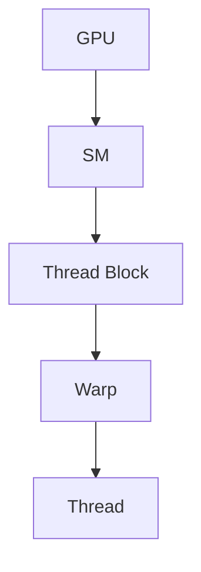
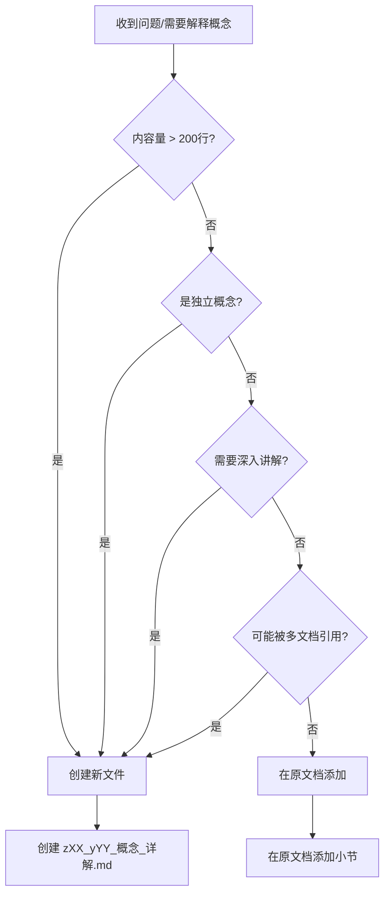

# SGLang Bug分析 - 完整学习资料

## 📚 文档结构

### 核心文档
1. **[00_基础概念完整学习指南.md](./learn path way md/00_基础概念完整学习指南.md)** ⭐ **从这里开始**
   - 理解Issue #17680和#17526所需的所有基础概念
   - 7个主要分类，30+个核心概念
   - 每个概念都有官方文档链接

2. **[01_官方文档快速索引.md](./learn path way md/01_官方文档快速索引.md)** 📖 **文档索引**
   - 按优先级分类的官方文档
   - 快速链接汇总
   - 阅读建议和时间分配

3. **[02_学习计划.md](./learn path way md/02_学习计划.md)** 📅 **学习计划**
   - 快速学习路径（2-3周）
   - 深入学习路径（4-6周）
   - 每日学习任务

4. **[03_Issue_17526_学习路径.md](./learn path way md/03_Issue_17526_学习路径.md)** 🚀 **Issue 17526专项学习**
   - GLM Blackwell性能优化专项学习路径
   - 从基础到实践的完整指南
   - 具体学习任务和检查清单

---

## 🎯 学习目标

通过系统学习这些基础概念，能够：
1. ✅ 理解Issue #17680 (MoE Tensor Parallelism Bug) 的根本原因
2. ✅ 理解Issue #17526 (GLM Blackwell性能优化) 的优化方法
3. ✅ 能够阅读和修改SGLang代码
4. ✅ 能够实现性能优化方案

---

## 🚀 快速开始

### 针对Issue 17526的学习路径

**如果你想学习Issue 17526（GLM Blackwell性能优化）**:

1. **第一步**: 阅读 `03_Issue_17526_学习路径.md` ⭐ **从这里开始**
   - 了解需要掌握的基础概念
   - 了解学习顺序和路径选择

2. **第二步**: 完成基础概念学习
   - 打开 `00_基础概念完整学习指南.md`
   - 重点学习：GPU架构、量化技术、CUDA编程

3. **第三步**: 理解Issue内容
   - 打开 `bug_17526_analysis/A01_B01_original_issue.md`
   - 理解优化项和性能瓶颈

4. **第四步**: 实践优化
   - 运行性能测试
   - 选择一个优化项实现
   - 提交PR

### 针对Issue 17680的学习路径

**如果你想学习Issue 17680（MoE TP Bug）**:

1. **第一步**: 阅读 `00_基础概念完整学习指南.md`
   - 重点学习：Tensor Parallelism、MoE架构

2. **第二步**: 查看Issue分析
   - 打开 `bug_17680_analysis/` 文件夹
   - 阅读详细分析文档

---

## 📋 学习检查清单

### 基础概念（必须掌握）
- [ ] Transformer架构
- [ ] LLM推理流程
- [ ] GPU架构基础
- [ ] CUDA基础
- [ ] 量化基础

### Issue #17680相关（MoE TP Bug）
- [ ] Tensor Parallelism
- [ ] MoE架构
- [ ] RowParallel vs ColumnParallel
- [ ] 权重加载和分片
- [ ] Padding和边界检查

### Issue #17526相关（性能优化）
- [ ] Blackwell GPU架构
- [ ] FP8/FP4量化
- [ ] KV Cache量化
- [ ] Kernel融合
- [ ] 性能分析工具
- [ ] Flashinfer和TRT-LLM backend

### SGLang特定
- [ ] SGLang架构
- [ ] SGLang Backend
- [ ] SGLang权重加载
- [ ] SGLang MoE实现

---

## 🔗 相关Issue

- [Issue #17680](https://github.com/sgl-project/sglang/issues/17680) - MoE Tensor Parallelism Bug
- [Issue #17526](https://github.com/sgl-project/sglang/issues/17526) - GLM Blackwell性能优化

---

## 📁 相关分析文档

- `../../bug_17680_analysis/` - Issue #17680的详细分析
- `../../bug_17526_analysis/` - Issue #17526的详细分析

---

**开始你的学习之旅！** 🎓
# 文件结构规则 - SGLang学习文档命名规范

## 📋 命名规则总览

本文档定义了SGLang学习文档的命名规范，确保文档结构清晰、易于导航。

**重要更新**: 新的命名规则从**Z系列**开始，使用**Z01, Z02...**作为主文档编号。

---

## 🎯 命名格式

### 基本格式
```
[层级前缀]_[主题代码]_[描述].md
```

### 格式说明
- **层级前缀**: 表示文档的层级（00, 01, 02... 或 Z01, Z02...）
- **主题代码**: 表示主题分类（A1, A2, B1, B2... 或 Y01, Y02...）
- **描述**: 文档内容的简短描述（英文，使用下划线）

---

## 📁 层级前缀规则

### 00_, 01_, 02_... - 旧版主文档/索引文档（保留）
**用途**: 主导航文档、总览文档、索引文档（已存在的文档）

**示例**:
- `00_基础概念完整学习指南.md` - 主学习指南
- `00_官方文档快速索引.md` - 文档索引
- `00_学习计划.md` - 学习计划
- `00_A1_Scaled_Dot_Product_Attention_详解.md` - A系列详解

### Z01_, Z02_, Z03_... - 新版主文档（新规则）
**用途**: 新的主文档、专题文档、Issue相关文档

**格式**: `Z[数字]_[描述].md`

**示例**:
- `Z01_Issue_17526_学习路径.md` - Issue 17526学习路径
- `Z02_Issue_17680_学习路径.md` - Issue 17680学习路径
- `Z03_GPU架构专题.md` - GPU架构专题

**规则**:
- Z01, Z02, Z03... 按创建顺序编号
- 每个Z系列文档是一个独立的专题或学习路径

### 00_Z07_Y01_, 00_Z07_Y02_... - 子文档（新规则）
**用途**: Z07的子文档（对应00_Z7主文档）

**格式**: `00_Z[数字]_Y[数字]_[描述].md`

**示例**:
- `00_Z07_Y01_Thread_Block_详解.md` - Z07的子文档1
- `00_Z07_Y02_Kernel启动机制_详解.md` - Z07的子文档2
- `00_Z07_Y03_其他概念_详解.md` - Z07的子文档3

**规则**:
- **00_** 前缀（与主文档保持一致）
- **大写Z** + 数字（对应父文档的Z编号，如Z07对应00_Z7）
- **大写Y** + 数字（子文档编号）
- Y01, Y02, Y03... 按创建顺序编号

### 00_Z01_Y01_, 00_Z01_Y02_... - Z01的子文档
**格式**: `00_Z[数字]_Y[数字]_[描述].md`

**示例**:
- `00_Z01_Y01_Blackwell_GPU_架构_详解.md` - Z01的子文档1
- `00_Z01_Y02_FP8_量化_详解.md` - Z01的子文档2

### 01_Z3_Y01_, 01_Z3_Y02_... - 01_Z3的子文档
**格式**: `01_Z[数字]_Y[数字]_[描述].md`

**示例**:
- `01_Z3_Y01_BF16_vs_FP16_详解.md` - 01_Z3的子文档1
- `01_Z3_Y02_KV_Cache工作原理详解.md` - 01_Z3的子文档2

**规则**:
- **01_** 前缀（与父文档 `01_Z3_` 保持一致）
- **大写Z** + 数字（对应父文档的Z编号，如Z3对应01_Z3）
- **大写Y** + 数字（子文档编号）
- Y01, Y02, Y03... 按创建顺序编号

**注意**: 如果父文档是 `01_Z[数字]_` 格式，子文档也使用 `01_Z[数字]_Y[数字]_` 格式，保持前缀一致。

---

## 🔤 主题代码规则

### A系列 - 基础概念详解（保留，用于00_系列）
**用途**: 对基础概念的深入解释

**格式**: `A[数字]_[概念名称]`

**示例**:
- `00_A1_Scaled_Dot_Product_Attention_详解.md`
- `00_A2_KV_Cache_详解.md`
- `00_A3_Tensor_Parallelism_详解.md`

**规则**:
- A1, A2, A3... 按学习顺序编号
- 每个A系列文档对应一个具体概念
- 文档名包含"详解"字样

### Y系列 - 子文档主题（新规则，用于z系列）
**用途**: Z系列文档的子文档主题

**格式**: `y[数字]_[主题描述]`

**示例**:
- `00_Z07_Y01_Thread_Block_详解.md`
- `00_Z07_Y02_Kernel启动机制_详解.md`
- `00_Z01_Y01_Blackwell_GPU_架构_详解.md`

**规则**:
- y01, y02, y03... 按创建顺序编号
- 每个y系列文档是父Z文档的子文档
- 可以包含"详解"字样

### B系列 - 问题解答（保留）
**用途**: 回答具体问题

**格式**: `B[数字]_[问题描述]`

**示例**:
- `00_B1_为什么需要除以根号d_k.md`
- `00_Z07_Y01_B1_为什么FP8_KV_Cache更慢.md`

**规则**:
- B1, B2, B3... 按问题出现顺序编号
- 每个B系列文档回答一个具体问题

### C系列 - 代码分析（保留）
**用途**: 代码实现分析

**格式**: `C[数字]_[代码模块名称]`

**示例**:
- `00_C1_SGLang_MoE_权重加载分析.md`
- `00_Z07_Y01_C1_Flashinfer_Backend分析.md`

**规则**:
- C1, C2, C3... 按分析顺序编号
- 每个C系列文档分析一个代码模块

### D系列 - 实践指南（保留）
**用途**: 实践操作指南

**格式**: `D[数字]_[实践内容]`

**示例**:
- `00_D1_如何运行Profiler.md`
- `00_Z07_Y01_D1_如何分析性能瓶颈.md`

**规则**:
- D1, D2, D3... 按实践顺序编号
- 每个D系列文档是一个实践指南

---

## 📝 命名示例

### 完整示例

#### 新版命名（Z系列）
```
Z01_Issue_17526_学习路径.md          # 主文档
├── 00_Z01_Y01_Blackwell_GPU_架构_详解.md    # 子文档1
├── 00_Z01_Y02_FP8_量化_详解.md              # 子文档2
├── 00_Z01_Y03_Kernel融合_详解.md            # 子文档3
└── 00_Z01_Y04_性能分析_实践指南.md          # 子文档4

Z02_Issue_17680_学习路径.md          # 主文档
├── 00_Z02_Y01_MoE_架构_详解.md              # 子文档1
├── 00_Z02_Y02_Tensor_Parallelism_详解.md    # 子文档2
└── 00_Z02_Y03_权重加载_代码分析.md          # 子文档3

01_Z3_量化技术对比_详解.md          # 主文档（01_Z3）
├── 01_Z3_Y01_BF16_vs_FP16_详解.md           # 子文档1
├── 01_Z3_Y02_KV_Cache工作原理详解.md        # 子文档2
└── 01_Z3_Y03_其他概念_详解.md               # 子文档3

00_Z7_GPU基本计算单元_SM_详解.md    # 主文档（Z07）
├── 00_Z07_Y01_Thread_Block_详解.md          # 子文档1
├── 00_Z07_Y02_Kernel启动机制_详解.md        # 子文档2
└── 00_Z07_Y03_其他概念_详解.md              # 子文档3
```

#### 旧版命名（00_系列，保留）
```
00_基础概念完整学习指南.md
00_官方文档快速索引.md
00_A1_Scaled_Dot_Product_Attention_详解.md
00_A2_KV_Cache_详解.md
```

---

## 🔗 文档关联规则

### 引用格式
在文档中引用其他文档时，使用相对路径：

```markdown
参考文档: [A1_Scaled_Dot_Product_Attention详解](./00_A1_Scaled_Dot_Product_Attention_详解.md)
参考文档: [Thread Block详解](./00_Z07_Y01_Thread_Block_详解.md)
参考文档: [Kernel启动机制详解](./00_Z07_Y02_Kernel启动机制_详解.md)
```

### 文档层级
- **主文档** (Z01_xxx.md 或 00_Z7_xxx.md): 可以引用所有子文档
- **子文档** (00_Z07_Y01_xxx.md): 可以引用同级子文档和父文档
- **A/B/C/D系列文档**: 可以互相引用

---

## 📊 图表使用规则

### 必须使用图表的情况
以下情况**必须**使用图表来辅助说明：

1. **架构图**: 系统架构、模块关系、数据流
   - 示例：GPU架构图、Transformer架构图、SGLang架构图
   - 工具：Mermaid、ASCII Art、或引用外部图片

2. **层次结构**: 文档层次、概念层次、代码层次
   - 示例：Grid > Thread Block > Warp > Thread
   - 工具：树状图、缩进列表、Mermaid流程图

3. **数据流**: 数据在系统中的流动路径
   - 示例：权重加载流程、推理流程、KV Cache更新流程
   - 工具：流程图、序列图

4. **对比图**: 不同方案的对比
   - 示例：TP vs DP vs EP、FP32 vs FP16 vs FP8
   - 工具：表格、对比图

5. **可视化示例**: 复杂概念的可视化
   - 示例：Attention权重可视化、内存布局可视化
   - 工具：ASCII Art、Mermaid、或引用外部图片

### 图表格式要求

#### Mermaid图表（推荐）
```markdown

```

#### ASCII Art图表
```markdown
```
GPU
├── SM 0
│   ├── Thread Block 0
│   │   ├── Warp 0
│   │   └── Warp 1
│   └── Thread Block 1
└── SM 1
    └── ...
```
```

#### 表格对比
```markdown
| 特性 | FP32 | FP16 | FP8 |
|------|------|------|-----|
| 精度 | 高 | 中 | 低 |
| 速度 | 慢 | 快 | 最快 |
```

### 图表质量标准
- ✅ **清晰**: 图表应该清晰易懂，避免过于复杂
- ✅ **准确**: 图表内容必须准确反映文档内容
- ✅ **必要**: 图表应该有助于理解，不是装饰
- ✅ **标注**: 复杂图表需要添加说明文字

---

## 🌐 外部链接规则

### 必须添加外部链接的情况
以下情况**必须**添加外部链接：

1. **官方文档**: 引用官方文档中的概念、API、规范
   - 示例：NVIDIA CUDA文档、PyTorch文档、SGLang官方文档
   - 格式：`[文档标题](URL) ⭐⭐⭐`（重要程度标记）

2. **技术博客**: 引用技术博客中的深入解释、最佳实践
   - 示例：NVIDIA Blog、PyTorch Blog、其他技术博客
   - 格式：`[博客标题](URL) ⭐⭐`（重要程度标记）

3. **论文**: 引用相关论文（如果适用）
   - 示例：Transformer论文、Flash Attention论文
   - 格式：`[论文标题](URL) ⭐⭐⭐`（重要程度标记）

4. **GitHub仓库**: 引用相关代码仓库、Issue、PR
   - 示例：SGLang GitHub、相关项目的GitHub
   - 格式：`[仓库名称](URL) ⭐⭐`（重要程度标记）

5. **性能数据**: 引用官方性能数据、基准测试结果
   - 示例：NVIDIA官方性能数据、Benchmark结果
   - 格式：`[数据来源](URL) ⭐⭐`（重要程度标记）

### 链接格式规范

#### 基本格式
```markdown
- [链接标题](URL) ⭐⭐⭐ - 简要说明
```

#### 重要程度标记
- ⭐⭐⭐: **必须阅读** - 官方文档、核心概念、关键论文
- ⭐⭐: **推荐阅读** - 技术博客、深入解释、最佳实践
- ⭐: **可选阅读** - 补充材料、扩展阅读

#### 链接分类
```markdown
## 🔗 相关文档

### 官方文档
- [NVIDIA CUDA Programming Guide](URL) ⭐⭐⭐ - CUDA编程官方指南
- [PyTorch Documentation](URL) ⭐⭐⭐ - PyTorch官方文档

### 技术博客
- [NVIDIA Blog - Understanding Tensor Cores](URL) ⭐⭐ - Tensor Core详解
- [PyTorch Blog - FP8 Training](URL) ⭐⭐ - FP8训练实践

### 论文
- [Attention Is All You Need](URL) ⭐⭐⭐ - Transformer原始论文
- [Flash Attention](URL) ⭐⭐⭐ - Flash Attention论文

### GitHub资源
- [SGLang Repository](URL) ⭐⭐ - SGLang代码仓库
- [Issue #17526](URL) ⭐⭐ - 相关Issue讨论
```

### 链接质量标准
- ✅ **权威性**: 优先使用官方文档、知名技术博客
- ✅ **相关性**: 链接内容必须与文档主题相关
- ✅ **时效性**: 优先使用最新版本的文档
- ✅ **可访问性**: 确保链接可访问，避免死链
- ✅ **说明性**: 每个链接都应该有简要说明

### 链接组织方式

#### 方式1: 按章节组织
```markdown
## Z07.1 SM的基本概念

### 定义
SM是GPU的基本计算单元...

### 相关链接
- [NVIDIA CUDA Architecture](URL) ⭐⭐⭐ - SM架构详解
- [GPU Computing Blog](URL) ⭐⭐ - SM调度机制
```

#### 方式2: 文档末尾统一组织
```markdown
## 🔗 相关文档

### 官方文档
- [链接1](URL) ⭐⭐⭐
- [链接2](URL) ⭐⭐⭐

### 技术博客
- [链接3](URL) ⭐⭐
- [链接4](URL) ⭐⭐
```

### 外部链接检查清单
创建/更新文档时，检查以下事项：

- [ ] 每个重要概念都有对应的官方文档链接
- [ ] 复杂概念有技术博客的深入解释链接
- [ ] 相关论文已引用（如适用）
- [ ] GitHub资源已链接（如适用）
- [ ] 所有链接都有重要程度标记（⭐⭐⭐/⭐⭐/⭐）
- [ ] 所有链接都有简要说明
- [ ] 链接按类别组织（官方文档/技术博客/论文/GitHub）

---

## 📝 文档内容管理规则

### 何时创建新文件 vs 何时在原文档添加

当回答一个问题或解释一个概念时，需要判断：**创建新文件**还是**在原文档中添加**？

#### 判断标准

##### ✅ 应该创建新文件的情况（复杂解释）

如果回答/解释满足以下**任意一个**条件，应该创建新的子文档：

1. **内容量**: 解释内容超过**200行**或包含**3个以上**主要章节
   - 示例：解释"Kernel启动机制"需要详细说明软件层、硬件层、流程图等

2. **独立性**: 解释的内容是一个**独立的概念**，可以单独成文
   - 示例："Thread Block详解"、"Kernel启动机制详解"、"Warp调度详解"

3. **复用性**: 这个概念可能被**多个文档引用**
   - 示例："Tensor Parallelism详解"可能被多个Issue文档引用

4. **深度**: 需要**深入讲解**，包含多个子概念、图表、代码示例
   - 示例：需要解释架构图、流程图、代码分析、性能分析等

5. **扩展性**: 未来可能需要**持续更新**或**扩展内容**
   - 示例：性能优化技巧、最佳实践等

**命名规则**: 创建 `00_Z[父文档编号]_Y[子文档编号]_[概念名称]_详解.md`
- 示例：`00_Z07_Y02_Kernel启动机制_详解.md`

##### ✅ 应该在原文档添加的情况（简单解释）

如果回答/解释满足以下**所有**条件，应该在原文档中添加：

1. **内容量**: 解释内容少于**200行**，通常只有**1-2个**主要章节
   - 示例：简单回答"是的，这是硬件自动的"，加上1-2段说明

2. **相关性**: 解释内容**紧密相关**于当前文档主题
   - 示例：在SM文档中简单说明"SM如何接收Thread Block"

3. **一次性**: 这个解释**不太可能**被其他文档引用
   - 示例：针对特定问题的简单回答

4. **简洁性**: 只需要**简短说明**，不需要深入展开
   - 示例：几句话或1-2段就能说清楚

**添加方式**: 在原文档中添加新的小节或补充说明
- 示例：`#### Z7.8.1.1 Kernel启动是硬件还是软件的？`

#### 判断流程图



#### 实际例子

##### 例子1：应该创建新文件

**问题**: "什么是Thread Block？"

**判断**:
- ✅ 内容量：需要详细解释（>200行）
- ✅ 独立性：Thread Block是独立概念
- ✅ 复用性：可能被多个文档引用
- ✅ 深度：需要深入讲解（定义、组成、调度、例子等）

**操作**: 创建 `z07_y01_Thread_Block_详解.md`

##### 例子2：应该创建新文件

**问题**: "Kernel启动是硬件还是软件的？"

**判断**:
- ✅ 内容量：需要详细解释软件层、硬件层、流程图等（>200行）
- ✅ 独立性：Kernel启动机制是独立概念
- ✅ 深度：需要深入讲解（软件层、硬件层、时序图、架构图等）

**操作**: 创建 `00_Z07_Y02_Kernel启动机制_详解.md`

##### 例子3：应该在原文档添加

**问题**: "SM有多少个CUDA Core？"

**判断**:
- ❌ 内容量：只需要简单回答（<50行）
- ❌ 独立性：不是独立概念，只是SM的一个属性
- ❌ 复用性：不太可能被其他文档引用
- ❌ 深度：只需要简单说明

**操作**: 在 `00_Z7_GPU基本计算单元_SM_详解.md` 中添加简短说明

##### 例子4：应该在原文档添加

**问题**: "SM可以同时执行多少个Thread Block？"

**判断**:
- ❌ 内容量：只需要简单回答（<100行）
- ❌ 独立性：不是独立概念，只是SM的一个特性
- ❌ 深度：只需要简单说明，不需要深入展开

**操作**: 在 `00_Z7_GPU基本计算单元_SM_详解.md` 中添加简短说明

#### 创建新文件后的操作

1. **创建新文件**: 按照命名规则创建 `00_Z[父文档编号]_Y[子文档编号]_[概念名称]_详解.md`

2. **更新父文档**: 在父文档中添加引用链接
   ```markdown
   **参考文档**: [00_Z07_Y02_Kernel启动机制_详解.md](./00_Z07_Y02_Kernel启动机制_详解.md) ⭐ **详细讲解Kernel启动机制**
   ```

3. **保持原文档简洁**: 在原文档中只保留简短说明，详细内容移到新文件

#### 在原文档添加时的操作

1. **添加新小节**: 在原文档的合适位置添加新小节
   ```markdown
   #### Z7.8.1.1 简单问题回答
   
   简短说明...
   ```

2. **保持文档结构**: 确保新内容符合文档的层次结构

3. **避免过度展开**: 如果发现内容越来越复杂，考虑创建新文件

---

## 📋 文件组织规则

### 目录结构
```
llm study sglang_yc01252026/
├── README.md                          # 总览
├── 00_基础概念完整学习指南.md          # 旧版主文档
├── 00_A1_xxx_详解.md                  # 旧版A系列
├── Z01_Issue_17526_学习路径.md         # 新版主文档
├── 00_Z01_Y01_Blackwell_GPU_架构_详解.md  # Z01的子文档
├── 00_Z01_Y02_FP8_量化_详解.md            # Z01的子文档
├── Z02_Issue_17680_学习路径.md         # 新版主文档
├── 00_Z02_Y01_MoE_架构_详解.md            # Z02的子文档
├── 00_Z7_GPU基本计算单元_SM_详解.md     # 新版主文档（Z07）
├── 00_Z07_Y01_Thread_Block_详解.md        # Z07的子文档
└── 00_Z07_Y02_Kernel启动机制_详解.md      # Z07的子文档
```

### 文件分组
- **Z系列主文档**: 放在根目录（如 `Z01_xxx.md` 或 `00_Z7_xxx.md`）
- **00_Z系列子文档**: 放在根目录（与父文档同级，如 `00_Z07_Y01_xxx.md`）
- **00_系列文档**: 保留在根目录（旧版文档）

---

## ✅ 命名检查清单

创建新文档时，检查以下事项：

### Z系列主文档
- [ ] 文件名以`Z[数字]_`开头
- [ ] 编号连续（Z01, Z02, Z03...）
- [ ] 描述清晰（英文，使用下划线）
- [ ] 文件名长度合理（不超过80字符）

### z系列子文档
- [ ] 文件名以`00_Z[数字]_Y[数字]_`开头
- [ ] Z编号对应父文档的Z编号（如Z07对应00_Z7）
- [ ] Y编号连续（Y01, Y02, Y03...）
- [ ] 描述清晰（英文，使用下划线）
- [ ] 文件名长度合理（不超过80字符）

---

## ✅ 内容质量检查清单

创建/更新文档时，检查以下事项：

### 图表检查
- [ ] 架构图：系统架构、模块关系已用图表说明
- [ ] 层次结构：概念层次、代码层次已用图表说明
- [ ] 数据流：数据流动路径已用流程图说明
- [ ] 对比图：不同方案已用对比图说明
- [ ] 可视化：复杂概念已用可视化图表说明
- [ ] 图表清晰：图表清晰易懂，有必要的说明文字

### 外部链接检查
- [ ] 官方文档：重要概念已链接官方文档
- [ ] 技术博客：复杂概念已链接技术博客深入解释
- [ ] 论文：相关论文已引用（如适用）
- [ ] GitHub资源：相关代码仓库、Issue已链接（如适用）
- [ ] 链接标记：所有链接都有重要程度标记（⭐⭐⭐/⭐⭐/⭐）
- [ ] 链接说明：所有链接都有简要说明
- [ ] 链接组织：链接按类别组织（官方文档/技术博客/论文/GitHub）

---

## 🎯 使用场景

### 场景1: 创建新的Issue学习路径
**操作**: 创建Z系列主文档
**示例**: 创建`Z03_Issue_XXXXX_学习路径.md`

### 场景2: 为Z07创建子文档
**操作**: 创建00_Z07_Y系列子文档
**示例**: 创建`00_Z07_Y03_新概念_详解.md`

### 场景3: 遇到不理解的概念（在Z07中）
**操作**: 创建00_Z07_Y系列子文档
**示例**: 创建`00_Z07_Y03_Tensor_Core_详解.md`

### 场景4: 需要实践指南（在Z07中）
**操作**: 创建00_Z07_Y系列子文档
**示例**: 创建`00_Z07_Y04_如何运行Profiler.md`

---

## 📚 参考示例

### 当前项目的命名规则
- **主文档**: `Z[数字]_xxx.md` 或 `00_Z[数字]_xxx.md`（如 `00_Z7_xxx.md`）
- **子文档**: `00_Z[数字]_Y[数字]_xxx.md`（如 `00_Z07_Y01_xxx.md`）
- **概念详解**: `00_Z[数字]_Y[数字]_xxx_详解.md`
- **问题解答**: `00_Z[数字]_Y[数字]_B[数字]_xxx.md`
- **代码分析**: `00_Z[数字]_Y[数字]_C[数字]_xxx.md`
- **实践指南**: `00_Z[数字]_Y[数字]_D[数字]_xxx.md`

---

## 💡 命名建议

1. **描述要具体**: 文件名应该清楚说明文档内容
2. **使用英文**: 描述部分使用英文，便于搜索和引用
3. **避免特殊字符**: 只使用字母、数字、下划线
4. **保持一致性**: 同类文档使用相同的命名格式
5. **及时更新索引**: 创建新文档后，更新主文档的索引

---

## 💡 内容质量建议

### 图表使用建议
1. **多用图表**: 能用图表说明的，尽量用图表
2. **图表优先**: 复杂概念优先用图表，文字辅助说明
3. **多种格式**: 根据内容选择合适的图表格式（Mermaid/ASCII/表格）
4. **持续优化**: 根据反馈不断优化图表，使其更清晰易懂

### 外部链接建议
1. **优先官方**: 优先链接官方文档，确保权威性
2. **多源参考**: 重要概念链接多个来源（官方文档+技术博客）
3. **及时更新**: 定期检查链接有效性，更新过时的链接
4. **分类组织**: 按类别组织链接，便于查找和阅读
5. **说明清晰**: 每个链接都要有清晰的说明，说明为什么推荐这个链接

---

## 🔄 文档更新规则

### 创建新文档时
1. 按照命名规则创建文件
2. 在主文档（Z系列）中添加链接
3. 更新README.md（如需要）
4. 提交到git

### 修改文档时
1. 保持文件名不变（除非内容完全改变）
2. 更新文档内容
3. 更新相关链接（如需要）

---

## 📊 命名规则对比表

| 类型 | 旧版格式 | 新版格式 | 示例 |
|------|---------|---------|------|
| 主文档 | `00_xxx.md` | `Z01_xxx.md` 或 `00_Z7_xxx.md` | `Z01_Issue_17526_学习路径.md`<br>`00_Z7_GPU基本计算单元_SM_详解.md` |
| 子文档 | `00_A1_xxx.md` | `00_Z07_Y01_xxx.md` | `00_Z07_Y01_Thread_Block_详解.md`<br>`00_Z07_Y02_Kernel启动机制_详解.md` |
| 问题解答 | `00_B1_xxx.md` | `00_Z07_Y01_B1_xxx.md` | `00_Z07_Y01_B1_为什么FP8更慢.md` |
| 代码分析 | `00_C1_xxx.md` | `00_Z07_Y01_C1_xxx.md` | `00_Z07_Y01_C1_Kernel代码分析.md` |
| 实践指南 | `00_D1_xxx.md` | `00_Z07_Y01_D1_xxx.md` | `00_Z07_Y01_D1_如何运行Profiler.md` |

---

**遵循这些规则，保持文档结构清晰有序！** 📚
