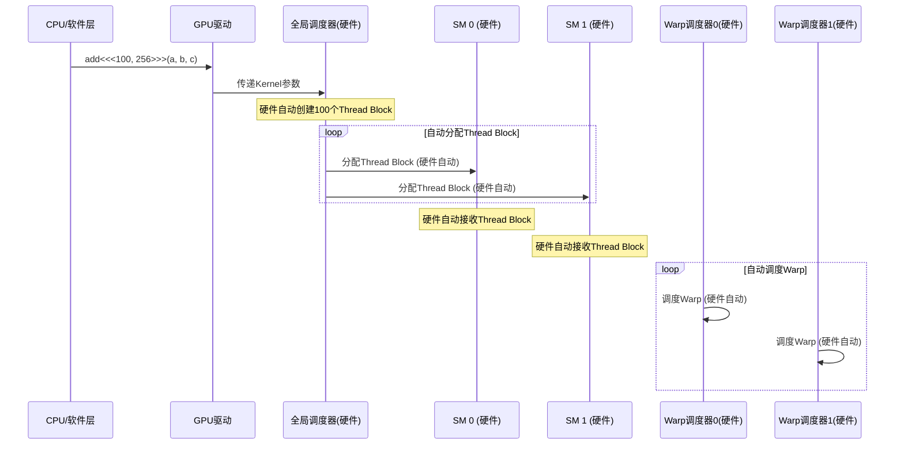

# Z07_Y01_Thread_Block_详解

## 📚 问题

**什么是Thread Block？**

Thread Block（线程块）是CUDA编程中的基本执行单位，是GPU并行计算的组织单元。

---

## 🎯 最简单理解

### 一句话总结
**Thread Block是一组线程的集合，这些线程可以在同一个SM上协作执行任务。**

### 类比理解

#### 类比1：工厂生产
- [ ] **GPU = 工厂**: 
  - [ ] 整个GPU是一个工厂
- [ ] **SM = 车间**: 
  - [ ] 每个SM是一个车间
- [ ] **Thread Block = 工作组**: 
  - [ ] 一个工作组（Thread Block）被分配到一个车间（SM）
  - [ ] 工作组内的工人（线程）可以协作
  - [ ] 工作组可以共享工具（Shared Memory）
- [ ] **Thread = 工人**: 
  - [ ] 工作组内的每个工人（线程）执行具体任务

#### 类比2：军队作战
- [ ] **GPU = 军队**: 
  - [ ] 整个GPU是一个军队
- [ ] **SM = 连队**: 
  - [ ] 每个SM是一个连队
- [ ] **Thread Block = 班**: 
  - [ ] 一个班（Thread Block）被分配到一个连队（SM）
  - [ ] 班内的士兵（线程）可以协作
  - [ ] 班可以共享资源（Shared Memory）
- [ ] **Thread = 士兵**: 
  - [ ] 班内的每个士兵（线程）执行具体任务

---

## 🔍 知识点分解

### Z07_Y01.1 Thread Block的基本定义

#### Z07_Y01.1.1 什么是Thread Block？
- [ ] **定义**: 
  - [ ] Thread Block是一组线程的集合
  - [ ] 这些线程在同一个SM上执行
  - [ ] 线程之间可以协作和共享数据
- [ ] **特点**: 
  - [ ] Thread Block是GPU调度的基本单位
  - [ ] 一个Thread Block必须在一个SM上执行（不能跨SM）
  - [ ] 多个Thread Block可以分配给同一个SM（时间分片）

#### Z07_Y01.1.2 Thread Block的组成
- [ ] **线程（Thread）**: 
  - [ ] Thread Block由多个线程组成
  - [ ] 线程数量：通常是32的倍数（因为warp是32个线程）
  - [ ] 常见大小：128, 256, 512, 1024个线程
- [ ] **Warp（线程束）**: 
  - [ ] 32个线程组成一个warp
  - [ ] Thread Block内的线程被组织成多个warp
  - [ ] 例如：256个线程 = 8个warp

---

### Z07_Y01.2 Thread Block的层次结构

#### Z07_Y01.2.1 GPU的线程层次
```
GPU (整个芯片)
├── Grid (网格)
│   └── 包含多个Thread Block
│       ├── Thread Block 0
│       ├── Thread Block 1
│       ├── Thread Block 2
│       └── ...
│
每个Thread Block:
├── Warp 0 (32个线程)
├── Warp 1 (32个线程)
├── Warp 2 (32个线程)
└── ...
```

#### Z07_Y01.2.2 层次关系
- [ ] **Grid（网格）**: 
  - [ ] 包含所有Thread Block
  - [ ] 可以在多个SM上并行执行
- [ ] **Thread Block（线程块）**: 
  - [ ] 包含多个线程（通常是256或512个）
  - [ ] 必须在一个SM上执行
  - [ ] 线程可以共享Shared Memory
- [ ] **Warp（线程束）**: 
  - [ ] 32个线程的组
  - [ ] GPU调度的基本单位
  - [ ] 执行相同的指令（SIMD）
- [ ] **Thread（线程）**: 
  - [ ] 最小的执行单位
  - [ ] 每个线程有独立的寄存器
  - [ ] 执行具体的计算任务

---

### Z07_Y01.3 Thread Block如何工作？

#### Z07_Y01.3.1 Thread Block的分配
- [ ] **全局调度器分配**: 
  - [ ] GPU的全局调度器将Thread Block分配给SM
  - [ ] 动态负载均衡：哪个SM空闲就分配给哪个SM
  - [ ] 一个Thread Block只能在一个SM上执行
- [ ] **SM执行**: 
  - [ ] SM接收Thread Block后开始执行
  - [ ] SM的Warp Scheduler调度Thread Block内的warp
  - [ ] 多个Thread Block可以在同一个SM上时间分片执行

#### Z07_Y01.3.2 Thread Block内的线程协作
- [ ] **Shared Memory共享**: 
  - [ ] Thread Block内的所有线程可以访问Shared Memory
  - [ ] 用于线程之间的数据共享
  - [ ] 比Global Memory快很多
- [ ] **同步**: 
  - [ ] 线程可以使用`__syncthreads()`同步
  - [ ] 确保所有线程完成某个步骤后再继续
  - [ ] 用于协调线程之间的工作

---

### Z07_Y01.4 Thread Block的实际例子

#### Z07_Y01.4.1 简单的向量加法
```cuda
// CUDA kernel示例
__global__ void add(int *a, int *b, int *c) {
    // threadIdx: Thread Block内的线程索引
    // blockIdx: Grid内的Thread Block索引
    // blockDim: Thread Block的大小（线程数量）
    int idx = blockIdx.x * blockDim.x + threadIdx.x;
    c[idx] = a[idx] + b[idx];
}

// 启动kernel
add<<<100, 256>>>(a, b, c);
// 100个Thread Block，每个Thread Block有256个线程
```

**执行过程**:
1. **Grid创建**: 创建100个Thread Block
   - ⚡ **硬件自动**: GPU硬件自动创建Grid和Thread Block结构
   - 📝 **软件指定**: 程序员通过`<<<100, 256>>>`指定Thread Block数量和大小
2. **Thread Block分配**: 
   - ⚡ **硬件自动**: GPU的**全局调度器（Global Scheduler）**硬件电路自动将Thread Block分配给SM
   - 🔄 **动态分配**: 哪个SM空闲就分配给哪个SM，完全由硬件自动完成
   - 📊 **负载均衡**: 硬件自动实现负载均衡，无需软件干预
   - 例如：SM0分配Thread Block 0-9，SM1分配Thread Block 10-19，...
3. **SM执行**: 
   - ⚡ **硬件自动**: 每个SM的硬件自动执行分配给它的Thread Block
   - 🧵 **Warp调度**: SM的**Warp Scheduler**硬件电路自动调度Thread Block内的warp
   - 每个Thread Block有256个线程 = 8个warp
   - SM的Warp Scheduler调度这8个warp
4. **线程执行**: 
   - ⚡ **硬件自动**: 每个线程由SM的计算单元自动执行
   - 每个线程计算一个元素：`c[idx] = a[idx] + b[idx]`
   - 256个线程并行计算256个元素

---

### Z07_Y01.4.1.1 Thread Block创建和分配是硬件自动控制的吗？

**答案：是的！** Thread Block的创建、分配和调度**完全由GPU硬件电路自动完成**，无需软件干预。

#### 硬件自动控制的过程

```
程序员（软件层）
  ↓ 调用CUDA Kernel: add<<<100, 256>>>(a, b, c)
  ↓
GPU驱动（软件层）
  ↓ 将Kernel代码和参数传递给GPU硬件
  ↓
GPU硬件（硬件层）⚡ 自动完成以下所有步骤：
  ├── 1. Grid创建硬件电路
  │     └── 自动创建100个Thread Block的元数据
  ├── 2. 全局调度器（Global Scheduler）硬件电路
  │     └── 自动将Thread Block分配给空闲的SM
  ├── 3. SM接收硬件电路
  │     └── 自动接收分配的Thread Block
  ├── 4. Warp Scheduler硬件电路（每个SM内）
  │     └── 自动调度Thread Block内的warp
  └── 5. 计算单元（CUDA Cores/Tensor Cores）
        └── 自动执行线程的计算任务
```

#### 为什么是硬件自动控制？

1. **性能要求**: 
   - Thread Block的分配需要在**纳秒级**完成
   - 软件调度无法达到如此快的速度
   - 硬件电路可以实现**零延迟**调度

2. **并行性要求**: 
   - GPU有**数百个SM**，需要同时调度**数千个Thread Block**
   - 硬件并行调度器可以同时处理多个分配任务
   - 软件串行调度无法满足需求

3. **负载均衡要求**: 
   - 硬件调度器可以**实时监控**每个SM的状态
   - 自动将Thread Block分配给**最空闲**的SM
   - 软件无法实时获取如此细粒度的状态信息

#### 硬件调度器的组成

```
GPU硬件调度系统
├── 全局调度器（Global Scheduler）
│   ├── 位置: GPU芯片级别
│   ├── 功能: 将Thread Block分配给SM
│   ├── 特点: 硬件电路，零延迟
│   └── 工作方式: 轮询所有SM，找到空闲SM就分配
│
└── Warp调度器（Warp Scheduler，每个SM内）
    ├── 位置: 每个SM内部
    ├── 功能: 调度Thread Block内的warp
    ├── 特点: 硬件电路，纳秒级切换
    └── 工作方式: 当一个warp等待内存时，切换到另一个warp
```

#### 软件层的作用

虽然Thread Block的创建和分配是硬件自动完成的，但**软件层**仍然需要：

1. **指定参数**: 
   - 程序员通过`<<<grid_size, block_size>>>`指定Thread Block数量和大小
   - 这些参数被传递给GPU硬件

2. **提供代码**: 
   - CUDA Kernel代码被编译成GPU指令
   - 指令被加载到GPU的指令缓存中

3. **准备数据**: 
   - 将数据从CPU内存复制到GPU内存
   - 设置GPU内存地址

#### 可视化：硬件自动调度过程



#### ASCII Art: 硬件调度架构

```
┌─────────────────────────────────────────────────────────┐
│                    GPU硬件芯片                            │
│                                                          │
│  ┌──────────────────────────────────────────────────┐  │
│  │        全局调度器（Global Scheduler）硬件电路      │  │
│  │  ⚡ 自动将Thread Block分配给SM                     │  │
│  │  ⚡ 实时监控SM状态                                  │  │
│  │  ⚡ 零延迟分配                                     │  │
│  └──────────────────────────────────────────────────┘  │
│                          │                               │
│        ┌─────────────────┼─────────────────┐            │
│        │                 │                 │            │
│   ┌────▼────┐      ┌─────▼─────┐    ┌─────▼─────┐      │
│   │  SM 0   │      │   SM 1    │    │   SM 2    │      │
│   │         │      │           │    │           │      │
│   │ ┌─────┐ │      │ ┌─────┐   │    │ ┌─────┐   │      │
│   │ │Warp │ │      │ │Warp │   │    │ │Warp │   │      │
│   │ │调度 │ │      │ │调度 │   │    │ │调度 │   │      │
│   │ │器   │ │      │ │器   │   │    │ │器   │   │      │
│   │ │硬件 │ │      │ │硬件 │   │    │ │硬件 │   │      │
│   │ └─────┘ │      │ └─────┘   │    │ └─────┘   │      │
│   │         │      │           │    │           │      │
│   │ ⚡ 自动 │      │ ⚡ 自动   │    │ ⚡ 自动   │      │
│   │ 接收   │      │ 接收      │    │ 接收      │      │
│   │ Thread │      │ Thread    │    │ Thread    │      │
│   │ Block  │      │ Block     │    │ Block     │      │
│   └─────────┘      └───────────┘    └───────────┘      │
│                                                          │
└──────────────────────────────────────────────────────────┘
```

#### 关键理解

- ✅ **硬件自动**: Thread Block的创建、分配、调度**完全由GPU硬件电路自动完成**
- ✅ **零延迟**: 硬件调度器可以实现**纳秒级**的调度，软件无法达到
- ✅ **实时监控**: 硬件可以**实时监控**SM状态，自动负载均衡
- ✅ **软件指定**: 程序员只需要指定Thread Block的数量和大小，硬件自动完成其余工作
- ✅ **并行调度**: 硬件可以**并行调度**多个Thread Block到多个SM

#### Z07_Y01.4.2 Thread Block的大小
- [ ] **常见大小**: 
  - [ ] 128线程 = 4个warp
  - [ ] 256线程 = 8个warp（最常用）
  - [ ] 512线程 = 16个warp
  - [ ] 1024线程 = 32个warp（最大）
- [ ] **选择原则**: 
  - [ ] 需要足够的线程来利用SM
  - [ ] 但也不能太多，否则寄存器不够用
  - [ ] 256或512是常用的选择

---

### Z07_Y01.5 Thread Block vs Warp vs Thread

#### Z07_Y01.5.1 三者的关系
- [ ] **Thread Block**: 
  - [ ] 包含多个warp（通常是8-32个warp）
  - [ ] 是GPU调度的基本单位
  - [ ] 线程可以共享Shared Memory
- [ ] **Warp**: 
  - [ ] 包含32个线程
  - [ ] 是SM调度的基本单位
  - [ ] 执行相同的指令（SIMD）
- [ ] **Thread**: 
  - [ ] 最小的执行单位
  - [ ] 每个线程有独立的寄存器
  - [ ] 执行具体的计算

#### Z07_Y01.5.2 可视化关系
```
Thread Block (256个线程)
├── Warp 0 (32个线程: Thread 0-31)
├── Warp 1 (32个线程: Thread 32-63)
├── Warp 2 (32个线程: Thread 64-95)
├── Warp 3 (32个线程: Thread 96-127)
├── Warp 4 (32个线程: Thread 128-159)
├── Warp 5 (32个线程: Thread 160-191)
├── Warp 6 (32个线程: Thread 192-223)
└── Warp 7 (32个线程: Thread 224-255)
```

---

### Z07_Y01.6 Thread Block在调度中的作用

#### Z07_Y01.6.1 全局调度器分配Thread Block
- [ ] **分配过程**: 
  - [ ] 全局调度器检查哪些SM空闲
  - [ ] 将Thread Block分配给空闲的SM
  - [ ] 动态负载均衡，确保所有SM都有工作
- [ ] **例子**: 
  ```
  任务: 处理1000个Thread Block
  
  全局调度器:
    - 看到SM0空闲 → 分配Thread Block 1-10给SM0
    - 看到SM1空闲 → 分配Thread Block 11-20给SM1
    - 看到SM2空闲 → 分配Thread Block 21-30给SM2
    - ...（动态分配，直到所有Thread Block分配完）
  ```

#### Z07_Y01.6.2 SM执行Thread Block
- [ ] **SM接收Thread Block**: 
  - [ ] SM接收分配给它的Thread Block
  - [ ] 一个SM可以同时执行多个Thread Block（时间分片）
  - [ ] 例如：一个SM可以同时执行2-4个Thread Block
- [ ] **Warp调度**: 
  - [ ] SM的Warp Scheduler调度Thread Block内的warp
  - [ ] 当一个warp等待内存时，切换到另一个warp
  - [ ] 确保SM的计算单元不闲置

---

### Z07_Y01.7 Thread Block的实际应用

#### Z07_Y01.7.1 矩阵乘法
```cuda
// 矩阵乘法kernel
__global__ void matrix_multiply(float *A, float *B, float *C, int N) {
    int row = blockIdx.y * blockDim.y + threadIdx.y;
    int col = blockIdx.x * blockDim.x + threadIdx.x;
    
    if (row < N && col < N) {
        float sum = 0;
        for (int k = 0; k < N; k++) {
            sum += A[row * N + k] * B[k * N + col];
        }
        C[row * N + col] = sum;
    }
}

// 启动kernel
dim3 blockSize(16, 16);  // 每个Thread Block: 16x16 = 256个线程
dim3 gridSize(N/16, N/16);  // Grid大小
matrix_multiply<<<gridSize, blockSize>>>(A, B, C, N);
```

**Thread Block的作用**:
- [ ] 每个Thread Block处理矩阵的一个16x16块
- [ ] Thread Block内的线程可以共享数据（通过Shared Memory）
- [ ] 多个Thread Block并行处理不同的矩阵块

#### Z07_Y01.7.2 Attention计算
```python
# Attention计算在GPU上的执行
# Q, K, V: [batch_size, num_heads, seq_len, head_dim]

# 1. 分配到多个Thread Block
# 每个Thread Block处理一部分head或batch

# 2. Thread Block内的线程协作
# 使用Shared Memory共享Q, K, V数据
# 并行计算Attention权重

# 3. 多个Thread Block并行工作
# 提升整体性能
```

---

### Z07_Y01.8 Thread Block的大小选择

#### Z07_Y01.8.1 如何选择Thread Block大小？
- [ ] **考虑因素**: 
  - [ ] SM的资源限制（寄存器、Shared Memory）
  - [ ] 任务的并行度需求
  - [ ] 内存访问模式
- [ ] **常见选择**: 
  - [ ] **256线程**: 最常用，平衡性能和资源
  - [ ] **512线程**: 更高的并行度，但需要更多资源
  - [ ] **128线程**: 资源受限时的选择

#### Z07_Y01.8.2 资源限制
- [ ] **寄存器限制**: 
  - [ ] 每个线程使用一定数量的寄存器
  - [ ] Thread Block大小 × 每线程寄存器数 ≤ SM寄存器总数
  - [ ] 如果Thread Block太大，可能无法启动
- [ ] **Shared Memory限制**: 
  - [ ] Thread Block使用Shared Memory共享数据
  - [ ] Thread Block大小 × 每线程Shared Memory ≤ SM Shared Memory总数
  - [ ] 如果Thread Block太大，可能无法启动

---

### Z07_Y01.9 Thread Block的索引

#### Z07_Y01.9.1 线程索引
- [ ] **threadIdx**: 
  - [ ] Thread Block内的线程索引
  - [ ] `threadIdx.x`, `threadIdx.y`, `threadIdx.z`
  - [ ] 范围：0 到 blockDim.x/y/z - 1
- [ ] **blockIdx**: 
  - [ ] Grid内的Thread Block索引
  - [ ] `blockIdx.x`, `blockIdx.y`, `blockIdx.z`
  - [ ] 范围：0 到 gridDim.x/y/z - 1
- [ ] **全局索引**: 
  - [ ] `idx = blockIdx.x * blockDim.x + threadIdx.x`
  - [ ] 用于访问全局数组

#### Z07_Y01.9.2 实际例子
```cuda
// 1D Thread Block
int idx = blockIdx.x * blockDim.x + threadIdx.x;
// Thread Block 0, Thread 0: idx = 0 * 256 + 0 = 0
// Thread Block 0, Thread 1: idx = 0 * 256 + 1 = 1
// Thread Block 1, Thread 0: idx = 1 * 256 + 0 = 256

// 2D Thread Block
int row = blockIdx.y * blockDim.y + threadIdx.y;
int col = blockIdx.x * blockDim.x + threadIdx.x;
```

---

## 📊 可视化：Thread Block的层次结构

### GPU线程层次
```
GPU
├── Grid (网格)
│   ├── Thread Block 0 (256线程)
│   │   ├── Warp 0 (32线程)
│   │   ├── Warp 1 (32线程)
│   │   ├── ...
│   │   └── Warp 7 (32线程)
│   ├── Thread Block 1 (256线程)
│   │   └── ...
│   └── ...
│
分配:
├── SM 0: Thread Block 0-9
├── SM 1: Thread Block 10-19
└── ...
```

### Thread Block内部结构
```
Thread Block (256线程)
├── 线程组织
│   ├── Thread 0-31 (Warp 0)
│   ├── Thread 32-63 (Warp 1)
│   ├── ...
│   └── Thread 224-255 (Warp 7)
├── 共享资源
│   ├── Shared Memory (所有线程共享)
│   └── 同步点 (__syncthreads())
└── 执行
    └── 在同一个SM上执行
```

---

## ✅ 总结

### 核心要点

1. **Thread Block是什么**: 
   - 一组线程的集合（通常是256或512个线程）
   - GPU调度的基本单位
   - 必须在同一个SM上执行

2. **Thread Block的组成**: 
   - 多个线程（Thread）
   - 组织成多个warp（每个warp 32个线程）
   - 可以共享Shared Memory

3. **Thread Block的作用**: 
   - 是GPU并行计算的组织单元
   - 全局调度器将Thread Block分配给SM
   - SM执行Thread Block内的线程

4. **Thread Block的层次**: 
   - Grid > Thread Block > Warp > Thread
   - Thread Block是中间层，连接Grid和Warp

### 关键理解

- ✅ **Thread Block = 工作组**: 一组可以协作的线程
- ✅ **必须在同一个SM**: Thread Block不能跨SM执行
- ✅ **可以共享数据**: Thread Block内的线程可以共享Shared Memory
- ✅ **调度单位**: 全局调度器分配Thread Block给SM

---

## 🔗 相关文档

### 内部文档
- [00_Z7_GPU基本计算单元_SM_详解.md](./00_Z7_GPU基本计算单元_SM_详解.md) - SM详解
- [00_Z6_Blackwell_GPU_架构_详解.md](./00_Z6_Blackwell_GPU_架构_详解.md) - Blackwell GPU架构

---

## 🔗 外部资源

### 官方文档
- [NVIDIA CUDA C++ Programming Guide - Thread Hierarchy](https://docs.nvidia.com/cuda/cuda-c-programming-guide/index.html#thread-hierarchy) ⭐⭐⭐ - CUDA线程层次结构官方文档
- [NVIDIA CUDA C++ Programming Guide - Hardware Implementation](https://docs.nvidia.com/cuda/cuda-c-programming-guide/index.html#hardware-implementation) ⭐⭐⭐ - GPU硬件实现详解
- [NVIDIA CUDA Best Practices Guide - Execution Configuration](https://docs.nvidia.com/cuda/cuda-c-best-practices-guide/index.html#execution-configuration) ⭐⭐⭐ - CUDA执行配置最佳实践

### 技术博客
- [NVIDIA Developer Blog - CUDA Thread Block](https://developer.nvidia.com/blog/cuda-pro-tip-occupancy-api-simplifies-launch-configuration/) ⭐⭐ - CUDA Thread Block和Occupancy优化
- [NVIDIA Developer Blog - Understanding GPU Scheduling](https://developer.nvidia.com/blog/cuda-pro-tip-occupancy-api-simplifies-launch-configuration/) ⭐⭐ - GPU调度机制详解
- [An Even Easier Introduction to CUDA](https://developer.nvidia.com/blog/even-easier-introduction-cuda/) ⭐⭐ - CUDA入门教程，包含Thread Block说明

### 论文
- [CUDA: A Parallel Programming Model](https://www.nvidia.com/content/dam/en-zz/Solutions/Data-Center/tesla-product-literature/CUDA_Programming_Guide.pdf) ⭐⭐⭐ - CUDA编程模型论文（NVIDIA官方）

### GitHub资源
- [CUDA Samples - Thread Block Examples](https://github.com/NVIDIA/cuda-samples) ⭐⭐ - NVIDIA官方CUDA示例代码

---

## 💡 记忆技巧

1. **Thread Block = 工作组**: 把Thread Block想象成工厂的工作组，被分配到车间（SM）
2. **256线程 = 8个warp**: 记住256是常用的Thread Block大小
3. **不能跨SM**: Thread Block必须在一个SM上执行
4. **可以共享**: Thread Block内的线程可以共享Shared Memory
