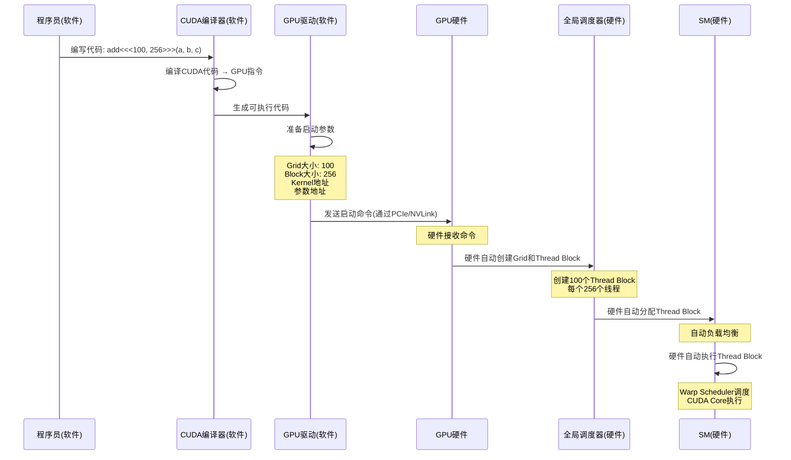

# 00_Z07_Y02_Kernel启动机制_详解

## 📚 问题

**Kernel启动是硬件还是软件的？**

Kernel启动（`add<<<100, 256>>>(a, b, c)`）是**混合过程**，涉及软件层和硬件层的协作。

---

## 🎯 最简单理解

### 一句话总结
**Kernel启动是混合过程：软件层负责"准备"（编写代码、编译、准备参数），硬件层负责"执行"（创建Grid、分配Thread Block、执行计算）。**

### 类比理解

**Kernel启动 = 工厂生产订单**

- **软件层 = 订单准备**:
  - 客户（程序员）下订单
  - 办公室（编译器）准备订单文件
  - 调度员（驱动）准备生产计划

- **硬件层 = 工厂生产**:
  - 工厂（GPU硬件）接收订单
  - 自动分配任务到车间（SM）
  - 车间自动生产（执行计算）

订单准备是"慢"的（软件），但工厂生产是"快"的（硬件）！

---

## 🔍 知识点分解

### Z07_Y02.1 Kernel启动的完整流程

#### Z07_Y02.1.1 软件层和硬件层的分工

Kernel启动涉及两个层次：

```
┌─────────────────────────────────────────────────────────┐
│                   软件层（Software Layer）                │
├─────────────────────────────────────────────────────────┤
│ 1. 程序员编写代码                                        │
│    add<<<100, 256>>>(a, b, c);                          │
│                                                          │
│ 2. CUDA编译器（nvcc）编译                               │
│    └── 将CUDA代码编译成GPU指令（PTX/SASS）              │
│                                                          │
│ 3. GPU驱动（Driver）准备启动参数                        │
│    ├── Grid大小: 100个Thread Block                      │
│    ├── Block大小: 256个线程                             │
│    ├── Kernel代码地址                                    │
│    ├── 参数地址（a, b, c）                              │
│    └── 创建启动命令（Launch Command）                   │
│                                                          │
│ 4. GPU驱动发送命令到GPU硬件                             │
│    └── 通过PCIe/NVLink发送启动命令                      │
└─────────────────────────────────────────────────────────┘
                        ↓
┌─────────────────────────────────────────────────────────┐
│                   硬件层（Hardware Layer）               │
├─────────────────────────────────────────────────────────┤
│ 5. GPU硬件接收启动命令 ⚡                                │
│    └── GPU的命令队列（Command Queue）接收命令            │
│                                                          │
│ 6. GPU硬件创建Grid和Thread Block ⚡                      │
│    ├── 全局调度器（硬件电路）创建100个Thread Block       │
│    ├── 每个Thread Block包含256个线程                    │
│    └── 创建Thread Block元数据（索引、大小等）            │
│                                                          │
│ 7. GPU硬件分配Thread Block到SM ⚡                        │
│    └── 全局调度器（硬件电路）自动分配                    │
│                                                          │
│ 8. SM硬件执行Thread Block ⚡                              │
│    ├── SM接收Thread Block                                │
│    ├── Warp Scheduler调度warp                            │
│    └── CUDA Core/Tensor Core执行计算                     │
└─────────────────────────────────────────────────────────┘
```

---

### Z07_Y02.2 软件层的作用

#### Z07_Y02.2.1 软件层的四个步骤

1. **编写代码**: 
   - 程序员编写CUDA kernel代码
   - 指定Grid和Block的大小：`<<<100, 256>>>`

2. **编译代码**: 
   - CUDA编译器（nvcc）将CUDA代码编译成GPU指令
   - 生成PTX（中间代码）或SASS（机器码）

3. **准备参数**: 
   - GPU驱动准备kernel启动参数
   - 包括Grid大小、Block大小、kernel代码地址、参数地址等

4. **发送命令**: 
   - GPU驱动通过PCIe/NVLink发送启动命令到GPU硬件
   - 命令包含所有必要的信息

#### Z07_Y02.2.2 为什么软件层负责"准备"？

- **不需要纳秒级速度**: 准备代码、参数、命令不需要极快的速度
- **软件可以很好地完成**: 编译器、驱动等软件工具可以很好地完成这些工作
- **灵活性**: 软件层可以提供更多的灵活性和可配置性

---

### Z07_Y02.3 硬件层的作用

#### Z07_Y02.3.1 硬件层的四个步骤

1. **接收命令**: 
   - GPU硬件的命令队列接收启动命令
   - 硬件自动解析命令内容

2. **创建Grid和Thread Block**: 
   - GPU硬件自动创建Grid结构
   - 硬件自动创建100个Thread Block的元数据
   - **完全由硬件电路完成，零延迟**

3. **分配Thread Block**: 
   - 全局调度器（硬件电路）自动将Thread Block分配给SM
   - **硬件自动负载均衡，纳秒级完成**

4. **执行计算**: 
   - SM硬件自动执行Thread Block
   - Warp Scheduler自动调度warp
   - CUDA Core/Tensor Core自动执行计算

#### Z07_Y02.3.2 为什么硬件层负责"执行"？

- **需要纳秒级速度**: 创建Grid、分配Thread Block、执行计算需要极快的速度
- **只有硬件电路才能达到**: 软件无法达到纳秒级的响应速度
- **并行性**: 硬件可以并行处理多个Thread Block的创建和分配

---

### Z07_Y02.4 为什么是混合过程？

#### Z07_Y02.4.1 分工明确

1. **软件层负责"准备"**: 
   - 准备代码、参数、命令
   - 这些工作不需要纳秒级速度
   - 软件可以很好地完成

2. **硬件层负责"执行"**: 
   - 创建Grid、分配Thread Block、执行计算
   - 这些工作需要纳秒级速度
   - 只有硬件电路才能达到

3. **分工明确**: 
   - 软件做"慢"的工作（准备）
   - 硬件做"快"的工作（执行）

#### Z07_Y02.4.2 性能优势

- ✅ **软件层**: 提供灵活性和可配置性
- ✅ **硬件层**: 提供极致的性能和并行性
- ✅ **协作**: 两者协作，发挥各自优势

---

## 📊 可视化：Kernel启动的时序图

### Z07_Y02.5 Kernel启动的时序图



---

## 📊 可视化：Kernel启动的层次结构

### Z07_Y02.6 Kernel启动的层次结构

```
┌─────────────────────────────────────────────────────────┐
│                   软件层（Software）                      │
│                                                          │
│  ┌──────────────────────────────────────────────────┐  │
│  │  程序员: add<<<100, 256>>>(a, b, c)              │  │
│  └──────────────────────────────────────────────────┘  │
│                          ↓                              │
│  ┌──────────────────────────────────────────────────┐  │
│  │  CUDA编译器: 编译代码 → GPU指令                   │  │
│  └──────────────────────────────────────────────────┘  │
│                          ↓                              │
│  ┌──────────────────────────────────────────────────┐  │
│  │  GPU驱动: 准备启动参数和命令                      │  │
│  └──────────────────────────────────────────────────┘  │
│                          ↓                              │
│  ┌──────────────────────────────────────────────────┐  │
│  │  发送命令到GPU硬件（PCIe/NVLink）                 │  │
│  └──────────────────────────────────────────────────┘  │
└─────────────────────────────────────────────────────────┘
                        ↓
┌─────────────────────────────────────────────────────────┐
│                   硬件层（Hardware）                      │
│                                                          │
│  ┌──────────────────────────────────────────────────┐  │
│  │  GPU硬件: 接收启动命令 ⚡                          │  │
│  └──────────────────────────────────────────────────┘  │
│                          ↓                              │
│  ┌──────────────────────────────────────────────────┐  │
│  │  全局调度器: 创建Grid和Thread Block ⚡             │  │
│  │  - 自动创建100个Thread Block                      │  │
│  │  - 每个Thread Block 256个线程                     │  │
│  └──────────────────────────────────────────────────┘  │
│                          ↓                              │
│  ┌──────────────────────────────────────────────────┐  │
│  │  全局调度器: 分配Thread Block到SM ⚡               │  │
│  │  - 自动负载均衡                                   │  │
│  │  - 纳秒级完成                                     │  │
│  └──────────────────────────────────────────────────┘  │
│                          ↓                              │
│  ┌──────────────────────────────────────────────────┐  │
│  │  SM硬件: 执行Thread Block ⚡                        │  │
│  │  - Warp Scheduler调度warp                         │  │
│  │  - CUDA Core执行计算                              │  │
│  └──────────────────────────────────────────────────┘  │
└─────────────────────────────────────────────────────────┘
```

---

## ✅ 总结

### 核心要点

1. **混合过程**: Kernel启动是软件层和硬件层协作的过程
2. **软件层**: 负责准备代码、参数、命令（慢速工作）
3. **硬件层**: 负责创建Grid、分配Thread Block、执行计算（快速工作）
4. **硬件自动**: Grid创建、Thread Block分配、计算执行**完全由硬件自动完成**
5. **零延迟**: 硬件层的操作可以达到纳秒级，软件无法达到

### 关键理解

- ✅ **软件层**: 负责准备代码、参数、命令（慢速工作）
- ✅ **硬件层**: 负责创建Grid、分配Thread Block、执行计算（快速工作）
- ✅ **混合过程**: Kernel启动是软件和硬件协作的过程
- ✅ **硬件自动**: Grid创建、Thread Block分配、计算执行**完全由硬件自动完成**
- ✅ **零延迟**: 硬件层的操作可以达到纳秒级，软件无法达到

---

## 🔗 相关文档

### 内部文档
- [00_Z7_GPU基本计算单元_SM_详解.md](./00_Z7_GPU基本计算单元_SM_详解.md) - SM详解
- [00_Z07_Y01_Thread_Block_详解.md](./00_Z07_Y01_Thread_Block_详解.md) - Thread Block详解

---

## 🔗 外部资源

### 官方文档
- [NVIDIA CUDA C++ Programming Guide - Execution Configuration](https://docs.nvidia.com/cuda/cuda-c-programming-guide/index.html#execution-configuration) ⭐⭐⭐ - Kernel启动配置官方文档
- [NVIDIA CUDA C++ Programming Guide - Hardware Implementation](https://docs.nvidia.com/cuda/cuda-c-programming-guide/index.html#hardware-implementation) ⭐⭐⭐ - GPU硬件实现详解，包括调度机制

### 技术博客
- [NVIDIA Developer Blog - CUDA Kernel Launch](https://developer.nvidia.com/blog/cuda-pro-tip-occupancy-api-simplifies-launch-configuration/) ⭐⭐ - CUDA Kernel启动和Occupancy优化

### GitHub资源
- [CUDA Samples](https://github.com/NVIDIA/cuda-samples) ⭐⭐ - NVIDIA官方CUDA示例代码，包含Kernel启动示例
