# 00_Z8_Feed_Forward_Network_详解

## 📚 问题

**什么是Feed-Forward Network (FFN)？**

在Transformer架构中，除了Attention机制，还有一个重要的组件就是Feed-Forward Network (FFN)。FFN是什么？它的作用是什么？为什么需要它？

---

## 🔍 知识点分解

### Z8.1 FFN基础概念

#### Z8.1.1 FFN的定义
- [ ] **FFN的定义**: 两层全连接网络（Two-Layer Fully Connected Network）
- [ ] **FFN的位置**: 在Transformer layer中，位于Multi-Head Attention之后
- [ ] **FFN的作用**: 对每个位置独立进行非线性变换
- [ ] **FFN的独立性**: 每个位置（token）的FFN计算是独立的，不依赖其他位置

**官方文档**:
- [Attention Is All You Need - Section 3.3](https://arxiv.org/abs/1706.03762) ⭐⭐⭐

#### Z8.1.2 FFN在Transformer中的位置
- [ ] **Transformer Layer的完整结构**:
  1. Multi-Head Attention
  2. Add & Norm (残差连接 + Layer Normalization)
  3. **Feed-Forward Network** ← FFN在这里
  4. Add & Norm (残差连接 + Layer Normalization)
- [ ] **FFN的输入**: Attention的输出（经过残差连接和Layer Norm）
- [ ] **FFN的输出**: 经过非线性变换的特征表示

**架构图**:
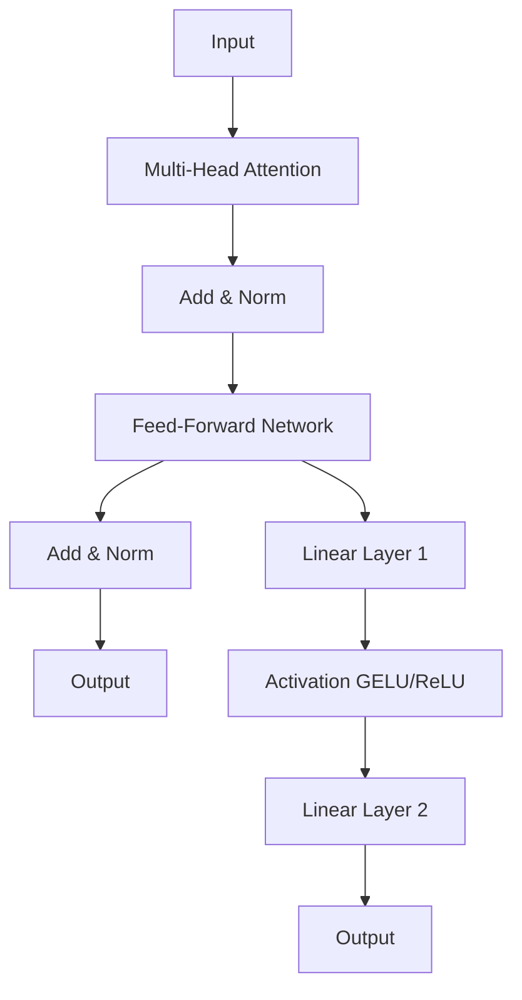

---

### Z8.2 FFN的结构详解

#### Z8.2.1 FFN的两层结构
- [ ] **第一层（扩展层）**: 
  - [ ] 输入维度: `hidden_size`
  - [ ] 输出维度: `intermediate_size`
  - [ ] 权重矩阵形状: `[hidden_size, intermediate_size]`
  - [ ] 通常 `intermediate_size = 4 * hidden_size`
  - [ ] 例如: hidden_size=512 → intermediate_size=2048
- [ ] **激活函数**: 
  - [ ] GELU (Gaussian Error Linear Unit) - 更常用
  - [ ] ReLU (Rectified Linear Unit) - 早期模型使用
- [ ] **第二层（压缩层）**: 
  - [ ] 输入维度: `intermediate_size`
  - [ ] 输出维度: `hidden_size`
  - [ ] 权重矩阵形状: `[intermediate_size, hidden_size]`

**结构图**:
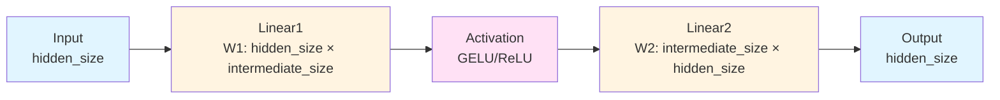

**数据流图**:
```
输入: [batch_size, seq_len, hidden_size]
  ↓
第一层线性变换: [hidden_size, intermediate_size]
  ↓
激活函数: GELU/ReLU
  ↓
第二层线性变换: [intermediate_size, hidden_size]
  ↓
输出: [batch_size, seq_len, hidden_size]
```

#### Z8.2.2 FFN的维度变化
- [ ] **输入维度**: `[batch_size, seq_len, hidden_size]`
- [ ] **第一层后**: `[batch_size, seq_len, intermediate_size]`
  - [ ] 维度扩展（通常4倍）
- [ ] **激活后**: `[batch_size, seq_len, intermediate_size]`
  - [ ] 维度不变，但应用非线性
- [ ] **第二层后**: `[batch_size, seq_len, hidden_size]`
  - [ ] 维度压缩回原始大小

**维度变化可视化**:
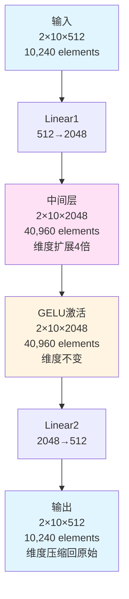

**维度变化示例**:
```
假设: batch_size=2, seq_len=10, hidden_size=512, intermediate_size=2048

输入: [2, 10, 512]
  ↓ Linear1: [512, 2048]
中间: [2, 10, 2048]  ← 维度扩展
  ↓ GELU
激活: [2, 10, 2048]  ← 维度不变，应用非线性
  ↓ Linear2: [2048, 512]
输出: [2, 10, 512]   ← 维度压缩回原始大小
```

---

### Z8.3 FFN的数学公式

#### Z8.3.1 ReLU版本的FFN公式
- [ ] **公式**: `FFN(x) = max(0, xW1 + b1)W2 + b2`
- [ ] **步骤分解**:
  1. `h = xW1 + b1` - 第一层线性变换
  2. `h = max(0, h)` - ReLU激活函数
  3. `y = hW2 + b2` - 第二层线性变换
- [ ] **参数说明**:
  - [ ] `x`: 输入，形状 `[batch_size, seq_len, hidden_size]`
  - [ ] `W1`: 第一层权重，形状 `[hidden_size, intermediate_size]`
  - [ ] `b1`: 第一层偏置，形状 `[intermediate_size]`
  - [ ] `W2`: 第二层权重，形状 `[intermediate_size, hidden_size]`
  - [ ] `b2`: 第二层偏置，形状 `[hidden_size]`

#### Z8.3.2 GELU版本的FFN公式
- [ ] **公式**: `FFN(x) = GELU(xW1 + b1)W2 + b2`
- [ ] **GELU函数**: `GELU(x) = x * Φ(x)`
  - [ ] 其中 `Φ(x)` 是标准正态分布的累积分布函数
  - [ ] 近似公式: `GELU(x) ≈ 0.5x(1 + tanh(√(2/π)(x + 0.044715x³)))`
- [ ] **步骤分解**:
  1. `h = xW1 + b1` - 第一层线性变换
  2. `h = GELU(h)` - GELU激活函数
  3. `y = hW2 + b2` - 第二层线性变换

**激活函数对比图**:
```mermaid
graph TD
    A[输入 x] --> B{激活函数类型}
    B -->|ReLU| C[max(0, x)<br/>简单快速]
    B -->|GELU| D[x * Φ(x)<br/>平滑连续]
    C --> E[输出]
    D --> E
    
    style C fill:#ffe1f5
    style D fill:#e1f5ff
```

**公式对比**:
| 激活函数 | 公式 | 特点 | 适用场景 |
|---------|------|------|---------|
| ReLU | `FFN(x) = max(0, xW1 + b1)W2 + b2` | 简单，计算快 | 早期Transformer模型 |
| GELU | `FFN(x) = GELU(xW1 + b1)W2 + b2` | 平滑，性能更好 | 现代Transformer模型（BERT、GPT等） |

---

### Z8.4 FFN的作用和意义

#### Z8.4.1 FFN的核心作用
- [ ] **非线性变换**: 
  - [ ] Attention是线性变换的组合（虽然有softmax，但整体是线性的）
  - [ ] FFN提供非线性变换能力
  - [ ] 使模型能够学习复杂的特征表示
- [ ] **特征增强**: 
  - [ ] 对Attention输出的特征进行进一步处理
  - [ ] 扩展特征空间（intermediate_size > hidden_size）
  - [ ] 然后压缩回原始维度
- [ ] **位置独立处理**: 
  - [ ] 每个位置（token）的FFN计算是独立的
  - [ ] 不依赖其他位置的信息
  - [ ] 与Attention形成互补（Attention关注位置间关系）

#### Z8.4.2 为什么需要FFN
- [ ] **Attention的局限性**: 
  - [ ] Attention主要关注位置间的关系
  - [ ] 对单个位置的特征变换能力有限
- [ ] **FFN的补充**: 
  - [ ] FFN专注于单个位置的特征变换
  - [ ] 提供强大的非线性变换能力
  - [ ] 与Attention形成互补
- [ ] **表达能力**: 
  - [ ] Attention + FFN 的组合使Transformer具有强大的表达能力
  - [ ] 既能关注全局关系，又能进行局部特征变换

**互补关系图**:
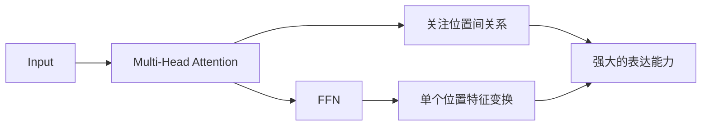

---

### Z8.5 FFN的计算过程

#### Z8.5.1 完整计算流程
- [ ] **步骤1: 接收输入**
  - [ ] 输入: Attention的输出（经过残差连接和Layer Norm）
  - [ ] 形状: `[batch_size, seq_len, hidden_size]`
- [ ] **步骤2: 第一层线性变换**
  - [ ] `h1 = x @ W1 + b1`
  - [ ] 形状变化: `[batch_size, seq_len, hidden_size]` → `[batch_size, seq_len, intermediate_size]`
- [ ] **步骤3: 激活函数**
  - [ ] `h2 = GELU(h1)` 或 `h2 = ReLU(h1)`
  - [ ] 形状不变: `[batch_size, seq_len, intermediate_size]`
- [ ] **步骤4: 第二层线性变换**
  - [ ] `y = h2 @ W2 + b2`
  - [ ] 形状变化: `[batch_size, seq_len, intermediate_size]` → `[batch_size, seq_len, hidden_size]`
- [ ] **步骤5: 输出**
  - [ ] 输出: `[batch_size, seq_len, hidden_size]`
  - [ ] 与输入维度相同

**计算流程图**:
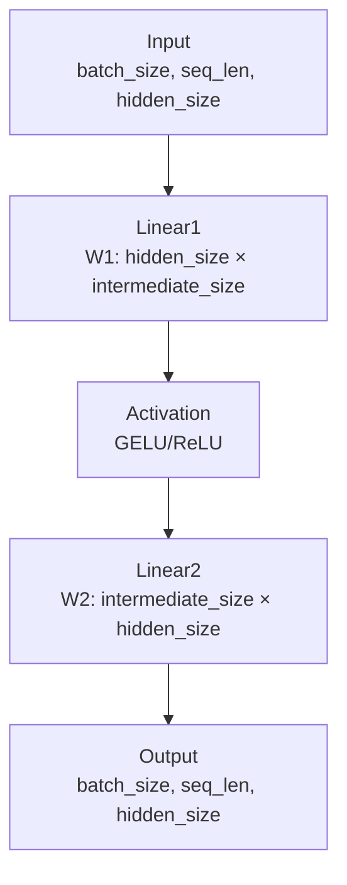

#### Z8.5.2 位置独立性
- [ ] **每个位置独立计算**: 
  - [ ] 对于输入序列中的每个位置，FFN独立计算
  - [ ] 位置i的输出只依赖于位置i的输入
  - [ ] 不同位置之间没有信息交互
- [ ] **并行计算**: 
  - [ ] 所有位置的FFN可以并行计算
  - [ ] 在GPU上可以高效实现
- [ ] **与Attention的对比**: 
  - [ ] Attention: 需要所有位置的信息（位置间交互）
  - [ ] FFN: 只需要单个位置的信息（位置独立）

**位置独立性可视化**:
```mermaid
graph TD
    A[输入序列<br/>token1, token2, ..., tokenN] --> B[并行FFN计算]
    B --> C1[FFN(token1)<br/>独立计算]
    B --> C2[FFN(token2)<br/>独立计算]
    B --> C3[FFN(token3)<br/>独立计算]
    B --> C4[...]
    B --> CN[FFN(tokenN)<br/>独立计算]
    C1 --> D[输出序列<br/>output1, output2, ..., outputN]
    C2 --> D
    C3 --> D
    C4 --> D
    CN --> D
    
    style B fill:#fff4e1
    style D fill:#e1f5ff
```

**位置独立性示例**:
```
输入序列: [token1, token2, token3, ..., tokenN]

FFN计算:
  FFN(token1) → output1  (只依赖token1)
  FFN(token2) → output2  (只依赖token2)
  FFN(token3) → output3  (只依赖token3)
  ...
  FFN(tokenN) → outputN  (只依赖tokenN)

所有计算可以并行执行！
```

**与Attention的对比**:
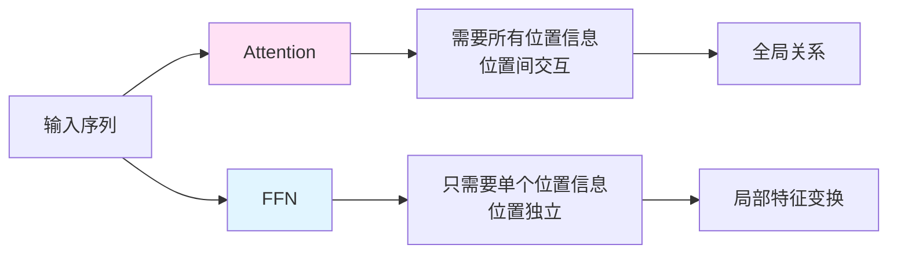

---

### Z8.6 FFN的参数规模

#### Z8.6.1 参数计算
- [ ] **第一层参数**: 
  - [ ] 权重: `hidden_size × intermediate_size`
  - [ ] 偏置: `intermediate_size`
  - [ ] 总计: `hidden_size × intermediate_size + intermediate_size`
- [ ] **第二层参数**: 
  - [ ] 权重: `intermediate_size × hidden_size`
  - [ ] 偏置: `hidden_size`
  - [ ] 总计: `intermediate_size × hidden_size + hidden_size`
- [ ] **总参数**: 
  - [ ] `2 × hidden_size × intermediate_size + intermediate_size + hidden_size`
  - [ ] 通常 `intermediate_size = 4 × hidden_size`
  - [ ] 近似: `8 × hidden_size² + 5 × hidden_size`

#### Z8.6.2 参数规模示例
- [ ] **小模型** (hidden_size=512, intermediate_size=2048):
  - [ ] 第一层: 512 × 2048 + 2048 = 1,049,600
  - [ ] 第二层: 2048 × 512 + 512 = 1,049,088
  - [ ] 总计: 2,098,688 参数
- [ ] **中等模型** (hidden_size=1024, intermediate_size=4096):
  - [ ] 第一层: 1024 × 4096 + 4096 = 4,198,400
  - [ ] 第二层: 4096 × 1024 + 1024 = 4,198,400
  - [ ] 总计: 8,396,800 参数
- [ ] **大模型** (hidden_size=4096, intermediate_size=16384):
  - [ ] 第一层: 4096 × 16384 + 16384 = 67,125,248
  - [ ] 第二层: 16384 × 4096 + 4096 = 67,125,248
  - [ ] 总计: 134,250,496 参数

**参数规模对比表**:
| 模型规模 | hidden_size | intermediate_size | FFN参数数量 | 占总参数比例 |
|---------|------------|-------------------|------------|------------|
| 小 | 512 | 2048 | ~2.1M | ~33% |
| 中 | 1024 | 4096 | ~8.4M | ~33% |
| 大 | 4096 | 16384 | ~134M | ~33% |

**参数规模可视化**:
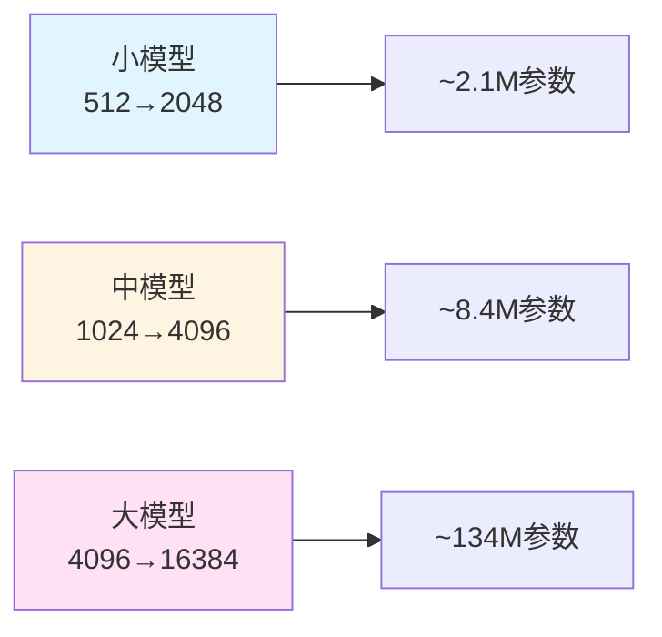

**参数分布图**:
```
FFN参数通常占Transformer总参数的约33%
├── Attention参数: ~33%
├── FFN参数: ~33%  ← FFN在这里
└── 其他参数: ~34% (Embedding, LayerNorm等)
```

---

### Z8.7 FFN的变体

#### Z8.7.1 SwiGLU (Swish-Gated Linear Unit)
- [ ] **结构**: 使用门控机制
- [ ] **公式**: `FFN(x) = (Swish(xW1) ⊙ (xW3))W2`
  - [ ] `W1, W3`: gate和up投影（列并行）
  - [ ] `W2`: down投影（行并行）
  - [ ] `⊙`: 逐元素相乘（Hadamard product）
- [ ] **优势**: 
  - [ ] 更强的表达能力
  - [ ] 在MoE模型中常用
- [ ] **应用**: LLaMA、Mixtral等模型

**SwiGLU结构图**:
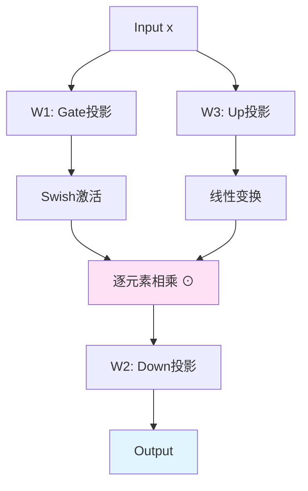

#### Z8.7.2 GLU (Gated Linear Unit)
- [ ] **结构**: 类似SwiGLU，但使用不同的激活函数
- [ ] **公式**: `FFN(x) = (GELU(xW1) ⊙ (xW3))W2`
- [ ] **变体**: 
  - [ ] ReGLU: 使用ReLU
  - [ ] GeGLU: 使用GELU
  - [ ] SwiGLU: 使用Swish

**GLU变体对比图**:
```mermaid
graph TD
    A[标准FFN<br/>GELU(xW1)W2] --> A1[简单经典]
    B[GLU<br/>GELU(xW1) ⊙ xW3] --> B1[门控机制]
    C[SwiGLU<br/>Swish(xW1) ⊙ xW3] --> C1[最强表达能力]
    
    style A fill:#e1f5ff
    style B fill:#fff4e1
    style C fill:#ffe1f5
```

**变体对比**:
| 变体 | 公式 | 特点 | 应用模型 |
|------|------|------|---------|
| 标准FFN | `GELU(xW1)W2` | 简单，经典 | BERT、GPT-2 |
| GLU | `(GELU(xW1) ⊙ (xW3))W2` | 门控机制 | T5 |
| SwiGLU | `(Swish(xW1) ⊙ (xW3))W2` | 更强的表达能力 | LLaMA、Mixtral |

---

### Z8.8 FFN在推理中的计算

#### Z8.8.1 Prefill阶段的FFN
- [ ] **输入**: 所有位置的hidden states
- [ ] **形状**: `[batch_size, seq_len, hidden_size]`
- [ ] **计算**: 
  - [ ] 所有位置并行计算
  - [ ] 矩阵乘法: `[batch_size, seq_len, hidden_size] @ [hidden_size, intermediate_size]`
- [ ] **特点**: 
  - [ ] 计算量大（需要处理所有位置）
  - [ ] 但可以并行，效率高

**Prefill阶段FFN详细流程图**:
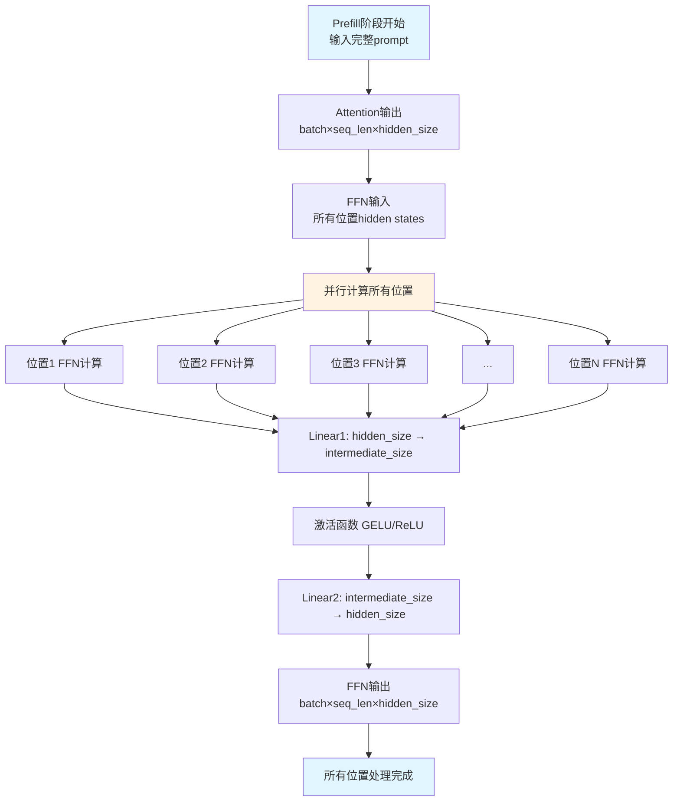

**Prefill阶段矩阵乘法可视化**:
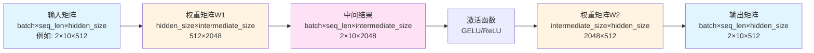

**Prefill阶段并行计算示意图**:
```
时间轴: t=0 → t=1 → t=2 → t=3

所有位置同时计算:
┌─────────────────────────────────────┐
│ 位置1: token1 → FFN → output1      │ ← 并行
│ 位置2: token2 → FFN → output2      │ ← 并行
│ 位置3: token3 → FFN → output3      │ ← 并行
│ ...                                 │
│ 位置N: tokenN → FFN → outputN     │ ← 并行
└─────────────────────────────────────┘
         ↓
    一次性完成所有计算
```

**Prefill阶段计算复杂度**:
- [ ] **时间复杂度**: O(seq_len × hidden_size × intermediate_size)
- [ ] **空间复杂度**: O(seq_len × intermediate_size)
- [ ] **并行度**: seq_len（所有位置可以并行）
- [ ] **GPU利用率**: 高（充分利用GPU的并行计算能力）

**相关文档**:
- [LLM Inference Explained - Prefill Phase](https://lilianweng.github.io/posts/2023-01-10-inference-optimization/#prefill-phase) ⭐⭐⭐ - Prefill阶段的详细解释，必读
- [Understanding LLM Inference Performance](https://www.anyscale.com/blog/understanding-llm-inference-performance) ⭐⭐ - LLM推理性能分析
- [LLM常见问题（激活函数部分）](https://juejin.cn/post/7309158163941277706) ⭐⭐ - 掘金技术社区，FFN块详解
- [前馈神经网络（Feed-Forward Network, FFN）](https://blog.csdn.net/m0_59267400/article/details/145462146) ⭐⭐ - CSDN博客，FFN完整详解和代码实现
- [Transformer 论文通俗解读：FFN 中的非线性表达](https://qianfan.cloud.baidu.com/qianfandev/topic/362410) ⭐⭐ - 百度智能云千帆社区，FFN非线性表达解析
- [探秘Transformer系列之（13）--- FFN](https://www.cnblogs.com/rossiXYZ/p/18765884) ⭐⭐ - 博客园，FFN知识存储机制深度分析

#### Z8.8.2 Decode阶段的FFN
- [ ] **输入**: 当前token的hidden state
- [ ] **形状**: `[batch_size, 1, hidden_size]`
- [ ] **计算**: 
  - [ ] 只计算当前token
  - [ ] 矩阵乘法: `[batch_size, 1, hidden_size] @ [hidden_size, intermediate_size]`
- [ ] **特点**: 
  - [ ] 计算量小（只处理单个token）
  - [ ] 但需要串行执行

**Prefill vs Decode对比**:
| 阶段 | 输入形状 | 计算量 | 并行性 | 特点 |
|------|---------|-------|--------|------|
| Prefill | `[batch, seq_len, hidden]` | 大 | 高（所有位置并行） | 一次性处理所有token |
| Decode | `[batch, 1, hidden]` | 小 | 低（串行） | 逐个生成token |

**推理阶段对比图**:
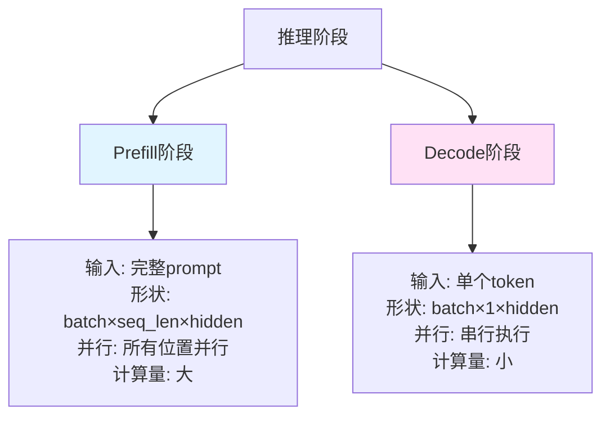

**计算流程对比**:
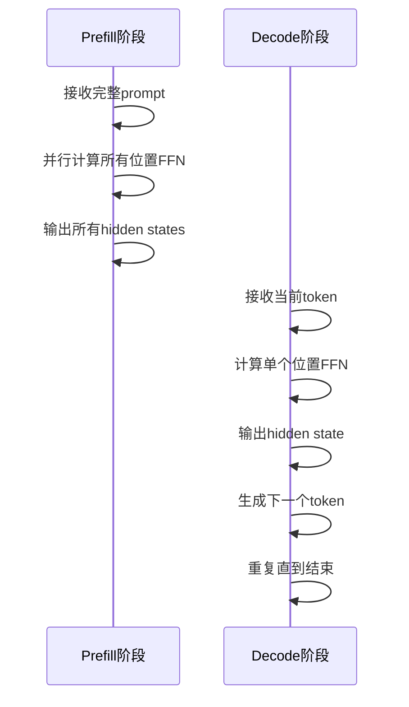

---

## 🔗 相关文档

### 官方文档
- [Attention Is All You Need - Section 3.3](https://arxiv.org/abs/1706.03762) ⭐⭐⭐ - Transformer原始论文，FFN的定义
- [The Illustrated Transformer - Feed Forward](https://jalammar.github.io/illustrated-transformer/) ⭐⭐⭐ - FFN的可视化解释，强烈推荐
- [Hugging Face Transformers - Feed Forward](https://huggingface.co/docs/transformers/model_doc/bert#transformers.BertModel) ⭐⭐ - BERT中FFN的实现

### 技术博客
- [Understanding Feed-Forward Networks in Transformers](https://lilianweng.github.io/posts/2023-01-27-the-transformer-family-v2/) ⭐⭐⭐ - Lilian Weng的深入解释，必读
- [深入解析Transformers：Feed-Forward Layer的角色与重要性](https://developer.baidu.com/article/details/3216754) ⭐⭐ - 百度开发者文章，FFN角色分析
- [一文彻底搞懂Transformer - FFNN（前馈神经网络）](https://developer.volcengine.com/articles/7389180577108852773) ⭐⭐ - 火山引擎开发者文章，FFN详解
- [探秘Transformer系列之（13）--- Feed-Forward Networks从零开始解析](https://juejin.cn/post/7481484509436657704) ⭐⭐ - 掘金技术社区，FFN从零解析
- [拆解 Transformer 的 "隐形大佬"：前馈神经网络（FFN）核心精讲](https://www.woshipm.com/ai/6275496.html) ⭐⭐ - 产品经理社区，FFN核心精讲
- [从零开始了解transformer的机制|第四章：FFN层的作用](https://blog.csdn.net/weixin_73179708/article/details/132516512) ⭐⭐ - CSDN博客，FFN层作用详解

### 论文和研究
- [GLU Variants Improve Transformer](https://arxiv.org/abs/2002.05202) ⭐⭐⭐ - GLU变体的论文，SwiGLU等变体的理论基础
- [Gaussian Error Linear Units (GELU)](https://arxiv.org/abs/1606.08415) ⭐⭐ - GELU激活函数的原始论文
- [PaLM: Scaling Language Modeling with Pathways](https://arxiv.org/abs/2204.02311) ⭐⭐ - Google的PaLM论文，使用SwiGLU

### 代码实现
- [PyTorch nn.Linear](https://pytorch.org/docs/stable/generated/torch.nn.Linear.html) ⭐⭐ - PyTorch线性层实现
- [Hugging Face BERT FFN实现](https://github.com/huggingface/transformers/blob/main/src/transformers/models/bert/modeling_bert.py) ⭐⭐ - BERT中FFN的代码实现
- [SGLang FFN相关代码](https://github.com/sgl-project/sglang) ⭐⭐ - SGLang框架中的FFN实现

### 相关概念
- [00_基础概念完整学习指南.md](./00_基础概念完整学习指南.md) - 主学习指南，包含FFN的基础知识点
- [00_Z3_Attention_Head_详解.md](./00_Z3_Attention_Head_详解.md) - Multi-Head Attention详解
- [00_Z1_Scaled_Dot_Product_Attention_详解.md](./00_Z1_Scaled_Dot_Product_Attention_详解.md) - Attention机制详解

---

## 📝 总结

### 关键要点
1. **FFN的定义**: 两层全连接网络，位于Transformer layer中
2. **FFN的结构**: 
   - 第一层: `[hidden_size, intermediate_size]`，通常intermediate_size = 4 * hidden_size
   - 激活函数: GELU或ReLU
   - 第二层: `[intermediate_size, hidden_size]`
3. **FFN的公式**: 
   - ReLU: `FFN(x) = max(0, xW1 + b1)W2 + b2`
   - GELU: `FFN(x) = GELU(xW1 + b1)W2 + b2`
4. **FFN的作用**: 对每个位置独立进行非线性变换，与Attention形成互补
5. **FFN的位置**: 在Attention之后，每个Transformer layer中

### 学习检查清单
- [ ] 理解FFN的定义和结构
- [ ] 掌握FFN的数学公式（ReLU和GELU版本）
- [ ] 理解FFN的作用和意义
- [ ] 了解FFN在Transformer中的位置
- [ ] 理解FFN的位置独立性
- [ ] 了解FFN的参数规模
- [ ] 了解FFN的变体（GLU、SwiGLU等）
- [ ] 理解FFN在推理中的计算（Prefill vs Decode）

---

**开始深入学习FFN！** 🎓
