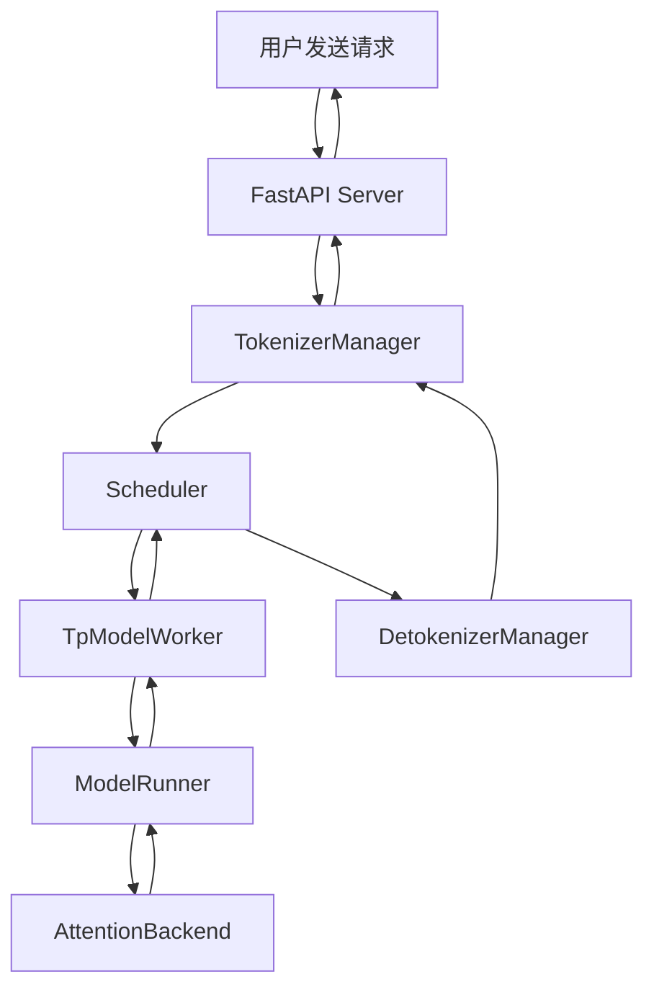

# Case Study 02: SGLang 请求处理流程详解

## 📚 文档信息

**目的**：理解 SGLang 从请求到响应的完整处理流程  
**适用场景**：理解系统架构、定位问题、添加新功能

---

## 🎯 核心问题

**如果要换 model，是在哪一层？其他层需要变吗？**

**答案**：主要在 **ModelRunner** 层（以及底层的 AttentionBackend），其他层（API、Scheduler、TokenizerManager 等）基本不变。

---

## 📋 完整请求处理流程

### 流程图



### 详细流程步骤

#### 阶段 1: 请求接收和预处理

**1.1 用户启动 Server**
```
初始化组件：
├── FastAPI App
├── TokenizerManager（运行无限事件循环）
├── DetokenizerManager（运行无限事件循环）
└── Scheduler（运行无限事件循环）
```

**1.2 用户发送请求**
```
POST /v1/chat/completions
{
  "model": "qwen/qwen2.5-7b-instruct",
  "messages": [...]
}
```

**1.3 FastAPI Server 处理**
- `v1_chat_completions` endpoint 接收请求
- 将请求转发到 `TokenizerManager`

**1.4 TokenizerManager 处理**
- `v1_chat_completions` 函数：
  - 将请求转换为 `ChatCompletionRequest`
  - 转换为 `GenerateReqInput`
  - 调用 `TokenizerManager.generate_request()`
- TokenizerManager：
  - 对请求进行 **tokenization**（文本 → token IDs）
  - 以 Python 对象（pyobj）形式转发给 `Scheduler`
  - 调用 `_wait_one_response()` 等待响应

---

#### 阶段 2: Scheduler 调度和处理

**2.1 Scheduler 接收请求**
```
event_loop_normal 事件循环：
├── recv_requests() 接收请求
├── process_input_requests() 处理输入
└── handle_generate_request() 管理生成请求逻辑
```

**2.2 请求入队**
- 将请求加入 `waiting_queue`
- 等待调度

**2.3 批次调度**
```
get_next_batch_to_run():
├── 从 waiting_queue 选择请求
├── 创建 ScheduleBatch
└── 准备执行
```

**2.4 执行批次**
```
run_batch():
├── ScheduleBatch → ModelWorkerBatch
└── 调用 TpModelWorker.forward_batch_generation()
```

---

#### 阶段 3: 模型推理（核心层）

**3.1 TpModelWorker 处理**
```
TpModelWorker.forward_batch_generation():
├── 初始化 ForwardBatch
├── 转发至 ModelRunner
└── 等待 logits_output 和 next_token_ids
```

**3.2 ModelRunner 执行前向计算** ⭐ **换 Model 的主要位置**
```
ModelRunner:
├── 接收 ForwardBatch
├── forward_extend() 执行模型前向计算
│   ├── 调用底层模型实现
│   ├── 通过 AttentionBackend 加速
│   └── 生成 logits
└── 返回 logits_output
```

**3.3 AttentionBackend 加速** ⭐ **换 Model 的底层实现**
```
AttentionBackend:
├── 执行注意力计算
├── 优化 GPU kernel 调用
└── 返回计算结果
```

**3.4 采样生成 token**
```
TpModelWorker:
├── 从 ModelRunner 接收 logits_output
├── 调用 ModelRunner.sample() 生成 next_token_ids
└── 发送回 Scheduler
```

---

#### 阶段 4: 结果处理和返回

**4.1 Scheduler 处理批次结果**
```
process_batch_result():
├── 处理批次结果
├── tree_cache.cache_finished_req(req) 缓存请求
├── check_finished() 验证完成状态
└── 未完成 → 继续事件循环
    完成 → stream_output()
```

**4.2 输出流处理**
```
stream_output():
├── 处理输出
├── 包装成 BatchTokenIDOut
└── 发送给 DetokenizerManager
```

**4.3 DetokenizerManager 处理**
```
事件循环：
├── 接收 BatchTokenIDOut
├── 处理（detokenization: token IDs → 文本）
├── 生成 BatchStrOut
└── 返回给 TokenizerManager
```

**4.4 TokenizerManager 处理**
```
事件循环：
├── 接收结果
├── handle_loop() 处理并更新内部状态
└── 返回响应给 Server
```

**4.5 FastAPI Server 返回**
```
封装完成的响应 → 返回给用户
```

---

## 🔍 换 Model 的位置分析

### 核心问题：如果要换 model，是在哪一层？

#### 答案：主要在 ModelRunner 层（以及底层的 AttentionBackend）

### 为什么是 ModelRunner？

**ModelRunner 的职责**：
- 执行模型的前向计算（forward pass）
- 管理模型的状态（weights、KV cache 等）
- 调用底层实现（AttentionBackend）进行加速

**换 Model 需要改什么？**

1. **ModelRunner 的实现**：
   - 不同模型有不同的架构（Transformer、MoE 等）
   - 需要适配不同的 forward_extend 实现
   - 需要适配不同的权重加载方式

2. **底层 AttentionBackend**：
   - 不同模型可能需要不同的 attention 实现
   - 可能需要不同的 kernel 优化

3. **模型配置**：
   - 模型路径、配置参数等

### 其他层为什么不需要变？

#### 1. API 层（FastAPI Server）✅ 不变

**原因**：
- API 层只负责接收请求和返回响应
- 不关心底层用的是什么模型
- 接口是标准化的（OpenAI-compatible）

**示例**：
```python
# API 层代码（伪代码）
@app.post("/v1/chat/completions")
async def v1_chat_completions(request: ChatCompletionRequest):
    # 不关心底层模型，只负责转发
    result = await tokenizer_manager.generate_request(request)
    return result
```

#### 2. TokenizerManager ✅ 基本不变

**原因**：
- 只负责 tokenization（文本 ↔ token IDs）
- 不同模型可能有不同的 tokenizer，但接口统一
- 可能需要加载不同的 tokenizer，但逻辑不变

**可能需要的小改动**：
- 加载对应模型的 tokenizer
- 但 `generate_request()` 等接口不变

#### 3. Scheduler ✅ 不变

**原因**：
- 只负责调度和批处理
- 不关心底层模型的具体实现
- 只关心输入输出格式（token IDs）

**示例**：
```python
# Scheduler 代码（伪代码）
def run_batch(self, batch: ScheduleBatch):
    # 不关心底层模型，只负责调度
    result = self.model_worker.forward_batch_generation(batch)
    return result
```

#### 4. TpModelWorker ✅ 基本不变

**原因**：
- 只负责协调 ModelRunner
- 不关心 ModelRunner 内部实现
- 接口统一（forward_batch_generation）

**可能需要的小改动**：
- 可能需要适配不同的并行策略（TP/SP）
- 但核心逻辑不变

#### 5. DetokenizerManager ✅ 基本不变

**原因**：
- 只负责 detokenization（token IDs → 文本）
- 不同模型可能有不同的 tokenizer，但接口统一
- 可能需要加载不同的 tokenizer，但逻辑不变

---

## 📊 架构层次总结

### 层次划分

```
┌─────────────────────────────────────┐
│  API Layer (FastAPI Server)        │  ← 不变
│  - 接收请求、返回响应                │
└─────────────────────────────────────┘
           ↓
┌─────────────────────────────────────┐
│  Tokenization Layer                 │  ← 基本不变（只需换 tokenizer）
│  - TokenizerManager                 │
│  - DetokenizerManager                │
└─────────────────────────────────────┘
           ↓
┌─────────────────────────────────────┐
│  Scheduling Layer (Scheduler)      │  ← 不变
│  - 请求调度、批处理                   │
└─────────────────────────────────────┘
           ↓
┌─────────────────────────────────────┐
│  Model Worker Layer (TpModelWorker) │  ← 基本不变
│  - 协调模型推理                       │
└─────────────────────────────────────┘
           ↓
┌─────────────────────────────────────┐
│  Model Layer (ModelRunner) ⭐        │  ← 主要改动位置
│  - 模型前向计算                       │
│  - 权重管理                           │
└─────────────────────────────────────┘
           ↓
┌─────────────────────────────────────┐
│  Backend Layer (AttentionBackend) ⭐ │  ← 底层实现
│  - 注意力计算加速                     │
│  - Kernel 优化                       │
└─────────────────────────────────────┘
```

### 换 Model 的影响范围

| 层级 | 是否需要改动 | 改动程度 | 说明 |
|------|-------------|---------|------|
| **API Layer** | ❌ 不需要 | 0% | 接口标准化，不关心底层模型 |
| **TokenizerManager** | ⚠️ 可能需要 | 10% | 只需加载对应模型的 tokenizer |
| **DetokenizerManager** | ⚠️ 可能需要 | 10% | 只需加载对应模型的 tokenizer |
| **Scheduler** | ❌ 不需要 | 0% | 只负责调度，不关心模型实现 |
| **TpModelWorker** | ⚠️ 可能需要 | 20% | 可能需要适配并行策略 |
| **ModelRunner** ⭐ | ✅ **需要** | **80%** | **主要改动位置** |
| **AttentionBackend** ⭐ | ✅ **需要** | **60%** | **底层实现** |

---

## 💡 实际换 Model 的步骤

### 步骤 1: 实现新的 ModelRunner

```python
# 新模型的 ModelRunner 实现
class NewModelRunner(ModelRunner):
    def __init__(self, model_path, ...):
        # 加载新模型的权重
        # 初始化新模型的架构
        pass
    
    def forward_extend(self, batch: ForwardBatch):
        # 实现新模型的前向计算
        # 调用对应的 AttentionBackend
        pass
    
    def sample(self, logits):
        # 实现采样逻辑（如果需要特殊处理）
        pass
```

### 步骤 2: 实现对应的 AttentionBackend（如果需要）

```python
# 新模型的 AttentionBackend 实现
class NewModelAttentionBackend(AttentionBackend):
    def forward(self, ...):
        # 实现新模型的 attention 计算
        # 优化 kernel 调用
        pass
```

### 步骤 3: 配置模型信息

```python
# 模型配置
MODEL_CONFIG = {
    "model_name": "new-model",
    "model_path": "path/to/model",
    "tokenizer_path": "path/to/tokenizer",
    "model_runner_class": NewModelRunner,
    "attention_backend_class": NewModelAttentionBackend,
}
```

### 步骤 4: 注册模型（如果需要）

```python
# 在模型注册表中注册新模型
MODEL_REGISTRY.register("new-model", MODEL_CONFIG)
```

---

## 🔗 相关代码位置（推测）

基于流程描述，相关代码可能在以下位置：

### SGLang 代码结构（推测）

```
sglang/
├── python/sglang/
│   ├── srt/
│   │   ├── server/
│   │   │   ├── api_server.py          # FastAPI Server
│   │   │   ├── tokenizer_manager.py   # TokenizerManager
│   │   │   ├── detokenizer_manager.py # DetokenizerManager
│   │   │   └── scheduler.py           # Scheduler
│   │   ├── model_executor/
│   │   │   ├── model_runner.py        # ModelRunner ⭐
│   │   │   ├── tp_model_worker.py     # TpModelWorker
│   │   │   └── attention_backend.py   # AttentionBackend ⭐
│   │   └── ...
│   └── ...
```

---

## ✅ 总结

### 核心答案

**如果要换 model，主要在 ModelRunner 层（以及底层的 AttentionBackend），其他层基本不变。**

### 关键点

1. **ModelRunner 是换 Model 的主要位置**
   - 负责模型的前向计算
   - 管理模型状态和权重
   - 需要适配不同模型的架构

2. **AttentionBackend 是底层实现**
   - 负责注意力计算的加速
   - 可能需要针对不同模型优化

3. **其他层基本不变**
   - API 层：接口标准化
   - Scheduler：只负责调度
   - TokenizerManager：只需换 tokenizer

4. **架构设计优势**
   - **分层清晰**：每层职责明确
   - **解耦合**：上层不依赖底层实现
   - **易扩展**：换 Model 只需改 ModelRunner

---

## 📝 学习要点

### 1. 分层架构设计

**关键原则**：
- ✅ **职责分离**：每层只负责自己的职责
- ✅ **接口抽象**：上层通过接口调用下层，不依赖具体实现
- ✅ **易扩展**：换底层实现不影响上层

### 2. 换 Model 的最佳实践

**关键步骤**：
1. 实现新的 ModelRunner
2. 实现对应的 AttentionBackend（如果需要）
3. 配置模型信息
4. 注册模型（如果需要）

**注意事项**：
- 保持接口一致性
- 确保性能优化
- 充分测试

---

**最后更新**: 2025年1月

**相关 Case Study**:
- [Case Study 01: Speed Up SGL-Kernel Build](./Case_Study_01_Speed_Up_SGL_Kernel_Build_PR18586.md)
