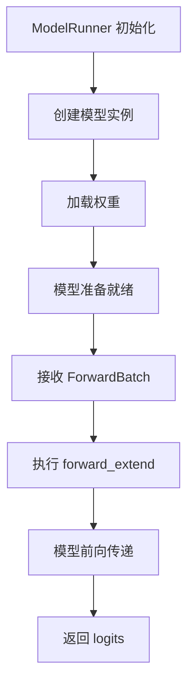

# Case Study 03: SGLang 模型定义和加载机制

## 📚 文档信息

**目的**：理解 SGLang 中模型的定义、加载和结构  
**适用场景**：理解模型架构、添加新模型支持、理解模型加载流程

---

## 🎯 核心问题

1. **`Qwen2ForCausalLM` 是 SGLang 对 model 的读入吗？**
2. **这种 model 的 head 或者内容是怎么定义的，谁定义的？业界有规矩吗？**
3. **Model 加载权重并执行前向传递的流程是什么？**

---

## 📋 Qwen2ForCausalLM 结构分析

### 代码结构

```python
class Qwen2ForCausalLM(nn.Module):
    def __init__(
        self,
        config: Qwen2Config,
        quant_config: Optional[QuantizationConfig] = None,
    ) -> None:
        super().__init__()
        self.config = config
        self.quant_config = quant_config
        self.model = Qwen2Model(config, quant_config=quant_config)
        if config.tie_word_embeddings:
            self.lm_head = self.model.embed_tokens
        else:
            self.lm_head = ParallelLMHead(
                config.vocab_size, config.hidden_size, quant_config=quant_config
            )
        self.logits_processor = LogitsProcessor(config)
        self.pooler = Pooler(pooling_type=PoolingType.LAST, normalize=True)
```

### 组件说明

#### 1. `self.model = Qwen2Model(...)`

**作用**：模型的主体部分，包含 Transformer 层

**内容**：
- Transformer blocks（多层注意力 + FFN）
- Layer normalization
- 权重参数（weights）

**职责**：
- 执行前向传递（forward pass）
- 生成 hidden states

#### 2. `self.lm_head`

**作用**：将 hidden states 映射回 vocabulary space（生成 logits）

**两种实现方式**：

**方式 1：Tied Embeddings（共享权重）**
```python
if config.tie_word_embeddings:
    self.lm_head = self.model.embed_tokens
```
- **含义**：`lm_head` 和 `embed_tokens` 共享权重
- **优势**：减少参数量，节省内存
- **适用**：大多数现代 LLM（如 Qwen2、Llama）

**方式 2：独立 LM Head**
```python
else:
    self.lm_head = ParallelLMHead(
        config.vocab_size, config.hidden_size, quant_config=quant_config
    )
```
- **含义**：独立的线性层，不共享权重
- **适用**：某些特殊模型

#### 3. `self.logits_processor = LogitsProcessor(config)`

**作用**：处理 logits 以便进一步 sampling 或 normalization

**功能**：
- Temperature scaling
- Top-k / Top-p sampling
- Repetition penalty
- 其他 logits 后处理

#### 4. `self.pooler = Pooler(...)`

**作用**：用于提取 embeddings 或计算 rewards 的 pooling 机制

**用途**：
- 提取句子级别的 embeddings
- 用于 reward model 计算
- 用于 embedding 任务

---

## 🔍 问题解答

### 问题 1: 这是 SGLang 对 model 的读入吗？

**答案**：**部分正确，但更准确的说法是"模型定义"**

**详细解释**：

1. **这不是"读入"（加载）**：
   - `Qwen2ForCausalLM` 是**模型类的定义**
   - 它定义了模型的结构（architecture）
   - 还没有加载权重（weights）

2. **这是"模型定义"**：
   - 定义了模型有哪些组件（model、lm_head、logits_processor 等）
   - 定义了这些组件如何组织
   - 定义了前向传递的逻辑

3. **权重加载是后续步骤**：
   - 权重加载通常在 `ModelRunner` 中完成
   - 通过 `load_weights()` 等方法加载
   - 从 HuggingFace 格式或其他格式加载

**完整流程**：
```
1. 定义模型类（Qwen2ForCausalLM）← 你看到的代码
2. 实例化模型（model = Qwen2ForCausalLM(config)）
3. 加载权重（model.load_weights(...)）← 这是"读入"
4. 执行前向传递（model.forward(...)）
```

---

### 问题 2: 这种 model 的 head 或者内容是怎么定义的，谁定义的？业界有规矩吗？

**答案**：**有业界标准，但 SGLang 有自己的实现**

#### 业界标准（HuggingFace Transformers）

**标准结构**（以 HuggingFace 为例）：

```python
# HuggingFace 标准结构
class Qwen2ForCausalLM(PreTrainedModel):
    def __init__(self, config):
        super().__init__(config)
        self.model = Qwen2Model(config)  # 主体
        self.lm_head = nn.Linear(...)    # 输出头
        # 其他组件...
```

**业界约定**：
1. **模型主体**：通常叫 `model` 或 `transformer`
2. **输出头**：通常叫 `lm_head`（Language Model Head）
   - **什么是输出头？**：将模型的 hidden states 映射到 vocabulary space 的线性层，输出每个 token 的概率分布（logits）。例如：hidden_states [batch, seq_len, hidden_size] → logits [batch, seq_len, vocab_size]
3. **嵌入层**：通常叫 `embed_tokens` 或 `wte`（word token embeddings）
   - **什么是嵌入层？**：将 token IDs（整数）转换为稠密向量（embeddings）的查找表。例如：input_ids [batch, seq_len] → embeddings [batch, seq_len, hidden_size]
4. **配置**：通过 `config` 对象传递

#### SGLang 的实现

**SGLang 的扩展**：

1. **添加了量化支持**：
   ```python
   quant_config: Optional[QuantizationConfig] = None
   ```
   - HuggingFace 标准模型通常不包含量化
   - SGLang 添加了量化配置支持

2. **添加了并行支持**：
   ```python
   self.lm_head = ParallelLMHead(...)
   ```
   - `ParallelLMHead` 支持 Tensor Parallelism
   - HuggingFace 标准模型通常不支持并行

3. **添加了 SGLang 特定组件**：
   ```python
   self.logits_processor = LogitsProcessor(config)
   self.pooler = Pooler(...)
   ```
   - 这些是 SGLang 特有的组件
   - 用于优化推理性能

#### 谁定义的？

**定义者**：

1. **基础架构**：模型公司（如 Qwen 团队）定义
   - Qwen2 的基础架构由 Qwen 团队定义
   - 发布在 HuggingFace 上

2. **SGLang 适配**：SGLang 团队适配
   - 基于 HuggingFace 的标准结构
   - 添加 SGLang 特定的优化（量化、并行等）

3. **业界标准**：HuggingFace Transformers 库
   - 定义了标准的模型接口
   - 大多数模型都遵循这个标准

#### 业界规矩

**标准约定**：

1. **命名约定**：
   - `ForCausalLM`：用于因果语言模型（生成任务）
   - `ForSequenceClassification`：用于分类任务
   - `ForTokenClassification`：用于 token 分类任务

2. **组件命名**：
   - `model` / `transformer`：模型主体
   - `lm_head`：语言模型输出头
   - `embed_tokens`：词嵌入层
   - `config`：模型配置

3. **接口约定**：
   - `forward()`：前向传递
   - `generate()`：生成方法（可选）
   - `get_input_embeddings()`：获取输入嵌入
   - `set_input_embeddings()`：设置输入嵌入

---

## 🔄 Model 加载权重并执行前向传递流程

### 完整流程



### 详细步骤

#### Step 1: ModelRunner 初始化

```python
# ModelRunner 初始化（伪代码）
class ModelRunner:
    def __init__(self, model_path, ...):
        # 1. 加载配置
        config = load_config(model_path)
        
        # 2. 创建模型实例
        self.model = Qwen2ForCausalLM(config, quant_config=quant_config)
        
        # 3. 加载权重
        self.model.load_weights(model_path)
        
        # 4. 移动到 GPU（如果需要）
        self.model = self.model.cuda()
```

**关键点**：
- `self.model` 是 `Qwen2ForCausalLM` 的实例
- 此时模型结构已定义，权重已加载

#### Step 2: 接收 ForwardBatch

```python
# ModelRunner 接收请求（伪代码）
def forward_extend(self, batch: ForwardBatch):
    # batch 包含：
    # - input_ids: token IDs
    # - attention_mask: 注意力掩码
    # - kv_cache: KV cache（如果有）
    # - 其他元数据
    pass
```

#### Step 3: 执行前向传递

```python
# 模型前向传递（伪代码）
def forward(self, input_ids, attention_mask, kv_cache=None):
    # 1. 嵌入层：token IDs → embeddings
    embeddings = self.model.embed_tokens(input_ids)
    
    # 2. 模型主体：embeddings → hidden states
    hidden_states = self.model(embeddings, attention_mask, kv_cache)
    
    # 3. LM Head：hidden states → logits
    logits = self.lm_head(hidden_states)
    
    # 4. Logits 处理（可选）
    logits = self.logits_processor(logits)
    
    return logits
```

**关于 HuggingFace 模型的标准化**：

✅ **是的，HuggingFace 上的模型都遵循这个标准结构**：

1. **标准化组件**：
   - 所有 `ForCausalLM` 模型都有 `embed_tokens`、`model`、`lm_head` 等组件
   - 下载的模型文件（几个 GB）包含这些组件的权重
   - 加载时按照标准接口读取

2. **统一接口**：
   ```python
   # 所有 HuggingFace 模型都可以这样加载
   from transformers import AutoModelForCausalLM
   model = AutoModelForCausalLM.from_pretrained("qwen/qwen2-7b")
   
   # 所有模型都有这些属性
   model.model.embed_tokens  # 嵌入层
   model.model                 # 模型主体
   model.lm_head             # 输出头
   ```

3. **SGLang 的适配**：
   - SGLang 基于 HuggingFace 标准结构
   - 添加了量化、并行等优化
   - 但核心结构保持一致，所以可以加载标准 HuggingFace 模型

4. **注意事项**：
   - 不同模型可能有细微差异（如组件命名）
   - 但整体流程（embed → model → lm_head）是标准的
   - SGLang 需要为每个模型写适配代码，但结构相似

#### Step 4: 返回结果

```python
# ModelRunner 返回结果（伪代码）
def forward_extend(self, batch: ForwardBatch):
    # 执行前向传递
    logits = self.model.forward(...)
    
    # 返回 logits
    return logits
```

---

## 📊 模型组件详细说明

### 1. `self.model = Qwen2Model(...)`

**作用**：模型主体，执行 Transformer 计算

**为什么是 Transformer？**：
- **当前主流**：大多数现代 LLM（Qwen、Llama、GPT、Gemini 等）都基于 Transformer 架构
- **历史原因**：Transformer 在 2017 年提出后，成为 NLP 的主流架构，因为它在并行性和性能上优于 RNN/LSTM
- **其他架构存在吗？**：是的，存在其他架构：
  - **Mamba**：基于 State Space Model（SSM），线性复杂度，适合长序列
  - **RetNet**：Retention 机制，试图替代 Attention
  - **RWKV**：RNN-like 架构，线性复杂度
  - 但这些架构目前还不是主流，大多数 LLM 仍使用 Transformer
- **SGLang 支持**：SGLang 主要支持 Transformer 架构的模型，因为这是当前 LLM 的标准。如果未来有新架构成为主流，SGLang 也会适配

**结构**：
```python
Qwen2Model
├── embed_tokens: Embedding 层
├── layers: List[Qwen2DecoderLayer]
│   ├── self_attn: Attention 层
│   ├── mlp: FFN 层
│   └── norm: Layer Normalization
└── norm: 最终 Layer Normalization
```

**职责**：
- 接收 embeddings
- 执行多层 Transformer 计算
- 生成 hidden states

### 2. `self.lm_head`

**作用**：将 hidden states 映射到 vocabulary space

**数学表示**：
```
logits = lm_head(hidden_states)
# logits shape: [batch_size, seq_len, vocab_size]
```

**两种实现**：

**Tied Embeddings（共享权重）**：
```python
self.lm_head = self.model.embed_tokens
# 共享权重：embed_tokens 的权重 = lm_head 的权重
# 优势：减少参数量，节省内存
```

**独立 LM Head**：
```python
self.lm_head = ParallelLMHead(...)
# 独立权重：lm_head 有自己的权重矩阵
# 优势：更灵活，但参数更多
```

### 3. `self.logits_processor`

**作用**：处理 logits，用于采样和生成

**功能**：
- **Temperature scaling**：`logits = logits / temperature`
- **Top-k filtering**：只保留 top-k 的 logits
- **Top-p (nucleus) sampling**：只保留累积概率达到 p 的 logits
- **Repetition penalty**：惩罚重复的 token

**示例**：
```python
# 处理前
logits = [0.1, 0.2, 0.3, 0.4, 0.5]

# Temperature scaling (temperature=0.7)
logits = [0.14, 0.29, 0.43, 0.57, 0.71]

# Top-k filtering (k=3)
logits = [0.0, 0.0, 0.43, 0.57, 0.71]
```

### 4. `self.pooler`

**作用**：提取句子级别的 embeddings

**用途**：
- **Embedding 任务**：提取句子向量
- **Reward model**：计算奖励分数
- **分类任务**：作为分类器的输入

**Pooling 类型**：
- `LAST`：使用最后一个 token 的 hidden state
- `MEAN`：使用所有 token 的 hidden state 的平均值
- `MAX`：使用所有 token 的 hidden state 的最大值

---

## 🔗 相关代码位置

### SGLang 代码结构（推测）

```
python/sglang/srt/
├── models/
│   ├── qwen2/
│   │   ├── model.py          # Qwen2Model
│   │   ├── modeling.py       # Qwen2ForCausalLM ⭐
│   │   └── config.py         # Qwen2Config
│   ├── llama/
│   │   └── ...
│   └── ...
├── model_executor/
│   ├── model_runner.py       # ModelRunner ⭐
│   └── ...
└── ...
```

**文件说明**：

1. **`config.py` - Qwen2Config**：
   - **作用**：定义模型的配置参数
   - **内容**：模型超参数（hidden_size、num_layers、vocab_size、num_attention_heads 等）
   - **用途**：在创建模型实例时传入，控制模型的结构和大小
   - **示例**：`config = Qwen2Config(hidden_size=4096, num_layers=32, ...)`

2. **`model.py` - Qwen2Model**：
   - **作用**：定义模型的主体结构（Transformer 层）
   - **内容**：包含 `embed_tokens`、多层 `Qwen2DecoderLayer`、Layer Normalization 等
   - **职责**：执行 Transformer 的前向传递，将 embeddings 转换为 hidden states
   - **对应关系**：对应 `Qwen2ForCausalLM` 中的 `self.model`

3. **`modeling.py` - Qwen2ForCausalLM** ⭐：
   - **作用**：定义完整的模型类（包含 model、lm_head、logits_processor 等）
   - **内容**：组合 `Qwen2Model`、`lm_head`、`logits_processor`、`pooler` 等组件
   - **职责**：提供完整的模型接口，用于推理和生成
   - **对应关系**：这是你看到的 `Qwen2ForCausalLM` 类的定义文件

**文件关系**：
```
config.py (配置)
    ↓
model.py (模型主体) → modeling.py (完整模型)
    ↓                    ↓
Qwen2Model          Qwen2ForCausalLM
```

**添加新模型支持需要什么？**

**基础文件（必须）**：
1. ✅ **`config.py`**：定义模型配置
2. ✅ **`model.py`**：定义模型主体结构
3. ✅ **`modeling.py`**：定义完整模型类

**但通常还需要**：
4. ⚠️ **权重加载逻辑**：适配 SGLang 的权重加载方式（可能在不同文件）
5. ⚠️ **Tokenizer 支持**：确保 TokenizerManager 能正确处理该模型的 tokenizer
   - **为什么需要？**：不同模型使用不同的 tokenizer（词汇表、特殊 token、编码方式等）
   - **需要做什么？**：
     - 确保 tokenizer 能正确加载（通常 HuggingFace 会自动处理）
     - 确保特殊 token（如 `<|im_start|>`、`<|im_end|>`）能正确识别
     - 确保 Chat Template 能正确格式化对话
     - 确保 tokenization 和 detokenization 的逆操作正确
   - **常见问题**：
     - 特殊 token 未定义导致 tokenization 失败
     - Chat Template 格式不匹配导致对话格式错误
     - Tokenizer 版本不兼容
6. ⚠️ **SGLang 特定适配**：
   - 量化支持（如果模型支持量化）
   - 并行支持（Tensor Parallelism、Sequence Parallelism）
   - 性能优化（kernel 优化等）

**开发流程：先基础支持，后特定优化** ⭐

**是的，通常采用分阶段开发**：

**阶段 1：基础支持（MVP - Minimum Viable Product）**
1. ✅ **创建基础文件**：`config.py`、`model.py`、`modeling.py`（参考 HuggingFace 实现）
2. ✅ **基本功能验证**：确保模型能加载、能推理、能输出正确结果
3. ✅ **注册模型**：在模型注册表中注册新模型
4. ✅ **基础测试**：单卡推理测试，确保功能正确

**目标**：让模型能在 SGLang 中**基本运行**（可能性能不是最优，但功能正确）

**阶段 2：SGLang 特定优化（性能优化）**
1. ⚡ **量化支持**：添加 FP8/FP4/INT4 等量化支持（如果模型支持）
2. ⚡ **并行支持**：添加 Tensor Parallelism、Sequence Parallelism 支持
3. ⚡ **性能优化**：kernel 优化、内存优化等

**目标**：提升性能，充分利用 SGLang 的优化特性

**为什么这样分阶段？**
- ✅ **快速验证**：先确保功能正确，再优化性能
- ✅ **降低风险**：基础支持出问题容易定位，优化出问题影响面大
- ✅ **迭代开发**：可以逐步添加优化，而不是一次性完成所有优化
- ✅ **实际开发**：通常先让模型跑起来，再逐步优化性能

**实际步骤**：
1. **阶段 1：基础支持**
   - 创建基础文件：`config.py`、`model.py`、`modeling.py`（参考 HuggingFace 实现）
   - 确保 Tokenizer 支持
   - 注册模型
   - 基础测试验证

2. **阶段 2：SGLang 特定优化**（可选，根据需求）
   - 添加量化支持
   - 添加并行支持
   - 性能优化（kernel 优化等）

3. **持续优化**（根据实际使用情况）
   - 性能 profiling
   - 针对性优化
   - 回归测试

**总结**：三个基础文件是必需的，但要让 SGLang 完全支持新模型，通常采用**分阶段开发**：先实现基础支持（让模型能跑起来），再逐步添加 SGLang 特定优化（提升性能）。

---

## 💡 关键理解

### 1. 模型定义 vs 模型加载

**模型定义**（你看到的代码）：
- 定义模型结构（architecture）
- 定义组件组织方式
- 还没有权重

**模型加载**（后续步骤）：
- 从文件加载权重
- 将权重赋值给模型
- 模型准备就绪

### 2. 业界标准 vs SGLang 扩展

**业界标准**（HuggingFace）：
- 基础模型结构
- 标准接口
- 大多数模型遵循

**SGLang 扩展**：
- 添加量化支持
- 添加并行支持
- 添加性能优化组件

### 3. 组件职责

| 组件 | 职责 | 输入 | 输出 |
|------|------|------|------|
| `embed_tokens` | Token IDs → Embeddings | `input_ids` | `embeddings` |
| `model` | Embeddings → Hidden States | `embeddings` | `hidden_states` |
| `lm_head` | Hidden States → Logits | `hidden_states` | `logits` |
| `logits_processor` | 处理 Logits | `logits` | `processed_logits` |
| `pooler` | 提取 Embeddings | `hidden_states` | `pooled_embeddings` |

---

## ✅ 总结

### 核心答案

1. **`Qwen2ForCausalLM` 是模型定义，不是"读入"**
   - 定义了模型结构
   - 权重加载是后续步骤

2. **模型结构有业界标准，但 SGLang 有扩展**
   - 基础结构遵循 HuggingFace 标准
   - SGLang 添加了量化、并行等优化

3. **Model 加载和执行流程**
   - ModelRunner 创建模型实例
   - 加载权重
   - 执行前向传递
   - 返回 logits

### 关键组件

- **`self.model`**：模型主体，执行 Transformer 计算
- **`self.lm_head`**：输出头，生成 logits
- **`self.logits_processor`**：处理 logits
- **`self.pooler`**：提取 embeddings

---

## 🔤 Tokenizer 支持详解

### 为什么需要 Tokenizer 支持？

**Tokenizer 的作用**：
- **Tokenization**：将文本转换为 token IDs（模型输入）
- **Detokenization**：将 token IDs 转换回文本（模型输出）
- **特殊 Token 处理**：处理模型特定的特殊 token（如 `<|im_start|>`、`<|endoftext|>` 等）
- **Chat Template**：格式化多轮对话

**不同模型的差异**：
- **词汇表不同**：每个模型有自己的词汇表（vocab_size）
- **特殊 Token 不同**：不同模型使用不同的特殊 token
- **编码方式不同**：BPE、SentencePiece 等不同的 tokenization 算法
- **Chat Template 不同**：不同模型的对话格式不同

### TokenizerManager 的工作流程

**在请求处理流程中**（参考 Case Study 02）：

```
用户文本 → TokenizerManager.tokenize() → token IDs → Model
Model → token IDs → TokenizerManager.detokenize() → 用户文本
```

**关键步骤**：

1. **加载 Tokenizer**：
   ```python
   # TokenizerManager 加载 tokenizer
   tokenizer = AutoTokenizer.from_pretrained(model_path)
   ```

2. **Tokenization（文本 → token IDs）**：
   ```python
   # 用户输入："你好，世界"
   input_ids = tokenizer.encode("你好，世界")
   # 输出：[1234, 5678, 9012] (token IDs)
   ```

3. **Chat Template 格式化**（多轮对话）：
   ```python
   # 格式化对话
   formatted = tokenizer.apply_chat_template(messages)
   # 输出：包含特殊 token 的格式化文本
   ```

4. **Detokenization（token IDs → 文本）**：
   ```python
   # 模型输出：[1234, 5678, 9012]
   text = tokenizer.decode([1234, 5678, 9012])
   # 输出："你好，世界"
   ```

### 添加新模型时需要的 Tokenizer 支持

**通常情况（HuggingFace 模型）**：
- ✅ **自动支持**：如果模型在 HuggingFace 上，tokenizer 通常会自动加载
- ✅ **标准接口**：HuggingFace 的 `AutoTokenizer` 会自动识别模型类型

**可能需要手动处理的情况**：

1. **特殊 Token 未定义**：
   ```python
   # 问题：模型使用特殊 token，但 tokenizer 未定义
   # 解决：在 tokenizer 配置中添加特殊 token
   tokenizer.add_special_tokens({"additional_special_tokens": ["<|custom_token|>"]})
   ```

2. **Chat Template 不匹配**：
   ```python
   # 问题：模型的 Chat Template 格式与 SGLang 期望的不一致
   # 解决：可能需要自定义 Chat Template 处理逻辑
   ```

3. **Tokenizer 版本不兼容**：
   ```python
   # 问题：tokenizer 版本过旧或过新
   # 解决：更新 tokenizer 版本或适配代码
   ```

4. **自定义 Tokenizer**：
   ```python
   # 问题：模型使用自定义 tokenizer（不在 HuggingFace）
   # 解决：需要手动实现 tokenization 和 detokenization 逻辑
   ```

### 实际例子

**Qwen2 模型的 Tokenizer**：
```python
# Qwen2 使用标准的 HuggingFace tokenizer
from transformers import AutoTokenizer

tokenizer = AutoTokenizer.from_pretrained("Qwen/Qwen2-7B-Instruct")

# 特殊 token
# - <|im_start|>: 对话开始
# - <|im_end|>: 对话结束
# - <|endoftext|>: 文本结束

# Chat Template 示例
messages = [
    {"role": "user", "content": "你好"}
]
formatted = tokenizer.apply_chat_template(messages)
# 输出：<|im_start|>user\n你好<|im_end|>\n<|im_start|>assistant\n
```

**如果新模型也使用 HuggingFace tokenizer**：
- ✅ 通常不需要额外处理
- ✅ TokenizerManager 会自动加载和使用

**如果新模型使用自定义 tokenizer**：
- ⚠️ 需要手动实现 tokenization 逻辑
- ⚠️ 需要确保与 TokenizerManager 的接口兼容

### 检查清单

添加新模型时，检查以下 Tokenizer 相关事项：

- [ ] Tokenizer 能正确加载（`AutoTokenizer.from_pretrained()` 成功）
- [ ] 特殊 token 能正确识别（如 `<|im_start|>`、`<|im_end|>` 等）
- [ ] Chat Template 能正确格式化对话（多轮对话测试）
- [ ] Tokenization 和 Detokenization 是逆操作（`decode(encode(text)) == text`）
- [ ] Tokenizer 版本兼容（与模型版本匹配）
- [ ] 在 SGLang 中测试完整的请求处理流程

---

**最后更新**: 2025年1月

**相关 Case Study**:
- [Case Study 01: Speed Up SGL-Kernel Build](./Case_Study_01_Speed_Up_SGL_Kernel_Build_PR18586.md)
- [Case Study 02: SGLang Request Processing Flow](./Case_Study_02_SGLang_Request_Processing_Flow.md)
