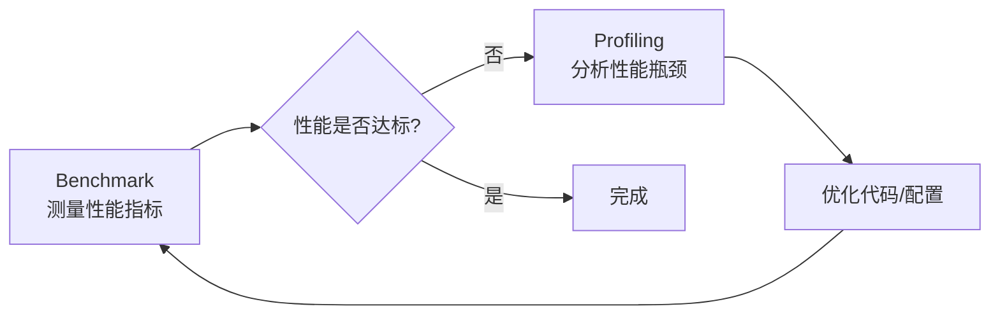

# Day 03: Benchmark and Profiling 学习指南

## 📚 文档位置

**本文档位于**: `yc_self_learn/llm study sglang_yc01252026/learn path way md/sglang_day03/`

**参考官方文档**: [Benchmark and Profiling](https://docs.sglang.ai/developer_guide/benchmark_and_profiling.html) ⭐⭐⭐

---

## 🎯 学习目标

通过今天的学习，你将能够：

1. ✅ **理解 Benchmark 和 Profiling 的区别和用途**
2. ✅ **掌握 SGLang 的三种 Benchmark 方法**
3. ✅ **掌握 PyTorch Profiler 的使用方法**
4. ✅ **掌握 Nsight Systems 的使用方法**
5. ✅ **能够识别性能瓶颈并进行分析**
6. ✅ **能够使用 HTTP API 进行程序化 Profiling**

---

## 📖 目录

1. [核心概念：Benchmark vs Profiling](#1-核心概念benchmark-vs-profiling)
2. [Benchmark 详解](#2-benchmark-详解)
3. [Profiling 详解](#3-profiling-详解)
4. [实践指南](#4-实践指南)
5. [常见问题解答](#5-常见问题解答)
6. [学习检查清单](#6-学习检查清单)

---

## 1. 核心概念：Benchmark vs Profiling

### 1.1 什么是 Benchmark？

**Benchmark（基准测试）** 是**测量系统性能指标**的过程，用于：

- 📊 **量化性能**：测量吞吐量（throughput）、延迟（latency）、TTFT（Time To First Token）等指标
- 📈 **对比性能**：比较不同配置、不同模型、不同硬件的性能差异
- ✅ **验证优化**：验证优化是否有效，性能是否提升

**Benchmark 回答的问题**：
- "这个模型每秒能处理多少个 token？"
- "第一个 token 需要多长时间？"
- "这个优化提升了多少性能？"

### 1.2 什么是 Profiling？

**Profiling（性能分析）** 是**深入分析系统运行细节**的过程，用于：

- 🔍 **定位瓶颈**：找出性能瓶颈在哪里（哪个 kernel、哪个操作）
- 📊 **分析细节**：查看 kernel 执行时间、内存使用、调用栈等
- 🎯 **优化指导**：为性能优化提供数据支持

**Profiling 回答的问题**：
- "哪个 kernel 执行时间最长？"
- "内存使用情况如何？"
- "为什么这里这么慢？"

### 1.3 两者的关系



**典型工作流程**：
1. **Benchmark** → 发现性能问题（例如：吞吐量太低）
2. **Profiling** → 分析瓶颈（例如：某个 kernel 太慢）
3. **优化** → 修复瓶颈（例如：优化 kernel 实现）
4. **Benchmark** → 验证优化效果

---

## 2. Benchmark 详解

SGLang 提供了三种 Benchmark 方法，适用于不同的场景：

### 2.1 单批次延迟测试（`bench_one_batch`）

**用途**：测试单个静态批次的延迟，**不需要启动服务器**

**适用场景**：
- ✅ 快速测试模型性能
- ✅ 测试不同 batch size 的影响
- ✅ 测试不同输入/输出长度的性能

**特点**：
- ⚠️ **简化版本**：没有动态批处理服务器
- ⚠️ **内存限制**：可能因为 batch size 过大而 OOM（真实服务器会分批次处理）

#### 2.1.1 无服务器模式

```bash
python -m sglang.bench_one_batch \
  --model-path meta-llama/Meta-Llama-3.1-8B-Instruct \
  --batch 32 \
  --input-len 256 \
  --output-len 32
```

**参数说明**：
- `--model-path`: 模型路径（HuggingFace 格式）
- `--batch`: Batch size（同时处理的请求数）
- `--input-len`: 输入序列长度
- `--output-len`: 输出序列长度

#### 2.1.2 服务器模式

```bash
# 先启动服务器
python -m sglang.launch_server \
  --model-path meta-llama/Meta-Llama-3.1-8B-Instruct

# 然后运行 benchmark
python -m sglang.bench_one_batch_server \
  --base-url http://127.0.0.1:30000 \
  --model-path meta-llama/Meta-Llama-3.1-8B-Instruct \
  --batch-size 32 \
  --input-len 256 \
  --output-len 32
```

### 2.2 离线吞吐量测试（`bench_offline_throughput`）

**用途**：测试**离线处理**的吞吐量（不涉及网络请求）

**适用场景**：
- ✅ 测试模型的最大吞吐量
- ✅ 测试批量处理性能
- ✅ 不涉及网络延迟的纯计算性能测试

**命令**：
```bash
python3 -m sglang.bench_offline_throughput \
  --model-path meta-llama/Meta-Llama-3.1-8B-Instruct \
  --num-prompts 10
```

**参数说明**：
- `--num-prompts`: 测试的 prompt 数量
- `--dataset-name`: 数据集名称（可选，如 `random`）

### 2.3 在线服务测试（`bench_serving`）

**用途**：测试**在线服务**的性能（包括网络请求）

**适用场景**：
- ✅ 测试真实服务场景的性能
- ✅ 测试动态批处理性能
- ✅ 测试端到端延迟（包括网络）

**前置条件**：需要先启动服务器

```bash
# 启动服务器
python -m sglang.launch_server \
  --model-path meta-llama/Meta-Llama-3.1-8B-Instruct

# 运行 benchmark
python3 -m sglang.bench_serving \
  --backend sglang \
  --num-prompt 10
```

**参数说明**：
- `--backend`: 后端类型（`sglang` 或其他）
- `--num-prompt`: 测试的 prompt 数量

### 2.4 Benchmark 输出解读

Benchmark 通常会输出以下指标：

| 指标 | 说明 | 单位 |
|------|------|------|
| **Throughput** | 吞吐量（每秒处理的 token 数） | tokens/s |
| **Latency** | 延迟（处理一个请求的时间） | ms |
| **TTFT** | Time To First Token（第一个 token 的时间） | ms |
| **TPOT** | Time Per Output Token（每个输出 token 的时间） | ms |

**示例输出**：
```
Throughput: 150.5 tokens/s
Average Latency: 234.5 ms
TTFT: 45.2 ms
TPOT: 12.3 ms
```

---

## 3. Profiling 详解

SGLang 支持两种 Profiling 工具：

### 3.1 PyTorch Profiler（基础工具）

**特点**：
- ✅ **易用**：集成在 PyTorch 中，无需额外安装
- ✅ **基础功能**：查看 kernel 执行时间、调用栈、kernel 重叠等
- ⚠️ **功能有限**：不如 Nsight Systems 详细

**适用场景**：
- ✅ 快速定位性能瓶颈
- ✅ 查看 Python 调用栈
- ✅ 分析 kernel 重叠情况

#### 3.1.1 使用 `bench_serving` 进行 Profiling

**步骤**：

1. **设置环境变量**（服务器和客户端都需要）：
```bash
export SGLANG_TORCH_PROFILER_DIR=/root/sglang/profile_log
```

2. **启动服务器**：
```bash
python -m sglang.launch_server \
  --model-path meta-llama/Llama-3.1-8B-Instruct
```

3. **发送 Profiling 请求**：
```bash
python -m sglang.bench_serving \
  --backend sglang \
  --model meta-llama/Llama-3.1-8B-Instruct \
  --num-prompts 10 \
  --sharegpt-output-len 100 \
  --profile
```

**重要提示**：
- ⚠️ `SGLANG_TORCH_PROFILER_DIR` 必须在**服务器和客户端**都设置
- ✅ 建议在 `~/.bashrc` 中设置，避免忘记

#### 3.1.2 使用 `bench_offline_throughput` 进行 Profiling

```bash
export SGLANG_TORCH_PROFILER_DIR=/root/sglang/profile_log

# 单批次 profiling
python3 -m sglang.bench_one_batch \
  --model-path meta-llama/Llama-3.1-8B-Instruct \
  --batch 32 \
  --input-len 1024 \
  --output-len 10 \
  --profile

# 多批次 profiling
python -m sglang.bench_offline_throughput \
  --model-path meta-llama/Llama-3.1-8B-Instruct \
  --dataset-name random \
  --num-prompts 10 \
  --profile \
  --mem-frac=0.8
```

#### 3.1.3 使用 `sglang.profiler` 进行实时 Profiling

**场景**：服务器正在运行，你想立即开始 profiling

**方法 1：两个终端**

```bash
# Terminal 1: 发送生成请求
python3 -m sglang.test.send_one

# Terminal 2: 在请求完成前，快速启动 profiler
python3 -m sglang.profiler
```

**方法 2：单命令**

```bash
python3 -m sglang.test.send_one --profile
```

#### 3.1.4 使用 HTTP API 进行程序化 Profiling

**优势**：可以精确控制 profiling 的开始和结束时间

**启动 Profiling**：
```bash
curl -X POST http://127.0.0.1:30000/start_profile \
  -H "Content-Type: application/json" \
  -d '{
    "num_steps": 10,
    "start_step": 3,
    "activities": ["CPU", "GPU"],
    "output_dir": "/tmp/profiles"
  }'
```

**参数说明**：
- `num_steps`: Profiling 的步数（可选，不指定则持续到手动停止）
- `start_step`: 从第几步开始 profiling（跳过 warmup）
- `activities`: 要 profiling 的活动（`["CPU", "GPU"]` 或 `["CUDA_PROFILER"]`）
- `output_dir`: 输出目录（可选，默认使用环境变量）

**停止 Profiling**：
```bash
curl -X POST http://127.0.0.1:30000/end_profile
```

**完整工作流示例**：
```bash
# Terminal 1: 启动服务器
export SGLANG_TORCH_PROFILER_DIR=/tmp/profiles
python -m sglang.launch_server \
  --model-path meta-llama/Llama-3.1-8B-Instruct

# Terminal 2: 启动持续 profiling（跳过前 3 步）
curl -X POST http://127.0.0.1:30000/start_profile \
  -H "Content-Type: application/json" \
  -d '{"start_step": 3}'

# Terminal 3: 发送请求生成负载
python -m sglang.bench_serving \
  --backend sglang \
  --num-prompts 100

# Terminal 2: 停止 profiling
curl -X POST http://127.0.0.1:30000/end_profile
```

#### 3.1.5 PD 解耦模式下的 Profiling

**重要**：在 PD（Prefill-Decode）解耦模式下，**必须分别 profiling prefill 和 decode workers**

**Profiling Prefill Workers**：
```bash
# 启动 prefill 和 decode 服务器
python -m sglang.launch_server \
  --model-path meta-llama/Llama-3.1-8B-Instruct \
  --disaggregation-mode prefill

python -m sglang.launch_server \
  --model-path meta-llama/Llama-3.1-8B-Instruct \
  --disaggregation-mode decode \
  --port 30001 \
  --base-gpu-id 1

# 启动 router
python -m sglang_router.launch_router \
  --pd-disaggregation \
  --prefill http://127.0.0.1:30000 \
  --decode http://127.0.0.1:30001 \
  --host 0.0.0.0 \
  --port 8000

# Profiling prefill workers
python -m sglang.bench_serving \
  --backend sglang \
  --model meta-llama/Llama-3.1-8B-Instruct \
  --num-prompts 10 \
  --sharegpt-output-len 100 \
  --profile \
  --pd-separated \
  --profile-prefill-url http://127.0.0.1:30000
```

**Profiling Decode Workers**：
```bash
python -m sglang.bench_serving \
  --backend sglang \
  --model meta-llama/Llama-3.1-8B-Instruct \
  --num-prompts 10 \
  --sharegpt-output-len 100 \
  --profile \
  --pd-separated \
  --profile-decode-url http://127.0.0.1:30001
```

**注意**：
- ⚠️ `--profile-prefill-url` 和 `--profile-decode-url` **互斥**，不能同时使用
- ✅ 支持多个 worker URLs（多实例设置）

#### 3.1.6 分布式 Trace 合并

**用途**：在多 GPU/多节点环境下，合并所有 rank 的 trace 文件

**启用方法**：
```bash
# HTTP API
curl -X POST http://127.0.0.1:30000/start_profile \
  -H "Content-Type: application/json" \
  -d '{
    "output_dir": "/tmp/profiles",
    "num_steps": 10,
    "activities": ["CPU", "GPU"],
    "merge_profiles": true
  }'

# 命令行
python -m sglang.profiler \
  --num-steps 10 \
  --cpu \
  --gpu \
  --output-dir /tmp/profiles \
  --merge-profiles
```

**输出文件**：
- 单个 rank: `{profile_id}-TP-{tp}-DP-{dp}-PP-{pp}-EP-{ep}.trace.json.gz`
- 合并文件: `merged-{profile_id}.trace.json.gz`

**注意事项**：
- ✅ 单节点完全支持
- ⚠️ 多节点需要共享存储（NFS、Lustre 等）

#### 3.1.7 查看 Trace 文件

**工具**：
1. **Perfetto UI**（推荐，任何浏览器）：https://ui.perfetto.dev/
2. **Chrome Tracing**（仅 Chrome）：`chrome://tracing`

**生成小文件（<100MB）**：
```bash
python -m sglang.bench_serving \
  --backend sglang \
  --model meta-llama/Llama-3.1-8B-Instruct \
  --num-prompts 2 \
  --sharegpt-output-len 100 \
  --profile
```

**重要提示**：
- ⚠️ 如果想在 Trace 中通过 CUDA kernel 定位到 SGLang Python 源码，需要**禁用 CUDA Graph**：
```bash
python -m sglang.launch_server \
  --model-path meta-llama/Llama-3.1-8B-Instruct \
  --disable-cuda-graph
```

### 3.2 Nsight Systems（高级工具）

**特点**：
- ✅ **功能强大**：提供更详细的 profiling 信息
- ✅ **详细信息**：寄存器使用、共享内存使用、低层 CUDA API 等
- ✅ **代码标注**：支持 NVTX 标注代码区域
- ⚠️ **需要安装**：需要单独安装 Nsight Systems

**适用场景**：
- ✅ 深入分析性能瓶颈
- ✅ 分析 kernel 的详细执行情况
- ✅ 分析内存使用情况
- ✅ 分析 CUDA API 调用

#### 3.2.1 安装 Nsight Systems

```bash
apt update
apt install -y --no-install-recommends gnupg
echo "deb http://developer.download.nvidia.com/devtools/repos/ubuntu$(source /etc/lsb-release; echo "$DISTRIB_RELEASE" | tr -d .)/$(dpkg --print-architecture) /" | tee /etc/apt/sources.list.d/nvidia-devtools.list
apt-key adv --fetch-keys http://developer.download.nvidia.com/compute/cuda/repos/ubuntu1804/x86_64/7fa2af80.pub
apt update
apt install nsight-systems-cli
```

**或者**：使用 NVIDIA Docker 容器或 SGLang Docker 容器（已预装）

#### 3.2.2 Profiling 单批次

```bash
nsys profile \
  --trace-fork-before-exec=true \
  --cuda-graph-trace=node \
  python3 -m sglang.bench_one_batch \
    --model meta-llama/Meta-Llama-3-8B \
    --batch-size 64 \
    --input-len 512
```

**参数说明**：
- `--trace-fork-before-exec=true`: 跟踪 fork 的进程
- `--cuda-graph-trace=node`: 跟踪 CUDA Graph 节点

#### 3.2.3 Profiling 服务器

```bash
# Terminal 1: 启动服务器（带 nsys）
nsys profile \
  --trace-fork-before-exec=true \
  --cuda-graph-trace=node \
  -o sglang.out \
  --delay 60 \
  --duration 70 \
  python3 -m sglang.launch_server \
    --model-path meta-llama/Llama-3.1-8B-Instruct \
    --disable-radix-cache

# Terminal 2: 发送请求
python3 -m sglang.bench_serving \
  --backend sglang \
  --num-prompts 1000 \
  --dataset-name random \
  --random-input 1024 \
  --random-output 512
```

**手动停止 Profiling**：
```bash
# 查看 session ID
nsys sessions list

# 停止 profiling（生成 .nsys-rep 文件）
nsys stop --session=profile-XXXXX
```

**建议**：
- ✅ 设置 `--duration` 为大值
- ✅ 需要停止时使用 `nsys stop` 手动停止

#### 3.2.4 使用 NVTX 标注代码

**安装 NVTX**：
```bash
pip install nvtx
```

**代码示例**：
```python
import nvtx

with nvtx.annotate("description", color="color"):
    # 关键代码
    pass
```

**用途**：在 Nsight Systems 中看到标注的代码区域及其执行时间

#### 3.2.5 逐层 NVTX Profiling

**功能**：SGLang 提供内置的逐层 NVTX 标注，可以查看每个层的性能

**启用方法**：
```bash
# 启动服务器（启用逐层 NVTX）
python -m sglang.launch_server \
  --model-path meta-llama/Llama-3.1-8B-Instruct \
  --enable-layerwise-nvtx-marker \
  --disable-cuda-graph
```

**重要**：
- ⚠️ 必须使用 `--disable-cuda-graph`，因为 CUDA Graph 不会发出 NVTX markers

**方法 1：使用 `/start_profile` API（程序化控制）**

```bash
# Terminal 1: 启动服务器（带 nsys 和 capture-range）
nsys profile \
  --trace-fork-before-exec=true \
  --cuda-graph-trace=node \
  --capture-range=cudaProfilerApi \
  --capture-range-end=stop \
  -o layerwise_profile \
  python -m sglang.launch_server \
    --model-path meta-llama/Llama-3.1-8B-Instruct \
    --enable-layerwise-nvtx-marker \
    --disable-cuda-graph

# Terminal 2: 通过 API 控制 profiling
curl -X POST http://127.0.0.1:30000/start_profile \
  -H "Content-Type: application/json" \
  -d '{
    "start_step": 3,
    "num_steps": 10,
    "activities": ["CUDA_PROFILER"]
  }'

# Terminal 3: 生成负载
python -m sglang.bench_serving \
  --backend sglang \
  --num-prompts 100
```

**方法 2：简单方法（无需 API）**

```bash
# Terminal 1: 启动服务器
python -m sglang.launch_server \
  --model-path meta-llama/Llama-3.1-8B-Instruct \
  --enable-layerwise-nvtx-marker \
  --disable-cuda-graph

# Terminal 2: Profiling 客户端
nsys profile \
  --trace-fork-before-exec=true \
  --cuda-graph-trace=node \
  -o layerwise_profile \
  python -m sglang.bench_serving \
    --backend sglang \
    --num-prompts 10
```

**查看结果**：
```bash
nsys-ui layerwise_profile.qdrep
```

**在 Nsight Systems GUI 中可以看到**：
- ✅ **NVTX ranges**：每个层在时间线上显示为标注的范围
- ✅ **CUDA kernels**：所有 GPU kernels 与层标注一起显示
- ✅ **层层次结构**：完整的模块路径（如 `model.layers.0.self_attn.qkv_proj`）
- ✅ **Tensor shapes**：输入/输出维度和参数形状

**优势**：
- ✅ **细粒度可见性**：精确看到哪个层耗时最长
- ✅ **内存跟踪**：识别内存分配大的层
- ✅ **瓶颈识别**：快速定位低效操作
- ✅ **通信开销**：在多 GPU 设置中，查看每层的通信成本
- ✅ **开发调试**：验证模型架构更改的预期性能影响

---

## 4. 实践指南

### 4.1 完整工作流示例

**场景**：优化模型性能

```bash
# 1. Benchmark：测量当前性能
python -m sglang.bench_one_batch \
  --model-path meta-llama/Meta-Llama-3.1-8B-Instruct \
  --batch 32 \
  --input-len 256 \
  --output-len 32

# 2. Profiling：分析性能瓶颈
export SGLANG_TORCH_PROFILER_DIR=/tmp/profiles
python -m sglang.launch_server \
  --model-path meta-llama/Llama-3.1-8B-Instruct

python -m sglang.bench_serving \
  --backend sglang \
  --num-prompts 10 \
  --profile

# 3. 查看 Trace 文件（在浏览器中打开）
# https://ui.perfetto.dev/

# 4. 优化代码/配置

# 5. 再次 Benchmark：验证优化效果
python -m sglang.bench_one_batch \
  --model-path meta-llama/Meta-Llama-3.1-8B-Instruct \
  --batch 32 \
  --input-len 256 \
  --output-len 32
```

### 4.2 常见性能问题诊断

| 问题 | 可能原因 | Profiling 方法 |
|------|----------|----------------|
| **吞吐量低** | Kernel 执行慢、内存带宽瓶颈 | 查看 kernel 执行时间、内存使用 |
| **延迟高** | 某个操作耗时过长 | 查看调用栈、定位慢操作 |
| **GPU 利用率低** | Kernel 重叠不足、同步等待 | 查看 kernel 时间线、重叠情况 |
| **内存不足** | Batch size 过大、KV Cache 过大 | 查看内存分配、调整配置 |

### 4.3 最佳实践

1. **Benchmark 前先 Warmup**：
   - 第一次运行可能较慢（模型加载、编译等）
   - 建议运行多次，取平均值

2. **Profiling 时跳过 Warmup**：
   - 使用 `start_step` 参数跳过前几步
   - 避免 warmup 影响分析结果

3. **生成小 Trace 文件**：
   - 减少 prompt 数量和输出长度
   - 便于在浏览器中打开和分析

4. **使用合适的工具**：
   - 快速定位：PyTorch Profiler
   - 深入分析：Nsight Systems

5. **多 GPU 环境**：
   - 使用 `merge_profiles` 合并 trace
   - 确保共享存储可访问

---

## 5. 常见问题解答

### Q1: Benchmark 和 Profiling 的区别？

**A**: 
- **Benchmark**：测量性能指标（吞吐量、延迟等），回答"性能如何"
- **Profiling**：分析性能细节（哪个 kernel 慢、内存使用等），回答"为什么慢"

### Q2: 什么时候用 PyTorch Profiler，什么时候用 Nsight Systems？

**A**:
- **PyTorch Profiler**：快速定位问题、查看 Python 调用栈、基础分析
- **Nsight Systems**：深入分析、查看详细 kernel 信息、内存分析、CUDA API 分析

### Q3: 为什么 Trace 文件打不开？

**A**:
- 文件太大（>100MB），浏览器无法加载
- **解决方案**：减少 prompt 数量和输出长度，生成小文件

### Q4: 如何在 Trace 中看到 Python 源码？

**A**:
- 启动服务器时使用 `--disable-cuda-graph`
- CUDA Graph 会隐藏 Python 调用栈

### Q5: PD 解耦模式下如何 Profiling？

**A**:
- 必须分别 profiling prefill 和 decode workers
- 使用 `--profile-prefill-url` 或 `--profile-decode-url`
- 两者互斥，不能同时使用

### Q6: 遇到 PyTorch Profiler 错误怎么办？

**A**:
- 如果遇到 `RuntimeError: !stack.empty()` 错误
- 设置环境变量：`export SGLANG_PROFILE_WITH_STACK=False`

---

## 6. 学习检查清单

### 基础概念
- [ ] 理解 Benchmark 和 Profiling 的区别
- [ ] 理解何时使用 Benchmark，何时使用 Profiling
- [ ] 理解三种 Benchmark 方法的区别和适用场景

### Benchmark 实践
- [ ] 能够使用 `bench_one_batch` 进行单批次测试
- [ ] 能够使用 `bench_offline_throughput` 进行离线测试
- [ ] 能够使用 `bench_serving` 进行在线服务测试
- [ ] 能够解读 Benchmark 输出指标

### Profiling 实践
- [ ] 能够使用 PyTorch Profiler 进行 profiling
- [ ] 能够使用 HTTP API 进行程序化 profiling
- [ ] 能够查看和分析 Trace 文件
- [ ] 能够使用 Nsight Systems 进行高级 profiling
- [ ] 能够使用逐层 NVTX profiling

### 问题诊断
- [ ] 能够识别性能瓶颈
- [ ] 能够分析 kernel 执行时间
- [ ] 能够分析内存使用情况
- [ ] 能够提出优化建议

---

## 🔗 相关文档

### 官方文档
- [SGLang Benchmark and Profiling Guide](https://docs.sglang.ai/developer_guide/benchmark_and_profiling.html) ⭐⭐⭐
- [PyTorch Profiler](https://pytorch.org/tutorials/recipes/recipes/profiler_recipe.html) ⭐⭐⭐
- [Nsight Systems](https://docs.nvidia.com/nsight-systems/) ⭐⭐⭐
- [Bench Serving Guide](https://docs.sglang.ai/developer_guide/bench_serving.html) ⭐⭐

### 技术博客
- [Understanding PyTorch Profiler](https://pytorch.org/tutorials/recipes/recipes/profiler_recipe.html) ⭐⭐
- [Nsight Systems User Guide](https://docs.nvidia.com/nsight-systems/UserGuide/index.html) ⭐⭐

### 相关学习文档
- [Day 01: 基础概念学习指南](../00_基础概念完整学习指南.md) ⭐
- [Day 02: 学习计划](../02_学习计划.md) ⭐

---

## 📝 学习笔记模板

### 今日学习内容
- [ ] Benchmark 基础
- [ ] Profiling 基础
- [ ] PyTorch Profiler 实践
- [ ] Nsight Systems 实践

### 遇到的问题
1. 
2. 

### 解决方案
1. 
2. 

### 下一步计划
- [ ] 
- [ ] 

---

**开始你的 Benchmark 和 Profiling 学习之旅！** 🚀
