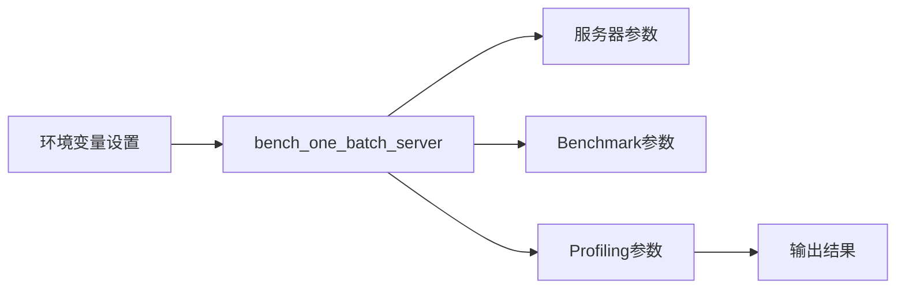
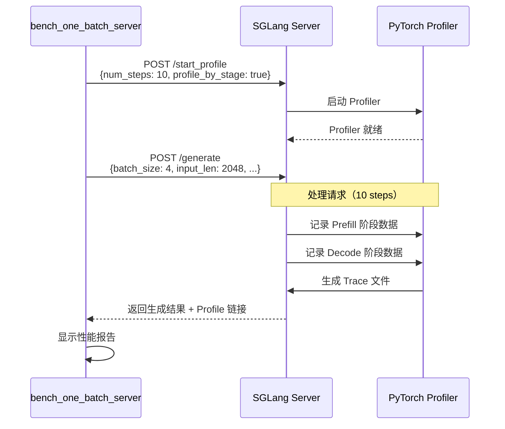
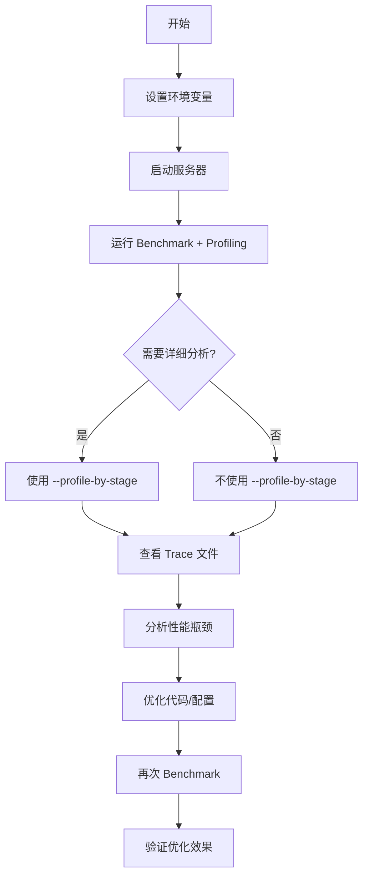

# Day03_Y01: bench_one_batch_server Profiling 命令详解

## 📚 文档位置

**本文档位于**: `yc_self_learn/llm study sglang_yc01252026/learn path way md/sglang_day03/`

**父文档**: [00_Day03_Benchmark_and_Profiling_学习指南.md](./00_Day03_Benchmark_and_Profiling_学习指南.md) ⭐

---

## 🎯 学习目标

通过本文档，你将能够：

1. ✅ **理解 `bench_one_batch_server` 中 profiling 的工作机制**
2. ✅ **掌握各个 profiling 参数的作用和用法**
3. ✅ **理解 profiling 的执行流程**
4. ✅ **能够正确解读 profiling 输出结果**

---

## 📋 目录

1. [命令示例](#1-命令示例)
2. [参数详解](#2-参数详解)
3. [工作流程](#3-工作流程)
4. [输出结果](#4-输出结果)
5. [使用场景](#5-使用场景)
6. [常见问题](#6-常见问题)

---

## 1. 命令示例

### 1.1 完整命令

```bash
SGLANG_TORCH_PROFILER_DIR="./" \
python -m sglang.bench_one_batch_server \
  --model baseten-admin/glm-4.7-fp8-attn-fp4-mlp \
  --base-url http://localhost:30000 \
  --batch-size 4 \
  --input-len 2048 \
  --output-len 1024 \
  --profile \
  --profile-steps 10 \
  --show-report \
  --profile-by-stage
```

### 1.2 命令结构



---

## 2. 参数详解

### 2.1 环境变量

#### `SGLANG_TORCH_PROFILER_DIR="./"`

**作用**：指定 profiler trace 文件的输出目录

**说明**：
- 如果未设置，默认使用 `/tmp`
- 这里设置为 `./`，表示当前目录
- Trace 文件会保存在：`./{timestamp}/` 目录下

**示例**：
```bash
# 方式1：环境变量
SGLANG_TORCH_PROFILER_DIR="./profiles" python -m sglang.bench_one_batch_server ...

# 方式2：export 设置
export SGLANG_TORCH_PROFILER_DIR="./profiles"
python -m sglang.bench_one_batch_server ...

# 方式3：在 ~/.bashrc 中设置（推荐）
echo 'export SGLANG_TORCH_PROFILER_DIR="$HOME/sglang/profiles"' >> ~/.bashrc
```

### 2.2 Benchmark 参数

#### `--model baseten-admin/glm-4.7-fp8-attn-fp4-mlp`

**作用**：指定要测试的模型

**说明**：
- 可以是 HuggingFace 模型 ID
- 也可以是本地模型路径
- 如果服务器已启动，可以设置为 `None`

#### `--base-url http://localhost:30000`

**作用**：指定服务器的 URL

**说明**：
- 默认是 `http://localhost:30000`
- 如果服务器在其他地址，需要修改

#### `--batch-size 4`

**作用**：指定 batch size（同时处理的请求数）

#### `--input-len 2048`

**作用**：指定输入序列长度

#### `--output-len 1024`

**作用**：指定输出序列长度

### 2.3 Profiling 参数

#### `--profile`

**作用**：启用 profiling 功能

**类型**：布尔标志（flag）

**说明**：
- 不指定：只进行 benchmark，不进行 profiling
- 指定：启用 profiling，会调用 `run_profile()` 函数

**效果**：
- 向服务器发送 `/start_profile` HTTP 请求
- 开始记录性能数据
- 生成 trace 文件

#### `--profile-steps 10`

**作用**：指定 profiling 的步数（forward steps）

**类型**：整数

**默认值**：`5` 步

**说明**：
- 只 profile 指定数量的 forward steps
- 减少 profiling 开销和文件大小
- 通常 5-10 步足够分析性能瓶颈

**建议**：
- 快速测试：`--profile-steps 5`（默认）
- 详细分析：`--profile-steps 10` 或更多
- 避免过大：不要设置太大（>50），文件会很大

#### `--profile-by-stage`

**作用**：按阶段分别 profiling（Prefill 和 Decode 分开）

**类型**：布尔标志（flag）

**说明**：
- **不启用**：整个请求一起 profile（Prefill + Decode 混合在一个 trace 文件中）
- **启用**：Prefill 和 Decode 分别生成独立的 trace 文件

**效果**：
- 生成 `prefill-*.trace.json.gz` 文件（Prefill 阶段）
- 生成 `decode-*.trace.json.gz` 文件（Decode 阶段）

**使用场景**：
- ✅ 需要分别分析 Prefill 和 Decode 的性能
- ✅ Prefill 和 Decode 的性能瓶颈不同
- ✅ 优化特定阶段的性能

**示例对比**：

```bash
# 不启用：混合 profile
--profile
# 输出：single-*.trace.json.gz（包含 Prefill + Decode）

# 启用：分别 profile
--profile --profile-by-stage
# 输出：
#   - prefill-*.trace.json.gz（只有 Prefill）
#   - decode-*.trace.json.gz（只有 Decode）
```

#### `--show-report`

**作用**：在终端显示格式化的性能报告

**类型**：布尔标志（flag）

**说明**：
- 会显示一个表格，包含性能指标
- 如果启用了 profiling，还会显示 profile 链接

**输出示例**：

```
| batch_size | input_len | output_len | throughput | latency | TTFT | profile |
|------------|-----------|------------|------------|---------|------|---------|
| 4          | 2048      | 1024       | 150.5      | 234.5   | 45.2 | [Profile](./...) |
```

### 2.4 其他相关参数

#### `--profile-prefix`

**作用**：指定 profiler 文件的前缀

**类型**：字符串

**默认值**：自动生成（格式：`bs-{batch_size}-il-{input_len}`）

**说明**：
- 用于区分不同的 profiling 结果
- 如果指定，会覆盖自动生成的前缀

**示例**：
```bash
--profile-prefix "test-run-001"
# 输出文件：test-run-001-*.trace.json.gz
```

#### `--profile-output-dir`

**作用**：指定 profiler 输出目录（覆盖环境变量）

**类型**：字符串

**说明**：
- 如果指定，会覆盖 `SGLANG_TORCH_PROFILER_DIR` 环境变量
- 优先级：`--profile-output-dir` > `SGLANG_TORCH_PROFILER_DIR` > `/tmp`

---

## 3. 工作流程

### 3.1 完整执行流程



### 3.2 代码执行流程

#### 步骤 1：初始化 Profiling

```python
# 在 run_one_case() 函数中
if profile:
    profile_link = run_profile(
        url=url,
        num_steps=profile_steps,        # --profile-steps 10
        activities=["CPU", "GPU"],     # 默认 profile CPU 和 GPU
        output_dir=profile_output_dir, # SGLANG_TORCH_PROFILER_DIR
        profile_by_stage=profile_by_stage,  # --profile-by-stage
        profile_prefix=profile_prefix,  # 自动生成或指定
    )
```

#### 步骤 2：发送 Profiling 请求

```python
# run_profile() 函数发送 HTTP 请求
response = requests.post(
    url + "/start_profile",
    json={
        "output_dir": str(output_dir),
        "num_steps": str(num_steps),        # "10"
        "activities": activities,           # ["CPU", "GPU"]
        "profile_by_stage": profile_by_stage,  # True
        "merge_profiles": merge_profiles,
        "profile_prefix": profile_prefix,
    }
)
```

#### 步骤 3：服务器处理请求

```python
# 服务器收到 /start_profile 请求后：
# 1. 启动 PyTorch Profiler
# 2. 等待 num_steps 个 forward steps
# 3. 如果 profile_by_stage=True，分别记录 Prefill 和 Decode
# 4. 生成 trace 文件
# 5. 返回 trace 文件路径
```

#### 步骤 4：发送生成请求

```python
# 发送实际的生成请求
response = requests.post(
    url + "/generate",
    json={
        "text": prompts,
        "sampling_params": {
            "temperature": temperature,
            "max_new_tokens": output_len,
        }
    }
)
```

#### 步骤 5：收集结果

```python
# 收集 benchmark 结果和 profile 链接
result = BenchOneCaseResult(
    batch_size=batch_size,
    input_len=input_len,
    output_len=output_len,
    latency=latency,
    throughput=throughput,
    profile_link=profile_link,  # Trace 文件路径
)
```

### 3.3 Profiling 时序图

```mermaid
gantt
    title Profiling 执行时序
    dateFormat X
    axisFormat %s
    
    section 初始化
    启动 Profiler          :0, 1s
    等待就绪              :1s, 1s
    
    section Prefill 阶段
    Prefill Forward (Step 1-5) :2s, 3s
    Prefill Profiling 记录     :2s, 3s
    
    section Decode 阶段
    Decode Forward (Step 6-10) :5s, 5s
    Decode Profiling 记录      :5s, 5s
    
    section 完成
    生成 Trace 文件        :10s, 2s
    返回结果              :12s, 1s
```

---

## 4. 输出结果

### 4.1 目录结构

执行命令后，会在 `SGLANG_TORCH_PROFILER_DIR` 目录下创建：

```
./
└── {timestamp}/                    # 时间戳目录（如：1735689600.123456）
    ├── server_args.json            # 服务器配置信息
    ├── prefill-*.trace.json.gz     # Prefill 阶段的 trace（如果 --profile-by-stage）
    └── decode-*.trace.json.gz      # Decode 阶段的 trace（如果 --profile-by-stage）
```

**如果不使用 `--profile-by-stage`**：
```
./
└── {timestamp}/
    ├── server_args.json
    └── single-*.trace.json.gz      # 包含 Prefill + Decode 的完整 trace
```

### 4.2 server_args.json

包含服务器的配置信息：

```json
{
    "model_path": "baseten-admin/glm-4.7-fp8-attn-fp4-mlp",
    "tp_size": 1,
    "dp_size": 1,
    "pp_size": 1,
    "ep_size": 1,
    "quantization": "fp8",
    "dtype": "float16",
    ...
}
```

### 4.3 Trace 文件

**文件格式**：`.trace.json.gz`（压缩的 JSON 格式）

**内容**：
- Kernel 执行时间
- 函数调用栈
- 内存使用情况
- GPU 利用率
- 各阶段的时间线

**查看方式**：
1. **Perfetto UI**（推荐）：https://ui.perfetto.dev/
2. **Chrome Tracing**：`chrome://tracing`

### 4.4 终端输出

如果使用 `--show-report`，会显示：

```
Results:
┌─────────────┬───────────┬────────────┬─────────────┬──────────┬──────┬─────────────┐
│ batch_size  │ input_len │ output_len │ throughput  │ latency  │ TTFT │ profile     │
├─────────────┼───────────┼────────────┼─────────────┼──────────┼──────┼─────────────┤
│ 4           │ 2048      │ 1024       │ 150.5       │ 234.5    │ 45.2 │ [Profile]   │
│             │           │            │ tokens/s    │ ms       │ ms   │ (./...)     │
└─────────────┴───────────┴────────────┴─────────────┴──────────┴──────┴─────────────┘
```

---

## 5. 使用场景

### 5.1 场景 1：快速性能分析

**目标**：快速了解性能瓶颈

**命令**：
```bash
SGLANG_TORCH_PROFILER_DIR="./" \
python -m sglang.bench_one_batch_server \
  --model your-model \
  --base-url http://localhost:30000 \
  --batch-size 4 \
  --input-len 1024 \
  --output-len 512 \
  --profile \
  --profile-steps 5 \
  --show-report
```

**特点**：
- ✅ 使用默认的 5 步（快速）
- ✅ 不启用 `--profile-by-stage`（简单）
- ✅ 快速得到结果

### 5.2 场景 2：详细阶段分析

**目标**：分别分析 Prefill 和 Decode 的性能

**命令**：
```bash
SGLANG_TORCH_PROFILER_DIR="./" \
python -m sglang.bench_one_batch_server \
  --model your-model \
  --base-url http://localhost:30000 \
  --batch-size 4 \
  --input-len 2048 \
  --output-len 1024 \
  --profile \
  --profile-steps 10 \
  --profile-by-stage \
  --show-report
```

**特点**：
- ✅ 使用 10 步（更详细）
- ✅ 启用 `--profile-by-stage`（分别分析）
- ✅ 可以分别查看 Prefill 和 Decode 的瓶颈

### 5.3 场景 3：批量测试不同配置

**目标**：测试多个 batch size 和输入长度

**命令**：
```bash
SGLANG_TORCH_PROFILER_DIR="./profiles" \
python -m sglang.bench_one_batch_server \
  --model your-model \
  --base-url http://localhost:30000 \
  --batch-size 1 4 8 16 \
  --input-len 512 1024 2048 \
  --output-len 512 \
  --profile \
  --profile-steps 10 \
  --show-report
```

**特点**：
- ✅ 测试多个配置组合
- ✅ 每个配置都会生成独立的 trace 文件
- ✅ 可以对比不同配置的性能

### 5.4 场景 4：优化验证

**目标**：验证优化效果

**命令**：
```bash
# 优化前
SGLANG_TORCH_PROFILER_DIR="./before" \
python -m sglang.bench_one_batch_server \
  --model your-model \
  --profile --profile-steps 10 --show-report

# 优化后
SGLANG_TORCH_PROFILER_DIR="./after" \
python -m sglang.bench_one_batch_server \
  --model your-model \
  --profile --profile-steps 10 --show-report
```

**特点**：
- ✅ 对比优化前后的性能
- ✅ 查看优化是否有效
- ✅ 分析优化带来的改进

---

## 6. 常见问题

### Q1: Trace 文件太大，打不开怎么办？

**A**: 减少 `--profile-steps` 的值：

```bash
# 减少到 5 步或更少
--profile-steps 5

# 或者减少 batch size 和序列长度
--batch-size 1 --input-len 512 --output-len 100
```

### Q2: 如何只 profile Prefill 或只 profile Decode？

**A**: 使用 `--profile-by-stage` 会分别生成两个文件，你可以：
- 只查看 `prefill-*.trace.json.gz`（Prefill 阶段）
- 只查看 `decode-*.trace.json.gz`（Decode 阶段）

### Q3: Profile 链接显示 "n/a" 是什么意思？

**A**: 可能的原因：
1. Profiling 失败（检查服务器日志）
2. Trace 文件未生成（检查输出目录）
3. 权限问题（检查目录权限）

### Q4: 如何指定不同的输出目录？

**A**: 三种方式：

```bash
# 方式1：环境变量
SGLANG_TORCH_PROFILER_DIR="./my_profiles" python -m ...

# 方式2：参数（如果支持）
--profile-output-dir "./my_profiles"

# 方式3：export
export SGLANG_TORCH_PROFILER_DIR="./my_profiles"
python -m ...
```

### Q5: `--profile-steps` 设置多少合适？

**A**: 
- **快速测试**：5 步（默认）
- **详细分析**：10-20 步
- **避免过大**：不要超过 50 步（文件会很大）

### Q6: 什么时候使用 `--profile-by-stage`？

**A**: 使用场景：
- ✅ 需要分别分析 Prefill 和 Decode 的性能
- ✅ Prefill 和 Decode 的性能瓶颈不同
- ✅ 优化特定阶段的性能

不使用场景：
- ❌ 只需要整体性能分析
- ❌ 快速测试（会增加文件数量）

---

## 7. 最佳实践

### 7.1 参数选择建议

| 场景 | profile-steps | profile-by-stage | 说明 |
|------|---------------|------------------|------|
| 快速测试 | 5 | ❌ | 快速了解性能 |
| 详细分析 | 10-20 | ✅ | 深入分析各阶段 |
| 优化验证 | 10 | ✅ | 对比优化效果 |
| 批量测试 | 5-10 | ❌ | 减少文件大小 |

### 7.2 工作流程建议



### 7.3 文件管理建议

1. **使用有意义的目录名**：
   ```bash
   SGLANG_TORCH_PROFILER_DIR="./profiles/$(date +%Y%m%d_%H%M%S)"
   ```

2. **定期清理旧文件**：
   ```bash
   # 删除 7 天前的 trace 文件
   find ./profiles -name "*.trace.json.gz" -mtime +7 -delete
   ```

3. **使用版本控制忽略**：
   ```gitignore
   # .gitignore
   *.trace.json.gz
   profiles/
   ```

---

## 🔗 相关文档

- [00_Day03_Benchmark_and_Profiling_学习指南.md](./00_Day03_Benchmark_and_Profiling_学习指南.md) ⭐ - 父文档
- [SGLang Benchmark and Profiling Guide](https://docs.sglang.ai/developer_guide/benchmark_and_profiling.html) ⭐⭐⭐ - 官方文档
- [PyTorch Profiler](https://pytorch.org/tutorials/recipes/recipes/profiler_recipe.html) ⭐⭐⭐ - PyTorch Profiler 文档

---

## 📝 总结

### 关键参数

1. **`SGLANG_TORCH_PROFILER_DIR`**：控制 trace 文件保存位置
2. **`--profile`**：启用 profiling
3. **`--profile-steps 10`**：只 profile 10 步（减少文件大小）
4. **`--profile-by-stage`**：Prefill 和 Decode 分开分析
5. **`--show-report`**：显示格式化的性能报告

### 工作流程

1. 设置环境变量 → 2. 发送 `/start_profile` 请求 → 3. 处理生成请求 → 4. 生成 trace 文件 → 5. 显示结果

### 输出结果

- Trace 文件：`./{timestamp}/*.trace.json.gz`
- 性能报告：终端表格
- 服务器配置：`server_args.json`

---

**掌握这些参数，你就能灵活使用 profiling 进行性能分析了！** 🚀
