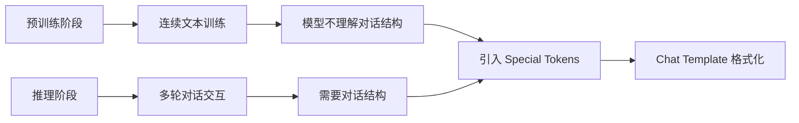
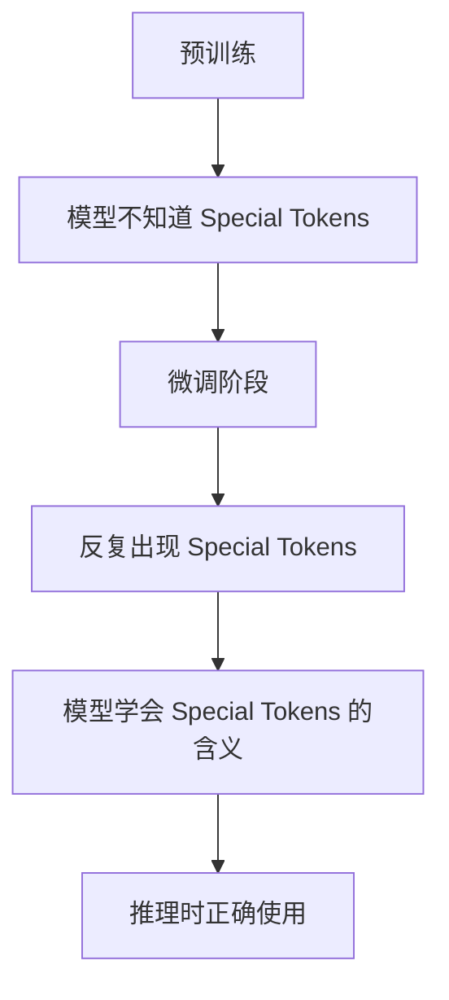
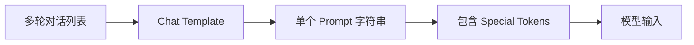
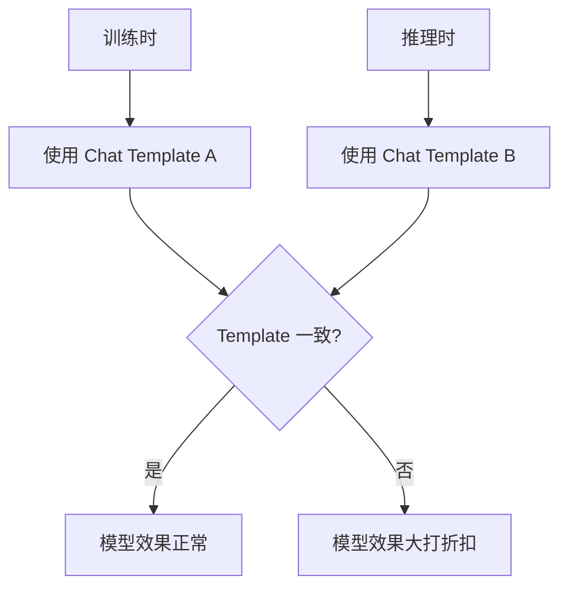

# Day03_Y02: Special Tokens 和 Chat Template 详解

## 📚 文档位置

**本文档位于**: `yc_self_learn/llm study sglang_yc01252026/learn path way md/sglang_day03/`

**父文档**: [00_Day03_Benchmark_and_Profiling_学习指南.md](./00_Day03_Benchmark_and_Profiling_学习指南.md) ⭐

**参考来源**: 本文基于 openrlhf 和 SGLang 的实践经验整理

---

## 🎯 学习目标

通过本文档，你将能够：

1. ✅ **理解 Special Tokens 的作用和重要性**
2. ✅ **掌握常见模型的 Special Tokens**
3. ✅ **理解 Chat Template 的工作原理**
4. ✅ **掌握如何正确使用 Special Tokens 和 Chat Template**
5. ✅ **避免常见的错误和陷阱**

---

## 📋 目录

1. [为什么需要 Special Tokens 和 Chat Template？](#1-为什么需要-special-tokens-和-chat-template)
2. [Special Tokens 详解](#2-special-tokens-详解)
3. [Chat Template 详解](#3-chat-template-详解)
4. [实际应用](#4-实际应用)
5. [常见问题和陷阱](#5-常见问题和陷阱)
6. [最佳实践](#6-最佳实践)

---

## 1. 为什么需要 Special Tokens 和 Chat Template？

### 1.1 问题的根源

**预训练阶段 vs 推理阶段**：



**核心问题**：
- 预训练时：模型在**大量连续文本**上训练，不知道什么是"对话"
- 推理时：需要处理**多轮对话**，需要区分用户、助手、系统等角色
- **解决方案**：引入 Special Tokens 来标记对话结构

### 1.2 影响

**如果处理不好 Special Tokens 和 Chat Template**：

- ❌ **Training**：模型学不会正确的对话格式
- ❌ **Inference**：模型效果大打折扣
- ❌ **Token in Token out**：输出可能包含不应该出现的 special tokens

**重要性**：虽然概念简单，但影响巨大！

---

## 2. Special Tokens 详解

### 2.1 什么是 Special Tokens？

**Special Tokens** 是模型用来标记**对话结构**和**特殊含义**的特殊标记。

**类比**：
- 就像 HTML 标签：`<div>`, `</div>` 标记结构
- Special Tokens 标记对话的开始、结束、角色等

### 2.2 Llama 3 的 Special Tokens 示例

#### 2.2.1 标记对话的开始和结束

```python
<|begin_of_text|>    # 对话的开始
<|end_of_text|>      # 对话的结束
<|eot_id|>           # End of Turn（类似 end_of_text）
```

**作用**：
- 告诉模型"对话从这里开始"
- 告诉模型"对话到这里结束"

#### 2.2.2 区分角色

```python
<|start_header_id|>user<|end_header_id|>        # 用户的消息
<|start_header_id|>assistant<|end_header_id|>  # 助手的回答
<|start_header_id|>system<|end_header_id|>     # 系统提示
```

**作用**：
- 明确标记每句话是谁说的
- 帮助模型理解对话的上下文

#### 2.2.3 Function Calling

```python
<tool_call>...</tool_call>    # 函数调用标记
# 或 JSON schema 形式
```

**作用**：
- 标记函数调用的开始和结束
- 帮助模型理解何时需要调用函数

### 2.3 Special Tokens 的训练

**关键点**：Special Tokens 需要在**微调阶段**就被明确定义且反复出现



**如果训练时没有 Special Tokens**：
- ❌ 模型不知道 `<|begin_of_text|>` 是什么意思
- ❌ 模型不知道如何区分 user 和 assistant
- ❌ 推理时效果会很差

### 2.4 在代码中使用 Special Tokens

#### 2.4.1 编码时添加 Special Tokens

```python
from transformers import AutoTokenizer

tokenizer = AutoTokenizer.from_pretrained("meta-llama/Llama-3.1-8B-Instruct")

text = "what's the weather today in LA?"

# 方式1：默认添加（推荐）
encoded_with_special = tokenizer.encode(text, add_special_tokens=True)
# 结果：包含 <|begin_of_text|> 等 special tokens

# 方式2：不添加
encoded_without_special = tokenizer.encode(text, add_special_tokens=False)
# 结果：不包含 special tokens
```

**重要**：`add_special_tokens` 默认是 `True`，所以通常不需要显式指定。

#### 2.4.2 解码时跳过 Special Tokens

```python
# 编码（包含 special tokens）
encoded_with_special = tokenizer.encode(text, add_special_tokens=True)

# 解码方式1：保留 special tokens（默认）
decoded_with_special = tokenizer.decode(encoded_with_special, skip_special_tokens=False)
print("Decoded with special tokens:", decoded_with_special)
# 输出：<|begin_of_text|>what's the weather today in LA?

# 解码方式2：跳过 special tokens
decoded_without_special = tokenizer.decode(encoded_with_special, skip_special_tokens=True)
print("Decoded without special tokens:", decoded_without_special)
# 输出：what's the weather today in LA?
```

**重要**：`skip_special_tokens` 默认是 `False`，所以解码时会看到 special tokens。

**使用场景**：
- `skip_special_tokens=False`：调试时查看完整的 token 序列
- `skip_special_tokens=True`：给用户显示时，隐藏 special tokens

### 2.5 常见模型的 Special Tokens

| 模型 | Begin Token | End Token | User Token | Assistant Token |
|------|-------------|-----------|------------|-----------------|
| **Llama 3** | `<\|begin_of_text\|>` | `<\|eot_id\|>` | `<\|start_header_id\|>user<\|end_header_id\|>` | `<\|start_header_id\|>assistant<\|end_header_id\|>` |
| **Llama 2** | `<s>` | `</s>` | `[INST]` | `[/INST]` |
| **ChatGLM** | `[gMASK]` | `</s>` | `[Round 1]` | - |
| **Qwen** | `<\|im_start\|>` | `<\|im_end\|>` | `user` | `assistant` |

---

## 3. Chat Template 详解

### 3.1 什么是 Chat Template？

**Chat Template** 是 tokenizer 的一部分，用于将**多轮对话**格式化为**单个 prompt**。

**问题**：
- 实际对话是多轮的：`[{role: "user", content: "..."}, {role: "assistant", content: "..."}, ...]`
- 模型需要单个字符串输入
- **解决方案**：Chat Template 自动拼接

### 3.2 Chat Template 的工作原理



**输入**：多轮对话的列表
```python
chat = [
    {"role": "user", "content": "What's the weather today in LA?"},
    {"role": "assistant", "content": "The weather in LA is sunny with a high of 75°F."},
    {"role": "user", "content": "Will it rain tomorrow?"},
    {"role": "assistant", "content": "No, it's expected to be clear with a low of 58°F."},
]
```

**输出**：格式化的单个字符串（包含 Special Tokens）
```
<|begin_of_text|><|start_header_id|>system<|end_header_id|>

Cutting Knowledge Date: December 2023
Today Date: 26 Jul 2024

<|eot_id|><|start_header_id|>user<|end_header_id|>

What's the weather today in LA?<|eot_id|><|start_header_id|>assistant<|end_header_id|>

The weather in LA is sunny with a high of 75°F.<|eot_id|><|start_header_id|>user<|end_header_id|>

Will it rain tomorrow?<|eot_id|><|start_header_id|>assistant<|end_header_id|>

No, it's expected to be clear with a low of 58°F.<|eot_id|>
```

### 3.3 使用 Chat Template

#### 3.3.1 基本用法

```python
from transformers import AutoTokenizer

tokenizer = AutoTokenizer.from_pretrained("meta-llama/Llama-3.1-8B-Instruct")

chat = [
    {"role": "user", "content": "What's the weather today in LA?"},
    {"role": "assistant", "content": "The weather in LA is sunny with a high of 75°F."},
    {"role": "user", "content": "Will it rain tomorrow?"},
    {"role": "assistant", "content": "No, it's expected to be clear with a low of 58°F."},
]

# 方式1：只格式化，不 tokenize
encoded_chat = tokenizer.apply_chat_template(chat, tokenize=False)
print("Encoded chat:", encoded_chat)

# 方式2：格式化并 tokenize
tokenized_chat = tokenizer.apply_chat_template(chat, tokenize=True, return_tensors="pt")
print("Tokenized chat shape:", tokenized_chat.shape)
```

#### 3.3.2 关键参数

```python
tokenizer.apply_chat_template(
    chat,                    # 对话列表
    tokenize=False,          # 是否 tokenize（False 返回字符串，True 返回 tokens）
    add_generation_prompt=False,  # 是否添加生成提示（让模型知道要生成回答）
    return_tensors="pt",     # 返回格式（"pt"=PyTorch, "np"=NumPy, None=列表）
)
```

### 3.4 Chat Template 的重要性

**训练和推理必须一致**：



**如果训练和推理的 Chat Template 不一致**：
- ❌ 模型在训练时学到的格式和推理时不一样
- ❌ 模型会"困惑"，不知道如何正确响应
- ❌ 性能会显著下降

### 3.5 不同模型的 Chat Template

#### Llama 3 Chat Template

```python
chat = [
    {"role": "system", "content": "You are a helpful assistant."},
    {"role": "user", "content": "Hello!"},
    {"role": "assistant", "content": "Hi there!"},
]

formatted = tokenizer.apply_chat_template(chat, tokenize=False)
# 输出包含 <|begin_of_text|>, <|start_header_id|>, <|eot_id|> 等
```

#### Qwen Chat Template

```python
chat = [
    {"role": "system", "content": "You are a helpful assistant."},
    {"role": "user", "content": "Hello!"},
    {"role": "assistant", "content": "Hi there!"},
]

formatted = tokenizer.apply_chat_template(chat, tokenize=False)
# 输出包含 <|im_start|>, <|im_end|> 等
```

---

## 4. 实际应用

### 4.1 在 SGLang 中使用

#### 4.1.1 基本使用

```python
from sglang import Runtime, Engine

# SGLang 会自动处理 Chat Template
runtime = Runtime(model_path="meta-llama/Llama-3.1-8B-Instruct")

# 直接传入对话列表
chat = [
    {"role": "user", "content": "What's the weather today?"},
]

# SGLang 内部会调用 apply_chat_template
response = runtime.generate(chat)
```

#### 4.1.2 Token in Token out 模式

**问题**：在 inference 时，如果输出包含不应该出现的 special tokens

**解决方案**：SGLang 会正确处理
- 自动跳过不应该出现的 special tokens
- 确保输出格式正确

### 4.2 在训练中使用

#### 4.2.1 数据准备

```python
from transformers import AutoTokenizer

tokenizer = AutoTokenizer.from_pretrained("meta-llama/Llama-3.1-8B-Instruct")

# 准备训练数据
train_data = [
    {
        "messages": [
            {"role": "user", "content": "What's the weather?"},
            {"role": "assistant", "content": "It's sunny today."},
        ]
    },
    # ... 更多数据
]

# 格式化数据
formatted_data = []
for item in train_data:
    formatted = tokenizer.apply_chat_template(
        item["messages"],
        tokenize=True,
        return_tensors="pt",
    )
    formatted_data.append(formatted)
```

#### 4.2.2 确保一致性

```python
# 训练时
train_formatted = tokenizer.apply_chat_template(train_messages, tokenize=True)

# 推理时（必须使用相同的 template）
inference_formatted = tokenizer.apply_chat_template(inference_messages, tokenize=True)

# 确保格式一致
assert train_formatted.shape[1] == inference_formatted.shape[1]  # 相同的 token 数量
```

### 4.3 调试技巧

#### 4.3.1 查看格式化后的结果

```python
# 查看格式化后的字符串（不 tokenize）
formatted = tokenizer.apply_chat_template(chat, tokenize=False)
print("Formatted chat:")
print(formatted)
print("\n" + "="*50 + "\n")

# 查看 tokenize 后的结果
tokenized = tokenizer.apply_chat_template(chat, tokenize=True)
print("Tokenized chat:")
print(tokenized)
print("\n" + "="*50 + "\n")

# 查看解码后的结果（包含 special tokens）
decoded = tokenizer.decode(tokenized, skip_special_tokens=False)
print("Decoded (with special tokens):")
print(decoded)
```

#### 4.3.2 检查 Special Tokens

```python
# 查看所有 special tokens
print("Special tokens:")
print(tokenizer.special_tokens_map)
print("\n" + "="*50 + "\n")

# 查看 special token IDs
print("Special token IDs:")
print(f"bos_token_id: {tokenizer.bos_token_id}")
print(f"eos_token_id: {tokenizer.eos_token_id}")
print(f"pad_token_id: {tokenizer.pad_token_id}")
```

---

## 5. 常见问题和陷阱

### Q1: 为什么模型输出包含 `<|eot_id|>` 这样的 special tokens？

**A**: 这是因为 `skip_special_tokens=False`（默认值）

**解决方案**：
```python
# 解码时跳过 special tokens
decoded = tokenizer.decode(encoded, skip_special_tokens=True)
```

### Q2: 训练和推理的 Chat Template 不一致会怎样？

**A**: 模型效果会大打折扣

**解决方案**：
- ✅ 确保训练和推理使用相同的 tokenizer
- ✅ 确保训练和推理使用相同的 `apply_chat_template` 方法
- ✅ 检查格式化后的结果是否一致

### Q3: `add_special_tokens=True` 但模型还是效果不好？

**A**: 可能的原因：

1. **训练时没有使用 Chat Template**：
   ```python
   # ❌ 错误：直接 encode，没有使用 chat template
   encoded = tokenizer.encode(text, add_special_tokens=True)
   
   # ✅ 正确：使用 chat template
   formatted = tokenizer.apply_chat_template(chat, tokenize=True)
   ```

2. **Special Tokens 在训练时没有出现**：
   - 确保训练数据中包含了 special tokens
   - 确保模型在微调时学会了 special tokens 的含义

### Q4: 如何自定义 Chat Template？

**A**: 可以修改 tokenizer 的 chat template

```python
# 查看当前的 chat template
print(tokenizer.chat_template)

# 自定义 chat template（需要了解 Jinja2 模板语法）
custom_template = """

    
        User: {{ message['content'] }}
    
        Assistant: {{ message['content'] }}
    

"""

tokenizer.chat_template = custom_template
```

**注意**：自定义 template 需要确保训练和推理一致。

### Q5: Token in Token out 问题

**问题**：模型输出中包含了不应该出现的 special tokens

**原因**：
- 模型在训练时学会了输出这些 tokens
- 推理时没有正确过滤

**解决方案**：
- ✅ 使用 `skip_special_tokens=True` 解码
- ✅ 在生成时设置 `eos_token_id`，让模型知道何时停止
- ✅ 后处理过滤不应该出现的 tokens

---

## 6. 最佳实践

### 6.1 训练阶段

1. **始终使用 Chat Template**：
   ```python
   # ✅ 正确
   formatted = tokenizer.apply_chat_template(messages, tokenize=True)
   
   # ❌ 错误
   encoded = tokenizer.encode(text, add_special_tokens=True)
   ```

2. **确保 Special Tokens 出现**：
   - 检查训练数据中是否包含 special tokens
   - 验证格式化后的结果

3. **保存 Tokenizer 配置**：
   ```python
   # 保存 tokenizer（包含 chat template）
   tokenizer.save_pretrained("./my_model")
   ```

### 6.2 推理阶段

1. **使用相同的 Chat Template**：
   ```python
   # 加载模型时，使用相同的 tokenizer
   tokenizer = AutoTokenizer.from_pretrained("./my_model")
   
   # 使用相同的 apply_chat_template
   formatted = tokenizer.apply_chat_template(chat, tokenize=True)
   ```

2. **正确解码**：
   ```python
   # 给用户显示时，跳过 special tokens
   decoded = tokenizer.decode(encoded, skip_special_tokens=True)
   ```

3. **验证格式**：
   ```python
   # 调试时，查看格式化后的结果
   formatted = tokenizer.apply_chat_template(chat, tokenize=False)
   print(formatted)
   ```

### 6.3 检查清单

创建/使用模型时，检查：

- [ ] 训练时使用了 `apply_chat_template`
- [ ] 推理时使用了相同的 `apply_chat_template`
- [ ] Special Tokens 在训练数据中出现
- [ ] 解码时正确使用 `skip_special_tokens`
- [ ] Tokenizer 配置已保存
- [ ] 格式化后的结果已验证

---

## 🔗 相关文档

- [HuggingFace Tokenizer 文档](https://huggingface.co/docs/transformers/main/en/chat_templating) ⭐⭐⭐
- [SGLang 文档](https://docs.sglang.ai/) ⭐⭐
- [00_Day03_Benchmark_and_Profiling_学习指南.md](./00_Day03_Benchmark_and_Profiling_学习指南.md) ⭐

---

## 📝 总结

### 核心概念

1. **Special Tokens**：标记对话结构的特殊标记
   - 开始/结束标记：`<|begin_of_text|>`, `<|eot_id|>`
   - 角色标记：`<|start_header_id|>user<|end_header_id|>`
   - 需要在训练时出现，让模型学会含义

2. **Chat Template**：将多轮对话格式化为单个 prompt
   - 输入：对话列表 `[{role: "user", content: "..."}, ...]`
   - 输出：格式化的字符串（包含 Special Tokens）
   - 训练和推理必须一致

### 关键要点

- ✅ **训练时**：使用 `apply_chat_template`，确保 Special Tokens 出现
- ✅ **推理时**：使用相同的 `apply_chat_template`
- ✅ **解码时**：使用 `skip_special_tokens=True` 给用户显示
- ✅ **调试时**：查看格式化后的结果，验证格式正确

### 常见错误

- ❌ 训练和推理的 Chat Template 不一致
- ❌ 训练时没有使用 Chat Template
- ❌ 解码时没有跳过 Special Tokens（给用户显示时）

---

**掌握 Special Tokens 和 Chat Template，你就能正确处理 LLM 的对话格式了！** 🚀
