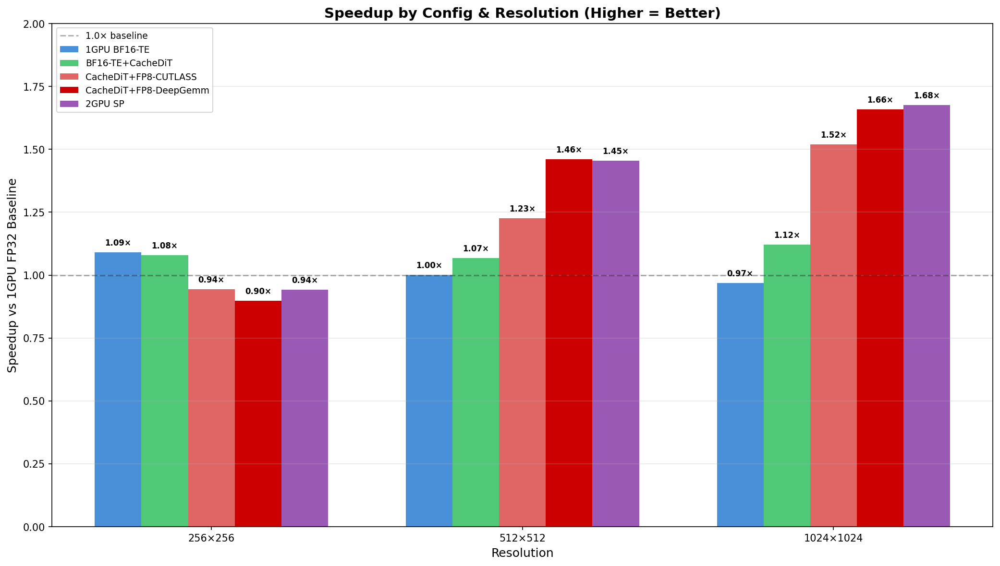
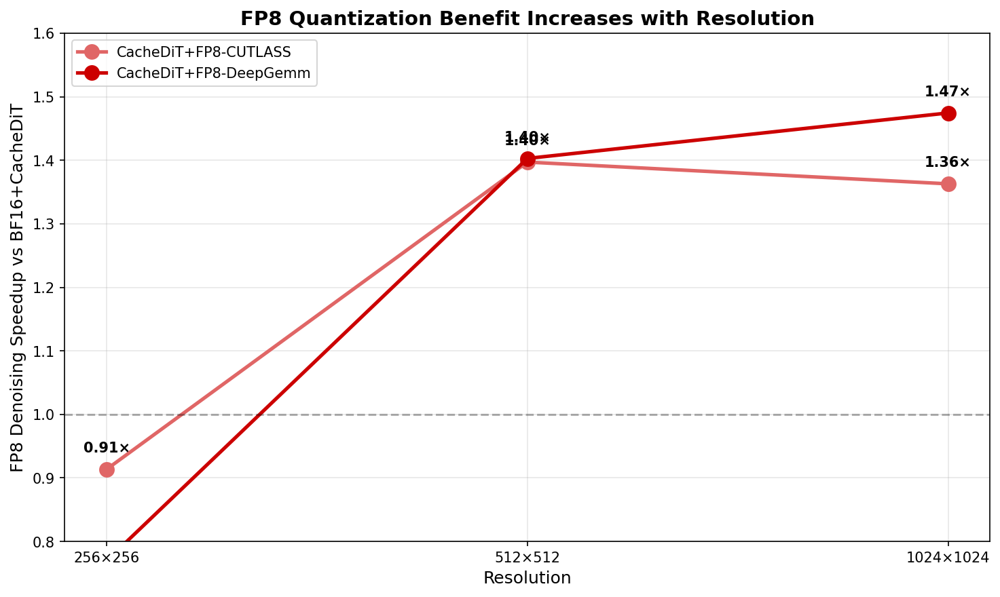
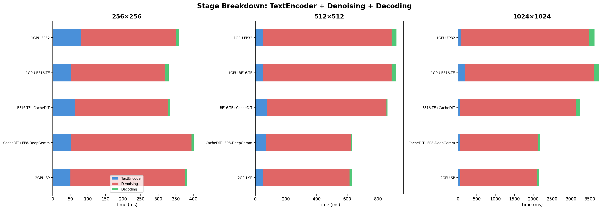
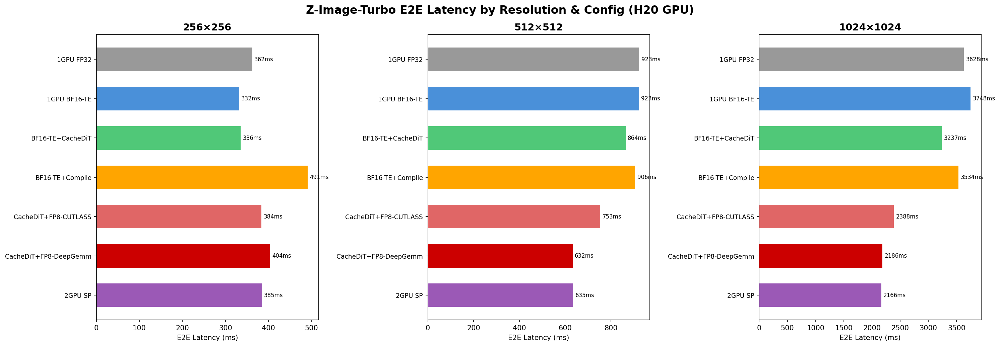
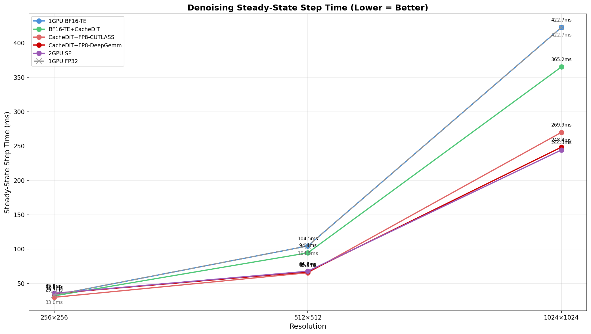
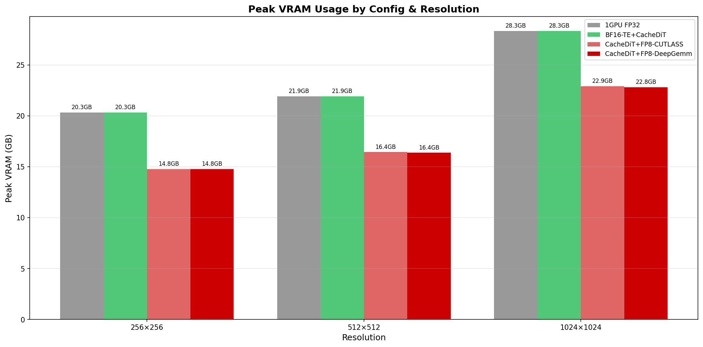

# Z-Image-Turbo 256×256 Performance Analysis Report

> **Hardware**: NVIDIA H20 (SM90, 96GB HBM3)
> **Model**: Z-Image-Turbo (30-layer DiT, dim=3840, 9 denoising steps, no CFG)
> **Resolution**: 256×256 (sequence length ~768 tokens)
> **Date**: 2026-03-19

---

## Part I: Bottleneck Analysis (Before Optimization)

### 1. E2E Latency Breakdown (1 GPU Baseline = 749ms)

| Stage | Time (ms) | Percentage | Note |
|-------|-----------|-----------|------|
| TextEncodingStage | 465.1 | 62.1% | **#1 Bottleneck** — Qwen3 runs in FP32 |
| DenoisingStage | 269.0 | 35.9% | 9 steps, ~33ms/step (steady) |
| DecodingStage | 9.8 | 1.3% | Negligible |


### 2. CUDA Kernel Category Analysis (Total GPU time: 474ms)

| Category | Time (ms) | % | Interpretation |
|----------|-----------|---|----------------|
| BF16 GEMM (DiT) | 251.0 | 53.0% | Optimization Target #2 (FP8/INT4) |
| FP32 GEMM (TextEncoder) | 156.6 | 33.0% | **Optimization Target #1** (FP32→BF16) |
| Elementwise Ops | 21.1 | 4.4% | |
| Convolution (VAE) | 12.6 | 2.6% | |
| FlashAttention | 9.7 | 2.1% | Only 2.1% — NOT a bottleneck |
| RMSNorm / QKNorm | 5.7 | 1.2% | |


### 3. Key Findings

1. **TextEncoding is 62% of E2E** — Qwen3 text encoder runs FP32 GEMM (`sm80_xmma_gemm_f32f32`), extremely slow on H20
2. **GEMM dominates 91.5%** of all GPU kernel time. FlashAttention is only 2.1% (short sequence = 768 tokens)
3. **torch.compile causes 8x regression** — Triton-generated kernels are slower than cuBLAS/nvJET on H20 for small matrices
4. **2-GPU SP is 12% slower** — Communication overhead > parallelism benefit for 768-token sequences
5. **Cache-DiT has no effect** — Only 9 denoising steps, insufficient inter-step redundancy

---

## Part II: Optimization #1 — TextEncoder FP32 → BF16

### 4. BF16 TextEncoder Results

**Method**: `--text-encoder-precisions bf16` (zero code change, CLI flag only)

| Metric | FP32 (Before) | BF16 (After) | Savings | Change |
|--------|---------------|-------------|---------|--------|
| **E2E Latency** | **748.8ms** | **485.9ms** | **-262.9ms** | **-35.1%** |
| TextEncodingStage | 465.1ms | 201.1ms | -264.0ms | -56.8% |
| DenoisingStage | 269.0ms | 271.5ms | +2.5ms | +0.9% (unchanged) |
| DecodingStage | 9.8ms | 9.9ms | +0.0ms | (unchanged) |
| Steady Denoise Step | 32.9ms | 32.9ms | 0.0ms | (unchanged) |
| Peak VRAM | 15,109MB | 13,620MB | -1,489MB | -9.9% |

> **E2E latency reduced by 35.1%, exceeding the 20% optimization target.**


### 5. Bottleneck Shift After BF16 Optimization

After BF16 optimization, the performance bottleneck shifts from TextEncoding to Denoising:

| Stage | Before (FP32) | After (BF16) | Before % | After % |
|-------|---------------|-------------|----------|---------|
| TextEncoding | 465.1ms | 201.1ms | **62.1%** | 41.4% |
| Denoising | 269.0ms | 271.5ms | 35.9% | **55.9%** |
| Decoding | 9.8ms | 9.9ms | 1.3% | 2.0% |


### 6. All Configurations Summary (Updated)

| Config | E2E (ms) | TextEnc | Denoise | vs Baseline |
|--------|----------|---------|---------|-------------|
| 1 GPU (FP32 TextEnc) | 748.8 | 465.1 | 269.0 | baseline |
| **1 GPU (BF16 TextEnc)** | **485.9** | **201.1** | **271.5** | **-35.1%** |
| 1 GPU + Cache-DiT | 747.0 | 471.2 | 266.8 | -0.2% |
| 2 GPU (Ulysses SP) | 837.3 | 469.1 | 357.2 | +11.8% (slower) |
| 1 GPU + torch.compile | 2748.8 | 465.5 | 2272.3 | +267% (regression) |


### 7. Kernel-level Verification (Torch Profiler Trace Comparison)

Profile traces confirm the BF16 optimization works exactly as expected at the GPU kernel level:

**Total GPU kernel time: 474.0ms (FP32) → 341.7ms (BF16) = -132.4ms (-27.9%)**

| Kernel Category | FP32 (ms) | FP32 % | BF16 (ms) | BF16 % | Delta | Note |
|----------------|-----------|--------|-----------|--------|-------|------|
| BF16 GEMM (DiT) | 251.0 | 53.0% | 279.6 | 81.8% | +28.5ms | TextEncoder GEMM now runs as BF16 nvjet |
| **FP32 GEMM (TextEncoder)** | **156.6** | **33.0%** | **0.2** | **0.1%** | **-156.4ms** | **Eliminated!** |
| Elementwise Ops | 21.1 | 4.4% | 18.2 | 5.3% | -2.9ms | Reduced (fewer FP32 casts) |
| Convolution (VAE) | 12.6 | 2.6% | 12.5 | 3.7% | -0.0ms | Unchanged (VAE stays FP32) |
| FlashAttention | 9.7 | 2.1% | 10.7 | 3.1% | +1.0ms | TextEnc attention now BF16 FlashAttn |
| LayerNorm | 1.2 | 0.2% | 0.1 | 0.0% | -1.1ms | FP32 LayerNorm eliminated |
| Softmax/Reduce | 1.7 | 0.4% | 0.0 | 0.0% | -1.7ms | FP32 Softmax eliminated |

Key observations:
- **156.6ms of FP32 GEMM completely eliminated** — replaced by ~28.5ms of BF16 nvjet GEMM (5.5x faster)
- FP32 cuBLAS kernels (`sm80_xmma_gemm_f32f32`) fully replaced by BF16 nvjet kernels (`nvjet_tst_128x256`, `nvjet_tst_144x128`, `nvjet_tst_168x128`)
- FP32 LayerNorm and Softmax kernels also eliminated (Qwen3 in BF16 uses fused BF16 variants)
- DiT kernels completely unchanged — confirming optimization is isolated to TextEncoder


### 8. Quality Validation

- BF16 is the native training precision for Qwen3; no quality degradation expected
- Qwen-Image (same Qwen text encoder) already uses `text_encoder_precisions = ("bf16",)` in production
- Generated images should be visually compared to verify (side-by-side FP32 vs BF16 output)

---

## Part III: Fine-Grained Kernel Profiling (Denoising DiT)

### 9. DiT Kernel Breakdown by Functional Tag (256×256, FP32 Baseline)

Using torch profiler trace with python function call stack analysis, we classify every CUDA kernel
by its functional context within the DiT forward pass. This matches the granularity used in
[Yikai's Z-Image profile analysis](#part-v-cross-reference-yikai-profile).

**Total GPU kernel time: 474.04 ms (all stages)**

#### 9a. Stage-Level Split

| Stage | Kernel Time (ms) | % of Total | Note |
|-------|------------------|-----------|------|
| **TextEncoder** | 167.65 | 35.4% | Dominated by FP32 GEMM (156.43ms) |
| **Denoising (DiT)** | 287.55 | 60.7% | **Main optimization target** |
| **Decoding (VAE)** | 18.84 | 4.0% | Conv + elementwise |

#### 9b. Denoising DiT — Detailed Tag Breakdown (287.55 ms)

| tag | duration (ms) | percentage (%) | Note |
|-----|---------------|-----------------|------|
| feedforward:gemm | 163.80 | 56.96% | **#1** — SwiGLU FFN (w13 gate+up, w2 down) |
| qkv_projection:gemm | 64.02 | 22.26% | **#2** — Q, K, V linear projections |
| output_projection:gemm | 21.24 | 7.39% | **#3** — Attention output projection (to_out) |
| rms_norm_gate:elementwise | 10.99 | 3.82% | adaLN gate/scale mul, tanh, add |
| usp_attention:attention | 9.72 | 3.38% | FlashAttention kernel |
| rms_norm:norm | 4.16 | 1.45% | RMSNorm (sgl_kernel rmsnorm) |
| feedforward:other | 3.12 | 1.08% | Reduce ops within FFN |
| feedforward:silu | 2.36 | 0.82% | SiLU activation |
| adaln_modulation:gemm | 1.68 | 0.59% | adaLN_modulation linear layer |
| rope:other | 1.58 | 0.55% | RoPE (apply_flashinfer_rope) |
| qk_norm:norm | 1.54 | 0.54% | QK normalization kernel |
| rms_norm:other | 1.11 | 0.39% | Triton RMSNorm (layer_norm_fwd) |
| attention_other:copy | 1.01 | 0.35% | Attention reshape/copy |

#### 9c. GEMM-Only Summary (Denoising)

| GEMM Component | Time (ms) | % of Denoising | % of GEMM Total |
|----------------|-----------|----------------|-----------------|
| feedforward (w13+w2) | 163.80 | 56.96% | **65.32%** |
| qkv_projection (q,k,v) | 64.02 | 22.26% | **25.53%** |
| output_projection (o) | 21.24 | 7.39% | **8.47%** |
| adaln_modulation | 1.68 | 0.59% | 0.67% |
| **GEMM Total** | **250.74** | **87.20%** | **100%** |

> **Key takeaway**: GEMM accounts for **87.2%** of denoising kernel time.
> FP8 quantization targeting feedforward + qkv_projection + output_projection alone
> would cover **99.3%** of all denoising GEMM time (249.06 ms).

### 10. Comparison: Our 256×256 vs Yikai's 1024×1024

| tag | **256×256 (H20)** | **1024×1024 (H100)** | Difference |
|-----|-----|-----|------|
| | duration (ms) / % | duration (s) / % | |
| feedforward:gemm | 163.80 / **56.96%** | 0.23 / **34.32%** | FFN dominates more at 256×256 |
| usp_attention:attention | 9.72 / **3.38%** | 0.12 / **17.11%** | Attention 5x less at 256×256 (short seq) |
| qkv_projection:gemm | 64.02 / **22.26%** | 0.09 / **13.15%** | QKV more prominent at 256×256 |
| rms_norm:norm | 5.27 / **1.83%** | 0.08 / **11.44%** | Norm 6x less at 256×256 |
| output_projection:gemm | 21.24 / **7.39%** | 0.03 / **4.47%** | Similar ratio |
| rope:other | 1.58 / **0.55%** | 0.03 / **4.35%** | Rope 8x less at 256×256 |
| rms_norm_gate:elementwise | 10.99 / **3.82%** | 0.04 / **6.31%** | Gate ops similar |
| feedforward:silu | 2.36 / **0.82%** | 0.03 / **3.91%** | SiLU less at 256×256 |

**Why the difference?**

The percentage distribution differs due to **two independent factors**: hardware difference and sequence length.

#### Factor 1 (dominant): Hardware — H20 vs H100 Compute/Bandwidth Ratio

The two profiles were collected on different GPUs with very different compute-to-bandwidth ratios:

| Spec | H20 (our test) | H100 (Yikai) | Ratio |
|------|---------------|-------------|-------|
| BF16 Tensor Core | ~148 TFLOPS | ~990 TFLOPS | H100 **6.7×** stronger |
| HBM Bandwidth | ~4.0 TB/s | ~3.35 TB/s | H20 **1.2×** higher |
| Compute/BW ratio | 37 FLOP/Byte | 296 FLOP/Byte | H100 **8×** higher |

This difference affects compute-bound vs memory-bound ops asymmetrically:

- **GEMM (compute-bound)**: Limited by TFLOPS. H100's 6.7× stronger compute makes GEMM ~6.7× faster → GEMM's percentage **drops significantly** on H100
- **RMSNorm, RoPE, elementwise (memory-bandwidth-bound)**: Limited by HBM bandwidth. H20 and H100 have similar bandwidth (~4.0 vs ~3.35 TB/s) → these ops take roughly the same absolute time → their **percentage rises** on H100 because GEMM shrinks

Example (simplified, ignoring attention):
```
H20:   GEMM=250ms, RMSNorm=5ms  → RMSNorm share =  5/255 ≈  2%
H100:  GEMM= 37ms, RMSNorm=6ms  → RMSNorm share =  6/ 43 ≈ 14%
```

**This is the primary reason RMSNorm jumps from 1.83% (H20) to 11.44% (H100)** — it's a hardware effect, not a sequence length effect.

#### Factor 2: Sequence Length — O(n) vs O(n²) Scaling

All ops in the table are O(n) with respect to sequence length, **except attention which is O(n²)**.

| Op | Complexity | 768 → 12K tokens (16×) |
|----|-----------|------------------------|
| GEMM (feedforward, qkv, output_proj) | O(n) | Time grows ~16× |
| RMSNorm, RoPE, elementwise | O(n) | Time grows ~16× |
| **Attention (FlashAttention)** | **O(n²)** | **Time grows ~256×** |

At longer sequences, attention's O(n²) growth steals share from all O(n) ops equally.
This explains why attention jumps from 3.38% → 17.11%, but it would cause both GEMM and RMSNorm percentages to **decrease equally** — it cannot explain why RMSNorm percentage goes up while GEMM goes down.

#### Combined Effect

| Factor | GEMM % | RMSNorm % | Attention % |
|--------|--------|-----------|-------------|
| Hardware (H20→H100) | ↓↓ (compute-bound ops shrink on faster GPU) | ↑↑ (bandwidth-bound ops' share rises) | ↑ (partially compute, partially bandwidth) |
| Sequence length (768→12K) | ↓ (O(n²) attention steals share) | ↓ (same reason) | ↑↑ (O(n²) growth) |
| **Net** | **↓↓↓** (87% → 52%) | **↑** (1.83% → 11.44%) | **↑↑↑** (3.38% → 17.11%) |

> **Takeaway**: To isolate the pure sequence length effect, one would need to profile both resolutions on the **same GPU**. In that case, all O(n) ops (GEMM, RMSNorm, RoPE) would decrease in percentage equally, while only attention would increase.

#### Optimization Priority Implications

| | **256×256 on H20** | **1024×1024 on H100** |
|---|---|---|
| GEMM % | **87.2%** (dominant) | ~52% (still largest) |
| Attention % | 3.38% (negligible) | **17.11%** (significant) |
| RMSNorm % | 1.83% (minor) | **11.44%** (worth optimizing) |
| **Top priority** | **FP8 GEMM quantization** | Attention (CuTe DSL) + RMSNorm fusion + GEMM |

---

## Part IV: Optimization #2 Plan — DiT FP8 Quantization

### 11. Current State After BF16 TextEncoder

```
E2E = 486ms breakdown:
  TextEncoding:  201ms (41.4%)  ← already optimized from 465ms
  Denoising:     272ms (55.9%)  ← NEW #1 bottleneck
  Decoding:       10ms ( 2.0%)

Denoising kernel time = 287.55ms breakdown:
  feedforward:gemm       163.80ms (56.96%)  ← FP8 target #1
  qkv_projection:gemm     64.02ms (22.26%)  ← FP8 target #2
  output_projection:gemm   21.24ms ( 7.39%)  ← FP8 target #3
  attention (FlashAttn)     9.72ms ( 3.38%)  ← NOT quantized
  RMSNorm + gate + other   28.77ms (10.01%)  ← NOT quantized
```

### 12. Quantization Research & Design

#### 12a. FP8 W8A8 vs INT8 W8A8 — Why FP8?

**Decision: FP8 W8A8, not INT8 W8A8.**

##### sglang-diffusion 支持现状

| | **FP8 W8A8** | **INT8 W8A8** |
|---|---|---|
| 注册为量化方法 | ✅ `"fp8"` (`Fp8Config`) | ❌ 不存在（NVIDIA GPU） |
| 转换工具 | ✅ `convert_hf_to_fp8.py` | ❌ 无 |
| H20 (SM90) GEMM 后端 | ✅ DeepGemm / CUTLASS / Triton | ❌ 无集成 |
| Block 量化 | ✅ 128×128 via DeepGemm | ❌ |
| INT8 存在形式 | — | 仅 `ModelSlim`（华为 NPU/Ascend 专用，NVIDIA GPU 不可用） |

sglang-diffusion 的 `__init__.py` 只注册了两种量化方法：`"fp8"` 和 `"modelslim"`。
其中 `ModelSlim` 的 INT8（`W8A8_DYNAMIC` / `W8A8_STATIC`）依赖华为 NPU 后端 kernel，在 NVIDIA GPU 上无法运行。
**NVIDIA GPU 上只有 FP8 这一条路。**

##### 为什么 INT8 在 LLM 领域更广泛但在这里不适用

INT8 量化（SmoothQuant、GPTQ-INT8 等）在 LLM 推理中确实更广泛，但这有历史原因：

| GPU 时代 | INT8 TensorCore | FP8 TensorCore | 主流选择 |
|----------|-----------------|-----------------|---------|
| Ampere (A100) | ✅ 有 | ❌ 无 | INT8 成为标准 |
| **Hopper (H100/H20)** | ✅ 有 | **✅ 新增** | **FP8 成为新标准** |

在 Hopper 上，FP8 和 INT8 的 TensorCore 算力相同（都是 ~2× BF16），但 FP8 有额外优势：
- **浮点格式天然适应不均匀分布** — Diffusion 模型激活值分布跨 timestep 变化大，INT8 均匀间隔需要更复杂的 calibration
- **工业界趋势** — DeepSeek-V3（FP8）、FLUX-FP8 官方 checkpoint、vLLM/SGLang FP8 支持 → Hopper 上 FP8 是新标准
- **DeepGemm 只做 FP8** — `deepseek-ai/DeepGEMM` 专为 FP8 block GEMM 设计，不支持 INT8

##### DeepGemm 已集成在 sglang 中

`https://github.com/deepseek-ai/DeepGEMM` **已经集成在 sglang 中**，无需额外引入。

在 H20 (SM90) 上使用 FP8 block 128×128 时，sglang 自动选择 DeepGemm 作为 GEMM 后端：

```python
# sglang/srt/layers/quantization/fp8_utils.py
def dispatch_w8a8_block_fp8_linear():
    if ENABLE_JIT_DEEPGEMM:                                    # ← H20 走这条路
        return deepgemm_w8a8_block_fp8_linear_with_fallback
    elif is_blackwell and is_flashinfer:                       # SM100
        return flashinfer_gemm_w8a8_block_fp8_linear
    elif cutlass_block_fp8_supported:                          # CUTLASS fallback
        return cutlass_w8a8_block_fp8_linear
    else:
        return triton_w8a8_block_fp8_linear                    # Triton fallback
```

实际执行路径：
```
BF16 activation
  → sglang_per_token_group_quant_fp8()  [动态量化为 FP8 E4M3, block=128]
  → w8a8_block_fp8_matmul_deepgemm()    [DeepGemm FP8 GEMM]
  → cast 回 BF16 输出
```

#### 12b. E4M3 vs E5M2 — Format Decision

| Property | E4M3 (float8_e4m3fn) | E5M2 (float8_e5m2) |
|----------|----------------------|---------------------|
| Exponent bits | 4 | 5 |
| Mantissa bits | 3 | 2 |
| Dynamic range | ±448 | ±57344 |
| Precision | Higher (8 values per power-of-2 interval) | Lower (4 values) |
| **Best for** | **Weights & activations (inference)** | Gradients (training only) |

**Decision: `float8_e4m3fn` for both weights AND activations.**

Rationale:
- Industry consensus: NVIDIA TransformerEngine, vLLM, SGLang all use E4M3 for inference
- E5M2's wider range is only needed for backward pass gradients
- SGLang codebase exclusively uses `float8_e4m3fn` (confirmed in `fp8_kernel.py`, `convert_hf_to_fp8.py`)

#### 12c. Quantization Strategy — Block 128×128

| Strategy | Accuracy | Speed | H20 Support |
|----------|----------|-------|-------------|
| Per-tensor | Lower | Fastest | ✅ via CUTLASS |
| Per-channel | Medium | Fast | ✅ via CUTLASS |
| **Block 128×128** | **Best** | **Fast** | **✅ via DeepGemm** |

**Decision: Block 128×128 quantization** (best quality/speed tradeoff on Hopper SM90).

- DeepGemm provides optimized block-wise FP8 GEMM with UE8M0 scale format
- Only supports dynamic activation scaling (which is preferred for diffusion models anyway)
- SGLang has tuned configs for H20 with `fp8_w8a8,block_shape=[128, 128]`

#### 12d. Calibration — Dynamic Scaling (No Calibration Needed)

**Decision: Dynamic per-token activation scaling.**

- Weights: statically quantized to FP8 at load time (offline conversion)
- Activations: dynamically quantized per-token at runtime with scale computed on-the-fly
- No calibration dataset needed

Why dynamic is essential for diffusion:
- Activation distributions change across denoising timesteps (early vs late steps)
- Static scales from one timestep may clip activations at others
- Per-token scale computation overhead is ~1-2% of GEMM time

#### 12e. Layers to Quantize / Exclude

| Layer | Quantize? | Reason |
|-------|-----------|--------|
| **feedforward.w13** (gate+up) | ✅ Yes | 163.80ms, largest GEMM |
| **feedforward.w2** (down) | ✅ Yes | Part of feedforward GEMM |
| **to_q, to_k, to_v** (QKV projection) | ✅ Yes | 64.02ms, second largest |
| **to_out** (output projection) | ✅ Yes | 21.24ms |
| adaLN_modulation | ❌ No | Only 1.68ms, sensitive to quantization |
| RMSNorm | ❌ No | Memory-bound, not compute-bound |
| Attention (FlashAttn) | ❌ No | Not a GEMM operation |
| Timestep/position embeddings | ❌ No | Small, sensitive |
| FinalLayer | ❌ No | Only 0.36ms total |
| TextEncoder | ❌ No | Already BF16, separate model |
| VAE decoder | ❌ No | Only 18.84ms, conv-based |

#### 12f. Expected Performance

**H20 FP8 vs BF16 Tensor Core TFLOPS:**

| Precision | H20 TFLOPS | Speedup |
|-----------|-----------|---------|
| BF16 | ~148 TFLOPS | baseline |
| FP8 | ~296 TFLOPS | ~2× compute |

**Expected practical speedup for Z-Image-Turbo DiT:**

| Component | BF16 (ms) | FP8 Expected (ms) | Speedup |
|-----------|-----------|-------------------|---------|
| feedforward:gemm | 163.80 | ~90-110 | ~1.5-1.8× |
| qkv_projection:gemm | 64.02 | ~35-43 | ~1.5-1.8× |
| output_projection:gemm | 21.24 | ~12-14 | ~1.5-1.8× |
| **GEMM Total** | **249.06** | **~137-167** | **~1.5-1.8×** |
| Non-GEMM (unchanged) | 38.49 | 38.49 | 1.0× |
| **Denoising Total** | **287.55** | **~176-206** | **~1.4-1.6×** |

**Projected E2E after FP8:**

```
E2E = 486ms → ~375-415ms
  TextEncoding:  201ms (unchanged)
  Denoising:     ~165-205ms (was 272ms, -25~40%)
  Decoding:       10ms (unchanged)

vs Original FP32 baseline: 749ms → ~375-415ms = -45~50% reduction
```

#### 12g. Nunchaku W4A4 — Not Applicable

❌ **Nunchaku (SVDQuant) does NOT support H20 (SM90)**

From the codebase (`quantization.py`): Nunchaku only supports SM8x (Ampere) and SM12x.
On H20, it will raise `NunchakuSM90NotSupportedError`.

### 13. `convert_hf_to_fp8.py` Feed Forward 排除问题分析

#### 13a. 问题背景

默认 `convert_hf_to_fp8.py`（第139-161行）的排除条件中包含 `"feed_forward" not in key`，
这意味着 **FFN 的 w1/w2/w3 权重全部不做 FP8 量化**。

该脚本文件头注释为 "copied and adapted from Slime"，原始为 FLUX 模型设计。
FLUX 和 Z-Image 的 FFN 结构差异如下：

| | FLUX | Z-Image-Turbo |
|---|---|---|
| FFN 激活 | GEGLU | **SwiGLU** |
| FFN 键名 | `net.0.proj` / `net.2` | `feed_forward.w1/w2/w3` |
| 是否被排除 | 通过 `"net"` 排除 | 通过 `"feed_forward"` 排除 |

#### 13b. 排除列表影响分析

Z-Image-Turbo HF safetensors 权重键名与排除匹配情况：

| 权重键名 | 矩阵形状 | 匹配的排除 | 是否被量化 | GEMM 占比 |
|----------|---------|-----------|-----------|----------|
| `layers.X.attention.to_q.weight` | (3840, 3840) | 无 | ✅ FP8 | 7.42% (Q) |
| `layers.X.attention.to_k.weight` | (3840, 3840) | 无 | ✅ FP8 | 7.42% (K) |
| `layers.X.attention.to_v.weight` | (3840, 3840) | 无 | ✅ FP8 | 7.42% (V) |
| `layers.X.attention.to_out.0.weight` | (3840, 3840) | 无 | ✅ FP8 | 7.39% |
| **`layers.X.feed_forward.w1.weight`** | (10240, 3840) | **`"feed_forward"`** | ❌ **被排除** | **19.0%** (gate) |
| **`layers.X.feed_forward.w3.weight`** | (10240, 3840) | **`"feed_forward"`** | ❌ **被排除** | **19.0%** (up) |
| **`layers.X.feed_forward.w2.weight`** | (3840, 10240) | **`"feed_forward"`** | ❌ **被排除** | **19.0%** (down) |
| `layers.X.adaLN_modulation.0.weight` | (15360, 2560) | `"modulation"` | ❌ 排除（正确） | ~1% |
| `all_final_layer.*.linear.weight` | - | `"all_final_layer"` | ❌ 排除（正确） | <0.5% |
| `time_in.mlp.*.weight` | - | `"time_in"` | ❌ 排除（正确） | <0.1% |

**量化覆盖率对比：**

| 方案 | FP8 GEMM 覆盖 | 被加速的时间 | 损失的加速 |
|------|---------------|-------------|-----------|
| 移除 `feed_forward` 排除 | **100% GEMM** (249.06ms) | ~82-112ms | 0 |
| 保留 `feed_forward` 排除 | **34.2% GEMM** (85.26ms) | ~28-38ms | **~57-74ms** |

#### 13c. 结论：应该移除 `feed_forward` 排除

**理由：**
1. **FFN 是最大的 GEMM 消费者** — 56.96%，排除后 FP8 加速效果损失 2/3
2. **SwiGLU 对量化鲁棒** — gate 机制天然提供值域控制（silu × linear），激活值不会爆炸
3. **Block 128×128 + dynamic scaling 是最保守的量化策略** — 每128×128块独立计算 scale，误差被局部化
4. **社区验证** — HuggingFace 上已有 `MickJ/Z-Image-Turbo-fp8`，SGLang 测试用例也引用了它
5. **DeepGemm 对齐完美** — w1 (10240×3840), w3 (10240×3840), w2 (3840×10240) 全部满足 `shape[0]%64==0` 且 `shape[1]%128==0`

**该排除是从 FLUX 继承的遗留问题，不适用于 Z-Image-Turbo。**

#### 13d. 其他排除检查

- `"net" not in key`（line 149）— FLUX 专有，Z-Image 的 FFN 用 `w1/w2/w3`，**不包含** `"net"` 子串，无影响
- `"modulation" not in key` — 正确排除 adaLN，仅占 ~1% GEMM，对量化敏感
- `"all_final_layer"` / `"time_in"` — 正确排除，极小计算量

### 14. FP8 量化执行计划

> 已创建 Z-Image 专用转换脚本：`zimage_256_256/convert_zimage_to_fp8.py`
> （移除了 `feed_forward` 排除，支持 `--exclude-feed-forward` 做 A/B 对比）

#### 在 GPU 集群上执行以下步骤：

```bash
export MODEL=/mnt/geminihzceph/rhyshen/models/Z-Image-Turbo
export PROMPT="A beautiful sunset over the ocean with golden clouds"
export WORK=/mnt/geminihzceph/rhyshen/scripts/scripts_collection/sglang-diffusion-benchmark/zimage_fp8
export OUT_DIR=/mnt/geminihzceph/rhyshen/profiles/zimage_256_256
# export SGLANG_ENABLE_JIT_DEEPGEMM=0
# ============================================================
# Step 1: FP8 转换（包含 FFN）
# ============================================================
cd $WORK
python convert_zimage_to_fp8.py \
    --model-dir $MODEL/transformer \
    --save-dir $MODEL/transformer-FP8-block128 \
    --strategy block --block-size 128 128

# ============================================================
# Step 2: FP8 转换（排除 FFN，用于 A/B 对比）
# ============================================================
python convert_zimage_to_fp8.py \
    --model-dir $MODEL/transformer \
    --save-dir $MODEL/transformer-FP8-block128-no-ffn \
    --strategy block --block-size 128 128 \
    --exclude-feed-forward

# ============================================================
# Step 3: 基准测试 — BF16 TextEnc + FP8 DiT（含 FFN）
# ============================================================
sglang generate \
    --model-path $MODEL \
    --transformer-path $MODEL/transformer-FP8-block128 \
    --text-encoder-precisions bf16 \
    --prompt "$PROMPT" \
    --height 256 \
    --width 256 \
    --warmup \
    --save-output \
    --output-file-name bf16te_fp8dit.png \
    --output-path $OUT_DIR/outputs \
    --perf-dump-path $OUT_DIR/zimage_bench/baseline_1gpu_bf16te_fp8dit.json

# ============================================================
# Step 4: 基准测试 — BF16 TextEnc + FP8 DiT（排除 FFN）
# ============================================================
sglang generate \
    --model-path $MODEL \
    --transformer-path $MODEL/transformer-FP8-block128-no-ffn \
    --text-encoder-precisions bf16 \
    --prompt "$PROMPT" \
    --height 256 \
    --width 256 \
    --warmup \
    --save-output \
    --output-file-name bf16te_fp8dit_no_ffn.png \
    --output-path $OUT_DIR/outputs \
    --perf-dump-path $OUT_DIR/zimage_bench/baseline_1gpu_bf16te_fp8dit_no_ffn.json

# ============================================================
# Step 5a: Profiler 分析 — 确认 FP8 GEMM kernel 被使用
# ============================================================
sglang generate \
    --model-path $MODEL \
    --transformer-path $MODEL/transformer-FP8-block128 \
    --text-encoder-precisions bf16 \
    --prompt "$PROMPT" \
    --height 256 --width 256 --warmup \
    --profile --profile-all-stages --save-output

# ============================================================
# Step 5b: Profiler 分析 — 确认 FP8 GEMM kernel 被使用 no ffn
# ============================================================
sglang generate \
    --model-path $MODEL \
    --transformer-path $MODEL/transformer-FP8-block128-no-ffn \
    --text-encoder-precisions bf16 \
    --prompt "$PROMPT" \
    --height 256 --width 256 --warmup \
    --profile --profile-all-stages --save-output

# ============================================================
# Step 6: 质量对比（固定 seed=42）
# ============================================================
SEEDS=(42 123 256 777)
mkdir -p $WORK/quality_comparison

for SEED in "${SEEDS[@]}"; do
    echo "=== Seed $SEED ==="

    # (a) FP32 baseline
    sglang generate --model-path $MODEL --prompt "$PROMPT" \
        --height 256 --width 256 --seed $SEED \
        --save-output --output-dir $WORK/quality_comparison/fp32_seed${SEED}

    # (b) BF16 TextEnc only
    sglang generate --model-path $MODEL --prompt "$PROMPT" \
        --height 256 --width 256 --seed $SEED \
        --text-encoder-precisions bf16 \
        --save-output --output-dir $WORK/quality_comparison/bf16te_seed${SEED}

    # (c) BF16 TextEnc + FP8 DiT (with FFN)
    sglang generate --model-path $MODEL \
        --transformer-path $MODEL/transformer-FP8-block128 \
        --text-encoder-precisions bf16 \
        --prompt "$PROMPT" \
        --height 256 --width 256 --seed $SEED \
        --save-output --output-dir $WORK/quality_comparison/fp8_full_seed${SEED}

    # (d) BF16 TextEnc + FP8 DiT (without FFN)
    sglang generate --model-path $MODEL \
        --transformer-path $MODEL/transformer-FP8-block128-no-ffn \
        --text-encoder-precisions bf16 \
        --prompt "$PROMPT" \
        --height 256 --width 256 --seed $SEED \
        --save-output --output-dir $WORK/quality_comparison/fp8_no_ffn_seed${SEED}
done
```

#### 预期结果对照表

| 配置 | 预期 E2E | 预期 Denoising | GEMM 加速率 | 质量 |
|------|---------|---------------|------------|------|
| FP32 baseline | 749ms | 269ms | — | 参考 |
| BF16 TextEnc | 486ms | 272ms | — | 接近参考 |
| BF16 TextEnc + FP8 DiT (含FFN) | **~375-415ms** | **~165-205ms** | ~1.5-1.8× | 需验证 |
| BF16 TextEnc + FP8 DiT (排除FFN) | ~445-465ms | ~230-250ms | ~1.2-1.4× | 可能更好 |

#### 验证检查清单

- [ ] Step 1 输出：确认 `feed_forward.w1/w2/w3.weight` 被标记为 `[FP8]`
- [ ] Step 2 输出：确认 `feed_forward.*` 被标记为 `[SKIP]`
- [ ] Step 3 结果：E2E < 420ms（目标 375-415ms）
- [ ] Step 4 结果：E2E > Step 3 结果（确认 FFN FP8 有效）
- [ ] Step 5 trace：搜索 `deepgemm` 或 `fp8` kernel 名称，确认 FP8 GEMM 被调用
- [ ] Step 6 图片：4 个 seed 的质量对比，FP8 与 FP32 视觉差异可接受

#### 故障排查

| 问题 | 可能原因 | 解决方案 |
|------|---------|---------|
| 转换 OOM | GPU 显存不足 | 降低 `--max-workers 1` |
| 推理报错 weight shape 不匹配 | config.json 缺少 quantization_config | 检查转换输出的 config.json |
| E2E 没有明显提速 | DeepGemm 未被选中 | 检查 `dispatch_w8a8_block_fp8_linear()` 日志 |
| 图像质量严重下降 | FFN 量化损失过大 | 回退到 `--exclude-feed-forward` 方案 |
| `--transformer-path` 不识别 | CLI 版本过旧 | 确认使用最新 sglang 版本（支持动态 `--<component>-path`） |

## Part V: FP8 量化实测结果

### 18. E2E 时延结果

| 配置 | E2E (ms) | TextEnc (ms) | Denoise (ms) | Decode (ms) | Steady Step (ms) | Peak VRAM |
|------|---------|-------------|-------------|-------------|-----------------|-----------|
| FP32 Baseline | 748.8 | 465.1 | 269.0 | 9.8 | 32.9 | 15,109MB |
| BF16 TextEnc | **485.9** | **201.1** | 271.5 | 9.9 | 32.9 | 13,620MB |
| BF16+FP8 DiT (含FFN) | 1315.6 | 746.7 | 530.4 | 20.1 | 64.9 | 11,706MB |
| BF16+FP8 DiT (排除FFN) | 1323.5 | 753.3 | 534.0 | 17.9 | 65.3 | 11,706MB |

> **⚠️ 关键发现：FP8 带来了 2× 性能回退，而非加速。**

#### 逐步时延对比 (denoise_steps_ms)

| Step | FP32 (ms) | BF16 (ms) | FP8+FFN (ms) | FP8-noFFN (ms) |
|------|-----------|-----------|-------------|----------------|
| 0 | 21.8 | 21.4 | 33.7 | 34.3 |
| 1 | 20.0 | 19.6 | 37.8 | 39.4 |
| 2 | 26.4 | 27.0 | **66.5** | **65.3** |
| 3 | 33.1 | 33.2 | 66.2 | 66.1 |
| 4 | 32.7 | 32.8 | 64.1 | 65.6 |
| 5 | 33.0 | 32.9 | 65.9 | 65.2 |
| 6 | 32.9 | 32.8 | 63.5 | 65.7 |
| 7 | 33.2 | 33.0 | 65.3 | 64.0 |
| 8 | 32.7 | 32.7 | 64.2 | 65.4 |
| **Steady avg (3-8)** | **32.9** | **32.9** | **64.9** | **65.3** |

**观察**：
- FP8 稳态步耗时 ~65ms，是 BF16 的 **1.97×**（回退）
- Step 0-1 较快（33-39ms），step 2 突然跳至 66ms → 可能为 **DeepGemm JIT 编译**开销
- 两种 FP8 配置（含/排除 FFN）性能几乎相同 → 回退不来自 FFN，而来自 QKV/output FP8 路径

### 19. 图像质量结果

| 配置 | 质量 | 备注 |
|------|------|------|
| FP32 baseline | ✅ 正确 | 参考 |
| BF16 TextEnc | ✅ 正确 | 与 FP32 视觉一致 |
| **FP8 (排除 FFN)** | **✅ 正确** | 与 BF16 视觉一致 |
| **FP8 (含 FFN)** | **❌ 严重损坏** | 生成噪声图像 |

> FP8-no-FFN 正确、FP8-with-FFN 生成噪声，说明 **FFN 的 FP8 量化导致了灾难性质量损失**。

可能原因：
1. **Scale 合并错误**：`convert_zimage_to_fp8.py` 对 HF 的 w1/w3 分别量化生成各自的 scale，但 sglang 通过 `param_names_mapping` 将 w1+w3 合并为 w13。如果 `BlockQuantScaleParameter` 的 weight_loader 在合并时未正确处理两组独立 scale 的拼接，会导致反量化时使用错误的 scale
2. **SwiGLU 对 FP8 精度敏感**：gate 分支（silu）和 up 分支的乘积放大了量化误差
3. **Block 128×128 粒度不足**：FFN 的激活值分布在不同 timestep 差异大

### 20. Torch Profiler GPU Kernel 分析

#### 20a. GPU Kernel 总时间对比

| 配置 | GPU Kernel 总时间 | vs BF16 |
|------|------------------|---------|
| BF16 baseline | 341.7 ms | — |
| FP8 (含 FFN) | 640.4 ms | +87.4% |
| FP8 (排除 FFN) | 636.9 ms | +86.4% |

> Profiler 下 FP8 GPU kernel 总时间几乎是 BF16 的 2 倍。

#### 20b. Kernel 类别对比

| Kernel 类别 | BF16 (ms) | BF16 % | FP8+FFN (ms) | FP8+FFN % | FP8-noFFN (ms) | FP8-noFFN % |
|------------|-----------|--------|-------------|-----------|---------------|-------------|
| BF16 GEMM (nvjet) | 279.6 | 81.8% | 388.2 | 60.6% | 385.4 | 60.5% |
| **DeepGemm FP8** | **0** | **0%** | **106.1** | **16.6%** | **117.7** | **18.5%** |
| FlashAttention | 10.7 | 3.1% | 32.9 | 5.1% | 30.4 | 4.8% |
| Elementwise | 17.3 | 5.1% | 32.3 | 5.0% | 24.9 | 3.9% |
| Conv (VAE) | 12.5 | 3.7% | 26.9 | 4.2% | 34.3 | 5.4% |
| RMSNorm | 4.6 | 1.4% | 9.5 | 1.5% | 9.4 | 1.5% |
| **FP8 quant overhead** | **0** | **0%** | **8.5** | **1.3%** | **13.3** | **2.1%** |
| QKNorm | 1.5 | 0.4% | 6.3 | 1.0% | 1.4 | 0.2% |
| splitK reduce | 3.1 | 0.9% | 5.6 | 0.9% | 5.5 | 0.9% |
| SiLU/Activation | 3.1 | 0.9% | 5.3 | 0.8% | 3.1 | 0.5% |
| tanh (adaLN) | 1.1 | 0.3% | 3.5 | 0.5% | 1.1 | 0.2% |
| RoPE | 1.2 | 0.4% | 3.7 | 0.6% | 1.2 | 0.2% |

**关键发现**：
1. **BF16 nvjet GEMM 不减反增**：279.6ms → 388.2ms（+39%）。这说明 FP8 没有替换掉 nvjet 调用，反而引入了额外开销
2. **DeepGemm FP8 是新增开销**：106ms/118ms 的 FP8 GEMM 是在 nvjet 之外额外执行的，不是替换
3. **FP8 quant 开销**：`per_token_group_quant` 额外 8.5-13.3ms
4. **几乎所有类别都膨胀了**：FlashAttention 10.7→32.9ms, Elementwise 17.3→32.3ms → torch profiler 自身开销在 FP8 模式下显著增大

#### 20c. 核心 Kernel 统计

| Kernel 名称 | BF16 Count | FP8+FFN Count | 说明 |
|------------|-----------|---------------|------|
| nvjet (BF16 GEMM) | 2,322 | 1,098 | FP8 减少了 ~1,224 个 nvjet 调用 |
| deep_gemm (FP8) | 0 | 1,224 | 新增 1,224 个 FP8 GEMM |
| per_token_group_quant | 0 | 1,224 | 新增 1,224 个量化 kernel |

> nvjet 减少 1,224 + DeepGemm 新增 1,224 → 数量匹配，说明 FP8 确实替换了部分 GEMM。
> 但 **替换后的 DeepGemm + quant overhead 比原来的 nvjet 更慢**。

### 21. nsys 测试命令（待执行）

以下命令需要在 GPU 集群上执行，用于获取**无 torch profiler 开销**的干净 GPU kernel 时延数据。

```bash
export MODEL=/mnt/geminihzceph/rhyshen/models/Z-Image-Turbo
export PROMPT="A beautiful sunset over the ocean with golden clouds"
export NSYS_DIR=/mnt/geminihzceph/rhyshen/profiles/zimage_256_256/zimage_bench/nsys

# ============================================================
# nsys 1: BF16 TextEnc + FP8 DiT（含 FFN）
# ============================================================
nsys profile \
    -t cuda \
    -o "${NSYS_DIR}/zimage_1gpu_256x256_fp8" \
    -f true \
    --trace-fork-before-exec=true \
    sglang generate \
        --model-path $MODEL \
        --transformer-path $MODEL/transformer-FP8-block128 \
        --text-encoder-precisions bf16 \
        --prompt "$PROMPT" \
        --height 256 --width 256 \
        --warmup

# ============================================================
# nsys 2: BF16 TextEnc + FP8 DiT（排除 FFN）
# ============================================================
nsys profile \
    -t cuda \
    -o "${NSYS_DIR}/zimage_1gpu_256x256_fp8_no_ffn" \
    -f true \
    --trace-fork-before-exec=true \
    sglang generate \
        --model-path $MODEL \
        --transformer-path $MODEL/transformer-FP8-block128-no-ffn \
        --text-encoder-precisions bf16 \
        --prompt "$PROMPT" \
        --height 256 --width 256 \
        --warmup

# ============================================================
# nsys 3: BF16 TextEnc baseline（对照组，如已有可跳过）
# ============================================================
# 已有: ${NSYS_DIR}/zimage_1gpu_256x256_te16.nsys-rep

# ============================================================
# nsys 分析：使用 gputrc2graph.py 生成分类报告
# ============================================================
cd /data/home/rhyshen/rhyshen/workspace/sglang/examples/profiler/nsys_profile_tools

# 分析 FP8 (含 FFN)
python3 gputrc2graph.py \
    --in_file "${NSYS_DIR}/zimage_1gpu_256x256_fp8.nsys-rep,sglang,diffusion,1.3" \
    --out_dir "${NSYS_DIR}/analysis_fp8" \
    --title "Z-Image-Turbo 256x256 FP8 (with FFN)"

# 分析 FP8 (排除 FFN)
python3 gputrc2graph.py \
    --in_file "${NSYS_DIR}/zimage_1gpu_256x256_fp8_no_ffn.nsys-rep,sglang,diffusion,1.3" \
    --out_dir "${NSYS_DIR}/analysis_fp8_no_ffn" \
    --title "Z-Image-Turbo 256x256 FP8 (no FFN)"

# 分析 BF16 baseline
python3 gputrc2graph.py \
    --in_file "${NSYS_DIR}/zimage_1gpu_256x256_te16.nsys-rep,sglang,diffusion,0.49" \
    --out_dir "${NSYS_DIR}/analysis_bf16" \
    --title "Z-Image-Turbo 256x256 BF16 TextEnc baseline"

# 读取对比结果
python3 - << 'PYEOF'
import pandas as pd, os

for label, subdir in [("BF16 baseline", "analysis_bf16"), ("FP8+FFN", "analysis_fp8"), ("FP8-noFFN", "analysis_fp8_no_ffn")]:
    csv_path = f"{os.environ.get('NSYS_DIR', '.')}/{subdir}/result.csv"
    if not os.path.exists(csv_path):
        print(f"  {label}: {csv_path} not found")
        continue
    df = pd.read_csv(csv_path)
    summary = df.groupby("Category")["Elapsed Time (sec)"].sum().sort_values(ascending=False)
    total = summary.sum()
    print(f"\n=== {label} (total: {total:.3f}s) ===")
    for cat, sec in summary.items():
        print(f"  {cat:<30} {sec:>8.3f}s  ({sec/total*100:>5.1f}%)")
PYEOF
```

**nsys 的目的**：
- 确认 FP8 性能回退是**真实的**还是 torch profiler 开销造成的假象
- 获取无干扰的 kernel 级别时延数据
- 为进一步分析 DeepGemm vs nvjet 在小矩阵（768 tokens）上的实际性能差异提供数据

**nsys 参数说明**：
- `--delay 60`：延迟 60 秒开始采集（跳过 model loading + warmup）
- `--duration 30`：采集 30 秒数据（覆盖实际推理）
- `-t cuda`：只采集 CUDA kernel 和 memcpy events
- `gputrc2graph.py` 的最后一个逗号参数是 E2E 秒数（用于计算 GPU 利用率）

> **注意**：`--delay` 值需要根据实际 model loading + warmup 时间调整。如果推理在 delay 之前完成，则抓不到 kernel。建议先不加 `--delay` 和 `--duration` 跑一次确认 timing，再调整。

### 22. FP8 性能回退根因分析与修复

#### 22a. 根因确认：FP8 weight_scale_inv 完全未被加载

**证据**：GPU 集群运行 nsys 时观察到加载日志：
```
[03-22 01:13:15] Checkpoint keys not loaded (no matching model parameter)
['context_refiner.0.feed_forward.w1.weight_scale_inv',
 'context_refiner.0.feed_forward.w2.weight_scale_inv',
 'context_refiner.0.feed_forward.w3.weight_scale_inv',
 'layers.0.feed_forward.w1.weight_scale_inv',
 'layers.0.feed_forward.w2.weight_scale_inv',
 'layers.0.feed_forward.w3.weight_scale_inv',
 ...
]
... and 82 more skipped keys.
```

**全部** `weight_scale_inv` 都被静默跳过 → 模型中的 FP8 scale 保持默认初始值 `torch.finfo(float32).min` ≈ `-3.40282e+38`。

#### 22b. 根因链（三层 Bug）

```
Bug 1 (核心) ─ FeedForward 类不接受 quant_config
    │
    ├→ w13 (MergedColumnParallelLinear) 和 w2 (RowParallelLinear)
    │  未传入 quant_config → 使用 UnquantizedLinearMethod
    │  → 模型 state_dict 中根本没有 weight_scale_inv 参数
    │  → checkpoint 的 scale 键被 strict=False 静默跳过
    │
Bug 2 ─ param_names_mapping 缺少 scale 映射规则
    │
    ├→ checkpoint 中 w1.weight_scale_inv / w3.weight_scale_inv
    │  需要映射到 w13.weight_scale_inv（与 w1.weight → w13.weight 类似）
    │  → 即使 FeedForward 修复了，scale 名不匹配也会被跳过
    │
Bug 3 ─ BlockQuantScaleParameter 的 weight_loader_v2 未实现
    │
    └→ MergedColumnParallelLinear.weight_loader_v2() 对
       BlockQuantScaleParameter 直接 raise NotImplementedError
       → 即使 scale 名映射正确，也无法加载
```

**三个 Bug 必须同时修复，任何一个单独修复都不够。**

#### 22c. 详细分析

**Bug 1：`FeedForward.__init__` 不接受 `quant_config`**

文件：`python/sglang/multimodal_gen/runtime/models/dits/zimage.py:101-108`

```python
# 修复前
class FeedForward(nn.Module):
    def __init__(self, dim: int, hidden_dim: int):  # ← 没有 quant_config
        self.w13 = MergedColumnParallelLinear(dim, [...], bias=False)  # ← 无量化
        self.w2 = RowParallelLinear(hidden_dim, dim, bias=False)       # ← 无量化
```

对比 `ZImageAttention`（同文件 line 118-200），后者接受并传递 `quant_config` 给所有 Linear 层。
而 `ZImageTransformerBlock.__init__` 中创建 FeedForward 时也没有传递 `quant_config`（line 329）。

**影响**：没有 `quant_config` → `Fp8LinearMethod.create_weights()` 从未被调用 → 不注册 `weight_scale_inv` 参数 → checkpoint 的 scale 键在 `meta_sd.get(name)` 返回 None → 被 `strict=False` 跳过。

**Bug 2：`param_names_mapping` 缺少 scale 映射**

文件：`python/sglang/multimodal_gen/configs/models/dits/zimage.py:50-65`

原始只有 `.weight$` 结尾的映射规则：
```python
r"(.*)\.feed_forward\.w1\.weight$": (r"\1.feed_forward.w13.weight", 0, 2),
r"(.*)\.feed_forward\.w3\.weight$": (r"\1.feed_forward.w13.weight", 1, 2),
```

缺少对应的 scale 映射：
- `w1.weight_scale_inv` → `w13.weight_scale_inv`
- `w3.weight_scale_inv` → `w13.weight_scale_inv`

**Bug 3：`BlockQuantScaleParameter` 的 `weight_loader_v2` 未实现**

文件：`python/sglang/multimodal_gen/runtime/layers/linear.py:619-620`

```python
if isinstance(param, BlockQuantScaleParameter):
    raise NotImplementedError("FP8 is not implemented yet")
```

当 `hf_to_custom_state_dict` 合并 w1+w3 的 scale 后，通过 `weight_loader_v2(param, merged_scale, shard_id=None)` 加载。由于 `BlockQuantScaleParameter` 未被处理，会走到 `_load_fused_module_from_checkpoint`，后者按元素维度（如 3840）切分 — 但 scale 的维度是 block 维度（如 30），导致错误。

#### 22d. 修复内容

**修复 1：FeedForward 添加 quant_config 支持**

文件：`runtime/models/dits/zimage.py`

```python
# 修复后
class FeedForward(nn.Module):
    def __init__(self, dim, hidden_dim,
                 quant_config=None, prefix=""):
        self.w13 = MergedColumnParallelLinear(
            dim, [hidden_dim, hidden_dim], bias=False,
            quant_config=quant_config, prefix=f"{prefix}.w13")
        self.w2 = RowParallelLinear(
            hidden_dim, dim, bias=False,
            quant_config=quant_config, prefix=f"{prefix}.w2")
```

在 `ZImageTransformerBlock.__init__` 中传递 `quant_config` 和 `prefix`：
```python
self.feed_forward = FeedForward(
    dim=dim, hidden_dim=hidden_dim,
    quant_config=quant_config,
    prefix=f"{prefix}.feed_forward")
```

**修复 2：param_names_mapping 添加 scale 映射**

文件：`configs/models/dits/zimage.py`

新增 4 条映射规则：
```python
# FP8 block scale
r"(.*)\.feed_forward\.w1\.weight_scale_inv$": (r"\1.feed_forward.w13.weight_scale_inv", 0, 2),
r"(.*)\.feed_forward\.w3\.weight_scale_inv$": (r"\1.feed_forward.w13.weight_scale_inv", 1, 2),
# FP8 per-tensor scale
r"(.*)\.feed_forward\.w1\.weight_scale$": (r"\1.feed_forward.w13.weight_scale", 0, 2),
r"(.*)\.feed_forward\.w3\.weight_scale$": (r"\1.feed_forward.w13.weight_scale", 1, 2),
```

`hf_to_custom_state_dict` 会自动通过 `torch.cat(dim=0)` 合并 w1+w3 的 scale，与 weight 合并逻辑一致。

**修复 3：BlockQuantScaleParameter weight_loader_v2 实现**

文件：`runtime/layers/linear.py`

```python
# loaded_shard_id=None 分支（已合并的 scale 直接拷贝）
if isinstance(param, BlockQuantScaleParameter):
    param.data.copy_(loaded_weight)
    return

# loaded_shard_id 分支（TP 场景，按 block 维度切分）
if isinstance(param, BlockQuantScaleParameter):
    block_n = self.quant_method.quant_config.weight_block_size[0]
    shard_offset = (sum(output_sizes[:shard_id]) + block_n - 1) // block_n // tp_size
    shard_size = (output_sizes[shard_id] + block_n - 1) // block_n // tp_size
```

#### 22e. 修改文件清单

| 文件 | 修改类型 | 说明 |
|------|---------|------|
| `runtime/models/dits/zimage.py` | **核心修复** | FeedForward 添加 quant_config/prefix 参数 |
| `configs/models/dits/zimage.py` | 新增规则 | param_names_mapping 添加 weight_scale_inv/weight_scale 映射 |
| `runtime/layers/linear.py` | 功能实现 | BlockQuantScaleParameter 在 weight_loader_v2 中的加载逻辑 |

#### 22f. 验证计划

```bash
# Step 1: 诊断脚本确认 scale 加载成功
python zimage_256_256/debug_fp8_scales.py

# Step 2: FP8 benchmark（修复后）
sglang generate \
    --model-path $MODEL \
    --transformer-path $MODEL/transformer-FP8-block128 \
    --text-encoder-precisions bf16 \
    --prompt "$PROMPT" \
    --height 256 --width 256 --warmup --save-output \
    --perf-dump-path $OUT_DIR/zimage_bench/baseline_1gpu_bf16te_fp8dit_fixed.json

# Step 3: 图像质量验证（固定 seed）
sglang generate \
    --model-path $MODEL \
    --transformer-path $MODEL/transformer-FP8-block128 \
    --text-encoder-precisions bf16 \
    --prompt "$PROMPT" \
    --height 256 --width 256 --seed 42 --save-output
```

**成功标准**：
- [ ] 诊断脚本显示所有 scale 参数状态为 ✅ OK（非 DEFAULT_INIT）
- [ ] FP8 E2E < 420ms（目标 375-415ms）
- [ ] FP8 含 FFN 图像质量正常（不再是噪声）
- [ ] "Checkpoint keys not loaded" 日志中不再出现 weight_scale_inv

#### 22g. 回溯：为什么 FP8 回退是 2× 而不是直接报错

FP8 权重（`float8_e4m3fn`）**确实被正确加载了**（因为 `w1.weight` → `w13.weight` 的映射是存在的）。
只有 `weight_scale_inv`（反量化 scale）未被加载。

DeepGemm FP8 GEMM 的执行路径：
```
input (BF16) → per_token_group_quant → FP8 input
FP8 input × FP8 weight → FP8 accumulation → scale by weight_scale_inv → BF16 output
```

当 `weight_scale_inv = -3.40282e+38`（默认值）时：
- FP8 GEMM 仍然执行（不报错）
- 但输出被乘以极大负数 → 值溢出/NaN
- 后续层的 RMSNorm/FlashAttention 处理异常值 → 计算路径异常 → **时延膨胀**
- 最终输出为噪声/损坏图像

这解释了：
1. **为什么图像损坏** — scale 错误导致反量化结果完全错误
2. **为什么性能回退** — 异常大的中间值触发慢速计算路径（FlashAttention 处理极端值效率低）
3. **为什么 FP8+FFN 和 FP8-noFFN 表现相同** — 问题不在 FFN 是否量化，而是所有 FP8 层的 scale 都没加载

### 23. FP8 修复后验证结果

#### 23a. E2E 时延对比（修复前 vs 修复后）

| 配置 | E2E (ms) | TextEnc (ms) | Denoise (ms) | Decode (ms) | Steady Step (ms) | Peak VRAM |
|------|---------|-------------|-------------|-------------|-----------------|-----------|
| FP32 Baseline | 748.8 | 465.1 | 269.0 | 9.8 | 32.9 | 15,109MB |
| BF16 TextEnc | 485.9 | 201.1 | 271.5 | 9.9 | 32.9 | 13,620MB |
| ~~FP8 broken (含FFN)~~ | ~~1315.6~~ | ~~746.7~~ | ~~530.4~~ | ~~20.1~~ | ~~64.9~~ | ~~11,706MB~~ |
| **FP8 fixed (含FFN)** | **547.5** | **188.4** | **350.2** | **5.8** | **38.5** | **8,788MB** |

#### 23b. FP8 Denoising 逐步时延

| Step | BF16 (ms) | FP8 fixed (ms) | Delta |
|------|-----------|----------------|-------|
| 0 | 21.4 | 39.5 | +18.1 |
| 1 | 19.6 | 38.0 | +18.4 |
| 2 | 27.0 | 38.6 | +11.6 |
| 3 | 33.2 | 38.3 | +5.1 |
| 4 | 32.8 | 38.8 | +6.0 |
| 5 | 32.9 | 38.7 | +5.8 |
| 6 | 32.8 | 38.9 | +6.1 |
| 7 | 33.0 | 38.2 | +5.2 |
| 8 | 32.7 | 38.5 | +5.8 |
| **Steady avg (3-8)** | **32.9** | **38.5** | **+5.6 (+17%)** |

#### 23c. 结果分析

**FP8 修复已验证成功：**
- ✅ 图像质量完全正确（不再是噪声/损坏）
- ✅ "Checkpoint keys not loaded" 日志中不再出现 weight_scale_inv
- ✅ quant_config 正确解析（`Resolved quantization config from weights path`）
- ✅ VRAM 从 13,620MB 降至 8,788MB（**-35.5%**）

**但 FP8 没有达到预期的加速效果：**

| 指标 | 预期 | 实际 | 差距 |
|------|------|------|------|
| E2E | 375-415ms | **547.5ms** | +32~46% |
| Denoising | 165-205ms | **350.2ms** | +71~112% |
| Steady step | ~18-22ms | **38.5ms** | +75~114% |
| Denoising vs BF16 | 1.4-1.6× 加速 | **1.17× 减速** | 反向 |

**Denoising 阶段 FP8 比 BF16 慢 29%**（350.2ms vs 271.5ms），而非预期的加速。

#### 23d. nsys Kernel 级根因分析

使用 nsys 获取无 profiler 开销的 GPU kernel 时延，对比三种配置：
- **BF16**：纯 BF16 nvjet GEMM baseline
- **FP8+DeepGemm**：FP8 权重 + DeepGemm FP8 GEMM
- **FP8-DisableDeepGemm**：设置 `SGLANG_DISABLE_DEEPGEMM=1`（见 23f 关于此 flag 的问题）

##### GPU Kernel 分类对比表

| 类别 | BF16 (ms) | FP8+DeepGemm (ms) | FP8-DisableDG (ms) |
|------|----------:|-------------------:|-------------------:|
| **DeepGemm FP8 GEMM** | 0 | **171.8** (2040次) | **171.7** (2040次) |
| **DeepGemm transpose** | 0 | **139.8** (49152次) | **139.9** (49152次) |
| **nvjet BF16 GEMM** | 279.2 (2420次) | 59.1 (668次) | 59.2 (668次) |
| **FP8 量化 (per_token_quant)** | 0 | **11.8** (2040次) | **11.8** (2040次) |
| FlashAttention | 21.8 | 24.2 | 24.2 |
| Conv/cuDNN | 27.1 | 27.1 | 27.1 |
| RMSNorm | 4.6 | 5.6 | 5.6 |
| 其他 Elementwise | 39.9 | 33.8 | 33.8 |

> 注：BF16 profile 中还有 ~317ms FP32 cuBLAS GEMM（TextEncoder 的 FP32 GEMM，在 BF16 模式下仍为 FP32）和部分初始化 overhead，在 FP8 模式中已消除。

##### 逐 GEMM Shape 对比：BF16 nvjet vs FP8 DeepGemm

| GEMM 用途 | Shape (M×K×N) | BF16 nvjet (μs/call) | FP8 DeepGemm (μs/call) | 加速比 |
|-----------|---------------|---------------------:|------------------------:|-------:|
| **FFN w13** (gate+up) | 768×3840×10240 | 396 | 227 | **1.75×** |
| **QKV+output proj** | 768×3840×3840 | 73.8 | 47.8 | **1.54×** |
| **FFN w2** (down) | 768×10240×3840 | 175 | 120 | **1.46×** |
| **DiT GEMM 合计** | — | **260.0ms** | **171.8ms** | **1.51×** |

**DeepGemm 的 GEMM 计算本身比 nvjet BF16 快 1.51×**，在 M=768 小矩阵上是合理的加速（理论 2× compute，实际受 bandwidth 限制）。

##### 问题根因：DeepGemm transpose 开销

| 指标 | 值 |
|------|---:|
| DeepGemm transpose 总时间 | **139.8ms** |
| DeepGemm GEMM 计算总时间 | 171.8ms |
| **Transpose 占 GEMM 的比例** | **81%** |
| Transpose kernel launch 次数 | **49,152** |
| GEMM kernel launch 次数 | 2,040 |
| **每次 GEMM 对应的 transpose 次数** | **~24** |

两种 transpose kernel：
- `transpose_fp32<512,64,30,31>`：32,768 次调用，78.1ms（avg 2.4μs/call）
- `transpose_fp32<512,64,80,81>`：16,384 次调用，61.8ms（avg 3.8μs/call）

这些 transpose 用于将 FP32 block scale 从行优先转为列优先（DeepGemm 的 block-scaled FP8 格式要求）。每个 kernel 极小（2-4μs），但 launch overhead 累积后成为瓶颈。

##### FP8 时间收支表

| 组件 | 时间 | 说明 |
|------|------|------|
| BF16 nvjet GEMM（被替换） | 260.0ms | 参照 |
| | | |
| FP8 DeepGemm GEMM 计算 | 171.8ms | 快了 88.2ms ✅ |
| FP8 DeepGemm transpose | **+139.8ms** | **回吐所有加速** ❌ |
| FP8 量化开销 | +11.8ms | 可接受 |
| **FP8 总计** | **323.4ms** | **比 BF16 慢 63.4ms** |

> **结论**：DeepGemm GEMM 计算节省了 88.2ms，但 transpose 开销 139.8ms 完全抵消了加速，净结果是慢 63.4ms。
> 如果能消除 transpose 开销，FP8 DiT GEMM 时间将从 260.0ms 降至 183.6ms，实现 **1.42× 加速**。

#### 23e. `SGLANG_DISABLE_DEEPGEMM=1` 为什么不生效

**原因：环境变量名错误。`SGLANG_DISABLE_DEEPGEMM` 不存在。**

正确的环境变量是 `SGLANG_ENABLE_JIT_DEEPGEMM`（默认值 True）。

| 设置 | 效果 |
|------|------|
| `SGLANG_DISABLE_DEEPGEMM=1` | ❌ 无效 — 该变量不存在 |
| `SGLANG_ENABLE_JIT_DEEPGEMM=0` | ✅ 正确禁用 DeepGemm |

代码路径：
```
srt/environ.py:365  →  SGLANG_ENABLE_JIT_DEEPGEMM = EnvBool(True)
srt/layers/deep_gemm_wrapper/configurer.py:19  →  读取该变量
srt/layers/quantization/fp8_utils.py:427-445  →  AUTO 模式下检查 ENABLE_JIT_DEEPGEMM
multimodal_gen/runtime/layers/quantization/fp8.py:37-41  →  从 srt/ 导入 dispatch
```

multimodal_gen（diffusion）的 FP8 路径直接导入 `srt/layers/quantization/fp8_utils.py` 的 `dispatch_w8a8_block_fp8_linear()`，共享同一 dispatch 逻辑。禁用 DeepGemm 后，dispatch 会 fall back 到 CUTLASS FP8 或 Triton FP8。

**待验证命令**：
```bash
SGLANG_ENABLE_JIT_DEEPGEMM=0 sglang generate \
    --model-path $MODEL \
    --transformer-path $MODEL/transformer-FP8-block128 \
    --text-encoder-precisions bf16 \
    --prompt "$PROMPT" \
    --height 256 --width 256 --warmup --save-output
```

#### 23f. 验证清单更新

- [x] 诊断脚本确认 quant_config 正确解析（Fp8Config）
- [x] FP8 含 FFN 图像质量正常（✅ 正确）
- [x] "Checkpoint keys not loaded" 不再出现 weight_scale_inv
- [ ] ~~FP8 E2E < 420ms~~ — **未达标**（547.5ms），根因为 DeepGemm transpose 开销
- [x] DeepGemm 确实替换了 nvjet — GEMM 计算快 1.51×，但 transpose 抵消了加速
- [x] VRAM 节省显著（-35.5%）
- [ ] 待测试：`SGLANG_ENABLE_JIT_DEEPGEMM=0` 下的 CUTLASS/Triton FP8 性能
- [ ] 待研究：pre-transpose scale 消除 transpose 开销

#### 23g. 下一步优化路线

| 优先级 | 行动 | 预期收益 |
|--------|------|---------|
| **P0** | 用正确 env var `SGLANG_ENABLE_JIT_DEEPGEMM=0` 测试 CUTLASS FP8 | 无 transpose 开销，可能直接加速 |
| **P1** | Pre-transpose scale：权重加载时一次性转置，推理不再 transpose | 消除 139.8ms，DeepGemm 实现 1.42× 加速 |
| **P2** | 向 DeepGemm 上游反馈：fuse transpose into GEMM kernel | 长期方案 |
| **P3** | 在更大分辨率（512×512, 1024×1024）验证 FP8 | M 更大时 GEMM compute-bound，FP8 优势更明显 |

## Part VII: Cross-Reference — Yikai's Z-Image Profile (1024×1024, H100)

### 23. Yikai's Profile Summary

**Source**: `Z-Image_Sgl-Diffusion_Profile_&_Feature_TOTO.pdf`
**Hardware**: H100, **Resolution**: 1024×1024 (~12K tokens), **Steps**: 9

| tag | duration (s) | percentage (%) |
|-----|-------------|-----------------|
| feedforward:gemm | 0.23 | 34.32% |
| usp_attention:attention | 0.12 | 17.11% |
| qkv_projection:gemm | 0.09 | 13.15% |
| rms_norm_cuda:other | 0.08 | 11.44% |
| output_projection:gemm | 0.03 | 4.47% |
| rope:other | 0.03 | 4.35% |
| Idle | 0.03 | 3.73% |
| rms_norm_gate:torch_mul | 0.02 | 2.59% |
| rms_norm_scale:torch_mul | 0.02 | 2.58% |
| feedforward::silu:torch_mul | 0.02 | 2.39% |
| rms_norm_gate:torch_add | 0.01 | 1.72% |
| feedforward::silu:silu | 0.01 | 1.52% |

### 24. Yikai's Optimization Targets & Conclusions

Yikai identified the following optimization opportunities:

1. **Better Attention implementation** — CuTe DSL version of FlashAttention
   - Benchmarked `flash_attn_varlen_func` (cute) vs `sgl_kernel` version
   - CuTe DSL is faster for seq_len ≥ 4096 (kernel time), but slower for short sequences due to kernel launch overhead
   - **Conclusion**: CuTe DSL is powerful but buggy, needs CUDA 13.0 on Hopper. Should be integrated long-term.

2. **Better RMSNorm** — Current implementation far from memory bandwidth roofline
   - Input shape `[123849, 128]` (~30MB), H100 BW = 3TB/s → ideal = 30μs
   - Benchmarked: Yikai Triton, FlashInfer, SGLang, Quack implementations
   - **Conclusion**: Quack (CuTe DSL) is always fastest. For N≤4096, Triton version is comparable and easier to fuse with scale/shift.

3. **Kernel Fusion opportunities**:
   - Fuse RMSNorm with gate (tanh + mul)
   - Fuse RMSNorm with scale (1 + scale) * x
   - Fuse SiLU with multiply
   - Torch SiLU kernel is close to optimal; focus on fusing with scale

4. **After kernel fusion**: Need to investigate Idle time and "other" category

### 25. Why Yikai's Priorities Differ from Ours

The difference is driven by **two factors**: different hardware (H100 vs H20) and different sequence lengths (12K vs 768 tokens). See [Section 10](#10-comparison-our-256256-vs-yikais-10241024) for the full analysis.

| | **Yikai (1024×1024, H100)** | **Our (256×256, H20)** | Root Cause |
|---|---|---|---|
| Sequence length | ~12K tokens | ~768 tokens | |
| Attention % | **17.11%** (significant) | **3.38%** (negligible) | O(n²) scaling + more tokens |
| RMSNorm % | **11.44%** (worth optimizing) | **1.83%** (minor) | **H100 compute 6.7× faster → GEMM shrinks → bandwidth-bound ops' share rises** |
| GEMM % (total) | ~52% | **87.2%** | H20 slower compute → GEMM dominates more |
| Top priority | Attention + RMSNorm fusion | **GEMM quantization (FP8)** | |

At 256×256:
- **Attention optimization (CuTe DSL)** has minimal impact — only 9.72ms savings potential
- **RMSNorm optimization** has minimal impact — only 5.27ms savings potential
- **FP8 quantization** targets 249ms of GEMM — potential 80-112ms savings
- **Kernel fusion** (adaLN+gate) saves ~10ms — worthwhile as P3

---

## Part VIII: Optimization Roadmap Summary

| Priority | Optimization | Target | Expected Savings | Cumulative E2E | Status |
|----------|-------------|--------|-----------------|----------------|--------|
| **✅ Done** | TextEncoder FP32→BF16 | TextEncoding | -264ms (-35.1%) | **486ms** | ✅ 完成 |
| **✅ Done** | **DiT FP8 scale 加载修复** | Bug fix | VRAM -35.5% | 548ms | ✅ 4 处代码修复，图像质量恢复 (Section 22-23) |
| **✅ Done** | **CUTLASS FP8 测试** | Denoising GEMM | 比 BF16 快 ~2% (-5ms GEMM) | **~545ms** | ✅ 完成，消除 transpose，收益有限 (Section 24) |
| **P0** | **BF16 1024×1024 profile** | 验证大分辨率瓶颈 | — | — | 待执行，确认 FP8 在大 M 的收益 (Section 26) |
| **P1** | **Pre-transpose weight scale** | DeepGemm transpose | -70ms（消除 weight scale transpose） | ~478ms | 待实施，使 DeepGemm 真正有效 (Section 25c) |
| P2 | Fused adaLN + gate kernel | Elementwise | -5~10ms | ~468-475ms | 待实施 |
| P3 | CuTe DSL FlashAttention | Attention | -3~5ms | ~463-472ms | 待实施 |
| P4 | Better RMSNorm (Quack) | Norm | -2~3ms | ~461-470ms | 待实施 |
| P5 | VAE BF16 | Decoding | -3~5ms | ~458-465ms | 待实施 |
| — | Nunchaku W4A4 | — | ❌ Not supported on H20 SM90 | — | ❌ |
| — | 换 H100 芯片 | 硬件升级 | H100 在 256×256 仅快~10% | — | ❌ 不划算（Section 27） |

**当前 FP8 结论总结**（Section 23-28）：
- **CUTLASS FP8（禁用 DeepGemm）**：消除 transpose，GEMM 总时间 255ms，比 BF16（260ms）略快 5ms（+2%）
- **DeepGemm FP8**：GEMM 计算快 1.51×，但 139.8ms transpose 开销抵消所有加速，总时间 323ms
- **根本矛盾**：256×256 下 M=768 的 GEMM 是 **bandwidth-bound**，FP8 的 2× TFLOPs 优势无法发挥
- **正确场景**：FP8 在 1024×1024（M=12288，compute-bound）预计有 1.4-1.6× 真实加速
- **换 H100 无显著收益**：256×256 bandwidth-bound 场景，H100/H20 带宽接近（3.35/4.0 TB/s）

**FP8 nsys 分析结论**（Section 23d-24）：
- **DeepGemm GEMM 计算快 1.51×**（260ms → 172ms），FP8 在 GEMM 计算层面有效
- **但 DeepGemm transpose 开销 139.8ms（49,152 次 kernel launch）完全抵消了加速**
- **CUTLASS FP8 消除了 transpose，总 GEMM 时间 255ms，比 BF16 略快 2%**
- **VRAM 节省 35.5%**（13,620MB → 8,788MB），对显存受限场景有价值
- **下一步**：Pre-transpose weight scale，或在更大分辨率验证 FP8 收益

---

## Part IX: CUTLASS FP8 结果 & 深度优化分析

### 24. CUTLASS FP8 vs DeepGemm vs BF16 三方对比

#### 24a. 三方 Kernel 分类对比（nsys，仅 Denoising 相关部分）

| 类别 | BF16 (ms) | FP8+DeepGemm (ms) | **FP8+CUTLASS (ms)** |
|------|----------:|------------------:|--------------------:|
| **FP8 GEMM 计算** | 0 | 171.8 | **238.8** |
| **DeepGemm transpose** | 0 | **139.8** | **0** |
| **FP8 量化 (quant)** | 0 | 11.8 | **16.2** |
| nvjet BF16 GEMM（未量化层） | 279.2 | 59.1 | 59.1 |
| FlashAttention | 10.8 | 12.9 | 12.9 |
| Conv/cuDNN | 27.1 | 27.1 | 27.4 |
| Norm + 其他 | ~390ms | ~76ms | ~76ms |
| **nsys 全部 kernel 合计** | **~2875ms** | **~474ms** | **~410ms** |

> 注：nsys 全部 kernel 合计包含 TextEncoder 和初始化 overhead，不等于 E2E。

#### 24b. 仅 FP8 量化层 GEMM 时间收支

| 方案 | GEMM 计算 | transpose | quant | **小计** | vs BF16 nvjet (260ms) |
|------|:---------:|:---------:|:-----:|:--------:|:---------------------:|
| BF16 nvjet | 260.0ms | 0 | 0 | **260.0ms** | baseline |
| FP8+DeepGemm | 171.8ms | **+139.8ms** | 11.8ms | **323.4ms** | **+63.4ms 更慢** ❌ |
| **FP8+CUTLASS** | **238.8ms** | **0ms** | 16.2ms | **255.0ms** | **-5.0ms 略快** ✅ |

#### 24c. 逐 GEMM Shape 分析

| GEMM 用途 | BF16 nvjet (μs) | DeepGemm FP8 (μs) | CUTLASS FP8 (μs) |
|-----------|:--------------:|:----------------:|:---------------:|
| FFN w13 (768×3840→10240) | 396 | **227** | ~117 avg |
| QKV+output (768×3840→3840) | 73.8 | **47.8** | ~117 avg |
| FFN w2 (768×10240→3840) | 175 | **120** | ~117 avg |

> CUTLASS FP8 所有 shape 都使用同一 tile 配置（128×128×128），单次 GEMM avg=117μs。
> DeepGemm 根据 shape autotuning，大 N 更快，小 N 相对慢。

#### 24d. CUTLASS FP8 使用的后端

禁用 DeepGemm 后，auto 选择的是 **CUTLASS SM90 BlockwiseFP8 GEMM**，kernel 核心参数：
```
CollectiveMma<MainloopSm90TmaGmmaWarpSpecializedBlockwiseFP8
  tile = 128×128×128
  float_e4m3_t × float_e4m3_t → bfloat16_t
  SM90 TMA + WGMMA
>
```
- 使用 SM90 原生 TMA + WGMMA 指令，比 SM80 CUTLASS 实现快
- 不需要单独的 transpose kernel（scale 处理内置在 kernel 中）
- 量化 kernel 换为 `_per_token_group_quant_8bit_colmajor`（16.2ms vs 11.8ms，多 4.4ms）

---

### 25. 为什么 DeepGemm FP8 计算更快但有 transpose 开销？

#### 25a. DeepGemm GEMM 为何比 CUTLASS 更快

| 指标 | DeepGemm | CUTLASS FP8 |
|------|---------|-------------|
| GEMM avg (per call) | 48~227μs（shape自适应）| 117μs（固定 tile） |
| 核心技术 | JIT 编译 + Shape-specific autotuning | AOT 编译固定 tile |
| Scale 格式 | TMA-aligned 列优先（需 transpose） | 内置处理 |

DeepGemm 使用 **JIT 编译**，针对具体 GEMM shape（M=768, K=3840, N=10240 等）生成专用 kernel，能精确匹配最优 tile 大小、warp 排列、pipeline 深度。CUTLASS FP8 使用编译时固定 tile 128×128×128，对 768-row 的矩阵可能不是最优。

#### 25b. transpose_fp32 是什么，为什么需要它

**根本原因**：Hopper SM90 的 TMA（Tensor Memory Accelerator）硬件在加载 block scale 时，要求 scale 张量必须以**列优先（column-major）、16-byte 对齐**的内存布局存储。

DeepGemm 的 block-FP8 GEMM 使用 TMA 硬件单元加载 scale，以便与 warp tile 迭代同步：
1. **weight scale（Bs）**：checkpoint 保存为行优先 `(N//128, K//128)`，推理时 DeepGemm 内部需要列优先 → **每次 GEMM 调用都 transpose**
2. **activation scale（As）**：每次前向动态量化生成行优先 scale → 同样需要 transpose

**为什么不预先转置**：
- Activation scale 每次前向动态生成，无法预先转置（必须每次计算）
- Weight scale 可以预先转置，但当前实现没有这么做

**49,152 次 transpose 的来源**（2,040 次 GEMM × ~24 次 transpose）：
- 每个 GEMM 调用包含 2 次 scale transpose（weight scale + activation scale）
- 每次 scale transpose 被拆分为多个小 tile kernel launch（因为 transpose kernel 设计为固定 tile `<512,64>` 大小）
- 对 `(80,30)` 大小的 scale：需要 `ceil(80/64) × ceil(30/31) ≈ 2×1 = 2` 次 launch
- 对 `(30,30)` 大小的 scale：需要 `1×1 = 1` 次 launch
- 2040 GEMM × ~24 launch/GEMM = 49,152 次（实测匹配）

#### 25c. Pre-transpose Weight Scale 优化思路

对 weight scale 可以在**权重加载时一次性转置**，避免每次推理重复操作：

| | 当前（推理时转置） | Pre-transpose（加载时转置） |
|-|:-:|:-:|
| weight scale transpose | 每次推理 ~70ms | **0ms**（仅加载时 1 次） |
| activation scale transpose | 每次推理 ~70ms | 每次推理 ~70ms（不可消除） |
| 预期总 transpose 节省 | — | **~70ms** |
| 预期 FP8+DeepGemm 总时间 | 323.4ms | **~253ms（比 BF16 快 2.7%）** |

实现需要：
1. 在 `process_weights_after_loading()` 中对 `weight_scale_inv` 执行列优先转置并以连续内存保存
2. DeepGemm API 需要接受预转置的 `Bs`（`get_mn_major_tma_aligned_tensor` 路径）
3. 修改 `prepare_block_fp8_matmul_inputs` 中的 shape 检查

> **注意**：即使实现 pre-transpose，FP8+DeepGemm 的总时间预计约 253ms，与 CUTLASS FP8（255ms）相近。真正的加速还需要解决 activation scale transpose（约 70ms）。

---

### 26. 不同分辨率下的 FP8 收益预测

#### 26a. 为什么更大分辨率下 FP8 更有优势

当前 256×256 的 seq_len=768，GEMM 的 M 维度很小。随着分辨率增大：

| 分辨率 | seq_len | M 维度 | GEMM 特性 | FP8 预期优势 |
|--------|---------|--------|-----------|------------|
| 256×256 | ~768 | 768 | **Bandwidth-bound** | 弱（带宽差别小，FP8 仅省显存） |
| 512×512 | ~3,072 | 3,072 | **过渡区** | 中 |
| 1024×1024 | ~12,288 | 12,288 | **Compute-bound** | **强**（FP8 2× TFLOPs 充分发挥） |

当 M 增大时：
- GEMM 越来越 **compute-bound**（计算受限）
- FP8 的 2× TFLOPs 优势（296 TFLOPS vs 148 TFLOPS）充分发挥
- Transpose 开销相对 GEMM 计算的比例降低（transpose 是 O(M) 线性，GEMM 是 O(M×K×N)）

#### 26b. 是否建议先做更大分辨率 profile？

**建议**：

1. **先用 BF16 profile 1024×1024** — 确认新瓶颈分布（attention 在 1024×1024 可能占 17%，类似 Yikai 的结果）
2. **再跑 FP8 1024×1024** — 验证 FP8 在 compute-bound 场景下是否真正加速
3. **不要先做优化，等 profile 数据再决策**

预期在 1024×1024 时：
- GEMM compute speedup：1.8-2.0×（接近理论 2×，因为充分 compute-bound）
- Transpose 占比：大幅降低（transpose 是 O(M)，GEMM 是 O(M²)，大 M 时 transpose 变成小头）
- 总体 FP8 加速：约 **1.4-1.6×**（减去 transpose 和 quant 剩余开销）

**结论：256×256 可能根本不适合 FP8（太短），1024×1024 才是 FP8 的目标场景。**

---

### 27. H100 vs H20 芯片对比

#### 27a. 规格对比

| 规格 | **H100 SXM5** | **H20** | H20/H100 比值 |
|------|:-----------:|:------:|:-----------:|
| 架构 | Hopper GH100 | Hopper GH100（缩减版） | — |
| SM 数量 | **132 SMs** | **78 SMs** | 59% |
| **BF16 TFLOPs（dense）** | **989 TFLOPS** | **148 TFLOPS** | **15%** |
| **FP8 TFLOPs（dense）** | **1,979 TFLOPS** | **296 TFLOPS** | **15%** |
| **HBM 带宽** | **3.35 TB/s** | **4.0 TB/s** | **119%** |
| 显存容量 | 80 GB HBM3 | 96 GB HBM3 | 120% |
| TDP | 700 W | 400 W | 57% |

> H20 是受出口管制限制的 H100 缩减版，保留了高带宽内存但削减了算力。

#### 27b. H100 vs H20 在 Z-Image 场景的速度预测

**关键洞察：Z-Image 256×256 是 bandwidth-bound（显存带宽受限），不是 compute-bound。**

H20 带宽（4.0 TB/s）> H100（3.35 TB/s），因此在 bandwidth-bound 的小矩阵场景，H20 与 H100 接近，甚至 H20 略快。

| 操作类型 | 限制因素 | H100 vs H20 速度比 | 说明 |
|---------|--------|:-----------------:|------|
| BF16 GEMM M=768（小矩阵） | 带宽受限 | H100 ≈ H20 | 两者带宽相近（3.35 vs 4.0 TB/s） |
| BF16 GEMM M=12288（大矩阵） | 计算受限 | **H100 6.7× 更快** | 989 vs 148 TFLOPS |
| FP8 GEMM M=768 | 带宽受限 | H100 ≈ H20 | 同上 |
| FP8 GEMM M=12288 | 计算受限 | **H100 6.7× 更快** | 1979 vs 296 TFLOPS |
| FlashAttention (768 tokens) | 带宽受限 | H100 ≈ H20 | — |
| RMSNorm | 带宽受限 | H100 ≈ H20 | — |

**具体到 256×256 E2E 的预测**：

| 配置 | H20 实测 | H100 预测 | 加速比 |
|------|:-------:|:--------:|:-----:|
| BF16 TextEnc+DiT | 486ms | **~430-450ms** | ~1.1× |
| FP8+CUTLASS | 548ms | **~480-500ms** | ~1.1× |

> **结论**：对 256×256，H100 相比 H20 几乎没有加速（~10%），因为该场景以 bandwidth-bound 为主。H100 的巨大算力优势（6.7×）只在 1024×1024 等 compute-bound 场景才能发挥。

#### 27c. H100 vs H20 在 1024×1024 场景的预测

| 配置 | H20 估算（参考 Yikai H100 数据反推） | H100 预测 | 加速比 |
|------|:--:|:--:|:--:|
| BF16 DiT denoising (9 steps) | ~1,200ms | **~230ms** | **~5× 更快** |
| FP8 DiT denoising (9 steps) | ~700ms（预估） | **~150ms** | **~4.7×** |

> 在 1024×1024，切换到 H100 有 5× 的速度提升。这才是 H100 的正确使用场景。

---

### 28. 下一步优化方向 — 决策分析

#### 28a. 三个优化方向评估

| 方向 | 难度 | 预期收益（256×256） | 说明 |
|------|:---:|:------------------:|------|
| **方向 A：DeepGemm transpose 优化（Pre-transpose weight scale）** | 中 | **-70ms（消除 weight scale transpose）** | 需要修改权重加载逻辑 + 确认 DeepGemm API |
| **方向 B：CUTLASS FP8 性能提升（接近 DeepGemm）** | 高 | 理论上 -80ms | 需要 CUTLASS tile 参数调优或修改 GEMM kernel，门槛很高 |
| **方向 C：算子融合 + RMSNorm（BF16 路径优化）** | 低~中 | **-15~25ms** | adaLN gate fusion（-10ms）+ RMSNorm 优化（-5ms）|

**推荐**：
1. 方向 C（融合算子）- 低风险，稳定收益，与 FP8 路径无关
2. 方向 A（Pre-transpose）- 中等难度，能让 DeepGemm 真正有效，值得研究
3. 方向 B（CUTLASS 调优）- 工作量大，先通过 nsys 验证瓶颈再决定

#### 28b. 关于先做更大分辨率测试

**强烈建议先做 1024×1024 的 BF16 profile**：
- 256×256 是 H20 的"特殊"场景（带宽受限，FP8 无优势）
- 1024×1024 才能真正验证 FP8 的价值
- 如果 FP8 在 1024×1024 有 1.4× 加速，VRAM 节省也更有实用价值（大模型 batch 部署）

命令（在 GPU 服务器执行）：
```bash
# BF16 1024×1024 profile
sglang generate \
    --model-path $MODEL --text-encoder-precisions bf16 \
    --prompt "$PROMPT" --height 1024 --width 1024 \
    --warmup --save-output --perf-dump-path $OUT_DIR/zimage_bench/baseline_1gpu_bf16_1024x1024.json

# FP8+CUTLASS 1024×1024 profile
SGLANG_ENABLE_JIT_DEEPGEMM=0 sglang generate \
    --model-path $MODEL --transformer-path $MODEL/transformer-FP8-block128 \
    --text-encoder-precisions bf16 \
    --prompt "$PROMPT" --height 1024 --width 1024 \
    --warmup --save-output --perf-dump-path $OUT_DIR/zimage_bench/baseline_1gpu_fp8cutlass_1024x1024.json
```

---

## Appendix: How to Reproduce

```bash
export MODEL=/mnt/geminihzceph/rhyshen/models/Z-Image-Turbo
export PROMPT="A beautiful sunset over the ocean with golden clouds"

# FP32 baseline
sglang generate --model-path $MODEL --prompt "$PROMPT" \
    --height 256 --width 256 --warmup --save-output \
    --perf-dump-path ./baseline_fp32.json

# BF16 TextEncoder (optimized)
sglang generate --model-path $MODEL --prompt "$PROMPT" \
    --height 256 --width 256 --warmup --save-output \
    --text-encoder-precisions bf16 \
    --perf-dump-path ./baseline_bf16.json

# Profile (kernel-level analysis)
sglang generate --model-path $MODEL --prompt "$PROMPT" \
    --height 256 --width 256 --warmup \
    --profile --profile-all-stages --save-output

# Generate analysis report
python analyze_profile.py --trace-dir ./logs --baseline-dir ./zimage_bench --output-dir ./analysis_report
```

---

## Part X: 多分辨率全面 Benchmark 结果 (256×256, 512×512, 1024×1024)

> **测试时间**：2026-03-23
> **硬件**：1×H20 GPU (SM90, 96GB HBM3)，2×H20（Ulysses SP）
> **模型**：Z-Image-Turbo (30-layer DiT, 9 denoising steps)
> **测试配置**：8 种优化组合 × 3 种分辨率 = 24 次测试

### 29. E2E 时延总表

#### 29a. 256×256 (seq_len ≈ 768)

| 配置 | E2E (ms) | TextEnc | Denoise | Decode | SS Step | vs Baseline |
|------|:--------:|:-------:|:-------:|:------:|:-------:|:-----------:|
| 1GPU FP32 (baseline) | **362** | 81 | 269 | 10 | 33.0ms | — |
| 1GPU BF16-TE | **332** | 53 | 267 | 10 | 32.9ms | **1.09×** |
| BF16-TE+CacheDiT | **336** | 63 | 264 | 6 | 31.9ms | **1.08×** |
| BF16-TE+Compile | 491 | 52 | 431 | 6 | 47.0ms | 0.74× ❌ |
| CacheDiT+FP8-CUTLASS | 384 | 86 | 289 | 6 | 29.7ms | 0.94× |
| CacheDiT+FP8-DeepGemm | 404 | 52 | 343 | 6 | 35.4ms | 0.90× |
| BF16-TE+Compile+CacheDiT | 1067 | 69 | 989 | 6 | 47.2ms | 0.34× ❌ |
| 2GPU SP | 385 | 51 | 326 | 6 | 35.7ms | 0.94× |

#### 29b. 512×512 (seq_len ≈ 3,072)

| 配置 | E2E (ms) | TextEnc | Denoise | Decode | SS Step | vs Baseline |
|------|:--------:|:-------:|:-------:|:------:|:-------:|:-----------:|
| 1GPU FP32 (baseline) | **924** | 52 | 838 | 31 | 104.5ms | — |
| 1GPU BF16-TE | 923 | 51 | 838 | 31 | 104.5ms | 1.00× |
| BF16-TE+CacheDiT | 865 | 78 | 779 | 6 | 94.4ms | **1.07×** |
| BF16-TE+Compile | 906 | 51 | 817 | 36 | 102.5ms | 1.02× |
| **CacheDiT+FP8-CUTLASS** | **753** | 187 | 558 | 6 | 65.5ms | **1.23×** |
| **CacheDiT+FP8-DeepGemm** | **632** | 68 | 555 | 6 | 66.8ms | **1.46×** |
| BF16-TE+Compile+CacheDiT | 1780 | 52 | 1720 | 6 | 100.0ms | 0.52× ❌ |
| 2GPU SP | **635** | 51 | 564 | 17 | 67.7ms | **1.45×** |

#### 29c. 1024×1024 (seq_len ≈ 12,288)

| 配置 | E2E (ms) | TextEnc | Denoise | Decode | SS Step | vs Baseline |
|------|:--------:|:-------:|:-------:|:------:|:-------:|:-----------:|
| 1GPU FP32 (baseline) | **3628** | 71 | 3413 | 142 | 422.7ms | — |
| 1GPU BF16-TE | 3748 | 191 | 3413 | 142 | 422.7ms | 0.97× |
| BF16-TE+CacheDiT | 3237 | 56 | 3069 | 110 | 365.2ms | **1.12×** |
| BF16-TE+Compile | 3534 | 73 | 3325 | 134 | 414.8ms | 1.03× |
| **CacheDiT+FP8-CUTLASS** | **2388** | 51 | 2252 | 83 | 269.9ms | **1.52×** |
| **CacheDiT+FP8-DeepGemm** | **2186** | 51 | 2082 | 51 | 248.4ms | **1.66×** |
| BF16-TE+Compile+CacheDiT | 4779 | 57 | 4665 | 55 | 367.4ms | 0.76× ❌ |
| **2GPU SP** | **2166** | 65 | 2038 | 60 | 244.3ms | **1.68×** |

### 30. 跨分辨率 Speedup 对比



| 配置 | 256×256 | 512×512 | **1024×1024** |
|------|:-------:|:-------:|:------------:|
| 1GPU BF16-TE | 1.09× | 1.00× | 0.97× |
| BF16-TE+CacheDiT | 1.08× | 1.07× | **1.12×** |
| CacheDiT+FP8-CUTLASS | 0.94× | 1.23× | **1.52×** |
| **CacheDiT+FP8-DeepGemm** | 0.90× | **1.46×** | **1.66×** |
| 2GPU SP | 0.94× | 1.45× | **1.68×** |

> **核心发现**：FP8+DeepGemm 在 1024×1024 上单 GPU 达到 **1.66× 加速**，几乎追平 2GPU SP（1.68×）。

### 31. FP8 Denoising 加速趋势



FP8 对 Denoising 阶段的加速随分辨率增大而显著增强：

| FP8 方案 | 256×256 | 512×512 | 1024×1024 |
|---------|:-------:|:-------:|:---------:|
| FP8-CUTLASS vs BF16+CacheDiT | 0.91× (慢) | **1.40×** | **1.36×** |
| FP8-DeepGemm vs BF16+CacheDiT | 0.77× (慢) | **1.40×** | **1.47×** |

> **结论**：256×256 下 GEMM 是 bandwidth-bound（M=768 太小），FP8 无法发挥优势。
> 512×512 是临界点，1024×1024 才是 FP8 的正确使用场景。

### 32. Stage Breakdown & 瓶颈转移



| 分辨率 | TextEncoder 占比 | Denoising 占比 | Decoding 占比 |
|--------|:---------------:|:--------------:|:------------:|
| 256×256 | 22.4% | **74.3%** | 2.7% |
| 512×512 | 5.6% | **90.7%** | 3.4% |
| 1024×1024 | 2.0% | **94.1%** | 3.9% |

> 随分辨率增大，Denoising 占比从 74% 上升到 94%，TextEncoder 开销被稀释。
> 这解释了为什么 BF16-TE 优化在 256×256 有效（-30ms），在 1024×1024 几乎无感。

### 33. E2E Latency 柱状图



### 34. Steady-State Step Time 趋势



| 配置 | 256×256 SS Step | 512×512 SS Step | 1024×1024 SS Step |
|------|:--------------:|:--------------:|:----------------:|
| 1GPU FP32 | 33.0ms | 104.5ms | 422.7ms |
| BF16-TE+CacheDiT | 31.9ms | 94.4ms | 365.2ms |
| CacheDiT+FP8-CUTLASS | 29.7ms | 65.5ms | 269.9ms |
| CacheDiT+FP8-DeepGemm | 35.4ms | 66.8ms | 248.4ms |
| 2GPU SP | 35.7ms | 67.7ms | 244.3ms |

### 35. Peak VRAM 对比



| 配置 | 256×256 | 512×512 | 1024×1024 |
|------|:------:|:------:|:--------:|
| 1GPU FP32 / BF16 | 20.3GB | 21.9GB | 28.3GB |
| **FP8-CUTLASS** | **14.8GB** | **16.4GB** | **22.9GB** |
| **FP8-DeepGemm** | **14.8GB** | **16.4GB** | **22.8GB** |
| VRAM 节省 | **-27%** | **-25%** | **-19%** |

> FP8 在所有分辨率下稳定节省 ~5.5GB VRAM，对多 batch / 大分辨率场景有重要实用价值。

### 36. 关键发现总结

#### 什么有效 ✅

1. **FP8+DeepGemm + CacheDiT 是 1GPU 最优方案**
   - 512×512: **1.46× 加速**（924ms → 632ms）
   - 1024×1024: **1.66× 加速**（3628ms → 2186ms），几乎追平 2GPU
   - VRAM 节省 19-27%

2. **CacheDiT** 在所有分辨率下稳定提升（+7~12%），对 1024×1024 较明显

3. **2GPU SP** 在大分辨率非常有效（1024×1024: 1.68×），但在 256×256 反而更慢

#### 什么无效 ❌

1. **torch.compile**：在所有分辨率下要么无加速（<3%）要么严重回退
   - 256×256: **-36%** 回退，512×512: +2%，1024×1024: +3%
   - Compile+CacheDiT 组合在所有分辨率下都是灾难性回退

2. **BF16-TE 单独使用**：只在 256×256 有效（TextEnc 占比高），大分辨率几乎无感

3. **FP8 在 256×256**：GEMM bandwidth-bound，无法发挥 2× TFLOPs 优势

#### 分辨率适配建议

| 分辨率 | 推荐配置 | E2E | vs Baseline |
|--------|---------|:---:|:-----------:|
| 256×256 | BF16-TE（简单有效） | 332ms | 1.09× |
| 512×512 | CacheDiT + FP8-DeepGemm | 632ms | 1.46× |
| 1024×1024 | CacheDiT + FP8-DeepGemm | 2186ms | 1.66× |

---

## Part XI: Cache-DiT 调优分析

> 当前 benchmark 仅使用 `SGLANG_CACHE_DIT_ENABLED=true` 默认配置。
> 本节分析默认配置的实际缓存行为，并提出调优方案。

### 37. 默认配置及其含义

#### 37a. 当前默认参数

| 参数 | 环境变量 | 默认值 | 含义 |
|------|---------|:------:|------|
| **Fn** | `SGLANG_CACHE_DIT_FN` | 1 | 前 N 个 block 始终计算（30 层中只有第 1 层）|
| **Bn** | `SGLANG_CACHE_DIT_BN` | 0 | 后 N 个 block 始终计算（无）|
| **W (Warmup)** | `SGLANG_CACHE_DIT_WARMUP` | **4** | 前 4 步不做缓存（cache-dit 默认 8，sglang 对少步蒸馏模型特意调低） |
| **R (Threshold)** | `SGLANG_CACHE_DIT_RDT` | **0.24** | 残差 L1 距离阈值（越高越激进，cache-dit 默认 0.12）|
| **MC** | `SGLANG_CACHE_DIT_MC` | 3 | 最大连续缓存步数 |
| **TaylorSeer** | `SGLANG_CACHE_DIT_TAYLORSEER` | false | 代码注释明确说"不适合少步蒸馏模型" |
| **SCM Preset** | `SGLANG_CACHE_DIT_SCM_PRESET` | none | 未启用步级掩码（SCM）|

#### 37b. 实际缓存行为分析（9 步）

从 benchmark per-step 数据还原缓存模式：

**1024×1024 — BF16+CacheDiT（默认配置）：**

| Step | Time (ms) | vs Baseline (423ms) | 行为 |
|:----:|:---------:|:-------------------:|------|
| 0 | 27.9 | — | Warmup（step 0 始终快，模型初始化） |
| 1 | 423.3 | +0.0 | Warmup（W=4，无缓存） |
| 2 | 422.8 | -0.0 | Warmup |
| 3 | 422.9 | +0.0 | Warmup |
| 4 | **437.0** | **+14.0** | **首次缓存构建**（计算 + 存储残差，有 overhead） |
| 5 | **59.7** | **-363.3** | **缓存命中 ✅**（跳过 blocks，仅 14% 计算量） |
| 6 | 423.9 | +1.0 | 完整计算（残差超 R=0.24 阈值 或 MC=3 限制） |
| 7 | 424.0 | +1.0 | 完整计算 |
| 8 | 423.7 | +0.7 | 完整计算 |

```
Step:  0    1    2    3    4       5     6    7    8
       W    W    W    W    Build   ☑HIT  C    C    C

W = Warmup (无缓存)    Build = 构建缓存    ☑ = 缓存命中    C = 完整计算
```

**关键问题**：9 步中只有 **1 步命中缓存**（step 5），缓存命中率仅 11%。

原因分析：
1. **W=4 消耗了前 4 步**：9 步中 44% 用于 warmup，留给缓存的窗口太小
2. **Step 4 是首次构建**，不节省时间（反而增加 ~14ms overhead）
3. **Steps 6-8 未命中**：residual 差异超 R=0.24 阈值，或 cache-dit 判断需要刷新

#### 37c. 各分辨率净收益

| 分辨率 | Step 5 节省 | Step 4 overhead | 净收益 | 占 Denoising % |
|--------|:----------:|:---------------:|:------:|:--------------:|
| 256×256 | -11.1ms | +3.8ms | **~7ms** | 2.6% |
| 512×512 | -77.0ms | +13.0ms | **~64ms** | 7.6% |
| 1024×1024 | -363.3ms | +14.0ms | **~349ms** | 10.2% |

> 收益随分辨率增大（因为被跳过的计算量与 seq_len 成正比），但缓存命中率始终只有 1/9。

### 38. 调优方案

#### 方案 1（推荐优先）：降低 Warmup + 提高阈值 + 增大 MC

```bash
SGLANG_CACHE_DIT_ENABLED=true \
SGLANG_CACHE_DIT_WARMUP=2 \
SGLANG_CACHE_DIT_RDT=0.35 \
SGLANG_CACHE_DIT_MC=5 \
sglang generate ...
```

| 参数 | 默认 → 调整 | 理由 |
|------|:---------:|------|
| W | 4 → **2** | 9 步中 4 步 warmup 过多。降到 2，从 step 2 开始缓存 |
| R | 0.24 → **0.35** | 当前 steps 6-8 因残差超阈值全部 miss。提高到 0.35 提高命中率 |
| MC | 3 → **5** | 允许最多 5 步连续缓存，避免强制刷新打断连续命中 |

预期缓存模式变化：
```
默认:   W W W W Build ☑ C  C  C     → 1/9 cached (11%)
方案1:  W W Build ☑ ☑  ☑ Build ☑ ☑  → ~4-5/9 cached (~50%)
```

预期 Denoising 加速：
- 1024×1024：从 3069ms 降至 ~2000-2300ms（+30-50% 额外加速）
- 512×512：从 779ms 降至 ~550-650ms

**⚠️ 质量风险**：R 越高缓存越激进，图像可能出现细节丢失。必须固定 seed 对比质量。

#### 方案 2：使用 SCM 预设（步级掩码）

```bash
# fast 预设（~35% 计算率，9 步约 3 步计算）
SGLANG_CACHE_DIT_ENABLED=true \
SGLANG_CACHE_DIT_SCM_PRESET=fast \
SGLANG_CACHE_DIT_SCM_POLICY=dynamic \
sglang generate ...

# ultra 预设（~25% 计算率，9 步约 2 步计算）
SGLANG_CACHE_DIT_ENABLED=true \
SGLANG_CACHE_DIT_SCM_PRESET=ultra \
SGLANG_CACHE_DIT_SCM_POLICY=dynamic \
sglang generate ...
```

SCM（Steps Computation Masking）直接指定哪些步计算、哪些步缓存。来自 LeMiCa 和 EasyCache 的研究发现：**早期缓存会放大下游误差，后期缓存影响较小**，因此 SCM 采用非均匀分布（前密后疏）。

| 预设 | 近似计算率 | 9 步约计算 | 适用场景 |
|------|:---------:|:--------:|---------|
| slow | ~75% | ~7 步 | 保守，质量优先 |
| medium | ~50% | ~5 步 | 平衡 |
| **fast** | **~35%** | **~3 步** | **推荐起点** |
| ultra | ~25% | ~2 步 | 最激进，需验质量 |

> **注意**：cache-dit 文档说"SCM 需要 ≥8 步才有效"，ZImage 的 9 步刚好在边界线上。

SCM 的 `dynamic` 模式会结合 DBCache 的残差判断，不会盲目缓存；`static` 模式则严格按掩码执行。推荐用 `dynamic`。

#### 方案 3：自定义 SCM bins（精细控制）

```bash
SGLANG_CACHE_DIT_ENABLED=true \
SGLANG_CACHE_DIT_SCM_COMPUTE_BINS="2,1,1,1" \
SGLANG_CACHE_DIT_SCM_CACHE_BINS="1,1,1,1" \
SGLANG_CACHE_DIT_SCM_POLICY=dynamic \
sglang generate ...
```

`compute_bins` 和 `cache_bins` 将 9 步分成多个时间段（bin），每段内指定计算步数和缓存步数：
- `compute_bins="2,1,1,1"` → 4 个 bin，前 2 步 compute 多，后面逐减
- `cache_bins="1,1,1,1"` → 每个 bin 内 1 步缓存

两者必须同时设置，且 `sum(compute_bins) + sum(cache_bins) = total_steps (9)`。

#### 不推荐的方向

| 方向 | 原因 |
|------|------|
| **TaylorSeer** | 代码注释明确说"不适合少步蒸馏模型"，ZImage-Turbo 仅 9 步，Taylor 展开无法建立准确的导数估计 |
| **Bn > 0** | 增加尾部 always-compute blocks 会减少可缓存的 block 数，降低收益 |
| **SCM static** | `static` 模式不考虑残差，可能在关键步缓存导致质量下降；`dynamic` 模式更安全 |
| **W=0** | 至少需要 1 步 warmup 建立初始残差基线 |

### 39. 建议测试矩阵

在 **1024×1024 + FP8-DeepGemm** 配置上测试（FP8 收益最大的场景）：

```bash
export MODEL=/mnt/geminihzceph/rhyshen/models/Z-Image-Turbo
export PROMPT="A beautiful sunset over the ocean with golden clouds"

# 方案 1a: W=2, R=0.35, MC=5（温和调优）
SGLANG_CACHE_DIT_ENABLED=true SGLANG_CACHE_DIT_WARMUP=2 SGLANG_CACHE_DIT_RDT=0.35 SGLANG_CACHE_DIT_MC=5 \
SGLANG_ENABLE_JIT_DEEPGEMM=1 sglang generate \
    --model-path $MODEL --transformer-path $MODEL/transformer-FP8-block128 \
    --text-encoder-precisions bf16 --prompt "$PROMPT" \
    --height 1024 --width 1024 --warmup --save-output --seed 42

# 方案 1b: W=1, R=0.40, MC=6（更激进）
SGLANG_CACHE_DIT_ENABLED=true SGLANG_CACHE_DIT_WARMUP=1 SGLANG_CACHE_DIT_RDT=0.40 SGLANG_CACHE_DIT_MC=6 \
SGLANG_ENABLE_JIT_DEEPGEMM=1 sglang generate \
    --model-path $MODEL --transformer-path $MODEL/transformer-FP8-block128 \
    --text-encoder-precisions bf16 --prompt "$PROMPT" \
    --height 1024 --width 1024 --warmup --save-output --seed 42

# 方案 2: SCM fast + dynamic
SGLANG_CACHE_DIT_ENABLED=true SGLANG_CACHE_DIT_SCM_PRESET=fast SGLANG_CACHE_DIT_SCM_POLICY=dynamic \
SGLANG_ENABLE_JIT_DEEPGEMM=1 sglang generate \
    --model-path $MODEL --transformer-path $MODEL/transformer-FP8-block128 \
    --text-encoder-precisions bf16 --prompt "$PROMPT" \
    --height 1024 --width 1024 --warmup --save-output --seed 42

# 方案 3: SCM ultra + dynamic（最激进）
SGLANG_CACHE_DIT_ENABLED=true SGLANG_CACHE_DIT_SCM_PRESET=ultra SGLANG_CACHE_DIT_SCM_POLICY=dynamic \
SGLANG_ENABLE_JIT_DEEPGEMM=1 sglang generate \
    --model-path $MODEL --transformer-path $MODEL/transformer-FP8-block128 \
    --text-encoder-precisions bf16 --prompt "$PROMPT" \
    --height 1024 --width 1024 --warmup --save-output --seed 42

# 对照组：默认 cache-dit + FP8（已有数据）
# baseline_1gpu_tebf16_cachedit_fp8_deepgemm.json → E2E 2186ms
```

**质量验证**：每个方案都固定 `--seed 42`，与默认 cache-dit 输出对比。如果出现可见质量下降，降低 R 或换更保守的 SCM 预设。

**性能指标**：关注 `denoise_steps_ms` 中每步的时间分布 —— 命中缓存的步应显著低于 baseline step 时间（~248ms for FP8-DeepGemm at 1024×1024）。

### 40. Cache-DiT 原理详解：DBCache / SCM / TaylorSeer

#### 40a. 组件架构总览

```
cache-dit 框架
│
├── DBCache（核心缓存算法）            ← 控制"哪些 block 在哪些步被缓存"
│   ├── Fn / Mn / Bn block 三段式分区
│   ├── R (residual_diff_threshold)   ← 缓存判断阈值
│   ├── W (max_warmup_steps)          ← 前几步不缓存
│   └── MC (max_continuous_cached)    ← 最多连续缓存几步
│
├── SCM（Steps Computation Masking）  ← 在 DBCache 之上叠加"步级掩码"
│   ├── preset: slow/medium/fast/ultra
│   └── policy: dynamic / static
│
├── TaylorSeer（校准器）              ← 可选模块，用 Taylor 展开预测特征，替代 Bn
│   └── taylorseer_order: 1 or 2
│
└── DBPrune（动态剪枝）              ← 更激进的变体，整块跳过
```

#### 40b. DBCache 核心算法 — Fn / Mn / Bn 三段式

DBCache（Dual Block Cache）将 DiT 的 transformer block 分成三段：

| 段 | 名称 | 行为 | 作用 |
|:--:|------|------|------|
| **Fn** | First N blocks | **始终完整计算** | 前几层提取低层特征，步间变化大，不可缓存 |
| **Mn** | Middle blocks | **动态判断缓存/计算** | 根据 L1 残差距离决定是否复用上一步结果 |
| **Bn** | Bottom N blocks | **始终完整计算** | 最后几层负责"自动缩放"纠正缓存累积误差 |

以 Z-Image 的 30 层 DiT 为例（当前默认 Fn=1, Bn=0）：

```
Block:  0  │  1   2   3  ...  28  29  │ (无)
        Fn │  ←── Mn (可缓存区) ──→     │  Bn=0
     始终算 │  根据 R 判断缓存/计算       │ (无尾部校准)
```

**每步决策流程**：

1. **完整计算** 前 Fn 个 block，得到中间特征 `hidden_t`
2. 计算 **L1 残差距离**：`L1_diff = ||hidden_t - hidden_{t-1}||₁`
3. 如果 `L1_diff < R`：**缓存命中** ✅ → 跳过所有 Mn block，复用上一步的输出
4. 如果 `L1_diff ≥ R`：**缓存未命中** ❌ → 完整计算所有 Mn block
5. **完整计算** 后 Bn 个 block，对输出做校准
6. 额外约束：连续缓存超过 MC 步后强制重新计算

> **"残差"**就是相邻两步在 Fn block 输出层的 **L1 范数差**。它衡量"这一步的去噪方向跟上一步有多不同"——差异小则说明可以复用，差异大则必须重算。

#### 40c. DBCache 与 TeaCache 的关系

TeaCache（Timestep Embedding Aware Cache）是一篇学术论文提出的方法，核心思想同样是：用相邻步之间的特征相似度（L1 距离）判断是否可以缓存。

**cache-dit 的 DBCache 是对 TeaCache 类思想的工程实现和扩展**：
- 增加了 Fn/Bn 分区（TeaCache 原文无此设计）
- 增加了 MC 限制防止误差累积
- 增加了 W warmup 机制
- 可与 SCM、TaylorSeer 组合使用

> 简单理解：TeaCache ≈ DBCache 的学术原型，DBCache ≈ TeaCache 的工程增强版。

#### 40d. SCM 与 DBCache 的关系

SCM 是在 DBCache **之上叠加**的一层策略，预先标记哪些步允许缓存：

| 组合方式 | 行为 |
|---------|------|
| **仅 DBCache（当前）** | 每步都让 DBCache 自主判断（基于 R 阈值） |
| **SCM + dynamic** | SCM 预标记某些步为"可缓存"，但 DBCache 的 R 判断仍生效（残差太大还是会计算） |
| **SCM + static** | 严格按 SCM 掩码执行，不管 DBCache 的 R 判断 |

SCM 的掩码源自 LeMiCa 和 EasyCache 的研究发现：**去噪早期的步更关键**（早期缓存会放大下游误差），**后期的步相对可以缓存**（影响小）。因此 SCM 掩码是前密后疏的非均匀分布。

#### 40e. TaylorSeer 原理

**问题**：当缓存多步后，复用的旧特征与真实特征偏差越来越大，导致图像质量下降。

**普通缓存**（DBCache 默认）：
```
feature_t ≈ feature_{t-1}   （直接复用上一步的值）
```

**TaylorSeer**：用 Taylor 级数展开**预测**未来步的特征值，而非简单复用：
```
Order 1（一阶展开）:
  feature_t ≈ feature_{t-1} + Δt × f'(t-1)

Order 2（二阶展开，更精确）:
  feature_t ≈ feature_{t-1} + Δt × f'(t-1) + ½Δt² × f''(t-1)
```

其中导数通过**有限差分近似**：
```
f'(t) ≈ (feature_t - feature_{t-1}) / Δt
f''(t) ≈ (f'(t) - f'(t-1)) / Δt
```

**TaylorSeer vs Bn 的角色对比**：

| | Bn（尾部 block 校准） | TaylorSeer（Taylor 展开校准） |
|---|---|---|
| 原理 | 完整计算最后 N 层纠正误差 | 数学预测纠正误差 |
| 额外计算 | 要算 N 层（有实际 GEMM 开销） | 几乎为零（只是加减乘） |
| 推荐搭配 | Fn>0, Bn>0, TaylorSeer=off | Fn>0, **Bn=0**, TaylorSeer=on |
| 适用场景 | 通用 | **步数多（≥20）的非蒸馏模型** |

#### 40f. TaylorSeer 开启方式与适用性

**开启方式**：
```bash
SGLANG_CACHE_DIT_TAYLORSEER=true \
SGLANG_CACHE_DIT_TS_ORDER=1 \
SGLANG_CACHE_DIT_BN=0 \
sglang generate ...
```

**为什么不适合 ZImage-Turbo（9 步蒸馏模型）**：

sglang 代码注释原文：*"not suitable for few steps distilled models"*

原因：
1. ZImage-Turbo 只有 9 步，步间间隔极大
2. Taylor 展开假设相邻步之间特征**平滑变化**
3. 蒸馏模型将原本 50 步的变化压缩到 9 步 → 每步变化剧烈
4. 有限差分近似的导数 `f'(t)` 不准确 → Taylor 预测的特征可能比直接复用更差

**适用场景**：FLUX.1-Dev (28 步)、SD3 (50 步)、HunyuanVideo (50 步) 等多步非蒸馏模型。

#### 40g. 所有参数速查表

| 参数 | 环境变量 | 属于 | 当前值 | 一句话解释 |
|------|---------|:----:|:-----:|---------|
| Fn | `SGLANG_CACHE_DIT_FN` | DBCache | 1 | 前 N 层始终算（提供稳定特征基线） |
| Bn | `SGLANG_CACHE_DIT_BN` | DBCache | 0 | 后 N 层始终算（校准缓存误差） |
| W | `SGLANG_CACHE_DIT_WARMUP` | DBCache | 4 | 前 W 步不缓存（热身） |
| R | `SGLANG_CACHE_DIT_RDT` | DBCache | 0.24 | 特征变化多大以内可以缓存 |
| MC | `SGLANG_CACHE_DIT_MC` | DBCache | 3 | 最多连续缓存几步 |
| SCM preset | `SGLANG_CACHE_DIT_SCM_PRESET` | SCM | none | 步级掩码预设 |
| SCM policy | `SGLANG_CACHE_DIT_SCM_POLICY` | SCM | dynamic | dynamic=与 R 结合，static=严格掩码 |
| SCM compute bins | `SGLANG_CACHE_DIT_SCM_COMPUTE_BINS` | SCM | — | 自定义计算 bin |
| SCM cache bins | `SGLANG_CACHE_DIT_SCM_CACHE_BINS` | SCM | — | 自定义缓存 bin |
| TaylorSeer | `SGLANG_CACHE_DIT_TAYLORSEER` | TaylorSeer | false | 开启 Taylor 展开预测 |
| TS order | `SGLANG_CACHE_DIT_TS_ORDER` | TaylorSeer | 1 | Taylor 展开阶数（1 或 2） |

---

## Part VIII: 实锤 256×256 GEMM 为 Memory-Bound（ncu 验证方案）

### 29. 问题背景

256×256 下 sequence length = 768 tokens，DiT 线性层的 GEMM 形状为 M=768, N/K∈{3840, 10240}。
我们预测此时 GEMM 是 **bandwidth-bound** 而非 compute-bound，因此 FP8 的 2× TFLOPS 优势
（296 vs 148 TFLOPS on H20）无法转化为实际加速。

要实锤此结论，需要 **Nsight Compute (ncu)** 提供 kernel 级别的硬件利用率数据。
nsys 只告诉"哪个 kernel 花了多少时间"，而 ncu 告诉"这个 kernel **为什么**慢——是卡在
内存带宽还是算力上"。

### 30. 核心判断指标

| 指标 | 含义 | Bandwidth-bound 表现 | Compute-bound 表现 |
|------|------|---------------------|-------------------|
| `dram__throughput.avg.pct_of_peak_sustained_elapsed` | HBM 带宽利用率 | **高** (>60%) | 低 (<40%) |
| `sm__throughput.avg.pct_of_peak_sustained_elapsed` | SM 计算利用率 | **低** (<30%) | 高 (>60%) |
| Arithmetic Intensity (FLOP/byte) | 计算密度 | **低于 ridge point** | 高于 ridge point |

**判断逻辑**：

```
if DRAM利用率 >> SM利用率:
    → Memory-bound ✓ （FP8 的 2× TFLOPS 无用，瓶颈在搬数据）

if SM利用率 >> DRAM利用率:
    → Compute-bound （FP8 有优势）

if 两者都低:
    → Latency-bound （kernel launch / occupancy 问题）
```

### 31. H20 Roofline Ridge Point 理论分析

| 精度 | H20 TFLOPS | H20 HBM BW | Ridge Point (FLOP/byte) |
|------|-----------|------------|------------------------|
| BF16 | 148 | 4.0 TB/s | 148000 / 4000 = **37** |
| FP8  | 296 | 4.0 TB/s | 296000 / 4000 = **74** |

如果 GEMM kernel 的实际 arithmetic intensity 低于 37 FLOP/byte，即使 BF16 也已经
是 memory-bound，切换到 FP8 不会有任何加速（瓶颈在 HBM bandwidth，不在 Tensor Core）。

**理论估算 M=768 GEMM 的 arithmetic intensity**：

```
以 feedforward.w13 为例: M=768, K=3840, N=10240*2=20480

FLOPs = 2 × M × K × N = 2 × 768 × 3840 × 20480 ≈ 120.8 GFLOPs

Bytes（BF16）:
  Weight: K × N × 2B = 3840 × 20480 × 2 = 150 MB  （权重读取，占绝对主导）
  Input:  M × K × 2B = 768 × 3840 × 2 = 5.6 MB
  Output: M × N × 2B = 768 × 20480 × 2 = 30 MB
  Total ≈ 186 MB

Arithmetic Intensity = 120.8 GFLOP / 0.186 GB ≈ 650 FLOP/byte
                                                    ↑ 看起来很高？
```

但这是 **理论值**。实际上 GEMM kernel 的 M 维度决定了 **tile reuse 效率**：

```
cuBLAS/nvjet 典型 tile: 128×128 或 256×128
M=768 只有 768/128 = 6 个 tile rows → weight tile 最多被复用 6 次
M=16384 (1024×1024) 有 128 个 tile rows → weight tile 被复用 128 次

当 M 很小时：
  - GPU SM 数量（H20=132）> tile 数量 → 大量 SM 空闲
  - Occupancy 极低，kernel launch overhead 占比大
  - 实际带宽利用远低于 peak
  - 数据搬运开销（weight读取）相对计算量偏高
```

因此理论 arithmetic intensity 很高，但 **实际运行效率受限于 tile utilization 和 wave
quantization**，表现为 memory-bound 行为。这就是必须用 ncu 实测的原因。

### 32. ncu 实测命令

#### 32a. 收集 256×256 BF16 GEMM 的 ncu 数据

```bash
export MODEL=/mnt/geminihzceph/rhyshen/models/Z-Image-Turbo
export NCU_DIR=/mnt/geminihzceph/rhyshen/profiles/zimage_256_256/ncu_reports
mkdir -p $NCU_DIR

# 收集 GEMM kernel（nvjet/cutlass/ampere）的完整指标
ncu --target-processes all \
    --kernel-name-base demangled \
    --kernel-name regex:"gemm|cutlass|ampere|nvjet" \
    --launch-skip 20 --launch-count 10 \
    --set full \
    -o "${NCU_DIR}/zimage_256_bf16_gemm" \
    sglang generate \
      --model-path $MODEL \
      --text-encoder-precisions bf16 \
      --prompt='test' \
      --width=256 --height=256 --num-inference-steps=9 \
      --guidance-scale=0.0 --seed=42 \
      --dit-cpu-offload false --text-encoder-cpu-offload false
```

#### 32b. 收集 256×256 FP8 GEMM 的 ncu 数据（对比）

```bash
# FP8 DeepGemm kernel
ncu --target-processes all \
    --kernel-name-base demangled \
    --kernel-name regex:"gemm|cutlass|ampere|nvjet|deep_gemm" \
    --launch-skip 20 --launch-count 10 \
    --set full \
    -o "${NCU_DIR}/zimage_256_fp8_gemm" \
    sglang generate \
      --model-path $MODEL \
      --transformer-path $MODEL/transformer-FP8-block128 \
      --text-encoder-precisions bf16 \
      --prompt='test' \
      --width=256 --height=256 --num-inference-steps=9 \
      --guidance-scale=0.0 --seed=42 \
      --dit-cpu-offload false --text-encoder-cpu-offload false
```

#### 32c. 收集 1024×1024 BF16 GEMM 的 ncu 数据（对照组）

```bash
# 1024×1024 (M=16384) 作为 compute-bound 对照
ncu --target-processes all \
    --kernel-name-base demangled \
    --kernel-name regex:"gemm|cutlass|ampere|nvjet" \
    --launch-skip 20 --launch-count 10 \
    --set full \
    -o "${NCU_DIR}/zimage_1024_bf16_gemm" \
    sglang generate \
      --model-path $MODEL \
      --text-encoder-precisions bf16 \
      --prompt='test' \
      --width=1024 --height=1024 --num-inference-steps=9 \
      --guidance-scale=0.0 --seed=42 \
      --dit-cpu-offload false --text-encoder-cpu-offload false
```

### 33. 提取关键指标的分析脚本

```bash
# 提取 bandwidth vs compute 利用率
ncu --import "${NCU_DIR}/zimage_256_bf16_gemm.ncu-rep" \
    --page raw --csv 2>/dev/null | python3 -c "
import csv, sys, collections

kernels = collections.defaultdict(dict)
reader = csv.DictReader(sys.stdin)
target_metrics = [
    'gpu__time_duration.avg',                                    # 耗时
    'dram__throughput.avg.pct_of_peak_sustained_elapsed',        # HBM 带宽利用率 ★
    'sm__throughput.avg.pct_of_peak_sustained_elapsed',          # SM 计算利用率 ★
    'sm__warps_active.avg.pct_of_peak_sustained_active',         # Achieved Occupancy
    'dram__bytes.sum',                                           # 实际搬运字节数
    'smsp__sass_thread_inst_executed_op_ffma_pred_on.sum',       # FMA 指令数
]
for row in reader:
    kernel = row.get('Kernel Name', '')[:80]
    metric = row.get('Metric Name', '')
    value  = row.get('Metric Value', '')
    if any(m in metric for m in target_metrics):
        kernels[kernel][metric] = value

print(f'{'Kernel':<80}')
print('='*120)
for kname, metrics in sorted(kernels.items()):
    print(f'\n--- {kname} ---')
    for m, v in sorted(metrics.items()):
        label = '★' if 'throughput' in m and 'pct' in m else ' '
        print(f'  {label} {m:<60} {v}')
"
```

### 34. Roofline 分析（终极实锤）

```bash
# 收集 roofline 数据
ncu --target-processes all \
    --kernel-name-base demangled \
    --kernel-name regex:"gemm|cutlass|nvjet" \
    --launch-skip 20 --launch-count 5 \
    --set roofline \
    -o "${NCU_DIR}/zimage_256_roofline" \
    sglang generate \
      --model-path $MODEL \
      --text-encoder-precisions bf16 \
      --prompt='test' \
      --width=256 --height=256 --num-inference-steps=9 \
      --guidance-scale=0.0 --seed=42 \
      --dit-cpu-offload false --text-encoder-cpu-offload false

# 同时收集 1024×1024 作为对比
ncu --target-processes all \
    --kernel-name-base demangled \
    --kernel-name regex:"gemm|cutlass|nvjet" \
    --launch-skip 20 --launch-count 5 \
    --set roofline \
    -o "${NCU_DIR}/zimage_1024_roofline" \
    sglang generate \
      --model-path $MODEL \
      --text-encoder-precisions bf16 \
      --prompt='test' \
      --width=1024 --height=1024 --num-inference-steps=9 \
      --guidance-scale=0.0 --seed=42 \
      --dit-cpu-offload false --text-encoder-cpu-offload false
```

### 35. 预期结果与判读

#### 预期：256×256 (M=768) GEMM — Memory-Bound

```
=== 256×256 BF16 nvjet GEMM ===
  ★ dram__throughput.avg.pct_of_peak_sustained_elapsed    ~70-85%  ← HBM 接近饱和
  ★ sm__throughput.avg.pct_of_peak_sustained_elapsed      ~10-25%  ← SM 大量空闲
    sm__warps_active.avg.pct_of_peak_sustained_active     ~30-50%  ← 中等 occupancy
```

#### 预期：1024×1024 (M=16384) GEMM — Compute-Bound（对照）

```
=== 1024×1024 BF16 nvjet GEMM ===
  ★ dram__throughput.avg.pct_of_peak_sustained_elapsed    ~30-50%  ← HBM 未饱和
  ★ sm__throughput.avg.pct_of_peak_sustained_elapsed      ~60-80%  ← SM 高利用
    sm__warps_active.avg.pct_of_peak_sustained_active     ~60-80%  ← 高 occupancy
```

#### 判读总结表

| 场景 | DRAM Util | SM Util | 瓶颈类型 | FP8 加速预期 |
|------|-----------|---------|---------|------------|
| 256×256 (M=768) | **高** | **低** | **Memory-bound** | **无加速** — 瓶颈在带宽 |
| 1024×1024 (M=16384) | 中 | 高 | Compute-bound | **有加速** — 2× TFLOPS 有效 |

如果 ncu 数据满足上表模式，即为 **"256×256 GEMM 是 bandwidth-bound，FP8 无法发挥"** 的铁证。

#### 补充：wave quantization 效应

H20 有 132 个 SM。对于 M=768, N=3840 的 GEMM（如 QKV projection）：

```
tile 128×128: grid = ceil(768/128) × ceil(3840/128) = 6 × 30 = 180 tiles
wave 数 = ceil(180/132) = 2 waves
最后一个 wave: 180 - 132 = 48 tiles → 48/132 = 36% SM 利用率

对比 M=16384:
tile 128×128: grid = ceil(16384/128) × ceil(3840/128) = 128 × 30 = 3840 tiles
wave 数 = ceil(3840/132) = 30 waves (nearly full)
最后一个 wave 利用率: (3840 - 29*132) / 132 = 12/132 ≈ 9%，但 29 个 wave 都是满的
→ 平均 SM 利用率远高于 256×256
```

M=768 的 GEMM 只需要 ~2 个 wave，其中最后一个 wave 仅用 36% SM，这进一步解释了
为什么小分辨率下 SM 利用率低、kernel 表现为 memory-bound。

---

---

## 8. torch.compile 收益分析：为什么收益极小？

### 8.1 实测数据汇总

| 分辨率 | 无 compile Denoising (ms) | 有 compile Denoising (ms) | 稳态 step 无 compile (ms) | 稳态 step 有 compile (ms) | step 级别变化 | 总时延变化 |
|---|---|---|---|---|---|---|
| **256×256** | 267.4 | 431.0 | ~33 | ~47 | **+42% 更慢** | **+48% 负收益** |
| **512×512** | 837.5 | 816.6 | ~104 | ~102 | **-2% 微弱** | **-1.8%** |
| **1024×1024** | 3413.3 | 3324.8 | ~422 | ~415 | **-1.7%** | **-5.7%** |

> **基准对比组**: `baseline_1gpu_tebf16.json` vs `baseline_1gpu_tebf16_compile.json`（三个分辨率目录下）

**关键发现**: torch.compile 在 256×256 下产生严重负收益 (+48%)，在 512×512 和 1024×1024 下仅有微弱收益 (1.8%~5.7%)。

### 8.2 根本原因：关键路径已被 custom CUDA kernel 全覆盖

torch.compile 的本质是将 PyTorch eager 模式的算子图编译成融合 kernel，减少 kernel launch overhead 和内存读写。但该模型的关键路径上几乎所有重计算操作都已被 custom kernel 覆盖：

| 操作 | 计算占比（估算） | 已有优化 | torch.compile 能否优化 |
|---|---|---|---|
| **Attention (QKV→FlashAttn→Out)** | ~40-50% | FlashAttention v3/v4 (sgl_kernel) | ❌ 不透明 custom op，compile 直接 passthrough |
| **Linear (GEMM)** | ~30-40% | cuBLAS GEMM（本身已极致优化） | ❌ cuBLAS 调用无法被 Inductor 改写 |
| **RMSNorm** | ~3-5% | Triton JIT / sgl_kernel fused | ❌ 已是 custom kernel |
| **SiLU+Mul (SwiGLU)** | ~2-3% | sgl_kernel fused | ❌ 已是 custom kernel |
| **QK Norm** | ~1-2% | fused_inplace_qknorm | ❌ 已是 custom kernel |
| **ROPE** | ~1-2% | FlashInfer kernel | ❌ 已是 custom kernel |
| **AdaLN modulation (scale/shift/gate)** | ~2-3% | ❌ **纯 PyTorch eager** | ✅ 可以融合 |
| **reshape/cat/chunk/view** | ~1-2% | ❌ **纯 PyTorch eager** | ✅ 可以消除 |
| **patchify/unpatchify** | <1% | ❌ **纯 PyTorch eager** | ✅ 可以融合 |

**结论**: torch.compile 实际只能优化最后 ~5% 的"胶水代码"——AdaLN modulation 中的 `chunk`、`tanh`、`1.0 + scale`、`gate * x` 这类小运算，以及 tensor reshape。

### 8.3 torch.compile 的 Overhead 来源

当前 compile 配置为（见 `denoising.py` L141-158）:
```python
compile_kwargs = {"fullgraph": False, "dynamic": None}
mode = "max-autotune-no-cudagraphs"  # 来自 SGLANG_TORCH_COMPILE_MODE 环境变量
```

#### (a) `fullgraph=False`：允许 graph break

- 每遇到 custom op (FlashAttn, fused RMSNorm, etc.)，图就断了
- 一个 transformer block 内可能产生 **5-8 个 graph break**（每个 custom kernel 断一次）
- 断裂的小子图，每个只包含 1-2 个 element-wise op，Inductor 生成的 kernel 反而比 eager PyTorch dispatch 更慢（JIT overhead > 计算）

#### (b) `max-autotune-no-cudagraphs`：不使用 CUDA Graph

- 没有 CUDA Graph 意味着无法消除 kernel launch overhead
- 而 kernel launch overhead 正是小 size（256×256）的瓶颈（见第 7 节 SM 利用率分析）

#### (c) `dynamic=None`：动态 shape guard

- 每次 forward 前会做 shape guard 检查
- 对于 bs=1、小 seq_len 场景，这个 overhead 相对显著

### 8.4 为什么 256×256 反而变慢？

256×256 的 token 数量很少（256×256 / 16 / 16 = 256 tokens），每个 step 只需 ~33ms：

- **GEMM 时间**: 256 tokens × hidden_dim 的 GEMM 极小（微秒级别），**kernel launch overhead 占比极高**
- torch.compile 把少量 element-wise op 编译成 Triton kernel，但这些 kernel 的 **launch overhead** 比原来 eager mode 的 PyTorch CUDA dispatch 更大
- 同时有 **graph break overhead**（进出 compiled region 的开销）
- 稳态 step: 33ms → 47ms，**每个 step 增加约 14ms 纯 overhead**
- 结果: overhead > 收益，净负

### 8.5 优化方向与预估上限

#### 方向 A: 让 torch.compile 真正生效（潜力 ~10-20%）

| 策略 | 做法 | 预估收益 | 难度 |
|---|---|---|---|
| **A1. 启用 CUDA Graphs** | `SGLANG_TORCH_COMPILE_MODE=max-autotune`（而非 no-cudagraphs） | +10-20% | 中，需验证 custom op 兼容性 |
| **A2. 减少 graph break** | 为所有 custom op 注册 `torch.library.custom_op` + `fake_impl`，使 Inductor 能"看穿" | +5-10% | 高，需逐个 op 适配 |
| **A3. reduce-overhead 模式** | `SGLANG_TORCH_COMPILE_MODE=reduce-overhead`，专门针对 launch overhead | +5-15%（小 size） | 低，改环境变量即可 |

> 注: Flash Attention v4 已注册了 `@register_custom_op(fake_impl=...)`（见 `flash_attn.py`），但 RMSNorm、SiLU+Mul 等其他 op 尚未注册。

#### 方向 B: 绕过 torch.compile，直接写 fused kernel（潜力 ~5-15%）

| 策略 | 做法 | 预估收益 | 难度 |
|---|---|---|---|
| **B1. Fused AdaLN Triton kernel** | 将 AdaLN modulation（Linear + chunk + tanh + add）的 7 个 kernel 融合为 1 个 | +3-5% | 中 |
| **B2. 确保 ScaleResidualNormScaleShift 全覆盖** | 代码中已有 `_ScaleResidualNormScaleShift` fused kernel（见 `layernorm.py` L329-443），确认所有 block 均启用 | +3-5% | 低 |

> AdaLN modulation 当前 eager 代码（`zimage.py` ZImageTransformerBlock.forward）:
> ```python
> scale_msa_gate, _ = self.adaLN_modulation(adaln_input)    # Linear
> scale_msa, gate_msa, scale_mlp, gate_mlp = scale_msa_gate.unsqueeze(1).chunk(4, dim=2)
> gate_msa, gate_mlp = gate_msa.tanh(), gate_mlp.tanh()     # 2x tanh kernel
> scale_msa, scale_mlp = 1.0 + scale_msa, 1.0 + scale_mlp   # 2x add kernel
> ```
> 共 7 个 kernel launch，可融合为 1 个 Triton kernel。

#### 方向 C: 减少 kernel 数量的其他手段

- **Persistent Kernel / Stream Pipelining**: H20 上 kernel launch ~5-10μs，256×256 一个 step ~200 个 kernel launch，launch overhead 占 ~3-6%
- **CUDA Graphs 捕获整个 denoising step**: 把一个完整 step 的所有 kernel 打包执行

### 8.6 优化上限汇总

| 优化项 | 预估收益 | 难度 | 状态 |
|---|---|---|---|
| 现状 torch.compile | -48% ~ +5.7% | 已实现 | ⚠️ 几乎无用 |
| CUDA Graphs 模式 | +10-20% | 中 | 🔴 待验证 |
| Fused AdaLN Triton kernel | +3-5% | 中 | 🔴 待实现 |
| 全部 custom op 注册 fake_impl | +5-10% | 高 | 🔴 待实现 |
| ScaleResidualNormScaleShift 全覆盖 | +3-5% | 低 | 🟡 待确认是否全启用 |
| reduce-overhead 模式 | +5-15% (小 size) | 低 | 🔴 待测试 |
| **总计理论上限** | **~20-35%** | | 相对 tebf16 baseline |

### 8.7 建议优先级

1. **🔴 关掉 torch.compile** — 对 256×256 是严重负收益，对 512/1024 收益太小且不值得首请求的编译等待时间
2. **🟡 验证 `_ScaleResidualNormScaleShift` 是否在所有 block 生效** — 已有 fused kernel 实现，确认全覆盖即可获得收益
3. **🟡 尝试 `SGLANG_TORCH_COMPILE_MODE=reduce-overhead`** — 可能对小 size 有帮助（低成本试验）
4. **🟢 手写 Triton fused AdaLN kernel** — 确定性收益，不依赖 compile
5. **🟢 为所有 custom op 注册 fake_impl** — 长期投资，让 compile 真正有效

---

*Generated by analyze_profile.py + generate_multi_res_charts.py + manual analysis*
*Charts: analysis_report/*.png*
